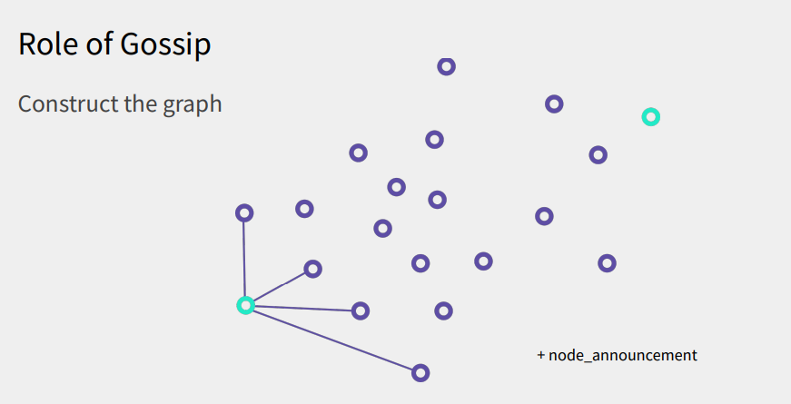

> *作者：Alex Myers*
>
> *来源：<https://btctranscripts.com/bitcoinplusplus/2022/2022-06-07-alex-myers-minisketch-lightning-gossip>*
>
> *本文为作者在 Bitcoin++ 2022 大会上的演讲的转写稿，转录者为 Michael Folkson 。演讲的幻灯片在此：https://endothermic.dev/presentations/magical-minisketch*
>
> *Minisketch 库：https://github.com/sipa/minisketch*
>
> *Rusty Russell 论在闪电网络 gossip 中使用 Minisketch：https://gnusha.org/url/https://lists.linuxfoundation.org/pipermail/lightning-dev/2018-December/001741.html*
>
> *Bitcoin Core PR 审核俱乐部关于 Minisketch 的三次讨论：*
>
> - *https://bitcoincore.reviews/minisketch-26*
> - *https://bitcoincore.reviews/minisketch-26-2*
> - *https://bitcoincore.reviews/minisketch*


## 引言

我在闪电网络的开发上完全是个新手，刚刚才加入 Core Lightning 团队。我准备讨论 Minisketch 以及我从 gossip 网络中学到的东西。

## 话题

我会先聊聊 gossip 协议在闪电网络中的作用。大家都熟悉闪电网络，至少有点研究对不对？我不会花太多时间在闪电网络的工作原理这些背景知识上。但我要解释 gossip 是如何交织到闪电网络的运行中的。然后，我也会概要介绍 Minisketch 的工作原理，讲解一个案例，然后介绍我们可以如何利用它来优化闪电网络的 gossip 。

## Gossip 的作用

我想，通过案例来介绍 gossip 在闪电网络中的作用会比较有趣。所以我们从一笔简单的闪电网络交易开始。

### 发送一笔闪电支付

从普通用户的角度看，所谓的 “闪电支付” 可能就是先打开手机上的钱包 app，然后把摄像头对准一个 QR 码或者一段可以扫描的文字（发票）。然后，app 就会给你交易附言和备注，你验证数额大致正确之后，就点击 “发送”。只要你不是运气很差，只需片刻，手机屏幕上就会出现绿色的勾，表明支付发送成功。

但在场的都是狂热爱好者，所以我认为可以再深入一些 —— 手机屏幕背后，到底在发生什么事》

### 闪电支付 - 进阶

在 Core Lightning 客户端中，有很多命令行命令，可以用来获得更多信息。

```
lightning-cli listpays <BOLT 11>
```

输入这个命令之后，我们可以看到它实际上的经过。支付完成了，就会出现原像（preimage），有点像我们在闪电网络上支付得到的收据。有趣的是，我们可以看出，这笔支付被打散成了 12 笔更小的部分。这 12 条支付路径都是为了完成这笔支付而计算出来的。

```
lightning-cli listpaystatus <BOLT 11>
```

我们再看仔细些。可以看出，客户端不止尝试了 12 条路径，实际上它尝试了 53 次。这就是 “多路径支付”。一部分路径因为超时而失败了。在支付成功之前，我们获得了一些故障信息。这个 CLI 命令会打印出这些数据。但实际上，我们可以断定在每一次失败的尝试中，已经执行的跳跃（转发）的次数；而且我们得到了文本编码的字符串（`0x1007...`）。如果我们将这些字符串传入另一个工具（devtools/decodemsg），我们就可以解码它们。这是 BOLT4 的一部分，该规范指明 `1007` 意味着我们遇上的是 `temporary_channel_failure`（通道临时故障）。

这里还有一种 “错失通道更新故障”（`0x1000` new channel update enclosed），意味着我们错过了该节点宣告的支付转发要求变更。这个中间节点并不知道我们是谁，也不知道支付的最终目的地在哪里，因为所有消息都是洋葱路由的。于是它说：“不管你是谁，我觉得，你应该找错人了。你手上的一些信息已经过时了，我认为你需要看看这个”。在这个案例中，我们可以看到，我们获得了关于这条通道要收取的手续费、其 `cltv_expiry_delta` 数值、我们要给超时时间加入多少区块数量的信息。重要的是这个：`channel_flags=1`。它看起来不起眼，但如果你仔细看看协议规范，你会发现，它表明该通道已经被禁用了。显然，在我们计算转发路径的时候，我们还没有这些信息；它就是这条路径走不通的原因。

### 闪电支付 - 总结

在这个基础案例中，我们学到了什么？即使在这样简单的情形中，为了让这笔支付成功，我们总共利用了 70 条不同通道。关于其中一部分通道，我们的信息已经陈旧了，但我们可以检索一些新的 gossip 消息、更新我们的路由图谱 —— 这个图谱就像是关于网络形貌的地图。使用新的信息，我们可以重新计算我们的路径，从而最终让支付成功。

## Gossip 的作用

回到一开始我们提出的问题：广义来说，gossip 在闪电网络中的作用是什么？就跟生活中的八卦一样（译者注：gossip 的字面意思就是 “闲言碎语”）。Gossip 是你分享的关于自己并不直接沟通的对等节点的二手信息。在闪电网络中，多种多样的节点互相连接。我们可能直接连接了几个节点，但是，比如说，我们位于左下角，我们就需要收集不在这个区域的其它节点的信息。这是通过叫做 `node_announcement` 的 gossip 消息做到的。



这是通过叫做 `node_announcement`（节点宣告）的 gossip 消息做到的。`node_announcement` 信息中给出了一个节点的公钥，以及触达它的网络地址（以备你想跟它建立直接连接）。比如说 IP 地址、洋葱地址或是 web socket，所有你能想象到的方式，都可以包含在节点宣告信息中。

我们想要知道的下一个事情是，通道都在哪里。于是我们有 `channel_announcement`（通道宣告）消息。它的作用是表明节点 A 与节点 B 之间存在一条通道、在区块链上有一笔交易为该通道注资。它会列出 “短通道 ID”，就是你要搜索这条通道以及检查区块链上的哪个 UTXO 为它注资所需的信息。这部分信息对隐私并不好，但在防止拒绝服务式攻击（DoS）上很有用 —— 发送消息的人需要证明自己有一个开设通道的 UTXO。

现在，我们已经了解了网络的基本拓扑，可以找出穿过它的路径。但如果有更多信息，那就更好了。于是我们有 `channel_update`（通道条件更新）信息。这种消息包含的就是比如手续费、该通道愿意转发的 HTLC 的最大数额、是否已被禁用等信息，就像我们在上面的案例中看到的那样。这都是我们在计算路径时帮助我们剔除不合用路径的信息。

现在，我们就有了构造路径所需的一切信息了。但是，为什么我的演讲题目是 “Lightning Gossip Network” 呢？我们刚刚讨论的不是闪电网络吗？简单的回答是，这两个概念并不完全等同。区别在于，我们看到的这些节点之间的连接，是闪电网络中的（支付）通道。但在参与 gossip 时，我们只会跟一部分节点通信。具体的数量取决于实现，我记得 Core Lightning 会使用 5 个对等节点，在你连接到的节点中，你会跟 3 个到 5 个节点 gossip。你的 gossip 对象不需要是你的对等节点。你可以跟任何节点 gossip。它甚至不必是一个节点，只要是一个能够理解协议的机器，可以提供你还不知道的信息，就可以了。只要能收集到关于网络状态的新信息，来回通信是受欢迎的。最重要的细节是，gossip 协议是以洪泛传播（flood propagation）模式运作的。比如你连接到了 5 个 gossip 对等节点，在你从其中一个 gossip 节点那里收到信息之后，你就会广播给另外 4 个节点。这在信息传播的起步阶段是非常高效的，因为你会快速将信息传递给你所有的伙伴。但在信息传出几跳之后，它的效率就开始下降 —— 你开始在多个对等节点处收到一模一样的数据，这就是效率下降的表现。

## Gossip 统计数据

这里是闪电网络状态的基本统计数据。当前，整个闪电网络有 8 万条通道和 1.7 万公开节点。回到前面的洪泛传播模式，如果我们在一个最小规模的团体（三个相互连接的 gossip 对等节点）里面，那就意味着，为了让消息传遍整个网络，我们需要至少 14 跳。而且 gossip 传播有内在的速率限制。实际上，你会批量处理自己收到的所有 gossip 消息，然后等待 60 ~ 90 秒。Core Lightning 使用 60 秒的数值，但我记得 LND 好像是使用 90 秒的循环。你会定期广播所有你收到的新 gossip 消息给你所有 gossip 对等节点。14 跳，每一跳之间间隔 60 ~ 90 秒，这是一个不短的时间。在实践中，我们发现，网络中 95% 的节点会在 13 分钟内收到新消息。你可能需要等待 20 分钟，才能指望每个人都能看到新信息 —— 至少是一个有用的经验法则。

## 什么是 “Minisketch”？

换个挡，我们现在要介绍 “Minisketch” 了。我会尽我最大努力。

Minisketch 是一种集合调解（set reconciliation）协议。什么是 “集合调解” 呢？我们有两个数据集合，你可以从这个韦恩图（Venn）看出它们在很大程度上是重合的。在这种情况下，我们俩的数据都是有效的，而我们希望确保我们都能得到一部分新数据，让这两个集合都得到更新。这时候我们在意的是两个集合之间的 “对称差（symmetric difference）”。这就是 Minisketch 帮助我们的地方。如果你跟几个月前的我一样，那么你可能会认为这是一个很难解决的问题，尝试调和这两个集合会付出不小的开销。你可能会发送超出严格必要的信息，因为你不知道对等节点缺少什么。但就像我一样，你可能是错的。Minisketch 有一些非常棒的特性。

### 背景

Minisketch 实际上来自一个叫做 “BCH 纠错码” 的纠错码家族。它使用一种映射（map），就像 Berlekamp-Massey 算法一样。我准备将一个非常简单、非常抽象的例子。

### BCH 例子

设想我们有两组数据，分别包含元素 `(1, 2, 3)` 和 `(1, 2, 3, 4)`。

如果我们想要调解这两个集合，一种很棒的技巧是确保两者都拥有所有的数据。我们分别计算出这两个集合中所有元素的和，那么一个是 6，另一个是 10 。如果我们在左边这个集合中，我们想要跟右边这个集合同步，于是我们说：“这是我这个集合内元素的和，是 6 。我们取两个集合的差值，就是 `10 - 6 = 4`，这就是我这边缺失的元素啦”。这当然很棒，而且基本上只是在做减法。但是，这只对相差一个元素的情形有效。只要相差不止一个元素，那就行不通了。但这时候，我们又有另一种技巧。

假设我们想要编码两个差值，我们可以将所有元素的简单和放在数组中 ——— 这就是我们的数组，数组的第一个元素是集合中所有元素的简单和，第二个元素则是集合内所有元素的平方和。这都是基本的数学。这个数组就是我们要传递给其他人的东西。现在要调和两个差值，是原来的两倍。我们可以把这两个差值放在一起：“第一个差值是元素简单和的差值，第二个是元素平方和的差值”。回想我们学过的代数知识：这里有两个等式，有两个未知数。那就是可以求解！

随着差值的数量增加（阶数也增加），它会逐步变成非常难解的问题。这就是用到 Berlekamp-Massey 算法的地方，它是非常高效的解法。

### 构造一个大草图

对任意规模的集合，我们都可以应用这种方法。阶数可以一直上升到 n 。显然，阶数越大，求解所需的时间越长。你必须编码每一个条目，直到上升到获得 n 阶。但它确实有用，我们可以求出两个集合之间的差异，不管涉及到的元素数量有多少。

### Minisketch

Minisketch 库：https://github.com/sipa/minisketch

这是一个 C++ 库，由 Pieter Wuille 开发。它实现了 PinSketch 算法。它可以在各种架构和硬件上运行。它使用一些表，以优化求解根值的过程、节约时间。Pieter 还得出了一个纯粹的 Python 实现，这本身就让人惊讶。它只需要 500 行代码，就可以运行各种足以塞爆我的脑袋的计算。而且代码非常好读，推荐你自己到 GitHub 页面看看。

## 使用 Minisketch

但是，假设你像我一样，只是个工程师。该如何在实践中使用这种有趣的数学呢？就像这样：

首先，我们初始化一个草图（sketch），为此，我们需要知道我们想要编码的数据的宽度。在这里我们讨论的是 64 比特宽。我们先填入数据的宽度，然后填入容量。容量就是我们希望能够在两个集合之间调解的差异元素的数量。如果我们认为两个集合之间可能会相差 5 个元素，那么我们可以选择数值 8，也就是确保我们稍微超过。但我们也不想超出太多。然后，我们就把我们的集合数据输进去，计算出综合值。这个过程就像我们在 “构造一个大草图” 一节说的。然后，我们将结果序列化，并从 Alice 传输到 Bob。

Bob 会经历一个完全相同的流程。他建构自己的草图，然后合并两个草图。这是非常有趣的，他需要选择相同的数据宽度，但容量可以有所不同。数学原理使得你可以随时截断这个数组，从而两者相等、你可以合并这两个草图。容量是稍微宽松的（并不等于差异元素的数量），但依然可以很好地解决。然后你使用 Berlekamp-Massey 算法，解出的结果就是这两个集合之间相差的元素。

### 黑箱特性

这套数学在使用的时候有那些属性？它支持从 2 比特宽到 64 比特宽的数据。真正酷的东西是，草图在序列化之后的体积，也就是要在节点间传输的数据的体积，就是草图的容量（也就是你想要求解的差异元素的数量）乘以数据宽度。如果你所选择的草图容量恰到好处，那么你可以从数据中获得 100% 的效率（被传输的数量体积恰好等于你抽取出来的缺失元素的体积）。

```
草图序列化体积 = 草图容量 * 数据宽度
```

它让我大吃一惊。不过还有一些别的事情要提醒。随着你增加草图的容量，调解的时间会（线性）上升。取决于你真正想要求解的差异元素的数量，调解时间会平方级上升。所以我们都希望约束差异元素的数量。你也不想在了解集合的差异有多大的时候就被冲垮。

### 局限性

还有些记住几个基本事项。在初始化草图的时候，你不能编码零个元素。别的数字都可以，就是不能为零。另一件事情是，确保每个草图中的元素的数量、两个集合件的差异不是非常大（不会超出草图的容量），也是有用的。一般来说这不会是个问题，但假如你在一个草图中有 50 个元素，而在另一个草图中有 100 个元素，但你的草图容量仅仅是 10 。那就无法求解了，因为容量根本不够。不过，好的事情是，如果无法求解，它会给你一个警告，它会说“ 我找不出任何能够满足这个等式的多项式”。大部分时候都能做到这个效果。

## Erlay

以下是关于我们将来如何使用这项技术的背景。比特币网络也面临跟闪电 gossip 网络极为相似的问题 —— 洪泛式的交易传播无法很好地拓展。如果你听过 Erlay 协议的话，你可能知道，那就是 Minisketch 的开发目标。Erlay 使用 Minisketch 来编码交易池中的每一笔交易。然后你就可以跟比特币网络中的对等节点分享草图。交易 ID 是 32 字节宽，但在 Minisketch 中我们只有 8 字节的数据宽度。所以我们需要将交易 ID 压缩成一个体积更小的指纹，从而知道我们找出的差异元素代表着哪一笔交易。有一个哈希函数可以做到这件事。

节点还会协调 inventory 集合。这是另一个会让事情复杂少许的因素。假设我们有一整个交易池，一种办法是将每一笔交易都编码进一个草图、所有对等节点都要做这件事，然后都要求解、看看彼此的交易池有什么差异。但这跟 Erlay 的工作原理不一致。Erlay 做的事情是，节点跟踪与自己沟通的每一个对等节点，然后节点表示 “自我们上一次通信以来，已经过去 15 秒啦，我把我想要告诉你、但还没告诉你的事情列了个清单（inventory）。这是我希望告诉你的 5 件事。”与此同时，你的对等节点 Bob 也做完全相同的事情，但也许他收集了 7 件事。Erlay 不会要求编码交易池中的交易（可能有几千笔交易），而只会要求编码这 5 笔交易和 7 笔交易。我们调和两者，也许会发现它们之间只有 3 个差异。一旦调解完成，这些 inventory 集合就会清空，然后两个对等节点进入下一个轮次：记录接下来 15 秒内发生的新鲜事。

## 闪电网络 Gossip vs. 比特币交易转发

比特币网络在交易转发上面临的问题跟闪电网络 Gossip 是极为相似的，但也有少许不同。其一，任何时候，你想要用短哈希函数来产生 64 比特的指纹，都要担心碰撞问题。有些人可能会利用这一点，反复尝试，找出会产生相同指纹的交易 ID（本身是一个哈希值）。这就成了一个拒绝服务攻击界面。这的确让人心生顾虑。此外，是对隐私交易的时序分析（timing analysis）。在 gossip 中，不需要隐藏什么，因为所有信息都天然是公开的。此外，我们有一种小技巧，从而可以不使用哈希函数。我们不仅有一种数据类型，我们想转发的消息有 3 种类型。

### 在 Gossip 中应用

这些消息有 `channel_update`、`node_announcement` 和 `channel_announcement` 三种类型。`channel_announcement` 包含了关于手续费、通道使用状态（激活或禁用）、可支持的最大 HTLC 数额等等信息。这可能构成了 gossip 网络流量的 97%，这是很大的比例，所以我们想要更加高效。前面的两种消息（`channel_update`、`node_announcement`）只有两个星期的有效期，所以它们会被反复广播。

### 挑战

我们的挑战是，我们要编码所有 3 种消息类型。我们只能使用 8 个字节，但我们有个工具，是 “短通道 ID（SCID）”。这是将一条通道与区块链上的注资交易关联起来的信息。区块链上的每一笔交易都是独一无二的。这就是我们可以使用的很棒的捷径。在 `node_announcement` 中不包含任何关联到该节点的通道，所以它难以使用短通道 ID。理想情况下，我们会引用节点 ID，也就是节点的公钥。但是公钥也有 32 字节宽，所以我们不得不哈希它，或者做别的什么处理。

### 编码方案

实际上，在编码这些信息时，我们可以使用这些数据：区块高度、交易索引、输出索引，这是短通道 ID。我们可以通过表明 “该节点的最老通道”、指出该节点在通道哪一边，来引用一条节点宣告消息。这样我们就有了一种方法来连贯地定位我们讨论的是哪个节点。这通常来说就是 8 个字节的数据，而且我们就要尝试把它塞进 8 个字节里面。我们所做的不过是削去我们并不需要的少量比特。如果一个区块只包含 32000 笔交易，那这可能就够用了。如果你要给一条闪电通道注资，注资交易不太可能会有 1000 个输出。我们已经节约了一些字节，因此，有空间留给别的信息，比如消息的类型，以及该节点在通道的哪一边。这就是我们用恰好 64 个比特来定位我们要传播的是哪种 gossip 消息的方法。最后，我们还有时间戳。对于那些定期发送的消息，我们需要知道哪一条更新，哪一条更旧。有一些比特能够区分它们会带来帮助。

### 集合调解的好处

这有什么吸引人的呢？简短的回答是：我们可以节约至少 60% 的 gossip 带宽。完成这些工作之后，我们就可以跟更多对等节点沟通。跟更多节点沟通是非常好的事情，因为这能提高 gossip 传播的可靠性。尤其是，节点宣告消息在过去饱经磨难，因为对另外两种消息，有一些简单的启发法可以分辨你是否错过了它们。对通道更新消息，我们已经在开头的案例中看到了，在最坏情况下，我们的支付路径会失败，而报错的包裹就会带来更新，我们可以得到反馈。但节点宣告消息呢，它告诉了你该节点的 IP 地址。如果该节点的 IP 地址改变了，而你没有看到，那你可能再也无法连接到它。这是非常糟糕的，而且有望能从增强的可靠性中获得真实的好处。

## 下一步呢？

我还有几个悬而未决的问题。其中一个问题是，我们可以维护全局草图，也可以采用对应不同对等节点的 inventory 集合。这两种方案都有各自的论据。

还有一件事是，我们在接收 gossip 消息时也有速率限制。如果我们对 gossip 消息的速率限制非常严格可以极大地减少我们的草图容量。对于选择性使用这种集合调解功能的实现来说，如果人们能够对以什么时间尺度来限制速率达成一致，那就太好了。我倾向于使用区块高度。我正在努力说服大家。如果我能将每一条 gossip 消息都跟当前的区块高度关联起来；比如说，每一个区块收取一条 gossip 消息，或者每 100 个区块收取一条，等等。这是非常容易验证的，因为你已经在运行全节点了。

最后，从长远来看，我们真的希望在 gossip 中摆脱短通道 ID，因为它确实会泄露隐私。你肯定不想公开你所有的未花费交易输出。现在我们还完全没有准备好，然而一旦开始这样做，就会走向对应不同对等节点的 inventory 集合方案。这可能已经指明了我们当前应该选择什么。 

## 结论

Gossip 消息让我们能够构建对整个闪电网络的视图并找出路径。Minisketch 真的很酷，大家都应该去看看。希望我们能够利用它来提高闪电网络 gossip 消息的可靠性。

（完）