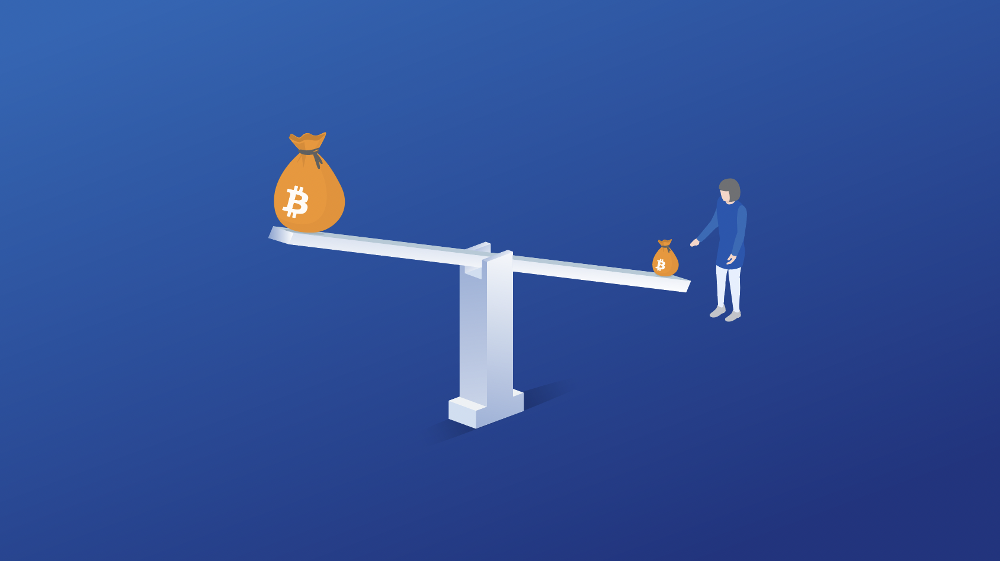
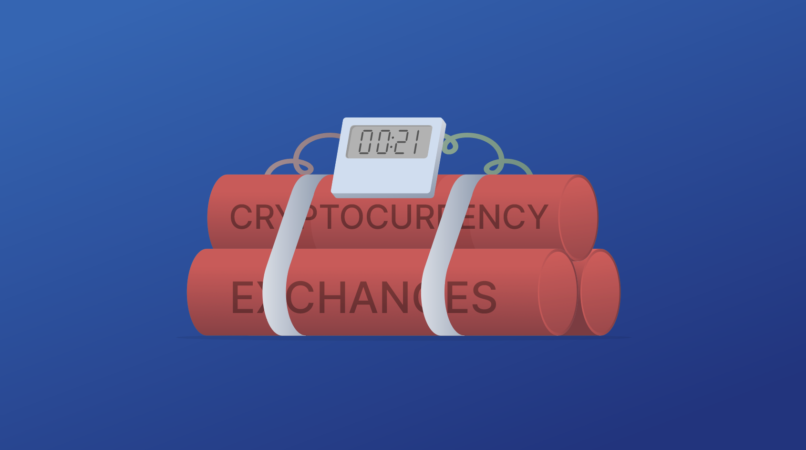
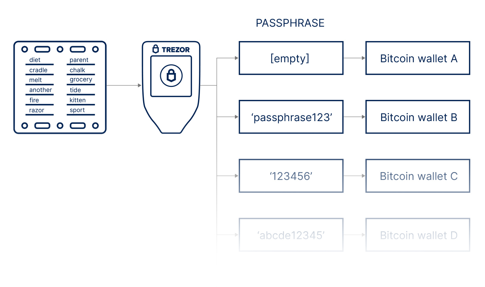
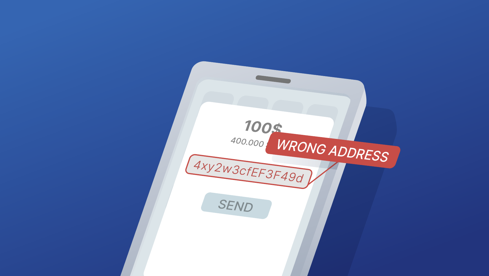
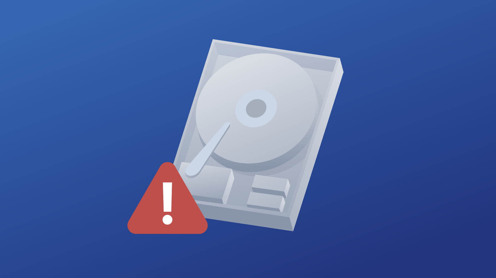
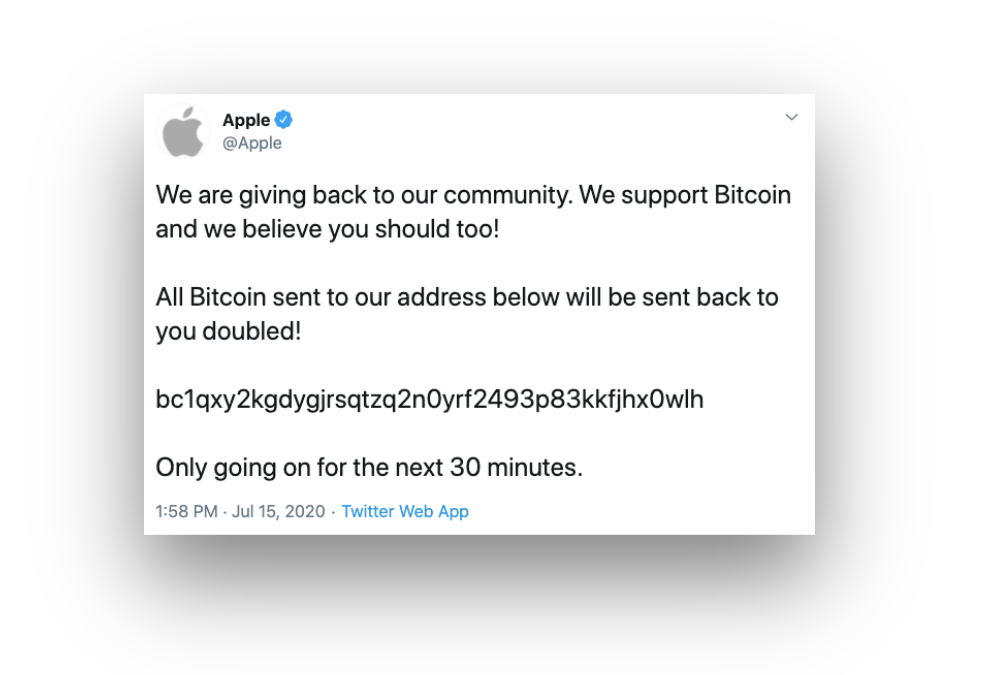
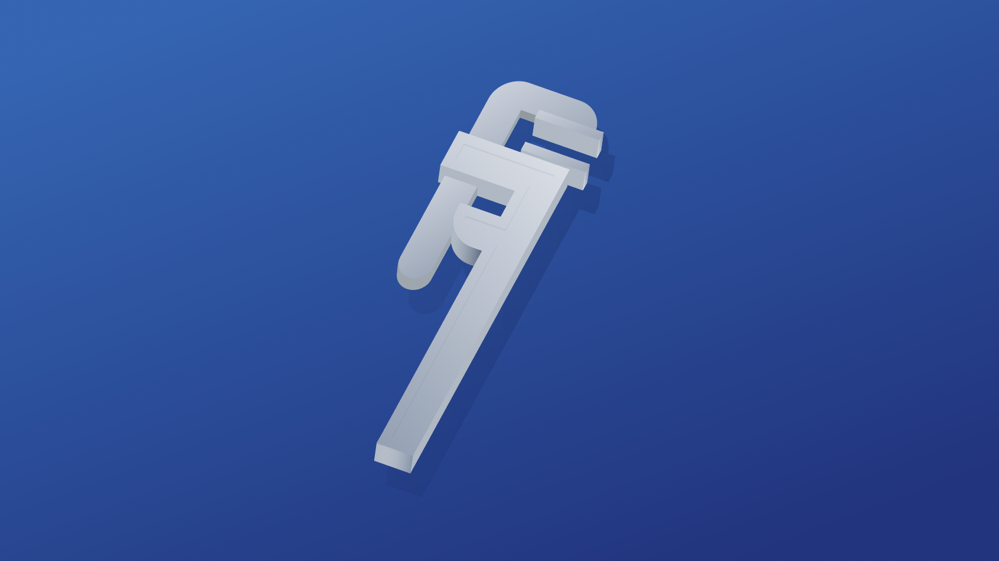
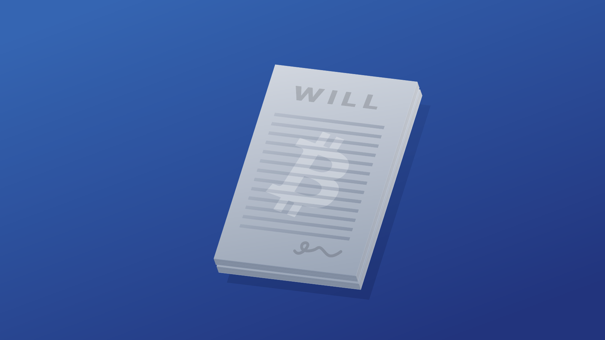

> *作者：Ted Stevenot*
> 
> *来源：<https://unchained.com/blog/21-ways-lose-bitcoin/>*

根据[不同的](https://blog.chainalysis.com/reports/bitcoin-market-data-exchanges-trading/)[报道](https://twitter.com/glassnode/status/1339989964298268673?lang=en)，比特币流通量中可能已经有 10%~20% 永远丢失。但是，相比其它类型的资产，“丢失”对于比特币来说有着不同的含义。从技术角度上来说，凡是[已经发行](https://unchained.com/blog/how-many-bitcoin-are-there/)的比特币都 100% 存储在比特币区块链上。所谓的 “丢失” 指的是丢失比特币的 *支配权限*。

以下是常见的比特币丢失原因。尽管它们在很多方面都有不同，但是大多数都是因为支配权限泄露，例如，人身暴力、交易对手风险、盗窃、诈骗等。另外，也有很多用户因操作不当或狂妄自大而丢失比特币。

## 1. 交易

人们通常会被短线交易策略吸引，期望快速获利，然后再投资赚取更多比特币。这类交易策略，尤其涉及到杠杆和套利这类高风险形式时，通常会让没有经验的人大失所望，甚至出现净亏损。

为了赚取手续费，很多交易所通常会鼓励这种交易行为。但是，短线交易策略的问题在于市场是不可预测的，而且波动性很强。尤其是山寨币，价格[大起大落、瞬息万变](https://www.cnet.com/personal-finance/crypto/luna-crypto-crash-how-ust-broke-and-whats-next-for-terra/)。

由于大多数人在交易时容易被情绪左右，往往会做出糟糕的交易决策 —— 尤其是在承受巨大的压力之时。只要时间线拉得足够长，绝大多数业余交易者所能留存的比特币，都比不上它们单纯囤币所能积累的数量，甚至专业交易员也不例外。

## 2. 交易所托管风险

密码学货币交易所是人们获取比特币最常用的途径。由于交易所持有大量比特币，它们也是攻击者眼里的“肥肉”。

交易所采取多种手段保护用户的比特币，但是通常不会完全公开它们的安全措施。而且它们给你的比特币往往都存储在交易所控制下的冷钱包里。将你的比特币存储在交易所账户中会面临多种风险：

- 凡是能够获得交易所私钥的人都能偷走其用户的比特币，包括网络攻击者、居心不良的员工和其他作恶者。

- 如果有攻击者获取了某个交易所账户的登录凭证，就可以窃取这个账户里的比特币，然后发送到自己的地址上。这类攻击通常涉及 SIM 卡交换攻击，我们之后会讲到。

- 由于密码学货币交易所是一种相对较新的法人实体，相关投资者保护制度还[不够完善](https://news.bloomberglaw.com/bankruptcy-law/if-a-crypto-exchange-goes-bankrupt-what-happens-explained)。SIPC 保险这样的保护措施不覆盖密码货币交易所，所以假如他们破产，用户也得不到补偿，不像传统经纪上的客户可以靠 SIPC 从破产的公司收回一点残值。

- [如果交易所破产](http://linktootherpost.com/)，交易所的债权人可能会优先于交易所用户获得赔偿，导致用户损失比特币。

- 交易所持有的比特币有因交易所政策和政府法令而被[冻结或没收](https://www.coindesk.com/layer2/2022/02/22/frozen-bitcoin-tied-to-canadian-protests-lands-at-coinbase-cryptocom/)的风险。

为了避免由交易所持有比特币而招致的种种风险，最简单的解决方案是在买入比特币后尽快转入[自托管钱包](https://unchained.com/blog/introducing-multisig-vaults/)。

## 3. SIM 卡交换攻击

这种丢币风险有时包含在交易所风险中，但它又十分特别，值得被单独拿出来介绍。从银行到密码学交易所，很多实体都将短信双重认证作为保护用户账户的手段。

- [SIM 卡交换攻击](https://en.wikipedia.org/wiki/SIM_swap_scam)是指，不法分子获取足够多受害者的个人信息，伪装成受害者取得电信运营商的信任，将受害者的手机号绑定到自己控制的手机上。

- 有时候，只要控制了手机号，就可以窃取在线账户的认证信息。

- 在密码学交易所场景下，攻击者利用认证信息（通常因在线数据泄露而暴露）和短信验证登录受害者的账户，将受害者的比特币发送至由攻击者控制的钱包。

为了抵御 SIM 交换攻击，可以的话，请使用[身份验证器应用](https://www.pcmag.com/picks/the-best-authenticator-apps)。这类应用会在你的设备和你正在使用的服务商之间共享一个唯一的动态验证码。重要的是，身份验证器应用不会与你的手机上的 SIM 卡连接，能够为你的账户提供比简单的短信验证更高的安全性。如果你有账户需要使用短信验证，可以联系你的电信运营商禁止手机号移植。

## 4. 丢失助记词

- 比特币助记词备份 -

丢失[助记词](https://unchained.com/blog/what-is-a-bitcoin-seed-phrase/)是人们丢失比特币的常见原因。助记词就是你的钱包的秘密值，可以用来生成密钥，让你能够花费比特币。如果你的钱包设备失灵、丢失、被盗或损坏，你可以使用助记词在另一台设备上恢复钱包连同里面的比特币。

以下几种错误可能使人弄丢助记词：

- 没有正确备份助记词

- 没有按照正确顺序抄写助记词

- 助记词的纸质或金属备份丢失

- 将助记词备份放在了不安全的地方，例如，手机相册或云账户之类的网络媒介。如果被不法分子拿到，他们就可以偷走你的币

- 在装有恶意软件（比如键盘记录器）的设备上输入了助记词

如果你不想因设备丢失、失窃、损坏或失灵而丢失比特币，[请使用物理媒介备份你的比特币钱包助记词](https://unchained.com/blog/seed-phrase-backup-methods-recording-paper-metal/)，并[保存在安全的地方](https://unchained.com/blog/how-to-store-bitcoin-seed-phrase-backups/)。这样一来，即使你的钱包设备丢失，你仍能找回自己的比特币。

## 5. 使用单签名口令（passphrase）

很多比特币钱包都支持用户在助记词的基础上再[添加一个口令](https://unchained.com/blog/bitcoin-singlesig-passphrase-vs-multisig/)，作为另一道安全保护层。

简单来说，这个密码的特点是：

- 就像是你为自己的钱包添加的第 13 个或第 25 个助记词。

- 可以使用字母、数字和特殊字符，长度不超过 50 个字符。

- 区分大小写。因此，即使只有一个字母大小写不对，也会导致你无法访问钱包。

- 不支持口令重置

添加口令的确有助于提高安全性，但是也会引入新的风险。不同于 PIN，这个密码对于构建你的钱包本身来说至关重要。**如果你丢失或记错了密码，你将永远无法再动用你的比特币**。如果你使用了口令，务必再三确认你已经正确备份，并将备份保存到了安全的地方。

## 6. 恶意软件

恶意软件是出于恶意目的（包括窃取比特币）篡改和破坏你的设备的软件。手机、台式机和 web 客户端都有可能遭到恶意软件的毒手。例如：

- [CryptBot](https://malpedia.caad.fkie.fraunhofer.de/details/win.cryptbot) 之类的信息窃取程序会从受害者的电脑中窃取大量数据，包括网络账户和比特币钱包的认证信息

- [Clipper](https://medium.com/immunefi/the-malware-that-swaps-your-address-and-drains-your-wallet-552915fba542) 能够在你通过钱包软件将某个比特币地址复制到电脑剪贴板之前或之后替换掉该比特币地址

- [Cryptojacking](https://en.wikipedia.org/wiki/Cryptojacking) 会偷偷利用你的电脑挖矿

- 安装在手机上的第三方应用会监控你的设备，为想要窃取你的敏感信息（如，登录密码和助记词）的不法分子打开了方便之门

为了抵御恶意软件的攻击，请将你的设备的操作系统和应用更新至最新版本，确保你所使用的应用都下载自官方渠道，并定期查看应用权限。在硬件钱包上验证地址并通过渠道外手段（即，电话、邮件、短信等）核实准确性是个不错的办法。

归根结底，保护大额比特币存款的最佳方式是升级你的托管模式：硬件钱包存在的意义是将你的私钥与可能被恶意软件入侵的设备分开，多签则有助于消除单点故障。

## 7. 假比特币钱包

假比特币钱包骗局是骗你下载一个新的钱包，或将原有钱包“更新”成由骗子控制的假钱包。其套路是：骗子伪装成客服发送一条钓鱼消息，称你的钱包需要更新，并提供一个链接将你引导至高仿界面进行升级。等你再次使用这个钱包时，就会在不知情的情况下授权骗子[转走你的钱包里的所有比特币](https://www.zdnet.com/article/bitcoin-wallet-trick-has-netted-criminals-more-than-22-million/#ftag=RSSbaffb68)。

为避免陷入这类骗局，务必直接通过官方渠道下载钱包软件。如果是移动应用，请从苹果应用商店或 Google Play 上下载（此处依然不能掉以轻心，[因为有些骗子已经突破了防线](https://www.reddit.com/r/Bitcoin/comments/4wnd7c/alert_apple_store_just_added_another_scam_wallet/)）。如果是非移动应用，请直接从供应商的官网下载钱包软件。

## 8. 将比特币发送至错误地址

将比特币发送至错误地址也会导致比特币丢失，不管是复制错了地址还是输错了发送额。为避免这种情况，请在每次转账时都确认地址和数额是否正确。手动输入地址或扫描二维码可能会有帮助。验证时检查地址的[第 1 个字符和最后 4 个字符](https://bitcoin.stackexchange.com/questions/76599/checking-the-first-and-last-characters-of-a-cryptocurrency-address)通常就足够了。如果你使用的是硬件钱包，也[可以通过兼容设备来验证设备上的存款地址](https://help.unchained.com/how-to-verify-receiving-address-on-hardware-wallet)，从而确认你的支付目的地址确实是你自己的。

有一个误解是，如果你不小心输错了收款地址，你的比特币就有可能被发送到一个不存在的地址上，再也无法找回。大多数前沿的比特币钱包都使用[校验和](https://learnmeabitcoin.com/technical/checksum)来验证地址中是否存在错误，防止你将比特币发送到无效地址上。你误打误撞输出有效地址的[概率是 43 亿分之一](https://bitcoin.stackexchange.com/questions/194/what-happens-if-i-mistype-the-address-when-making-a-payment#:~:text=Bitcoin address include checksums%2C so,the coins are effectively destroyed)（比强力球彩票中奖的概率还低）。

## 9. 存储介质退化

用来存储私钥或助记词备份的介质会随着时间流逝发生退化，这种情况又叫作“[位衰退（bit rot）](https://en.wikipedia.org/wiki/Data_degradation)”。位衰退可能会发生在任何设备上，包括存储你的比特币钱包的设备，由数据损坏、机械故障和自然衰退等一系列因素导致。

有一些存储设备比起其它存储设备更容易退化。例如，机械硬盘比动态硬盘更容易退化，因为前者内部的移动部件会发生磨损。也就是说，任何带有存储介质的设备（包括比特币硬件钱包在内）都会面临位衰退问题。如果你所使用的设备上的存储介质失效，你就会永远失去你的比特币。

为了防范这一风险，请离线保存助记词备份。为了提高安全性，可以考虑[备份在金属助记词板](https://unchained.com/blog/seed-phrase-backup-methods-recording-paper-metal/)上，更能经受时间的洗礼。

## 10. 钓鱼骗局

钓鱼是一种[社会工程学攻击](https://www.investopedia.com/terms/s/social-engineering.asp)，作恶者通过电子邮件、通讯应用、短信或其它通信形式对受害者进行心理操控，说服他们泄露自己的敏感信息，例如，比特币钱包的登录信息、口令、PIN 码和助记词。

防范钓鱼攻击的关键在于学习如何在点击钓鱼链接或泄露敏感信息之前[识破它们](https://unchained.com/blog/bitcoin-phishing-defense/)。对于比特币用户来说，尤其要注意的是，*永远不要在回复不明消息时泄露你的助记词*，在不确定自己是否真的遇到问题时，通过其它通信媒介（如电话）进行确认。

### 伪造身份骗局

如果你是推特、Instagram 或其它热门社交平台的用户，那你对[伪造身份骗局](https://www.investopedia.com/terms/c/cat-fishing.asp)应该不陌生。在这类骗局中，“披皮”真人或机器人会试图说服你相信他们是名人或网红。为了骗你上钩，他们会伪造详细的身份资料。

通常情况下，这些骗子会跟你套近乎，通过点赞、关注或私信等方式与你建立联系。他们的最终目的是访问你的比特币钱包，或让你用比特币向他们换取虚假服务，如，比特币交易策略。

防范这类骗局的最佳方式是保持合理的怀疑态度。你可以采用以下几种方式来识破这些“披皮”诈骗犯：

- 寻找用户资料地址的细微差异，例如，多字符或缺字符

- 在语境中寻找线索，例如，不通顺的语句或不常见的措辞 

- 查看关注者数量，只有几十个关注者的知名网红很可能是骗子

- 如有可能，寻找[经过验证的用户徽章](https://en.wikipedia.org/wiki/Twitter_verification)来确认用户资料是否合法

### 祖父母骗局、甜心骗局和其它社交骗局

有时，人们会被[祖父母骗局](https://consumerfed.org/pdfs/Grandparent-Scam-Tips.pdf)骗走比特币。在祖父母骗局中，不法分子专向父母辈或祖父母辈的人下手，欺骗他们有子女、孙子孙女或其他亲属陷入了麻烦，只有尽快交出比特币才能解决。骗子通常会建议受害者去比特币 ATM 机，存入现金，随后将比特币发送到某个地址。

不法分子经常通过公共网站、社交媒体、[交友网站](https://www.nytimes.com/2022/02/21/technology/crypto-scammers-new-target-dating-apps.html)，甚至[讣告](https://www.aarp.org/money/scams-fraud/info-2020/obituary.html)搜索受害者的个人信息。他们会利用这些信息对受害者发动感情攻势，让受害者相信他们的亲人或爱人需要帮助，但是远在异国他乡，必须通过比特币尽快汇钱过去。

就像现金一样，比特币一经易手无法追回。因此，防范这类骗局的最佳方式就是教育用户如何识别它们。你还可以帮助家人保管比特币：他们的转账交易必须经过你或另一个托管者会签才可以执行。

## 11. 定金诈骗

定金诈骗利用比特币付款的不可逆性从人们手中骗取比特币。攻击者会在公共论坛、分类广告或社交媒体上出售诱人的高价商品（如，比特币矿机），并要求受害者[使用比特币预付定金](https://consumer.ftc.gov/articles/what-know-about-cryptocurrency-and-scams)。一旦定金到账，骗子就会跑路，受害者钱货两空。

防范这类骗局的方法就是永远不要使用比特币支付定金，除非你绝对信任你的交易对手。即便如此，鉴于比特币付款的永久性，也应避免使用比特币支付商品或服务的定金。在某些情况下，可以请第三方托管服务介入，确保交易相关方达成合作。

## 12. 庞氏骗局

在庞氏骗局中，骗子会以提供定期利息之名骗用户投入比特币。但是，他们承诺的利息通常都是非常不现实的。例如，有一个骗局承诺高达 7% 的周利率，并称资金的用途是“……[通过比特币套利活动获取回报](https://www.sec.gov/files/ia_virtualcurrencies.pdf)。”但是，骗子只支付了“利息”和他自己的成本，用的是直接从受害者那里获得的比特币。

这类骗局很容易骗取受害者的信任，一部分原因是投资者在初期收到了利息，相信了投资策略正在如承诺般执行。但是，终有一天钱会花完，狂欢结束，投资者再也拿不回他们的本金。这类骗局还有另一种套路，即，承诺以未来会增值的山寨币或其它代币支付利息。防范这类骗局最好的办法就是谨记这句老话：“如果听起来像是天上掉馅饼，那很有可能是陷阱。”

## 13. 使用不靠谱的借贷平台

很多密码货币借贷平台会以个位数乃至高得惊人的回报率吸引用户投资。其底层逻辑与在银行购买定期理财产品有些相似。当你在银行账户里的存款可以赚取更高的收益时，银行会向你支付利息，以换取一定时间段（6 个月、1 年、2 年，等等）内你的资金的使用权。如果提前取出资金，你可能要支付罚金。在合法情况下，这类理财产品可以帮助银行吸收更多流动性，通过其它借贷形式赚取更高的收益。

如果是不靠谱的借贷平台，一旦因过度贷款或承诺收益率过高而产生对手方风险，用作质押物的比特币将岌岌可危。默认情况下，比特币质押物可能会被清算或赔偿给债权人，导致质押者失去比特币。此外，鉴于比特币的托管方式，在中心化借贷平台上质押比特币同样存在如上文所述的一系列交易所风险，包括黑客攻击、员工盗窃、登录信息泄露、资金冻结和政府没收。

## 14. 以 1 换 2 骗局

这是一个显而易见的骗局，看起来不会有人上当。但是，根据以往出现过的案例来看，这类骗局似乎有一定的规律性。骗子会发布消息称：“[只要发送 1 BTC 给我们，我们会还你 2 BTC！](https://en.wikipedia.org/wiki/2020_Twitter_account_hijacking)”结果显而易见，受害者发送了 1 BTC 过去，骗子就再无音信。

- 苹果公司的账号就是 2020 年被黑的众多账号之一 -

如果有人跟你说：“给我转 1 BTC，我会还 2 BTC 给你！”，这就是骗局。正常人不会提供这种交易。除了惯用话术之外，我们在“伪造身份骗局”一节中讲到的细节也可以作为判断依据，例如，未经验证的用户资料、带有错别字的用户名、奇怪的表达（“你的交易过得怎么样？”），以及账号关注量少得不符合其正主的影响力。

## 15. 5 块钱扳手攻击

“5 块钱扳手攻击（[$5 wrench attack](https://bitcoinmagazine.com/culture/the-5-wrench-attack-and-your-bitcoin-stack)）”就是犯罪分子觉得你持有大量比特币，试图通过人身威胁迫使你交出比特币。由此可见，比特币赋予了个人更高的主权，个人也要相应承担更大的责任。对此，你可以采取一些防范措施来降低相关风险，包括

- 不要告诉别人你拥有比特币

- 不要悬挂比特币旗帜、穿印有比特币的衣服、在你的汽车或笔记本电脑上贴比特币贴纸

- 学习[比特币用户如何防止自己的隐私性被公共记录曝光](https://youtu.be/D_bXqKGZzpM)

- 采取措施加强你的人身安全保护，可以考虑买个保险箱、安装门闩或报警系统，至少养条狗吧。

- 学习相关法律知识来保护你的财产

除了上述措施之外，最好的解决方案是使用多签机制，且密钥存放在不同的地理位置。这样一来，即使攻击者得到了藏在某一处的密钥，也无法抢走你的比特币，必须前往其余地点寻找剩下的密钥。

## 16. 信任亲朋好友

比特币的特殊之处在于：只要有人知道你的私钥或有办法获得你的私钥，就能花费你的比特币。因此，如果你出于信任将你的私钥告诉了亲人或其他人，他们就能花费你的比特币。

虽然你应该让你最亲近的家人（如配偶）知道你持有比特币（具体原因会在下一节解释），告诉他们过多信息可能会造成不必要的风险。请谨慎分享你的助记词和硬件钱包的存放地点，以及你的比特币托管模式和持币数量。

你今天信任一个人不代表你今后也可以一直信任他。你可以采用多签之类的托管模式与他人共同持有私钥，但是不要让任何人完全控制你的资产。

## 17. 不当遗产规划

泄露过多信息可能会导致你丢失比特币，秘而不宣也是一样。没有做好遗产规划就是个例子 —— 比特币持有者在去世前没有告诉亲人自己持有比特币，或没有告诉继承人自己的比特币钱包或助记词放在哪里。除了上述担忧，[遗产继承所涉及的法律问题](https://unchained.com/blog/how-to-inheritance-plan-unchained-vault/)也有可能影响你的比特币的处理方式。

合理的遗产规划包括向律师咨询遗嘱、信托或其它适合在你去世后帮你分配财产的遗产规划工具。

如果你需要遗产规划方面的帮助，在当地找一位优秀的规划师会很有帮助，因为你的居住地对遗产规划规则有决定性的影响。

在做好遗产规划的同时，你还要解决继承人如何获取你的比特币的问题。通常情况下，对方可能不像你这么了解比特币的内部运作原理。因此，多签，尤其是协作式托管，是绝佳工具。

## 18. 过于复杂的安全措施

太过注重安全性也会导致你丢失比特币。有的人尝试通过数字方式加密他们的助记词备份，或将助记词拆分开来放到不同的地方（例如，将由 12 个词或 24 个词组成的助记词拆分成两半，分别藏到不同的地方）。有的人在使用多签机制时将密钥分成了太多部分，就像下一节中提到的那样。还有的人会将自己的比特币存储在多个硬件钱包内，分别藏到很多隐蔽的地点。

就像上面提到的几个例子，安全措施过于复杂时，反而会产生新的风险：

- 因无法重复自己创建的备份方案的复杂步骤而丢失比特币

- 因未能将详细的备份计划告知爱人或继承人而丢失比特币

当你心存疑虑时，请牢记基本原理。私钥（即，可由人类可读的助记词推导而得）是一种绝佳的安全系统，连全球最强大的政府都无可奈何。解决方案[是以保护私钥的最佳方案为核心](https://unchained.com/blog/how-to-store-bitcoin-seed-phrase-backups/)，可以适当增加额外的防护层，如多签，从而在避免访问壁垒过高的同时增强安全性。

## 19. 不合理的多签人数阈值

多签比特币钱包使用 *多对密钥* 而非单对密钥创建。为了增强安全性，花费多签钱包中的比特币时，需要得到预定数量的密钥签名授权。

多签钱包花费比特币所需签名比例通常表示为 “m/n”：

- n 表示创建钱包使用的密钥对数

- m 表示花费比特币所需的签名数量

授权花费所需的人数最低可以设置为 1 个，最高可以设置为所有密钥。

多签是一个强大的工具，可以帮助个人、公司和机构保护其比特币储蓄。这一工具同样可用于[遗产规划](https://unchained.com/blog/how-to-inheritance-plan-unchained-vault/)，例如，在“2/3”多签机制中，密钥之一由遗嘱执行人持有，其余由继承人持有。

多签的风险是将授权花费所需的密钥比例设置得过高或过低。如果需要的密钥过多（5/5），只要其中一对或多对密钥丢失，你就再也无法支配自己的比特币。相反，如果需要的密钥过少（1/5），花费你的比特币会很容易，只要其中一对密钥的助记词泄露，你的比特币危矣。

解决方案是[为你的多签钱包设置](https://unchained.com/blog/bitcoin-multisig-2-of-3-vs-3-of-5/)合理的阈值，在安全性和冗余管理难度之间达到平衡。

## 20. 硬件钱包被黑

硬件钱包是保护比特币的最佳方式之一，但并非毫无风险。如果作恶者在硬件钱包被终端用户激活之前黑入，他们就可以篡改设备，伺机窃取用户的比特币。

硬件钱包在设备内部存储私钥并签署交易，因此私钥永远不会离开钱包。不同的硬件钱包在设计上各有不同，有的使用了多个内部芯片，有的只使用了一个芯片。如果攻击者可以触碰到设备，例如，通过[供应链攻击](https://en.wikipedia.org/wiki/Supply_chain_attack)，就可以篡改交易的收款地址，或预先植入一个攻击者已知其私钥的钱包。

为了保护你的硬件钱包不被黑，务必从可信供应商处购买设备 —— 理想情况下是直接向生产商购买。收到后检查包装，确保没有打开过的痕迹。当然了，还要将硬件钱包放到安全的地方，不要让任何未经许可的人得到它。

## 21. 将比特币存储在脑钱包里

所谓的脑钱包就是将助记词记在脑子里，并删除硬件设备上的钱包。这会产生单点故障风险。你可能会因种种原因忘记助记词，例如，意外受伤。此外，如果你不幸去世或伤残，你的比特币就会永远丢失。

虽然在一些极端情况下这么做是合理的（例如，在专制政权没收私人财产的威胁下逃难的难民），但是你应该将比特币视作代际财富。因此，你不应该只靠记忆来存储比特币（可以参考上文“丢失助记词”一节中的备份方案）。

## Unchained Capital 的多签解决方案

了解了囤币人容易踩的所有坑后，你还可以采取什么措施来保护你的比特币？Unchained Capital 可以帮助你轻松创建一个多签“金库”，控制私钥并消除单点故障问题，同时为你提供如何保护比特币的安全指导。

如果你想知道如何提高你的比特币安全等级，Unchained[ 提供 20 分钟免费且无任何附加条件的视频通话服务](https://unchained.com/consultation/)，帮助你分析可选方案。Unchained 的专业团队乐意为你讲解具体的实操过程，并解答任何关于如何控制和安全存储比特币私钥的问题。

（完）