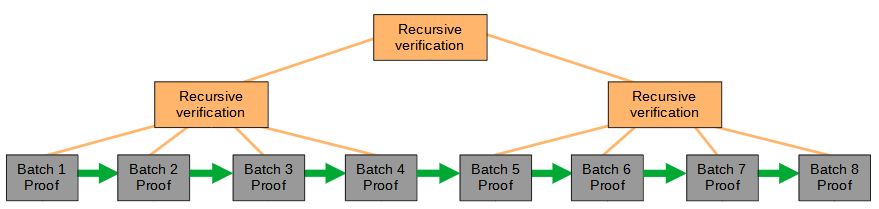
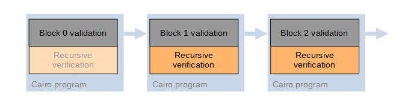

> *作者：Lukas George*
> 
> *来源：<https://geometry.xyz/notebook/A-light-introduction-to-ZeroSync>*

## 引言

虽然建立比特币节点很简单，但它也需要从比特币网络中的其它节点处下载大量的区块 —— 通常要好几天。这个过程之所以必要，是为了保证新建立的节点最终具有比特币区块链的最新状态。但是，利用零知识证明，你也许能在瞬间验证链的最新状态。只要有人能提供这样的证据 ……

[ZeroSync](https://github.com/ZeroSync/ZeroSync) 项目尝试填补这方面的空白，它意在成为一种生成证据的工具，这样的证据将能为比特币区块的链条的正确验证运算过程作证。它就像一种全节点实现，但它不仅在验证完所有区块中的所有交易之后给你一种最终的状态，还提供了一种办法，让你在以后验证这个验证流程。

我们先来看看 ZeroSync 的轻客户端版本，它只验证区块头（包含了跟交易无关的一切）；然后我们再了解那些允许我们验证完整区块的措施。

## 比特币的区块头验证

区块头链条提供了轻客户端验证工作量证明以及区块链条的正确序列所需的一切。收到一个区块头之后，轻客户端会使用比特币的共识规则来检查它：

1. 区块哈希值必须低于当前的目标值 —— 目标值是一个数字，可以理解为区块哈希值的开头必须具有一定数量的 0。跟区块的挖矿难度密切相关。
2. 当前区块头中编码的前一个区块哈希值是对的。
3. 区块的时间戳不晚于此前 11 个区块的时间戳的中位值，而且不快于当前的网络时间两个小时。
4. 区块头中编码了正确的目标值。如果需要重设目标值，则新的目标值将从难度调整周期（epoch）的时间戳中正确推导出来。

虽然规则 1 和 2 强制了链的正确形构和挖矿，但规则 3 和 4 也是需要的，这样才没有人能任意调整目标值。否则，有人将能通过提高目标值来加速挖掘区块（可通过降低难度调整周期的时间戳差额来实现），也可以通过降低目标值，任意加大挖掘区块的难度。

## 区块头验证的可验证计算

[Cairo](https://www.cairo-lang.org/) 是一种用来创建运算可验证的程序的编程语言；通过在 Cairo 中实现上述规则，我们就创建了一种程序，它可以验证单个区块头，并且，当且仅当验证通过时，为运算过程生成一个证据。我们使用了一种开源的 Cairo 证明器，叫做 “[giza](https://github.com/maxgillett/giza)”（并且为基于它的、可生成递归型证据的实现作了贡献）。我们使用 giza 来证明所生成的程序及其执行踪迹。因为底层的 STARK（简洁的非交互式知识陈述）协议，伪造一个证据为错误的区块头验证作证是不可能的。正确的证据的体积只有几百个字节，可以在另一条区块链上、链下（例如在正在同步的节点中）中验证，甚至可以在另一个 STARK 证据中验证。

为了给多个连续的区块头生成一个证据，我们可以在[单个 Cairo 程序](https://github.com/lucidLuckylee/LightSync)中批量处理它们的验证，只要运行证明器的机器有足够高的处理能力即可。通过验证包含在一个新的 STARK 证据中的多个批量验证证据，我们可以为整条比特币链创建一个证据 —— 这利用了所谓的 “[递归型证据](https://medium.com/@starkware/recursive-starks-78f8dd401025)” 的技术。

- 批量处理批处理证据：可以通过递归地验证证据，将多个批量处理证据压缩成一个证据 -

## 处理完整的比特币区块

对区块头执行连续两次 SHA256 算法，是比特币区块头验证中最昂贵的操作。但当前的比特币区块可以包含超过 2000 比交易，因此，以全节点的方式验证这些交易，在运算花销上会比验证区块头昂贵得多 —— 每一笔交易都需要哈希运算。如果没有递归证据，我们就无法在单个证据中包含大量的区块；此外，我们还必须跟踪链的状态（主要由每个区块处理完之后的 UTXO 集组成），必须在区块验证的间隔进行。

### 处理 UTXO 集

虽然 STARK 证据是简洁的，验证起来比亲自验证对应的区块更容易，但链的状态都必须是每一个证据的公开输入的一部分，并因此让证据的体积增大到几 GB。比特币的 UTXO 集有两种有趣的属性：其一，UTXO 可能会在后来删除（当某个区块包含了花费这个 UTXO 的交易之后）；其二，每个区块都只需要 UTXO 集的一个小子集的信息（因为一个区块只会用到一定数量的交易输入）。因此，我们可以使用一种累加器来为每一次验证提供简洁的输入和输出。具体来说，我们使用的是 “[UTreeXO](https://dci.mit.edu/research/2019/6/6/utreexo-a-dynamic-hash-based-accumulator-optimized-for-the-bitcoin-utxo-set)”，它是一种默克尔山（Merkle mountain range，通过允许不同层高的默克尔树共存，来保证每一棵树都是二叉的，译者注），可以调换树节点，因此，可以在移除默克尔树叶子（UTXO 集删除元素）之后减少根植的重新运算。由此，我们只需要一个 UTreeXO 根哈希值的清单，都可以表示整个 UTXO 集。被验证的区块中的交易所用到的 UTXO ，可以通过 Cairo 的提示以及相应的归属证据（membership proof）传入程序中（它**不是**公开输入的一部分）。

### 证据方案

我们希望从为每一个区块创建一个证据开始，所以我们必须找出一种办法来压缩这些证据，就像我们对区块头验证证据的批量处理一样。在目前，这会用最简单最直接的方式来做：每个证据都会在下一个证据中得到验证 —— 本质上就是一棵宽度为 1 的树 —— 我们将这种方案称为 “步进的可验证运算（incrementally verifiable computation，IVC）”。

- 步进的可验证运算：这是一种附加到区块验证城的递归型验证器，它会验证前一个区块的证据。每一个证据都允许最新区快的验证以及所有以往区块的验证 -

注意，这种方案可以提升成更为动态的形式、允许并行地为后续区块生成证据。我们可以将 IVC（以及区块验证）的单个步骤替换成一棵使用多个区块验证证据组成的递归型证据树，并且，仅在树已经压缩完成（例如将 10 个区块验证的证据压缩成一个证据）之后，再调用 IVC 的递归验证部分。每 10 个区块的证据都可以并行生成，办法是在并不运行于 Cairo 虚拟机中的其它程序中模拟使用 Cairo 编写的区块验证程序 —— 这样，虽然不能获得执行证据，单我们可以得到最终的输出状态。在当前的验证仍在运行的时候，就可以将最终状态传入下一个区块验证程序中。当然，证据树上的递归验证部分必须检查后一个区块的所有输入状态根前一个区块的输出状态相匹配。

## 结论

我们介绍了 ZeroSync 这种还在开发的工具，它可以为比特币区块链生成 STARK 证据，它的目标是为整条区块链生成一个证据。这个证据结合对应的 UTXO 集，就可以用来瞬间同步出一个比特币全节点。现在，比特币的逻辑已经时间到 assume-valid（假设有效）节点的阶段，还没有实现交易脚本的验证，我们正在开发递归验证。第一次基准测试的结果看起来很理想，我们已经能够对在大约 500 万个 Cairo 步骤中验证一个带有 108 笔交易的区块。ZeroSync 是一个开源的项目，请尽情地检验我们在[这个代码库](https://github.com/ZeroSync/ZeroSync)和这个[正在开发的网站](https://zerosync.org/)中的工作并为之贡献。后续问题和评论请通过推特联系[我](https://twitter.com/lucidLuckylee/)或者 [ZeroSync](https://twitter.com/ZeroSync_)。我们欢迎您的意见！

（完）