> *作者：GIACOMO ZUCCO*
>
> *来源：<https://giacomozucco.com/layers-before-bitcoin>*
>
> *原文发布于 2020 年 7 月。*

闪电网络（Lightning Network）是一个相对较新而且还在快速开发中的系统，有望在比特币的基础上带来便宜、快速和隐私的支付。它现在已经投入到生产环境中了，许多人每天都在用它。但这就是全部了吗？它会不会只是冰山一角呢？海面以下的部分，有没有可能会对我们已知的互联网（Internet）的某些部分产生重大影响呢？听起来是痴心妄想是吧？先别急，容我细说。

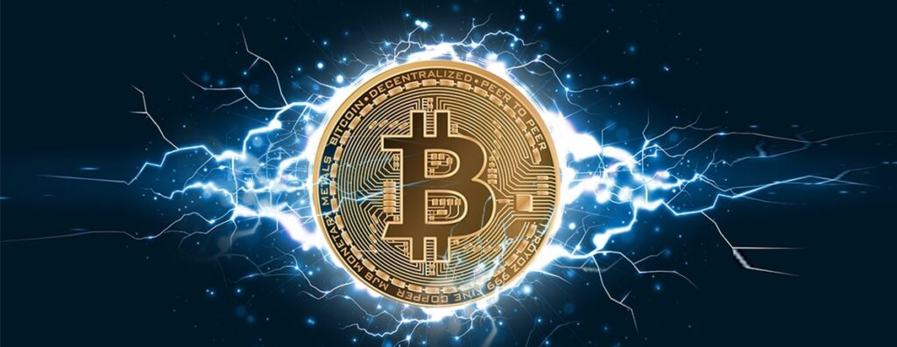

## 引言

我们先来解释以下 “LNP/BP” 这个神秘的缩写词。在过去一年中，这个词已经变得很常见了，看看一些比特币狂热粉是如何传播它的吧：我在[我的推特简介](https://twitter.com/giacomozucco)上写了它，引来一些比特币友加入（一些随手摘出的例子：[甲](https://twitter.com/ElkimXOC)、[乙](https://twitter.com/kiwilambnz)、[丙](https://twitter.com/privacyhalt)、[丁](https://twitter.com/OlUkolova)、[戊](https://twitter.com/thedavidcoen)、[已](https://twitter.com/weedcoder)、[庚](https://twitter.com/VNumeris)、[辛](https://twitter.com/kixunil)）。为了宣传这个词、反对使用更不准确的 “BTC/LN”，我还跟我的朋友 [Vortex](https://twitter.com/theonevortex) 爆发了一场长时间而且嘈杂的[推特争吵](https://twitter.com/giacomozucco/status/1149322490298195969?s=20)（他喜欢用 “BTC/LN” 来表达同样的基本概念 …… 但最终[屈服于](https://twitter.com/theonevortex/status/1186393121686343680)我的固执）。

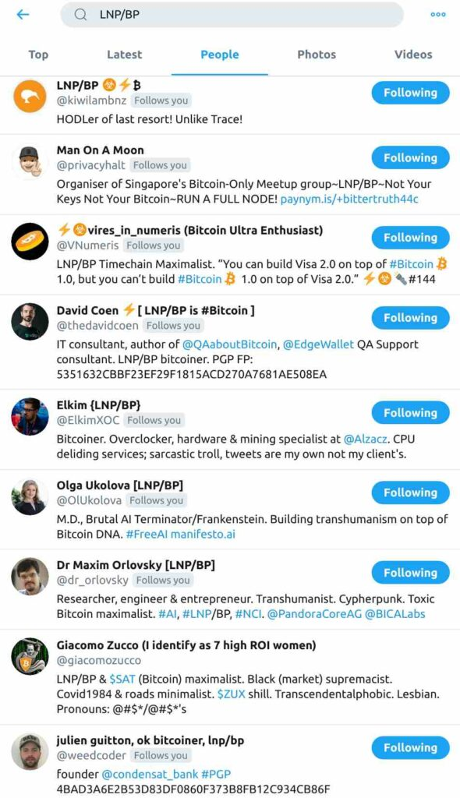

- 在推特上搜索 “LNP/BP”，从中选出值得做你知交好友的一些（然后把其他人都拉黑举报 : ) ) -

对我来说，它没有止步于推特：跟 [Maxim Orlovsky](https://twitter.com/dr_orlovsky) 一道，我甚至决定用它作为一个小小的非营利协会的名字；这个协会的目的是资助比特币相关的研究和开发项目（包括：[RGB](https://github.com/LNP-BP/rgb-node)、[Magical](https://github.com/MagicalBitcoin/)、[Proofmarshall](https://github.com/petertodd/proofmarshal)、[Storm](https://github.com/storm-org/storm-spec)、[Lightspeed](https://github.com/LNP-BP/lnpbps/issues/24)，等等）。

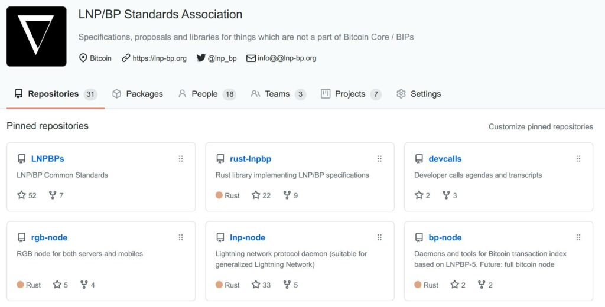

- LNP/BP 非营利组织的 GitHub 库 -

那么，这个缩写究竟是什么意思呢？很容易看出来，这是尝试把比特币类比成互联网：更准确一些来说，是[被称为 “TCP/IP” 的互联网协议套件](https://en.wikipedia.org/wiki/Internet_protocol_suite)。这显然是跟 “分层架构（layered architecture）” 有关，而不是 “整体上” 有什么相似之处，但是，到底什么比特币的 “层级” 呢？这里面似乎有很多混淆（至少是术语层面的，但也有可能概念层面的）。整个闪电网络是真正的比特币的 “layer 2（二层）” 吗？如果是的话，那么一条通道又是什么呢？Liquid 联盟侧链真像某些人说的那样是一个 “layer 1.5”吗？还是像我[半开玩笑](https://twitter.com/giacomozucco/status/1155971820983447552?s=20)说的那样，是一个 “想象的 layer i”？如果强大的联盟侧链算是 “layer”，那么使用多签名冷存储方案的托管型交易所是不是也算呢？这还没讲到 statechain、通道工厂、RGB 资产、基于 OP_RETURN 的写入系统呢。所有关于 “layer 3” 系统的宣传，是不是就像 “web3” 那样，都是无意义的噪音呢？

- 想要知道它到底是什么、不是什么，从 “第二层” 就开始让人一头雾水 -

本文的目的就是想总结、澄清关于 “LNP/BP” 缩写词的讨论并形成系统化的表述，希望能减少混淆。

## 比特币以前的分层思想

“抽象层级（abstraction layer）” 的概念显然比比特币要古老。一般来说，你可以把 “层级” 理解成一种心智模型，用来给所有能够有意义地切分成有顺序的子系统系列的复杂系统打标签；有顺序意味着，每一个层级都严格依赖于前一个层级。这就是为什么我们要使用垂直并置的东西来做类比：在垂直并置的结构中，“上面” 的东西都站在 “下面” 的东西之上，而下面的东西通常来说都更难以安全地触及、移动和变更（就像[叠叠乐](https://en.wikipedia.org/wiki/Jenga)的高低楼层一样）。

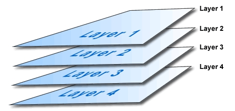

- 层层向下（就像乌龟） -

这种类比的一个非常棒的例子来自建筑学（比互联网还要古老）：一栋建筑的不同 “剪切层（shearing layers）” 代表着这栋建筑的不同方面，每一层都有不同的时间尺度和不同的寿命。

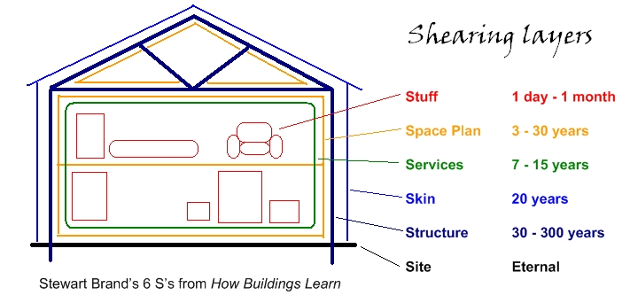

- 一栋楼里面的剪切层 -

在计算机科学中，软件/硬件 二元性也可以被当成这个概念的一个明显的例子（有时候会加入额外的中间层，叫做中间件、固件，等等）：底层电子组件的复杂物理配置，也可以用更抽象、更简单的方法（作为一些有趣的功能性 “信息化配置”）来描述。

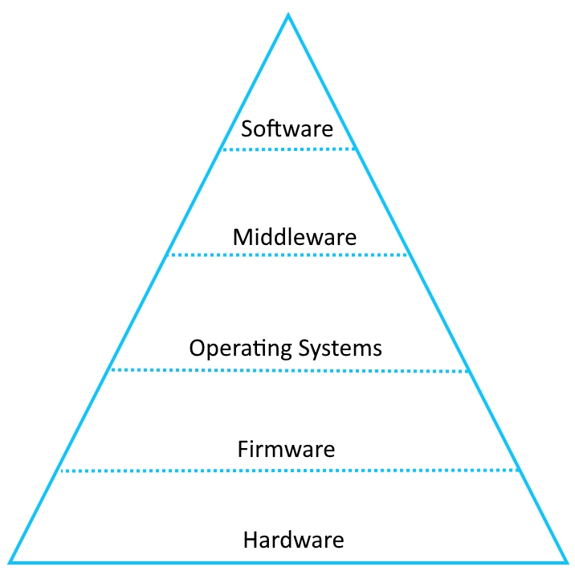

- 随手选出的计算机科学层次三角形 -

4 层的 TCP/IP 模型，以及它的 “学术型/官僚型” 竞争对手，7 层的 [OSI 模型](https://en.wikipedia.org/wiki/OSI_model)，可能是分层架构最著名的例子。在 OSI 模型中，“layer 1” 是 “物理层”，传输实际的原始比特流；“layer 2” 是 “数据连接层（datalnke）”，定义数据的序列化格式；“layer 3” 是 “网络层”，决定数据要选择的路由路径；“layer 4” 是 “传输层”，管理传输协议；“layer 5” 是 “会话层”，维护连接并控制端口和会话；“layer 6” 是 “表现层” ，管理数据的格式和加密；“layer 7” 是 “应用层”，管理最终的人机交互。 

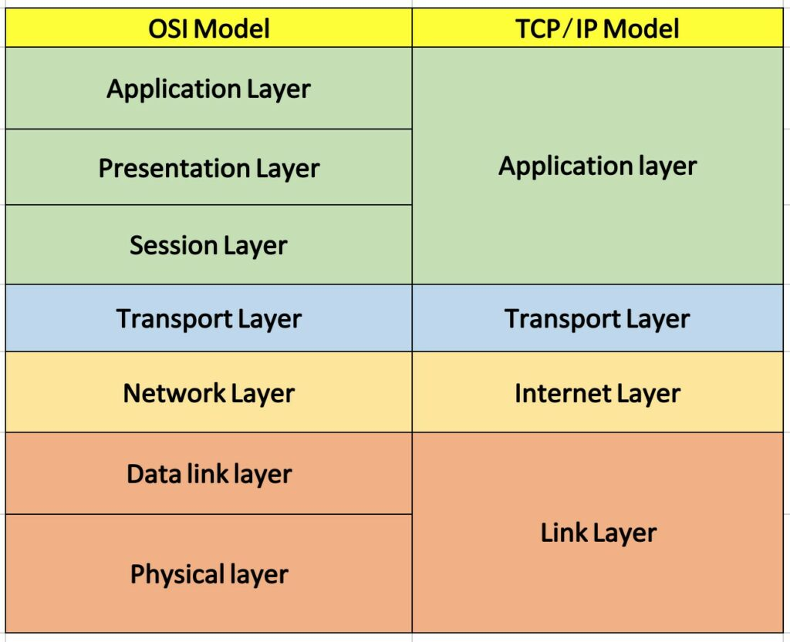

- 比较 ISO/OSI 模型和 TCP/IP 模型的不同层级 -

同样的心智模型在许多子领域中也得到了一致的重用，从 OpenGL 渲染到面向对象的编程，这一切都跟 [信息隐藏](https://en.wikipedia.org/wiki/Information_hiding)、封装、隧道化、模块化、标准化、重用、非齐次的事件依赖性、通过隔离实现安全等概念有关。

## 比特币中的 “重新解释层”

在比特币的世界里，“层级” 一词最开始的用法就是常见的、跟互联网相关的用法，与在矿工和节点间传输区块和交易的信息传输有关（例子见[这个](https://bitcointalk.org/index.php?topic=8379.0)和[这个](https://bitcointalk.org/index.php?topic=55822.40)）。

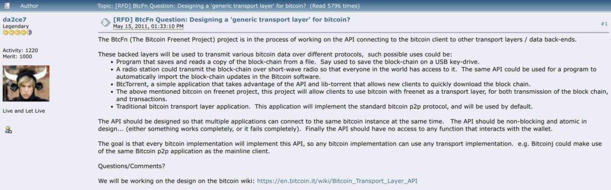

- 我在 Bitcointalk 上找到的最先讨论 “比特币上的新层级” 的帖子 -

“比特币上的层级（layers on top of Bitcoin）” 这个表达的新含义是在 2013 年随着 “Mastercoin” 协议的[推出](https://bitcointalk.org/index.php?topic=265488.0)而出现的（Mastercoin 今天已经品牌重塑为 “[Omni-layer](https://www.omnilayer.org/)”，因为就像一些中心化的 “基金会” 开展 “ICO” 后出现的那样，Mastercoin 也出现了交付、治理和透明性问题，所以有此必要）。

- Mastercoin 的朋友们不好意思，但你们都知道这就是真相 -

Mastercoin 是一种协议，让一些（有效）的比特币交易可以经过一些额外语义的 “透镜” 得到重新解释，从而允许发行定制化的数字资产（用来表示借条、股份、期权、版权、投票权、收藏品、证书，等等）以及创造复杂的合约（可以支持原子化的点对点交易所、博彩、金融衍生品、股息分配，等等）。Mastercoin 的主要开发者 J.R.Willett [解释道](https://www.forbes.com/sites/kashmirhill/2014/06/03/mastercoin-maidsafe-crowdsale/#50d8d923207d)：“我们是比特币上的一个协议层，可以为比特币加入额外的特性。我们使用比特币，就像电子邮件使用底层的 TCP/IP 一样。”

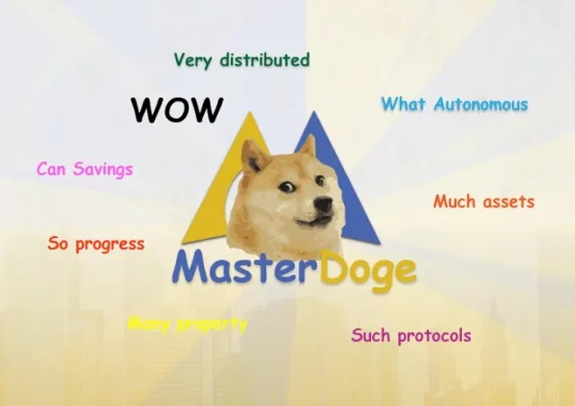

- MasterDoge：一个狗狗币本位上的第二层（这个评语由 Elso Musk 赞助） -

其它按此 “第二层” 定义加强了比特币的项目也紧随其后：从 Mastercoin 的竞争对手（与 Mastercoin 非常相似，只是没有可疑的 ICO 模式）到许多的染色币（Colored Coin）（将被发行资产的表示从更高的抽象层的合约模式中分离、交回给 “下面” 的比特币原生的脚本系统）。当时，这些实验的大类名称是 “比特币 2.0 协议”。在一篇[写得很好的博客](https://blog.ethereum.org/2014/11/13/scalability-part-3-metacoin-history-multichain/)中，年轻记者 Vitalik Buterin （即将发起 ICO）将它们定义为 “元协议（meta-protocols）”（可以说这不是一个很好的措辞，因为这个表达已经暗示了一些截然不同的东西：可以定义其他协议的协议）。但 “layer 2 协议” 这个表达也变得流行起来。

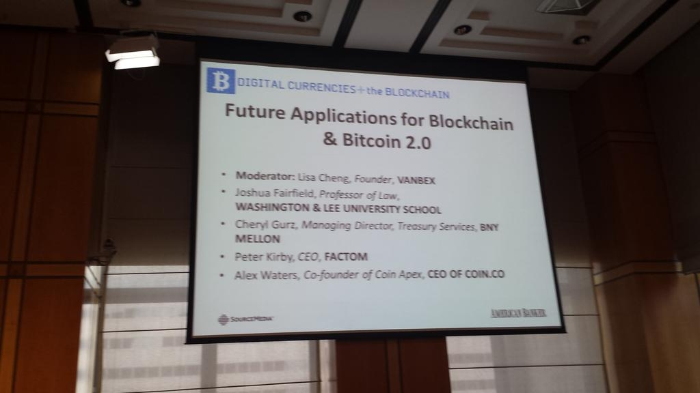

- 哈哈，看看上面作为 “比特币 2.0” 的代表的项目你还记得几个？ -

因为它们一般都使用比特币交易内的 “[OP_RETURN](https://en.bitcoin.it/wiki/OP_RETURN)” 脚本操作码，这些协议实际上也可以理解为 “layer 3”，而它们的 layer 2 就是对这个操作码的信息负载的解释，这些 layer 2 也可以用在一些比数字资产发行更简单的事情上。一个历史案例是 [Eternity Wall](https://blog.eternitywall.com/2016/01/19/how-to-sign-messages-on-eternity-wall/) 手机  app（因为[创始人](https://twitter.com/RCasatta)诚实地承认[这种方法的不可扩展性](https://www.youtube.com/watch?time_continue=8029&v=Gzg_u9gHc5Q&feature=emb_logo)，这个 app 已经停止运行了，创始人也转向了 OpenTimestamps 公证服务），使用这个 app，你可以在一个简单版的 “区块链上的社交网络” 中回复和点赞其他人的信息（不像少数今天仍在活跃、自诩为扩容方案的山寨币，这个方法能显然不能扩容）。

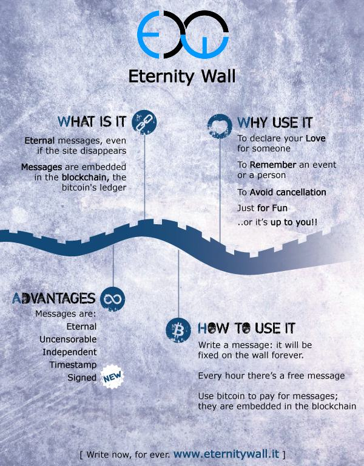

- Eternity Wall 无法扩容，但它很新潮 -

我们可以将这些思路概念化为 “重新解释层” 或者说 “基础设施重用”。这些二层的每一个 “事件” 都是一笔实际上有效而且得到第一层区块确认的比特币交易；然后这些比特币交易被更高层的语义重新解释，从而不再仅仅是一笔比特币转账。作为一种经济资产的比特币（也即小写的 “btc”）并不一定会被重用，但作为技术基础设施的比特币（大写的 “BTC”）被用来转移更多类型的资产。

## 比特币的 “省略层”

“比特币上的第二层” 的第二种用法，也是完全不同的用法，出现在因为比特币一开始被理解为 “全局共识（global consensus）” 协议而导致的几个问题的辩论中。虽然比特币对多重花费问题的去中心化解决方案（“时间链（Timechain）”）是毫无疑问的天才，但这也使得它内在无法扩容。它假设了网络中的每一个节点都必须永远跟踪发生的每一件事情：每一笔得到区块确认的交易，都必须被每一个使用这个系统作为完整历史记录的参与者下载和验证，直到永远。这也产生了验证的隐私性问题和同质性缺陷，使得所有的司法追踪和去匿名化尝试成为可能。

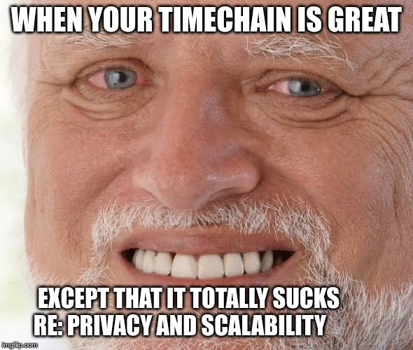

- 我在 “Discovering Bitcoin” 系列中回收了这个表情包。但你必须承认，它真的太形象了，一定要重复使用（译者注：图中文字意为 “你的时间链很棒，就除了那些完全无法接受的缺陷：隐私性和可扩容性”） -

不存在简单的解决方案：如果你严格限制了[时间链](https://cryptoinsider.media/timechain-satoshis-original-vision-blockchain-bitcoin/)的区块大小和频率，那么所有节点的验证负担将维持在可控状态，但是，“区块空间” 的供给将无法匹配需求，使无法满足的交易手续费和等待时间都大大提高。而反过来，如果你允许大小和频率提高，那么 “区块空间” 的价格将下降，而运行节点的成本将不断提高，并使整个系统的拓扑图趋于中心化。

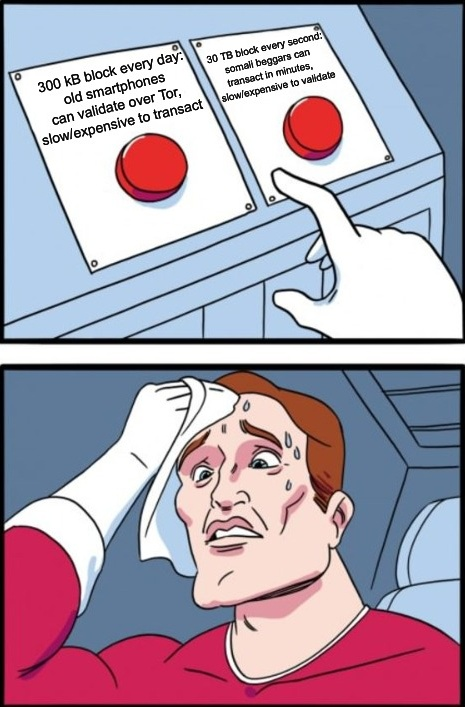

- 不同的取舍（以及难以阅读的糟糕表情包范例） -

有一种聪明但高难度的办法，可以绕过全局共识系统的基本限制，而且无需牺牲其去中心化：将一些活动迁移到一个免信任、免准入的 “第二层”。大部分用户都无需每个区块都提交交易，所以大部分的流通都可以在公共的时间链外发生，时间链只需用于解决冲突和定期结算。这种方法最著名的例子，毫无疑问就是闪电网络：在这个系统中，有效的比特币交易可以在成对的伙伴间转播，而无需广播并得到时间链的确认；而且，伙伴们还可串联成一条 “路由路径”，帮助支付者将价值转发给路径末端的接收方。

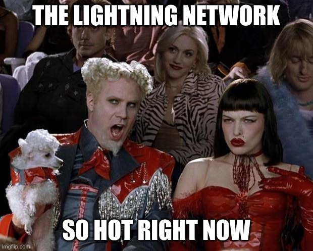

- 这表情包就不用我多解释了吧？ -

这背后的思路有点类似于我们在普通法系中对法庭和合约的使用方法：法庭可以创造公开可见的判例，从而形成一种 “法律的全局共识”，但这个过程很长、比较昂贵而且会导致隐私曝光，所以大部分的交易参与者通常都签订私人合同，当且仅当产生冲突或需要定期的公开审计时才寻求法庭的验证和强制执行。高级的比特币脚本可以用来保证整个操作是信任最小化的：与实际的司法审判不同，时间链结算的过程可以避免人类的偏见和腐败，基本依赖于密码学、激励和代码。

- 激励和密码学总是比律师和法官要好，包括在你决定要邀请谁来参加派对的时候 -

闪电网络不是唯一一个这样的例子：还有其它一些需要参与者在协议外交互的高级合约，比如 CoinJoin、PayJoin 和 CoinSwap（以及未来可能出现的，不同形式的签名聚合协议），都可以被认为是在第二层发生的，取决于具体场景，只有一部分最终出现在了时间链上。

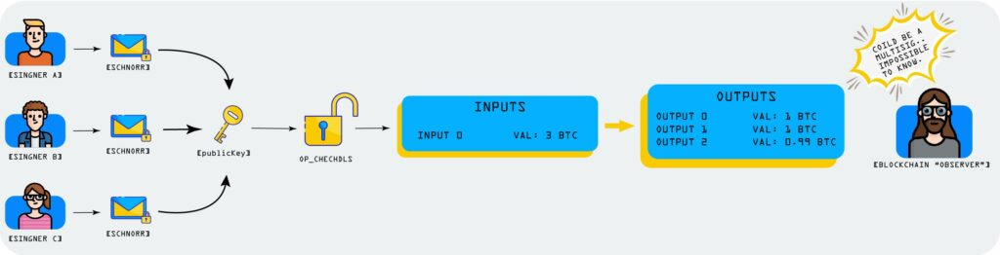

- “（跨输入的）签名聚合的好看图解（跨输入的那部分尤其好）” -

我们可以将这种思路概念化为 “省略层” 或者说 “资产重用”。这种第二层的每一个 “事件” 都是一笔实际的比特币转移，并且这些转移最终都是可以到第一层结算的；即使大部分这些比特币交易并没有被广播到整个网络中、得到时间链的确认，它们的构造方式使得它们都可以保证一定的安全性。作为技术基础设施的比特币未必被重用了，但作为经济资产的比特币被用来协助了更多的价值转移。

## 与信用交易的区别

有趣的是，这些 “链下” 的解决方案可能有点类似于商品货币背景下的信贷系统。举个例子，拿黄金来当货币，也是很难扩容的（虽然难以扩容的理由跟比特币完全不同）：贵金属的硬币的储存、转移和验证都是非常昂贵的。这也是为什么，从中世纪以来，人们开始储存、使用和验证由受信任的第三方发行的 “纸黄金” 而不是真实的黄金，等有需要使用黄金时再赎回。在金本位的高峰时期，可以将全球货币系统细分为三个 “层级”：实体黄金，偶尔在终端用户间交易，但更多时候是由中央银行作为储备保管在仓库里；央行的票据，大部分由商业银行持有；商业银行的票据，被大部分终端用户所用。

- 纸做的黄金凭证 …… 如果你没有别的选择，这也不算坏 -

讽刺的是，虽然基础性的 “layer 1” 从现代的法币系统中消失了（央行给你的凭证没法换回任何东西），在塔的顶上，新的 “层级” 激增。举个例子，今天的终端用户在使用一些 “FinTech（金融科技）” 应用比如 Paypal、Venmo、GPay、支付宝和 ApplePay 时，从技术上来说，他们是在使用 “layer 6”，主要依赖于背后的传统银行关系；而传统银行关系代表着 “layer 5”，基于国际代理银行网络；国际代理银行网络（“layer 4”）又基于各国的中央银行在本国司法辖区内的行政垄断，也就是 “layer 3”；layer 3 又基于更根本的 “layer 2”，美联储。（再说一遍：“layer 1” 已经消失了：你再也不能拿回实体黄金了）。

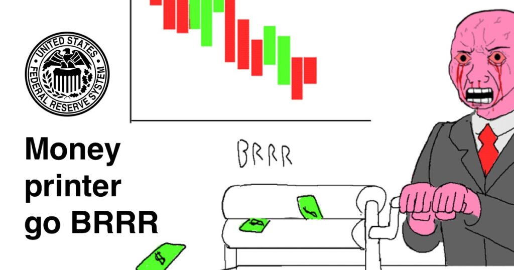

- 一图讲清楚法币本位 -

尽管表面上相似，还是要澄清，在目前的比特币世界中占主导的 “第二层” 方案，实际上跟前述货币系统中的 “信用层” 有极大的区别！举个例子，闪电网络上的交易绝对不是对未来交易的承诺，也不是某些受信任的第三方发行的 “信用”。他们是确凿的、完全有效的比特币交易；只要你想，就可以广播到网络中并得到时间链的确认，所以他们有基于博弈论和密码学的强大安全性和公平性保证，跟基于社会声誉、法律条款和直接信任的 “信用” 完全不同！

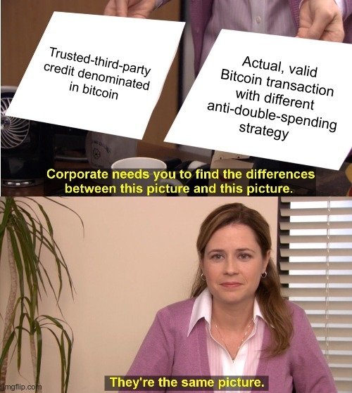

- 闪电网络里的比特币不是一种以比特币计价的信用，它们就是比特币 -

这种信任最小化的第二层可以存在，是比特币的前辈们连想都没想过的事！一个典型例子是比特币的传奇人物 [Hal Finney](https://twitter.com/halfin/status/1110302988)，他在比特币诞生两年后想想比特币未来如何扩容时，想的是一种混合方案：一个免信任但不可扩展的 layer 1，搭配一个可扩展但基于信任的竞争性 “[比特币银行](https://bitcointalk.org/index.php?topic=2500.msg34211#msg34211)” 的网络。当[中本聪自己](https://github.com/trottier/original-bitcoin/blob/master/src/main.cpp#L434)提出现在所谓的 “链下支付通道” 最初想法时，意料之外的东西到来了：第二层可以不基于受信任的第三方，而基于可以自我执行的机制。中本聪[最初设计的结构有缺陷](https://lists.linuxfoundation.org/pipermail/bitcoin-dev/2013-April/002417.html)，所以包括 [Jeremy Spillman](https://lists.linuxfoundation.org/pipermail/bitcoin-dev/2013-April/002433.html)、[Christian Decker](https://link.springer.com/chapter/10.1007/978-3-319-21741-3_1)、[Joseph Poon](https://lists.linuxfoundation.org/pipermail/lightning-dev/2015-July/000018.html) 在内的开发者花了好几年时间来修正这个概念，然后将它与 “原子化信用路由” 的互补概念结合起来（后者在比特币前就已经存在了，见最初的 Ripple 项目）创造现在的闪电网络。而这个革命性的历程还没有到达终点：[Eltoo 提议](https://blockstream.com/2018/04/30/en-eltoo-next-lightning/)就是一个例子。

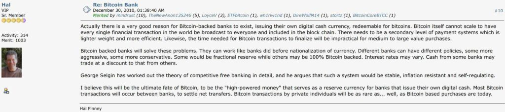

- 来自权威的观点总是错的，除了 Hal Finney 的。那么，如果 Hal 也这么认为，就证明了我的观点 -

基于信任来存储和转移比特币资产的 “层级” 依然可以存在（而且实际上它们真的存在：今天的大部分在线交易所就是这样的），但它们与闪电网络这样的方案所体现的 “层级化” 完全不同。在前者中，被转移的不是比特币，而是以比特币计价的信用；而在后这种，实际的比特币使用有效的比特币交易完成转移，这些有效的比特币交易恰好遵循了另一种抗多重花费策略，而不是马上发布的全局共识的时间链上。

## 混合思路

当然，基于信任的社会 “层” 与信任最小化的技术 “层” 之间的区别并不总是截然分明的。一方面，举个例子，闪电网络中一个节点可以决定建立一个密码学和博弈论保证较弱的支付通道，因为交易对手是声誉卓著的（比如说是网络中的一个很大的流动性中心，连接着一个著名而且声誉良好的金融服务）。另一方面，一个传统的、完全托管的交易所，也可以为了增加客户信任自己的理由而开源其技术细节，比如说他们的（基于多签名和 HSM 的）冷存储制造商；并实现复杂的 “保证金证明”、“偿付能力证明”和 “所有权证明” 策略，用密码学来保证所有人都可以独立验证这些证据。在两个极端之间可以有许多不同的取舍组合，模糊了居于信任的社会层和信任最小化的技术层之间的区别：在一些特定的闪电网络技术内，[Statechains](https://medium.com/@RubenSomsen/statechains-non-custodial-off-chain-bitcoin-transfer-1ae4845a4a39) 可以取代标准的 Dryja-Poon 支付通道，而一些托管型交易所也可以升级自己的密码学可证安全性的流程，成为一个成熟的[动态的强大的联盟](https://github.com/ElementsProject/elements/commit/5b2fe5563b0fbd610d00b0b8ae15fa5d720bea9f)。

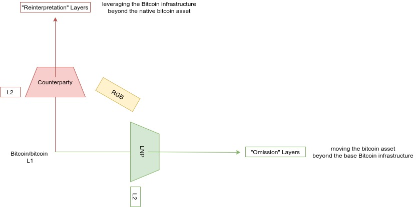

- “省略层” vs 信用层（以及混合方案） -

在上述的 “重新解释层” 和 “省略层” 之间，确实有可能存在一些混合方案：例如，[RGB 项目](https://github.com/LNP-BP/rgb-node)可以被认为是利用比特币基础设施来管理不同的已发行资产，但它在技术上也跟闪电网络有密切的关联，而且是围绕着 “客户端验证（client-side-validation）” 的一场实验，[其最开始的想法](https://www.youtube.com/watch?time_continue=6198&v=uO-1rQbdZuk)是在一系列不同的基础设施上管理比特币资产。一个类似的东西是[在 Liquid 侧链上发行资产](https://blockstream.com/2018/07/02/en-liquid-issued-assets/)，或者是[资产的 Proofmarshal 提议](https://petertodd.org/2017/scalable-single-use-seal-asset-transfer#single-use-seal-implementation)。

- “重新解释层” vs “省略层”（以及混合方案） -

这些抽象层之间的交集可能不容小视：理论上，你可以通过运行在 Liquid 联盟侧链的一条闪电通道，传输一个 RGB token（它代表的是一笔基于信任、以比特币资产计价的借条）。当然，我知道，你要花一些时间来理解一下这句话。

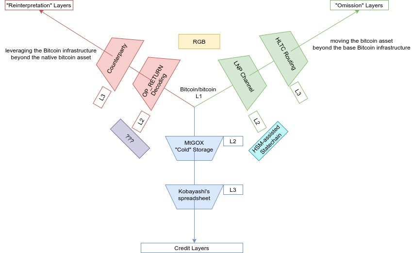

- 好吧，开始变得混乱了 …… 还有，那个紫色框的 “？？？” 是几个意思？ -

## LNP/BP 就像 TCP/IP：怎么说？

那么，“LNP/BP” 这个缩写，在表示比特币的开发正在往多个方向 “分层化” 上，表现如何？在跟最有名的 “分层化” 例子，也就是互联网协议套件 “TCP/IP” 形成意义一致的类比上，又合不合适？

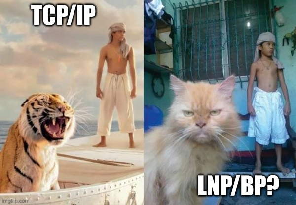

- 是骡子是马，拉出来遛遛 -

首先，我们要解释一下 “TCP/IP”：这个词用来表示一套非常丰富的开放协议，它们整体上构成了人们所知的 “互联网”；它直接使用了构成整个堆栈基础层 —— 我们先不考虑物理的 “layer 0” —— 的协议、在此基础上直接构建的少数二层协议中最常用的协议，的首字母缩写，前者是 “[互联网协议(Internet Protocol）](https://en.wikipedia.org/wiki/Internet_Protocol)”，缩写为 IP，也跟整个协议套件共享同一个名称）；后者是 “[传输控制协议（Transmission Control Protocol）](https://en.wikipedia.org/wiki/Transmission_Control_Protocol)”，缩写为 TCP；前者放在右边，后者放在左边。再说一遍，TCP/IP 套件不仅限于 IP 和 TCP 这两个协议！还有一些重要的二层协议（TCP 的替代品），也属于这个套件的一部分，比如 [UDP](https://en.wikipedia.org/wiki/User_Datagram_Protocol)、[SCTP](https://en.wikipedia.org/wiki/Stream_Control_Transmission_Protocol) 和 [ICMP](https://en.wikipedia.org/wiki/Internet_Control_Message_Protocol)。还有许多基于 TCP 的重要协议，也是这个套件的一部分，比如 [HTTP](https://en.wikipedia.org/wiki/Hypertext_Transfer_Protocol)（也就是所谓的 “万维网（The Web）”）、[SMPT](https://en.wikipedia.org/wiki/Simple_Mail_Transfer_Protocol)、[FTP](https://en.wikipedia.org/wiki/File_Transfer_Protocol) 以及 [SFTP](https://en.wikipedia.org/wiki/SSH_File_Transfer_Protocol)（UDP 协议上也还有协议，比如 [RTP](https://en.wikipedia.org/wiki/Real-time_Transport_Protocol)）。

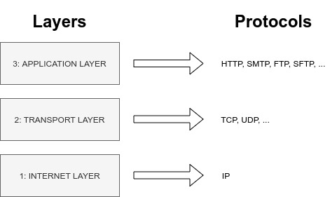

- 层级越高，“竞争” 越多 -

从这个角度来看，“LNP/BP” 所暗示的类比听起来非常优雅：它的初衷是表示一系列非常丰富的开放协议套件，而这些协议在整体上构成了人们所知的 “比特币”；它直接使用了构成整个堆栈基础层的协议、少数二层协议中最常用的协议的首字母缩写，前者是 “比特币协议”，缩写为 “BP”，也跟整个协议套件共享同一个名字；后者是 “闪电网络”，缩写为 “LNP”；BP 放在右边，LNP 放在左边。又整洁！又对称！当然，LNP/BP 套件也不仅限于  BP 和 LNP 两个协议！上面已经讲过的一些重要的二层协议、LNP 的替代品，也属于这个套件的一部分，比如说 “Eltoo 网络协议”和 “Elements 联盟协议”、“Statechain 实体协议”、“Proofmarshal 公证协议”，等等。当然，LNP 上也有许多非常重要的协议，也是这个套件的一部分，比如用于高级托管的协议（如[谨慎日志合约](https://adiabat.github.io/dlc.pdf)）、闪电网络的高级管理服务（如[瞭望塔](https://blog.bitmex.com/lightning-network-part-4-all-adopt-the-watchtower/)）、甚至 LNP 上更多复杂的[备份协议](https://telaviv2019.scalingbitcoin.org/files/acai-a-backup-protocol-for-lightning-network-wallets.pdf)以及[即时通讯协议](https://www.bitcoinlightning.com/whatsat-send-private-messages-via-the-lightning-network/)（本文的引言部分提到的 Storm 和 Lightspeed 协议正是围绕这两条线的实践）。一些基于 LNP 的 layer 3 协议也为跨越多个 layer 2 系统的支付提供了桥梁（在这个意义上，LNP 的 HTLC 路由和 Sphynx 也可以容易地独立出来并获得解释）。

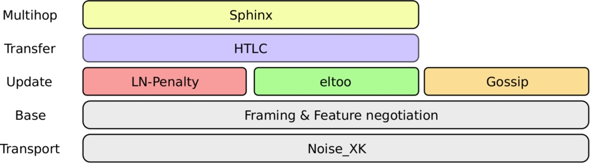

- 闪电网络自身也不只是孤零零的 “第二层”：它也可以被充分分层 -

跟其它没那么绞尽脑汁要强调类比的替代表达（比如 “BTC/LN”）相比，我认为显然 “LNP/BP” 表达式更传神。因为其它替代品颠倒了协议的顺序、“协议” 的特征被省略掉了、资产的价格标记取代了协议的名称，而且第一层与整个套件的同音异义也丢失了。

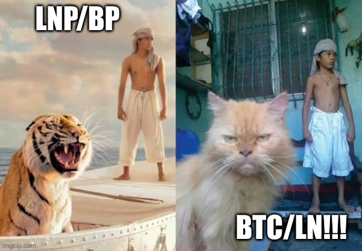

- 抱歉 Vortex，我知道战争已经结束了，你也让步了，但 “BTC/LN” 真的烂到不行 -

那么，有趣的问题来了：TCP 是 IP 之上的一个 “省略层” 吗？还是更像一个 “重新解释层” 呢？虽然从字面上看后者更合适，但前者也有很强的理由：每一个 TCP 连接都是一个带有额外含义的有效 IP 连接，但它不会以多播的方式（multi-cast）广播到全球网络的大部分中（而 IP 的 [IGMP](https://en.wikipedia.org/wiki/Internet_Group_Management_Protocol) 子协议就会这么做），只要 TCP 连接还存在，它就只会通过一条特定的网络路径来[单播](https://en.wikipedia.org/wiki/Unicast)。[已经有人指出](https://medium.com/@melik_87377/lightning-network-enables-unicast-transactions-in-bitcoin-lightning-is-bitcoins-tcp-ip-stack-8ec1d42c14f5)，从这个角度来看，我们的类比非常可靠而且具有启发性：每一个 LNP 交易也都是一个带有额外含义的有效 BP 交易，只不过它不会被广播和成为全局共识，而是只要 LNP 通道还存在就通过具体的网络路径发起单播。

## LNP/BP 就像 TCP/IP：为什么？

但是，回到根本，为什么要类比成 TCP/IP 呢？除了继承和强化已经很成功的 “比特币就是互联网货币” 的论调以外，我认为，一个非常棒的理由就是强调它跟多层级的互联网协议套件的比较。

- 搞这个类比真的有意思吗？ -

第一个理由就是强调这种 “分层化” 的重要性，尤其是在比特币这样对安全性至关重要而又有政治争议的项目中。一方面，如果可以经常更改比特币基础层而不遭遇抵抗和惰性，将可能开启严重的[社会和政治攻击界面](https://www.youtube.com/watch?v=jgwW7XZCKPU)。但另一方面，如果整个系统不会出现任何改变，那将意味着技术上的停滞和最终被淘汰。分层化允许我们两全其美：在顶层上快速创新、在底层拥抱长期可靠性。同样的概念不仅在时间的维度有意义，也涉及人群、方法和理念的多样性。一方面，如果基础层的替代实现大量出现，而没有合理的收敛和标准化，将产生严重的共识失败风险。但另一方面，完全没有任何竞争，又意味着单一文化以及单一方法的风险积累。再一次，分层化使我们能两全其美：在顶层开展多样的竞争，在底层形成一致的收敛。在[我的一个演讲](https://www.youtube.com/watch?v=RlslCd8XtN0)中，我曾经说 LNP/BP 是多层的心智模型，底层应该高度保守、可靠、收敛和标准化，而顶层可以充满竞争并迅速进化（在那场演讲中，我还指出了一些特殊的跨层级取舍，比如在链的同质性（chain-fungibility）和网络可否认性（network-deniability）之间的取舍、区块空间的可分割性（blockspace-divisibility）与路由可移植性（routing-portability）的取舍、确认终局性（confirmation-finality）与通道可靠性（channel-reliability）的取舍，等等），我现在认为这种说法是对的。

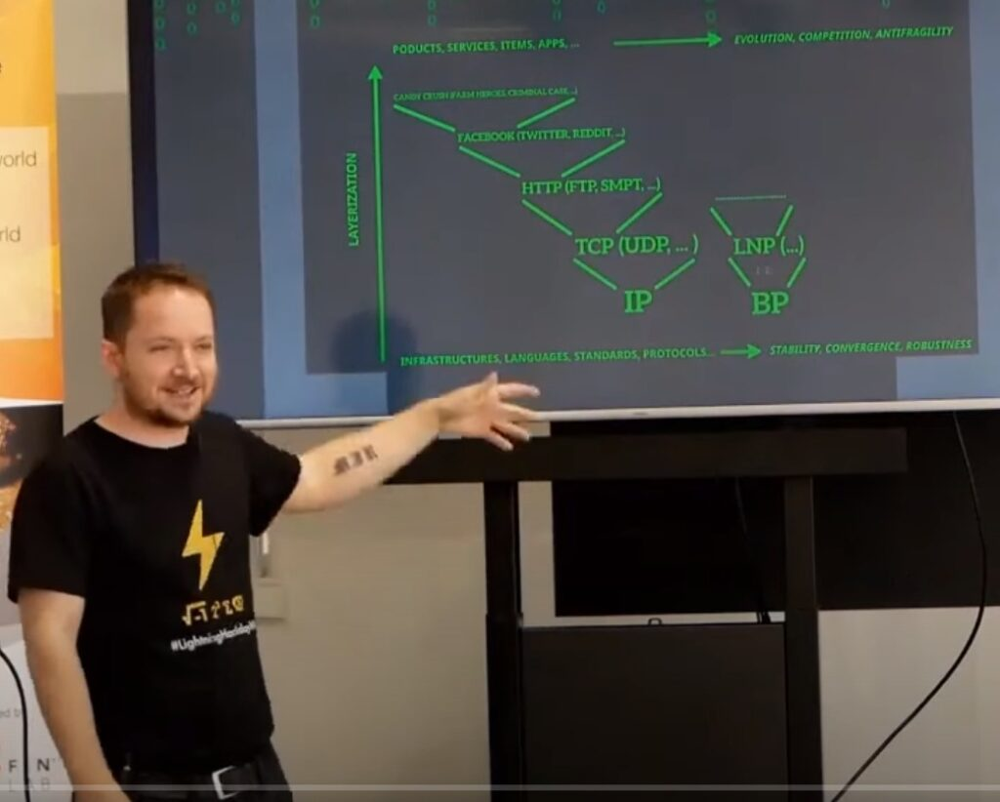

- 我知道，“黑客帝国” 式的绿色用在演讲中太差劲了，但我无所谓，我就是喜欢 -

强调这种对比的第二个理由是我们可以从 TCP/IP 套件和比特币第一个 10 的一些重要里程碑的相似性中吸取灵感。具体来说，所谓的 “[协议战争](https://twitter.com/TuurDemeester/status/995293648198742018?s=19)” 的故事跟最近关于 “比特神教” 的争论有惊人的相似之处，而 “[IPv7 收购事件](https://twitter.com/bergealex4/status/879655292581036033)” 也在 2017 年对比特币的 NYA 攻击中被人忆起。在两个事件中，TCP/IP 的历史都可以用来当作开放、独立、收敛标准的优越性的案例。虽然历史不会完全重复，但一些社会和技术的潮流会反复出现，因此这两个插曲是我们重要的灵感来源。

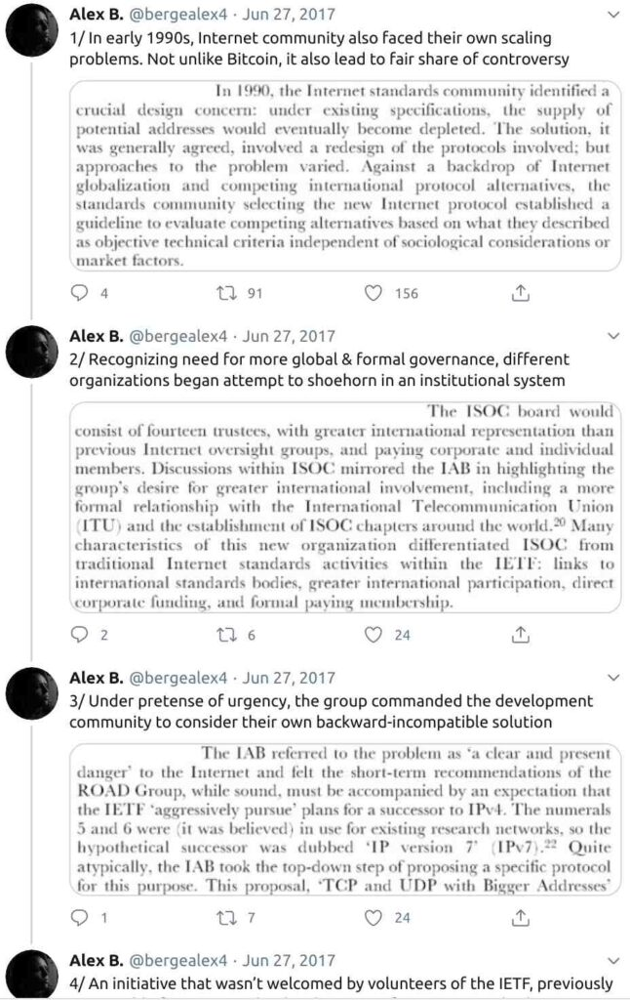

- 讲真的，你一定要看看 Alex B 的这篇长推特 -

强调这种对比的第三个理由是进一步强调一个事实：在恰当构建的比特币 “二层技术” 中转移的价值并不是 “信用”、“借条” 或别的什么资产（一些围绕闪电网络的扭曲叙述就是这么暗示的），而就是比特币转账。如上所述，信用系统和链下侧链有一些重要的相似之处，但也有根本的说不通。LNP/BP 缩写可以帮助澄清这一点：就像一个 TCP 连接就是互联网套件的天然的一部分一样，一个 LNP 通道也是比特币套件天然的一部分。

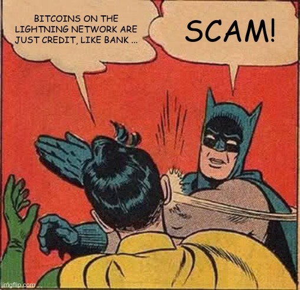

- 这种身体暴力只是一种比喻，不是要来真的。我只想在智力上把你打醒 -

我的最后一个理由涉及一个长期存在的术语和教学问题：比特币（作为一套协议、软件和网络）与比特币（作为这种协议内创建的 “数字黄金” 的有限供给量的一个随意的单位）的同音不同义，总是让新来者产生许多困扰。虽然无法完全消除这种困扰，但这种潜在误解的源头已经因为 “[聪](https://m.alzashop.com/lnp-bp-lightning-netowrk-and-bitcoin-protocols)” 越来越多地替代了 “bitcoin” 而得到了缓解（这种转换不仅仅是为了消除 “单位偏见”—— 许多还没有币的新人老觉得 btc 是持有比特币的最小单位、 为了不必将价格显示为小数点后面有许多个零的晕眩数字（“bitcoin” 价值的升高使这一点越来越严重）；也是因为（顺带说一句），这样更符合比特币软件实际上编码数额的方式）。将协议套件叫成  “LNP/BP” 而不是 “比特币”，至少在出现混淆的时候这么叫，也能作为一种澄清概念的教学工具。

现在，你以及知道 “LNP/BP” 的所有秘密了。你知道了在比特币和其它地方，“层级” 是什么意思。你也知道了，为什么没人应该过于频繁、用过于多样的方式改变比特币的基础层，而更高的层级中，快速的进化和多样的竞争依然有需要。你知道了比特币比你认为的 “更像互联网”。你还知道了想要耍酷的话，应该在自己的推特简介里也用上这个缩写。搞起来！

（完）