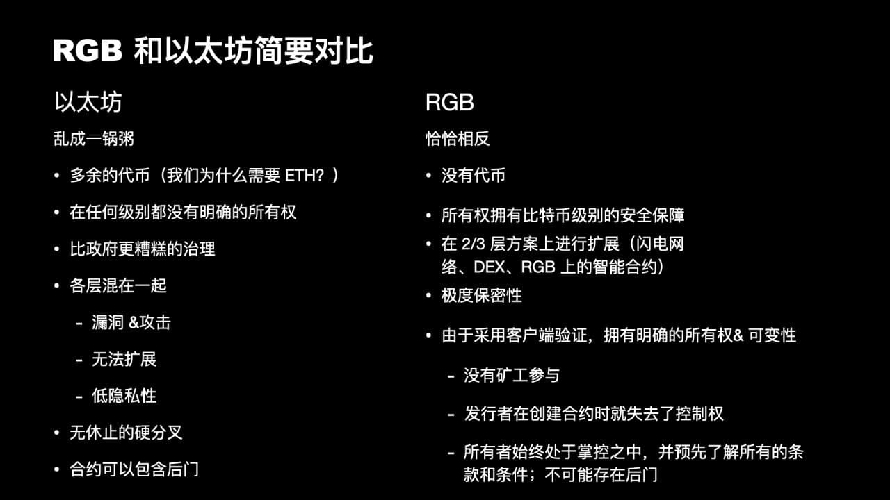

> *作者：FRANCISCO CALDERÓN*
> 
> *来源：<https://bitcoinmagazine.com/guides/a-brief-introduction-to-rgb-protocols>*

2009 年 1 月 3 日，中本聪推出了第一版比特币节点软件。自那一刻起，随着新节点的加入，比特币开始表现得如同一种崭新的生命形式，从未停止过进化的脚步。由于其独特的设计，它逐渐成为了世界上最安全的网络。中本聪考虑得十分周到，通过经济上的激励，比特币吸引用户（通常被称为矿工）投资有利于网络安全的能源和算力。

随着比特币的不断成长和普及，它开始面临扩容问题。比特币网络允许大约十分钟产生一个包含交易的新区块。假设每天能产生 144 个区块，每个区块都打包了最大值 2700 笔交易，平均下来比特币网络每秒钟也只能处理 4.5 笔交易。在中本聪 2011 年 3 月发给 Mike Hearn 的一封[邮件](https://plan99.net/~mike/satoshi-emails/thread4.html)中，我们可以看出他意识到了这个限制，在邮件中他还解释了我们今天所知道的支付通道是如何工作的。无需等待区块（全网）确认即可快速且安全地进行小额支付，这就是链下协议的用武之地。

[根据 Christian Decker 的说法](https://btctranscripts.com/chaincode-labs/chaincode-residency/2018-10-22-christian-decker-history-of-lightning/)，链下协议通常指的是用户使用来自区块链的数据，但用户自行管理数据而不使用区块链系统本身，直至最后实在有必要（才使用）。基于这一概念，闪电网络应运而生，它通过链下协议来实现几乎瞬间完成的比特币支付，且由于并非所有操作都要写到区块链上，闪电网络可以实现每秒上千笔交易。

比特币链下协议领域的研究和发展打开了潘多拉的魔盒，今天，我们知道我们能实现的远不止以去中心化的方式转移价值。非盈利性组织 [LNP/BP](https://lnp-bp.org/) 专注于开发比特币和闪电网络上的 2/3 层协议，而 [RGB](https://www.rgbfaq.com/) 在这些项目中脱颖而出。

## 什么是 RGB？

RGB 基于 [Peter Todd](https://lists.linuxfoundation.org/pipermail/bitcoin-dev/2016-June/012773.html) 关于一次性密封和客户端验证的研究，并被 Giacomo Zucco 和社区在 2016 年设想为比特币和闪电网络上更好的资产发行协议。这些想法的进一步发展导致 Maxim Orlovsky 将 RGB 开发成一个更加全面的智能合约系统，他自 2019 年以来在社区的参与下领导了这个系统的实现。

我们可以将 RGB 定义为一组允许我们以可扩展和保密的方式执行复杂智能合约的开源协议。它并非一个特定的网络（如比特币或闪电网络）；每个智能合约只是一组能用不同通信通道（默认为闪电网络）进行交互的合约参与者。RGB 利用比特币区块链作为其状态承诺层，并在链下维护智能合约的代码和数据，借此实现可扩展性。它利用比特币交易（以及脚本）作为智能合约的所有权控制系统；尽管智能合约的演化是通过一套链下方案来定义的。最后需要注意的是，所有内容都是在客户端验证的。

简而言之，**RGB 是一个允许用户随时审计、执行和验证智能合约的系统，而无需任何额外的开销，因为它并没有按照 “传统” 的方式来使用区块链。**复杂的智能合约系统由以太坊开创，但由于它要求用户花费大量的 Gas 执行每一步操作，因此它们从未实现过其承诺的可扩展性。结果也很显然，以太坊不可能真正为那些被排除在当前的金融系统以外的人提供资产管理服务。

当前的区块链行业提倡把智能合约代码和数据都存储在区块链上，并由全网所有节点执行，而无视区块链体积的过度增长和计算资源的滥用。**由 RGB 提出的方案则更加智能和高效，因为它通过将智能合约和数据从区块链中分离出来而摆脱了区块链范式，从而避免了在其它平台上常见的网络饱和的情况**，反过来，它并不要求每个节点都执行每份合约，而是将执行者变成了合约的相关方，这带来了前所未见的保密性。

## RGB 上的智能合约

RGB 上的智能合约开发者定义了一套方案来规定合约如何随时间推移而演化。这套方案是在 RGB 中构建智能合约的标准，发行者在定义发行的合约时和钱包或交易所在面对具体的合约时，必须先以这套标准来验证合约。只有当验证无误时，每个参与方才能接受请求并处理相应的资产。

**RGB 中的智能合约是一个由状态变更构成的有向无环图（DAG）**，该图始终只有一部分是已知的，其余部分则无法访问。RGB 方案是规定智能合约如何演化的一组核心规则，是所有智能合约的起点。每个合约参与方都可以对这组规则进行补充（在架构允许的前提下），由此产生的图是根据这些规则的迭代式应用而构建的。

## 同质化资产

RGB 中的同质化资产遵循 [LNPBP RGB-20 规范](https://github.com/LNP-BP/LNPBPs/blob/master/lnpbp-0020.md)，当定义一个  RGB-20 资产时，被称为“创世数据” 的资产数据通过闪电网络分发，其中包含了该资产的使用要求。最基本的资产形式不允许二次发行、代币销毁、重命名和替换。

有时候发行者需要在未来发行更多的代币，比如 USDT 这类的稳定币，需要通过增发代币使每枚代币的价值和通货膨胀资产（例如美元）的价值相挂钩。更为复杂的 RGB-20 方案可以满足这样的需求：除了创世数据以外，该方案还要求发行者生产 **consignment**（直译为 “代销合约”），后者也在闪电网络中流通；有了这个信息，我们就能知道该资产的总流通供应量。这同样也适用于资产的销毁或重命名。

与资产相关的信息可以是公开的，也可以是隐私的：如果资产的发行者要求保密，那么他/她可以选择不共享代币的信息，并在绝对隐私的情况下进行操作，但也存在相反的情况，发行者和持有者需要整个过程都透明。共享代币数据可以实现这一目的。

### RGB-20 流程

销毁流程使得代币失效，被销毁的代币无法再次使用。

替换的流程则是销毁代币并创建新数量的相同代币。这有助于减小资产历史数据的规模，对于维持资产的转让速度至关重要。

为了实现有可能销毁资产而不必替换资产的用例，需要用到一个 RGB-20 的子方案，该方案只允许销毁资产。

## 非同质化资产

RGB 上的非同质化资产遵循 [LNPBP RGB-21 规范](https://github.com/LNP-BP/LNPBPs/blob/master/lnpbp-0021.md)，在使用 NFT 时，我们也有一个主方案和一个子方案。这些方案有一个雕刻程序（engraving procedure），该程序允许附加自定义的数据作为代币所有权的一部分，今天我们在 NFT 上最常看到的例子就是和代币相关联的数字艺术。代币发行者可以使用 RGB-21 的子方案来禁止数据雕刻。不同于其它 NFT 区块链系统，**RGB 可以利用被称为 Bitfrost 的闪电 P2P 网络的扩展、以完全去中心化和抗审查的方式分发大体积的媒体代币数据。**该扩展也被用于构建许多其它形式的 RGB 特定的智能合约功能。

除了同质化资产和 NFT，RGB 和 Bitfrost 还可被用于生产其它形式的智能合约，包括去中心化交易所、流动性池、算法稳定币等，我们将在未来的文章中介绍。

### RGB 上的 NFT  vs. 其它平台上的 NFT

- 无需昂贵的区块链存储

- 无需 IPFS，取而代之的是一个被称为 Bitfrost 的闪电网络扩展（而且它是完全端对端加密的）

- 无需专门的数据管理方案 —— Bitfrost 再次承担了这个角色

- 无需信任网站来维护 NFT 代币或发行资产/合约 ABI 的数据

- 内置的 DRM 加密和所有权管理

- 利用闪电网络（Bitfrost）备份的基础设施

- 一种通过内容获利的方式（不仅可以通过出售 NFT 本身，还可以通过内容访问收费）

## 结论

自 13 年前比特币诞生以来，在这个领域已经有了非常多的研究和实验，无论成功还是失败都让我们更加了解了去中心化系统在实践中的表现如何，是什么让它们真正去中心化，又是什么行为容易导致它们走向中心化，所有这些都让我们得出结论 —— 真正的去中心化是一个罕见且难以实现的现象，只有比特币才能实现真正的去中心化，这也是我们集中精力在比特币之上构建 RGB 的原因。

在比特币的兔子洞中，RGB 也有自己的兔子洞；我会一边在其中钻进钻出，一边发表我学到的东西。在下篇文章中，我们将介绍 LNP 和 RGB 节点，以及如何使用它们。

（完）