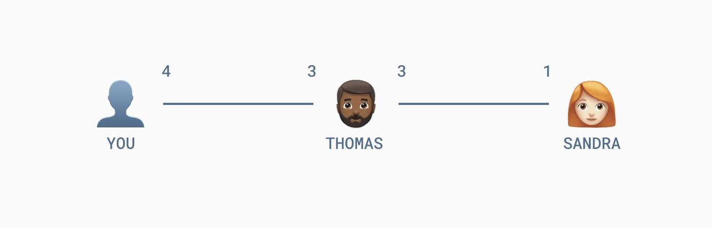
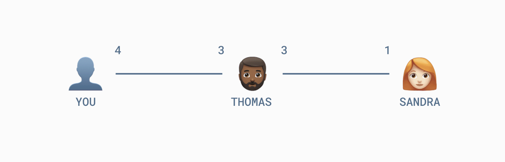
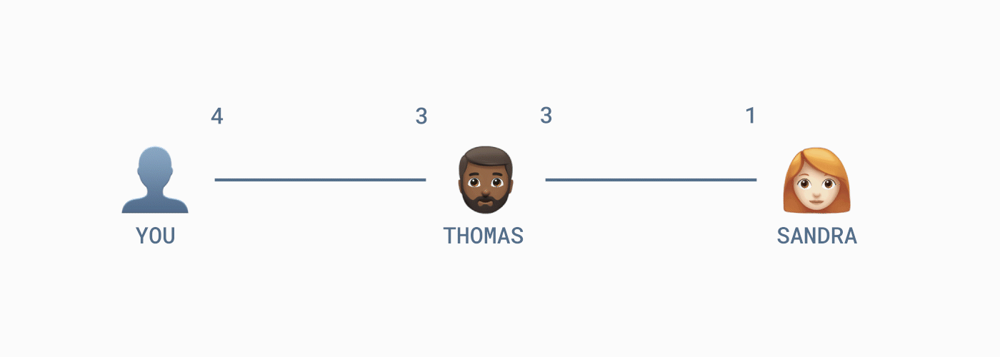

*作者：Florencia Ravenna*

*来源：<https://medium.com/muunwallet/a-closer-look-at-submarine-swaps-in-the-lightning-network-4417a2e8f93c>*

*译者：阿剑（hongji@ethfans.org）*

有关 submarine swap（“潜水艇互换”）的讨论已经持续好一段时间了，而且已经出现了有意思的产品和服务。那么，Submarine Swap 到底是什么，又是怎么工作的呢？本篇文章就要讲解这个问题。

要理解 submarine swap，我们先要知道什么是 HTLC：哈希时间锁合约。名字很唬人，但实际上很容易理解。而且，理解 HTLC 不仅仅是理解 submarine swap 的关键，也有助于理解闪电网络本身。

## 哈希时间锁

假如你是高贵的 Bictoiner，拥有 1 btc，你把一些钱转给了你的朋友 Martin 持有的地址。（得到你的支付之后）在花费这些比特币时，Martin 需要证明自己拥有这个地址所对应的私钥。这就是比特币最基本的工作形式：Martin 证明自己拥有私钥，然后就能花费那些钱。

我之所以说这是 “最基本的工作形式”，是因为你可以给 Martin 的使用行为添加更多的约束条件。实际上，你可以加入条件，要求 Martin 必须在一段时间内提供一个特定的秘密数据，否则就不能花这笔钱。一旦超时，这笔比特币就只能用另一组密钥（比如你自己的密钥）来使用了。

这个秘密数据是怎么来的？始作俑者是谁？这不是太重要。只有一点区别，如果这个数据是 Martin 自己创造的，那在使用这笔资金时就不会遇到任何障碍。但如果这个数据是别人创造的，那 Martin 就只有找到这个人、要到这个数据之后才能使用这笔资金。

无论如何，只要 Martin 知道了这个秘密数据，他就会尽快花掉这笔钱，哪怕是发给自己持有的另一个地址也好，以免超时。我们把这个动作叫做 “申领资金”。

你看，这就是所谓的哈希时间锁合约了：**它是一个要求资金的接收方在一段时间内证明自己知道一个特定的数值，否则就无法花费这笔钱的合约**。

事实证明，可以增加这种条件，让许多非常有趣且有用的功能得以实现，其中之一就是 “连锁支付”。这种功能对链上的交易来说可能用处不大，因为你毕竟可以把钱直接支付给最终的接收方。但对闪电网络来说就非常有用，因为闪电网络是由一对一的支付通道组成的，要让每个人都能给另一个人直接支付是非常低效的。

因为在路由网络（比如闪电网络）的语境下会更容易理解 HTLC 的作用，我们会先看一些链下支付的例子。不过，请记住，HTLC 在链上和链下交易中都能实现。甚至在别的区块链，比如莱特币中，也能实现。

## 哈希时间锁在闪电网络中的作用

假设你要给 Sandra 支付 1 btc，但你们之间没有支付通道；只有 Bob 跟你们俩都分别开设了一个支付通道，可以转发你的支付给她。这种连锁支付会遭遇什么问题呢？

如果没有哈希时间锁，事情可能在两个环节失控，就取决于谁先支付了”

- 如果你先给 Thomas 支付，Thomas 可以拿着这份资金跑路。 -

- 如果 Thomas 先给 Sandra 支付，相信你会信守诺言把钱给回他，那么你可以翻脸不认人，拒绝偿还（而 Thomas 给出去的钱是收不回来了） -

但如果有了哈希时间锁，Sandra 可以生成一个只有自己知道秘密数据，然后告诉你可以放心地转账给 Thomas，只是这笔资金有一个附加条款，Thomas 必须能在给定时间公开这个秘密数值，否则这笔钱会重新回到你手上。Sandra 可以在闪电网络收款请求中使用二维码给你这个指示。她完全无需把秘密数值透露给你，因为，**即使你对这个数值一无所知，也可以知道 Thomas 公开了 Sandra 的数值**（钱会被取走）。

现在 Thomas 可以给 Sandra 发送 1 btc，但是附上了一摸一样的条款：Sandra 必须在给定时间内揭示这个秘密数据。Sandra 自己知道这个数据，因此当然可以取走这个钱。然而，在她申领资金的那一刻，这个秘密也随之暴露，Thomas 也就知道了这个数值，因此可以申领你给他的资金了。

结果就是，你成功通过 Thomas 支付给了 Sandra，无需信任他们，也没有人会面临风险。现在你和 Thomas 都知道了 Sandra 所生成的秘密值，你也可以用它作为一种 *支付证明*，因为 Sandra 揭示它就获得了支付给她的资金。注意，这里的的超时机制是很重要的，它充当了应对 Sandra 拒绝或不能揭示这个秘密值时候的 “退款” 措施。

## Submarine swap 中的哈希时间锁

哈希时间既可以用在链上交易中，也可以用在链下交易中。实际上，它可以用在链上的支付方和链下接收方之间的连锁支付中，反过来也可以。这就是所谓的 “潜水艇互换”。

假设你想在闪电网络中为某事支付，到又不想自己手动管理一个通道。那么 submarine swap 让你可以使用链上的比特币给闪电网络的收款请求支付，只需通过一个 “互换服务提供商”。这是怎么做到的呢？

闪电网络的收款方可以生成一个二维码，来提示你设置给予互换服务提供商的资金的申领条件。这样你就可以放心地在链上把比特币发给互换服务提供商，附上哈希时间锁。

互换服务提供商没法立即使用你发给他的钱，因为他还不知道哪个秘密值。相反，他要通过闪电网络给收款方转账，附带一摸一样的申领条件，要求收款方公开这个秘密。

收款方知道这个秘密数值，但要领走这笔资金就只能暴露这个秘密，这时候，服务商也就知道了这个秘密，可以申领你支付给他的资金了。服务商和收款方皆大欢喜，区别只在于服务商要在链上申领资金，而收款方在链下申领。

## 潜水艇互换有什么用？

潜水艇互换可能是人们尝试闪电网络支付最简单的手段。虽然你还是要支付链上手续费，整个支付流程也很像链上支付，但收款方可以是即时到账的（跟具体的实现有关）。如果你想开一个闪电网络通道，也需要发起一笔链上交易。考虑到我们现在还在闪电网络早期，有一个易于上手的玩法是很重要的。这也是为什么我们在 [Muun Wallet](https://blog.muun.com/lightning-payments-easier-than-ever/) 中实现了潜水艇互换。

潜水艇互换对于想把部分资金从链上转移到链下（或者反之时），也很有用。举个例子，靠闪电网络来收账一周之后，店家可能需要一些链上的比特币来偿还账款。[Loop Out](https://blog.lightning.engineering/posts/2019/03/20/loop.html) 提供了一种支持反向潜水艇交换的方法，执行时可以[重新调整通道内的余额平衡](https://blog.muun.com/rebalancing-in-the-lightning-network/)并获得[入账容量](https://blog.muun.com/the-inbound-capacity-problem-in-the-lightning-network/)。

最后，给定潜水艇互换也可以在其它链上实行，你可以使用其它币，比如莱特币（手续费更低且上联速度更快）来做闪电支付，或者给自己的通道提供更多流动性。

潜水艇支付的观念来自 Lightning Labs 的开发者 Alex Bosworth 和 Olaoluwa Osuntokun，如今获得了越来越多的热度。虽然不无缺点，它可以帮早期的网络解决两大问题：流动性和接受度。

有关闪电网络，这里还有一些阅读材料：

- [Rebalancing: The Key to the Lightning Network](https://blog.muun.com/rebalancing-in-the-lightning-network/)
- [Rebalancing in the Lightning Network: Circular Payments, Fee Management and Splices](https://blog.muun.com/rebalancing-strategies-overview/)
- [How Splices Impact Lightning Network Fees](https://blog.muun.com/fees-proportional-to-the-amount/)
- [The Inbound Capacity Problem in the Lightning Network](https://blog.muun.com/the-inbound-capacity-problem-in-the-lightning-network/)（[中文译本](https://ethfans.org/posts/the-inbound-capacity-problem-in-the-lightning-network)）

（完）

