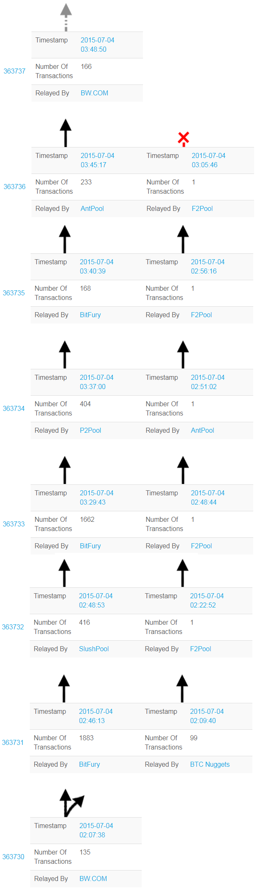

> *作者：BitMEX Research*
> 
> *来源：<https://blog.bitmex.com/bitcoins-consensus-forks/>*

**摘要**：在本文中，我们列出了比特币共识规则的 19 次更改（或者应该叫 18 次，因为有一次意外地 “失败了”），我们相信它们代表了比特币历史上的几乎所有重大事件。至少有三次事件导致了可辨识的链分裂，分别在 2010 年、2013 年和 2015 年发生，分别持续了 51 个、24 个和 6 个区块。

- 图片来源：<a href="https://www.flickr.com/photos/105239286@N06/10247171643/">gryb25</a> -

## 术语

| 术语                 | 定义                                                         |
| -------------------- | ------------------------------------------------------------ |
| 链分裂（chainsplit） | 区块链的分裂，产生两条相互独立但拥有共同祖先的链。原因可能是硬分叉，也可能是软分叉，甚至可以是非分叉的其它原因。 |
| 硬分叉               | 放松关于区块有效性的共识规则，使得一些原本被认为是无效的区块在新规则下会被认为是有效的。 现有的节点必须升级才能跟随硬分叉后的链。 |
| 软分叉               | 收紧关于区块有效性的共识规则，使得一些原本被认为有效的区块在新规则下会被认为是无效的。 现有的节点不是必须升级，不升级也能跟随软分叉后的链。 |

注意：这些术语被认为始创于 [2012 年 4 月](https://gist.github.com/gavinandresen/2355445)，并在 [BIP99](https://github.com/bitcoin/bips/blob/master/bip-0099.mediawiki) 和 [BIP123](https://github.com/bitcoin/bips/blob/master/bip-0123.mediawiki) 中得到正式表述。

## 比特币共识分叉列表

### 2010 年 7 月 28 日（禁用 OP_RETURN）

**激活区块号**：无 1

**BIP 号或软件版本号**：[0.3.5](https://en.bitcoin.it/wiki/Common_Vulnerabilities_and_Exposures#CVE-2010-5141)

**内容**：禁用 OP_RETURN，修复一个致命的 bug，该 bug 可以让任何人花费任何比特币。

**类型**：软分叉

**结果**：未有证据表明该次升级期间出现了问题。

### 2010 年 7 月 31 日（加入 OP_NOP）

**激活区块号**：无 1

**BIP 号或软件版本号**：[0.3.6](https://github.com/bitcoin/bitcoin/commit/a75560d828464c3f1138f52cf247e956fc8f937d)

**内容**：

1. [禁用](https://github.com/bitcoin/bitcoin/commit/a75560d828464c3f1138f52cf247e956fc8f937d#diff-8458adcedc17d046942185cb709ff5c3L109) OP_VER 和 OP_VERIF 3。
2. 加入 OP_NOP 功能。

**类型**：第一项为软分叉；第二项为硬分叉。

**结果**：一些用户在升级期间遇到了问题，并且无法升级的用户被建议强制关闭节点 2。

### 2010 年 8 月 1 日（隔离脚本签名和脚本公钥的求值）

**激活区块号**：无 1

**BIP 号或软件版本号**：[0.3.7](https://github.com/bitcoin/bitcoin/commit/73aa262647ff9948eaf95e83236ec323347e95d0)

**内容**：[让脚本签名和脚本公钥分别求值](https://github.com/bitcoin/bitcoin/commit/6ff5f718b6a67797b2b3bab8905d607ad216ee21#diff-8458adcedc17d046942185cb709ff5c3L1135)。修复了一个致命的 bug，该 bug 可以让任何人花费任何比特币。

**类型**：硬分叉

**结果**：没有证据证明在此期间出现了问题。

### 2010 年 8 月 15 日（修复数值溢出漏洞；禁用 OP_CAT）

**激活区块号**：74,638

**BIP 号或软件版本号**：[0.3.10](https://github.com/bitcoin/bitcoin/commit/08fee75201e82f2e34fcc1549ee8edd152f5d040)

**内容**：

1. 在 1845 亿比特币被花费的事故出现后，修复输出的数值溢出漏洞。作为该交易的输入的 0.5 BTC [至今没有再被花费过](https://blockchain.info/address/17TASsYPbdLrJo3UDxFfCMu5GXmxFwVZSW)。
2. 禁用 OP_CAT，从而移除了一个 DoS 攻击界面，同时还禁用了 14 种[其它功能](https://github.com/bitcoin/bitcoin/commit/4bd188c4383d6e614e18f79dc337fbabe8464c82#diff-8458adcedc17d046942185cb709ff5c3R94)。

**类型**：都是软分叉

**结果**：发生了一次链分裂。大概在这次事故的 5 个小时后，修复措施作为 0.3.10 版放出。人们普遍认为，在 “好的链” 重新变成最长链之前，“坏的链” 一共挖出了 [51 个区块](https://bitcointalk.org/index.php?topic=823.msg9734#msg9734)

### 2010 年 9 月 7 日（不正确地实现签名操作数量限制）

**激活区块号**：无 1

**BIP 号或软件版本号**：[0.3.12](https://github.com/bitcoin/bitcoin/commit/8c9479c6bbbc38b897dc97de9d04e4d5a5a36730)

**内容**：以不正确的方式加入了 20000 个签名的操作数量限制。

**类型**：软分叉

**结果**：没有证据表明在此期间出现了问题。

### 2010 年 9 月 12 日（加入区块大小限制）

**激活区块号**：79,400

**BIP 号或软件版本号**：无

**内容**：加入了 1MB 的区块体积限制。加入 ` MAX_BLOCK_SIZE = 1000000 ` 代码的提交在 2010 年 7 月 15 日[发生](https://github.com/bitcoin/bitcoin/blob/a30b56ebe76ffff9f9cc8a6667186179413c6349/main.h#L18)，该版本在 [2010 年 7 月 19 日](https://github.com/bitcoin/bitcoin/commit/9d2174b6f5f3fac2463c7ebc2dbb9004b3740d23)以 0.3.1 rc1 的版本号发布。[这段新代码](https://github.com/bitcoin/bitcoin/commit/8c9479c6bbbc38b897dc97de9d04e4d5a5a36730)从 2010 年 9 月 7 日开始强制执行 1MB 的区块大小限制规则，并在区块高度 79400 处激活。在 2010 年 9 月 20 日，中本聪[移除](https://github.com/bitcoin/bitcoin/commit/172f006020965ae8763a0610845c051ed1e3b522)了这种激活逻辑，但保留了 1MB 的大小限制。  

**类型**：软分叉

**结果**：没有证据表明在此期间出现了问题。

### 2012 年 3 月 15 日（不允许交易使用相同的 TXID）

**激活区块号**：171,193

**BIP 号或软件版本号**：[BIP30](https://github.com/bitcoin/bips/blob/master/bip-0030.mediawiki)

**内容**：不允许交易使用完全相同的 TXID，除非旧的那一笔已经被完全花费掉。在 [2012 年 9 月](https://github.com/bitcoin/bitcoin/commit/ab91bf39b7c11e9c86bb2043c24f0f377f1cf514)，这个规则施加到所有区块上，只有 91842 和 91800 两个区块是特例（它们是违反了这条规则的历史区块）。

**类型**：软分叉

**结果**：这是一次信号日（flag-day）软分叉。没有证据表明在此期间出现了问题。

### 2012 年 4 月 1 日（P2SH）

**激活区块号**：173,805

**BIP 号或软件版本号**：[BIP16](https://github.com/bitcoin/bips/blob/master/bip-0016.mediawiki)

**内容**：支付到脚本哈希值（Pay-to-script hash，P2SH）允许交易被发送给一条脚本哈希值（以数字 3 开头的地址），而不仅仅是一个公钥的哈希值（以数字 1 开头的地址）。

**类型**：软分叉

**结果**：在 2012 年 2 月 1 日的前一周，达到 55% 的激活门槛。矿工的[升级速度不够快](https://bitcointalk.org/index.php?topic=66514.0;all)，所以激活时间点被推迟到 3 月 15 日。使用 0.6.0 rc1 版本而没有升级（因此不适用推迟）的用户，更早地激活了软分叉，并被卡在了[区块高度 170060 处](https://bitcointalk.org/index.php?topic=63165.60)，因为根据他们的节点，这个区块中包含了一笔无效交易。在激活之后，因为仍有 45% 的矿工在生产无效的区块，问题持续了几个月。

### 2013 年 3 月 24 日（要求 coinbase 交易包含区块高度）

**激活区块号**：227,835

**BIP 号或软件版本号**：[BIP34](https://github.com/bitcoin/bips/blob/master/bip-0034.mediawiki)

**内容**：要求 coinbase 交易包含区块高度。

**类型**：软分叉

**结果**：达到 95% 的激活门槛。成功启动。

### 2013 年 3 月 11 日（Bitcoin Core 数据库切换，意料之外的硬分叉）

**激活区块号**：225,430

**BIP 号或软件版本号**：[0.8.0](https://bitcoin.org/en/alert/2013-03-11-chain-fork)

**内容**：这是一次意料之外的硬分叉，由 Bitcoin Core 的数据库技术从 Berkeley DB 切换成 LevelDB 导致；切换意外地移除了一个未知的 10000-BDB 数据库锁限制。这导致了 2013 年 3 月 11 日的硬分叉，虽然导致错误的软件是在 2013 年 2 月 20 日（20 天以前）发布的了。这次变更因为比特币社区和矿工切换会 0.7.2 规则而回滚。

**类型**：共识规则没有发生改变

**结果**：发生了一次至少持续 24 个区块的链分裂，使用 0.8.0 的链最多领先 13 个区块。还发生了[一次成功的重复花费](http://archive.is/64Rkj)。

### 2013 年 3 月 18 日（输入数量的区块级限制）

**激活区块号**：无 1

**BIP 号或软件版本号**：[0.8.1](https://github.com/bitcoin/bitcoin/commit/34d62a8efe4c51b2dd73d56fa03001d4accee4ad)

**内容**：这是一次临时的软分叉，引入了一条新规则：一个区块内通过交易输入引用的 TXID 数量不能超过 4500 个。这条规则比起 10000-DBD 锁限制更为严格。这个规则在 2013 年 5 月 15 日通过信号日硬分叉[废止](https://github.com/bitcoin/bitcoin/commit/8bd02881899bbae2d8e5082081e02c7d577994e5#diff-7ec3c68a81efff79b6ca22ac1f1eabba)。

**类型**：软分叉

**结果**：没有证据表明在此期间出现了问题。

### 2013 年 5 月 15 日或 8 月 16 日（废止输入数量的区块级限制）

**激活区块号**：252,451 或更早

**BIP 号或软件版本号**：[BIP50](https://github.com/bitcoin/bips/blob/master/bip-0050.mediawiki)

**内容**：在 2013 年 8 月，一个生产出来的区块可能违反了最初的 10000-BDB 锁限制规则；该规则在 2013 年 5 月 15 日放宽了。

**类型**：硬分叉

**结果**：没有证据表明在此期间出现了问题。

### 2015 年 7 月 4 日（更严格的 DER 形式签名）

**激活区块号**：363,731

**BIP 号或软件版本号**：[BIP66](https://github.com/bitcoin/bips/blob/master/bip-0066.mediawiki)

**内容**：严格使用 DER 形式的签名，意味着比特币不再依赖于 OpenSSL 的签名解析。

**类型**：软分叉

**结果**：在一个为期 1000 个区块的周期内获得 95% 的同意。发生了一次链分裂，留下了 6 个区块，因为一些矿工发信号表示支持 BIP66，但没有升级，同时又是 [SPY 挖矿](https://blog.bitmex.com/empty-block-data-by-mining-pool/)的。最终软分叉的链领先了。

### 2015 年 12 月 14 日（CLTV 脚本级绝对时间锁）

**激活区块号**：388,380

**BIP 号或软件版本号**：[BIP65](https://github.com/bitcoin/bips/blob/master/bip-0065.mediawiki)

**内容**：Check Lock Time Verity（OP_CLTV）在未来某个时间点以前可以一直锁定。这是比特币的第一个新功能。

**类型**：软分叉

**结果**：达到 95% 的激活阈值，成功激活。

### 2016 年 7 月 4 日（相对时间锁）

**激活区块号**：419,328

**BIP 号或软件版本号**：[BIP68](https://github.com/bitcoin/bips/blob/master/bip-0068.mediawiki)、[BIP112](https://github.com/bitcoin/bips/blob/master/bip-0112.mediawiki)、[BIP113](https://github.com/bitcoin/bips/blob/master/bip-0113.mediawiki)

**内容**：

- 交易级相对事件锁，允许交易的输出在交易得到确认后的一段时间内禁止花费。
- CheckSequenceVerify，脚本级相对时间锁。
- 中值时间（Median time-past）消除了矿工使用未来的时间戳来获得更多交易手续费的激励。

**类型**：软分叉

**结果**：使用 95% 的版本位（versionbits）信号机制，成功激活。

### 2017 年 7 月 23 日（加速隔离见证激活表态）

**激活区块号**：477,800

**BIP 号或软件版本号**：[BIP91](https://github.com/bitcoin/bips/blob/master/bip-0091.mediawiki)

**内容**：这个临时的软分叉强制要求对 SegWit 表示支持。

**类型**：软分叉

**结果**：在一个为期 336 个区块的周期里，这个软分叉以 80% 的挖矿阈值成功激活，虽然只有少数用户强制执行 BIP91 规则，因此它被废止了。因此，在此期间，发生链分裂的风险增加了。

### 2017 年 8  月 1 日（加速隔离见证激活表态）

**激活区块号**：478,479

**BIP 号或软件版本号**：[BIP148](https://github.com/bitcoin/bips/blob/master/bip-0148.mediawiki)

**内容**：这个临时的软分叉强制要求在 2017 年 8 月 1 日后的两周内对 SegWit 升级表示支持。

**类型**：软分叉

**结果**：信号日软分叉似乎成功了，没有出现问题，虽然只有少数用户执行 BIP148 规则，因此它被废止。在此期间，链分裂的风险增加了。

### 2017 年 8 月 24 日（SegWit 升级）

**激活区块号**：481,824

**BIP 号或软件版本号**：[BIP141](https://github.com/bitcoin/bips/blob/master/bip-0141.mediawiki)、[BIP143](https://github.com/bitcoin/bips/blob/master/bip-0143.mediawiki)、[BIP147](https://github.com/bitcoin/bips/blob/master/bip-0147.mediawiki)

**内容**：隔离见证（[SegWit](https://blog.bitmex.com/the-segwit-transaction-capacity-increase-part-1/)）升级。

**类型**：软分叉

**结果**：以 95% 的版本位信号激活。

### 从今年到 2262 年

**激活区块号**： 1,3440,000

**BIP 号或软件版本号**：[BIP42](https://github.com/bitcoin/bips/blob/master/bip-0042.mediawiki)

**内容**：修复 2100 万 BTC 供给量限制的 bug。软件在 2014 年 4 月升级以修复这个漏洞，但新的规则不会在 23 世纪以前适用。

**类型**：软分叉

**结果**：这个软分叉尚未被应用。

### 注释

1. 除了 1MB 区块大小限制的软分叉以外，在 2012 年 BIP16 软分叉以前，软分叉激活是没有方法可言的，所以如果分叉平滑地发生，没有出现链分裂的话，共识分叉并不必然有准确的区块高度和日期。
2. “如果你不立即升级到 0.3.6，最好关掉你的比特币节点，升级之后再开启。”—— [Satoshi Nakamoto](http://archive.is/L7amG)
3. 在移除 OP_VER 以前，每一次软件升级都可以被认为是一种非确定式的硬分叉，而这些升级到没有记录在这个列表中。如果硬分叉的定义要包含这些升级，那会有点迂腐。
4. 上表没有连贯一直的定义，因为，比如说，根据具体的情形选取分叉发生时间的定义，会更有用。
5. 有些人提到，对 P2P 协议的改变也可以被认为是硬分叉，因为这让旧软件变得不可用（它们将不再能连接到网络）。但是，严格来说，这种变更没有放松关于区块有效性的定义，所以你可以通过建立一个过渡版本的软件作为中继，从而同步旧版本的软件。所以这类变更都从这个列表中排除了。
6. 一些人认为 [BIP90](https://github.com/bitcoin/bips/blob/master/bip-0090.mediawiki) 是一次硬分叉，但因为它只放松了过去发生的软分叉相关的规则，所以它没有常规的硬分叉所具有的许多特性和风险。因为相同的逻辑，区块检查点方案也可以被认为是软分叉。
7. 在 [2010 年 7 月](https://github.com/bitcoin/bitcoin/commit/40cd0369419323f8d7385950e20342e998c994e1#diff-623e3fd6da1a45222eeec71496747b31R420)，链选择规则被替换成选择累积工作量最多的链，而不是最长的链。技术上来说，这不是对区块有效性规则的变更；但是，这一变更跟共识规则变更一样具有某些风险。

## 2013 年那场意外算是一次硬分叉吗？

从我们的角度来看，公平地说，2013 年 3 月 11 日的链分叉之后，对 BDB 锁限制的提高是一次硬分叉。相关的规则是 10000-BDB 的锁限制，在分叉后被放松了。这个规则是在  [2013 年 3 月 15 日](https://github.com/bitcoin/bitcoin/commit/8bd02881899bbae2d8e5082081e02c7d577994e5#diff-7ec3c68a81efff79b6ca22ac1f1eabba)在软件的 0.8.1 上放松的，并在 [2013 年 3 月 18 日](https://github.com/bitcoin/bitcoin/commit/34d62a8efe4c51b2dd73d56fa03001d4accee4ad)发布。超出这个限制的区块最终在 2013 年 8 月 16 日产生，所以你可以将硬分叉的日期定为 2013 年 5 月 15 日，或者 2013 年 8 月 16 日。

一些人会认为，因为许多原因，这次变更不算硬分叉，包括：这条规则是 “准-非确定性的”，或者说，你可以手动改变 BDB 的配置。实际上，因为这个锁限制的非确定性特性，理论上来说你可以建立一个本地系统，使得旧有的 BDB 锁限制永远无法被突破。因此，你可以断言比特币 “从来没发生过硬分叉”，但你的硬分叉定义将要求硬分叉是确定性的，或者必须直接跟比特币的数据（比如交易和区块头）相关。

在讨论这次意外时，比特币开发者 Gregory Maxwell [说](https://bitcointalk.org/index.php?topic=702755.msg8116032#msg8116032)：

> 这有点复杂，实际机上，你可以使用一个 BIP-50 以前的节点完整地同步区块链，几个月前我刚刚用 0.3.24 版本这么干过。它只是不能可靠地处理涉及大区块的链重组，除非你也改变 BDB 配置。所以，它到底是不是一次硬分叉，当然是可以争辩的，因为它是准非确定性的。在此之前，同样有其它的 bug 修复会导致更旧的版本被卡住、停止同步区块链 …… 所以我认为，从一个非常强的定义 —— 硬分叉将导致新链违反被以前的版本强制执行的规则 —— 来看，我们没有硬分叉过。

## 2015 年的链分裂事故

在上面的共识规则变更列表中，有三次时间导致了可辨识的链分裂。最近的一次发生在 2015 年 7 月 4 日，在 BIP66 软分叉升级期间。

在 BIP66 激活之后，立即出现了长达 6 个区块的孤链，因为一个矿工创建了一个无效区块，但其他一些矿池不认为这是个无效区块，因为他们根本不验证新区块。

所以实情是，一些矿工表示支持 BIP66 软分叉，但没有升级自己的节点来验证；你可以认为一些矿工是在 “做样子”。要是矿工们一直都验证区块，他们会发现这个区块是无效的，然后拒绝掉。相反，一些矿工直接在无效区块上继续挖矿，所以发生了链分裂。

下图展示了这个长达 6 个区块的链分裂。

- 来源：Blockchain.info；http://archive.is/WqGRp 和 http://archive.is/LHlF7  -

**注意**：在本文出版之后，[Bitcoin Wiki](https://en.bitcoin.it/wiki/Consensus_versions) 发布了另一份共识版本的清单。

**免责声明**

虽然本文引用了许多来源，但我们并不保证准确定。我们可能犯了错误，或偶然漏过了一些共识规则变更。欢迎更正。

（完）