> *作者：ARMAN THE PARMAN*
> 
> *来源：<https://bitcoinmagazine.com/technical/a-comprehensive-bitcoin-coinjoin-guide>*

## 前言

在了解什么是 CoinJoin 之前，了解 UTXO（未花过的交易输出）和比特币交易有助于您更好地理解它。如果您已经掌握了这部分知识，可以跳过这两段内容，但常读常新，读一下还是很有价值的。

### 比特币交易

简而言之，比特币交易由输入和输出（内含比特币的数量）以及使用私钥创建的数字签名组成。

比特币交易就好比是银行支票。银行支票包括：

- 付款账户
- 收款方
- 金额
- 签名

下图是使用公共比特币节点 https://mempool.space/ 从比特币区块链上随机复制的比特币交易 I （如果碰巧选中了您的交易，还请见谅！）：

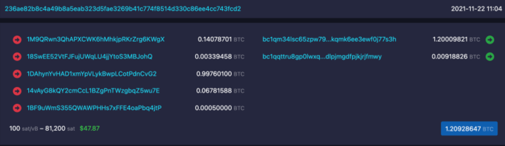

图左有 5 个比特币数额作为输入，被花费后变成图右 2 个不同的输出（图左的 5 个输入包含的比特币总数约等于图右的 2 个输出包含的比特币总数。二者之间的差额是支付给挖出该区块的矿工的交易费。）

左下角显示了交易费的计算方式：81,200 satoshi 或每字节 100 satoshi（有意思的是，鉴于这个时期交易池中等待上链的交易不是特别多，这个手续费高得离谱，完全没有必要）。

签名细节没有展示出来，但是每个节点都已验证过该签名是有效的。

### UTXO

“UTXO” 是个非常可怕的名称。虽然它在字面意思上表述得非常精准，而且对于经验丰富的比特币用户来说不难理解，但是对于新手而言无异于天书。如果我们换个说法，比如 “收讫款（Received Coin）”，会容易理解得多。我这么一说，你可能已经明白了 “UTXO” 是什么。

虽然比特币是可分割的，但是请你不要把比特币想象成一滩可以倒来倒去的液体，把它想象成一块一块的固体，就像钱包里的硬币那样。我喜欢以比特币的竞品黄金为例：

想象一下，你收到了一枚重达 1.2 盎司（约等于 34 克）的金币。现在，你想付给某人 0.2 盎司的黄金。你必须将这枚重 1.2 盎司的金币融掉，重铸成一枚重 0.2 盎司的金币和另一枚重 1 盎司的金币。前一枚用来付款，后一枚自己留着。

比特币就是这样。当你的钱包收到 1.2 BTC 时，你就有了一笔包含 1.2 BTC 的 “收讫款”，也就是 UTXO。 如果你想要花费 0.2 BTC，你无法从这 1.2 BTC 中将它拆分出来，只花这部分。你必须将这 1.2 BTC 全都 “融掉”，即，通过一笔交易花掉。在这笔交易中，你可以任意拆分这 1.2 BTC，然后发送给任意多个不同的地址，包括你自己的地址。

这就涉及到了 “找零” 的概念。若想花费 0.2 BTC，你需要将 1.2 枚比特币作为交易的输入来创建两个输出。其中一个输出作为付款（0.2 BTC），另一个输出作为找零发送给你自己（的地址），如下图所示：

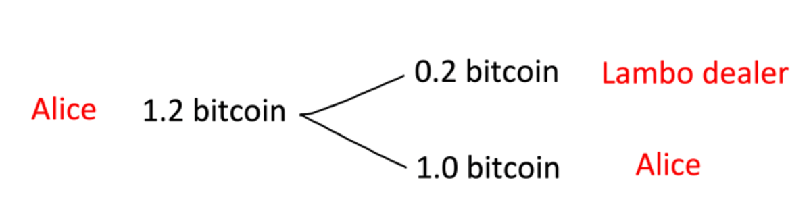

Alice 拥有的某个钱包地址中的 1.2 BTC 已经被拆分成了两笔款项。兰博基尼经销商的钱包地址收到了 0.2 BTC，Alice 的钱包地址收到了 1.0 BTC。

最后再举一个例子：假设你的钱包里有以下几个 UTXO，你需要向某人支付 0.6 BTC：

- 0.2 BTC
- 0.5 BTC
- 0.002 BTC

你的交易会将分别包含 0.2 BTC 和 0.5 BTC 的两个 UTXO 作为输入（只留下包含 0.002 BTC 的 UTXO）。这笔交易会产生两个输出：0.6 BTC 作为付款，0.1 BTC 作为找零。交易达成后，你的钱包将拥有一个包含 0.002 BTC 的 UTXO 和一个包含 0.1 BTC 的 UTXO。这时，钱包的总余额就是二者之和 0.102 BTC（为简单起见，此处不计入矿工费）。

## CoinJoin 是什么？

很多人都不知道的是，一笔交易可以包含多个人的数字签名。正是这一功能让 CoinJoin 成为可能。

CoinJoin 就是两名或多名用户将他们的交易合并成一笔交易。这样一来，交易达成后，每笔付款的归属将无法分辨。这种模糊性是通过匹配相同大小的输入或输出实现的，详见以下示例。

观察者有可能根据被花费的代币追踪到某个人（无论这个人的真实身份是否曝光）。例如，某个代币从地址 A 转移到了地址 B 和 C。在这种情况下，我们或许能够确定地址 C 中的代币属于地址 A 的所有者。这就是比特币的伪匿名特性。但是，由于交易所用户必须（根据 KYC 要求）提交身份证明，某些监控公司又掌握了从交易所提现至地址 A 的代币的所有者的真实身份，自然就知道了地址 C 的所有者的身份。请注意，区块链上没有现实世界的身份信息，这些信息都存在于比特币区块链之外。只有能够访问交易所的 KYC 数据的人才能知道代币持有者的身份。这些人是谁？无非就是交易所、购买了用户数据的监控公司、政府和黑客。

下面，我将展示 CoinJoin 交易如何打破地址 A、B 和 C 之间的伪匿名身份关联。正如上文提到的，这里面利用了等额 UTXO。以下面这笔 CoinJoin 交易为例：

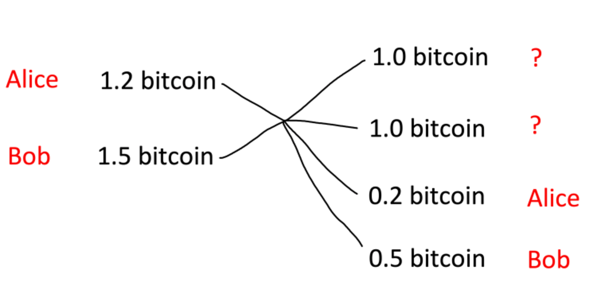

如图左所示，该交易包含来自两个不同的人 Alice 和 Bob 的两个输入。只有能够访问 KYC 数据的人才知道这两个输入分别属于 Alice 和 Bob。在其他人眼中，这两个人只是某某 A 和某某 B。

这笔交易创建了两个包含 1 BTC 的 UTXO。我们不知道哪个属于 Alice（某某 A），哪个属于 Bob（某某 B）。每个 UTXO 属于 Alice 或 Bob 的概率都是 50%。我们可以根据数学逻辑轻而易举地推断出 0.2 BTC 和 0.5 BTC 分别归谁所有。

我们将目光聚焦在 Alice 身上，她的某个钱包地址已经收到了 1 BTC。这不是完全私密的，因为在外部观察者看来，这个 1 BTC 有 50% 的概率属于 Alice。为了提高隐私性，Alice 可以将这些 UTXO 再与（除 Bob 以外的）其他人的 UTXO 混合。

## CoinJoin 能为你做什么？

### **让你的比特币躲过政府的审查？**

CoinJoin 交易无法向政府隐瞒你持有的经过 KYC 的比特币数量。如果你持有经过 KYC 的比特币，这意味着你向交易所提供了自己的身份证件并使用交易所账号购买了比特币。在这种情况下，你应该预设交易所会在政府需要时向其泄漏你的所有交易和提现操作。

假设你购买了 1 BTC 并提现到自己的钱包，然后进行 CoinJoin 交易，政府或许无法知道你将这 1 BTC 转移到了哪个（些）地址，但它知道你拥有 1 BTC。如果你卖掉这 1 BTC，根据法律要求你可能需要上报这笔交易。如果当地通过了没收比特币或就未实现收益征税的法律，政府就能清楚地知道你拥有多少比特币。

### **翻船事故**

如果你声称自己的比特币已经在一次翻船事故中全部丢失了，在事故发生前已知属于你的比特币只能永远沉睡。那么，一旦你动用了它们，你口中悲惨的翻船事故就成了显而易见的骗局。说得清楚一些：在说谎之前先使用混币操作确实有帮助，但我并不提倡这么做。这是个很危险的策略。

### **支出隐私**

不过，CoinJoin 交易能做到的是，当你花费一笔比特币时，收款方无法得知这笔付款的来源。我会在后文给出解释。假设你在一个地址上存有 10 BTC，你从中拿出 0.001 BTC 付给某人。收款方可以在区块链上查到这 0.001 BTC 来自一个存有 10 BTC 的地址。但是，如果你将自己的比特币与其他人的混在一起，这笔付款可能来自一个仅存有少量比特币的地址，而且这个小数额的比特币的历史也将不再精确。这就意味着，你持有的其它比特币不会被暴露，从而实现了隐私性。

## **你应该使用 CoinJoin 交易吗？**

如果你理解了为什么你无法向政府隐瞒你持有多少比特币，而且你也不想策划所谓的 “翻船事故” ，你只想获得支出隐私，那你应该使用 CoinJoin 交易吗？

请带着这个问题继续读下去。要知道，对于几乎所有人来说，闪电网络就能提供足够高的支出隐私性了。

话虽如此，如果人人都使用 CoinJoin 交易，或者 CoinJoin 交易成为钱包中的默认实现，人人都能不费吹灰之力享受更高水平的隐私性。

## **使用 CoinJoin 交易是错的吗？违法的吗？有什么风险？**

有些人担心，经过混合的比特币有一天会被标记为 “被污染的”，因此不被交易所接受。这种事确实有可能发生，但是规避起来并不难。你可以使用被污染的比特币开启闪电通道，任何收到闪电网络交易的人都无法知道这个通道是使用经过混合的比特币开启的。

另外，你可以只混合部分而非全部比特币，以对冲风险。

## 如何进行 CoinJoin 交易？选择一：自动化服务

一些服务可以让你将自己的比特币放到比特币池中进行混合。例如，Samourai 的 Whirlpool、Wasabi 或 JoinMarket。这些池子都各有利弊。

### **Whirlpool 和 Wasabi**

Samourai 的 Whirlpool 和 Wasabi 都提供收费灵活的自动化混币服务。你只需要让你的软件保持运行，中心化协调程序会将你的比特币与其它用户的比特币混合起来。不同的混币设置下，收费也不相同，但是约为混币金额的 0.2%，包含服务费和矿工费。

### JoinMarket

JoinMarket 与上面两例不同。它虽然提供的也是自动化服务，但混币市场是自由的。用户既可以将自己的币提供给其他用户混合以赚取费用，也可以付费给其他挂单者让他们将自己的币与你的混合（“吃单者”）。

如果你是挂单者，你需要将你的比特币放在电脑里的热钱包内，等待有人接受你的报价，与其他挂单者在价格和混币规模上竞争 —— 你的混币服务能否卖出去、何时卖出去都是未知数。将你的币存在热钱包而非冷钱包内也有一定的风险。如果你成功出售了混币服务，拿到了自己设定的费用，这就是你承担风险所获得的回报。

如果你是吃单者，即使你支付了费用，你的币也不会立即被混合。一次混合所需的时间取决于矿工何时挖出下一个比特币区块。总体而言，使用 JoinMarket 听起来似乎很有趣，但是要想成功实现在技术上是个不小的挑战。JoinMarket 还无法打入主流市场。至少得是使用过 Linux 命令行的人才能应付得来。

鉴于外部参数不可控，我通常不推荐使用自动化混币服务，因此没有编写相关指南。不过，在互联网上搜索一下就能得到很多收获。

## 如何进行 CoinJoin 交易？选择二：自助式 CoinJoin

自己创建 CoinJoin 交易的优点是完全可控、节省成本。但是，你需要与其他人协调交易，这会限制你能够达成的 CoinJoin 交易量。另外，你还需要具备创建 CoinJoin 交易和完全控制交易的相关知识。

另外，良好理解交易隐私性也会有助益。否则，你会在不经意间犯错或前功尽弃。

我发现自助式 CoinJoin 的最大优点是可以探索有趣的可能性。我将解释如何做到这点，但首先你要知道如何使用 Electrum 桌面钱包。[点击此处，即可学习。](https://armantheparman.com/using-electrum-desktop-wallet)

### 步骤一：运行节点

重要的是运行你自己的节点。如果不这么做，你的币即使混合后再发送至你的钱包也不是私密的。无论你使用的是否是自动化混币服务都是如此。为什么？因为如果你没有运行自己的节点，你的钱包就会向随机某个节点提供其地址和 IP 地址，这个节点有可能是监控公司运行的。

自己运行节点还有其它很多优点（[我在这篇文章中阐述了 6 个](https://bitcoinmagazine.com/culture/six-reasons-you-should-run-bitcoin-node)）。我建议新手运行 MyNode 包（[具体参见我的 MyNode 指南](https://armantheparman.com/mynode-bitcoin-node-easy-setup-guide-raspberry-pi)）。如果你是个老手，最好还是使用完全开源的 RaspiBlitz（[具体参见我的 RaspiBlitz 指南](https://armantheparman.com/raspiblitz)）。

### 步骤二：创建私密钱包

你可能已经有了一个钱包，但是就像我上文提到过的那样，如果这个钱包曾连接过公共节点，钱包中的地址（包括没有使用过的地址）就不再是私密的。因此，向这个钱包发送比特币会损坏这些比特币的隐私性。

如果你使用硬件钱包创建了一个新的私钥，请永远不要让这个私钥连接到该硬件钱包的软件/节点。如果是常用的 Ledger，要做到这点几乎是不可能的。你需要在将自己的私钥连接到 Ledger Liver **之前**，创建一个种子（seed）。一旦连接成功，Ledger Live 就有可能记录你的所有地址和 IP 地址。但是不用担心，即使连接过了，你也可以使用种子创建新的钱包：只需添加一个密语（passphrase）即可，而且新创建的钱包将是私密的。没有密语的钱包可以被丢弃或弃用。（[点击此处](https://armantheparman.com/using-hwws)，了解更多关于如何正确使用硬件钱包的内容。）

如果是 Coldcard 硬件钱包，就不会出现类似的问题，因为它不会要求你连接它的软件。

如果你是个纯粹主义者，[可以通过抛骰子或硬币创建种子](https://bitcoinmagazine.com/culture/diy-bitcoin-private-key-project)，然后使用[不联网电脑](https://armantheparman.com/how-to-set-up-a-raspberry-pi-zero-air-gapped-with-electrum-desktop-wallet)计算出种子。这真的很有趣，你会学到很多关于比特币安全性的知识。

### 步骤三：找到想与你进行 CoinJoin 交易的人

可能很难找到。联系我吧，我乐意之至。随着你在比特币社区的朋友圈扩大，你（和你朋友）的技巧得到提升，自然会发现更多机会。

### 步骤四：制定 CoinJoin 计划

请决定：

- 使用哪个 UTXO

- 这个 UTXO 会发送到哪个地址

- 混币数额是多少

- 有没有找零

- 找零去哪儿

- 支付多少矿工费

例如，我选择将一个包含 0.01724084 BTC 的 UTXO 分成两笔付款花出去。一笔 0.01 BTC 参与混币，另一笔 0.00724084 BTC 作为找零（实际上，找零会略少一点，因为支付了矿工费）。

然后，我需要安排我的 CoinJoin 搭档花费一个 UTXO，产生一个相同的 0.01 BTC 输出。这个输出本身没什么特别的。它之所以能够与我的输出混淆，仅仅因为二者都是 0.01 BTC。

我的交易：

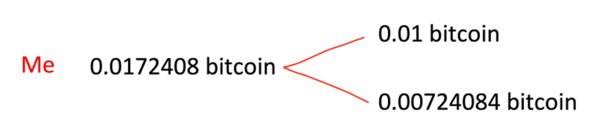

搭档的交易：

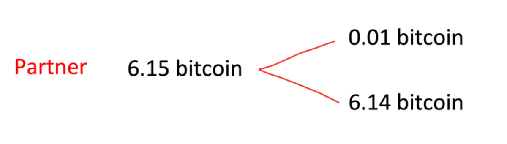

合并交易：

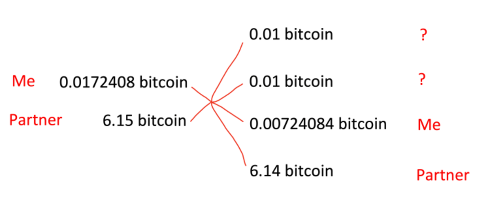

### 步骤五：创建你的交易并保存

打开你的 Electrum 钱包，选择你想要用于混币交易的 UTXO。点击 “Addresses（地址）” 或 “Coins（代币）” 选项卡，找到这个 UTXO 并右击它，然后选择 “Spend from（支出地址）”：

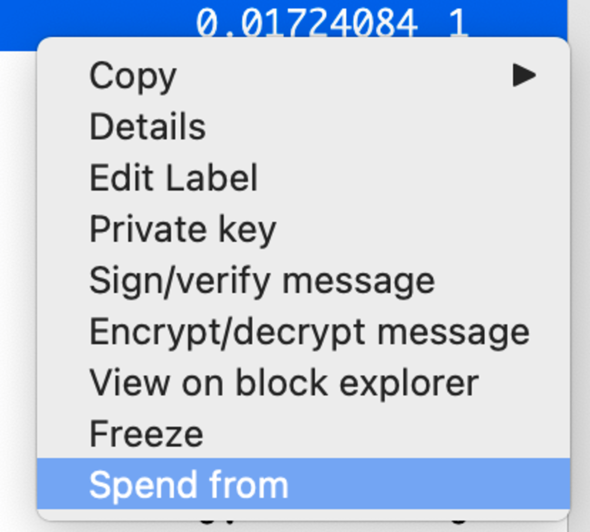

接着进入 “Send（发送）” 选项卡，在 “Pay to（收款地址）” 一栏中粘贴用来接收混合后的比特币的地址：

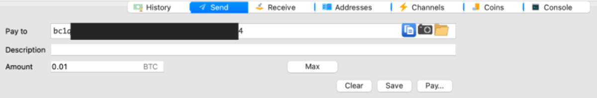

点击 “Pay（支付）” ，然后点击 “Advanced（高级）”。

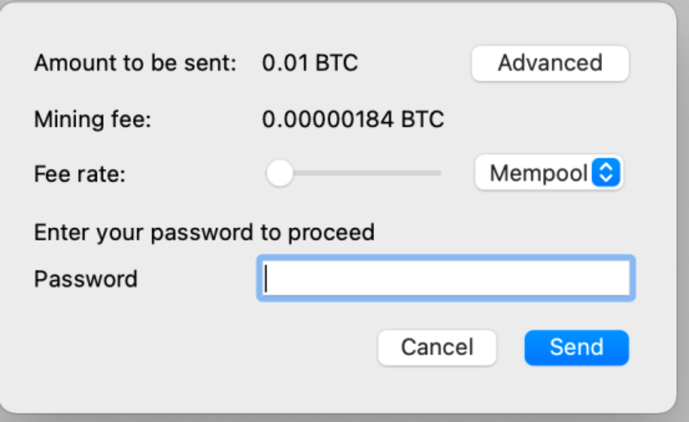

选择矿工费，然后点击 “Finalize（确定）”。

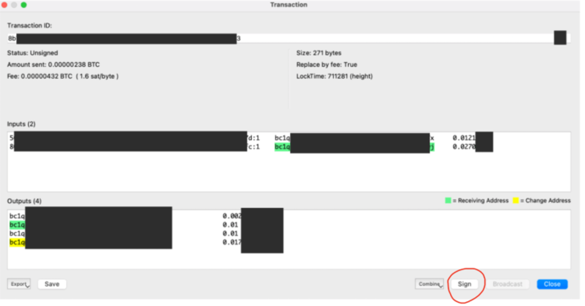

*忽略高额手续费警告：由于转账发生在内部，Electrum 发生了混乱。由于开发者在编程上的疏忽，它以为付款金额很小。*

“确认” 按钮变成 “导出” 按钮。点击 “导出” 并将该交易保存成文件。如果你使用的是硬件钱包，你通常需要选择一个专门针对硬件钱包的选项：

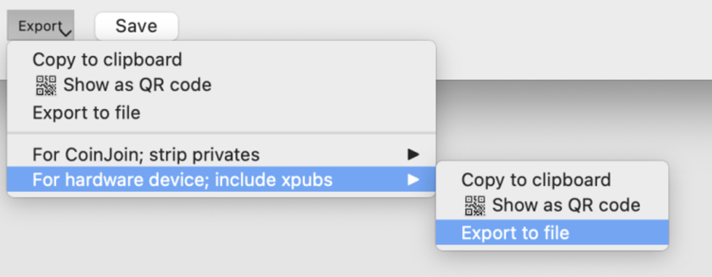

请注意上图的 “include xpubs（包含扩展公钥）” 选项。由于我们打算将这个未经过签名的交易分享给一个我们不一定完全信任的人，我们不想提供该信息。虽然得到扩展公钥的人无法偷走你的币，但是他们可以看到你的整个钱包。这个问题有办法解决，但是我得插段题外话。

- - -

### 题外话

这里，容我暂且先把 “如何进行 CoinJoin 交易” 的话题放一放，以便讲解如何绕开在已保存交易内须包含扩展公钥的要求。你可以使用硬件钱包或包含你的私钥的台式电脑里的软件钱包来签署 CoinJoin 交易。

**Coldcard 硬件钱包**

Coldcard 钱包默认检查花费比特币的地址是否属于该钱包持有的私钥。但是请注意，CoinJoin 交易也包含来自他人钱包的 UTXO 输入。

Coldcard 钱包的检查方式是要求导入交易时连同扩展公钥一起，然后 Coldcard 钱包可以识别交易中包含的地址是否属于该扩展公钥。

为了进行 CoinJoin 交易，我们需要改变这一默认行为。

登陆后，进入 “settings（设置）” 菜单，然后点击 “multisig wallets（多签钱包）”，再点击 “Trust PSBT（信任 PSBT）”。阅读消息后选择 “OK（确定）”，然后选择 “Trust PSBT”。这样一来，即使你不向 CoinJoin 搭档提供扩展公钥，也可以签署 CoinJoin 交易了 —— 就像使用普通的软件钱包那样。

**其它硬件钱包**

我已经测试过了 BitBox02 硬件钱包，没有看到类似 “trust PSBT” 这样的选项。我还用它测试了 CoinJoin 交易，但是它因为无法识别输入而拒绝签名（即，它发现我的 CoinJoin 搭档的输入地址不属于它）。因此，我找不到使用 BitBox02 硬件钱包进行 CoinJoin 交易的方法。

我还没有测试过其它硬件钱包。如果你有兴趣，可以亲自尝试一下。

**临时软件钱包**

另一种方法是创建一个临时软件钱包。你可以先将想要用于 CoinJoin 交易的 UTXO 从硬件钱包发送到这个软件钱包，然后使用软件钱包创建 CoinJoin 交易。这样一来，你就可以最大程度上减少从冷钱包中取出比特币，但是这样确实会带来额外的交易成本。

**不联网的软件钱包**

我最喜欢的方法是在不联网的树莓派 Zero 上运行 Electrum 钱包，这样就能创建自己的硬件钱包了。只要依照我在链接中的指示，[你也能自己动手创建一个硬件钱包，而且成本很低](https://armantheparman.com/how-to-set-up-a-raspberry-pi-zero-air-gapped-with-electrum-desktop-wallet)。然后，[我还写了一篇关于如何使用二维码在不联网的情况下花费比特币的教程](https://armantheparman.com/psbt)。这里还有一篇关于[如何使用设备从头开始创建私钥](https://bitcoinmagazine.com/culture/diy-bitcoin-private-key-project)的教程，这样你就不需要使用通过硬件钱包创建的私钥了。你也可以不使用树莓派 Zero，自己组装一个不联网的台式机，确保没有 Wi-Fi 或蓝牙组件即可。这样的台式机体验感更好，速度更快，成本也更高。

- - -

现在你知道如何在导出交易时避免泄漏扩展公钥了。你可以按照以下方式保存交易：

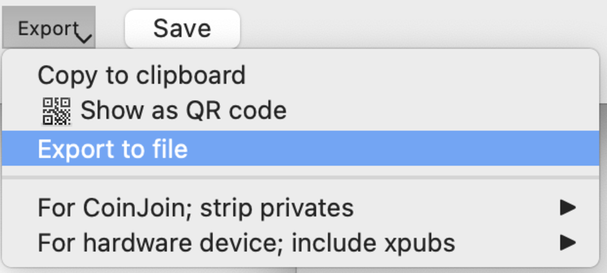

### 步骤六：你的 CoinJoin 搭档同样执行步骤五，然后将他的未签名交易发送给你

你的 CoinJoin 搭档将他的交易保存成文件后，需要将这个文件发送给 CoinJoin 交易的协调者（在本例中我们假设是你）。鉴于这个交易即将发布到公链上，被发送出去的信息不是特别敏感。但是，最好不要将你的行为泄漏给任何监控互联网的人。

一种简单的通信方式是使用 ProtonMail。如果发送方和接收方都使用该服务，消息就会默认加密。如果有一方没有使用 ProtonMail，消息就不会加密。

一种比较麻烦但有趣得多的通信方式（我真心建议你学一学）是，自己使用公/私钥密码学对数据进行加密，然后通过不安全的传输媒介（例如 Gmail）将该数据发送出去。[我写了一篇指南](https://armantheparman.com/privatemessages)。

### 步骤七：使用 Electrum 将两笔交易合并成一笔 CoinJoin 交易

从一个或多个 CoinJoin 搭档那里收到所有未签名交易后，你应该将它们保存到你的电脑，然后如下图所示在 Electrum 中打开你的交易：

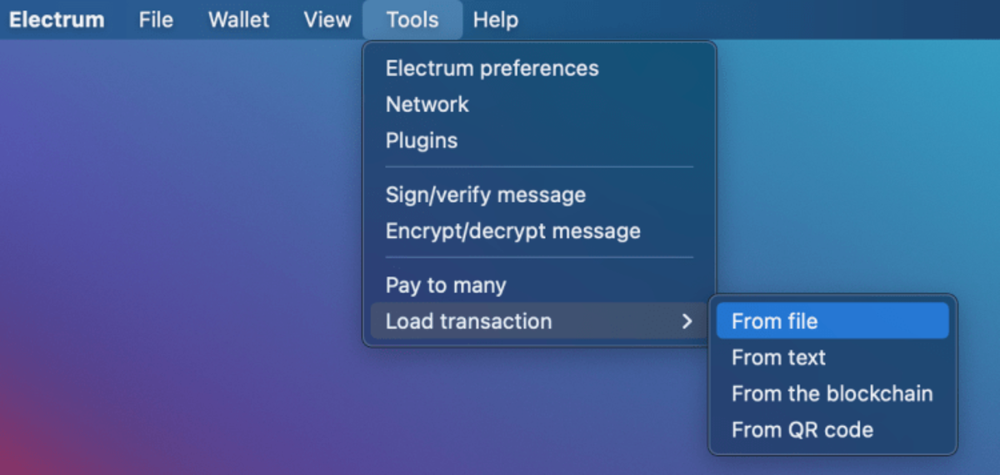

然后，在交易窗口靠近右下角的地方，你会看到一个 “Combine（合并）” 按钮。点击该按钮，然后点击 “Join inputs/outputs (添加输入/输出)”。

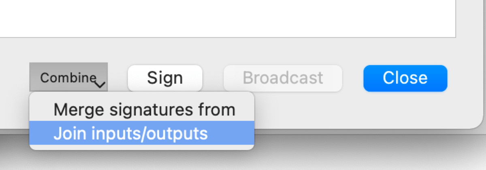

有很多方式可以将交易数据输入 Electrum，但是点击文件图标传入文件是最简单的。

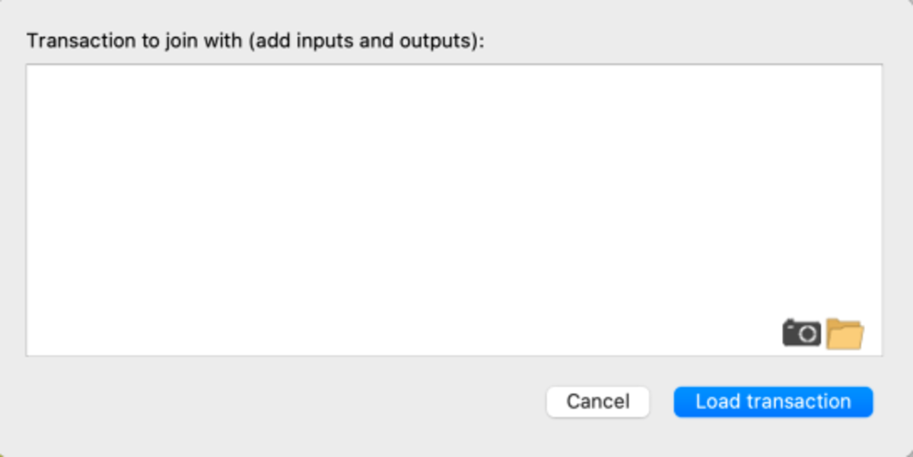

点击 “Load transaction（加载交易）” 后，你将看到合并后的交易：

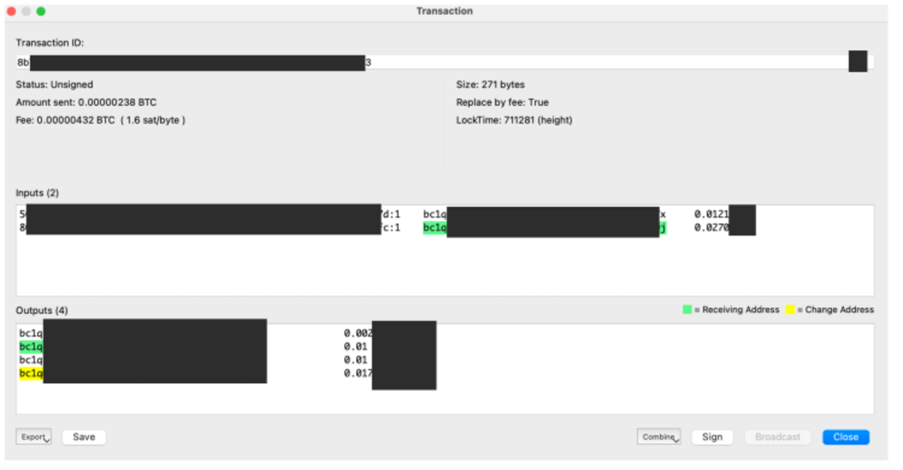

关于这个 CoinJoin 交易，我想要强调的是：标亮的地址是被 Electrum 识别出属于它的地址。标绿的是收款地址，标黄的是找零地址。

这个交易有 2 个输入，其中一个被识别为我们自己的（标绿），还有 4 个输出，其中一个被发送给了标绿的收款地址（我们自己的），还有一个被发送给了标黄的找零地址。未标亮的输入属于你的 CoinJoin 搭档。还有两个未标亮的输出也属于你的 CoinJoin 搭档，其中一个是他的 CoinJoin UTXO，另一个是找零。

请注意，输出窗口显示了两个数量相等的 0.01 BTC。标亮的那个是我们自己的，但是从区块链上看，没人知道哪个属于这个钱包。

### 步骤八：签名

到目前为止都很顺利，但是整个流程还没有结束。

现在，这个 CoinJoin 交易需要所有参与者签名。只有当所有参与者都签过名后，这个交易才是有效的，可以被广播出去。最后一位签名者无论是谁都拥有一定的 “权力”，因为他可以推迟或阻止交易。你们可以自己决定谁来当最后一个签署并广播交易的人。

假设你是最后一个签名的人。你导出这个合并交易的文件，然后发送给你的 CoinJoin 搭档。他们需要加载该交易：



然后签名：

签名后导出文件，然后发送给你。如果有多名 CoinJoin 搭档，每个人签署完交易后要将其发送给下一个人签名，直到所有人都签署该交易为止。

等交易回到你这里后，你需要加载该交易，签署它，然后点击 “签名”按钮右边的 “广播” 按钮。

## 恭喜！

干得漂亮！是不是很酷！自己从头再做一遍，确保自己弄懂了。

## 现在呢？

如果你持有大量经过混币的 UTXO，这里有几点忠告：

1. 切勿将它们兑换成法币。
2. 切勿将它们与经过 KYC 的比特币合并，这样会破坏其隐私性。
3. 如果可以的话，不要将经过混币的 UTXO 合并起来。
4. 请注意，找零 UTXO 不是私密的，依然属于经过 KYC 的比特币。
5. 经过混币的比特币可以确保交易的隐私性。当你花费比特币时，要清楚地知道你花费的是哪些比特币，不要不小心将经过 KYC 的比特币混入输入中。学习如何使用功能强大的比特币钱包（如 Electrum）很有帮助。

（完）