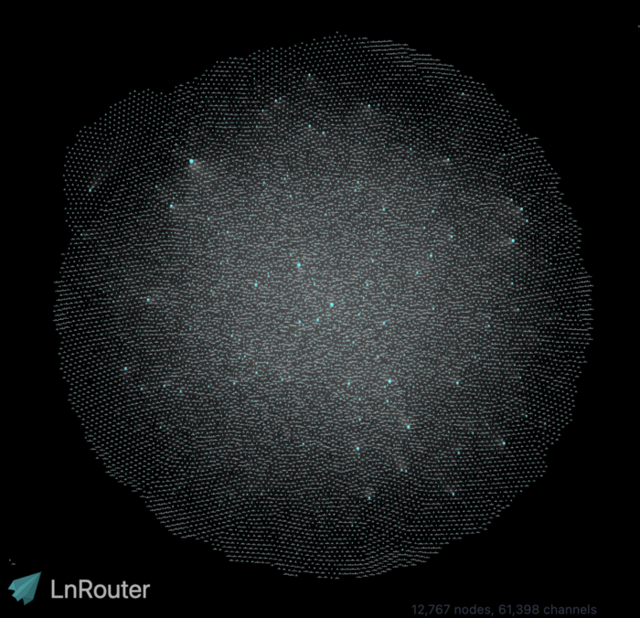
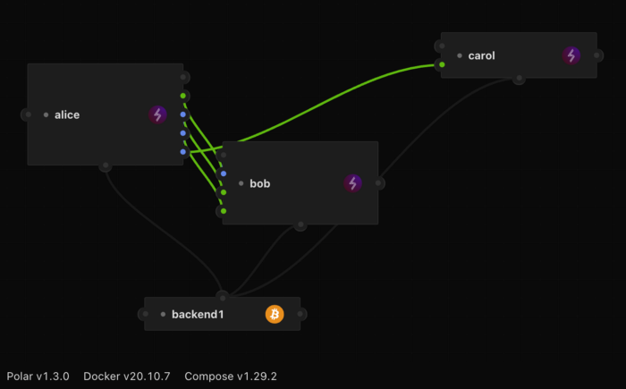
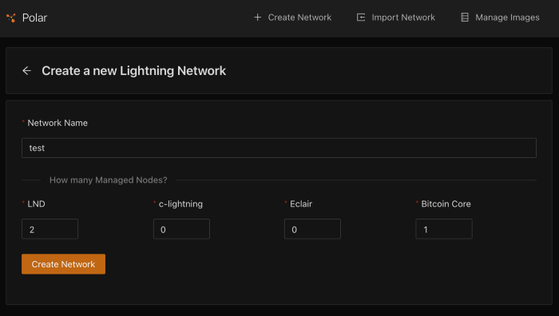
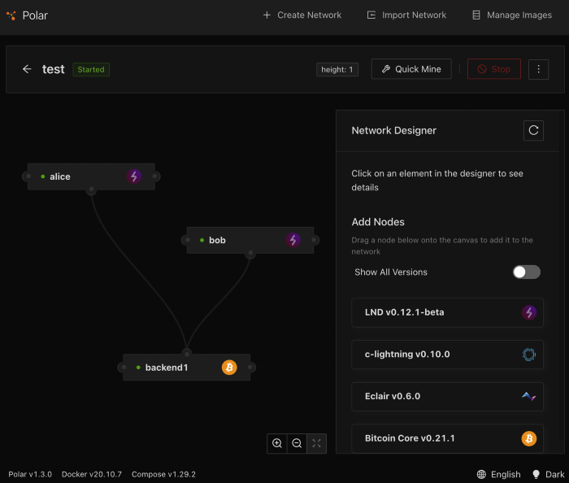
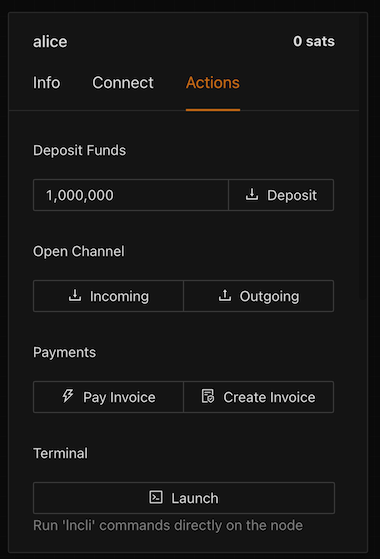
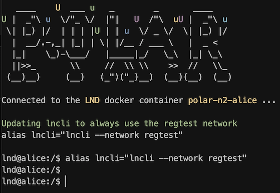
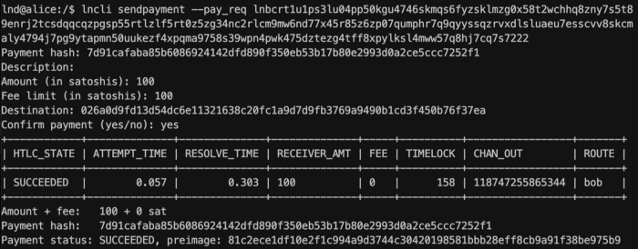
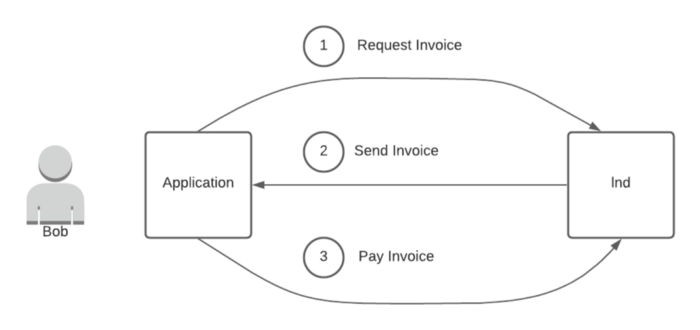

> *作者：Michael Rhee*
>
> *来源：<https://medium.com/@rheedio/a-crash-course-in-lightning-app-development-5be5b8d2d558>*


如果你想要入门闪电网络编程，又不在乎所谓正确、最佳的做法，这篇文很适合你。换言之，这篇指南具有很强的 *主观性*。如果你偏好 O'Reilly 式的权威文本，这篇文章可能不对你的胃口。但是，如果你想要了解闪电网络的最小开发环境及其基本内容，不妨读一读。我写本文的目的是提炼出创建闪电网络应用的基础知识点，让新手能够快速构建和实验。

我相信，只要掌握了基础知识点，你就能编写出更加复杂安全的应用。但是，每个人都得有个开始，我个人的感受是万事开头难，我认为将这些思想整合到一起可以帮助一些迷途羔羊缓解痛苦。

在深入介绍细节之前，请允许我简单介绍一下自己的背景：

大约一个月之前，我辞去了原本稳定的数据架构师工作，开始研究日新月异的比特币生态。你会找到这篇文章，表明你已经迈出了这一步（或者正在考虑这么做）。

简单来说，我认为比特币是我所见过最有趣的技术创新。我越了解比特币，就越被它吸引。比特币技术有希望改变乃至重塑如今的交互方式，使之脱胎换骨。我希望贡献自己的一份力量。

这就是为什么我会选择在比特币上开发。我希望这篇文章能够让不熟悉闪电网络生态及其潜力的开发者受益，鼓励更多开发者为比特币领域注入创造力。

老实说，关于比特币生态，我想写的实在太多了（其中，“[由能源支持的货币](https://research.satoshienergy.com/special-report-energy-backed-money/)”这一概念排在第一位），但是只能择日再谈了。现在开始进入正题：


## 闪电网络的架构



<p style="text-align:center">-图源：<a href="http://lnrouter.app/graph">lnrouter.app</a>-</p>

闪电网络的基础设计是利用通道实现节点间的一对一连接。开通通道需要存入一定数量的比特币，该事务会记录在比特币区块链上。然后，用户可以使用特殊的链下合约在节点之间转移通道内的比特币，无需提交新的事务到区块链上。

实际做法是实时追踪通道内的余额变化。例如，你在与 Alice 开通的通道内存入 100 satoshi，你有大约 100 satoshi （减去链上交易手续费）的转账额度，既可以直接转给 Alice ，也可通过 Alice 间接转给其他人。这些转账几乎是即时的，因为我们只需根据每笔交易调整通道的余额。这种调整是通过在付款方和收款方之间传递加密消息实现的。

闪电应用是在闪电网络（所谓的比特币二层）上运行的。闪电应用同样以比特币作为支付方式，但是结算速度更快、交易费更低。

虽然我只是非常简略地概括了闪电网络协议，但是知道这些已经足够入门了。如果你想更详细地了解闪电网络是如何运作的，[这里有一些很好的阅读材料](https://www.lopp.net/lightning-information.html)。小心不要沉溺在知识的海洋里，坐在电脑前读到很晚，却一行代码都没有敲。也不是说这样一定不好，只是我们的目的还是在于实践。另外，保证充足的睡眠也很重要。

我认为，若想了解闪电网络及其节点的运作方式，更好的办法是自己运行一个节点并弄清楚如何通过节点路由付款。虽然这个办法需要付出更多时间和金钱，但是既有趣又长知识。<sup>1</sup>

## 实现

闪电网络是[开放式协议](https://github.com/lightningnetwork/lightning-rfc/blob/master/00-introduction.md)。这就意味着，闪电网络有标准的消息通信和解释方式。就像 HTTPS 和 TCP/IP 不归任何人所有那样，闪电网络协议也是如此。任何人只要遵守标准都可以参与闪电网络。不仅如此，随着开发者不断加固协议并增加新功能，这一标准也会持续发展。

目前有四家公司在闪电网络协议开发中处于核心地位：Lightning Labs、Blockstream、ACINQ 和 Square Crypto，而且都有自己的实现：

Lightning Labs —[ lnd](https://github.com/LightningNetwork/lnd) (Go)

Blockstream — [c-lighting](https://github.com/ElementsProject/lightning) (C)

ACINQ — [eclair](https://github.com/ACINQ/eclair) (Scala)

Square Crypto — [Rust Lightning](https://github.com/rust-bitcoin/rust-lightning) (Rust)

上述所有实现都能通过闪电网络进行通信。区别在于这些实现的 API。本文只聚焦于 Lightning Labs 的 lnd，因为这是我最先接触、也是了解最多的。虽然我最终选择 Ind 有偶然成分在里面，但是不得不夸一下，Lightning Labs 的 Ind 文档写得很好，而且开发者能够通过官方 Slack 频道获得很多帮助和支持。

请注意，下文将围绕 Ind 展开讨论，但是基本概念适用于所有闪电网络实现。

## 你的开发环境

不废话，使用 [Polar](https://lightningpolar.com/) 就行了。

好吧，再多说两句。无论你是开发者还是用户，在闪电网络上进行构建的最大障碍是如何创建后端。我说的不只是一个钱包，因为有很多简单快速的托管解决方案可以用。我指的是真正的后端 —— 运行比特币和闪电网络的节点。


我之所以这么说，是因为你的应用需要拥有节点的某些权限，才能完成一些重要操作，例如，通过 API/gRPC 调用创建发票和监控付款。如果有节点运营者授予你节点的访问权限，你同样可以完成这些操作，但还是自己运营一个节点比较好。

能够用于闪电网络开发的节点必须运行两个进程：（1）同步到比特币区块链最新区块的比特币客户端；（2）已开启通道（可以收发支付）的闪电网络客户端。

如果你使用的是普通的家用宽带，光是同步区块链就需要花费至少几天的时间。你可以试一下 Neutrino（一款轻量级比特币钱包），但是我听说用它在闪电网络上开发可能会导致一些问题。我没有亲身尝试过。不管怎样，如果你才刚开始接触这类工具，我想最好去除那些可能会产生负面影响的变量。因此，如果你负担得起，我建议你同步完整的区块链就好。

如果我们对比特币的分层进行排序，闪电网络层就是比特币的二层。正如我上文提到的，我们需要在闪电网络上开启通道来进行交易。虽然在闪电网络上开启通道不是很难，但是你需要一些计划和协调，还要付出比特币。你当然可以质押比特币来开启通道，然后开始交易。但是，你没必要承担这种金融风险。<sup>2</sup>

暂时先别管这些。[Polar](https://lightningpolar.com/) 是一个**很棒**的工具，可以让你在笔记本电脑上的 Docker 容器内模拟运行这些进程。另外，它还提供一个精美的 UI 界面，为你展示网络可视化效果。



<p style="text-align:center">-你看！是不是等不及想同步了！（Polar 界面）-</p>

Polar 的优点在于，当你准备好将应用转移到测试网或主网后端时，你只需要更新一些配置即可。我已经可以做到在本地、测试网和主网后端之间轻松切换，只需在应用中添加或注释掉几行代码即可。（我最后会得到 .env 文件。当然了，测评工具不是本文的目的。）

Polar 也支持 lnd、c-lighting 和 eclair 节点。这就意味着你可以灵活尝试其它实现。

再重申一遍：使用[ Polar](https://lightningpolar.com/) 就好。这是一种快速且简单的入门方法。再者说，万一你根本不喜欢在闪电网络上开发呢？早日发现这一点，总好过在一个你不一定会使用的系统上浪费过多时间和金钱。话说回来，如果你发现自己沉迷于 [Stephan Livera](https://stephanlivera.com/episode/204/)（知名比特币主播）的播客，每晚收听不可自拔，可以搭建一个更严肃的开发环境。

## 设置 Polar



点击 “Create Network（创建网络）”，即可在 Polar 中轻松创建模拟闪电网络环境。你可以随意命名这个网络（我个人认为 “test（测试）” 是个聪明的选择）并添加两个 lnd 节点和一个 Bitcoin Core 节点。实际上，对于刚入门的人来说，这些只是最低配，之后还可以添加更多节点。你创建好网络后就可以启动它。首次启动网络时需要的时间可能会长一些，因为你必须下载所有 Docker 镜像。顺带一提，你需要在自己的设备上运行 Docker。就像我之前说的，这里还是得靠自己摸索。

最后，你会看到一个类似下图的 Polar 界面：



在上图所示界面中，我们可以看到 Alice 和 Bob 的 Ind 节点，而且这两个节点都与 Bitcoin Core 后端进程相连。另外还要注意的是，这时的区块高度是 1。这是我们的创世块！不同于实时区块链，Polar 只有在开发和测试过程中提交交易时才会出块。

下一步是在 Alice 和 Bob 之间创建一条通道，用来进行闪电付款。点击 Alice 的节点，右侧控制面板会显示我们可以与该节点交互的不同方式。点击 “Actions（操作）” ，我们就会看到向 Alice 的钱包充值模拟比特币以及在 Alice 和 Bob 之间开启通道所需的一切工具。接下来，我们先向 Alice 的钱包充值一些资金，再开启 Alice 与 Bob 的通道吧。

点击 “Deposit（充值）” ，接着将 100 万 satoshi 充值进 Alice 的钱包。



如果一切按计划进行，你就会看到区块高度和 Alice 的钱包余额发生了变化。如果没有，请寻求帮助。这不是你的错。<sup>3</sup>

现在，我们可以在 Alice 和 Bob 之间开启通道。现在，Alice 已经有钱了，我们可以让她开启一个与 Bob 的 “Outgoing（转出）” 通道。所谓的转出通道，就是 Alice 可以通过该通道转给 Bob 一定数量的比特币。Alice 和 Bob 之间可以进行多笔转账交易，只要通道内有余额即可。但是，请注意，该通道刚开启时，只有 Alice 可以向 Bob 转账，因为可用余额都在她那里。当然了，等到 Alice 向 Bob 转过账之后，Bob 就可以向 Alice 转账了。

这种通道内资金管理方式是为了保证双方都具备交易能力，这就是我们所说的闪电网络的 *流动性*。实际上，用户只能使用通道内的余额。更深入一点来讲，只有当付款方和收款方之间的通道内有足够的余额（且资金流向正确）时，付款才能成功。否则付款就会失败。如何管理闪电网络中有限的流动性以及如何找到变通之法本身就是一个值得探讨的[话题](https://github.com/alexbosworth/run-lnd/blob/master/LIQUIDITY.md)。

坦白来说，我在使用 Polar 开启通道时遇到过一些问题。我怀疑这是 UI 和后端之间的状态差异导致的，但是我并不确定。有时，关闭并重启节点（或整个网络）会有帮助。完全退出并重启 Polar 同样有效。另外，遇到这类情况时，出门晃悠 10 分钟可以让你的头脑和精神得到很好的放松。

不管是什么原因，我发现进行这些节点操作的最佳方式是通过 Polar 提供的 CLI。虽然 UI 不一定会显示出变化，但是我们可以直接查询数据库（可以这么说<sup>4</sup>）来确定 UI 是否如实反映变化。Polar 让这一切变得简单了。我们现在就上手做吧。

首选选中 Alice 的 Ind 节点，进入 “Actions” 界面，点击 “Terminal（终端）” 下面的 “Launch（启动）”，接着会出现一个命令提示符，如下图所示：



现在，我们可以使用该 Ind 节点的 lncli 工具开启通道、创建发票和付款了。首先，运行下方命令来了解大致情况：

```bash
lncli --help
```

我们可以运行下方命令在 Alice 和 Bob 之间开启一条余额为 10 万 satoshi 的通道：

```bash
lncli openchannel --node_key <bob's public node key> --local_amt 100000
```

你会看到一个带有 “funding_txid” 的响应，对应的是 Alice 和 Bob 广播到我们的模拟比特币区块链上的充值交易。
运行下方命令查看我们新创建的通道：

```bash
lncli listchannels
```

如果该命令返回的列表为空，请尝试使用（ “Actions” 界面下的）比特币节点挖几个区块。这样做应该有助于确认交易并开启通道。

现在，我们可以通过 listchannels 响应看到 Alice 和 Bob 之间已经成功开启通道，且通道余额约为 10 万 satoshi（减去交易费）。这 10 万不到的 satoshi 就是 Alice 可以通过闪电网络支付给 Bob 的可用余额。

## 支付流程

迄今为止，闪电网络上最简单（我相信也是最常见的）支付流程是通过发票（invoice）。发票本质上是一组带有 “金额” 和 “收款方” 的支付指令。还有其它参数和变体可以帮助支付指令解锁更多有趣的可能性（例如，[hodl 发票](https://wiki.ion.radar.tech/tech/research/hodl-invoice)和 [BOLT12](http://bolt12.org/) 提案），但是本文只关注最基本的模式。

继续设置我们的 Polar，我们先创建一个发票，但是这回要用 Bob 的节点。因此，我们要启动 Bob 的终端并运行以下命令：

```bash
lncli addinvoice --amt 100
```

以上命令创建了一个价值 100 satoshi 的发票（实际上，我在执行这些步骤时遇到了连接错误。如果你也遇到同样的问题，请停止并重启 Bob 的节点）。我们可以通过返回的响应看到这个发票的信息：

```json
{
    "r_hash": "7d91cafaba85b6086924142dfd890f350eb53b17b80e2993d0a2ce5ccc7252f1",
    "payment_request": "lnbcrt1u1ps3lu04pp50kgu4746skmqs6fyzsklmzg0x58t2wchhq8zny7s5t89enrj2tcsdqqcqzpgsp55rtlzlf5rt0z5zg34nc2rlcm9mw6nd77x45r85z6zp07qumphr7q9qyyssqzrvxdlsluaeu7esscvv8skcmaly4794j7pg9ytapmn50uukezf4xpqma9758s39wpn4pwk475dztezg4tff8xpylksl4mww57q8hj7cq7s7222",
    "add_index": "1",
    "payment_addr": "a0d7f17d341ade2a0911acf0a1ff1b2edda9b7de356833d05a105fe07361b8fc"
}
```

现在，我们只关注 “payment_request” 部分，因为这部分数据包含 Alice 向 Bob 付款所需的一切信息，即，付款金额和收款方地址<sup>5</sup>。

如果我们切回 Alice 的节点终端，就可以得到付款请求并将它作为参数传递给下方命令：

```bash
lncli sendpayment --pay_req <payment_request>
```
结果得到：



成功。

## 开始你的冒险征程



这时，你应该已经具备了足够的基础知识和工具，可以开始构建应用了。上图概述了一个简单的示例应用，使用的正是我们在 Polar 中用来创建并支付发票的 API 调用。这就是搭建一个最基础的应用架构所需的一切。当然了，这只是一个例子，我们在开发过程中还会遇到许多其它问题（目前还只是开始），但是你会慢慢弄清楚自己需要什么以及如何解决这些问题。

一些额外的建议和参考：

* 有很多库可以帮助开发者少写些样板代码、直奔主题。就我本人而言，学习如何使用这些库带给我的更多是挫败感，而非更高的效率。问题主要出在我身上。抽象确实很棒，但前提是你要对被抽象的内容有基本了解。我在起步时还没有领悟到这一点。我觉得 Ind 的 [API 文档](https://api.lightning.community/)学起来最容易。当我按照这个[指南](https://github.com/lightningnetwork/lnd/blob/master/docs/grpc/javascript.md)使用 Javascript 编写 gRPC 客户端时，我就已经步入正轨了。
* 如果你想看一个更具体的应用示例，不妨看看 Lightning Labs 构建者指南的[教程](https://docs.lightning.engineering/lapps/guides/polar-lapps)。如果你熟悉教程中用到的工具 express、mobx 和 React，那么我很推荐这个教程。如果你不熟悉这些工具，你可能不会从这篇教程中得到很大帮助，但还是能够学到一些东西。我喜欢这个教程的一个原因是，它展示了利用闪电网络（和密码学证明）构建应用可以实现的一些有趣功能。

最后，如果你认为本文有任何写的不清楚或不准确之处，欢迎向我提出反馈或问题。

感谢阅读。

加油。


1. 如果你想运行节点，[Umbrel](https://getumbrel.com/) 很适合初学者。我听说 [MyNode](https://mynodebtc.com/)、[RaspiBolt](https://stadicus.github.io/RaspiBolt/) 和 [RaspiBlitz](https://raspiblitz.org/) 也不错。如果你喜欢修补软件系统（或 SimCity（模拟城市游戏）），那么运行节点往坏了说是一种有趣的消遣，往好了说是一场高成本且无休止的优化游戏（需要付出真金白银的那种）。
2. 你还可以在测试网上进行实验，通过比特币[水龙头](https://faucet.lightning.community/)获得一些实验用比特币。这些币一文不值，但是当个守财奴的体验会很有趣。如果你对自己配置和管理节点不感兴趣，可以使用 [Voltage](https://app.voltage.cloud/) 之类的服务。[Voltage](https://app.voltage.cloud/) 是即用即付的云上服务，支持测试网和主网节点。
3. 好吧，我们不能百分之百确定。谨慎起见，请查看 [lnd Slack](https://lightningcommunity.slack.com/) 的开发者频道。我在这里遇到过很多构建并维护这些工具的开发者。你可能会看到我！有人可能经历过你正在面临的问题。如果没有，那就太棒了 —— 大家都能从你的问题中有所收获。
4. 区块链是一个公共数据库，每个人都有 root 权限。如需了解更多信息，请查看：[https://balajis.com/yes-you-may-need-a-blockchain/](https://balajis.com/yes-you-may-need-a-blockchain/)
5. 关于发票中其它字段的详细解释，可以查看这篇[总结](https://wiki.ion.radar.tech/tech/lightning/invoice)。如需了解更多关于底层合约的信息，请阅读[这篇文章](https://medium.com/softblocks/lightning-network-in-depth-part-2-htlc-and-payment-routing-db46aea445a8)。

（完）

