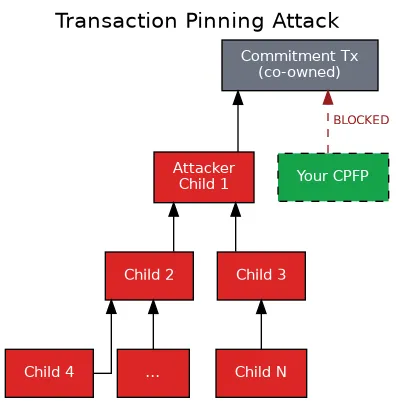
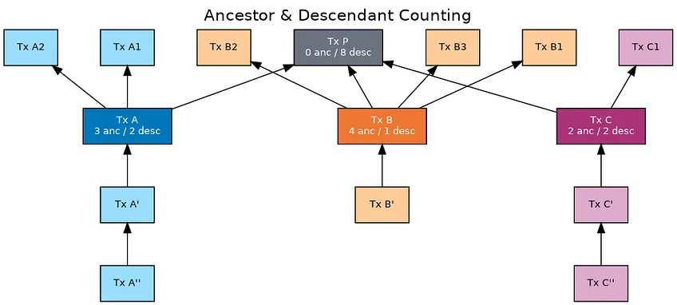
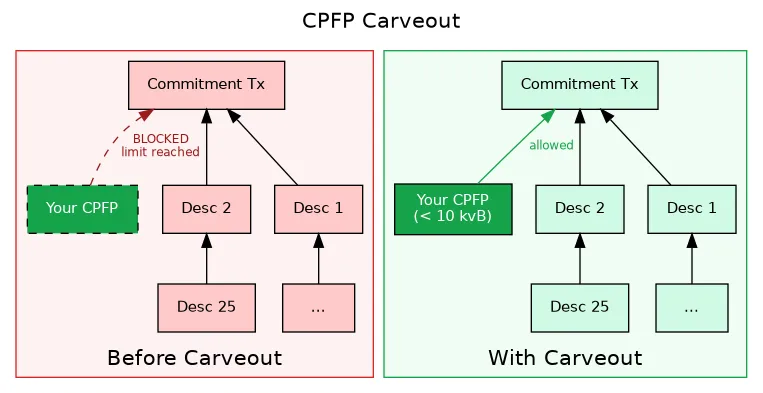
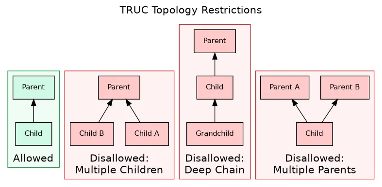
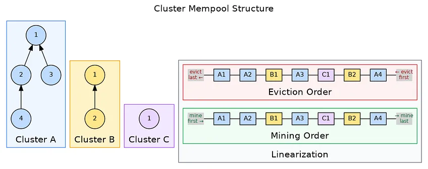
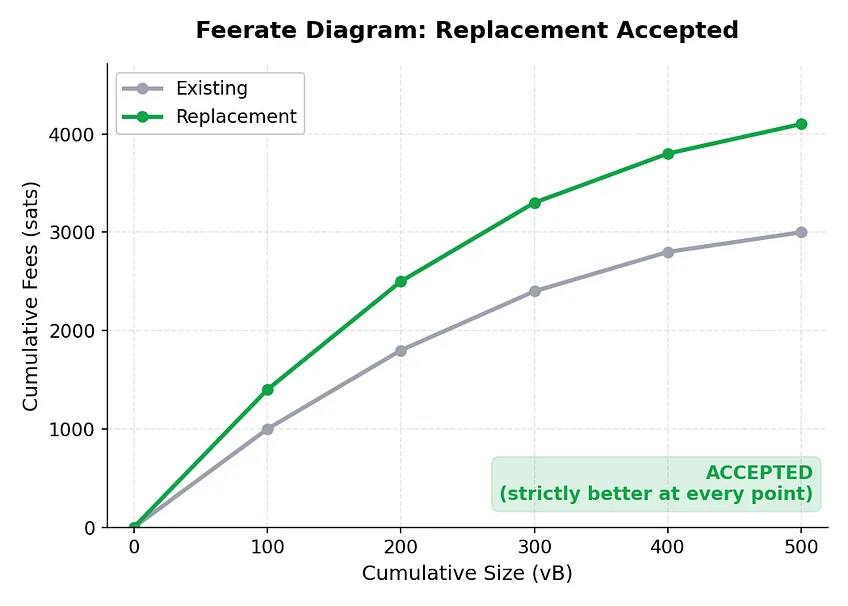
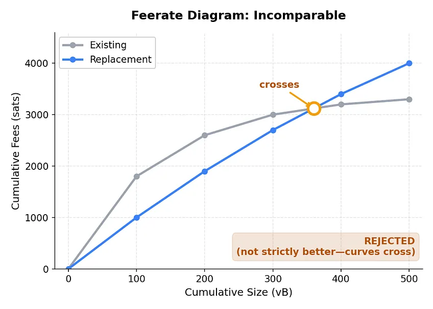
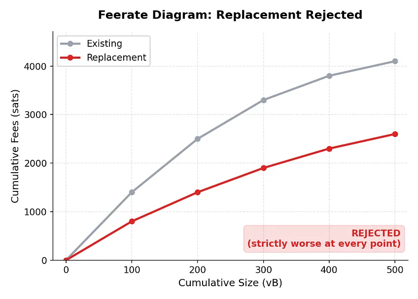

> *作者：theinstagibbs*
> 
> *来源：<https://spiralbtc.substack.com/p/a-decade-of-workarounds>*

设想你在比特币上开发一种 layer 2 协议，它带有一种需要支持时机敏感型交易的系统。如果某些交易不能在一定数量的区块内确认，一些人就会损失资金。你已经围绕着 “子为亲偿（CPFP）” 手续费追加法设计了你的系统，这样，如果手续费意外高涨，用户就可以用携带高手续费的子代交易，提高打包亲代交易的吸引力。

不幸的是，你的对手方可以抢先提交 *他们自己的* 子代交易：一笔体积巨大、费率很低的子代交易，其费率超过了网络的最低转发费率（所以它可以被传播到矿工的交易池），但永远不会被确认。没准，那一步一笔子代交易，而是一连串的费率很低的垃圾子代交易。现在，你就没法附加你的子代交易了，因为网络中有一个规则，规定了一笔未确认交易可以拥有的后代交易的数量是有限的（你的对手已经把容量都占满了）！因此，你的时机敏感型交易就被卡住了，而且你对此毫无办法。

这就是交易钉死攻击。 并且在比特币历史上的绝大部分时间，都没有什么好办法来应对它。

（在这种攻击发现之后）接下来的十年里，解决办法是一系列的变通措施：专项处理、carveout（例外），以及为了补上最为紧急的漏洞而设计的拓扑限制。没有任何一种是必然的工程错误；其中一些还是必要的脚手架，在更彻底的解决方案出现之前，可以确保闪电网络和其它协议的正常功能。然而，它们的局限性塑造了 L2 协议们必须设计的部分，而且其中一些规则注定要扫进历史的垃圾堆。

（译者注：“拓扑学” 通过将形状化约为仅仅是一些相互连接的点来研究这些形状的性质。这里的 “拓扑限制” 指的是对交易间相互依赖的复杂度施加限制。）

这是一个跨越十年的故事：为什么这些变通措施是必要的、它们实际上做了什么，`Bitcoin Core` 最后推出了什么工具来取代它们。

## 第一幕：启发式分析的时代

### Bitcoin Core v0.12 基础（2015 - 2016）

想要知道后代交易的数量限制是怎么来的，我们要回到 2015 年末。

那时候，`Bitcoin Core` 的交易池规则才刚刚开始变得复杂。为了允许交易池在繁忙的时候删去一些待打包的交易，开发者们加入了 “后代交易包跟踪”（PR #6654），让交易池理解交易之间的关系（某一笔交易会依赖于另一笔交易）。很快，开发者们就将祖先和后代的数量限制调降为总计 25 笔交易和 101  KB（PR #6771）。几个月后，“祖先交易包及其费率跟踪” 到来（PR #7594），让矿工在为区块挑选交易时可以考虑 CPFP 。

这些限制是基于基本的计算资源约束而确定的。每当一笔交易进入或离开交易池的时候，受影响的各项统计数据都需要更新。每当矿工要构造一个区块时，就需要评估各交易链条。链条越长（越深），意味着需要的计算量越多，而不受约束的计算可能导致 “拒绝服务式攻击（DoS）”；数量限制则让这个问题是可以处理的。

大约在同一时期，“可选的手续费替换（opt-in RBF）” 特性到来（PR #6871）。这在一定程度上是一种政治妥协，因为商家们担心可替换的交易会带来欺诈，所以替换特性必须由用户和钱包软件通过交易的 `nSequence` 字段明确开启。这组替换规则叫做 “BIP125”，它要求新版本的交易必须支付（比原版交易）更高的手续费（总额） *以及* 更高的费率，并且不允许引入新的未确认的亲代交易。这是一系列的启发式分析。

这最后一条规则最明显了。不让在替换交易中加入未确认的交易作为亲代交易，乃是一种预防措施；我们根本无法断定这笔新交易会不会很快就被挖出，类似地，我们也不知道它会不会浪费大家（交易转发节点）的带宽和 CPU 。这个替代交易，如果有新的依赖交易，是否一定会改善交易池状况？不理解完整的交易图以及它（增加依赖）对挖矿的影响，我们就无法断定。因此，作为一种预防措施，我们直接禁止。

对整个交易链条的限制，以及 RBF 规则，都来自相同的底层问题：我们不知道如何高效计算实际上对矿工最有利的交易池状况。所以，我们施加限制、应用看似合理的启发式分析，从而启用有用的特性，同时不让局面显著恶化。

这些特性在 `Bitcoin Core` v0.12.0 中发布，时值 2016 年 2 月，闪电网络才刚刚出现在人们视野的尽头，多项支持它的共识变更还在开发中。

### 钉死攻击成为现实（2017 - 2018）

在幕后，OP_CHECKLOCKTIMEVERIFY（脚本层绝对时间锁）、OP_CHECKSEQUENCEVERIFY（脚本层相对时间锁），还有 “隔离见证”，在比特币主网激活。

闪电网络于 2018 年上半年在主网启动。这个万众期待的理论上的 L2 ，自此开始运行。

钉死攻击界面并不是生僻事物，因为研究者们已经讨论了好几年了。但使用真金白银的系统上线，迫使人们面对这个问题。仅仅知道这种攻击 *有可能* 实现，是不够的；协议开发者们还需要知道哪一种攻击是 *切实可行的*、在现有的交易池规则下，能够做些什么来应对它们。

在 2018 年 11 月，我们至亲至爱的 Matt Corallo 在 bitcoin-dev 邮件组发出了一篇帖子，标题相当委婉：“为合约式应用中的手续费预测难题而设计的 CPFP Carve-Out ”。内容很简单：闪电通道的承诺交易可能遭受钉死攻击，即使我们无法解决所有问题，也需要一种快速修复措施。

这种攻击非常直接。闪电通道的承诺交易是建立一条通道的双方共有的；任何一方都能将它们广播出去。如果你的对手方广播了一笔承诺交易、并且立即附加了一棵由低费率的子交易组成的交易树，TA 就能用尽后代交易容量。这样你就没法附加自己的 CPFP 交易了。你的时机敏感型交易（承诺交易）就被卡住了，它只能提供在你们签名时决定的费率 —— 而你们签名的时候可能是几周甚至几个月以前。

邮件组中的讨论系统地展现了这个问题的各个方面。L2 协议们到底需要什么样的交易拓扑？变更交易池规则可以保护其中哪一些？答案不是 “所有形状”，而是 “闪电通道会使用的一些非常具体的形状。”

### Carveout（v0.19，2019）

修复措施在 `Bitcoin Core` v0.19.0 中到来：“CPFP carveout”。

这个规则在设计上是狭窄的。如果一笔交易已经用尽其后代交易数量限制，那么仍然允许为最初那一笔亲代交易附加一笔子代交易，前提是这笔子交易体积较小（不超过 10 kvB），并且只有一个祖先（这笔交易得以增加手续费）。这对闪电通道来说已经够了：即使你的对手方提交了一大串后代交易，你也依然可以附加一笔小体积的 CPFP 交易。

一个有趣的冷知识：Corallo 最初发在邮件组中的帖子建议使用 1 kvB 的限制；而 PR 则实现为 10 kvB 的限制。似乎没有人点评这个 10 倍的提升。

另一个互补的规则，“单一冲突 RBF carveout”（PR #16421），则解决了一个后续的问题：要是攻击者的子交易可以通过 RBF 规则来钉死你的 carveout 子交易，那会怎么样？令人头疼！这个修复措施允许在刚刚超过 “每个交易包 1 笔（carveout）子交易” 的限制提出替换交易，不过只能在驱逐刚好 1 笔交易时使用。

如果你刨根问底，这些 carveout 会让你难受。因为它们并非通用的原则，而是嵌入到`Bitcoin Core` 的交易池规则中的专用于闪电通道的技巧。它们之所以有用，是因为闪电网络的承诺交易的已经广为人知的拓扑：一笔亲代交易，有限数量的子交易，两方（并且只有两方！）都需要能够追加手续费。一旦拓扑改变，这些 carveout 就没有用武之地。

但它们至少是有用的，只要你不去追问矿工要如何在面对可能非常强大的敌手时连续不断地获得这些交易。闪电网络可以前进了，即便这条路比我们想要的更加狭窄。

## 第二幕：提炼问题（2019 - 2024）

### 漫长的等待

各种 carveout 争取来了时间，但底层的问题还在；而且这些 carveout 在未来 “共享 UTXO” 更为广泛的时代没有什么作用。

L2 开发者们就要跟这些已知的局限性打交道。这些 carveout 只能帮助这种两个参与方、只有一笔亲交易的拓扑。其它的钉死攻击界面依然存在。而 “不允许加入新的未确认亲代交易” 的 RBF 规则，也意味着你无法通过添加一笔高手续费的亲代交易来给一笔交易追加手续费；你只能完全替换掉它，或者添加一笔子交易。最根本的矛盾也没有改变：交易池的规则是启发式分析，因为我们无法计算最优的解。

邮件组中积累了各种提议。一种 “交易包转发” 提议会自动提交一笔亲交易和一笔子交易，允许 CPFP，可以在转发时工作（而不仅仅是在挖矿时）。一种软分叉叫作 “交易资助（transaction sponsors）”，让第三方可以为任意交易附加手续费。还有一些交易内省操作码允许合约分析自身的手续费语境。

绝大多数想法都停滞不前，或者被放弃了。瓶颈并非缺乏想法，而是交易池的数据结构无法回答这些提议需要追问的问题：“这个交易包，是否比它要替代的那个更好？” 听起来很简单。但要为任意的交易拓扑高效求解，就难了。

### TRUC 的洞见

要是我们无法为任意拓扑计算激励兼容性，能不能限制拓扑、直到我们可以高效求解呢？

这就是 “限制拓扑直至确认（TRUC）”（BIP 431，也叫 “v3 交易”）背后的想法。这些限制是严厉的：一笔 TRUC 交易最多只能有 1 笔未确认的祖先交易、最多只能有 1 笔未确认的后代交易。子交易的体积限制在 1000 vB（讽刺的是，这就是最初的 CPFP carveout 提议为多出的那一笔子交易施加的体积限制）。

（译者注：由推理可知，一个 TRUC 交易包最多只能有 1 笔亲代交易和 1 笔子代交易；任何其它情形都会让其中一笔交易违反规则。可见下图。）

TRUC 尝试用与 carveout 不同的方式来解决同一个计算难题。Carveout 的想法是：“我们不能解决一般化的情形，所以，我们为闪电通道的交易结构设计一个特殊的例外。”而 TRUC 说的是：“我们不能解决一般化的情形，所以我们定义出一种确定 *能够* 解决的受限制的拓扑，从而支持尽可能多的 L2 协议。”

在 TRUC 拓扑中，问题（两个交易包孰优孰劣）就变得可以解决了。新到达的子交易是否比现有的子交易要好？在亲交易和子交易都只有一笔的情况下，是容易比较的。我们是否应该允许替换？交易图很小，所以可以直接分析。

被牺牲的是灵活性。TRUC 交易无法拥有复杂的祖先交易。但对只需要 “一笔承诺交易，也许是 0 手续费，加上来自任何一个参与者的追加手续费的子交易” 的 L2 协议，那就没啥问题。放弃了通用性，换来的是实际的安全性保障，而不是基于启发式分析的希望。

### 在受限制的拓扑上开发（v28，2024）

以 TRUC 为基石，一系列互补的特性登陆 `Bitcoin Core` v28 。

**一亲一子（1P1C）交易包转发**（PR #28970）：一笔亲代交易，即使其手续费律低于交易池的最低转发费率，只要伴随着一笔追加手续费的子交易，也可以进入交易池。这一对交易会被当成一个单元来评估。这最终带来了 L2 开发者们一直想要的模式：承诺交易可以使用过时的费率，在广播它的时候，附带一笔追加手续费的子交易，整个交易包就会被一起转发和确认。

**亲属驱逐**（PR #29306）：对于 TRUC 交易，一笔新的子交易可以驱逐现有的一笔同为子交易的交易，即使它们没有花费相同的输入。如果你的对手方为承诺交易附加了一笔低手续费的子交易，你可以高手续费的子交易可以直接替换掉它，不论你们花费的是（亲代交易的）哪个输出。原来由 CPFP carveout 解决的钉死攻击界面，现在在 TRUC 模型内得到了更加清晰的处理。

**支付到锚点（P2A）**（PR #30352）：一种标准化的任何人都可以花费的输出类型，使用隔离见证 v1 见证程序（`OP_1 <0x4e73>`，地址为 `bc1pfeessrawgf`）。闪电通道现有的锚点输出带有公钥，要么提供一个签名来解锁，要么就等待 16 给区块；而 P2A 是不带公钥的，而且是极简的。它没有需要满足的脚本，见证字段只要留空就能解锁。结合 TRUC 和 1P1C，这给出了一种清晰的手续费追加模式：承诺交易包含一个 P2A 输出，任何需要追加手续费的人都可以在一笔 CPFP 子交易中花费这个 P2A 输出，并且浪费在锚点输出花费上的字节更少。在对手方的数量大于 2 的时候，这格外有用。

**默认全面 RBF**（PR #30493）：到了这个时间点，几乎只算一个脚注。在八年的妥协之后，`Bitcoin Core` 的默认配置切换成了全面 RBF。政治斗争激烈，但逐渐平息：大部分挖矿算力的控制者在自己挖出的区块中接受了这一局面，网络继续运行。

### 临时粉尘（v29，2025）

一个松散的结局：锚点输出应该是 0 价值的粉尘输出。就它们自身而言，花费它们在经济上是没有价值的，它们的存在仅仅是为了支持 CPFP 。在常规的交易池规则下，（制作）粉尘输出（的交易）不会被转发。而以往的变通措施就是将锚点输出的价值设得高于粉尘输出门槛，但这样做在区块链上留下了许多无人想要的 UTXO，并且削弱了智能合约层的价值。

“临时粉尘”，在 `Bitcoin Core` v29 中发布。一笔交易可以包含一个粉尘输出，只要这个输出在同一个交易包中被花费。这个锚点输出存在的意义只有一个：被一笔追加手续费的子交易花掉，然后它就消失了 —— UTXO 集中不会留下粉尘。

有了这个特性，TRUC 技术栈就完整了：TRUC + 1P1C + P2A + 临时粉尘。L2 协议们有了一种连贯的路径来追加手续费，不需要为某一个协议专设的 carveout 了。

TRUC 的限制是为处理能力（以及更加健壮的钉死攻击抗性）而付出的代价。任意拓扑和替代交易的广义问题仍待解决。

## 第三幕：妥善地计算（v31，2026）

### 族群交易池

多年以来，“这笔替代交易是否会改善交易池状况” 的问题无法高效求解。交易池已经跟踪了祖先和后代交易的关系，但分析一项变更会如何影响挖矿收益的计算繁重而无法扩容。

在 `Bitcoin Core` v31 中发布的 “族群交易池（Cluster mempool）” 改变了这一点。族群交易池完全使用另一种数据结构来组织交易池中的信息。

核心概念是，将交易池分组为 “*族群* ”；一个族群就是一个 *严格有限* 的相互连接的交易元素的集合（任何两笔具有交易池内关联的交易都归入其中；一个族群不能超过 64 笔交易）。在每一个族群内，都维护一个最优的 *线性化* 状态 —— 一种有效的交易排序，按此排序挖出交易就能赚取尽可能多的手续费。一旦建立了这些线性化，一个节点的整个交易池就得到了全面排序。

这种结构，让那个难题变得能够回答。当一笔新的交易到来时，就计算它的族群费率。当一笔替代交易到来时，就计算有它和没它的交易池状况。变得更好？那就接受它。线性化告诉了你挖矿的优先级；因此，对比线性化，就能告诉你哪种交易池状况更优。

其中的技术细节很多：线性化算法、族群分裂及合并的处理，还有性能约束。有兴趣的人可以阅读 Pieter WUille 在 Delving Bitcoin 论坛上的帖子，以及 Bitcoin Core 的 Github 仓库内的族群交易池跟踪 Issuee 页面。对于我们这部剧来说，重要的还是这种新的结构带来了什么。

### 费率图

一个核心概念是 “*费率图* ”。你可以把它理解成一条曲线，代表着一个交易池的挖矿价值：曲线上的一个点表示你能够用总计多少区块空间获得总计多少手续费。一个包含了许多 “好” 交易的交易池将拥有一条陡峭的曲线；而一个满是低费率交易的交易池，其费率图将上升得很缓慢。

有了族群交易池，交易池的每一次变更都可以用同一个标准来评估：这笔替代交易是否能比它要驱逐的交易产生更好的费率图？

这就是 “激励兼容” 的含义。一笔替代交易是好的，当它 *确实* 能给矿工更多收益。我们一直知道这一点，只是在拥有正确的工具之前，一直无法高效地比较。

### 可以删除的东西

有了更准确的计算，许多替换规则和交易池规则就可以删除了。

**替换规则中的 “不能加入新的未确认亲代交易” 规则**：不必了。现在我们可以计算加入一笔新的依赖交易会提升还是恶化交易池。如果你的替换交易加入了一个新的亲代交易，但整个交易包对挖矿更好，那它就会被交易池接受。

**CPFP carveout**：不必了。不再需要 “用尽后代交易数量限制时可以附加额外一笔子交易” 的特殊处理。交易包评估会妥善地处理。

**单一冲突的 RBF carveout**：不需要了。这种启发式分析已经被直接的计算取代了。

**交易包 RBF 的拓扑限制**：也不需要了。TRUC 的限制是旧的交易池格式下为处理便利性而付出的代价。有了族群交易池，更复杂的拓扑也可以被正确评估。

这些启发式分析和限制，都曾服务于他们的目的，现在可以退休了。

## 谢幕

族群交易池解决了求值问题：给定一个更新提议，现在我们可以计算出它会不会优化交易池状况。但还有两个相关的问题没有答案。

**通用的交易包转发**。1P1C 能够工作，是因为拓扑简单：一笔亲交易，一笔子交易，一起转发。但更复杂的情形呢？如果一笔交易有三个未确认的亲交易，我们应该拿四笔交易一起评估吗？万一只有其中两笔，才是让这笔子交易值得挖出的必要条件呢？

费率图能够告诉我们，一个交易包是否能提升一个交易池的状况。但它不能告诉我们，面对对等节点分来的一组交易，其中的 哪个/哪些 子集要 *整体* 评估。对于 1P1C 交易包，答案是显然的：如果亲交易的费率低于交易池的浮动费率，那就带上子交易一起（再次）评估。但是对于任意的拓扑，这是一个尚待解决的问题。收到一笔带有未确认祖先交易的低费率交易（并且这些祖先交易又有后代交易时），节点不知道这组交易的哪个子集是最有吸引力的交易包，也不知道如何跟另一个节点沟通而不产生带宽和 CPU DoS 风险。

**通用拓扑的钉死攻击抗性**。TRUC 的拓扑抗性不仅仅是为了让评估问题可以处理；它也是钉死攻击抗性得以实现的原因。因为最多只有一笔亲交易和一笔子交易，攻击者能够攻击的空间就很有限。亲属驱逐处理了最明显的攻击。

但对任意的拓扑，钉死攻击还是一个问题。能够使用一笔共享交易的攻击者，依然能够附加后代交易来让替换情形变得复杂，即使我们已经能够正确地评估一个替换提议是否更好。计算出正确答案的能力，并不能阻止敌手推高计算成本（以比特币手续费角度考虑）。

TRUC 依然是需要强大钉死攻击抗性的协议的首选。族群交易池在替换交易能否提升交易池状况的问题上得到了通用的 *正确* 答案，但并不必然让时机敏感的交易在敌意环境下变得安全。从计算复杂性角度看，不再需要拓扑限制，但拓扑限制对安全性也许依然有价值。

## 回顾

十年来的各种变通措施，让 L2 协议们得以存活。

各种 carveout，是在 `Bitcoin Core` 的交易池规则中添加的让人不满的闪电通道专用补丁。但它们服役状态足够好、时间也足够上，让更好的解决方案得以开发出来。TRUC 技术栈形式化了拓扑限制，让问题变得可以处理，并为 L2 开发者们提供了一条连贯的前进道路。 族群交易池最终推出的数据结构创新，让交易池规则能够建立在真正的激励兼容性上，而不是启发式分析上。

这套模式可圈可点。有时候你没法直接解决一个问题，那么你有两个选择：约束问题直到它变得可以解决（TRUC），或者开发更好的工具、直到能够妥善解决它（族群交易池）。`Bitcoin Core` 是双管齐下，也讲先后顺序，结果是这个系统既变得更有条理，也变得更有能力。

对 L2 开发者来说，其中的经验教训更加简单。如果你需要强大的钉死攻击抗性，那就使用 TRUC 。它的局限性正是它的特性。至于其他人，不论钱包软件采用或不采用这些变更，你的节点的交易池都会变得更好。

## 时间线

| 版本 | 日期 | 变更 | 关键 PR |
|---------|------|--------|--------|
| v0.12.0 | Feb 2016 | Mempool package tracking | #6654 |
| v0.12.0 | Feb 2016 | Ancestor/descendant limits (25/101KB) | #6771 |
| v0.12.0 | Feb 2016 | Ancestor feerate index | #7594 |
| v0.12.0 | Feb 2016 | Opt-in RBF (BIP 125) | #6871 |
| v0.19.0 | Nov 2019 | CPFP carveout | #15681 |
| v0.19.0 | Nov 2019 | Single-conflict RBF carveout | #16421 |
| v28.0 | Oct 2024 | TRUC transactions (BIP 431) | #29496 |
| v28.0 | Oct 2024 | 1P1C package relay | #28970 |
| v28.0 | Oct 2024 | Sibling eviction | #29306 |
| v28.0 | Oct 2024 | Pay-to-Anchor (P2A) | #30352 |
| v28.0 | Oct 2024 | Full RBF default | #30493 |
| v29.0 | 2025 | Ephemeral dust | #30239 |
| v31.0 | 2026 | Cluster mempool | #33629 |

## 参考文献

### BIP

-   [BIP 125 — Opt-in Full Replace-by-Fee Signaling](https://github.com/bitcoin/bips/blob/master/bip-0125.mediawiki)
-   [BIP 431 — Topologically Restricted Until Confirmation (TRUC) Transactions](https://github.com/bitcoin/bips/blob/master/bip-0431.mediawiki)

### 邮件组

-   [CPFP Carveout proposal (2018) — Matt Corallo](https://lists.linuxfoundation.org/pipermail/bitcoin-dev/2018-November/016518.html)

### Delving Bitcoin 论坛

-   [Cluster mempool introduction — Suhas Daftuar](https://delvingbitcoin.org/t/an-overview-of-the-cluster-mempool-proposal/393)
-   [Cluster mempool linearization — Pieter Wuille](https://delvingbitcoin.org/t/how-to-linearize-your-cluster/303)

### PR

-   [#6654 — Mempool package tracking](https://github.com/bitcoin/bitcoin/pull/6654)
-   [#6771 — Lower default tx chain limits](https://github.com/bitcoin/bitcoin/pull/6771)
-   [#6871 — Opt-in RBF](https://github.com/bitcoin/bitcoin/pull/6871)
-   [#7594 — Ancestor package tracking](https://github.com/bitcoin/bitcoin/pull/7594)
-   [#15681 — CPFP carveout](https://github.com/bitcoin/bitcoin/pull/15681)
-   [#16421 — Single-conflict RBF carveout](https://github.com/bitcoin/bitcoin/pull/16421)
-   [#28970 — 1P1C package relay](https://github.com/bitcoin/bitcoin/pull/28970)
-   [#29306 — Sibling eviction](https://github.com/bitcoin/bitcoin/pull/29306)
-   [#29496 — TRUC transactions](https://github.com/bitcoin/bitcoin/pull/29496)
-   [#30352 — Pay-to-Anchor](https://github.com/bitcoin/bitcoin/pull/30352)
-   [#30493 — Full RBF default](https://github.com/bitcoin/bitcoin/pull/30493)
-   [#33629 — Cluster mempool](https://github.com/bitcoin/bitcoin/pull/33629)
-   [#30239 — Ephemeral dust](https://github.com/bitcoin/bitcoin/pull/30239)

