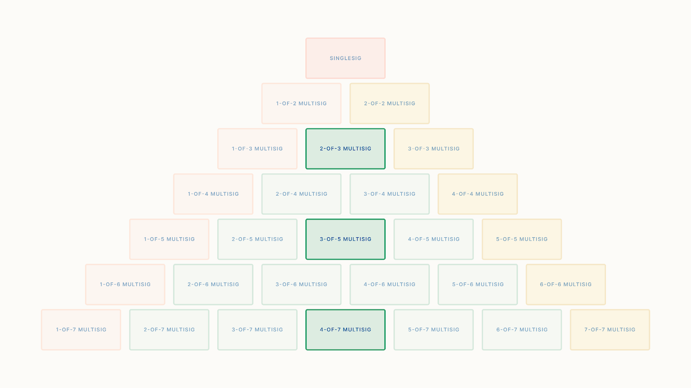

> *作者：Tom Honzik*
> 
> *来源：<https://www.unchained.com/blog/collaborative-multisig-quorum-options>*

Unchained 已经领导[联合保管](https://www.unchained.com/blog/what-is-multisig)比特币服务行业接近十年。我们开发出的产品专门基于 2-of-3 多签名在场要求（quorum），它代表了持有比特币而不担心单点故障的最简单的多签名钱包结构。我们认为，2-of-3 在场要求，是绝大部分人在绝大部分场景下的最佳选择，而更大的在场要求会带来不必要的复杂性。

在我们[介绍多签名钱包的文章](https://www.unchained.com/blog/what-is-multisig)中，我们创建了一个金字塔图来介绍（在场要求）这个概念。我们指出，2-of-3 一般来说是理想的，1-of-N 和 N-of-N 在场要求则无法消除单点故障；同时，一些超过 2-of-3 的在场要求，对于具有特殊需求或者说精细需求的个人和企业，可能是有用的：

现在，Unchaied 也支持更大范围的多签名在场要求，所以值得更加深入地分析各种选择的长处和弱点。本文将深入介绍各种选项的取舍，从而让你可以对自己的比特币保管安全模型作出明智的选择。我们将从介绍少量概念开始，比如：在场要求的类型、关键类别、自主访问和代理保险。

## 多签名金字塔内的在场要求类型

在我们对超过 2-of-3 的多签名在场要求的分析中，我们发现，将金字塔上的在场要求分成三种类型，将便于理解：*中值*、*小于中值*、*大于中值*。各个类别内的在场要求都有共性。

### 中值在场要求

中值在场要求是沿着多签名金字塔的中线发现的，包括 2-of-3、3-of-5、4-of-7，等等。有个公式可以确定一个 K-of-N 的在场要求是不是一个中值在场要求：*2K - 1 = N* 。

中值在场要求可能是最流行的，原因可能在于，它平等对抗你的比特币所面临的两种主要威胁：丢失和盗窃。如果一种参与要求 “太靠左了”，比如 1-of-N ，那么它对盗窃的保护就相对较少，盗贼可能只需要找出一个物件，就足以访问你的资金。如果一种在场要求 “太靠右了”，比如 N-of-N ，那么它对丢失的保护就相对较少，因为它意味着，只要一个私钥损坏或遗忘，你就无法访问自己的资金了。因此，中值在场要求对这些顾虑提供了平等的保护。

### 小于中值的在场要求

小于中值的早场要求是在金字塔的左半边发现的，包括 2-of-4、2-of-5、2-of-6、3-of-6，等等。确定它的公式是：*2K - 1 < N* 。请注意，在本分析中，我们抛弃 1-of-N 这种在场要求，因为它无法消除单点故障。

相比于中值要求，小于中值的在场要求有所侧重 —— 对丢失私钥的保护更多，但对未经授权的访问（也即盗窃）的保护稍微少一些。这也不让人意外，因为，如果密钥总数量不变，更小比例的密钥就足以取走比特币，那这些比特币当然是更容易访问的。

### 大于中值的在场要求。

大于中值的早场要求是在金字塔的右半边发现的，包括 3-of-4、4-of-5、4-of-6、5-of-6，等等。确定它的公式是：*2K - 1 > N* 。同样地，在本分析中，我们也抛弃 N-of-N 这种在场要求，因为它无法消除单点故障。

大于中值的在场要求与小于中值的早场要求取舍相反。它们对盗窃提供了更多的保护，但对丢失提供了相对更少的保护。因为需要更大比例的密钥来取走比特币，那么访问当然是更难的。

## 密钥分类：自主管理和代理人管理

本分析的另一个重要元素是，用在一个多签名装置中的密钥，也可以分成两种主要类型。*自主管理的密钥*，是由你自己持有的密钥；或者，在比特币财库的情形是，是由你们集体组织中的一个成员持有的密钥。而 *代理人管理的密钥*，则是由一个[密钥代理人](https://www.unchained.com/blog/what-is-a-bitcoin-key-agent)持有的 —— TA 并非这些比特币的主人之一，只是被主人雇佣来保管和操作多签名装置中的一个密钥的人。这个区分很重要，因为它意味着，在任何给定的多签名在场要求中，都可以形成截然不同的保管结构。

为了说清楚，请形象一个 2-of-3 在场要求的多签名保管装置，它可能有 4 种不同的密钥类型 *安排*。每一种安排都会产生独特的可以授权取款的密钥组合集合，我们称之为 “*访问模式* ”：

| 密钥安排（总共 3 个密钥）                        | 访问模式（需要 2 个密钥）                                    |
| ------------------------------------------------ | ------------------------------------------------------------ |
| 自主管理的密钥数量：3 代理人管理的密钥数量：0 | 2 个自主管理的密钥                                           |
| 自主管理的密钥数量：2 代理人管理的密钥数量：1 | 2 个自主管理的密钥；1 个自主管理的密钥，1 个代理人管理的密钥 |
| 自主管理的密钥数量：1 代理人管理的密钥数量：2 | 2 个代理人管理的密钥；1 个自主管理的密钥，1 个代理人管理的密钥 |
| 自主管理的密钥数量：0 代理人管理的密钥数量：3 | 2 个代理人管理的密钥                                         |

从上表可知，一些安排会比别的安排提供更多的访问模式，从而可能对寻求可选性的人更有吸引力，因为（在这些安排中）从冷存储中取出比特币时他们必须亲身参与。

### 关于密钥安排与访问模式的记号

在本文中，我们将使用一种缩写系统，以更准确地表示密钥安排与访问模式。“2 个自主管理的密钥及 1 个代理人管理的密钥” 这样的安排，将被缩写为 “2S/1A”（使用斜杠符号）。至于 “1 个自主管理的密钥 + 1 个代理人管理的密钥” 这样的访问模式，将被缩写为 “1S + 1A”（使用加号）。

此外，有时候，在多签名安排中会存在多种不同密钥的组合，都符合某一种访问模式；在比较不同的安排时，这个事实也是有关的。一种访问模式允许的不同密钥组合可以表示为 “ (1S+1A)2 ”，意思是在这种访问模式中，还有两种不同的密钥组合。

使用这些记号之后，关于 2-of-3 多签名在场要求的表格可以这样表达：

| 密钥安排 | 访问模式                                 |
| -------- | ---------------------------------------- |
| 3S/0A    | (2S)3                         |
| 2S/1A    | (2S)1 ，(1S + 1A)2 |
| 1S/2A    | (1S + 1A)2，(2A)1  |
| 0S/3A    | (2A)3                         |

### 代理人管理密钥的子类别

虽然每一个自主保管的密钥，一般来说可以认为是彼此相似的（主要的区别跟它们的存放位置有关），但代理人管理的密钥则可以根据代理人的分类进一步区分。尤其是，区分由精通密钥代理的 *专业机构* 持有的密钥，与 *亲友*（承担管理某个密钥的责任的密友或家庭成员）持有的密钥，是常见做法。在 “[Connections](https://www.unchained.com/connections)” 特性推出之后，Unchained 已经支持这两种类型的代理人管理密钥。

区分这些代理人管理的密钥的类型也是有用的。专业机构一般来说在密钥管理上会比亲友更有经验，因为他们有谨慎设计的护栏和流程。同时，亲友则在机构流程可视为繁琐障碍的情形中具有优势，比如在时间紧急的情况下。

## 自主访问与代理人保险

评价一种多签名在场要求安排的最重要指标之一就是它能否提供用户自主访问渠道，以及/或者 一个代理人保险。*自主访问* 意味着保管中的比特币可以完全由自主管理的密钥来访问，无需任何密钥代理人的帮助。而 *代理人保险* 则意味着即使所有自主管理的密钥都丢失，保管中的比特币也依然能取出，因为安排中有足够多的代理人管理的密钥，可以授权取出比特币。

只要你希望能够独立访问自己的比特币、无需第三方参与，自主访问特性就是有用的；但是，如果你担心攻击者勒索你交出资金的可能性，那自主访问可能就是不讨喜的了。如果你担心自己会弄丢所有的自主管理密钥，那么代理人保险可能是个好功能；但如果你担心你的密钥代理会恶意串通、夺走你的比特币，那这个功能又是讨厌的了。

|              | 优势                                             | 劣势                               |
| ------------ | ------------------------------------------------ | ---------------------------------- |
| **自主访问** | 完全独立控制资金，无需来自密钥代理人的帮助       | 在面对人身攻击时，资金可能更加危险 |
| **代理保险** | 即使你所有的密钥都丢失或被盗了，资金也有可能复原 | 理论上，密钥代理可能串通来盗取资金 |

还值得指出的是，上面提到的这两种特性的劣势都可以通过特定的技术来缓解。如果一种安排包含了自主访问，并且自主管理的密钥在空间上充分分散，那么人身威胁就不那么可能导致资金丢失。如果一种安排包含了代理人保险，在挑选代理人时谨慎小心，就可以让串通的概率变得非常低。有可能让密钥代理人们不知道彼此的存在。你可以在专业机构和亲友之间分割密钥代理的责任，从而，串谋变得需要多种类型的背叛 —— 既包括 机构/政府 的背叛，又包括个人层面的背叛。

## 评估中值在场要求

中值在场要求这种要求很有趣，因为它使你必须在自主访问和代理人保险之间作出选择。在中值在场要求的装置中，没有一种密钥安排能同时具有这两种特性，也没有一种安排是两者皆失的。

我们来仔细看看中值在场要求的最简单例子，2-of-3 和 3-of-5 。

### 2-of-3 多签名

| 密钥安排 | 访问模式 | 自主访问 | 代理人保险 |
| -------- | -------- | -------- | ---------- |
| 3S/0A    | (2S)3  | 有  | 无  |
| 2S/1A    | (2S)1 ，(1S + 1A)2 | 有  | 无  |
| 1S/2A    | (1S + 1A)2，(2A)1  | 无  | 有  |
| 0S/3A    | (2A)3                         | 无  | 有  |

2-of-3 多签名在场要求是受到最广泛推荐的在场要求，因为它的总密钥数量最少且管理复杂性最小，同时，又能成功对抗单点故障。它也提供了多种多样的密钥安排选择，来满足不同的目标。3S/0A 这种安排可以完全依靠自身的努力来搭建，不使用任何密钥代理，它的取舍我们在[较早的一篇文章](https://www.unchained.com/features/diy-vs-collaborative-multisig)中分析过。2S/1A 是建立联合保管关系的一种好方法，它无需放弃自主访问。1S/2A 和 0S/3A 则是尽可能减少你的密钥保管责任的方法，而且你不需要信任单个比特币托管商。

### 3-of-5 多签名

| 密钥安排 | 访问模式 | 自主访问 | 代理人保险 |
| -------- | -------- | -------- | ---------- |
| 5S/0A    | (3S)10  | 有  | 无  |
| 4S/1A    | (3S)4 ，(2S + 1A)6 | 有  | 无  |
| 3S/2A    | (3S)1 ，(2S + 1A)6，(1S + 2A)3 | 有  | 无  |
| 2S/3A    | (2S + 1A)3，(1S+2A)6，(3A)1 | 无  | 有  |
| 1S/4A    | (1S+2A)6，(3A)4 | 无  | 有  |
| 0S/5A    | (3A)10                         | 无  | 有  |

以更多的密钥和更多的复杂性为代价，3-of-5 在场要求不仅能够消除单点故障，还能消除 “双点故障”（比如说，任何两个密钥丢失，资金也依然能复原）。这是能够实现这一点的最小的在场要求，就像 4-of-7 是能够消除 “三点故障” 的最小在场要求一样，以此类推。在现实中，绝大部分人都只需要打败单点故障，就能成功地长期保护自己的比特币。

3-of-5 在场要求有一些密钥安排较为有趣，比如 3S/2A，它实现了自主访问，但在大部分自主保管的密钥丢失的条件下也有复原路径可用。2S/3A 则可通过 3 个不同的代理人实现代理人保险，同时，只要其中一个代理人加上你的两个自主管理的密钥，就能取出资金。

## 评估小于中值的在场要求

小于中值的在场要求较为特殊，因为不需要获得占大多数的密钥，就能花费资金。因此，这一分类以最少的密钥总数产生了最多的访问模式和密钥组合。它是唯一一种可能产生 *既可以* 自主访问 *又具有* 代理人保险的安排的在场要求。

我们来看小于中值的在场要求的两个最简单的例子，2-of-4 和 2-of-5 。

### 2-of-4 多签名

| 密钥安排 | 访问模式 | 自主访问 | 代理人保险 |
| -------- | -------- | -------- | ---------- |
| 4S/0A    | (3S)6  | 有  | 无  |
| 3S/1A    | (2S)3 ，(1S + 1A)3 | 有  | 无  |
| 2S/2A    | (2S)1 ，(1S + 1A)4，(2A)1 | 有  | 有  |
| 1S/3A    | (1S + 1A)3，(2A)3  | 无  | 有  |
| 0S/3A    | (2A)3                         | 无  | 有  |

2-of-4 多签名提供的访问模式与 2-of-3 多签名所提供的没有很大区别，只有一个例外：2S/2A 。这种安排是特殊的，因为它表明，2-of-4 在场要求是能够产生 3 种访问模式的最小多签名在场要求。类似地，3-of-6 是能够产生 4 种访问模式的最小要求，以此类推。

2S/2A 这种密钥安排，也是同时拥有自主访问和代理人保险的最简单方式。这可能是一种有吸引力的选择，如果你希望既能 *不必依赖于* 来自代理人的帮助、独立访问自己的比特币，在完全弄丢自己的自主管理密钥时又有 *可能* 获得来自代理人的协助。

### 2-of-5 多签名

| 密钥安排 | 访问模式 | 自主访问 | 代理人保险 |
| -------- | -------- | -------- | ---------- |
| 5S/0A    | (2S)10  | 有  | 无  |
| 4S/1A    | (2S)6 ，(1S + 1A)4 | 有  | 无  |
| 3S/2A    | (2S)3 ，(1S + 1A)6，(2A)1 | 有  | 有  |
| 2S/3A    | (2S)1，(1S+1A)6，(2A)3 | 有  | 有  |
| 1S/4A    | (1S+1A)4，(2A)6 | 无  | 有  |
| 0S/5A    | (2A)10                         | 无  | 有  |

对比 2-of-5 多签名与 2-of-4 多签名，我们发现，它没有不同的访问模式集合。主要区别在于，在产生任何一种访问模式时，都有更多的密钥组合可能，这对 2-of-6、2-of-7 这些密钥总数更多的在场要求上也是成立的。如果你有理由让某种访问模式比其它模式更优先，这个事实可能有它的意义。

## 评估大于中值的在场要求

大于中值的在场要求的独特性在于，需要获得绝对多数的密钥才能花费资金。因此，这一分类产生了最少的访问模式和密钥组合。它是唯一一种可能产生 *既无法* 自主访问 *又没有* 代理人保险的安排的在场要求。

我们来看大于中值的在场要求的两个最简单的例子，3-of-4 和 4-of-5 。

### 3-of-4 多签名

| 密钥安排 | 访问模式 | 自主访问 | 代理人保险 |
| -------- | -------- | -------- | ---------- |
| 4S/0A    | (3S)4  | 有  | 无  |
| 3S/1A    | (3S)1 ，(2S + 1A)3 | 有  | 无  |
| 2S/2A    | (2S + 1A)2，(1S + 2A)2 | 无  | 无  |
| 1S/3A    | (1S + 2A)3，(3A)1  | 无  | 有  |
| 0S/3A    | (3A)4                         | 无  | 有  |

在密钥安排相同时，3-of-4 多签名所能提供的访问模式，与 3-of-5 多签名基本上是相同的，只有 2S/2A 有所区别。它是既没有自主访问、又没有代理人保险的最简单密钥安排。这对一些既担心人身威胁、因此希望取款流程有密钥代理人参与，同时又希望杜绝密钥代理人勾结的人可能有吸引力。两种担心都与盗窃威胁有关，这是大于中值的在场要求优先防止的风险（相比丢失密钥的危险）。

### 4-of-5 多签名

| 密钥安排 | 访问模式 | 自主访问 | 代理人保险 |
| -------- | -------- | -------- | ---------- |
| 5S/0A    | (4S)5  | 有  | 无  |
| 4S/1A    | (4S)1 ，(3S + 1A)4 | 有  | 无  |
| 3S/2A    | (3S + 1A)2 ，(2S + 2A)3 | 无  | 无  |
| 2S/3A    | (2S + 2A)3，(1S+3A)2 | 无  | 无  |
| 1S/4A    | (1S+3A)4，(4A)1 | 无  | 有  |
| 0S/5A    | (4A)5                         | 无  | 有  |

相比 3-of-4，4-of-5 在场要求增加了一个密钥，并且也要求多一个密钥来授权取款。这使得移动资金变得更加困难，并提高了完全失去访问权的风险。只要装置中的两个密钥丢失或损耗，保管中的比特币就永远无法访问了。虽然其它在场要求（比如 2-of-3）也有这种情况，但如果密钥总数更多（比如 5 个），那么丢失和损坏的风险也会放大。有一些大于中值的在场要求（比如 4-of-6），因为离金字塔的边缘更远（更靠近中线），风险会小一些。

## 确定你的理想保管装置

如我们前面所证明的，多签名钱包有许多在场要求和密钥安排可供选择，带来了高度可定制的比特币保管装置。有些选项似乎是首屈一指的，但如果你理解所有相关的取舍，你可以优先考虑你最在乎的特性，从而缩小选择范围。

|                              | 长处                             | 短处                                           |
| ---------------------------- | -------------------------------- | ---------------------------------------------- |
| **密钥总数较少且在场要求低** | 相对简单，在分析和管理时更少变量 | 定制能力亦相对受限                             |
| **密钥总数较多且在场要求高** | 可以满足更具体和精细的需要       | 更多密钥材料和其它变量需要管理，复杂性由此增加 |
| **中值在场要求**             | 平等对待丢失和盗窃的风险         | 没有优先对待哪种担心                           |
| **小于中值的在场要求**       | 失去访问能力的风险较小           | 可能增加盗窃漏洞                               |
| **大于中值的在场要求**       | 因为盗窃而损失资金的风险较小     | 可能增加资金变得无法访问的漏洞                 |
| **更大比例的自主保管密钥**   | 较少依赖密钥代理人               | 带来更多管理密钥材料的个人责任                 |
| **更大比例的代理人管理密钥** | 尽可能降低了个人的密钥管理责任   | 更加依赖密钥代理人                             |

一些可以追问自我的问题有：

- 你是否愿意并且有信心保管你的比特币密钥？
- 自主访问特性对你来说是好还是不好？
- 代理人保险对你来说是好还是不好？
- 带有更多元素的复杂安排是否本身让你困扰，还是说它是满足你的企业或组织的需要的必要方式？
- 你是否强烈倾向于优先获得某些保护，比如防止你的比特币因为丢失访问能力而丢失，或是盗窃？

在思考这些问题时，大部分人可能会发现，2-of-3 在场要求里面的某种密钥安排是能满足他们的目标的。然而，也有人会为了增加定制能力而走向 3-of-5 在场要求，或者为了同时获得自主访问和代理人保险而走向 2-of-4 在场要求，为了长期锁定资金而选择 3-of-4 在场要求，或是采用 4-of-6 在场要求来模拟 3-of-4 同时增加对抗密钥丢失的保护。

（完）