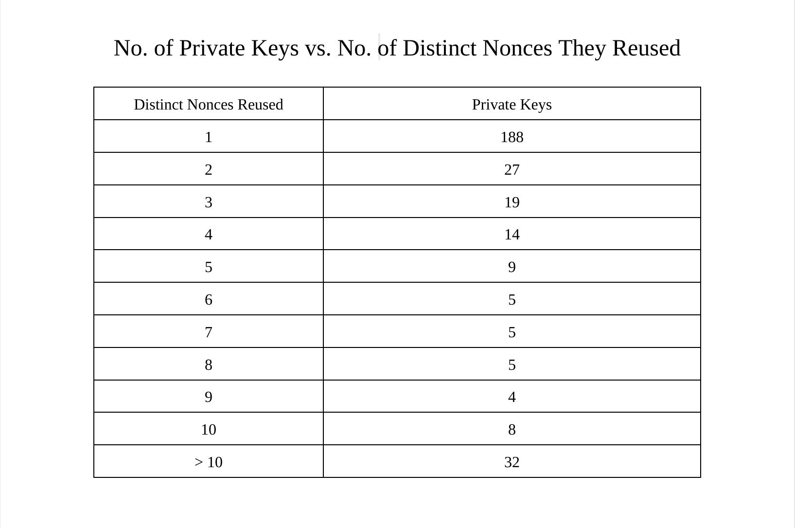

> *作者：Ishaana Misra*
> 
> *来源：<https://ishaana.com/blog/nonce_reuse/>*

在我刚开始了解怎么创建比特币交易的时候，我记得我读到过几段话，讲的是创建签名的时候复用 nonce   对资金安全是致命的。那时候我还不太理解，只是把它当成编写钱包软件时需要记住的额外事项。几个月以前，我决定重新检查一下我编写的测试网钱包是怎么构建交易的，尤其是签名的流程。我因此开始检查我的钱包是如何生成 nonce 的，以及我的钱包用来保证每个 nonce 都只用一次的技术。这一次，我准备再深入一点。

比特币交易中的 Nonce 不可以复用，因为这会导致资金损失。[Bitcoin Stack Exchange](https://bitcoin.stackexchange.com/) 网站上有许多关于 nonce 复用的提问，还有人问如何从犯了这个错误的人手上盗取比特币（没错，不是所有的问题都是善意的）。[Bitcoin Talk](https://bitcointalk.org/) 论坛上也有一些帖子，提到了现在有一些机器人会从那些复用了 nonce 的地址中盗窃资金。

那么，如果这是一个由来已久的问题，并且有众所周知的解决方案（我在上面也暗示了我编写的钱包软件就使用了其中一种），为什么我还要花时间写这篇文章呢？Nonce 复用经常被列为 “绝对不要这样做” 的事项，而且现在因为 nonce 复用而丢失资金的情况也越来越少（因为钱包软件相比以往有了很大的进步）。但是，很少有关于这个主题的历史分析。我找到了一些关于这个主题的文章，但没有很多，而且这些文章要么已经过时了，要么不像我希望的那么详细。

所以，我决定自己尝试一下，使用来自我的比特币节点的信息、看看 nonce 复用在以往的流行程度。我决定分成多篇文章来发表，因为首先扫描区块链以发现 nonce 复用就需要时间，而分析这些数据以找出异常、模式以及某些数据出现的原因，可能需要更长时间。分成多篇文章可以让我每一篇文章都集中在一个主题上。

本文（第一篇）介绍的是 nonce 是怎么用在签名创建中的、我的 nonce 复用扫描仪的初步实现、我认为可能会有趣的特定数据，以及我迄今已经收集的一些初步数据。

## 快速回顾比特币中的签名构造

> 注：如果你完全不了解 ECDSA（椭圆曲线数字签名算法）和比特币中的数字签名，我会建议你读读 Jimmy Song 的《[Programming Bitcoin](https://github.com/jimmysong/programmingbitcoin)》一书的前三章。

定义如下（注意，小写字母表示标量，而大写字母表示椭圆曲线上的点）：

- G 为 *椭圆曲线上的生成器点*
- e 为 *私钥*
- P = e * G 为 *公钥*
- k 为 *秘密的 nonce 值*
- R = k * G
- r 为 *R 的 x 坐标*
- z 为 *被签名的消息，也即 sighash*

计算 s：

- [s = (h + re)/k（都要对 N 求模）](https://bitcoin.stackexchange.com/a/73624/131112)

所以，完整的签名是：

- {r, s}

## 那么 nonce 是什么？为什么不能同一个私钥不能重复使用同一个 nonce？

Nonce 的全部意义就是为上面的签名等式引入随机性。因此，如果同一个私钥对两条不同的消息签名时居然使用了相同的 nonce，那它就完全没有意义了。以下是详细解释：

给定两个签名 {r, s1} 和 {r, s2} 是同一个私钥对两条不同的消息 z1 和 z2  的签名，并且使用了相同的 nonce（也就是两个签名的 k、r 和 e 是相同的），那么：

- s1 = (z1 + re)/k
- s2 = (z2 + re)/k

把它们都乘以 k 之后：

- s1 * k = z1 + re
- s2 * k = z2 + re

…… 只要联立这两个方程，我们就能从中抽取出被重复使用的 nonce：

- k(s1 - s2) = z1 - z2  
  - 即：k = (z1 - z2)/(s1 - s2)

一旦我们知道了 nonce，就可以计算出私钥 e：

- k * s1 = z1 + re
  - re = k * s1 - z1
    - e = (k * s1 - z1)/r

这就是为什么 nonce 复用是非常危险的。

（译者注：原文使用了 “nonce private key” 和 “actual private key” 这样的表述，这是有道理的。因为 nonce 也是不能暴露。也有人将 nonce 称为 “一次性私钥”。）

## nonce 复用在比特币区块链上发生过吗？

理想状况下，偶然发生这种事情的概率是微乎其微的，但因为糟糕的熵源和有问题的钱包实现，有非常多同一个 nonce 值被用在多个签名中的例子。举个例子，看看这篇 bitcointalk 的[帖子](https://bitcointalk.org/index.php?topic=271486.0)，它就介绍了许多跟 nonce 复用相关的致命 bug 之一。

## 需要记住的罕见情形

虽然在我撰写这篇文章的时候，一直记住这些罕见的情形让我觉得很烦，但我也意识到，使用我收集到的数据来探究这些情形可能也是非常有趣的，我会在下一节详细介绍。

- 一个 nonce 值可能被同一个私钥多次使用（不止两次）
- 同一个私钥可能重复使用过不止一个 nonce 值
- 同一个 nonce 值可以被多个私钥使用过

## 有趣的数据

### 私钥泄露的数量与区块高度的关系

我最开始希望扫描 nonce 复用的动机是好奇：nonce 复用的频次在历史上是怎么变化的？注意，“私钥泄露的数量” 并不等于 “被复用的 nonce 的数量”，因为相同的 nonce 可能被多个私钥使用过。举例说明：如果某三个私钥使用过同一个 nonce 值两次，那么这会导致 3 个私钥泄露，但被复用的 nonce 值只有一个。

同样重要的是计算给定时间被泄露的私钥在所有服役私钥中的百分比，而不只是统计被泄露的私钥数量。因为较新的区块本身就比较旧的区块包含更多的交易。

### 多次泄露同一个私钥

同一个私钥可能多次泄露。比如说，某一个私钥可能重复使用了某一个 nonce 值，然后又重复使用了另一个 nonce 值。这将在被泄露的私钥的图谱中显示为两个数据点（带有不同的 nonce 值）。我编写了一个短脚本，以检查同一个私钥多次泄露的频次。这很重要，因为如果许多私钥都经历过多次泄露，那么数据的含义就可能跟它表面上看起来的不一样（在探究因为 nonce 复用而泄露的私钥数量的变迁的时候）。

### 传统输入 vs. 隔离见证 v0 输入的地址复用

我会期待隔离见证 v0 输入的 nonce 复用更少，有两个原因：

1. 隔离见证 v0 输入是从 2017 年开始使用的。而 2017 年的时候，钱包软件已经比原来高级很多了。
2. 至少在因为 过时/差劲 的钱包软件而导致的 nonce 复用情形中，我会认为，即使钱包可能在实现隔离见证输入的花费中遇到麻烦，它们的签名构造也会符合行业标准（即：它们会使用一种技术来保证 nonce 不会复用）。我也很好奇，会不会有某个 nonce，在传统输入和隔离见证输入中都被使用过。我非常怀疑，但我还是编写了一个检查。看看某一个公钥会不会既用来创建了隔离见证 v0 地址，又用来创建了传统地址，也是很有意思的。

### 不同私钥，但用上了同一个 nonce 值

这项检查研究的是有没有某一个 nonce 被多个私钥使用过。这种情况是不会出现我们上面说的（同一个私钥多次使用同一个 nonce 值）问题的，因为外部的观察者无法计算出私钥。但是，假设这两个私钥属于两个人，那么使用相同的 nonce 会导致他们可以计算出对方的私钥。

我们把第一个地址的主人称为 Alice，第二个地址的主任称为 Bob。如上所述，如果 k 值是已知的，那么下面的方程就可以用来计算私钥：

- e = (k × s - z)/r

那么，如果他们使用了相同的 nonce，Alice 如何能计算出 Bob 所用的 k 值呢？Bob 的签名包含了 r，就是点 rG 的 x坐标。如果 Alice 和 Bob 使用了相同的 r，那么他们的 k 必定相同。那么 Alice 就可以使用下面这个式子计算出 k：

- [k = (d × r + z)/s](https://bitcoin.stackexchange.com/a/116826/131112)

她可以这样做是因为她知道自己的私钥，也知道来自签名的 r 值，也知道被签名的消息（交易），也知道 Bob 对消息的签名。Alice 需要计算 k 值是因为她不存储自己的 k 值。有了这个 k 值，Alice 就可以计算出 Bob 的私钥并盗走他的资金。但是，两个不相关的人用到了同一个 nonce 的概率是非常非常低的，除非这个 nonce 根本就不是随机选出来的。不是随机选出来的 nonce 意味着用到了糟糕的熵源，或者这个 nonce 此前被分享过。

再说一遍，因为这个原因而导致资金被盗的概率是极小的，我只是认为这很有趣，因为这种情况对我来说构成了一个没有显而易见问题的答案。

## 识别故意的私钥泄露的可能线索

不能排除一些人会故意泄露私钥，尤其是在比特币的早期，许多实验在主链上开展。我们不能截然确定某一个 nonce 是不是被有意复用的，但这无疑是一种很棒的方法。了解跟某一次复用相关的更多信息将带来更多启发。

- 使用一个会导致非常短的 r 值的 nonce（这是为了节约手续费）
- 非常高的复用次数（尤其是在多个交易中）
- 在同一笔交易中不同的 nonce 都被使用了正好两次
- 在即将把比特币烧掉（例如，使用 OP_RETURN 输出）的时候

## 实现一种 nonce 复用扫描仪

虽然我还在修改和优化我的扫描仪实现，但我的总体方法一直没变。为了辨明 nonce 复用在不同年代的频次，我需要扫描区块链，跟踪 nonce 以及使用这些 nonce 的公钥，然后跟踪 nonce 复用发生的区块高度。为此，我决定修改 Bitcoin Core 自身，而不是使用 RPC 来获得这些信息，因为我已经熟悉它的代码了。因此，我不需要编写额外的代码来处理交易的索引、检查输出的类型，等等；而且使用 Bitcoin Core 可能速度还更快。我用了一个 [leveldb](https://github.com/google/leveldb) 数据库来跟踪相关的信息。

## 初步的数据以及观察到的模式

下面就是我从扫描创世区块到区块高度 301102 的区块（在 2014 年 5 月 挖出），找出的 nonce 复用情况。本系列的后续篇章会提供更近的数据，以及对特定 nonce 复用案例的更透彻的分析。

第一个发生 nonce 复用的是一笔 P2PKH 交易，发生在区块高度 121487 处，交易的 id 为：[19edfbf79bca8d11b133e1b52e310bdf20a86135bb87fbbce2e5318a1b1791b4](https://mempool.space/tx/19edfbf79bca8d11b133e1b52e310bdf20a86135bb87fbbce2e5318a1b1791b4)，泄露了地址 [1A8TY7dxURcsRtPBs7fP6bDVzAgpgP4962](https://mempool.space/address/1A8TY7dxURcsRtPBs7fP6bDVzAgpgP4962) 的私钥。

下图就是在不同时期因为不同 nonce 的复用而导致泄露的私钥的数量。值得一提的是，这里面包括了同一个私钥因为复用多个 nonce 而导致多次泄露的情形。

我非常惊讶，居然有这么多私钥重复使用了不止一个 nonce。数据表明，在 2014 年以前，发生过 nonce 复用的私钥中有 40% 都复用过不止一个 nonce。很难确定有多少是故意的，因为计算楚一个地址的私钥之后，任何人都可以让这个地址重复使用任意多个 nonce。

多个公钥使用过同一个 nonce 的情况如下图，这个就没那么令人惊讶了。

那个曾被不同公钥使用了 31 次的 nonce 的 r 值为 `79be667ef9dcbbac55a06295ce870b07029bfcdb2dce28d959f2815b16f81798`。这实际上是椭圆曲线 sepc256k1 上的生成器点的 x 坐标。使用这个 r，意味着相应的 k 值为 1。使用 1 作为 k 值没有什么意义，因为它跟使用别的 k 得出的 r 的长度是相同的，但显然很多人都这么做了。

## 问题的解决方案

到目前为止，我的研究在很大程度上都主要是（并且将继续是）历史分析，因为事实上已经出现了防止 nonce 复用的简单办法了，不论是作为用户还是作为钱包软件的生产者，办法都有了。这些版本，在现在已经成为行业标准了。第一种办法，也是最简单的办法，是用户可以做的，就是不要复用公钥（也就意味着不要重复使用一个地址）。只要你不多次使用同一个公钥，就算你重复使用了同一个 nonce，也不会泄露你的私钥。不要重复使用地址在隐私性上也有好处，只要稍微了解比特币的工作原理的人都会明白这其中的道理。

另一种解决方案，是必须在钱包软件层面实现的，叫做 “确定性的 nonce 生成”。简单来说，它就是拿需要被签名的消息以及私钥来生成 nonce，结果是每次花费一个新的输入时，都会产生一个唯一的 nonce。这是因为即使私钥没变，被签名的消息也一定会变。我估计今天每一种主流的、有声誉的钱包，都已经用上了确定性的 nonce 生成技术。

- - -

虽然我已经在这篇文章中发现了一些有趣的数据，但这仅仅是所有需要获取的数据的表面。本系列的下一篇文章将提供更多细节：我是如何获得这些数据的、我用来理解这些数据和获得特点统计数据的脚本、关于更近的区块的一般化数据，以及关于某一些非常有趣的 nonce 复用案例的信息。

> 感谢 Murch 评审这篇文章并跟我讨论了这些概念。文中所有的错误和观点，都属于我自己。