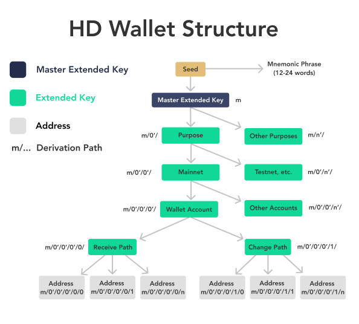
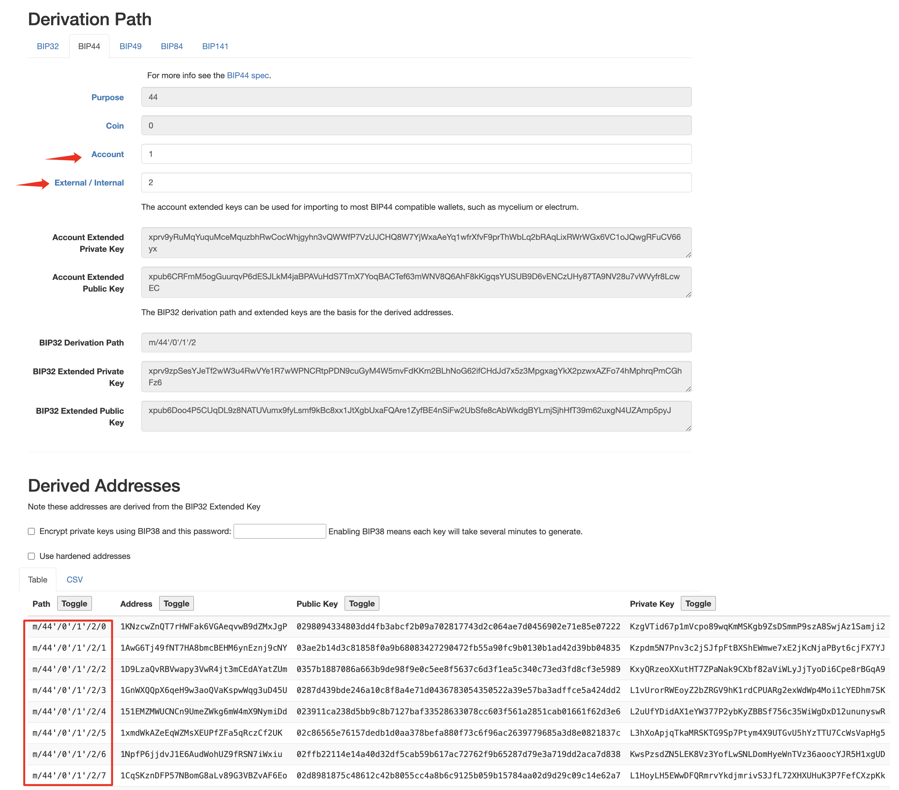
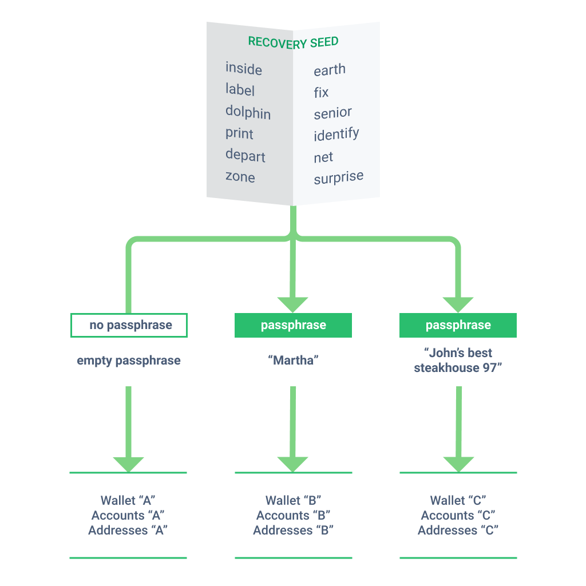
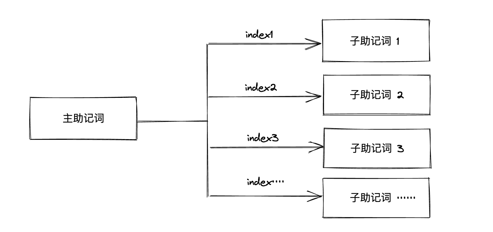

> *作者：Mi Zeng*


什么！找回比特币钱包竟然也需要一份指南？难道不是将助记词随便导入一个钱包软件，比特币就回来了吗？

先别急。看了这篇指南，你将了解助记词和钱包背后的基本原理。以及，如何找回你的比特币钱包。
## 从助记词到地址，发生了什么

### 私钥、公钥和地址
首先，搞清楚私钥、公钥和地址之间的关系非常重要。

私钥是一切的源头。本质上，它是一长串由 0 和 1 组成的 256 位随机数。有各种各样的方式帮助你生成这样一串随机数。当花费资产时，钱包需要用到私钥来签名，这是解锁比特币最关键的要素。"Not your key, not your coin." 这句广为流传的名言，强调的便是私钥的重要性。

公钥是由私钥通过椭圆曲线算法计算得到的。由私钥计算得出公钥的过程不可逆。

公钥经过一系列单向的哈希运算和编码，就得到了我们使用的比特币地址。

注意，这三者之间的推导关系是单向的，你可以由私钥计算出公钥，得出对应的地址，而无法由地址逆向算出私钥。哈希算法和非对称密码学为此提供了安全上的保障。


<p style="text-align:center">- 图源：精通比特币 -</p>


在早期的比特币钱包软件中，每当用户需要一个新地址时，钱包就会创建一个新的私钥并产生一个新的地址。用到的地址越多，对应的私钥也就越多。而糟糕的是，这些私钥彼此之间没有任何联系，这意味着每一个私钥都需要备份，给用户带来了极大的不便。在早期，用户需要定期备份一个叫作 “wallet.dat” 文件。一旦该备份文件丢失，资金将无法找回。

那么，如何让不同私钥之间如何产生联系？助记词又是如何取代这一繁琐而危险的备份方式的？这一切，得从三个最重要的 BIP 说起。
### BIP39：助记词
这是最广为人知的一个 BIP 标准，它的出现大大简化了私钥备份的难度。私钥的形式对于普通人而言过于复杂，用户很难安全且准确无误地记录和输入那么一长串字符。而有了 BIP39，我们就可以将私钥转换为 12 或 24 个简单的单词，也可以更方便地在钱包之间导入导出。如果你对私钥具体是如何转换成助记词的感兴趣，可以看[这篇文章](https://www.btcstudy.org/2020/09/04/understand-bitcoin-public-and-private-keys-encode-and-extend/)。

如今，**几乎**所有的比特币钱包都支持了助记词这一备份形式。然而，光靠助记词是不够的。如果私钥之间并没有关联，那就意味着每使用一个新地址，就需要备份一份新的助记词。这样的方式看上去并不比备份钱包文件优雅多少。那么，目前常用的这些钱包，是如何做到通过一个助记词管理一大堆钱包地址的呢？

实际上，在助记词出现之前，一个 BIP 已经为此打下了基础。
### BIP32：分层确定性钱包
BIP32 提供了一种方案：通过一个**初始的主密钥** ，按照特定的算法（密钥派生函数）可以推导出成千上万的扩展密钥对（扩展公钥和扩展私钥）。“分层” 两个字，已经很好地概括了这一结构的特点。它就像一棵树一样，通过最初的主密钥派生出一堆子密钥，任意一个子密钥都可以使用这套算法继续往下派生自己的子密钥。


<p style="text-align:center">- 分层确定性钱包图示 -</p>


如果你对这一密钥派生的技术过程感兴趣，可以看看这篇文章：[BIP32 拓展密钥图解](https://www.btcstudy.org/2023/10/09/bip-32-extended-keys-diagram/)

通过这种分层派生密钥的方式，我们可以拥有近乎无限的地址。尽管这些扩展密钥对之间并没有直接的关联，但它们都来自于同一个初始密钥。那么，如何建立这些扩展密钥和主密钥之间的联系？派生路径登场！

派生路径长这样：`m/0'/0'/0/0/` 

它清楚地表达了如何从最开始的主密钥计算出具体某一对密钥的全过程。在这一串字符中，“m” 代表着最初的主密钥，每一层子密钥由 “/” 分隔开。每一个 “/” 代表运行了一轮密钥派生算法，斜杠之间的数字就是这一轮密钥派生算法的参数，也可以表示密钥的索引号。例如，由主密钥派生出的第一个子密钥为 `m/0` ，由这个子密钥派生出的第一个子密钥为  `m/0/0` ，以此类推······ 其中任何一个数字的改变，都将得出不同的密钥和地址。派生路径就像是电脑里的文件路径，告诉你如何找到某个具体的地址。

BIP 32 的出现给钱包的管理带来了极大的便利，通过一个私钥可以管理千万个地址。借此，用户可以摒弃之前繁琐的备份方式。无论通过这种方式产生过多少个密钥，都可以借助 “派生路径” 找回来。

到这里，聪明的读者会发现：如果仅仅依靠助记词本身，是无法直接得到某一个具体的地址的。必须加上派生路径，才能推导出具体的比特币地址。但是，为什么在大多数情况下，我只是把助记词导入到钱包，曾经用过的那些地址就出来了？

标准化的派生路径功不可没。
### BIP44：为派生路径定义规范
BIP44 为 “派生路径” 中的每一层都赋予了特定含义，它的形式如下：

`m / purpose' / coin_type' / account' / change / address_index`

* `purpose`：代表该分层确定性钱包遵循的规范。对于比特币钱包而言，通过这一层的数字，就可以知道最终的比特币地址类型。

* `coin_type`：代表币种的类型。 同一个助记词可以用于派生不同的加密货币钱包，0 代表比特币，1 代表测试网上的比特币，每种密码学货币都有其特定的编号。

* `account`：账户的索引值，代表当前路径下的第 0 个账户、第 1 个账户、第 2 个账户 ······

* `change`：定义该地址是收款地址还是找零地址。0 代表收款地址，1 代表找零地址。

* `address_index`：地址的索引值，代表当前路径下的第 0 个地址、第 1 个地址、第 2 个地址 ······



<p style="text-align:center">- BIP44 定义下的分层确定性钱包，图源：River  -</p>


#### 动手一试

在浏览器里打开这个网站：https://iancoleman.io/bip39/

利用网站提供的功能随机生成一个助记词。

尝试在 “Derivation Path” （派生路径）这一部分手动更改 “Account” 和 “External / Internal”（也就是上面提到的“Change”）的值。



当你输入不同的数值时，可以看到随着派生路径（BIP32 Derivation Path）的变化，产生的钱包地址（Derived Addresses）也会截然不同。

你也可以通过在 “Derivation Path” 这一部分切换不同的选项卡（例如 BIP49 / BIP84）来改变 “purpose” 的值，看看在不同的派生标准下，生成的地址有何区别。

以下是比特币钱包中最常用的三种地址派生路径标准：

**BIP44**：用于推导 P2PKH 地址的派生路径标准，即最传统的以 “1” 开头的比特币地址，派生路径为 `m/44'/0'/··· `

**BIP49**：用于推导 P2WPKH-nested-in-P2SH 地址的派生路径标准，即以 “3” 开头的隔离见证地址，派生路径为 `m/49'/0'/··· `

**BIP84**：用于推导 P2WPKH 地址的派生路径标准，即以 “bc1q” 开头的原生隔离见证地址，派生路径为 `m/84'/0'/···`

正是因为有了这些标准化的派生路径，钱包们才知道应该跟随哪条派生路径来生成地址。这就是为什么在大多数情况下，用户只需要导入助记词，选择地址类型，就能找回用过的钱包。

助记词、分层确定性钱包和标准化派生路径的组合，使得备份和找回比特币资产变得前所有未有的方便。所以说：只备份好助记词，就够了吗？
## 助记词不是万能药

即便已经有了上述一系列关于钱包的 BIP，当你真正需要找回钱包时，仅有助记词或许仍然是不够的。不同的钱包在开发时并没有一个绝对的标准，总是存在一些例外的情况，是单靠助记词无法挽救的：

* 部分钱包并没有实施 BIP 标准
* 钱包实施了 BIP 标准，但与其它钱包不一致
* 实施了一些较新的标准，但采用的钱包很少

这样的困境并不会因为你避免使用小众的钱包就完全消失。

举个很简单的例子，如果你使用 Electrum 钱包创建了助记词，当你将这份助记词导入其它钱包中时，会面临 “助记词无效” 的尴尬局面。这是因为 Electrum 并没有采用行业通用的 BIP39 助记词标准，而是使用了自己独特的助记词系统。

如果你是 Ledger 钱包和以太坊的用户，当你想更换硬件钱包时， Ledger 也会给你上一课。同样的助记词导入到其它钱包，会得到完全不一样的以太坊地址。这是因为 Ledger 使用了与其它钱包都不同的派生路径。如果想找回原来用过的地址，必须手动设置成和 Ledger 一样的路径。

不同钱包采用不同标准的情况相当常见，经常有人在找回资金的路上犯了难，以致于出现了像 [Wallets Recovery](https://walletsrecovery.org/) 这样的网站，专门指导用户如何在不同的钱包里找回自己的资金。如果你恰好遇到了找回钱包上的困难，也可以去那里碰碰运气。
## 钱包找回指南
回到一开始的问题：如何找回比特币钱包？换言之：当我们需要找回自己的钱包时，需要哪些东西？

在了解完上文提供的基础知识后，这个问题的答案已经非常明确了：如果你的比特币钱包使用了标准化的派生路径（绝大多数钱包都提供了查看派生路径的功能），那么，记住你所使用的**地址类型**，做好助记词的备份就足够了。在找回钱包时，软件会根据你指定的地址类型自动匹配派生路径的标准，推导出正确的地址。

如果你无法确定当前钱包使用的派生路径是否标准，那么请一定要备份好助记词和派生路径。有了二者的备份，你总是可以找回自己的资产。

不过，对于那些喜欢尝鲜特色功能，或是对自我托管有着更多诉求的用户来说，助记词加派生路径还不是找回钱包所需的全部。
### 例外情况
#### Passphrase （密语）钱包

对于普通用户来说，最容易出问题的一种情况是使用了[密语钱包](https://www.btcstudy.org/2022/12/06/everything-you-need-to-know-about-passphrases/)，而忘了备份密码短语。

Passphrase，被称为第 25 个助记词。实际上，它可以是单词、字符、数字、空格，以及这些元素的组合。通过在原有助记词的基础上增加这样一段密码短语，用户就可以创建出一套新的钱包账户，与原来的钱包完全没有联系，实现一个隐秘的保险库。这样，即便助记词泄漏，资产也不会丢失。在很多安全教程里，密语钱包也是抵御 “五美金扳手攻击” 的最佳选择之一。

如今，密语钱包的用户群体相当广泛，很多软硬件钱包都支持了这一功能。如果你选择使用密语钱包来提升安全性，最应当牢记的一点是：**一定要做好密码短语的备份工作！** 它和助记词一样，是无法通过任何方式找回的。不同的密码短语对应着完全不同的隐藏钱包，哪怕只改变原密码短语中的一个字符，得到的钱包也会截然不同。

一旦弄丢了密码短语，找回资产如同大海捞针。这比忘记了派生路径要严重得多。


<p style="text-align:center">- 图源：Trezor -</p>


#### 多签名钱包及时间锁钱包
多签钱包将比特币自我托管的安全性提升了一个台阶，在社区里应用相当广泛。而时间锁的加入让用户可以更自由地定义比特币的花费策略，实现便捷性和安全性的平衡。这些方案无疑带来了更优秀的自我托管体验，但也成倍提升了钱包备份的复杂度，新手用户在使用过程中极易犯错。

以最常见的 2-3 多签为例，对于绝大多数新手来说，一个常见的误区是：我只需要持有两把私钥，就可以拿回属于我的资产。

这实际上是远远不够的。当你丢失了自己的钱包时，仅仅依靠两把私钥无法帮助你恢复资产。在私钥之外，你还需要备份所有参与创建多签钱包的扩展公钥。只有依靠这些信息，才可以在任意一款多签工具中恢复出原来的钱包，并利用手上满足数量要求的私钥来花费里面的资金。如果你还给资金加上了时间锁，需要备份的东西就更多了：除了参与创建钱包的所有扩展公钥以外，你还需要一一记录与之相应的时间解锁条件。

如果你正在尝试找回多签名钱包中的资金，请从上文的概念中寻找线索。最终来说，决定多签名钱包地址的因素是拓展公钥以及公钥的排序。因此，我们可以在支持多签名的软件钱包中导入相关的私钥（或其拓展公钥）、尝试不同的公钥排序，从而尝试找回。

如果你计划未来会部署多签名钱包，或在找回资金后希望有更好的备份方式，请务必阅读下面这一小节。“（输出）描述符” 可以记录所有关键但不敏感的信息，从而克服了上述所有困难。

#### **描述符 （Descriptors）：钱包间的语言**

简单来说，描述符是不同钱包软件之间用来交流的语言，它是一串包含了找回钱包所需全部信息的字符串：如何派生特定的地址、如何解锁地址里的资金 ······

它的基本格式如下：

`地址类型指定符 (资金的花费策略) #校验和`

这是一个普通的单签名钱包的描述符：

```
wpkh([8b47f816/84h/0h/0h]xpub6C8vwWQ[...]NgW2SnfL/<0;1>/*)#c38kz2nr
```

它的含义是：这是一个使用 P2WPKH 地址的单签名钱包，主密钥的指纹是 `8b47f816`，地址的的派生路径是 `m/84’/0’/0’/···`，扩展公钥是 `xpub6C8vwWQ[...]NgW2SnfL`。

对于一个 2-3 的多签名钱包来说，它的描述符长这样：

```
wsh(sortedmulti(2,[049223e8/48h/0h/0h/2h]xpub6En[...]PgsCfH/<0;1>/*,[a9632a62/48h/0h/0h/2h]xpub6Dxc[...]kdU148/<0;1>/*,[c87ad97c/48h/0h/0h/2h]xpub6Ek[...]yzgiLV/<0;1>/*))#mxu9fapy
```

这一串字符串里涵盖了：地址类型（P2WSH）、多签规则（2-3）、相关密钥信息（钱包指纹、派生路径、扩展公钥）。有了这串描述符，钱包软件便可以精准地定位资金，找回你的多签钱包。你只需要备份好描述符，而无需再单独备份每一份扩展公钥。

对用户来说，描述符大大简化了钱包的备份和恢复。它带来的好处随着钱包复杂度的提升而愈发明显。无论你所使用的钱包是单签名还是多签名，资金是否添加了时间锁，参与创建钱包的密钥是 1 份还是 100 份，你需要备份的都只有这一串描述符。只要有它，你就可以在不同的软件工具内恢复钱包。

如今比特币社区里绝大多数主流钱包都支持了描述符。因此，本文强烈建议读者使用描述符来备份钱包信息，充分享受新工具带来的便利。

> 注1：描述符本身不包含 私钥/助记词 的相关信息，因此你依然需要做好助记词的备份工作。拥有描述符能让你在软件中恢复出自己的钱包，而拥有助记词才能花费这个钱包里的资产。描述符的泄露不会导致资产的丢失，但会影响钱包的隐私性。

> 注 2：一些钱包最近也添加了对 BIP129（比特币安全多重签名设置，BSMS）的支持，它会在你创建多签钱包后给你一个 BSMS 文件。实际上，它是对描述符的一层封装。在任何支持的钱包导入该文件，也可以恢复多签钱包。BSMS 的出现，就是为了在不同钱包之间提供一个标准化的多签设置流程。关于如何用好比特币多签钱包，这里有一份非常详细的[指南](https://www.btcstudy.org/2022/12/09/a-guide-for-bitcoin-multi-sig-wallets-by-mi-zeng/)可供实践。

#### BIP85
BIP85 是一种利用助记词来派生助记词的新颖方案，目前已有少数钱包支持。有了 BIP85，用户利用一套助记词加上索引号（index），即可派生出确定性的新助记词。只要索引号不变，派生出的助记词就不会发生改变。利用该功能创建出来的子助记词之间互无关联，也无法逆向推导出主助记词。BIP85 常用于简化助记词的管理：当遇到各种需要创建新助记词的场景时，BIP85 可以极大地简化助记词的备份工作。



<p style="text-align:center">- BIP85 助记词派生方案 -</p>


如果你使用了由 BIP85 派生的子助记词，记得备份好对应的索引号。和密码短语类似的是，索引号也是独一无二的。
#### 非标准的助记词形式
少数钱包为用户提供了非标准助记词的选择，借以实现独特的功能。

上文提到的 Electrum 是个很典型的案例。Electrum 有自己[独特的助记词版本系统](https://electrum.readthedocs.io/en/latest/seedphrase.html)，它在助记词内融合了版本号（Version Number），版本号用于指导钱包如何通过助记词派生出私钥和地址。因此，在 Electrum 的助记词系统里，用户需要备份的只有助记词，助记词本身已经包含了关于如何派生地址的一切信息。然而，这一特定类型的助记词只能用于 Electrum 钱包，无法与其它钱包兼容。因此，当你决定使用 Eletctum 创建的钱包助记词时，请做好一直使用 Electrum 钱包或者未来迁移资产的打算。（注：Electrum 支持导入标准的 BIP39 助记词，但不提供长期支持该类助记词的保证。）

另一种常见的非标准助记词形式就是 SLIP39（[Shamir 密钥分割方案](https://www.btcstudy.org/2021/10/07/multisig-and-split-backups-two-ways-to-make-your-bitcoin-more-secure/)）。利用该方案，用户可以创建多份助记词分片，只需要持有指定数额的分片，即可恢复出钱包。以 3/5 的 Shamir 密钥分割方案为例：在创建钱包的时候会生成 5 份助记词分片，用户将这些分片分开保存。当需要恢复钱包时，需要凑齐其中的 3 份分片，才可以恢复出钱包。这一备份方案提供了更多的冗余，避免了助记词丢失/被盗的单点故障。如果你选择了这一备份方案，请记住：Shamir 密钥分割方案产生的助记词分片和标准的 BIP39 助记词无法互相转换。因此，当你需要恢复自己的助记词时，只能挑选支持该方案的钱包工具。而目前仅有少数几款软硬件钱包支持了 Shamir 备份。

此外，五花八门的非标准方案还有很多，由于受众过少，本文不再详述。
## 总结

对于任何一个持有比特币的人来说，都应该花点时间了解这些钱包相关的基础知识。已经有太多因为备份不当而导致资产丢失的惨痛案例了。

如果你还是一名新手，请使用支持标准助记词和派生路径的钱包，这可以帮你避免绝大部分坑。如果你已经有了一定的经验积累，想尝试一些复杂的方案来获得更高的安全性。那么，搞清楚它们背后运作的机制非常重要，请熟悉你所使用的工具后再转入资产。享受这些进阶方案所提供的附加优点的同时，做好必要的备份工作，避免悲剧发生。

感谢 [@AurtrianAjian](https://twitter.com/AurtrianAjian) 对本文部分细节的指正。

（完）
### 延伸阅读
[精通比特币：密钥、地址、钱包](https://www.8btc.com/books/261/master_bitcoin/_book/4/4.html)

[比特币钱包备份方案简史](https://www.btcstudy.org/2023/04/08/state-of-the-art-for-bitcoin-wallet-backups/)

[比特币都有哪些类型的助记词？](https://www.btcstudy.org/2021/10/23/what-types-of-mnemonic-seeds-are-used-in-bitcoin/)

[助记词备份指南](https://www.btcstudy.org/2022/05/07/how-to-back-up-a-seed-phrase/)

[多签和拆分备份：让你的比特币更安全](https://www.btcstudy.org/2021/10/07/multisig-and-split-backups-two-ways-to-make-your-bitcoin-more-secure/)
