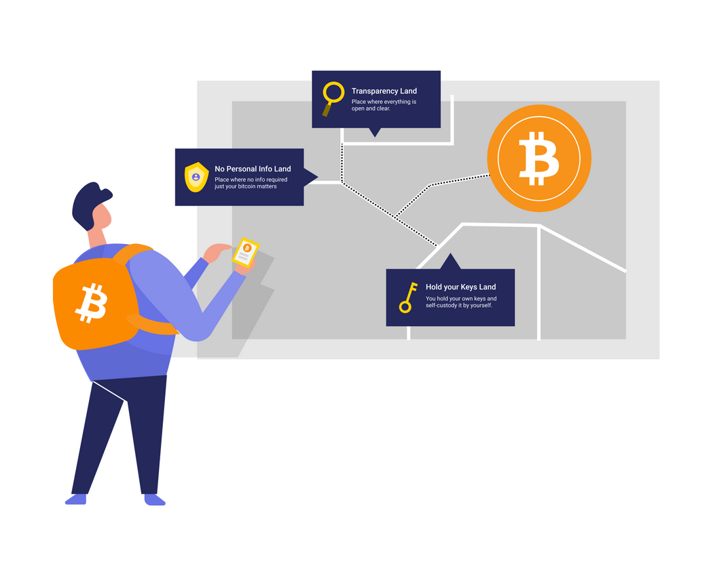
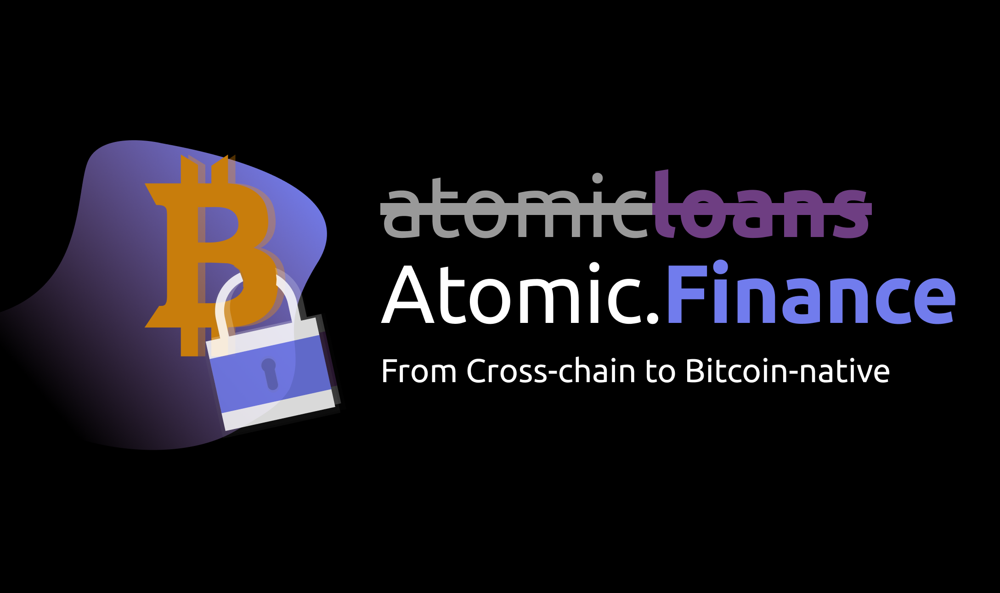
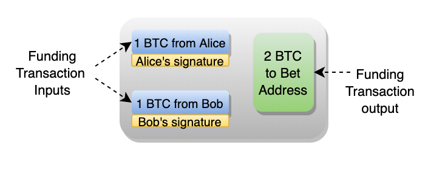
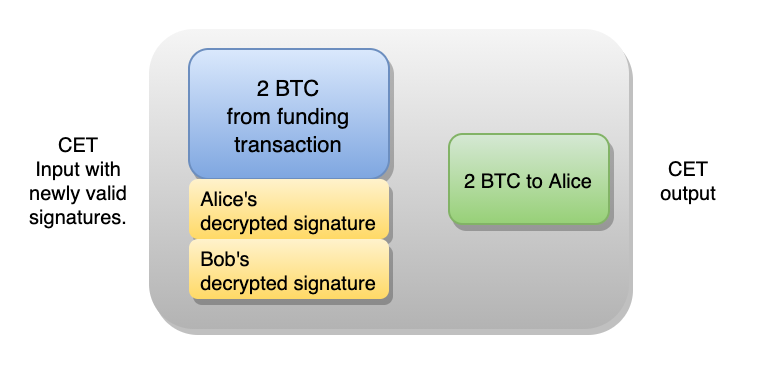

> *作者：Craig Warmke*
> 
> *来源：<https://atomic.finance/blog/a-laypersons-guide-to-discreet-log-contracts-atomic-yield-series-part-3/>*

## I. 引言

有一段时间，比特币原生的去中心化金融一度看起来是不可能的。比特币的账本缺乏容纳大量复杂金融合约的空间。而且其简单的编程语言 —— 本身是为安全性而设计的 —— 缺乏在一笔交易中编码复杂金融合约的能力。

所以，比特币的持有者必须在其它地方寻找利息，并且在原则上妥协。比特币的银行既掌控着你的私钥，又掌控着你的私人信息。而汇入其它网络（比如以太坊）的 “封装的” 比特币在幕后常常有比特币银行，在智能合约风险之上又加了一层对手方风险。此外，这些服务常常加入新的山寨币来美化收益率。在 2017 年，比特币的持币人似乎只能通过牺牲自己的自我主权、隐私和安全性 —— 比特币理念的核心原则 —— 来获得利息。

但是，Thaddeus (Tadge) Dryja 发表了一篇论书谨慎日志合约（DLC）的白皮书 <a href="#note1" id="jump-1">1</a>。这份白皮书概述了一种链上足迹最小化、与比特币的简单编程语言兼容的比特币原生智能合约。最重要的是，DLC 允许用户保留自己的私钥以及他们的金融主权。

在 2020 年末，Atomic.Finance 看到了 DLC 的潜能，从一家以太坊 DeFi 公司[转变](https://atomic.finance/blog/an-atomic-pivot/)成了一个只经营比特币、使用 DLC 来做比特币原生业务的公司。通过将金融合约编码为 DLC，我们将[在健全金融与健全货币之间架起桥梁](https://atomic.finance/blog/a-sound-finance-manifesto/)。

DLC 既新颖，又复杂。因为我们希望用户在使用我们的产品之前先理解它们，所以我们写了这个三部曲，来解释为什么你可以无需托管而赚到比特币收益。[Part 1](https://atomic.finance/blog/atomic-yield/) 提供了一个鸟瞰式的概览。[Part 2](https://atomic.finance/blog/bitcoin-covered-calls/) 解释了比特币担保看涨期权（bitcoin covered calls）的最重要的特性。这篇文章作为 Part 3，将向感兴趣而没有技术背景的人解释 DLC 的工作原理。你不需要数学上的背景知识。只需一些耐心和毅力就可获得回报。

- Atomic.Finance 在 2020 年末转向只开发比特币产品并只用比特币原生的技术 -

## II. 朝向 DLC 之路

假设 Alice 和 Bob 想跟对方用比特币来打赌某次选举的结果。他们有许多办法可以实现。

他们可以在链下打赌。但是，赢家必须相信输家会愿赌服输。这其实不太理想，因为一些输家不会履行自己的承诺。

又或者，他们可以用一个 2-of-2 的多签名合约来打赌。这就是说，Alice 和 Bob 可以发起一条交易将奖金锁在一个托管合约中，而解锁这些奖金就需要发起另一笔交易，需要双方都使用自己的私钥来签名这笔解锁交易。但这可能比上面那种方法更糟，因为当输家拒绝配合的时候，赢家什么也拿不到 —— 甚至一开始当奖金锁进去的那部分也要赔掉。

或者他们可以用一个 2-of-3 的多签名合约来打赌。这就是说，Alice 和 Bob 使用一条交易把奖金锁到一个托管合约内，此外还有一个第三方，三方中只有要两方的签名就可以花费托管合约中的奖金。Alice 和 Bob 可以选择一个双方都信任的第三方在输家拒绝合作的情形中介入。不过，因为要签名，这个第三方将知道合约的内容。所以不止 Alice 和 Bob 将失去隐私，第三方也可以跟输家勾结从而拿走奖金。

此外，Alice 和 Bob 还可以使用像以太坊这样的网络，将他们的比特币封装，并请求一个第三方的帮助。这个第三方（作为断言机）将把选举的结果输入到区块链以及相关合约的函数中。在这个案例中，这个断言机将是自动化的。Alice 和 Bob 可以将对赌合约编码成一笔交易来调用这个断言机。然后，当这个自动化的断言机提供结构的时候，这个合约将执行奖金支付。信息密集型合约会很快堵塞掉区块链，导致高昂的交易费和更少的隐私。这种金融偷窥行为也让 MEV（矿工可抽取的价值）成为可能 —— 也即一些人利用自己在网络中的位置[抢跑和敲诈用户](https://www.coindesk.com/ethereum-mev-frontrunning-solutions)可以获得利润 <a href="#note2" id="jump-2">2</a>。

Alice 和 Bob 应该使用 DLC。

## III. 如何使用 DLC 来打赌

DLC 帮助解决了我们在上面遇到的一系列问题。它同时保护了用户的隐私、减少了用户在链上的足迹，也有助于防止 MEV（利用信息密集型的智能合约交互可获得的价值）。而且它还不需要第三方托管资金。听起来好像不可思议。DLC 确实涉及一些复杂的数学，但它的原理是很简单的。

首先，打赌的双方不会把完整的复杂智能合约作为单笔交易发送到链上（像以太坊上的方案那样），而是会将一个合约的逻辑分解成多笔更小的交易，只有少量交易需要在链上曝光。

其次，这个合约会调用一个或多个断言机，并激励他们诚实行事，帮助保证合约的成功执行。

DLC 可分成三个主要步骤。我们会以 Alice 和 Bob 之间赌约为例，讲解这三个步骤。它很像 Atomic [已经在运行](https://mobile.twitter.com/AtomicFinance/status/1321181338112851975)的打赌服务。

### 步骤 1. 为合约提供资金

Alice 和 Bob 都出资 1 BTC。赢家会拿回自己的 1 BTC 和输家的 1 BTC。

为了给赌约出资，Alice 和 Bob 一起构造一笔交易，锁定他们的总计 2 BTC 到一个新的地址。他们两人都用自己的私钥签名这笔交易并提交这笔交易到比特币账本。这就是所谓的 “充值交易”。

- 图 1. Alice 和 Bob 的充值交易 -

这个新地址跟他们 *两人* 的私钥相关联。Alice 和 Bob 两人都用自己的私钥签名的交易，才能解锁这 2 BTC。所以，这笔充值交易实际上声成了一个 2-of-2 的多签名合约。

一旦这笔交易出现在比特币的账本上（上链了），资金就被 Alice 和 Bob 的联合托管合约锁定了。

### 步骤 2. 编写合约

智能合约实际上就是一套逻辑，用来判定哪种情况将如何处理。在以太坊区块链上，一个金融合约的全部逻辑都放在一笔交易中（译者注：此言仅在一个合约部署时才为真。而当一个合约部署之后，它可被重复调用，而调用这个合约的交易将不再包含逻辑，只涉及调用这些逻辑所需的数据）。但 DLC 是将逻辑切分成多笔交易，也就是所谓的 “合约执行交易（CET）”。粗糙地来说，合约的每一种可能的结果都有自己的 CET。在 Alice 和 Bob 的赌约中，每一笔 CET 都是花费锁定在他们的充值交易的输出中的 2 BTC，但这些 CET 中只有一笔会在赌约产生结果时被发送上链。

我们来详细了解下 Alice 和 Bob 的 CET。假设 Alice 和 Bob 打赌 Dorian 是否会赢得选举，Alice 赌他会赢，而 Bob 赌他会输，那么，在选举之前，Alice 和 Bob 需要构造 4 笔 CET：

- 一笔表示 Dorian 胜出，发送 2 BTC 给 Alice
- 一笔表示 Dorian 落败，发送 2 BTC 给 Bob
- 一笔表示 Dorian 平局，给 Alice 和 Bob 各返还 1 BTC
- 一笔是为其它不可能发生的情形准备的，也是给 Alice 和 Bob 返还资金

此时，你可能会产生两个关于 CET 的质疑。

**作弊**。Alice 和 Bob 在选举之前就已经签名了，那什么措施能阻止他们其中一人在选举揭晓之前就拿走那 2 BTC 呢？

**真相**。 Alice 和 Bob 怎么保证选举的结果会导致正确的资金分配？

这两个质疑有同一个解决方案 —— 断言机。

在这个点上我们要保留悬念，因为我们需要先绕开断言机制。不过，如果你愿意继续跟着我，你很快会深入理解 DLC 到底是如何工作的。

## IV. 有关断言机的插曲

Alice 和 Bob 需要一个他们都信任的断言机来播报选举的结果。所以，他们咨询了 [Suredbits Oracle 浏览器](https://suredbits.com/release-of-suredbits-oracle-explorer-and-krystal-bull/)。他们一致同意使用一个声誉良好的断言机，而该第三方已经在社交媒体上公开承诺会发布选举的结果。最重要的是，这个第三方不需要知道自己被选用了。

断言机的公开承诺包含两部分重要信息：

其一，这个承诺说明了在每个结果下，他会播报什么信息：

- 如果 Dorian 赢了，他会播报 “Dorian_wins”
- 如果 Dorian 输了，他会播报 “Dorian_loses”
- 如果平局，他会播报 “Dorian_ties”

其二，这个公开承诺包含了一段不完全从这个断言机的私钥中推导出来的密码学数据。

这段数据与上面的三条消息一一配对。为便于观察，我们将它们称为 “加密器”。

- “Dorian_wins” 加密器
- “Dorian_loses” 加密器
- “Dorian_ties” 加密器

管它们叫加密器，因为这就是它们的用途 —— 它们是用来加密的。有了它们之后，上面关于作弊和真相的质疑就解决了。最难的部分快要讲完了，不要掉队呀。

- 德尔斐神谕（The Oracle of Deiphi），John Collier 作于 1891 年 -

### 断言机（oracle）如何解决作弊问题

Alice 和 Bob 在打赌结果揭晓前构造了 CET。他们用自己的私钥签名了 CET 并等待选举结果揭晓、把正确的 CET 发送上链、分配奖金。但是，如何阻止对方提前提交交易，给自己奖励 2 BTC 呢？

这就是加密器的用场。Alice 和 Bob 构造为 Alice 支付 2 BTC 的 CET 的时候，Bob 用自己的私钥签了名。此时，只要 Bob 的签名是有效的，只要  Alice 收到了 Bob 对该笔 CET 的有效签名，她就可以用自己的私钥签名并广播该 CET、欺骗 Bob。为了防止 Alice 欺诈，Bob 使用 “Dorian_wins” 加密器加密了自己的签名。这使得他交给 Alice 的数据并非这笔 CET 的有效签名。结果是，Alice *无法* 过早地拿走 2 BTC。

但这样做还没完，Alice 也用“Dorian_wins”加密器加密自己的签名。他们都使用这个加密器，因为这笔 CET 是给打赌 Dorian 胜出的 Alice 奖励。我们很快会解释这些操作的重要性。现在，这笔经过双方 “签名” 的 CET 还在链下 —— 并且还是无效的（因为还未获得有效签名）。

在构造给 Bob 奖励 2 BTC 的 CET 时，他们重复这个过程，不过这一次，他们用的是 “Dorian_loses” 加密器。

最后，在给双方返还 1 BTC 的 CET 中，他们再次重复这个流程，只不过要使用 “Dorian_ties”加密器。

因为这些 CET 都不具备有效的签名，所以无论 Alice 还是 Bob 都不能将这些 CET 发送到比特币网络中触发支付。不过，在断言机宣布结果之后，其中一笔交易将变成有效的交易。这就是断言机解决真相问题的方式。

### 断言机如何解决真相问题

在选举之后，断言机使用自己的私钥产生对 “Dorian_wins”、“Dorian_loses” 或 “Dorian_ties” 的一个签名并发布。无论是哪一条，都将解密对应于宣告结果的 CET 的签名。所以我们可以将这些可能出现的公告称作 “解密器”：

- “Dorian_wins”解密器将揭示 “Dorian_wins” 加密器所隐藏的有效签名
- “Dorian_loses”解密器将揭示 “Dorian_loses” 加密器所隐藏的有效签名
- “Dorian_ties”解密器将揭示 “Dorian_ties” 加密器所隐藏的有效签名

Alice 和 Bob 是没法提前知道这其中任何一个解密器的形态的。然而一旦断言机发布了一个，赢家就可以将相应一笔 CET 的签名从无效转为有效，交易也能上链了。

这个设计怎么解决真相问题呢？只要断言机正确地播报了结果，就只有一笔 CET 可以变成有效的、可以上链的交易。

好了，最难的部分已经讲完了。如果你已经读到这里，那下文应该很容易了。

## V. 支付和收益

假设 Dorian 赢得了选举，Alice 赢了这场赌约。那还剩下最后一步需要做。

### 执行合约

断言机宣布结果并提供相应的解密器。Alice 于是解密了自己和 Bob的签名，使得这笔给自己发放 2 BTC 的 CET 成为有效的交易。

- 图 2. 合约执行交易，以刚解密的签名为输入 -

她将这个刚刚才变成有效交易的 CET 发布到网络中。很快，账本会显示她收到了来自一开始那笔充值交易中的 2 BTC。

我们来回顾一些值得注意的点。

- 在选举结束后，Alice 不需要 Bob 配合取款。Bob 已经签名了 CET，并且是可以验证的。
- 其它 CET 仍然是无效的，也永远不会出现在链上。这就减少了链上的足迹，对那些更复杂的、可能有几千个结果的合约尤其有用。
- 关于用户资金的状态，比特币的账本向 Alice 和 Bob 这样的用户提供了完全的透明性 —— 以及内在的平静。
- DLC 同时保障了用户的高度隐私，不受链上活动监视者的刺探。在账本上，一个 DLC 跟任何其它的 2-of-2 多签名交易没有任何区别。矿工和链上活动分析师都看不到合约的内部逻辑，而只能看到那个结果。所以，让以太坊上的 MEV 成为可能的金融刺探在比特币的 DLC 世界里是不可能的。
- DLC 让用户可以保留自己的私钥。不需要用到第三方的托管服务。

幸运的是，你不需要听信我的话。Atomic.Finance 对透明性看得很重，我们很高兴地报告，我们使用开源的 DLC 协议。实际上，我们鼓励您在能力范围内测试[这个协议](https://github.com/discreetlogcontracts/dlcspecs)。

不过，风险依然存在，而且 DLC 的断言机有独特的风险。我们来看看。

## VI. 断言机风险

DLC 依赖断言机向比特币网络报告现实世界的事件。作为一个受信任的第三方，它们看起来是安全漏洞。那么这个漏洞有多大呢？

有关断言机的风险，值得专门写一篇文章。对这些风险的调查，我推荐[这篇来自 Suredbits 的文章](https://suredbits.com/dlc-oracle-failure-cases/)。但我们会简要介绍其主要问题。

除了依赖单个断言机来播报事实，DLC 也可以调用多个断言机，使得合约仅在一定数量的断言机播报相同结果时才能执行。这会极大地关键依赖于单个断言机的风险，毕竟，断言机可能错误播报、播报多个结果或者不播报。

我们这个 DLC 协议也会在断言机不播报或者数量太少以至于无法触发合约支付时返回资金给参与者。

断言机也被激励去[播报事实](https://medium.com/interdax/discreet-log-contracts-smart-contracts-for-bitcoin-d75f22d25dac)。最起码，出错会导致声誉的重大损失。而因为一些人可能希望利用自己的声誉来开展成功的断言机业务，声誉的损失就是未来盈利能力的损失。此外，如果断言机对单个事件播报了多个结果，他们也会泄露自己的私钥。为了获得用户的信任，一个断言机需要用这个私钥来持有资金。这就是他们有利益相关的信号，也是可以验证的。用户将知道，播报多个结果将立即沉重地惩罚这个断言机。

不像其它智能合约网络上的自动化断言机，DLC 世界的断言机不需要知道自己参与到了某个 DLC 中。用户只需使用断言机公开播报的信息即可。所以，虽然一个断言机 *可能* 知道他们在服务某一个 DLC（例如，通过成为 DLC 中的一方），但没有哪个断言机可以 *确定*  自己在服务的所有 DLC。因此，错误播报的影响是不可估量的。因此，所有断言机都知道，耍滑头是得不偿失的。

## VII. 结论

DLC 可以编码简单打赌以外的金融合约。Atomic.Finance 提供期权合约，包括像担保期权这样可以让用户用自己持有的比特币赚取收益的的合约。这些合约更加复杂，但其本质与 Alice 和 Bob 的打赌差不多。

我们相信，随着健全金融（Sound Finance）运动成长和成熟，DLC 会变得日益重要，就像闪电网络在支付中变得日益重要一样。这些开发工作会以激动人心和意料之外的方式不断交互和复合。未来是光明的。是鲜明的橙色。（译者注：橙色是比特币 Logo 的颜色。）

（完）

1.Thaddeus Dryja (2017), "[Discreet Log Contracts.](https://adiabat.github.io/dlc.pdf)"<a href="#jump-1">↩</a>

2.Daian et al. (2019), "[Flash Boys 2.0: Frontrunning, Transaction Reordering, and Consensus Instability in Decentralized Exchanges.](https://arxiv.org/abs/1904.05234)"<a href="#jump-2">↩</a>