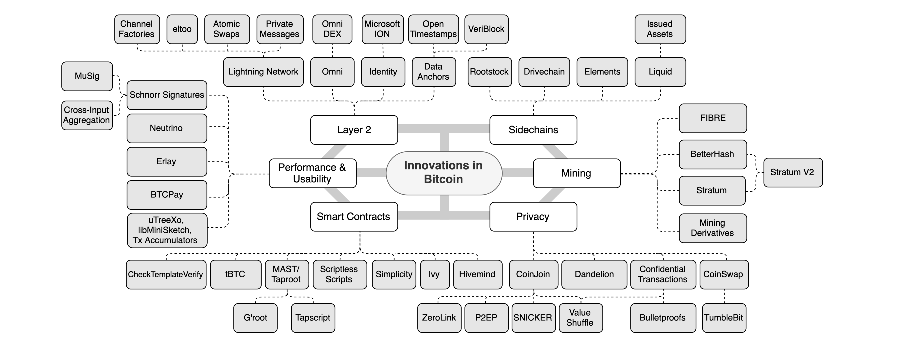
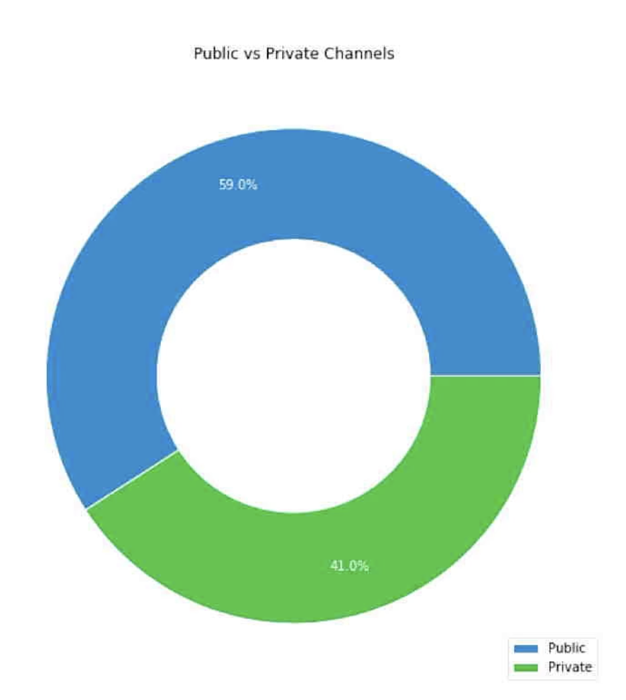
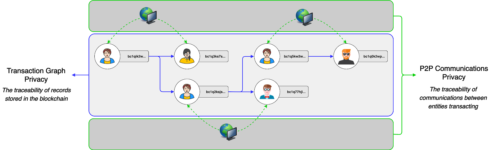

> *作者：Lucas Nuzzi*
>
> *来源：<https://medium.com/digitalassetresearch/a-look-at-innovation-in-bitcoins-technology-stack-7edf877eab14>*
>
> *原文首发于 2019 年 12 月 3 日。*



过去十多年来，比特币已经取得了长足的进步。相比第一版比特币软件，当前比特币实现的质量和可靠性都有了显著提高。比特币能够迅速吸引大批开发者通力合作，投入数千小时来改进甚至修改其底层代码库。

尽管如此，比特币并没有改变其本质。比特币通过一套类似宪法的核心共识规则定义了其货币属性，例如，基于算法的增发机制和硬性供应上限。这套规则从未改变过。各种团体一次又一次地试图改变这些核心属性。但是，迄今为止，所有妄图控制比特币的黑暗势力无一例外全都[失败](https://medium.com/digitalassetresearch/the-resolution-of-the-big-block-experiment-e1df3e38d03f)了。通常情况下，这是一个很痛苦的过程，但是它突出并巩固了比特币的两大优点：

1. **没有任何一方可以单方面决定比特币会如何发展。**
2. **由于没有中心化控制，比特币的货币属性得到了保护。**

有趣的是，正是这些共识规则让比特币得到了密码朋克和投资机构的青睐，将比特币打造成了一种前所未有的货币。然而，也正是这些规则使得在比特币上开发软件比在其它数字资产上更具挑战性。从本质上来说，为了让开发者也无法侵犯比特币的货币政策，“宪法” 给予开发者的是一套非常局限的工具包。阻碍重重，使人 无法 “快速行动、破旧立新”。

这意味着，围绕比特币的创新需要创造力、耐心，以及最重要的一点，自我最小化。毕竟，比特币 “宪法” 中的基本规则最终会取代技术。这就是为什么硅谷费了很大功夫才理解了比特币的价值主张。比特币不只是一种技术、金融工具、消费者应用，而是一个由技术支撑的[完整货币系统](https://medium.com/@nic__carter/a-most-peaceful-revolution-8b63b64c203e)。改变比特币 “宪法” 的流程无异于政治流程，可能会侵害比特币的货币属性。因此，技术创新是作为模块实现的。

就像我们常说的那样，比特币的模块化创新方式类似于互联网协议套件的演化：不同的协议层负责特定的功能。例如，邮件由 SMTP 处理、文件由 FTP 处理、网页由 HTTP 处理、用户寻址由 IP 处理、包路由由 TCP 处理。每个协议都经过了长年累月的发展，才有了我们这一刻的网上冲浪体验。

[Spencer Bogart](https://twitter.com/CremeDeLaCrypto) 写过一篇关于[新兴比特币技术栈](https://medium.com/blockchain-capital-blog/lightning-is-only-the-beginning-the-emerging-bitcoin-stack-fb6d4aefb664)的文章。在这篇文章中，[Bogart](https://twitter.com/CremeDeLaCrypto) 指出**比特币即将拥有自己的协议套件**。事实证明，由于比特币的核心协议层缺乏灵活性，一些专门用来实现各类应用的附加协议应运而生，例如，闪电网络针对支付通道的 BOLT 标准。创新既充满活力，又（相对）安全，因为这一模块化的方法最大程度上降低了系统性货币风险。

比特币技术栈上的很多协议层都发生了巨大的变化。追踪新兴解决方案可能会变得异常困难。下图囊括了所有新型应用，展示了较为完整的比特币技术栈全景。下图并非详尽无疑，也没有在为特定应用背书。然而，比特币创新活动从 Layer 2 技术到新兴智能合约解决方案等各个方面全面开花的景象令人叹为观止：



## Layer 2

最近，闪电网络的采用率引起了人们的热议。闪电网络是比特币上知名度最高的 Layer 2 技术。黑粉经常会拿闪电网络中的支付通道数量和比特币锁仓量说事，因为这是衡量用户采用率的两大常见指标。虽然这两个指标已经得到了比特币社区的广泛认可，但这里要强调的一点是，鉴于闪电网络的运作方式，这些指标本质上是有缺陷的。

闪电网络最被低估的优点就是其最显而易见的隐私性。由于闪电网络无需对所有状态变化进行全局验证（即无需拥有闪电网络自己的区块链），用户可以使用其它技术和网络覆盖层（如 Tor 洋葱协议）进行隐私交易。这时，我们可以通过分析链上通道开启交易的数量并将其与链下公开通道的数量进行对比，估算出闪电网络在隐私交易方面的使用率。**据** [**Christian Decker**](https://twitter.com/Snyke) **估计，闪电网络上有 41% 的通道是私密的**：

- 来源: <a href='https://miro.medium.com/max/1400/0*PRk2VlEmBIPNiPpS'>Christian Decker</a> -

主流闪电网络浏览器不会捕获这些通道内发生的活动。因此，**闪电网络在隐私交易方面的使用率越高，可用于衡量其用户采用率的公开数据就越少**，致使观察者误判闪电网络的采用率很低。虽然闪电网络在被广泛采用之前确实需要克服可用性障碍，但是我们必须停止使用误导性指标来对闪电网络的现状下定论。正如 Decker 在柏林举办的闪电网络大会上所言，即使是对比（上文所说的）私密/公共通道的数量来估算闪电网络的采用率也是不严谨的，因为使用 Schnorr 签名将使通道开启交易与普通交易变得难以区分。

在 Layer 2 隐私性方面，另一个有趣的成果是 [WhatSat](https://github.com/joostjager/whatsat)。[WhatSat](https://github.com/joostjager/whatsat) 是在闪电网络上构建的私密消息传递系统，在 Lightning Deamon（LND）的基础上进行了改进，通过小额付款奖励在不同实体之间传递私密消息的中继者。这种能够抵御审查和垃圾邮件的去中心化通信系统是基于对 LND 的创新而实现的，例如，闪电网络自己的洋葱路由协议 [lightning-onion](https://github.com/lightningnetwork/lightning-onion) 上的改进。

从 [*Lapps*](https://www.lapps.co/all-time)（Lightning Applications）的[发展](https://www.lapps.co/all-time)可以看出，从由闪电网络支持的[云计算 VPS ](https://bitclouds.sh/?utm_source=lapps&utm_medium=referral&utm_campaign=site)到利用小额交易实现广告收入共享的[图像托管服务](https://www.lapps.co/apps/lightning-hosted)，凡是涉及消费者应用的创新都具有广泛的适用性。这些还只是闪电网络内的 Layer 2 创新。一般来说，我们将 Layer 2 定义为一套将比特币底层作为 “法院” 来调解外部事件并解决纠纷的应用。因此，在比特币区块链上，*数据锚定（**data anchoring**）* 的辐射面广泛得多，例如，微软在比特币上首创了去中心化 ID 系统。这类举措增加了链上调解的需求，有利于比特币费用市场的长期发展。

## 智能合约

还有很多项目尝试以安全可靠的方式让富有表达力的智能合约功能重新回归比特币。这是一个重大进展，因为一些原始比特币操作码（决定比特币能够计算什么的操作）从 2010 年开始就已经从比特币协议中移除了。这是在一系列可怕的漏洞被发现后采取的措施，以至于中本聪亲自禁用了比特币编程语言 Script 的部分功能。

多年以来，显而易见的是，富有表达力的智能合约功能会带来不小的安全风险。一条常见的经验法则是，虚拟机（处理操作码的集体验证机制）引入的功能越多，程序的不可预测性就越强。所幸我们已经看到一些针对比特币的新型智能合约架构，既能从最大程度上降低不可预测性，又能提供丰富的功能。

一种叫作默克尔抽象语法树（[Merkleized Abstract Syntax Trees，MAST](https://bitcointechtalk.com/what-is-a-bitcoin-merklized-abstract-syntax-tree-mast-33fdf2da5e2f)）的新型比特币智能合约设计将人们的注意力吸引到了优化安全性和功能性之间权衡关系的技术上。[Taproot](https://bitcoinmagazine.com/articles/taproot-coming-what-it-and-how-it-will-benefit-bitcoin) 是这一众技术中的佼佼者，其优雅的 MAST 结构实现可以将一个完整的应用表达成一个[默克尔树](https://en.wikipedia.org/wiki/Merkle_tree)。这个默克尔树上的每个分支都代表不同的执行结果。Taproot 将引入一种叫作 Tapscript 的编程语言，可以用来更轻松地表达与默克尔树的每个分支相关的花费条件。

另一个有趣的创新是一种可以实现比特币交易 契约（covenant）/花费条件 的新型架构。Greg Maxwell [在 2013 年](https://bitcointalk.org/index.php?topic=278122.0)首次提出了这一构想，即，通过契约来限制余额的花费方式，即使余额发生了转移。这一构想虽然已经提出了 7 年之久，但是直到 Taproot 出现为止都是不切实际的。目前，新的操作码 [OP_CHECKTEMPLATEVERIFY](https://github.com/JeremyRubin/bips/blob/ctv/bip-ctv.mediawiki)（之前叫作 OP_SECURETHEBAG）正在利用 Taproot 技术，使得契约可以在比特币上安全地实现。

乍看之下，契约非常适用于借贷（以及基于比特币的衍生品）场景，因为它们可以用来创建[回收款](https://en.wikipedia.org/wiki/Clawback)之类的政策并将其附加到特定的比特币余额上。但是，契约对比特币可用性的潜在影响远远超出了借贷场景。契约还可以促成其它很多实现，例如比特币金库（[Bitcoin Vault](http://hackingdistributed.com/2016/02/26/how-to-implement-secure-bitcoin-vaults/)）。在托管场景下，比特币金库可以提供第二把私钥，让遭遇黑客攻击的用户 “冻结” 被盗走的资金。契约还有其它很多应用场景，如[非交互式支付通道（Non-Interactive Payment Channels）](https://github.com/JeremyRubin/bips/blob/ctv/bip-ctv.mediawiki#non-interactive-channels)、[阻塞控制交易（Congestion Controlled Transaction）](https://github.com/JeremyRubin/bips/blob/ctv/bip-ctv.mediawiki#non-interactive-channels)和 [CoinJoins](https://github.com/JeremyRubin/bips/blob/ctv/bip-ctv.mediawiki#non-interactive-channels) 等（这些内容需要另外写一篇专题文章，本文不便展开详述）。如果你想了解更多信息，可以阅读 [Jeremy Rubin 的 BIP](https://github.com/JeremyRubin/bips/blob/op-checkoutputshashverify/bip-coshv.mediawiki#Abstract) 初稿。

要注意的是，[Schnorr 签名](https://medium.com/digitalassetresearch/schnorr-signatures-the-inevitability-of-privacy-in-bitcoin-b2f45a1f7287)是可以让上述新型设计在智能合约上实现的技术原语。等到 Schnorr 启用后，更加前沿的技术也有了探讨的基础，比如无脚本脚本（[Scriptless Script](https://joinmarket.me/blog/blog/flipping-the-scriptless-script-on-schnorr/)），它使得具备完全私密性和可扩展性的比特币智能合约可以表示为数字签名（而非操作码）。[Discreet Log Contract](https://adiabat.github.io/dlc.pdf) 同样用到了将智能合约的执行结果表示为数字签名的构想，从而增强隐私性和可扩展性。总而言之，这些设计使得在比特币上构建新型智能合约应用成为可能，Schnorr 则是这一切的基础。

## 挖矿

挖矿协议方面也已取得了一些有趣的进展，尤其是矿池内部的成员矿工采用的挖矿协议。尽管比特币挖矿的中心化问题经常被过分夸大，但是矿池运营方内部的权力结构确实可以进一步去中心化。具体来说，矿池运营者可以决定所有成员矿工挖哪些交易，这就赋予了他们巨大的权力。久而久之，一些运营方会滥用这一权力，在未经矿工授权的情况下审查交易、挖空块、将哈希输出重新分配给其它网络。

值得庆幸的是，一些技术正在努力颠覆这一权力结构，例如，Stratum 2.0 将给比特币挖矿带来实质性的改变。Stratum 是比特币矿池最常采用的挖矿协议，其[ 2.0 版本](https://bitcoinmagazine.com/articles/with-stratum-v2-braiins-plans-big-overhaul-in-pooled-bitcoin-mining)彻底改变了原有的挖矿机制，以实现另一种协议 [BetterHash](https://medium.com/hackernoon/betterhash-decentralizing-bitcoin-mining-with-new-hashing-protocols-291de178e3e0)，让成员矿工而非矿池运营者决定将哪些交易打包进区块。Stratum 2.0 还实现了很多优化，以改善成员矿工之间的通信和协调。

在挖矿行业，另一个有助于提高稳定性的有趣进展是，[算力](https://powswap.com/)和[难度值](https://lists.linuxfoundation.org/pipermail/bitcoin-dev/2019-May/016952.html)衍生品再度翻红。对于想要对冲算力波动和难度值调整的挖矿活动来说，这些衍生品特别有用。尽管这些衍生品还没有实现产品化，但是这标志着比特币挖矿产业化正在发生有趣的演变。

## 隐私性

在我们发布关于 Schnorr 签名的报告之后，一些隐私币倡导者对比特币能在某些情况下实现充分的隐私性的结论感到震怒。虽然这一结论可能会挑战这些隐私币的长期价值定位，但确实有很多新兴协议可以提高比特币的隐私性。即使比特币的隐私性可能仍然更像一门艺术而非科学，这方面有很多有趣的创新不容小觑。

在我们深入探究某些关于隐私性的创新之前，需要强调的一点是，跨数字资产进行隐私交易的最大障碍是绝大多数解决方案都是不成熟的。如果某个隐私资产聚焦于交易层面的隐私性，往往会忽视网络层面的隐私性，反之亦然。这两个层面在成熟度和使用率上都不够高，使得交易更容易通过对点对点网络层或区块链层的统计可追溯性分析实现去匿名化。

幸好有几个项目正在致力于提高交易层面和网络层面的隐私性。

就交易层面的隐私性而言，P2EP 和 CheckTemplateVerify 之类的解决方案很有意思，因为它们**将隐私性变成了效率的副产品**。作为应用于 [CoinJoin](https://en.bitcoin.it/wiki/CoinJoin) 的新型设计，这些解决方案利用较低的交易费来吸引更多用户使用隐私交易。虽然 CoinJoin 模型提供的隐私保证依然不够理想，但是支付金额可见的优点在于保证了比特币供应量和自由流通量的可审计性。

如果较低的交易费成为一大驱动因素，并导致比特币匿名集合（CoinJoin 输出的 UTXO 的占比）扩大，通过聚类统计分析实现的去匿名化会变得比现在更加主观。一些区块链分析公司已经能够诱骗执法机构相信某个 UTXO 在多大概率上属于某个用户，但是其底层模型已经变得极其微妙和脆弱。如果绝大多数 UTXO 都变成了 CoinJoin 输出，现有的聚类分析方法有可能会被淘汰。

在此之前，我们需要完成大量工作来提高比特币的可用性，让所有比特币用户（无论是技术宅还是技术小白）都可以平等地使用隐私机制。除了 P2EP 和 CheckTemplateVerify，[SNICKER](https://joinmarket.me/blog/blog/snicker/)（使用可复用加密密钥的简单非交互式 CoinJoin）提案同样致力于提高比特币的可用性。集多项技术于一体的 SNICKER 开创了通过免信任方式生成 CoinJoin 的方法，使得用户在使用 CoinJoin 交易时无需信任其它对等节点或与之交互。

致力于提高点对点通信的隐私性和效率的协议也取得了令人瞩目的进展。2019 年，隐私保护网络协议 [Dandelion](https://github.com/gfanti/bips/blob/master/bip-dandelion.mediawiki) 已经在多个密码学网络上测试成功。虽然交易广播的私密化并非决定性的保隐私保护措施，但是就整个点对点通信领域而言，Dandelion 等协议可以通过隐藏广播交易的节点的原始 IP 地址来大幅提高用户的隐私性。

最后，比特币网络栈还有一个值得强调的成果是新型交易中继协议 [Erlay](https://arxiv.org/abs/1905.10518)。尽管仍处于发展初期，Erlay 是一项重要的创新举措，因为它可以大幅降低运行比特币全节点的带宽要求。一旦实现，Erlay 带来的效率提升可以让用户参与非常占用带宽的交易中继并持续验证区块链，尤其是在那些带宽上限受到互联网服务供应商限制的国家。

## 冰山一角

追踪所有关于比特币的创新是非常困难的，本文仅仅展现了冰山一角，目的是为了让大家明白：比特币整体上是一套持续发展的协议。本文介绍的模块化创新方法非常重要，可以在最大程度上降低比特币演化过程中的政治化倾向，并保护比特币的基本货币属性。如果你再听到有人妄言比特币固步自封，想想这篇文章就好。

## 联系我们

如果你想了解更多关于 DAR 的信息，[请点击此处](https://www.digitalassetresearch.com/request-info/)。如果你想订阅我们的免费区块链日报，欢迎[点击此处注册](https://www.digitalassetresearch.com/newsletters/)。

（完）