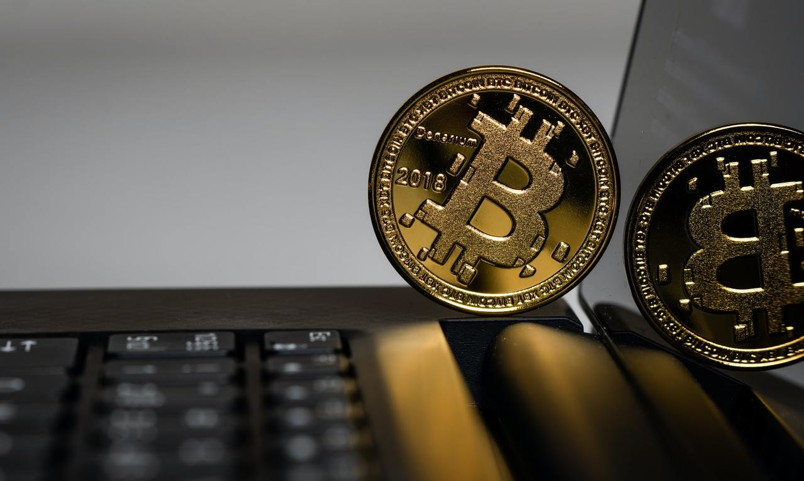
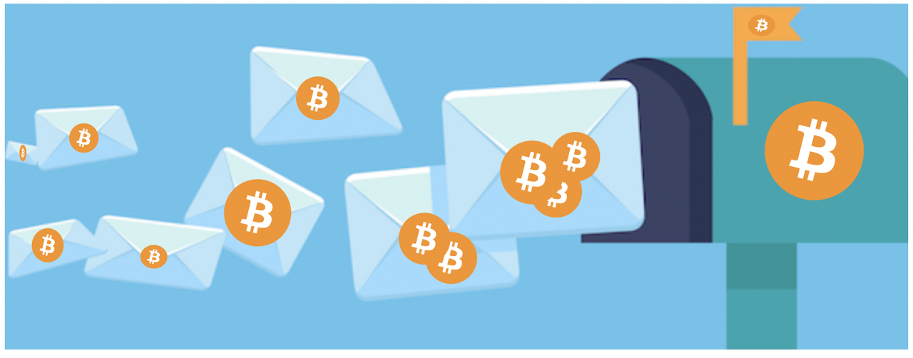
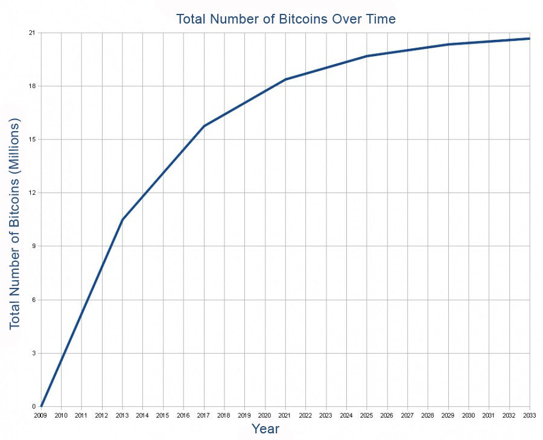
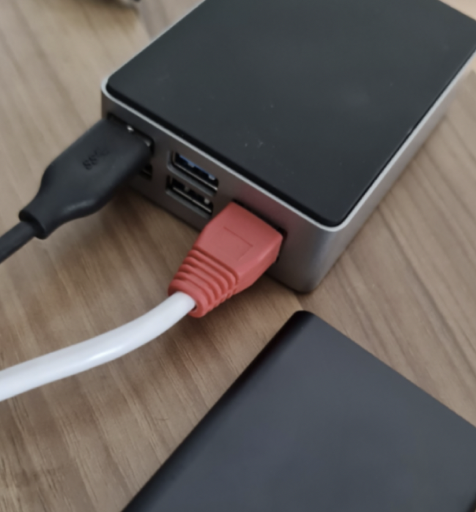
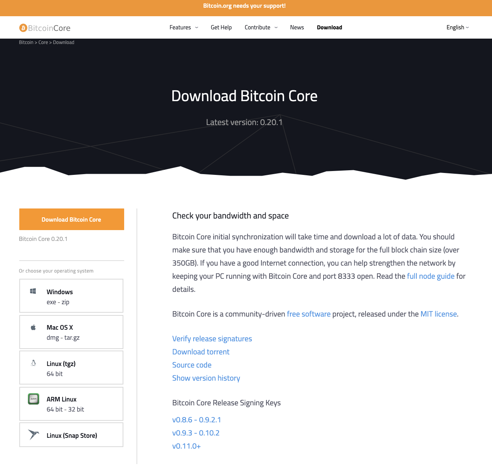
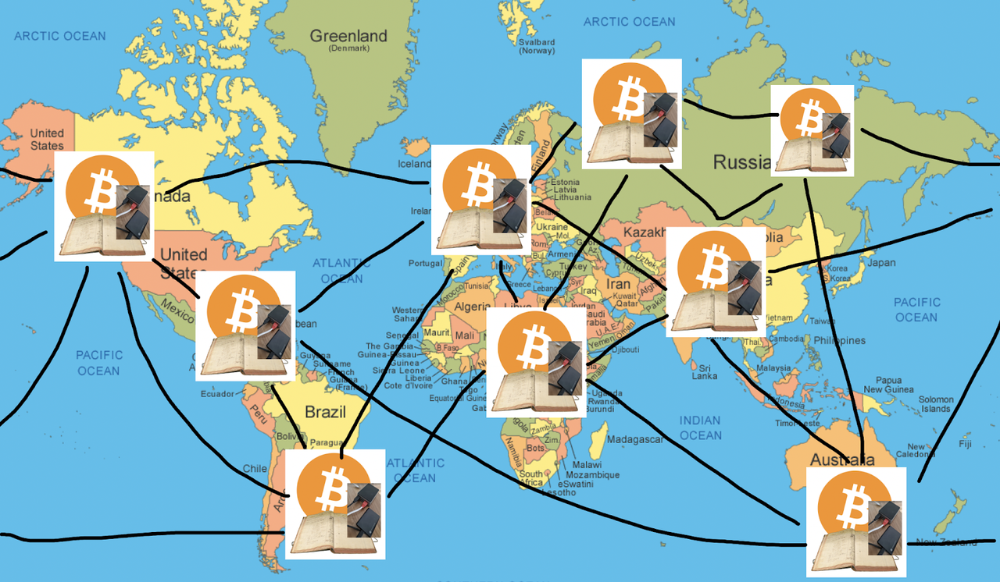
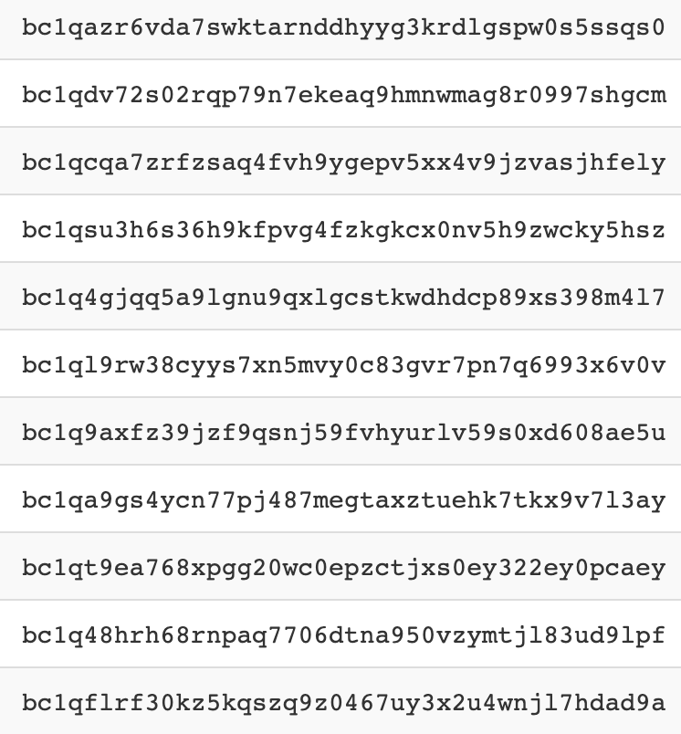
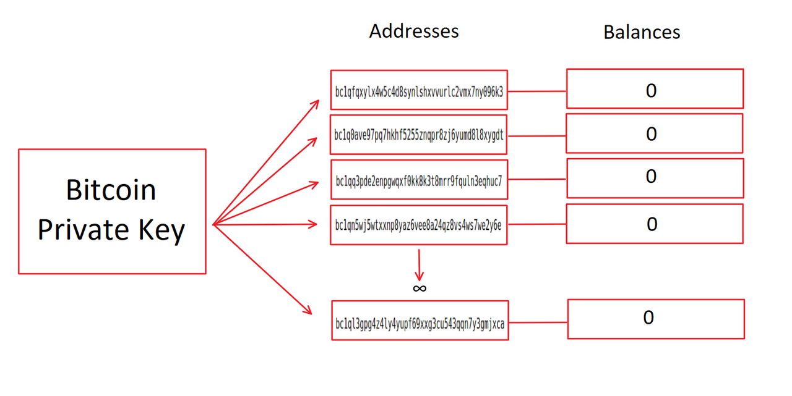
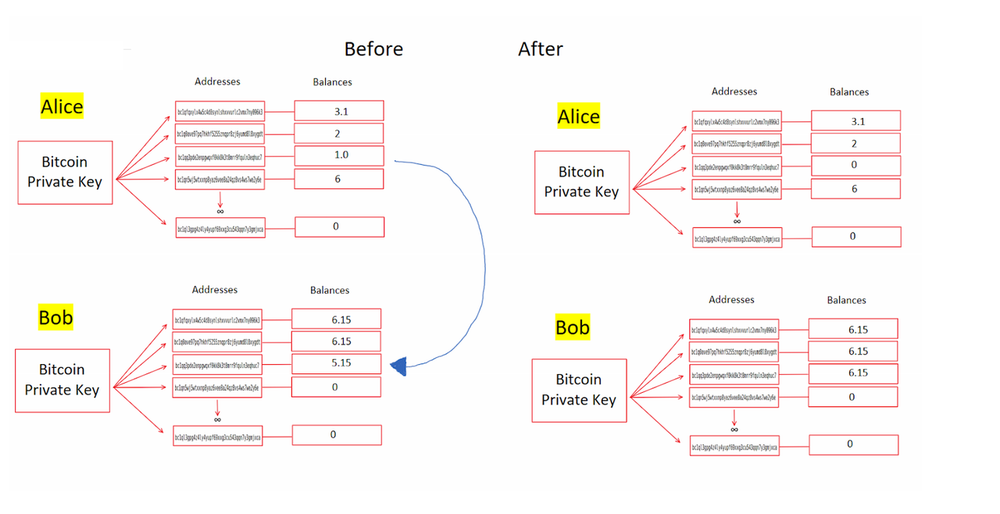

> *作者：Arman The Parman*
> 
> *来源：<https://journal.bitcoinreserve.com/a-not-too-technical-overview-of-this-bitcoin-thing/>*

## 引言

我刚知道比特币时，它只是一个符号，是一个我可以盯着屏幕来做多做空的标的。低点买入，高点卖出，钱钱到手，仅此而已。但实际上，比特币的内涵远不止如此。我那样对待这份人类所收获的奇迹般的礼物，是一种轻蔑。它值得更多的尊重。

在 2018 年的熊市中，在兴奋感随着利润一起消失以后，痛定思痛，我决定开始 “hold”，也就是 “囤币”。我知道没有耐心是做不到的。但我有的是时间。所以我决定学习更多比特币的内在。何其幸运！然后我就震惊了。自那时候开始，我一直在学习；我了解得越多，越明白了这一切都是有用意的，我的信念随之增长；我的投资也如此。

我常常问我自己：“我是不是盲目而轻信地选择了一条路？”投资的尽职调查要求我非常细致地寻找比特币的弱点。18 个月的搜寻中，我从没找到过一个令人满意的反对意见，我囤币之心几乎与日俱增。

在本系列中，我会先解释比特币是什么，它是怎么运行的。在后续的文章里，我会逐一检视这些反对意见以及我和其它人发现的风险。我也会把我发现的回应和洞见展现出来。

## 理解比特币很难

要想一上来就理解比特币并不容易。我认为，对那些刚接触到比特币的人，先解释比特币**是什么**（而不是它是**怎么工作**的）会更好。它可以做什么，它要解决什么问题，为什么这个问题很重要。等等。我们不应该太早开始探究它实际上是怎么工作的。没有这个必要，理解它的工作原理并不能让我们更理解比特币的神奇属性，也不能增添欣赏之心。

但就是这样，比特币也不容易解释。没有简洁的一段话可以囊括比特币所有的关键属性。简化的解释，在 *某种程度* 上都是误导人的解释。

部分原因在于，像比特币这样的东西在以前从未存在过，所以没有可以类比的事物。为了理解概念，人们会自然求助于类比；但类比也都是不准确的，可能导致错误的结论。比特币挑战了许多关于货币的成见（说它们是成见，因为它们是错的）。它也挑战许多人的世界观，自然会让人感觉不舒服。

另一个使它难以理解的原因是，它有许多不同且复杂的部分，每个部分都承载不同的功能，你只有每个部分都理解了，才能完全理解这个整体。对一些学科有个基础的了解，比如计算机科学、密码学、奥地利学派经济学、货币史、社交网络、博弈论、人类心理学和演化论，可以帮助你掌握这些复杂的部分。

## 具备稀缺性的数字

比特币本身只是一串数字。但它是具有稀缺性的数字。这是怎么做到的呢？直觉上，根本不可能存在具有稀缺性的数字对不对？

但比特币就是这样。有 2100 万个这样的 “东西”，每个都可以分割成非常小的部分（小数点之后 8 位）。也就是你所拥有的比特币可以细化到小数点后 8 位；最少你可以只持有 0.00000001 btc（再少就不行了）。比特币没有可触摸的物理形态，它们都只是特殊的数字而已。

表示这些数字的数据（比特）可以从一个地方转移到另一个地方，但这些数字本身 *无法同时属于两个人*。复制这些数据并不能增加比特币的数量。这就是特殊的地方。

如果我有 0.5 btc，然后都转给了你，我就什么也不剩下了。不像 email，即使我转发给了你，我可能还保留着一个备份。也许你可以把一定数量的比特币想象成一封独特的、可以辨别的电子邮件，里面写着一个数字，而这封邮件在任一时间都有明确的归属，且只有一个归属，不会有两个归属。

在比特币发明以前，没有任何虚拟物品有这样的属性。但是，如果没有这种属性，数字货币必须依赖权威协调者。

## 区块链

再来难一点的。比特币不仅仅是 *数字*，它还是一套电子化的 *账本*，账本上记录着数字。我们用小写 b 开头的 “bitcoin” 来称呼这些数字（也即作为货币单位的 btc），用大写 B 开头的 “Bitcoin” 来指称这个账本。这个账本也记载着这些 btc 所属的 *地址*。那么现在，你可以把这些地址想象成银行的账户了，是这些地址（账户）在 “持有” 比特币。

比特币区块链，或者说比特币账簿，记录着每个地址（账户）的余额，以及自比特币诞生以来所有比特币的每一次转移（也就是所有的 “交易”）。注意，是比特币诞生以来 *每一个账户的每一笔交易*。这是一个完全透明的货币系统。它不是公开的 *银行账户*，但它是一个透明的 *货币系统*。

注意，账本并不记录与这些地址相关的个人身份信息（所以它不是公开的银行账户），但所有权人的信息可以从地址的活动中推断出来一些来。因此，比特币并不先天具有隐私保护特性，不过，使用合理的方法可以提高你的账户隐私性。如果比特币变成完全隐私的，就没法审计这个货币系统的公正性了。

- 区块链就像一个银行的账本。它是个完整的货币系统的账本 -

平均来说，每 10 分钟，这个账本就会增加一 “*页*”，我们称为 “*区块*”，里面记录了一些交易。想象成一个有形的账本，每 10 分钟就增加一些交易的记录。加页的速度是有限制的，但账本会不断地变厚。

因为增加数据要靠区块，而每个区块都与前一个区块相连，所以这种账本叫 “区块链” —— 由不断增加的区块组成的前后相接的链条。

- 通过遍历比特币账本中包含的历史交易，每一个比特币都可以追溯到其起源。所有流转都被记录下来了。滴水不漏，真是会计梦寐以求的东西 -

区块链的设计目的不仅仅是按照正确的时间顺序排列数据 —— 它是为了让区块产生关联，使得对过往区块的任何更改都会让后续的区块无效化。这使得这个货币系统的历史能**曝光篡改**。后面我们会讲到，挖矿让这个系统能够**抗篡改**。

## 比特币的创造

比特币区块链诞生于 2009 年 1 月 3 日，是一个或一群化名 “中本聪” 的人启动的。没人知道他或她的真面目，TA 也在创造比特币不久之后销声匿迹。

在账本的第一页，也就是第一个区块，也是比特币诞生的那一刻，只有 50 个比特币被创造出来。这是啥意思？这意味着，这个账本的第一页里有一笔交易额为 50 btc 的交易  —— 就像你打开一本新的笔记本，写下第一句：“我有 50 美元”。

*先别急着问它是怎么无中生有的 —— 这个朴素的批评我们在本系列的后续文章中回答。*

每当比特币的账簿增加一页，就有 50 个新 “币” 被创造出来。在每一页上，除了增发这些币的记录，还有比特币转账的记录 —— 也就是上面说的 “交易”。

账本每增加 21 万页（或者说区块），比特币的创造速度就会减半；比如，从第 210001 页纸开始，就只有 25 btc（而不是 50 btc）被创造出来。而从区块 420001 开始，只有 12.5 btc 创造出来。到了 630001 区块（在历史上是 2020 年 5 月 12 日），每个区块都只会新创造 6.25 btc。这些事件被称作比特币的 “减半”（或者叫 “Halvenings” —— 有关这个术语，我们后面还有话要说）。

单个区块所增发的比特币会随着时间的推移而不断下降，大约在 2140 年，每个区块增发的比特币将降低到比特币的最小单位（o.ooooooo1 btc，称为 “1 聪”），也不再减半。这使得 btc 的数量有个上限：2100 万，不会有更多了。当前已经有 1850 万比特币被创造出来了。

## 节点：区块链可以复制，比特币无可伪造

重要的是，虽然比特币单位的数量在账本内是有严格控制的，也就是无法伪造（“复制”）的，但账本本身，也即比特币区块链，是 *可以* 复制的，而且事实上每时每刻都 *在* 复制，这对它抵抗攻击和意外停机的能力至关重要。

这个账本的副本（复制品）存在于全世界的数千台计算机里，且这些计算机都是相互连接到一个网络中、并且保持同步的。这些计算机我们叫 “节点”。

- 这是我自己的比特币节点，跟全世界其余几千个节点大差不差。这是一个树莓派（非常便宜而且低功耗的计算机），连着一个外置的硬盘。这个设备靠我的家庭网络连接互联网 -

任何人都能部署一个节点，加入这个网络。你只需要从 bitcoin.org 网站下载一个软件，叫 “Bitcoin Core”，运行起来后就能通过互联网与其它运行 Bitcoin Core 软件的计算机相互连接（这些都是自动化的，不需要你手动操作）。

- Bitcoin.org 的下载页面 -

Bitcoin Core 这个程序会与其它运行这个程序的计算机相互通信，来复制比特币区块链。软件本身维护着这些连接，以成为比特币网络的一部分。

新的节点与其它节点同步之后，就开始等待接收（“矿工” 生产的）新区块（其它节点也一样）。这些区块会在这个网络中传播，每一个接收到区块的节点都更新自己的数据。节点可以任意下线，也可以随时回来，只需把自己错过的区块再下载下来就好。

区块链的历史是不可更改的，它是对历史交易的永久记录，而且它在全世界有几千个副本。这也是为什么它无法被消灭。要消灭比特币，你要一个一个找出并摧毁所有的节点。因为这几乎是不可能的，所以比特币也几乎是不可消灭的。

## 快速回顾

比特币区块链是前后相连的区块组成的链条，每个区块都包含一笔新创造出来的比特币（“无中生有”）和一些比特币所有权转移的记录（交易）。新区块平均每 10 分钟出现一个，而几千台计算机保存着整条链的一摸一样的副本并实时更新。

## 保存比特币：私钥

有意思的是，如果我们使用 “own（所有、拥有）” 这个词的字面含义，那你永远无法 “拥有” 一些比特币。比特币的数量只是记录在（每个人都能看到的）区块链副本上的数字，它归属于一个被称为比特币 “地址” 的字符串（由字母和数字组成）。

你拥有的不是比特币，而是对应于这个地址的钥匙（“私钥”）。私钥就像一个神秘的口诀 —— 它其实是个 **随机生成** 的、非常大的二进制数（一堆 “0” 和 “1” 组成的数），基本上只有你知道的数。你可以 *知道* 一个数字，但你没法 *占有* 这个数字，对不对？所以你只是 *知道* 一个私钥，而没法说自己 *占有* 了一个私钥。但日常交流还是使用 “拥有” 比较简单，而且大家也都接受了。

因为这个数字很大，而且是随机生成的，所以一般不会有两个人恰好生成同一个私钥。

比特币私钥的一个例子（实际上还可以是这个长度的两倍）：

- 注意，这里是 12 组 11 位的二进制数 -

这个数字很难读也很难写，对人来说。所以人们开发了一个协议，用英文词来表示这些数字。下面就是一套等价于上面这堆数字的词语组合：

- 12 个英文词，每个词对应着一个 11 位的二进制数。对应关系是协议定义好的 -

（译者注：这里的词组即是我们常说的 “助记词”。再说一遍，私钥和助记词是使用地址内资产的唯一条件，所以要备份、要保管好，不要暴露给其他人，也不要在公开的网络环境（比如信息、微信）中传播。）

这个私钥可以用一套预先约定的数学方法，创造出一套独一无二、包含几乎无限个比特币地址的地址集合。下面就是这个私钥可以创造出的几个地址：

如果在比特币区块链上记录着某个地址有一些比特币，而你拥有创造这个比特币地址的私钥，那么你就拥有转移这些比特币、发送给其它地址的权力。

要是你把这些比特币转给了某人的私钥所创造的地址，那那个人就可以控制这些比特币、决定它们下一步何去何从了。这实际上就是一种支付。你的地址少了多少钱，对方的地址就多了多少钱。

因此，理解比特币区块链的另一种办法是想象它是一块每个人都可以看得见的白板。如果你能证明自己是私钥的持有者，你就能在白板上写点什么。

证明的办法是 *使用* 你的私钥 *签名* 一笔交易。这种证明办法基于密码学 —— 只是想使用比特币的话，你并不需要了解得太深入。你的钱包软件会帮你做好这一切……

## 保管比特币：钱包

所谓的钱包，就是一个保管你的私钥的软件。钱包并不是比特币区块链的一部分，它只是跟区块链互动的软件。

实际上，钱包里面并没有比特币。它只是问比特币网络：“我的这个地址里有多少比特币？”

再次提醒，一个私钥可以创造出无数个地址，并控制这些地址名下的比特币。对这个私钥来说，所有这些地址都是独一无二的，不可能搞混，也不可能搞错。当钱包掌握了这个私钥之后，它就能找出这些地址。保管同一个私钥的钱包可以在多个设备上同时运行，每个设备都会显示同样的余额。

比特币钱包：

如果私钥丢失了，它所控制的比特币就永远没法花费了。这些比特币（的所有权记录）仍然存在区块链上，但就是没办法再花了（没法再转移给别人了），所以实质上就是 “丢了”。

“钱包” 这个词可能会让新人感到困惑，因为它有两种含义：一种含义是保管你的私钥的软件，另一种含义是一个私钥推导出的所有地址。

> 软件（叫做钱包） --> 持有私钥 --> 私钥可推导出许多地址（也叫钱包）

一个新创建的钱包的示例：

## 交易

一笔比特币交易可以理解成一小段的数据，声明要从某个发起地址转账一定数量的 btc 到另一个地址，还要加上发起地址所对应的私钥的签名。有点像银行支票（带有数量、发送人、接收人、签名）。

交易是由发送者的钱包软件生成的，并且由钱包内保管的私钥签过名，然后这些数据会被发给一个比特币节点。就像一个人签了一张支票，不是直接交给收款人，而是把它存进收款人的账户。

收到交易数据的节点会检查这笔交易的有效性（它是否符合比特币的花费规则），包括：检查签名确实是由相关私钥签出的。类似于银行经理要检查签发支票的账户里面有这么多钱，而且支票上的签名是真实的。

只有交易有效，节点才会保留这笔交易的数据并转发给与自己有通信联系的节点。注意，私钥在这个过程中仅用于签名，在节点间传播的不是私钥，而是签名。

每个节点都接受新交易，并把有效的交易添加都一个叫做 “mempool” 的等待列表中。每个节点都有自己的等待列表。

交易躺在 mempool 中，等待比特币矿工取出它们并打包到下一个区块中（什么是挖矿我们下一节讲解）。一个矿工挖出一个有效的区块之后，就把它发给一个节点，节点检查这个区块的有效性，然后传播给其它节点（其它节点也会视其有效与否决定是否继续传播）。区块和包含其中的交 易因此变成了区块链的一部分。

如果钱包软件监控的地址有交易发出，它会检查最近添加到比特币区块链的交易。区块链的数据用来更新显示在钱包中的余额。

下图就是一个例子。Alice 正在给 Bob 支付 1.0 btc（为了简化，先不提发交易要给矿工手续费的事）。在图的左边，Alice 的钱包有一个地址（第三个地址）有 1.0 btc，那么她就把这个数量支付给了 Bob 的第三个地址，有 5.15 btc 余额的那个。Bob 告诉 Alice 自己的第三个地址是什么（即发出一个付款请求），而 Alice 的钱包生成了一笔描述了发起地址、收账地址和转账数额的交易。

然后她把这笔交易公开到了比特币网络中（也即是把数据发给了一个节点，节点做了广播，一个矿工把这个数据放到了区块中，然后这个区块被挖出，并发回给了节点，逐步完成全网的传播）。双方的钱包都基于区块链的数据更新余额（它们通过互联网向节点请求数据）。

在图的右边是两人的钱包在交易完成（上链）之后钱包的显示状态。Alice 的第三个地址的余额变成了 0，而 Bob 的收账地址的余额变成了 6.15 个。那么 Bob 就得到了一笔支付。

## 挖矿

要理解比特币是怎么工作的，实际上并不需要理解比特币挖矿的内部过程。也用不着做梦作为个人去挖比特币，赚不到什么钱。只有能拿到便宜的电（低于居民用电价格）的大企业才能从挖矿中赚到利润。下图就是一个小型的挖矿 “矿场” 的照片：

要理解比特币的工作原理，只需大概知道有挖矿这个事就行了 —— 就像你想囤黄金并不需要知道怎么挖黄金一样。

挖矿就像一个回合制游戏，每个区块是一个回合，所有矿工都在竞争挖出下一个区块。主要就是使用计算机暴力穷举一个特殊的数字。它里面其实无所谓 “计算”（只是不断试错而已），虽然一般大家都这么说。这个过程会消耗电力（因为要运行计算机）。

当某个矿工为自己打包好的区块找出这样一个数字，TA 就能获得这个区块增发的比特币。在区块中除了其他人发起的比特币转账交易，这个矿工还会发起一笔新的交易，意思等同于 “我的地址里面多了 6.25 个新挖出的比特币啦”。区块中的所有其它交易都只涉及比特币的转移，不涉及比特币的增发。

这份奖励也使比特币能按区块生产的速度 *规律地* 增发。因为矿工发现了这样的特殊数字，就证明了自己做了一些功，这样当这个区块发送给节点时，节点就会接受这个区块创建的比特币是有效的。不管是谁第一个发现的区块，TA 都能拿到奖励。而第二个找到的人就颗粒无收。一个区块挖出后，所有矿工就都开始寻找下一个区块。

想要欺骗整个网络的人注定失败，因为他们没有正确的数字，会被识破。这样的数字是很难试出来的，但节点要检验其有效性却非常快、非常容易。

这些投入在试错中的运算力**并不是在浪费能源**！这是一种防御机制。矿工们花费能源以求得比特币奖励。任何攻击者，要想欺骗比特币网络，都必须花费比整个世界的挖矿算力加起来更多的能源，而且一旦失败就**血本无归**。矿工花费的能源越多，攻击比特币的成本就越高。

*全世界的所有挖矿算力**共同**保卫整个比特币系统的完整性。算力保护区块链，使得没人能动摇比特币的规则，也不能盗窃。*

*除了这种整体安全，还有个体层面的安全。当你用私钥控制比特币时，你的 “控制权” 是由你自己的保管措施决定的。如果他人拿到了你的私钥，他们就能偷走你的钱，而且完全不违反比特币的规则。*

## 为什么比特币可以成为货币？

比特币可以成为货币，是因为它具有好货币的一切特性。它可以分割、便于运输、可以长久保存、易于辨识、可以转移（交换媒介）、可以度量价值（记账单位），而且易于验证。至关重要的是，它不依赖于人类（或者说权威协调者）的良好品质，不会因为增发而贬值。

一种反对意见认为，货币需要 “内在价值” —— 但实际上，没有什么东西具有 “内在价值”。这种意见更精致的表达形式是：“它需要能为人类提供货币之外的价值”。这也不对。因为货币不需要有其它价值。它是一种语言，关于价值的语言：

> 把货币跟英语类比一下：英语的目的的 “存储” 和沟通**语义**。英语没有 “内在价值”。英文词本身只是抽象的符号，甚至是噪音。人们说英语不是因为这们语言有什么内在价值，只是因为跟他们交流的人都说英语而已。说同一种语言的人所组成的网络都是从小开始，慢慢扩大的。
>
> 换成自由市场货币（不是政府强制推行的货币）的例子，人们使用这种关于价值的语言，是因为其他人也接受这门语言。就跟英语不需要内在价值一样，货币要成为一门语言，也不需要有内在价值。
>
> 货币的任何其它价值，都只是在语言传播的初始阶段有用。一旦它被人接受了，这些其它方面的效用也就无关紧要了 —— 甚至完全消失也无所谓。黄金变成货币语言的过程就是这样。有其它的用途当然好，没有也无关紧要。它具有更优的货币属性和稀缺性，这使得它逐渐成为自由货币的主导，但跟它的其他用途没有什么关系。
>
> 现在，人类有史以来第一次，我们找到了比黄金更好的东西。人们只是要花时间来学习这门语言而已。

货币的候选者不仅需要具备正确的属性，它也需要社会的接受度，在自由市场中，它需要最好的特点，才能起步。而一旦它的接受度领先了，就不再需要是最好的了。只要它能 *好到* 用作货币即可，其它竞争者如果*只是好一点点*，那是根本无法取代它的。

还是拿语言作为例子，如果现在出现了一种类似于英语的新语言，只不过发音更好听一点，我们可以说稍微好一些，但英语是不会被取代的。英语还是会保持主导地位，因为它已经是主流了。这就是网络的特点。

而说比特币能够取代黄金，不是因为它比黄金*好一点点*，而是因为它 *全方面* 优于黄金。它可能会取代黄金的自由市场主导地位，是因为它解决了黄金最大的弱点。

**黄金的弱点**：

- 不易于分割，不方便做小额支付
- 不易于携带（你试试带着几公斤黄金飘洋过海）
- 不是电子化的
- 最终结算非常慢，而且昂贵（要交付物理实体）
- 保管费用高
- 中心化
- 已遭遇过政府没收（[Order 6102](https://en.wikipedia.org/wiki/Executive_Order_6102)）

为了克服这些限制，由黄金作为保证金的纸币被发明出来。人们因此更易于携带和交换价值，可以分割成更小的单位，后来发展出了电子化的纸币，但也因此引入了一些新的局限性：*受信任的第三方*。比特币克服了黄金的缺点，但 *无需你信任某个第三方*。这是最让人惊艳的地方。

自尼克松总统在 1971 年完全取消了美元的黄金储备要求以来，美元就变成了货币，而不是通货。它是一种容易印刷出来的纸货币，而不是硬通货。不是健全货币。

我们已经看到了许多政府发行的、没有任何东西作为背书的 “货币” —— 我们可以得出黄金已经失败的结论。如果世界再次回到金本位（几乎不可能），那么同样的事情可能会再发生一次。我们需要更好的解决方案，而现在就有一个。政府不太可能主动接受比特币（但还是有可能的）。但是，诚如一位奥地利学派经济学家所言（这段话在比特币圈子里已经众所周知）：

> “我认为，除非让货币完全脱离政府的管控，否则我们永远不可能再次拥有一种好的货币，但是，我们又没法诉诸暴力来让货币脱离政府的管控，所以我们能做的，就是设计一些狡猾的办法，引入一些政府也没法阻止的东西。” —— 哈耶克，1984

即便它全方位优于黄金，比特币也还不是货币，要等大部分人都接受它才行。这需要时间。它要成为货币不需要每个人都**拥有**一些比特币，但要让每个人都**想拥有**一些。这是最后一个障碍。

## 比特币的重要性在哪？

比特币的重要性在于我们现在没有自由市场货币。我们的货币都是政府和中央银行创造和控制的，这种控制让他们可以强制剥夺我们的时间（储蓄） —— 方式是通货膨胀。这是一种人道主义灾难。为了让自己对这种不公平有更多的了解，我鼓起勇气阅读了 Robert Breedlove 的传世之作，《[货币的主人和奴隶](https://breedlove22.medium.com/masters-and-slaves-of-money-255ecc93404f)》。

比特币之所以重要，还有很多其它的原因，但这个是最重要的。有些人（包括我自己）预见到了，一个用自由市场货币取代央行的世界，是一个和平和繁荣的世界。这样的世界就是我们的梦想。

## 自由市场货币 vs. 物物交换

在一个自由市场中，最终只会有一种货币。多种货币只是徒增摩擦，并朝着物物交换的方向发展。货币 *解决* 了物物交换的问题。如果自由市场货币能够流通，物物交换最终会消失。注意，在今天，大多数国家都有政府发行的货币，法律强迫人们用它来交易、作为合约的标的以及支付税收。这不是自由市场货币，这就是为什么世界上有这么多种货币，也是为什么外汇交易所对国际贸易不可或缺。

在贮藏自己的财富时，个人有激励选择最多人接受的那种货币 —— 而不是接受度更差的货币。这种压力最终会导致一种货币脱颖而出，打败其它次优的贮存手段。但这也需要时间。

## 总结

希望这篇文章能帮你理解比特币是什么、为什么它不是一个毫无价值、“没有任何东西背书”、政府轻易能踩死的东西。这只是一种不带偏见的第一印象，但当你触及它时，你会意识到它是令人惊艳的。在后续的文章里，我会列出人们的成见（那可真不少）以及我个人对这些意见的回复。我也会写一些人们了解比特币之后产生的担忧 —— 但它们也都有很好的应答。

这篇文章的写作初衷是 “不要太拘泥于技术”。如果你已经准备好了去了解更多技术细节，我强烈建议你阅读 [Andreas Antonopoulos 作的这个精彩的演讲](https://www.youtube.com/watch?v=fw3WkySh_Ho&list=PLo50eRA6NDzDyVNtHj39lYWy9HjLkvi-A&index=2&t=636s)。无可比拟。

想要更深入了解比特币，可以看我创建的[学习大纲](https://armantheparman.com/the-definitive-bitcoin-syllabus/)，也可以看我[博客](https://armantheparman.com/)上的教育文章。

比特币的保管最难的部分是后代继承的规划。我可以提供这种规划服务，你可以通过推特 (@parman_the) 和 email 地址 armantheparman@gmail.com 找我。

（完）
