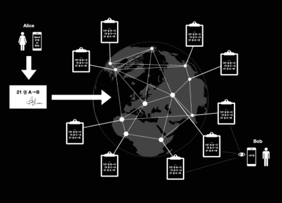
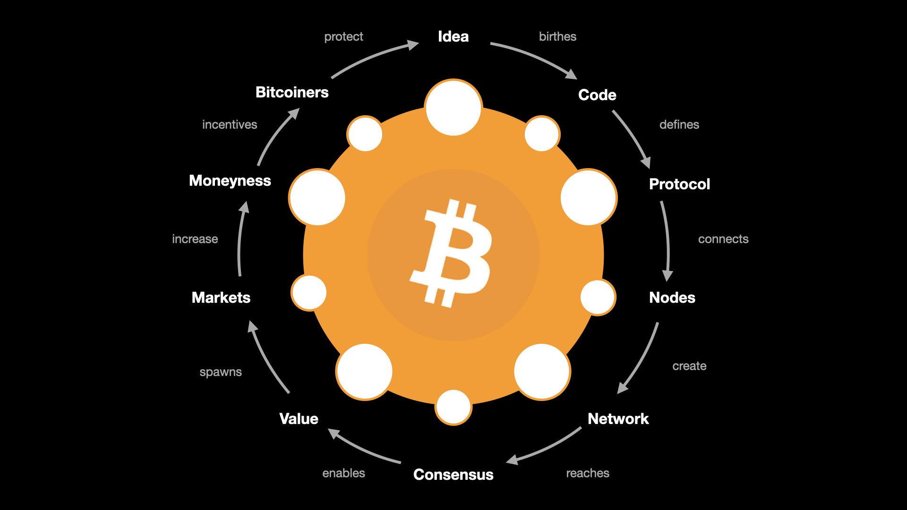

> *作者：Gigi*
> 
> *来源：<https://21-ways.com/ch0-03-quick-and-dirty/>*

> “解释都是清楚明了的，但是聆听解释的人都无法将解释与真正清晰的东西联系起来，所以清晰的解释也都是不清楚的。”
>
> —— [Gertrude Stein](https://en.wikiquote.org/wiki/Gertrude_Stein)

> “悖论能够解释一切。正因如此，悖论本身是解释不了的。”
>
> —— [Gene Wolfe](https://en.wikiquote.org/wiki/Gene_Wolfe)

总的来说，比特币是自相矛盾的。它既简单又复杂，既变化无穷又一成不变。它是史上绝无仅有的新型机器，却没有用到一块创新零件。它是技术创新，却又不是为了革新技术。你触摸不到它，但它是硬通货。你看不见它，但它会让你窥见未来。你无法占有它，但成千上万的人都在为它工作。

这就是为什么比特币会因晦涩难懂和难以解释而“臭名远扬”。John Oliver 有句精辟的玩笑之语：“比特币集所有你不懂的货币理论和计算机技术于一体。”虽然事实就是如此，而且不懂比特币的人也能使用它，但是深入理解比特币背后的货币理论和技术才能真正明白事态的严重性。遗憾的是，即使是粗通比特币也需要具备关于网络、市场、密码学、博弈论、数学、物理学、计算机科学和人类行为学的专业知识。如果比特币易于理解和解释，我们早就走出 “超比特币化” <a href="#note1" id="jump-1">1</a> 阶段，进入比特币本位 <a href="#note2" id="jump-2">2</a> 的世界了。在比特币白皮书发表完一年后，就连中本聪自己都吐槽：“为普通读者写一篇关于比特币的科普文章实在太难了。比特币无法跟任何东西产生联想。”

虽然很多人都试图为普罗大众科普比特币，但是我不确定这种行为能否成功。由于比特币无法与任何东西关联起来，无论你想要通过比喻、列举历史上相似的东西还是“抖机灵”的方式来解释比特币，都会遗漏某方面的重点。在我个人看来，每个人获得的每个 satoshi <a href="#note3" id="jump-3">3</a> 都是独立的，除非跟持有者本人交流，否则我根本无法知道困扰他的是什么。或许你认为比特币没有内在价值，会被政府叫停，会被黑客攻击，或被其它技术取代，甚至认为使用比特币是不道德的，因为它不仅耗能严重，而且常被用于非法活动。所有这些担忧或多或少会让人们对比特币望而却步。但是，不管你信不信，随着你对货币，尤其是比特币的理解加深，这些担忧就会烟消云散。哎，这种理解得来不易。似乎很少有人会因为好奇而花费足够多的精力去学习比特币。反过来说，大多数人会学得非常坎坷：出于需要而被迫理解比特币。

尽管如此，理解比特币及其诞生至今所带来的影响也不是完全不可能。若非如此，世上就不会有比特币持有者、比特币开发者和看好比特币未来的投资者了。每个曾经为比特币痴狂过的人都有自己的惊喜瞬间要分享。我希望从各种视角探索完这一现象后，你也能获得这样的瞬间。

在深入探讨不同观点之前，我们先来看一段粗浅的解释。我会尝试解释比特币是如何运作的？有哪些用途？为何如此重要？幕后功臣是谁？“比特币”是什么？它的基本组成部分是什么？

## 比特币是如何运作的

从本质上来说，比特币是一个巨大的电子表格，记录着谁拥有多少单位（satoshi，也译为 “聪”）的比特币。这个表格记录每笔曾经发生过的交易，比如，“Alice 向 Bob 发送了 21 satoshi”。为了确保所有人都诚实守信，每个人都拥有该表格的副本。每个人都可以按照特定规则在表格底部添加账目。为此，人们需要参与一种类似游戏的活动，很像是买彩票或体育比赛。由于既定的概率，大约每过 10 分钟就会有人赢得比赛，获得在表格底部添加账目的权力。该表格通过特定的内部规则来防止任何人修改过去的账目。而且，如果你单方面把规则改得跟过去的规则有冲突，其他参与者会拒绝跟你一起比赛，将你踢出这个网络。正是这些规则确保记账不会发生任何错误，例如，转账者的账上确实有足够多的比特币，且这笔转账仅被发送到了另**一个**人那里。另外，这些规则确保不会有比特币被凭空创造出来，从而确保 satoshi 的数量不超过 2.1 万亿（即，2100 万 BTC）。

没有任何一个实体能够单方面改变规则，因为所有网络参与者都能自愿选择是否遵守修改后的规则。所有参与者都按照自己认定的规则参与比赛。因此，规则不受任何个体控制。所有参与者都来去自由。你只需要拥有一台联网的计算设备即可参与进来。

差不多就是这样。

如果你已经对比特币有所了解，你会发现所谓的“表格”就是比特币的（分布式）账本，“账目”就是比特币的区块，“彩票”就是挖矿，“规则”就是比特币的共识规则。

诚然，比特币比我形容的要复杂一点（毕竟，这只是我粗浅的解释）。但是，我认为“一个人人都拥有副本的巨型表格”这一思维框架对理解比特币很有帮助。虽然这段比特币解释确实不完美，但是我坚信比特币运作原理的技术细节会越来越不重要，就像互联网运作原理的复杂技术细节对于大多数人来说无关紧要那样。没错，你是得掌握一些技术细节才能真正理解为什么比特币能够抵御掠夺和审查，就像你必须了解一些技术细节才能理解为什么互联网不能被轻易关闭。但是，即使你没有透彻理解汽车或手机的每个部件，也不妨碍你享受它们带来的便利。比特币也是同理。在大多数情况下，大致了解一件东西的用途比起熟知它的运作原理更为重要。

## 比特币有哪些用途

比特币首先是货币。它就像现金，*无需征求任何人的许可* 即可使用。因此，你可以自由接收、花费和储蓄比特币。开通“比特币账户”只需用到数学，收发支付只需用到通信通道。

迄今为止，你只需要一部联网的手机就可以使用比特币。但是，从原则上来说，你可以使用任意随机信息源来创建比特币钱包，以及使用任意通信通道来收发交易。比特币爱好者已经证明过 <a href="#note4" id="jump-4">4</a>，一对骰子和一台无线电收发机也能起到相同的作用。

可惜的是，免许可交易和抗通胀储蓄对于大多数人来说都不是很有吸引力。在获得关于这些基础应用场景的重要性的教训之前，人们很容易将比特币贬为投机资产或泡沫。但是，一旦你的银行账户因 误买/卖 非法物品而遭到冻结，或因涉嫌与违法人员交易而被注销，或你的储蓄因恶性通货膨胀而严重贬值，或你被迫逃离自己的国家，想要偷偷带走自己的财产，“比特币有哪些用途” 这一问题就不言自明。

久而久之，越来越多人会因为现行系统的衰败而被推着理解比特币的重要性。法币天然会以恶性通货膨胀告终，中心化控制天然会以专制化审查告终。比特币就是治疗这两个病症的灵药。

## 比特币为何重要

比特币从根本上改变了大众对货币是什么，以及货币应该由谁控制的成见。随着全球数字化转型推进，我们可以日益明显地感觉到抗审查的原生数字货币对自由社会来说是必不可少的。除此之外，比特币同样很重要，因为它可以代替全世界过度依赖的债务货币。比特币独立于各国政府和公司，而且自诞生以来，它已经表现出了极强的抗打压能力。这种不相关性，再加上比特币的不可变性，使得比特币成为公司、个人和国家都梦寐以求的高价值资产。比特币每多运行一天，人们对比特币系统的信任就更多一点，进而提高比特币的采用率和价值。你越早明白这一过程，你在比特币世界就越有利。

值得一提的是，比特币仅凭自身就足以登上世界舞台。它的激励机制已经引发了一系列事件，不断推动我们的世界走向比特币化。这会是个需要经历数十年的渐进式流程，还是个不到十年就可以走完的突进式流程，尚且有待观察。我个人认为是后者。我相信比特币的激励机制足够强大，而且运行足够稳定，会以超乎预期的速度吸收其他货币和价值贮藏物的价值。虽然 21 世纪的恶性通货膨胀与比特币本身无关，但是比特币让全世界认清了不容轻视的经济现状。巧合的是，央行滥发货币恰好发生在全球数字化大背景下。这种巧合再加上瞬息万变的国际社会局势，为超比特币化提供了完美的舞台。顾名思义，超比特币化就是比特币导致现有货币和其它价值贮藏物（例如，黄金和房地产）迅速丧失原本职能。

## 幕后功臣是谁

简单来说：我们不知道，而且这也不重要。我之所以说这个问题不重要，是因为比特币本质上是开放的，而且纯粹依赖数学。人人都可以监督比特币，并验证它是否如预期般运行。就像我们理解和使用勾股定理不需要知道毕达哥拉斯是谁一样，不知道中本聪是谁也不影响我们理解和使用比特币。同一个问题无论你是问火、车轮、互联网还是电，都不一定能得到满意的答案。所有这些事物背后都有过 发明者/发现者，但是他们后续不再对 发明/发现 产生任何影响。

比特币上线后不久，[中本聪就销声匿迹了](https://21lessons.com/5)。作为对世界的馈赠，ta 留下了免费的开源软件，由此创造出遍布全球的公共点对点免许可网络，进而催生出免审查的原生数字货币。

比特币的历史、起源和史前史会是下一章的重点。比特币是一个构想，但是这个构想并非凭空而来。人们对数字货币的探求几乎可以追溯到互联网诞生之时。因此，找到正确的构想并创建真正有效的系统只是时间问题。

## 比特币是什么

比特币是什么？这是个关于 2.1 万亿 satoshi 的问题。这是人类试图弄懂的问题，也是本文旨在解决的问题。我相信，这个问题的答案取决于你的观点，以及你想要如何看待它。化用电影《黑客帝国》中墨菲斯（Morpheus）<a href="#note5" id="jump-5">5</a>的经典台词，“可惜没人能告诉你比特币是什么。你得自己去看。”

人们在谈及比特币时意思并不明确。有人特指网络，有人特指资产，有人特指围绕比特币形成的行业或社区。

几年前，当我试图理解比特币那难以琢磨又环环相扣的本质时，我顿悟了。我看到至少有一个人 <a href="#note6" id="jump-6">6</a> 与我见解相同：比特币既像哈姆雷特，又一体多面，而且我们缺少精准的词汇直击其本质。更糟糕的是，我们用比特币指代的所有事物都相互关联，形成回环。每个部分都会影响整体。

简而言之，“比特币”是：

1. 一个构想。
2. 一个可以实现该构想的软件。
3. 由该软件创建的协议。
4. 由运行软件的节点组成的计算机网络。
5. 网络运行过程中生成的绝对稀缺资产。
6. 由持有该资产并参与网络运作的个人发起的社会运动。
7. 来自热爱自由的忠实信徒的狂热崇拜。他们有着不同的背景，都属这个社会的少数派，但他们会不惜一切捍卫这种理念。

接下来我会尝试打破这一循环，希望能弄清这一奇怪现象。为此，我会对一些重要概念作出解释。

### 脚注

1.[超比特币化](https://21-ways.com/terminology#hyperbitcoinization)是人类将货币系统从法币升级成比特币的最后阶段。<a href="#jump-1">↩</a>

2.[《比特币本位》](https://amzn.to/2TLl5RP)由 Saifedean Ammous 所著，探究比特币如何成为全球健全货币本位制的基础，就像之前实行过的国际金本位制那样。<a href="#jump-2">↩</a>

3.类似于比特币诞生前我们使用的货币单位“分”。<a href="#jump-3">↩</a>

4.这也解释了为何[禁止比特币](https://dergigi.com/law)是徒劳的。<a href="#jump-4">↩</a>

5.睡神修普诺斯之子，掌管梦境的梦神。<a href="#jump-5">↩</a>

6.一个昵称叫作 [Deep Void](https://twitter.com/deepvoid1981) 的用户在[推特](https://archive.is/1KLeC)上发表自己的观点。我在我的 Circularity [主题帖](https://archive.is/bzVcQ)和各种[讨论](https://dergigi.com/media)中探索了这一思路。<a href="#jump-6">↩</a>