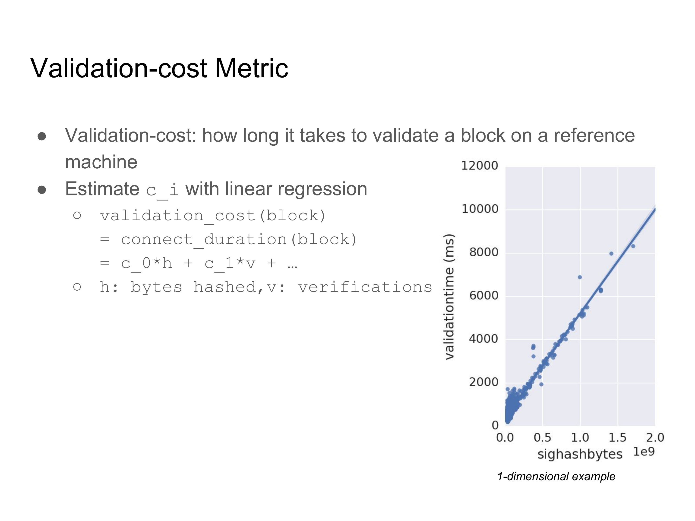
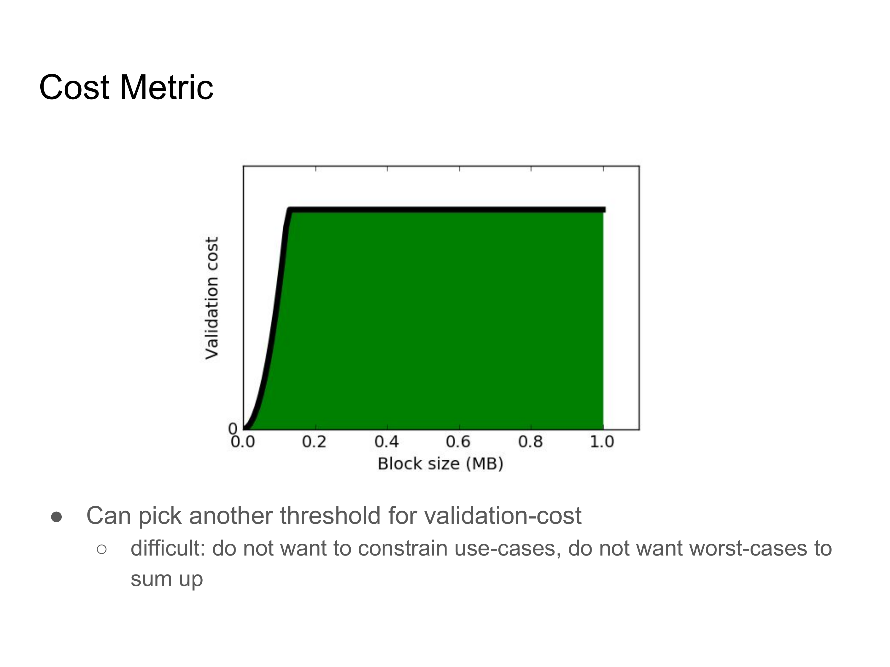
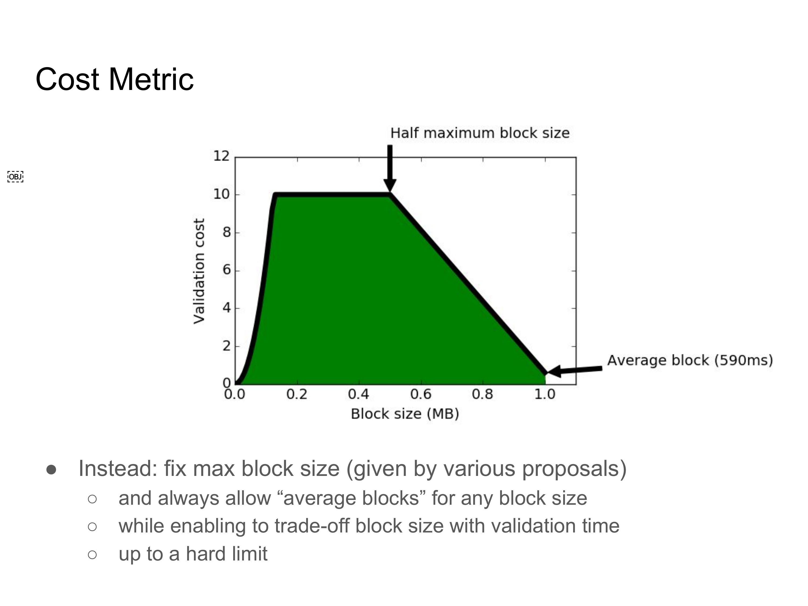
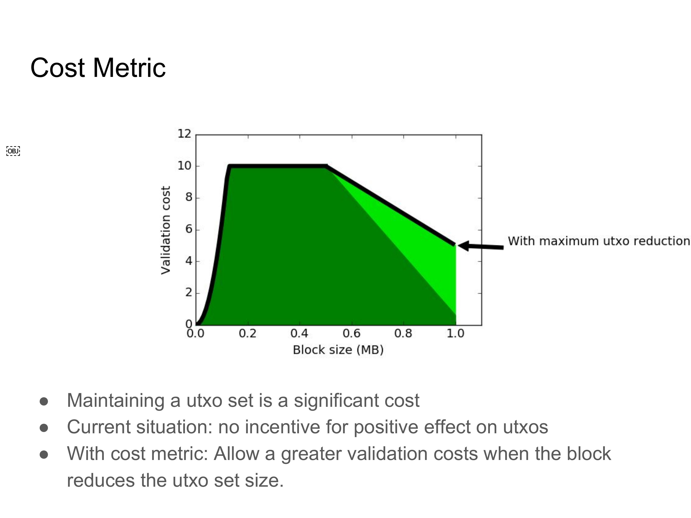
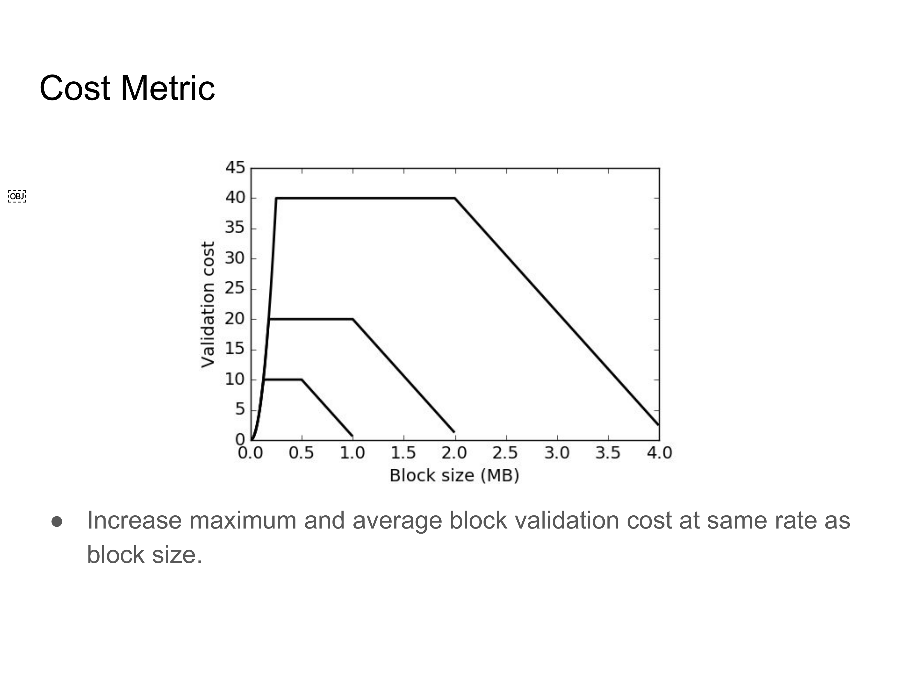

> *作者：Jonas Nick*
>
> *来源：<https://jonasnick.github.io/blog/2015/12/13/validation-cost-metric/>*
>
> *原文出版于 2015 年。文中图片为编者根据幻灯片补加。*

这是我在香港的 [Scaling Bitcoin Conference](https://scalingbitcoin.org/hongkong2015/) 2015 上的演讲的文字版。Greg Maxwell 的这篇邮件总结了 Bitcoin Core 开发者正在采用的扩容措施。与文字版匹配的幻灯片可以在[这里](https://github.com/jonasnick/jonasnick.github.com/raw/master/files/Validation-cost%20Metric.pdf)找到。

## 动机

从过去两天的大会中，我们已经知道了扩容是一个多维度的问题。研究的主要课题之一是通过扩大区块来提高交易吞吐量。这种思路的假设是，因为技术的进步，交易的吞吐量也可以相应提高，运行一个完全验证节点的成本会保持不变。

但是，扩大区块的提案通常只直接影响全节点成本的一方面 —— 区块的大小。一个全节点的实际成本是由许多因素组成的，例如验证区块所需的资源投入、储存 utxo 资料的开销。而且这些因素相互之间并不必然是线性关系。这件事在之前的 Scaling Bitcoin 大会上、Mark 的演讲中已经详细讨论过了。

展示这种非线性关系的最显著的例子是在单笔交易中放入尽可能多的 OP_CHECKSIG 操作码。每执行一次 checksig 操作，整个交易就要被哈希一次，然后用这个哈希值来验证签名。假设区块大小为 1 MB，你可以创建出一个在我的 2014 年款笔记本上需要超过 10 分钟来验证的区块。显然，每一种提议扩大区块的提案都需要搭配处理这种非线性的手段（否则就是不安全的 ）。

其中一种办法是在验证一个区块时，给签名验证操作的数量、可以被哈希的字节数另设一个上限。这种方法已经暴露出了一些问题：首先，现在还没有直观的方法来选择这些限制，也不知道这种限制应该如何随着区块大小的变化而变化。第二，还有其它一些因素会影响验证成本，这些因素可能现在不明显，但在更大的区块中可能会产生更大的影响（如果不加以合适的限制的话）。举个例子，如果一个区块中尽是 HASH 操作码，1 MB 的区块在我的笔记本上只需 5 秒就可以验证完成。第三，为特定的因素施加硬性限制完全忽视了这些因素之间的相互关系。

这些关系是存在的，因为这些因素都以某种方式影响验证成本。这就引出了 “成本度量学（cost metrics）” 的概念。

成本度量方法的目标是将共识规则与实际的资源要求联系起来。其中心思想是，一个区块的成本是特定的区块属性的 *函数*。举个例子，区块的成本可能是区块体积、验证成本和 utxo 增长数的一个加权总和。

如果我们能对这样的成本指标达成一致意见，我们就可以去除硬性限制，转而使用一种新的共识规则：开销低于某个阈值的区块才是有效的。

## 验证成本

全部开销函数的一个侧面是验证成本。我们可以验证成本理解为在一台标准的机器上验证一个区块需要花费的时间。然后我们就可以引入一个阈值，表示区块在这台标准的机器上的验证时间不能超过 30 秒。换句话说，我们希望找出一个函数，能表示区块的属性（比如在签名验证中需要哈希的字节数）跟验证时间的关系。为此，我们假设有一个简单的模型函数，断言验证的时长是区块属性的线性总和，然后收集在这台机器上的实际验证时长、将数据填进这个模型里面去。

一维的情形就如右图所示，每个数据点都代表一个区块，并给出了该区块需要哈希的字节数以及该区块的验证时间。有了这些数据，我们就能确定哈希计算对验证时间的影响（或者说系数），表达在图中就是一条线。然后，这个系数就可以用在共识规则中。

**注意**：如果我们假设投入的不同资源会以相同的速度增长，这种成本指标就能使用增长因子的倒数与方程相乘，自然地缩放。

## 实验

验证成本首先受 OP_CHECKSIG 的数量影响，也最主要受它的影响；这个操作符会用到签名验证和哈希运算操作。Bitcoin Core 已经限制了单个区块可以使用的 OP_CHECKSIG 的数量，但在我们这个例子中是不够的，因为统计 OP_CHECKSIG 数量的方法是关键。我们基于 Gavin Andresen 的代码，在验证交易时统计这些参数；我们也记录了使用 OP_HASH 操作符来运行的哈希计算次数，以及写入堆栈和从堆栈中移除的字节数。输入的数量跟在 utxo 集中搜索的次数有松散的对应关系。当然，我们也度量了因变量，在标准机器上的 ConnectBlock 持续时间。

我们的标准机器是我的笔记本，它有两个 3 GHz 的 i7 核心。为了收集区块的属性数据，以及对应的 ConnectBlock 持续时间，我们重新索引了主链、测试网和定制化的链（举例而言，它完全由难以验证的区块组成）。我发现，当我的内存还有 5 GB 可用时，我可以轻松使用电脑，所以我把 dbcache 选项设成了 3GB（我的内存总大小是 8 G）。dbcache 参数决定了多少数据会缓存在内存中，我们运行 Bitcoin Core v0.11.2，使用 libsecp 验证，并禁用了检查点。

## 结果

在使用线性回归法估计系数之后，我们获得了有用的数据，比如，在一次验证签名总计用时 0.1 微秒时，每 1000 字节的哈希运算要花去 0.005 微秒。其它属性的影响跟它们都不可比，虽然可以创建出只包含哈希操作码、需要 5 秒来验证的区块。

验证成本函数的拟合非常准确：在从测试网和主网上随机选出的测试内容中，平均误差不超过 4 毫秒。更重要的是，拟合出来的函数可以非常准确地估计难以验证的区块的验证时间：测试用的区块最终验证用时 130.4 毫秒，预测时间是 131.7 毫秒。

## 成本指标

所以，现在我们可以推导出对应于标准机器的验证用时的验证成本指标，而且，我们可以定义一种新的共识规则，要求区块的验证成本小于某些阈值。在选出阈值之后，就会出现这张图片描述的情形：x 轴表示区块的大小，y 轴表示验证时间，而绿色区域表示有效区块的属性范围。

但是，选择另一个阈值是困难的。因为没有万能的解决方案：（1）你不想限制可能的应用场景；（2）你也不想让最坏情况下的验证时间和带宽相互叠加。

换句话来说，我们可以尝试（比如说）使用单个加权总和，将带宽要求和验证成本关联起来，然后找出单一的阈值。

而这正是成本度量背后的观念，找出影响节点成本的所有因素以及影响的程度，然后选出一个理性的成本阈值。正是这种观念，才使我们有必要从扩大区块体积的提议转向讨论节点的总体成本。

现在，问题是，如何能将带宽要求和验证时间转化为成本？牺牲一秒的网络时延、换得验证时间节约一秒，是否值当？如何将额外的成本因素（例如 utxto 集的大小）纳入考量？这样的解决方案能不能面向未来？

这些问题显然没有唯一正确的答案。不过，我们可以展示基于现有的区块大小提议之上的一个成本函数的优势。大部分关于区块大小的提议都只考虑具体的一个区块体积上限下的平均情形。所以，就成本阈值而言，只允许达到体积上限的区块拥有中等的验证时长，将是非常有好处的。这样一来我们就能防止区块在带宽和验证时间上都是最差的情形。至于一定体积的区块的平均验证时长，我们可以使用前面在标准机器上收集来的数据。

同样地，我们可以设置 10 秒验证时间的硬上限，这似乎是有道理的，因为标准机器上的最长验证时间是 6 秒钟。而达到体积上限的区块的平均验证时间（是 590 毫秒）。然后，我们就可以在最大验证时间和体积上限的一半之间线性插值。

这种做法展示了成本度量的一个优势：我们可以通过让区块更贴近平均情形来约束最糟糕的情况，并且依然允许未来新出现的、要求更多验证资源的用例。

迄今为止，维护 utxo 数据的成本还未反映在比特币协议中。实际上，因为区块体积的上限是 1 MB，在最糟糕的情况下，utxo 集的大小也会增长几乎 1 MB，只不过，过去一年的平均情况是每个区块增长约 11 KB。在成本函数中为之找出一个位置比验证成本和带宽成本要更难，部分原因是它是一个长期成本。比特币当前的情况是没有设置在可能的情况下避免使 utxo 集增大的激励。比如，把数据从脚本签名中移到脚本公钥中，就可以避免使  utxo 集增大。我们可以对成本函数做的，就是安排一种微型的激励，引入一种可以削减 utxo 集的体积的交易，然后让这种交易比其它类型的交易更便宜。建议使用的一种办法是，当区块可以削减 utxo 集的体积时，允许它有更大的验证成本。这跟这一事实是一致的：如果一个区块可以扫清大量的 utxo，则其验证成本会比较高，因为输入对输出的比重较高，但是，我们依然希望这个区块是有效的，因为它们是很有好处的。

为了得出一个具体的方程，我们可以计算一个达到体积上限的区块可能削减的 utxo 集体的极值。然后线性插值，使得每削减 utxo 集的一个字节，都允许验证时间增加一些，直到验证时间的增加值达到（比如说）剩余验证成本的一半。这样的规则没有在成本函数中为 utxo 集的体积安排足够重要的位置，但至少将激励引向了正确的方向。

通过将验证成本的限制和平均验证成本与相同的扩容因子相乘，这个成本函数可以类推。所以，如果区块体积翻倍了，最大的验证成本点也要翻倍，等等。

图片已经给出了区块体积上限为 1 MB、2 MB 和 4 MB 时候的情形。

这保证了最糟糕的情形下，验证的时间会跟区块体积以同等比例增长，这也是许多关于区块体积的提议背后暗含的假设。同样地，这也保证了验证成本处于平均水平的区块总是可以使用最大的体积。

## 结论

结论是，比特币协议给全节点提出了 *多种* 资源要求。而且，扩大区块的提议至少要考虑到最重要的资源要求，以及极端糟糕的情形，这是至关重要的。成本度量可以帮助我们考虑这个问题，因为它设定了不同资源的关系要求。

我们已经看到，仅为验证成本拟合一个函数，是很直接的，只需假定一台标准的机器、收集数据并使用线性回归法即可。

更复杂的成本函数包括带宽、验证成本和 utxo 集的增长率，是很难自下而上推导出来的。但是，就像我们展示的，我们可以基于现有的区块体积提议，利用成本度量的一些优势，例如：

- 限制最糟糕的情形，同时
- 允许在不同的区块属性之间取舍，同时
- 设置正确的激励。

（完）

 