> *作者：Loïc Morel*
> 
> *来源：<https://wizardsardine.com/blog/absolute-vs-relative-timelock/>*


## 什么是 “时间锁”？

先从基础的部分开始。“时间锁” 是一种用于编程智能合约的原语，它在花费方法上附加一个时间条件，意思是 “*这种花费方法只有在某个时间点之后才能动用* ” 。虽然叫法是这么叫，但它不会 “锁定” 你的钱币，它不像一把锁，更像是花费方法的一个基于时间的条款。

那要是我不管这个条款，提早花费，会怎么样呢？答案是整个网络（中的所有节点）都会认为这是一笔无效的交易，因为这就是共识规则的含义。一旦整个网络认为当前已经抵达时间锁中定义的时间点，那么同样的花费动作又可以照常通过。

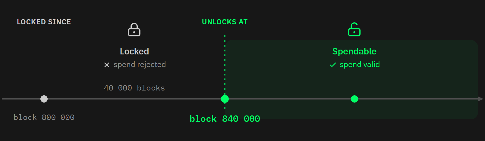

## 两类不同的时间锁

在比特币中，可以用两种方式来编程时间锁：绝对时间锁，或是相对时间锁。

“绝对时间锁” 可以理解为一种日历，你标注好一个预约日期，假设是 2032 年 1 月 1 日。当这一天来临，闹铃就会想起来。至于在两个日子之间发生了什么，是无关紧要的，只要设定好预约，就不能再改变。这就是绝对时间锁：它指向一个固定的瞬间，对所有人来说都一样，可以在时间线上标注出来。

“相对时间锁” 则可以理解成一个沙漏。当钱币进入你的钱包时，你就把这个沙漏翻转过来，沙子开始落下。（沙子落完，你才可以花费这个钱币。）如果钱币再次移动，那么这个沙漏就没作用了，你会用一个新的沙漏重新计时。这就是相对时间锁：它并不指向一个确切的日期，而是从某个事件（钱币进入钱包）开始流逝的一段时间。

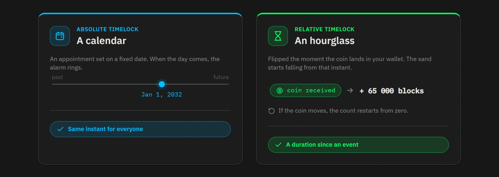

## 在哪个层面生效：交易还是脚本？

在具体介绍这两种时间锁如何工作之前，我们还需要理解第二项区别，跟第一种是独立的。时间锁可以在两个层面上设定。

第一个层面是交易层面。比特币交易有两个字段是为此服务的：`nLockTime` 用于设定绝对时间锁、 `nSequence` 用于设定相对时间锁。给这两个字段填充数值，你就为这一笔交易附加了生效的时间条件，表示：“*在这个时间点以前，应该把它当成一笔无效交易；（或者）在这几个被花费的钱币诞生后的一段时间内，应该把它当成一笔无效交易* ”。

问题在于，由交易携带的条件无法约束钱币本身。只要这笔交易还没得到区块确认，对于整个比特币网络来说可以认为它不存在，所以完全可以用另一笔交易来花费同样的一批钱币。

给个例子：假设 Alice 给了你一笔交易，带有持续到明年的时间锁。但你没有办法阻止她同时构造出另一笔不带时间锁的交易、花费同样的钱币、立即广播到网络中。如果第二笔交易先在区块链上确认，那么你手上的那笔带有时间锁的交易就永远不会变成有效的交易了（因为它花费的钱币已经不存在了）。换句话说，放置在交易层面的时间锁，无法阻止人们提早花费被该交易花费的钱币：它只是对这笔交易的约束，不是对那些钱币的约束。

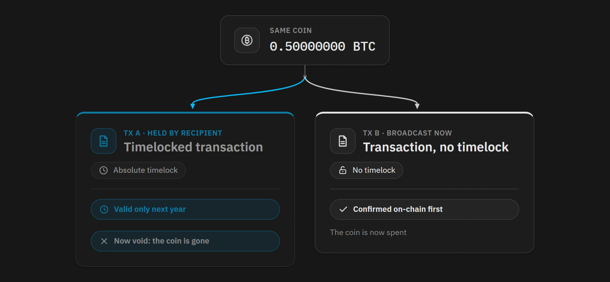

为了获得真正的控制，我们需要在更深一层构造时间锁，也就是在钱币的脚本中（UTXO 的花费条件中）。有两个操作码负责做这件事，分别是： `OP_CHECKLOCKTIMEVERIFY`（通常缩写为 `CLTV`），用于构造绝对时间锁；`OP_CHECKSEQUENCEVERIFY`（通常缩写为 `CSV`），用于构造相对时间锁。使用这些操作码，花费的时间条件就被写在钱币中；任何尝试花费它的交易，不管自身还有没有别的生效条件，都必须遵守这个时间要求，所以，也就没有办法构造出不带时间锁的版本了，因为约束来自钱币，而不是来自构造交易的人的善良。

所以，我们有两种施加时间约束的环境：交易和脚本；也有两种约束类型：绝对时间锁和相对时间锁。

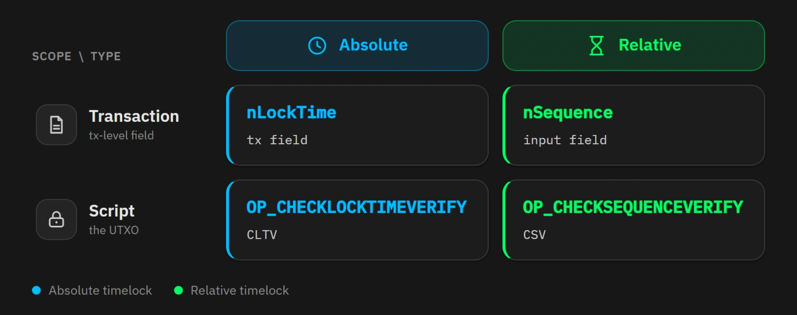

但是请注意，这不是四种独立的机制。这两个层面是互补的。单靠放在交易层面的时间锁，是无法保护任何东西的，这我们已经看到了；但写入脚本的时间锁也不是光靠自身发挥作用的： 脚本不会检查时钟，它只是要求花费这个钱币的交易附带了有效的 `nLockTime` 字段或 `nSequence` 字段。 网络实际拿来对比当前时间或当前区块高度的东西，是交易层面的这些字段的数值。因此，每一种类型的时间锁，都是结对出现的：交易中的一个字段，以及一个脚本操作码。

在阅读下文时，请牢记：`nLockTime` 和 `CLTV` 是编程绝对时间锁的两种机制；而 `nSequence` 和 `CSV` 是编程相对时间锁的两种机制。现在，我们要分别来研究这两种时间锁，看看它们是怎么工作的。

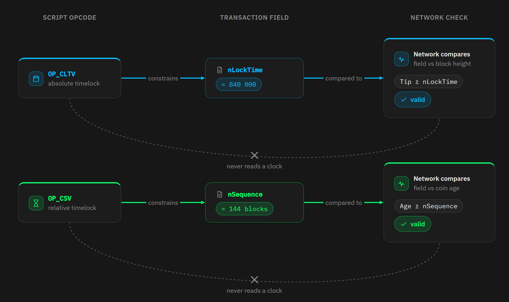

## 绝对时间锁

如前所述，绝对时间锁指定的是一个固定的瞬间，在这个时间点以前，花费动作不能生效。这也是我们用日历来作比喻的原因。

在交易层面，负责表达绝对时间锁的字段叫做 `nLockTime` 。这是一个 4 字节长的字段，在每一笔比特币交易中都有，并且从比特币协议诞生的时候开始就是这样。它指明的是一笔交易可以进入区块的最小区块高度，或者最早的日期。

举个例子：Alice 将自己的一笔交易的 `nLockTime` 设为 `1,000,000` 。她可以马上签名和广播这笔交易，但当前整个网络的区块高度是 `950,000`，所以节点会拒绝转播它：矿工们无法在 `1,000,000` 号区块之前打包这笔交易。而当这个编号的区块挖出的时候，这笔交易就变成有效的了，也可以进入区块链。我用区块高度来举例，但日期也是一样的道理。

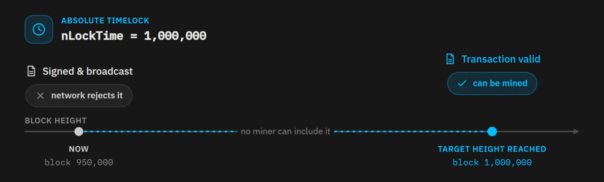

而在脚本层面，操作码 `OP_CHECKLOCKTIMEVERIFY`（`CLTV`）就是这个作用。这个操作码是靠两重约束发挥作用的：首先，`CLTV` 会约束尝试花费这个钱币的交易的  `nLockTime` 字段：这个字段的数值必须大于等于写在脚本中的数值；然后，这个 `nLockTime` 数值，又约束交易可以进入区块的时间点，因为它就表达绝对时间锁。将两个约束串联在一起，就得到了我们想要的保证。

如果 Alice 在一个钱币的脚本中写入 `OP_CHECKLOCKTIMEVERIFY` 以及 `1,000,000` ，那么任何尝试花费这个钱币的交易都必须将 `nLockTime` 字段的数值设为 `1,000,000` 以上，否则脚本执行就会失败；而这个 `nLockTime` 数值，又反过来阻止交易在区块高度 `1,000,000` 以前得到区块确认。

一句话总结：脚本约束交易的字段；字段的数值约束交易生效的时间点。

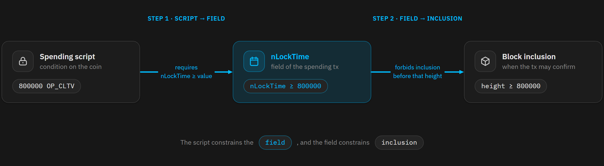

与 `nLockTime` 字段不同， `CLTV` 操作码不是从比特币诞生就有的。它是通过一次专门的软分叉（内容由 BIP-0065 表述）添加到比特币中的，在 2015 年 12 月 14 日才激活。

从某种程度上说，两种机制追求的是相反的目标。`nLockTime` 的作用是设置一个日期，防止交易太早进入区块链；而 `CLTV` 则是让一个钱币只能在某个时间点之后花费，虽然具体是通过强制花费交易携带一定的 `nLockTime` 数值。`nLockTime` 可以由构造交易的人自由选择，因此，不管花费什么钱币，你都可以设置 `nLockTime` 的数值为你花费它的时间。`CLTV` 则相反，它是在创建一个收款地址（脚本）的时候就决定的，没人能改变它。这使得原本可以反悔的 “*我选择等待* ” 成了无法绕过的 “*钱币迫使我等待* ”。

### 在绝对时间锁中表示时间

还有一个问题是表达时间点的方式。比特币接受的两种形式是：

- 区块高度。比如说“区块高度 `1,000,000` ”。这笔交易只有当区块链抵达这个高度时，才能成为有效交易。
- 日期，比如说 “2032 年 1 月1 日”。只要当网络越过这个时间点时，这笔交易才能成为有效交易。

想必你会好奇，比特币怎么区分数字的单位（数值的含义）呢？答案是以 `500,000,000` 作为分界点。如果时间锁的数值小于 `500,000,000`，就把这个数值解释为区块高度。如果大于 `500,000,000`，就解释成日期，更准确来说是 Unix 时间戳。Unix 时间戳将时间的起点定义为 UTC 时间 1970 年 1 月 1 日的 00:00:00 ，将时间戳的数值当成秒数加上去，就能得到一个具体的时间点。比如，`1,956,528,000` 这个数值，就对应着 2032 年 1 月1 日的半夜：`nLockTime` 字段使用了这个数值的交易，将无法在这个日期以前挖出。

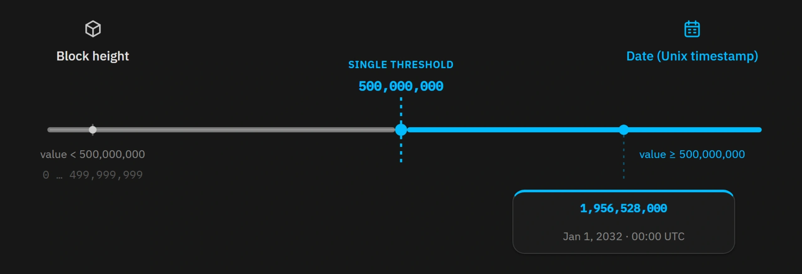

当使用区块高度来指定时间锁时，这是非常容易比对的，因为高度就是一个固定的数字，对每个人都一样，也无法操纵，因为区块总是严格按顺序出现的。但使用日期来指定时间锁时，就复杂了，因为有不同的时区、整个网络在时间上不是严格一致的，而且，区块时间戳对于矿工来说是可以灵活改变的。所以，我们不是把时间锁的数值与矿工写到区块头的时间戳相互比较，而是与过往 11 个区块的时间戳中值比较；这个中值，我们称为 “MTP（过往时间中值）”。

在实践中，在验证一个区块时，节点会取此前 11 个区块的时间戳，然后留下中位数。以 Unix 时间戳锁定的交易只有在其 `nLockTime` 数值严格大于这个中位数时，才能进入区块。

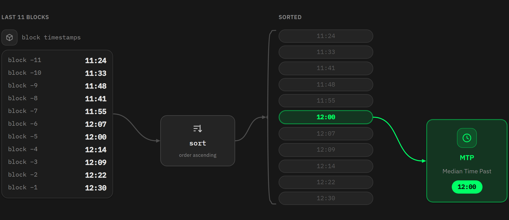

这条规则来自 BIP-0113，是在 2016 年 7 月激活的，纠正了一种反常的激励。此前，Unix 时间戳时间锁对比的对象是区块自身的时间戳，但矿工可以把这个字段数值拉高，拉到大约未来两个小时后的时间：因此，他们有一种激励在时间上说谎，从而提早确认那些本应还在锁定期的交易、拿到手续费。但 MTP 只会前进，不会倒转，而且操纵它需要控制最近 11 个区块中的至少 6 个，所以基于日期的时间锁就变得可靠多了。

最后提一个细节：过往区块中值大致对应于一个小时以前挖出的区块，所以，我们这个例子中的时间锁，设定到 2032 年 1 月1 日的半夜，实际上到大约凌晨 1 点才能解开。

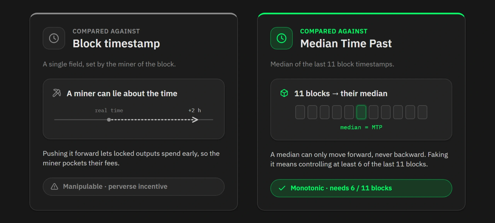

### 绝对时间锁的局限性

绝对时间锁的一个特征是，以区块高度来指定时，它有一个非常遥远的最大值，大概是 9,500 年以后。这个数字来自前面提到的 `500,000,000` 数值分界点：因为任何小于这个数值的数字都会被解释为区块高度，所以可以表达的最大区块高度就是 `499,999,999` 。大约每 10 分钟出现一个新的区块，所以  5 亿个区块大概就是 50 亿分钟，也就是 9500 年。

不过，这种虚空只存在于区块高度模式中。在日期模式中，`nLockTime` 跟比特币区块的时间戳字段受到一样的限制，它们是 32 比特的无符号整数。可用的数据空间最多只能表示到 2106 年 2 月 7 日的 06:28:15（UTC 时间）。

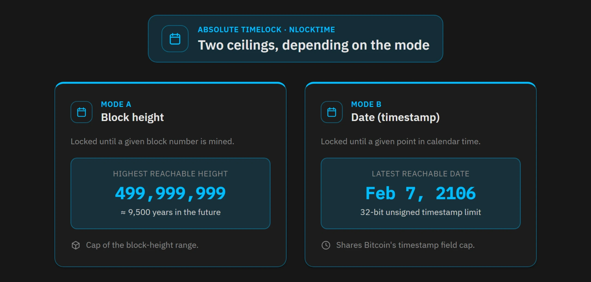

### `OP_CLTV` 的作用

我们已经掌握了绝对时间锁的大致原理，现在可以看看 `CLTV` 操作码的具体作用了。

当 `OP_CHECKLOCKTIMEVERIFY` 进入脚本求值的堆栈时，如遇以下几种情形，它就会让脚本求值失败：

- 堆栈是空的（该操作码必须从栈顶读取一个数值，拿它来比对，如果堆栈空了，那就没有东西来比对了），
- 栈顶的元素是负值（不论是区块高度，还是日期，都不可能是负数，所以负的时间锁是不可能的），
- 数值的类型（高度或日期）与交易的 `nLockTime` 不一致（拿一个区块高度与一个日期比对，是没有意义的），
- 数值超过了交易的 `nLockTime` 数值（这就是时间锁的核心：花费交易必须携带一个大于等于脚本中数值的 `nLockTime` 数值，否则就是太早花费了），
- 正在花费的输入的 `nSequence` 数值为 `0xFFFFFFFF` 交易（该数值会抵消交易的 `nLockTime`）

最后一条很重要。只有当交易中至少一个输入使用了非最大的 `nSequence` 数值（也就是小于 `0xFFFFFFFF` 的数值）时，`nLockTime` 才会被强制执行。如果每一个输入都使用 `0xFFFFFFFF` 作为 `nSequence` 的值，`nLockTime` 就会被禁用，这样一来，一个带有时间锁的钱币的主人就可以提前花费它。因此，当 `nLockTime` 的作用被抵消时，`CLTV` 会直接失败。理论上，任何一个输入的 `nSequence` 不使用最大值，都足以让 `nLockTime` 机制继续执行，但 BIP-0065 要求花费 `CLTV` 输出的输入自身携带非最大的 `nSequence` 数值，从而只需看当前这个输入，就足以检查这条规则，无需扫描整笔交易的所有输入。

我们也是偶然发现，一条规则明确禁止在操作码中混用不同的时间锁类型（日期 vs. 区块高度）。 也就是说，写在脚本中的时间锁类型，必须跟 `nLockTime` 的数值类型一致。

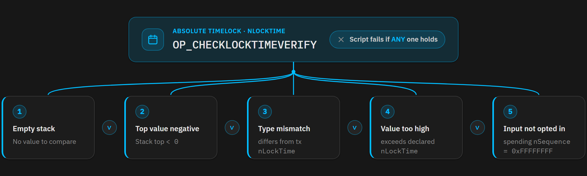

### 不知不觉中，你已用到了 `nLockTime` 

绝对时间锁还有另一种用途，不会向用户明示，与推迟花费无关。从 2014 年底开始，`Bitcoin Core` 钱包开始默认为每一笔交易设定 `nLockTime` 数值等于当前区块高度（后来其它钱币软件也效仿）。这不是为了推迟花费，而是为了反激励一种叫做 “手续费狙击” 的攻击。

因为区块补贴会不断收缩，矿工的收益将越来越多地依赖于交易手续费，而已经挖出的区块的内容可能成为一个有价值的目标。一个矿工可能尝试不在区块链的顶端挖矿，而是重新挖出最新区块、触发区块链重组，以获得潜在更高的手续费和在交易池中等待的最好交易。目前（2026 年），矿工不会回头挖矿，因为区块补贴依然占收益的大头，而狙击手续费的区块可能会变成陈腐区块（没有后续区块）从而颗粒无收。但如果某个区块有非常多的手续费，那也许值得冒这个风险。

（译者注：“手续费狙击” 的可能性源自一个简单的事实：随着时间流逝，观察者总是能看到更多手续费更高的交易；因此，当矿工尝试重组区块链，也就是在以往的区块高度上挖矿时，可以纳入当时无法观察到的交易，从而获得比当时的矿工更多的手续费收入。）

`nLockTime` 起作用的地方就在这里。如果每一笔交易都以最新的区块高度作为时间戳，那么新广播出来的交易就只能进入下一个区块、无法被以往的区块确认。回头挖矿的矿工因此也无法包含这些新的交易，这就降低了手续费狙击的潜在收益，保护了在最新区块上挖矿的激励。

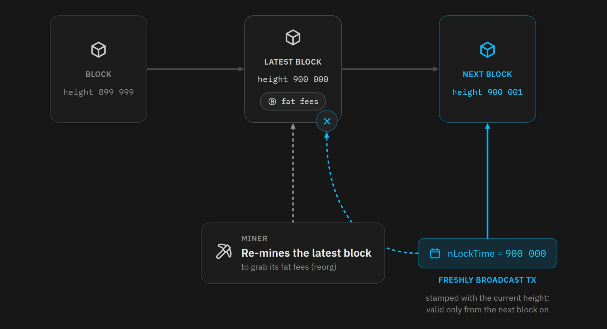

## 相对时间锁

相对时间锁并不指定一个确切的时间点，而是一段时延，从被花费的钱币诞生的时间点开始计算。这就是我们的沙漏比喻的由来。

在交易层面，负责表达相对时间锁的字段是 `nSequence` 。请注意，这里有一个重大区别： `nLockTime` 是一个字段，整笔交易都共享；但每个输入都有一个自己的 `nSequence` 字段。比如说，一笔交易花费了 3 个 UTXO ，那么这笔交易有 1 个 `nLockTime` 字段，但有 3 个 `nSequence` 字段。

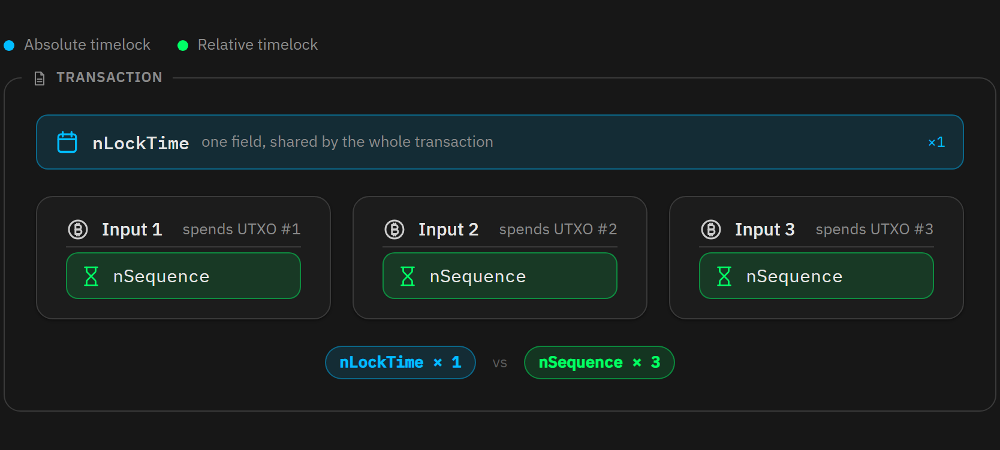

与 `nLockTime` 一样，`nSequence` 也是在交易层面发挥作用的，不是在脚本层面：在你签名一笔花费交易的时候，你可以为每个输入写入一个时延，必须从被这个输入花费的钱币诞生的时刻起经过了这么长的时延，这笔交易才能成为有效交易；这种时延可以用区块数量来度量，也可以用钟表时间来度量（就像绝对时间锁一样）。而且，即使每个输入都以这种方式设置了自身的时延，这种相对时间锁还是对整笔交易生效的：只要任何一个输入所规定的时延还没结束，那么整笔交易就是无效的。

而在脚本层面，操作码 `OP_CHECKSEQUENCEVERIFY`（`CSV`）由 BIP-0112 引入，它在资金进入一个收款地址时就将时延写入，所以在花费时不能再变更了。

> 这些条件，加上 MTP 的使用，是在 2016 年 7 月 4 日的软分叉中一起激活的，它包含了 BIP-0068、BIP-0112 以及 BIP-0113 。请注意，不要把 `CLTV` 操作码也算在其中，因为这个操作码从 2015 年 12 月起就开始服役了，属于 BIP-0065，由一次专门的软分叉激活。只有 `CSV` 是在 2016 年 7 月的软分叉中引入的。不过，这两个操作码都是以同样的方式部署的：回收利用没有动作的操作码。`CLTV` 利用了 `OP_NOP2` ，`CSV` 利用了 `OP_NOP3`。`OP_NOP` 操作码是一种有意设计为在运行时无所作为的操作码：它不会触及堆栈，也不改变任何东西，只是移动到下一个指令。比特币保留了多个这样的操作码，从 `OP_NOP1` 到 `OP_NOP10`，正是为了未来某一天能用作新规则的锚点。感谢这种保留，旧节点可以忽略时间锁条件，只检查签名就接受这笔交易；而更新后的节点会拿堆栈中的数值对比相关的交易字段（为 `CLTV` 检查 `nLockTime`、为 `CSV` 检查 `nSequence`），并在不满足条件时传出失败。也就是说，只是对同一段脚本有两种不同的读法：一种会忽略时间锁，另一种则会强制执行时间锁；但只要时间锁条件得到了满足，两种读法都会让交易通过。

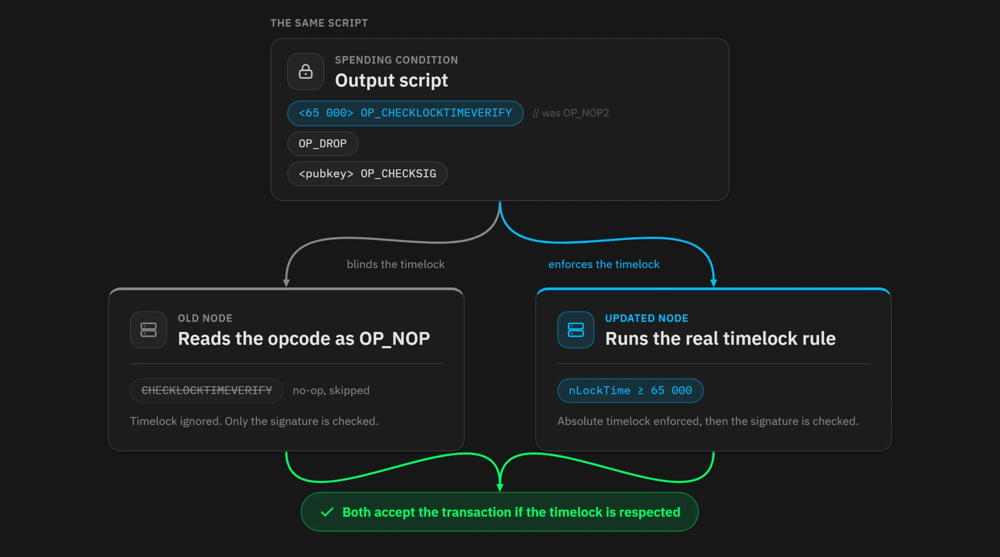

这正是软分叉的定义。新规则只是增加了约束、收紧了有效交易的范围，而不是扩大了这个范围。更新后的节点所接受的所有东西，旧的节点也会接受。因此，这种变更可以说是安全的，只要绝大部分的挖矿算力都强制执行新规则。如果少数矿工产生了违反规则的区块，那么遵守规则的区块最终会打败他们，连旧的节点也会跟过来，因为相互竞争的两条链对旧节点来说都是有效的。

### 在相对时间锁中表示时间

相对时间锁也有两种表示时延的单位：

- 区块数量，比如“（从钱币诞生时刻起）52,560 个区块”（大约是 1 年）。
- 钟表时间，每 512 秒算一个间隔。

基于区块数量的规则是很好理解的。如果一个钱币在区块高度 `n` 得到确认，而它的 `CSV` 时间锁带有数值 `s` ，那么它就只有在网络抵达区块高度 `n + s` 之后才能花费。

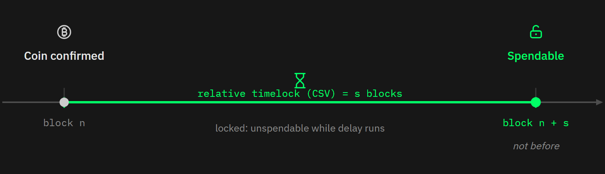

相对时间锁机制也依赖于两种约束的串联：

- `CSV` 要求输入的 `nSequence` 数值大于等于 `s`，否则失败；
- `nSequence` 则反过来，阻止交易在高度 `n + s` 之前进入区块。

脚本约束输入、输入约束交易。时延的长度是在钱币诞生（资金进入收款地址）的时候就写入脚本的，但满足它的 `nSequence` 是在交易的输入中设定的，也就是在花费的时候设定的。

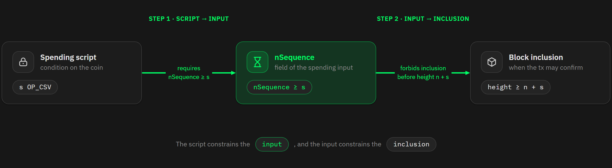

基于钟表时间的相对时间锁要稍微难懂一些。首先，写入的数值不是直接视作秒数，而是以 512 秒为一段时间的段数。一个使用数值 `s` 的时间锁，要经过 “512 秒乘以 `s`” 这么长的时延之后，才能解锁。如果要设定一个长达  24 小时的时间锁，你需要写入的数值是 169 ，因为 169 段 乘以 512 秒/段，等于 86,528 秒，稍稍长于 1 天。

然后，为了对比这个时延，网络使用 MTP 。秒表从确认这个钱币时观察到的 MTP 开始计时（更准确地说， BIP-0068 使用的是前一个区块的 MTP），只有区块链的最新 MTP 超过起点 + 所需时延之后，这个钱币才能被花费。请注意，这两个边界依赖的是同一个 MTP 时钟：落后于真实时间一个小时的误差，既对起点生效，也对终点生效，因此相互抵消，使时延的比对可靠。

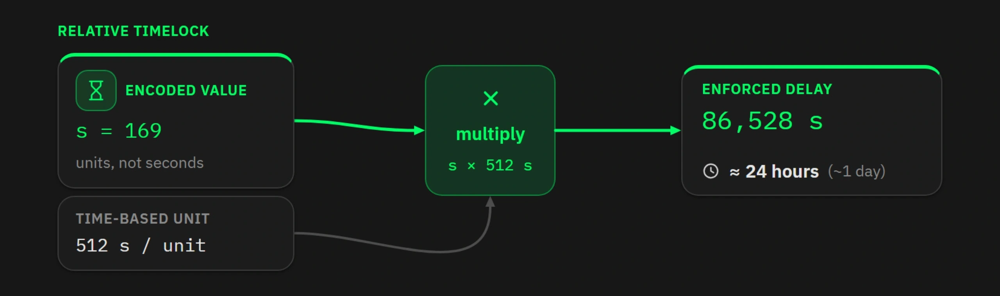

### `nSequence` 字段剖析

`nSequence` 字段有 32 比特，但相对时间锁只会用到其中一部分。最大的比特，也就是第 31 位的那个（`1 << 31`），是一个禁用标签：只要它是 1，就表示这个输入不设相对时间锁。而第 22 位的比特（`1 << 22`，数值等于 `0x400000`）则是类型标签，表明要把数值解读为区块数量还是 512 秒的段数。最后，最低的 16 位携带表示时延的数值，这使得数值最大就是 65,535 。

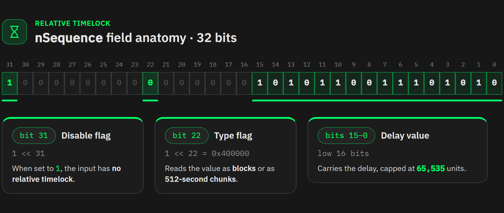

因此，一个输入的相对时间锁会在两个条件下生效：

- 交易的版本号为 2 或更高；
- 输入的禁用标签位数值为 0，换句话说， `nSequence` 字段数值小于 `0x80000000` 。

你可能会好奇，为什么要有这个禁用标签 —— 交易版本号不是足以禁用时间锁验证了吗？这是因为，如果未来有了版本 3 的交易，带来了更多特性，你可能既希望利用这些特性，又希望它们不受制于相对时间锁，禁用标签正是为了让你能按需选择。

又，你可能好奇，为什么钟表时间的单位是 512 秒，而不是 1 秒。这是因为 16 个比特最大只能表达 2<sup>16</sup> ，如果单位是秒，那么能表达的最大钟表时间就是 18 小时，这对绝大部分用途来说都太短了。但以 512 秒为单位，时间锁的范围就可以延长到 388 天；而基于区块数量的相对时间锁可以长达 15 个月（512 是 2 的幂数中最接近 600 秒 —— 比特币的出块间隔 —— 的。）

举例以明之：一个 `nSequence` 数值为 `0x00000090` 的输入携带了一个基于区块数量的相对时间锁，因为其类型标签比特为 0，而时间锁数值为 `0x90` ，也就是十进制的 144 。因此，被这个输入花费的钱币，必须存在了至少 144 个区块（大约是一天），这个花费行为才是有效的。

如果你的 `nSequence` 数值为 `0x00400007`，就切换成了钟表时间模式：数值 7 要乘以 512 秒，得出 3,584 秒 —— 这是一个稍微长于 1 小时的时间锁。

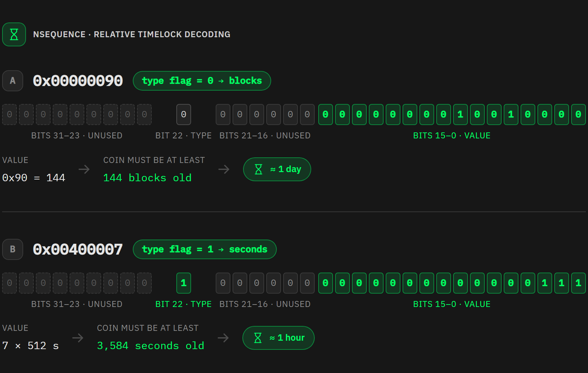

`nSequence` 在比特币中是比较特殊的，因为它不仅由于相对时间锁。取决于其数值，它可以控制跟一笔交易的确定性相关点的三种特性：

- 使用数值 `0xFFFFFFFF` （也就是该字段允许的最大值）时，这个输入可以说是已然确定、没有变数：它没有相对时间锁、不使用 RBF（手续费替换）、甚至交易的 `nLockTime` 的作用也会被取消。使用 `0xFFFFFFFE` 或者更小的数值，交易的 `nLockTime` 就会被强制执行。
- 使用 `0xFFFFFFFD` 或者更小的数值，这个输入就额外表示，它接受 BIP-0125 RBF 规范（可能发送更高手续费的交易版本来替换掉当前版本）。
- 最后，只要禁用位数值是 0，这个输入就携带了一个相对时间锁，只要交易的版本号为 2 或更大数值。

默认情况下，`Bitcoin Core` 钱包会设为 `0xFFFFFFFE`，从而激活 `nLockTime` 机制，但不做别的事。从 2022 年底发布的 24.0 版本开始，它也默认表态使用 RBF，因此会设为 `0xFFFFFFFD` 。那么注意，这里有一种不对称性：激活 `nLockTime` 机制和表态 RBF ，都是在整个交易的层面生效的，只要一个输入的数值低于分界点，就足以影响整笔交易；相反，相对时间锁是逐个输入设定的；并且，因为相对时间锁的数值天然较小，所以只要有一个使用相对时间锁的输入，整笔交易就打开了 `nLockTime` 和 RBF 机制。

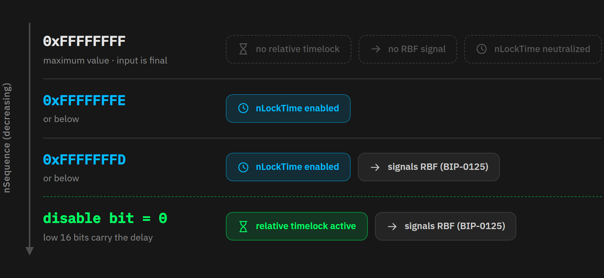

### `OP_CSV` 的作用

现在来看看 `CSV` 操作码在堆栈中会做什么。

当 `OP_CHECKSEQUENCEVERIFY` 在堆栈中运行时，如遇以下几种情形，它会让脚本求值失败：

- 堆栈是空的（该操作码必须从栈顶读取一个数值，拿它来比对，如果堆栈空了，那就没有东西来比对了），
- 栈顶的数值是负数（时间锁不可能具有负的等待时延，这完全没有意义），
- 交易版本号为 1，也就是没有相对时间锁机制（共识规则仅在版本号为 2 及以上的交易上将 `nSequence` 理解为时间锁，在版本号为 1 的交易上不会执行时间锁，也就是 `CSV` 拒绝验证一种不存在的保证），
- 输入的 `nSequence` 设置了禁用标签，也就是，这个输入声明不使用相对时间锁（已经作了这样的声明，就无法对它应用任何时延），
- 脚本中时间锁的类型（区块数量或钟表时间）与 `nSequence` 数值类型不匹配（将区块数量与秒数作对比没有任何意义），
- 写入脚本的锁定时间数值超过了 `nSequence` 字段的数值（这就是时间锁的核心：输入必须声明一个大于等于脚本所要求的时延，否则就是提前花费了）。

相反，如果放在脚本中的数值携带了一个禁用标签，那么 `CSV` 就完全不会检查任何东西，其动作跟普通的`OP_NOP` 没有区别。这是一种专门留下、以备未来可通过软分叉加以变更的空间。

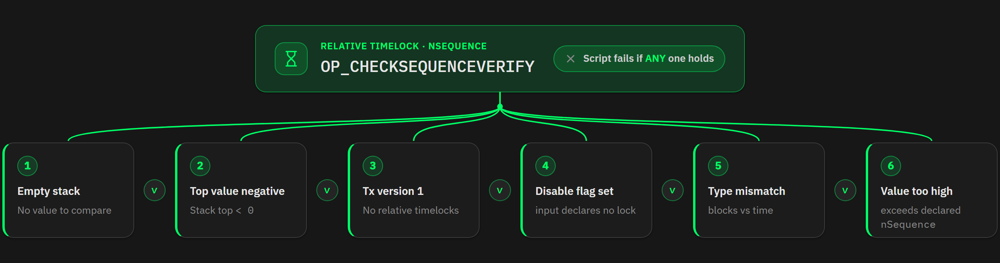

## `nSequence` 和 `nLockTime` 的历史

现在，它们的机制都已经讲清楚了，我想转过来讲讲它们的历史，因为这会告诉我们比特币这个系统的许多怪癖。这两个字段并不是为它们今天的用途而设计的，它们都经过重新设计。

最初，检查一笔交易的确定性会用到一个 `IsFinal` 函数。一笔交易会在以下两个条件满足其一时被判定为确定的，因此可以立即打包进入区块：

- 其 `nLockTime` 数值为 0 ，或者指向刚刚过去的时间，
- 其所有输入的 `nSequence` 字段都携带了最大数值，即 `0xFFFFFFFF` 。

因为那时候的钱包软件会默认为 `nSequence` 设置最大值，所以 `nLockTime` 会完完全全被直接忽略掉。因此，一笔交易可以显示出一个绝对时间锁，但又能立即得到确认，它产生的钱币也可以立即再次花费，就像时间锁从未存在过。

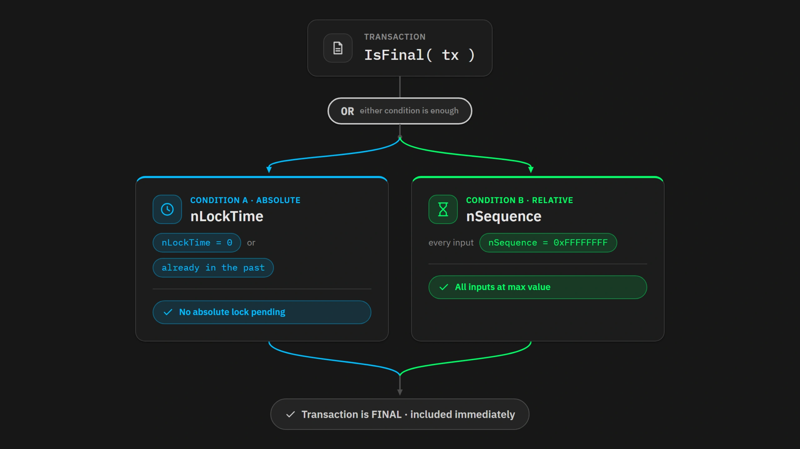

在区块链上就能找到这样的踪迹。一笔交易，其 `nLockTime` 设为区块高度 `198,370` ，但它的唯一一个输入设置了 `nSequence` 值为 `0xFFFFFFFF`，所以，提前 11 个区块（在区块高度 `198,359`）就被挖出了。这是它的 TXID：

```
13e100dd08b6da0a7426ea520b0bb3ae54cef79dd045e2e4f7116023df3a5c95
```

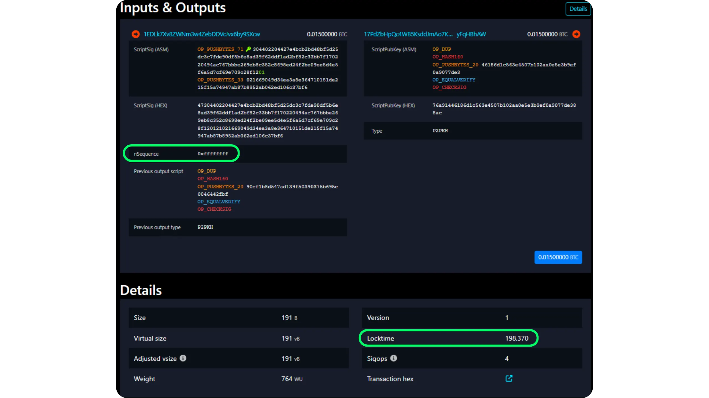

<p style="text-align:center">- 图片来源：<a href="https://mempool.space/tx/13e100dd08b6da0a7426ea520b0bb3ae54cef79dd045e2e4f7116023df3a5c95">mempool.space</a> -</p>


> 顺带说一句，`nLockTime` 也并不一直有相应的共识规则。在比特币刚刚诞生的时候，它只是一项 “标准性规则”。节点确实会拒绝转发或者挖出还没 “成熟” 的交易，但也会接受包含了这样未成熟交易的区块。换句话说，矿工可以强制包含一个还在时间锁定期的交易，这样的区块也完全是有效的。中本聪通过一次软分叉修复了这个问题。这项修复是在 2009 年 11 月的 0.1.6 版本中发布的，新规则从区块高度 `31,000` 开始具有约束力；2009 年 11 月 22 日，网络达到了该高度。

为了理解这些奇怪的行为，我们必须回到中本聪的意图中。在最初的协议中，一笔交易并不是一个冻结的对象：它可以被一个更新的版本替代，只要它满足两个条件：其 `nLockTime` 解锁时间还没到；其输入的 `nSequence` 数值还能再增加。这背后的想法是， `nSequence` 可以给同一笔交易标记出多个连续的版本，这就是它的名称 “sequence（序列号）” 的由来；至于 `nLockTime` ，则设定截止时间，一旦达到该时间点，最新的版本就被当成最终确定的版本。因此，一笔交易在越过其 `nLockTime` 截止时间之后，或者其所有输入的序列号都已达到最大值的时候，就被当成确定的、不能再更改的了，因为无法再通过递增序列号来替换旧版本。

在共识层面，确定版本的交易可以进入区块。而在节点的交易池条款层面，还没确定的交易也被接受进入交易池，已允许替换操作。只不过，相应的交易池替换规则，其实从未开发出来。节点只是被期待会保存这些未确定的交易，直到截止时间到来，或者直到其一个所有输入的序列号都已设为最大值的版本到来，从而它们变成可以打包的交易。但没有机制来激励矿工保留这些未确定交易到交易池，并且事后证明，这种逻辑与 DoS 抗性是无法调和的，因为它相当于允许无成本地用无限数量的交易来轰炸网络。那时候交易池还没有体积限制，保留这些可以无限替换的交易会给节点的内存带来沉重的负担。因此，这种最早的机制被中本聪自己在 2010 年关闭了，在 Bitcoin 软件的 0.3.12 版本中。

于是，只剩下一个没了用途的 `nSequence` 字段，以及一条孤立的共识规则：“如果所有输入的序列号都是 `0xFFFFFFFF`，那么这笔交易就被当成确定的。” 这条规则从未移除。要移除它，就需要一次硬分叉而且几乎不会带来任何好处。这就是 `nLockTime` 如何从最初的一种允许替换的截止时间，变成实际上的绝对时间锁：你只需让至少一个输入的序列号小于 `0xFFFFFFFF`（通常使用 `0xFFFFFFFE`），就可以让它恢复全部含义。

至于 `nSequence`，它被回收利用了两次。第一次是 BIP-0125，建立了一种新的 RBF 机制；第二次是 BIP-0068，于 2016 激活，在共识层面给了它新的含义：相对时间锁。

## 对比：绝对时间锁 vs. 相对时间锁

在下表中，我提供了关于这两种时间锁的最终比较，也是在讲解 Liana 的选择之前的回顾：

|                    | 绝对时间锁（日历预约）             | 相对时间锁（沙漏）                    |
| ------------------ | ---------------------------------- | ------------------------------------- |
| 原理               | 在某个时间点之前不能花费           | 在收款之后的一段时间内不能花费        |
| 参照点             | 固定的瞬间                         | 被花费的钱币的诞生时刻                |
| 交易字段           | nLockTime                          | nSequence                             |
| 脚本操作码         | `OP_CHECKLOCKTIMEVERIFY`（`CLTV`） | `OP_CHECKSEQUENCEVERIFY`（`CSV`）     |
| 携带者             | 每笔交易携带一个                   | 每个输入携带一个                      |
| 最大锁定时长       | 大约 9500 年，不实用               | 65535 个区块（大约 15 个月）或 388 天 |
| 在钱币移动时重设？ | 否                                 | 是                                    |

最后补充两点。

首先，时间单位不能混用，其原因完全是结构性的。`nLockTime` 只是一个字段，整个交易都共享，而`nSequence` 是每个输入都有一个。因此，一笔交易只能携带一个绝对时间锁数值，并且只能使用一种数值类型，要么是区块高度，要么是日期。如果 Alice 持有两个钱币，一个用 `CLTV` 和区块高度锁定，另一个使用 `CLTV` 和日期锁定，那么她不能在一笔交易中同时花费这两个钱币，因为没有第二个 `nLockTime` 字段。所以，基本上我们总是使用区块高度来指定绝对时间锁。

另外，因为平均来说 10 分钟会挖出一个新区块，以区块数量来表达时延并不是绝对精确的，只是平均而言。一年时间大致相当于 52,560 个区块，但挖出这么多区块实际经过的时间，可能会（与一年）相差几天，端看区块生产的节奏。在现实中，对于用户关心的长期用途来说，这不是什么问题。

## Liana 钱包使用哪种时间锁？

Liana 一款基于 Miniscript 的比特币钱包软件；Miniscript 是一套框架，让你可以清晰地编写高级的花费条件、结合两种花费路径到一个钱包中：

- 一个主要路径：立即花费，没有时间条件，用于日常管理。
- 一个或更多复原路径：仅在一段时间无动作之后才能激活的条件。这是用户的备用路径。如果他们失去了使用主要路径的办法，或者身故，那么一个备用密钥可以使用不同于主要路径的花费条件，在经过时延之后取走资金。


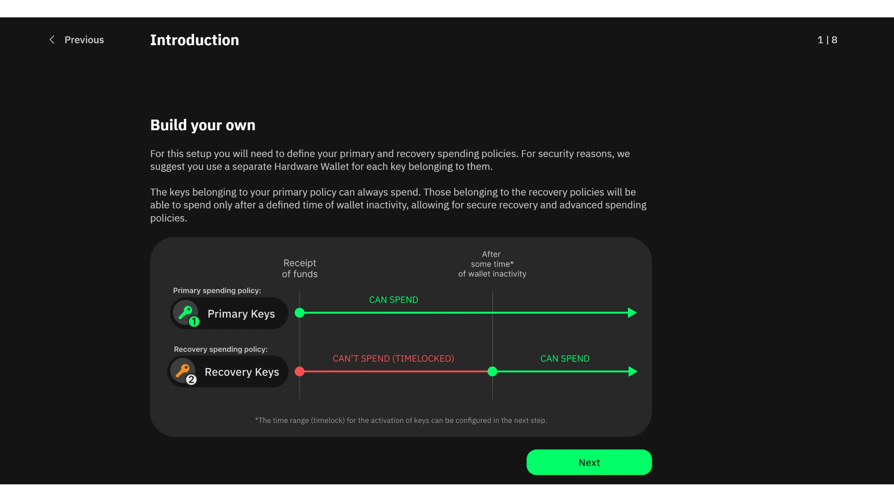

问题来了：为了将一段时间无动作作为激活条件，需要相对时间锁还是绝对时间锁？

### 一段时间无动作正是相对时间锁

”无动作/不活跃（inactivity）“ 是什么意思呢？Alice 希望自己的备用密钥仅在她的比特币停留一年未转移的前提下可用。只要她适时地移动钱币，这个复原路径就会保持关闭。当她停止转移时，倒计时就会一直走到终点。

这就跟沙漏的原理一摸一样。使用相对时间锁，每个钱币都从诞生的时刻开始为期一年的倒计时，只要 Alice 还在使用自己的钱包，哪怕只是把钱币左手倒右手，也会创建新的 UTXO、重置沙漏：复原路径永远不会激活。这就是我们说的 ”刷新“ 时间锁。当 Alice 弄丢她的主密钥，或者不再能够签名时，钱币不再移动，沙漏最终会漏尽，那么一年以后，（比如说）她或她的继承人可以通过复原路径拿回资金。

### 为什么不使用绝对时间锁？

绝对时间锁会在创建脚本的时候设定一个日期，就此生效。它不管 Alice 有没有活动，只关心那个到期日。为了编写 ”最后一次活动的一年以后“ 这样的条件，你必须在创建脚本的时候就知道最后一次活动的日期，但谁能预测呢？Alice 能做的充其量是设定一个固定的日期。但事情就此变得复杂起来。

首先，要选择哪个日期呢？永远不可能预料钱包的主人什么时候会身故，也不可能预料什么时候会弄丢密钥。一个非常遥远的日期，比如 40 年以后，确实能保证复原路径不会太早激活，但如果 Alice 明天就出了意外，她的继承人也许就要等待 40 年，才能拿到这些钱。较近的日期，比如一年以后，能够应对这种情形，但很快就会到来，然后迫使你从头创建钱包。没有好的固定日期，正是因为我们尝试应对的事件是不可预测的。设定一个较短的无动作时延并定期刷新，要有用得多，而这正是相对时间锁的作用。

然后，如果使用绝对时间锁，保护措施就不是均等的。如果 Alice 在 2031 年 12 月 30 日收到一笔支付，但时间锁到期日是 2032 年 1 月 1 日，那么这个钱币两天之后就激活备用路径了，而一个 3 年前收到的支付将扣住备用路径很多年。这样一来，说时延也就没有什么意义了，因为它就是一个设定到一个日期，到了日期就解锁，根本不管支付是什么时候到达的。相反，相对时间锁会给每一个钱币设定同样长度的时延，从收款的时间开始计算，不论它是今天收到的，还是五年后收到的。

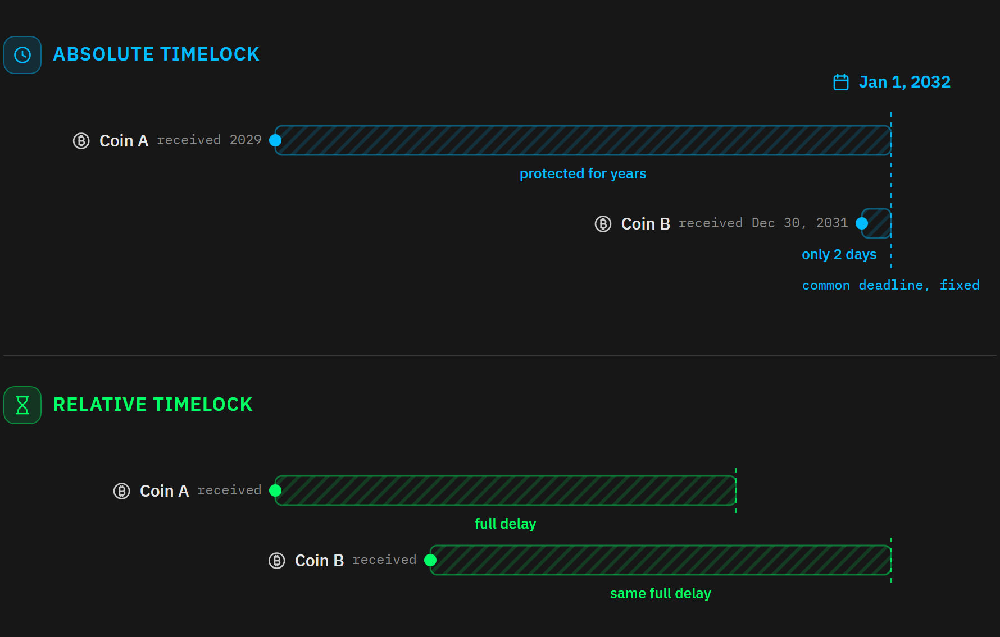

最后，管理一个绝对时间锁钱包既麻烦，又危险。刷新一个相对时间锁是非常简单的：Alice 将资金转移到钱包的某一个地址，然后倒计时就自动重置，钱包的描述符不必改变。同样的脚本可以无限期服务。但是，一旦越过了一个绝对时间锁的解锁时间点，就意味着要构造一套新脚本、也就是生成新的描述符、新的钱包备份；每当解锁，就要从头来一遍。然后，你的钱包会越积累越多，你甚至无法禁用，因为比特币不提供禁用旧钱包的办法。一旦你弄丢一个描述符备份，就用可能因为重复使用 xpub 而摧毁自己的隐私性，等等。每一次变更脚本，都是一次犯错的机会；一直使用一套脚本，就没有这样的机会。

（译者注：作者的意思是，一个钱包中的诸多地址是用同一个地址描述符派生出来的，而当前的 Miniscript 决定了，这许多地址只能使用相同的绝对时间锁；如果想要使用不同的时间锁，就只能生成另一个钱包，从而增加备份的复杂性和犯错的机会。）

这并不是说绝对时间锁毫无用处，也不是说 Liana 绝对不会用它。未来的版本很有可能会提供基于它的特性。但那需要多得多的用户体验设计，来抵消我们看到的这些缺点，而这些工作还没完成。

还要说明的是，在我们这个案例中，绝对时间锁面对相对时间锁的唯一优势，不在于其工作方式，而在于它可以锁定的时间。这就是为什么扩大相对时间锁的可用数值范围能够带来好处。[这部分讨论已在进行中](https://delvingbitcoin.org/t/exploring-extended-relative-timelocks/1818)。

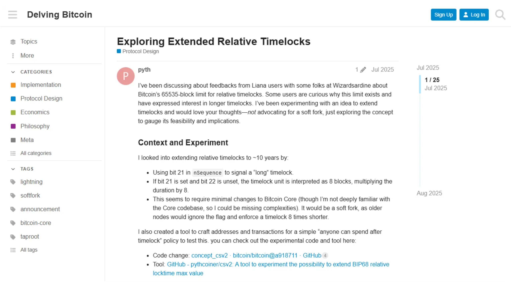

（完）