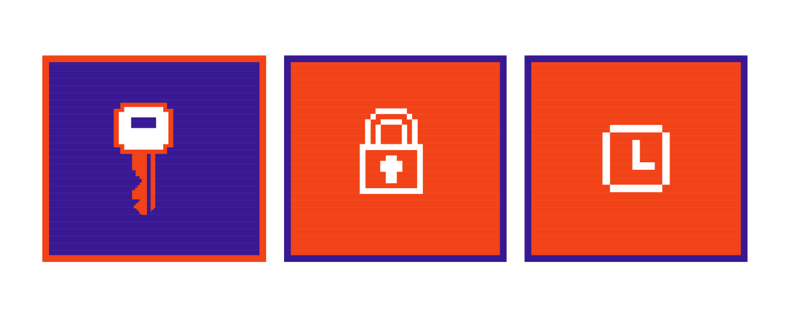
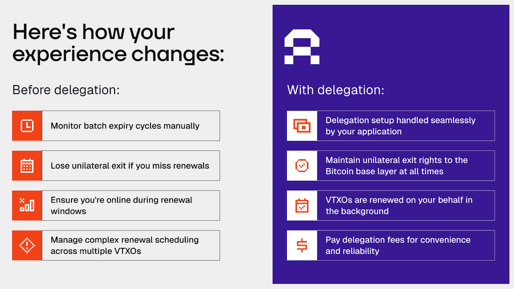
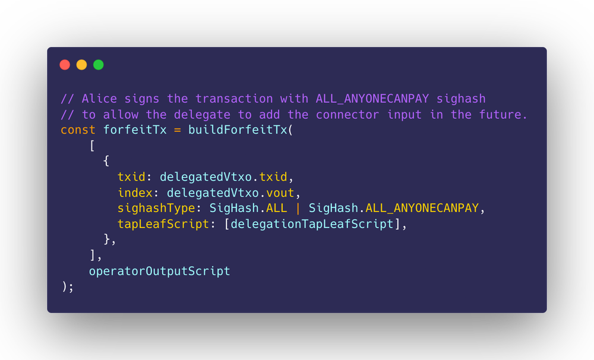

> *作者：Veronika & Alex B.*
> 
> *来源：<https://blog.arklabs.xyz/adios-expiry-rethinking-liveness-and-liquidity-in-arkade/>*

[Arkade](https://arkadeos.com/?ref=blog.arklabs.xyz) 的 “[批量过期](https://docs.arkadeos.com/learn/security/liveness?ref=blog.arklabs.xyz#user-liveness-vtxo-expiry)” 机制在流动性管理中扮演着重要角色。定期刷新 [VTXO](https://docs.arkadeos.com/learn/background?ref=blog.arklabs.xyz#batch-settlement-and-virtual-utxos-vtxos) 允许在系统中高效调配资源。活跃的用户支付与货币的时间价值成比例的手续费。

在基于 [Ark](https://docs.arklabs.xyz/ark.pdf?ref=blog.arklabs.xyz) 协议的系统中，[运营者](https://docs.arkadeos.com/learn/architecture/roles?ref=blog.arklabs.xyz#arkade-operator)提供[承诺交易](https://docs.arkadeos.com/learn/architecture/components?ref=blog.arklabs.xyz#onchain-anchoring-via-commitment-transactions)所需的资金；而过期机制保证了这些资金不会永远锁定在不活跃的 VTXO 中。当 VTXO 们过期的时候，运营者会清扫其中的资金，然后重新部署这些流动性、为新发生的需求服务。这是一种市场驱动的方法，既能保证系统在经济上是可持续的，又能优化流动性的定价。

**然而，过期机制要求用户定期刷新自己的 VTXO，以保持[单方退出](https://docs.arkadeos.com/learn/security/unilateral-exit?ref=blog.arklabs.xyz)权利，这就对用户提出了活性（在线）要求**。错过刷新周期意味着过期的 VTXO 会被运营者清理，而且，即使用户能复原自己的资金，他们也失去了在链上强制执行所有权请求的能力。

对于习惯了 “设置好就可以忘了它” 式自主保管的比特币用户来说，这似乎是一种倒退。虽然真实的风险也常常被夸大了，这种主动管理责任也是开发者和用户评价 [Arkade](https://arkadeos.com/?ref=blog.arklabs.xyz) 时候的一种重要考量。

当前的解决方案要求为不同的操作平台定制策略，其中一些平台会更可靠。浏览器有时候会限制原生应用可以使用的后台执行环境。“服务工作者（service workers）” 为后台处理提供了新方法，但依然受制于用户的许可和浏览器安全模型。在移动端，静默推送通知可以唤醒应用、在后台参与刷新流程，并持久保留后台执行语境。

服务器为计时工作和计划好的任务提供了最大的灵活性。我们的专用闪电应用 [Fulmine](https://github.com/ArkLabsHQ/fulmine?ref=blog.arklabs.xyz) 在后台支持自动化的 VTXO 生命周期管理。

在此基础上，我们开发了一种完全不同的方法，为管理 VTXO 的生命周期开启了一个全新的设计空间。

**今天，我们要介绍这种新的框架以及一个全新的 VTXO 管理原语**。

## 委托：抽象掉过期管理

委托让用户可以授权第三方来代表他们刷新 VTXO，从而开启了流畅的刷新体验，同时消除了关于错过刷新窗口的顾虑。在此过程中，用户依然保持对自己资金的完全单方控制权。利用委托机制，应用开发者可以完全抽象掉批量超时管理，创建与现有的自主保管应用一样的用户体验。

关键的突破是启用了一种流动和模块化的信任模式。用户可以从完全单方控制模式迁移为实用的代理后备模式，并且，这种后备模式是容易用轻量级的基础设施来管理的。所有东西都是通过应用层的逻辑和智能客户端的动作来实现的，不需要协议作任何变更。就像 Arkade 已经允许用户基于自己的需要、在预先定义的速度和[比特币的终局性](https://docs.arkadeos.com/learn/security/transaction-finality?ref=blog.arklabs.xyz)之间作出选择，委托只是将这种机制延申到了 VTXO 的生命周期中。

委托也创造了天然的经济激励兼容性：代理员凭借可靠的服务来赚取手续费，这能够激励高质量的基础设施出现、配合多种多样的信任模式，从 “熟人老张” 到专用的服务供应商。

用户可以配置多个代理员，也可以混合代理与手动刷新，从而确保任何一个代理员失败时都有优雅的后备措施。代理机制将刷新从一个要求实时协作的主动交互过程转变为一个流水线化的补给过程。用户只需给自己的代理员提供下一个意图和弃权交易，代理员就能自动化地处理所有刷新协作。

这让应用开发者、企业和金融服务能够提供代理服务，作为他们现有的比特币基础设施的一部分，创建围绕可靠服务、手续费和服务质量的竞争市场。

用户也可以运行自己的代理基础设施、在自主托管和便利性之间选择满意的状态，从而保持完全的自治。

## 委托机制如何工作

委托机制来自于一种我们称为 “**Arkade Intents**” 的协作原语。它们是比特币原生的所有权证据，支持详尽的多方协调而无需占有权的转移。Aakade Intents 是在我们最近发行的 [v0.7.0](https://github.com/arkade-os/arkd/releases/tag/v0.7.0?ref=blog.arklabs.xyz) 中加入了，该版本大大提升了 Arkade 的协作能力。

### Intent 系统

Aakade Intents 使用 [BIP322](https://github.com/bitcoin/bips/blob/master/bip-0322.mediawiki?ref=blog.arklabs.xyz) —— 标准化的比特币消息签名协议 —— 来创建所有权证据，用于登记包含在下一笔承诺交易中的输入。当你希望参与一次批量结算的时候，就创建一个 Intent，证明你的输入（VTXO、UTXO 或其他资产）的所有权，并注明你想收到的输出。通过将这个过程集成到比特币的交易格式中，我们可以使用与花费比特币时相同的逻辑来验证一个脚本的所有权 —— 每个输入都只需要一个有效的 witness 堆栈。

以下是基本的流程：

1. **VTXO 建立**：当你创建一个带有委托功能的 VTXO 时，它会有多个花费路径

   - A + S （你 + 服务商）：正常花费路径
   - A + CSV （退出路径）：在一个相对时间锁过期之后，你可以单方面退出
   - A + B + S（你 + 代理员 + 服务商）：委托路径，需要三方签名

2. **Intent 预授权**：你创建并签名一条 Intent 消息，指明你希望发生的操作（简化例子）：

   
   
   你使用 A + S 路径来签名这条 Intent 消息、证明所有权并指明希望放弃哪个 VTXO、创建一个什么样的新 VTXO 。你也可以提供一条使用 A + B + S 委托路径和 SIGHASH_ALL|ANYONECANPAY 模式来签名的弃权交易。
   
   这种特殊的签名类型允许你的代理员额外添加连接器输入，但不会允许别人改动你指定的输出。你将弃权交易输出的数额设置为你的 VTXO 的输出数额加上连接器数额。你的代理员会收到你的完整的 Intent 消息以及残缺的弃权交易 —— 这两者，代理员都无法改变，只能在你允许的时间内提交给服务商。
   
3. **协作执行**：当刷新时间到来时，你的代理员会提交你预签名的 Intent 给 Arkade 运营者，并代表你加入刷新队伍。运营者会从用你的 Intent 来验证刷新时机、所有权证据和输出说明。你的代理员会收到来自运营者的一个连接器输入、将它放到你的弃权输出中，然后用 SIGHASH_ALL 模式签名、再提交给运营者。

   你的代理员也会参与交易树签名、提供一个用于批处理协作的公钥。一切都会原子化解决：你的旧 VTXO 会被花费掉、你的新 VTXO 会被创建出来，就像你的 Intent 所指定的那样，你的代理员会赚到手续费，而运营者协调整个批量更新流程。

- 一个安全的协调框架 -

**预先承诺的结果**。你的 Intent 是对你希望创建的输出的密码学承诺，而你给代理员的支付也是直接编码在 Intent 输出中的。你的代理员只能控制你收到刷新 VTXO 的 *时机*，而不能控制你会收到 *什么* VTXO 。

**时间约束防止滥用**。你的 Intent 签名包含了严格的时间窗口。代理员只能在这些授权的时间内行动，而陈旧的 Intents 会被自动拒绝。

**你从来不会失去控制权**。每一个委托操作都要求你的签名，并且是预先通过 Intent 系统来提供的。代理员从来不能占有你的资金。不管哪一个环节出了问题，你都保留了通过个人退出路径单方面退出的权利。

**清晰的信任边界**。你需要相信自己的代理员会可靠地执行命令，而且运营者不会跟他勾结来改变输出，但你不需要信任他们来托管你的资金或者超出具体的执行角色。如果你的代理员没有行动，你总是可以单方面退出。

**预确认的信任模式**。委托刷新机制让你的 VTXO 处在一个预先确认状态，但不能提供比特币区块链的[终局性](https://docs.arkadeos.com/learn/security/transaction-finality?ref=blog.arklabs.xyz)。虽然委托机制提供了便利性、降低了活性要求，刷新的 VTXO 依赖于跟 Arkade 的 “[虚拟交易池](https://docs.arkadeos.com/learn/architecture/components?ref=blog.arklabs.xyz#offchain-execution-in-the-virtual-mempool)” 相同的预确认安全性。从比特币层级的安全性保证来看，用户应该独立地参与批量处理。

## 超越委托

不仅委托解决了眼前的过期机制挑战，Intents 还解锁了比特币原生协作机制的更广大可能性。

Intents 为长寿命的链下合约打下了基础，比如安全保管（escrow）、时间锁支付和点对点贷款。以往，这些合约都有过期机制、迫使参与者要么在链上结算，要么重新开始。使用 Intents，同样的合约可以流畅地刷新、连续运营多个批次。这意味着，复杂的金融合约可以完全在链下存在并演化、保持自己原有的条款和条件，无需创建新的链上交易。

我们会在未来分享对这些高级应用的技术研究。委托代表着至关重要的第一步，证明了复杂的协作和高级的签名策略也提供可靠、健壮的用户体验。

**技术资源**：

- [Delegation system example code](https://github.com/arkade-os/ts-sdk/blob/delegate/examples/delegate.js?ref=blog.arklabs.xyz)
- [arkd v.0.7.0 release](https://github.com/arkade-os/arkd/releases/tag/v0.7.0?ref=blog.arklabs.xyz)
- [Intent system implementation](https://github.com/arkade-os/ts-sdk/pull/80?ref=blog.arklabs.xyz)
- [BIP322 specification](https://github.com/bitcoin/bips/blob/master/bip-0322.mediawiki?ref=blog.arklabs.xyz)

（完）