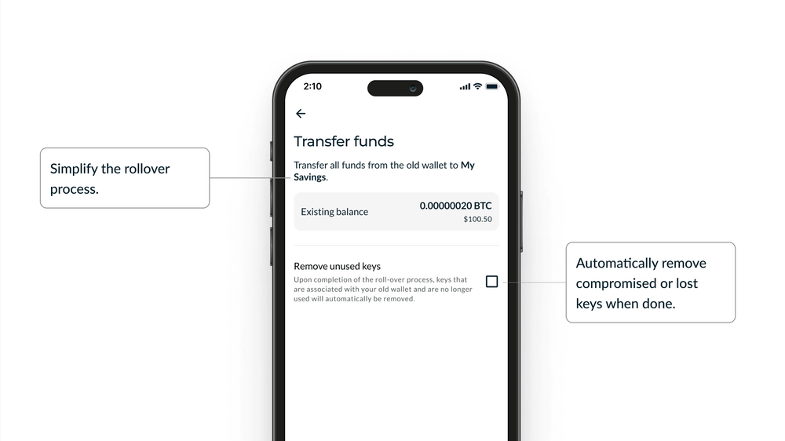
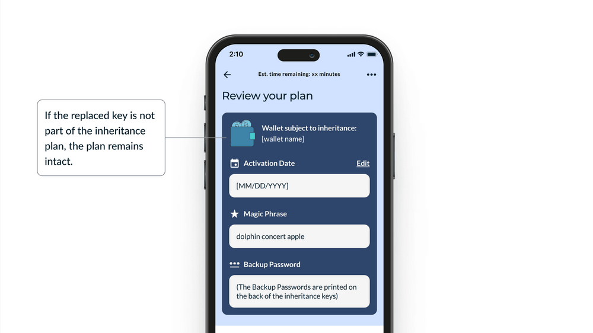

> *作者：Nunchuk*
> 
> *来源：<https://nunchuk.io/blog/key-replacement>*

多签名钱包（multisig wallets）已经成为保管比特币的黄金标准，因为它通过要求多个密钥来授权交易，提供了额外的安全层。不过，即使是最牢固的系统，也会 遇上挑战。今天，我们高兴地引入一个革命性的特性，它解决了比特币多签名钱包管理的最大痛点之一：密钥替换。

## 丢失密钥所带来的挑战

设想这样一种情形：你勤奋地搭建了一个多签名钱包来保管你的比特币储蓄；你将密钥分散到了多个地点、建立了遗产规划，并且对你的装置充满自行。突然，从未设想过的事情发生了 —— 你丢失了其中一个密钥。这可能会触发一连串使人倍感压力的事件：

1. 从头开始建立一个新的多签名钱包
2. 小心翼翼地生成和分散这组新的密钥
3. 将资金从旧钱包转移到新钱包
4. 更新你的遗产规划、还要通知所有的相关方

这个过程不仅十分消耗时间，而且很容易出错，尤其是在你面临精神压力的时候，可能会危及你持有的所有比特币。

## 无缝的密钥替换

我们很骄傲地展示我们的 “密钥替换” 特性，它是专为顺利地替换掉比特币多签名装置中的一个丢失或失盗的密钥而设计的。以下是它的工作流程：

1. **简单的初始化**：在你现有的多签名钱包的界面中，只需点击几下，就能发起密钥替换。

   

   -通过右侧的按钮选择要替换的密钥。记得保留其余未受影响的密钥-

2. **带有引导的新钱包创建**：我们的系统会带你走完创建一个新的多签名钱包的流程，保证你既替换了正确的密钥，又保持了你的多签名装置的完整性。

3. **准自动化的资金转移**：这是我们的特性真正亮眼的地方。一旦新钱包配置好了，我们的系统会自动准备一笔转账交易，将你所有的资金从旧钱包转移到你刚刚创建的新钱包。这个关键的步骤简化了流程，同时又保证了你的控制：

   - 这笔交易是自动创建和准备好的。
   - 你依然需要验证这笔交易，并使用现有的密钥来签名，从而保证你全程都完全掌控着自己的比特币。

   

   -简化迁移流程；在结束后，自动移除已经失盗或丢失的密钥-

4. **遗产规划维护**（只适用于 “Honey Badger” 和 “Byzantine” 服务客户）：对于我们的尊贵的 “Honey Badger” 和 “Byzantine” 钱包服务的客户，如果被替换的密钥不是你的遗产规划的一部分，那么整个计划就无需改变，从而尽可能减少向你的继承人或信托人更新和重新分发指令的需要。重要的是，我们的遗产规划特性是非 KYC 的，这使我们能够全程保护您的隐私。

   

   -如果被替换的密钥不是你的遗产规划的一部分，那么整个计划就无需改变-

## 压力最小化、安全性最大化

这个特性的好处在于，它将一种可能导致压力飙升的情形，转化为一个可控制、受引导的流程。通过帮助创建新钱包和准备资金转移交易，我们显著地减少了这个关键时刻的复杂性和出错可能。

我们的准自动化的资金转移特性是革命性的。它消除了传统的密钥替换流程的大部分压力。虽然你依然要签名交易 —— 保持你的安全性和控制权 —— 我们的系统会处理创建新钱包和准备转账交易的复杂部分。这个方案在用户便利性和绝不放弃比特币控制权的安全原则之间取得了平衡。

## 真实世界的好处

在以下情形中，我们的密钥替换特性的好处就会展现出来：

1. 丢失签名硬件设备：如果你的一个硬件签名器放错了地方，而它又存储着你的其中一个密钥，那么你可以在 nunchuk 软件钱包中迅速替换掉这个密钥，不会使你的整个多签名装置崩溃。
2. 失盗的顾虑：如果你担心你的其中一个密钥已经暴露，你可以迅速替换掉它，确保你的安全性，又无需面对麻烦。
3. 例行的安全更新：对于喜欢定期轮换密钥（作为一种安全习惯）的用户，我们的功能让整个过程流畅又没有压力。

## 未来的加强措施：高级的钱币控制

随让我们当前的密钥替换功能提供了一个流畅的程序来保护你的比特币，我们也一直在寻找增强你的隐私性和控制权的办法。我们的下一步是，在资金转移流程中，加入高级的钱币控制功能。

回顾以下：“[钱币控制](https://nunchuk.io/blog/coin-control)” 是管理比特币钱包隐私性的一个至关重要的工具。它让用户可以自己选择使用哪些 UTXO（未花费的交易输出）来创建交易，从而对花掉哪些 “钱币”、如何处理找零有着更强的控制。

当前，我们的密钥替换流程会将旧钱包的所有钱币都转移到新钱包的一个地址里面。这种方法固然效率高、节约手续费（因为它将需要发送的交易的数量降低到了极限）。然而，我们意识到，一些用户可能更倾向于隐私性或者可审计性的细粒度控制。

**即将到来的强化**：我们将在密钥替换流程中引入一个选项，保留你现有的钱币分割策略。这个强化将允许你在以下两者中选择：

1. 节约手续费选项：将旧钱包的所有钱币合并到一笔交易中（也即当前的模式）。
2. 保护隐私选项：将使用不同标签的钱币（集合）移动到新钱包的不同地址，从而保留你现有的钱币集合状态。

这种高级特性还提供了几个好处：

- 灵活性：用户可以按照自己的具体需要，选择尽可能节约手续费或者尽可以保持隐私性。
- 加强隐私性：通过保持钱币的分割，你可以继续隐藏你的钱包的全部余额和交易模式。
- 加强审计：对于为商业、个人和税务目的而分割钱币的用户，这种保护隐私的选项可以派上用场。

我们承诺会继续提升我们的服务，以满足比特币高级用户的不断变化的需要。钱币控制强化措施代表着我们的决心，要给你提供最高级的工具，让你可以安全、隐私、节约地管理你的比特币。

敬请期待我们在这一特性上的更新以及其它高级特性，因为我们会不断精进和拓展我们的比特币安全解决方案。

*（更新：在 2024 年 7 月 25 日，我们已经推出了[带有高级钱币控制的自动转移](https://nunchuk.io/blog/wallet-rollover)特性。）*

## 结论

在 Nunchuk ，我们致力于不仅要达到比特币安全性和可用性的行业标准，还要超越它。我们的新的密钥替换特性就是这一承诺的证明，它为加强比特币吃用着的安全性和用户体验提供了一个解决方案。

我们知道，管理比特币可能是令人畏难的，尤其是在意料之外的问题出现的时候。有了密钥替换功能，我们可以给用户提供一种工具，将可能的危机转化为可控的流程，保证你的比特币依然安全、可用，不管你正面临什么挑战。

（完）