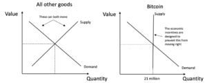
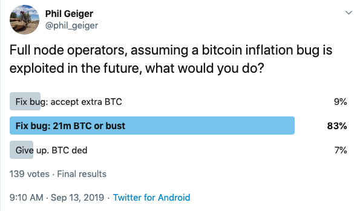
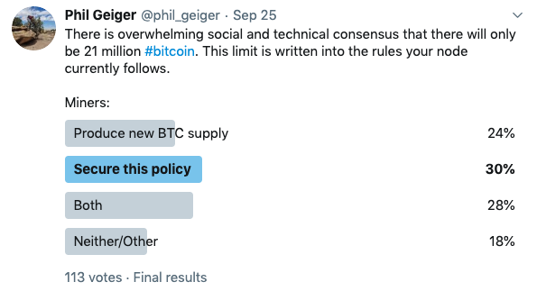

> *作者：Phil Geiger*
>
> *来源：<https://unchained.com/blog/all-21-million-bitcoin-already-exist/>*
>
> *本文首次出版于 2019 年。*

> *“货币量的每一部分都由市场经济的某一个成员持有。从一个成员的控制下转移给到另一个成员，货币的转移是迅捷且川流不息的。”*
>
> —— 路德维希·冯·米塞斯，《人的行动》

为庆祝第 60 万个比特币区块挖出（这使比特币的供给量达到 1800 万 BTC），也为了在欢庆活动上当一个更加风趣的人，我要解释一下 “2100 万 BTC 全部都已问世” 这个想法。这可能听起来像一个文字游戏，或者是一种小圈子黑话，但比特币是完全不同的物种，它要求我们仔细检查我们头脑中的假设，以及我们用来描述它的语词。如果能更清楚地定义比特币、解释它的工作原理，我们就能更准确地描述其货币化进程，这最终会帮助持币人向自己的家人和朋友介绍它。我们可以活着，并见证经济史上最大的事件 —— 一种稀缺的、非政治性的全球货币的迅速扩张。如果比特币能够存活，为我们的社区提供一种先发的竞争优势，可能会在长远的未来带来许多正面影响。

在比特币世界中，不当用词早已风行，例如 “钱包”、“地址” 和 “挖矿” 这样的术语。比特币的钱包更接近于一串钥匙，或者 公私钥的一个 生成/协调 工厂。比特币的地址也并不是我们希望用户重复访问的位置，跟现实世界中的地址以及电子邮件地址都完全不同。挖矿也有类似的不准确之处。我认为，这就是我们在分析比特币的时候，许多困惑的来源；同时也是许多围绕比特币的 FUD（利用怀疑来勾起的恐惧）着力的地方，因为对于新人来说，这些词很容易被错误解读，也极为让人困惑。

为了理解 “2100 万 BTC 全部都已问世” 这个想法，我们需要解释一些问题和假设。一个计算机程序能够持有 BTC 吗？为了发起一笔比特币交易，需要输入哪些东西？为什么人们会选择某一种交易方法，而不是另一种？什么什么，2100 万 BTC 就问世了？可得和不可得的供给量有何区别？

首先，我们要理解，比特币的供给量与另一种 “硬通货” 的供给量有何区别。我们先来比较比特币和另一种货币：黄金。

## 比特币的供给量 vs. 黄金的供给量

最准确的说法是，基于我们当前对物理学和化学的理解，宇宙中绝大部分黄金（AU 这种物质）的供给量都已经存在了，额外的增量来自于未来发生的核爆炸。

而黄金和比特币在供给量上的关键差别来自于我们探知其供应量的能力。由于[宇宙的膨胀](https://en.wikipedia.org/wiki/Expansion_of_the_universe)以及宇宙中速度上限（光速）的存在，人类没有办法估计黄金的总供应量，因为其存在位置是不可知的，有可能在非常非常遥远的地方有很多的黄金。

另一方面，关于比特币的总供应量，我们有非常强的社会和技术共识；而且我们还知晓被锁定的供应量的确切位置。事实上，我们对未来的区块 “存储” 着多少比特币的了解，比起当前已经解锁的供应量都分布在哪里，要多得多。我们完全知道，新发现的比特币区块的 “[coinbase 交易](https://blog.cex.io/bitcoin-dictionary/coinbase-transaction-12088)”将解锁多少 BTC，但我们没法知道现在是不是有某个百万币翁，正准备在某一刻卖出自己所有的比特币、换成另一种货币。

比特币会根据一个设定好的供给量日程表解锁，而且它是通过一个每 2016 个区块发生一次的难度调整程序来自动校正的，所以这个日程表能得到维持。这使我们能非常肯定地知道，当前还在锁定状态的 300 万 BTC 什么时候会解锁（具体的区块高度）；程度稍差一些但依然能非常准确地知道的是，什么时候这些比特币可以被私钥花费（按平均 10 分钟发现一个区块的速度计算）。难度调整就是利用个体经济激励来维持比特币自身增长的特性。通过让难度与网络的规模成比例，它阻止了人们创造更多的供应量，反而用人们的努力来提供网络的安全性。

理论上来说，我们可以知道地球上的所有黄金都存储在哪里，但我们没法准确知道什么时候能挖出它们、届时提取黄金的成本又是多少，也没法准确知道地球之外有多少黄金。因此，我们可以作一个假设：如果黄金变得足够有价值，我们可以，也必将找出一种办法、开采更多黄金，无论是在地球或地外星球上挖矿，还是利用核爆炸来生成。这都是由供给和需求决定的。不论什么商品和服务，只要需求变得足够高，都会提高人们增加供给的激励。

而比特币网络自身就等于 2100 万 BTC 的供给量。在 供给-需求 曲线模型中，它的供给量是一条垂线，意思是，它是完全没有弹性的。这个限制写在所有全节点运营者都选择运行的代码中，而且更重要的是，这是我们买下我们的第一笔比特币的时候全都同意的事情 —— 它得到了几乎全体一致的社会共识。在比特币的历史中，人们发现了多种会导致通货膨胀的[技术漏洞](https://hackernoon.com/bitcoin-core-bug-cve-2018-17144-an-analysis-f80d9d373362)，而且[有一个还真的被利用了](https://en.bitcoin.it/wiki/Value_overflow_incident)，但网络最终将这些交易认定是无效的少数派硬分叉，继续维持得到理解的供给量日程表，即使这需要节点运营者运行打过补丁的软件。合理预期，在未来我们还会发现这样的软件漏洞，网络还将不得不依赖于社会共识。幸运的是，比特币网络的激励都是围绕着在社会上和技术上维持这个 2100 万 BTC 限制而设计出来的。

- 全节点运营者都相当笃定这个 2100 万限制。这个问卷调查的结果将是比特币跟一种非主流币竞争，而后者显然可以命名为 “Bitcoin Inflation” -

至于黄金，则无法达成管理供应量的技术和社会共识。黄金只是一种元素，没办法知道什么时候会挖出黄金、如何挖出黄金、以哪一种数量单位得到使用。在黄金这个例子中，我们可以使用基于供给量的预测模型来度量未来的供给量。但我们无法知道宇宙中存在多少黄金，我们只知道在地球上增加多一些供给量有多难。我们也可以在需求保持相对稳定的前提下预估黄金的供给量会如何膨胀。

## 那要按你这么说，挖矿又算怎么回事呢？

在比特币中，人们有两种办法交易比特币。第一种办法是大多数人都知道并且喜欢的，基于私钥的身份验证。如果某人持有跟某个有资金的地址相关联的私钥，就可以通过公开发布来自这个私钥的签名来移动该地址内的资金，同时，交易中要包含手续费，以激励整个网络购买电力、处理交易。但首先，要想获得比特币，一定有某人在某个地方消耗了能量来获得 BTC。

第二种办法，就是以运行 [SHA-256 哈希算法](https://en.bitcoin.it/wiki/SHA-256)的形式，将电力卖给比特币网络 —— 这就是我们平时说的（错误称呼的） “挖矿”。

通过将尽可能便宜的电力转化为尽可能多的 SHA-256 哈希运算，这些比特币人会同时排序和提出待处理比特币交易的批次，并找出[在当时难度下这一批次交易（也即区块）的有效 SHA-256 哈希值](https://en.bitcoin.it/wiki/Mining)。如果你的 ASIC（专用型集成电路）可以在别人之前找出一个有效哈希值，并且该区块内的交易也都是有效的（可以通过全节点基于规则的验证），你就可以决定该区块的 [coinbase 交易](https://blog.cex.io/bitcoin-dictionary/coinbase-transaction-12088)，它包含了人们常说的挖矿奖励，以及该区块内的交易所提供的手续费，你可以把它发到任何你想要的地址。

那么，“矿工” 到底是创造了新的供给量呢，还是以 SHA-256 运算的形式花费电力、从而换来了人们早就知道的 coinbase 交易以及交易手续费呢？

- 还真是旗鼓相当。52% 的人认为矿工在某种意义上创造了供应量，而 48% 的人认为他们没有。很可能是因为这个调查的用词不妥当 -

我个人认为，这是以个微妙但重要的区别，让我们可以权威地说，只有 2100 万 BTC 可能存在（不可能更多）。问题（某种程度上）在于每一个全节点运营者和持币人需要作的个人决定。节点运营者个人并不能定义什么是比特币、什么不是，他们只能验证一笔比特币是不是真的存在，而他们个人要么在共识之中，要么在共识之外。那么，当我们到达 63 万区块高度、发生下一次区块奖励减半时，你的全节点会接受 12.5 BTC，还是只接受 6.25 BTC？

我的节点会拒绝任何尝试花费不遵守供给量日程表的 coinbase 交易的区块，因为根据我认可的社会和技术共识，这就是一笔无效的比特币交易。在个体组成的分布式网络中，每个人都作出这样的个人选择，市场最终会决定哪一种货币是比特币；而截至今日，市场已经客观地将比特币的数量限制设定为 2100 BTC。

## 如果一台计算机在森林里孤独地运算哈希值，谁会在乎？

将电力转化成 SHA-256（或任何其他算法）哈希值，这本身时没有生产力的活动，除非它服务于一些有价值的目标。为了比特币网络，将电力转化为哈希值，就是有生产力的，也是有利可图的，因为比特币持有者为使用电力保护网络出了价，只要 “矿工” 遵守了持币人和全节点运营者的共识所确定的规则。

对于有兴趣向网络出卖用于哈希计算的电力、以换取获得 coinbase 资金和交易手续费的机会（也即挖矿）的个人来说，只有少数规则是绝对固定的。其中最重要的规则就是只有 2100 万 BTC。下一个规则就是，coinbase 交易中的 BTC 数量，会从 2009 年的 50 BTC 开始，每挖出 21 万个区块就降低一次，直至 2140 年，所有的比特币都可被私钥花费。在此之后，用于哈希计算的电力将只能买到获得 “交易手续费” 的机会，而交易手续费就来自使用私钥发起交易、广播交易的用户。

对 “矿工” 来说，幸运的是，难度调整保证了总有一些人能从向网络出售电力而获利（哈希运算效率最高的那些人）。如果某个矿工在长期中无利可图，他就必须作出选择，要么关停自己的业务（可能要在二级市场上卖掉自己的硬件），要么找出更便宜的电力来源。要是很多 “矿工” 都无利可图，关掉了自己的机器，那么网络的哈希速度会下降，找出新区块的时间将长于 10 分钟，然后难度调整算法就会将难度重新校准为适应新的、更低的哈希速度，从而维持供给量日常表（平均而言）。结果是，比特币网络将不断调准自身，基于网络的价值，为转化成哈希运算的电力支付市场价格。如果某个矿工在向比特币网络卖出电力时是无利可图的，这仅仅意味着他被其他更高效的 “矿工” 击败了。

给定这些绝对严格的网络规则，聪明的 “矿工” 会很快意识到，如果他们能让电力成本趋近于零，比如说自己来发电并决定是否要用在别的用途种（或是为比特币网络运算哈希函数），他们就可以永远卖出运行哈希计算的电力而有利可图。

## 货币的价值重要，但有多少数量不重要

> *“必须指出的是，货币的总存量水平，与一单位货币的价值水平，在考虑使用这种货币能得到什么好处的时候，是完全没有意义的。社会总是在享用使用货币所能得到的最大好处。即使社会一同抛弃了一半的货币，货币所产生的效应也将与存量保持不变时相同；甚至即使货币单位的价值的变动并不与货币存量的变动成比例，也依然是如此。”*
>
> —— 路德维希·冯·米塞斯，《货币与信用理论》

在中本聪找出比特币的创世区块、哈尔·芬尼以及朋友们开始参与网络之后，根据代码（以及，更重要的，社会共识）中设定的规则，全部 2100 万 BTC 就在一个 “大爆炸” 的时间立即问世了。每一位拿运行哈希计算的电力交换 coinbase 交易的早鸟都获得了大量比特币的私钥访问权（在当时并没有价值），同时理解了规则：未来的持币人和 “矿工” 可以通过发送电力来相互竞争、处理交易，从而获得被锁定的比特币供给量。

如此一来，我们就可以看到被锁定的比特币的价值，虽然它是分散的，是由网络的每一个成员平等拥有的。这个价值是由持币人按照市场价格支付给向网络提交电力的 “矿工” 的；而这个市场价格又由这些电力所保护的网络的价值来衡量。在 2009 年，比特币网络仅对少数几个人有价值，而且价值非常小，所以换得 50 BTC coinbase 资金所需的电力代价是非常低的。今天，获得解锁 12.5 BTC 的能力值得花费大约[每秒 100 兆次哈希运算的电力](https://www.blockchain.com/en/charts/hash-rate)。

每个加入网络的人，不论出于什么原因，都应该知道，截至 2019 年 10 月，其所获得的价值中大约 14%（300 万/2100 万）是由网络中的所有成员平等拥有的，只有为排序和保护交易提交有效的 PoW 才能取得这些价值。这从比特币诞生的第一天开始，就已经由供给量日程表决定了，而且在未来，向网络销售哈希化电力的经济激励也不会改变。难度调整机制从设计上就保证了，对于最高效的能源生产者来说，向比特币网络卖出最便宜的电力总是有利可图的。

曾有人猜测，机器和软件也可以持有比特币并用私钥来转移它。我则认为，我们已经有 11 年的经验证据，表明网络自身一直在持有和交易比特币，只不过不是用的私钥签名，而是用于哈希运算的电力。

重要的不是某人或者另一个人所拥有的比特币的数量。网络整体的价值才重要，而网络的价值只有在人么理解到比特币的货币属性是健全的，才能够增长。世上只有 2100 万 BTC。

## 全都存在，或全都不存在

比特币的创新在于人们可以用无国界、中立、免许可的方式获得绝对的稀缺性。这一创新对人类交互的所有方面都有惊人的颠覆作用，而且正是这种创新，驱动网络的价值不断增长。比特币与其 2100 万数量上限密不可分。它的供给量不可能是 2100 万 BTC 以外的水平，因为那将违背我们的认知，以及对其网络运行原理的理解，并且也将无法解决 “电子化稀缺性” 的问题。

比特币可以实现绝对稀缺性，是靠着这个网络架构，它被设计成在时间推移中逐步提高去中心化程度，并且主动地拒绝人类增加高需求商品供给量的欲望。不断提升的去中心化程度实质上将比特币总供给量的决定权众包给了整个网络的参与者，其基本假设是在一个由个体组成的去中心化网络中，当没有人可以征收铸币税时，他们不会贬值自己的货币。

因此，谨慎的全节点运营者，“矿工” 和持币人，都可以假设这 2100 万 BTC 的限制是不可谈判的。对这种颠覆性稀缺的知识会通过自由市场以及 “作为最终决定者的持币人” 网络逐渐传播开去，但整个实验依然依赖于数量限制所形成的坚实基础，以及人们可以遵循的清晰、中立、不可变更的规则。

因为我们自愿选择了这个网络，我们可以说，今天，2100 万 BTC 已然存在，因为网络共识所遵循的规则规定供给量日程表必须得到维持。可访问/不可访问 的供给量的唯一区别在于谁（或者说什么东西）当前持有比特币 coinbase 的价值，以及人们要如何竞争才能获得比特币，无论是由区块链跟踪的比特币（可以访问的），还是由区块高度、PoW 和难度调整决定的比特币（当前还不可访问的）。

电子化稀缺性是一个奇异的想法。由区块链跟踪的比特币最终来说只是一些 1 和 0，以及由经济激励所支持的数学函数。coinbase 交易中的比特币也是一样的。日程表卸载我们所运行的软件中，而且未来的区块不可能包含更多的 coinase 资金，因为社会和技术共识将认为它是无效的，并非比特币。

比特币是代码和社会共识的互动。你可以说，所有的比特币（2100 万 BTC）都已经存在，你也可以说，根本就不存在比特币。没有中间地带。

- - -

本文仅代表我的而个人观点，不代表 Unchained Capital 或者我的同事。感谢 [Parker Lewis](https://twitter.com/parkeralewis)、[Nolan Johnson](https://twitter.com/nolanbjohnson) 和 [Michael Goldstein](https://twitter.com/bitstein) 审核我的文章并给予我有价值的反馈。

（完）