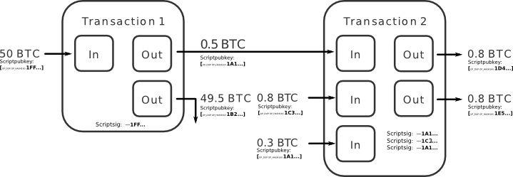
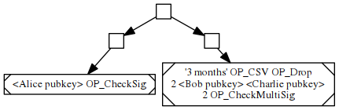
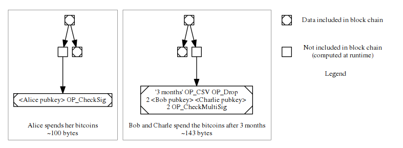
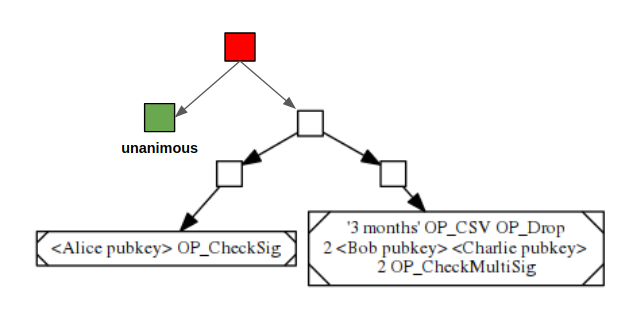
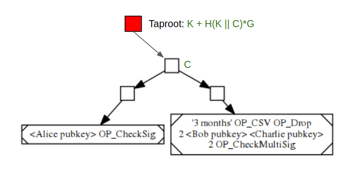
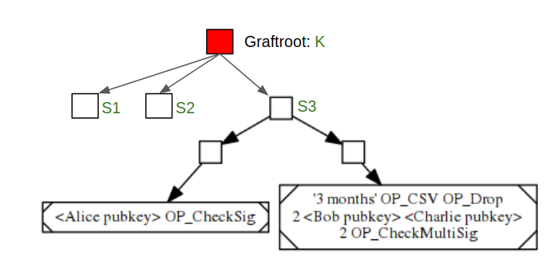

> *作者：Hongchao*
> 
> *来源：<https://hongchao.me/bitcoin-privacy/>*


本文首发于 2019 年 2 月 4 日

**太长不看**：比特币生来就不具备匿名性。增强比特币的私密性是比特币领域最热门的研究方向之一。虽然一些提案已经（或即将）被纳入比特币的[参考实现](https://github.com/bitcoin/bitcoin)，但是其余提案不是变成了山寨币，就是被全盘放弃。本文根据各项技术尝试隐藏的信息，为它们分门别类并逐一探究：

- 接收方：[HD Wallet](https://github.com/bitcoin/bips/blob/master/bip-0032.mediawiki)、[Stealth Address](https://github.com/genjix/bips/blob/master/bip-stealth.mediawiki)、[Resusable Payment Code](https://github.com/bitcoin/bips/blob/master/bip-0047.mediawiki)、[Coin Control](https://bitcoin.stackexchange.com/questions/37486/what-does-bitcoin-cores-coin-control-features-do-and-how-do-i-use-it) 等等
- 发送方：[中心化混币服务](https://en.bitcoin.it/wiki/Mixing_service)、[CoinJoin](https://bitcointalk.org/index.php?topic=279249.0) 及其变体、[CoinShuffle](https://bitcointalk.org/index.php?topic=567625.0)、[TumbleBit](http://cs-people.bu.edu/heilman/tumblebit/)、[Ring Signatures](https://en.wikipedia.org/wiki/Ring_signature) 等等
- 交易数额：多轮定额混币、[不定额输入混币](https://github.com/nopara73/ZeroLink/issues/74)、[机密交易](https://people.xiph.org/~greg/confidential_values.txt)，[Minblewimble](https://github.com/mimblewimble/docs/wiki/MimbleWimble-Origin)，等等
- 交易逻辑：[P2SH](https://en.bitcoin.it/wiki/Pay_to_script_hash)、[Merkle Branches](https://www.mail-archive.com/bitcoin-dev@lists.linuxfoundation.org/msg05991.html) (MAST)、[Schnorr 签名](https://en.wikipedia.org/wiki/Schnorr_signature)、[Taproot](https://lists.linuxfoundation.org/pipermail/bitcoin-dev/2018-January/015614.html)、[Graftroot](https://lists.linuxfoundation.org/pipermail/bitcoin-dev/2018-February/015700.html) 等等

[Dandelion](https://lists.linuxfoundation.org/pipermail/bitcoin-dev/2018-June/016071.html) 和[点对点加密](https://github.com/bitcoin/bips/blob/master/bip-0151.mediawiki)之类的网络层隐私技术不在本文的讨论范围内。另外，[Layer 2](https://en.wikipedia.org/wiki/Bitcoin_scalability_problem#"Layer_2"_systems) 系统为增强底层的隐私性带来了哪些好处，还有 [ZCash](https://z.cash/) 之类的技术也不会涉及。


比特币白皮书[有一节专门讨论隐私性](https://nakamotoinstitute.org/bitcoin/#privacy)，指出：

> *传统的银行模型通过**仅限**相关方和受信第三方访问信息**，**实现**了**一定程度的隐私性。由于所有交易必须公开，这种方法无法采用，但还是能够通过在其它地方中断信息流保护隐私性：保持公钥匿名。*

显然，比特币这么多年来从未达到人们所期望的隐私性。比特币交易包含 4 个敏感信息：发送方、接收方、交易数量和交易逻辑（写在[比特币脚本](https://en.bitcoin.it/wiki/Script)中）。上述信息全都广播至比特币网络并永远存储在区块链上，因为[验证一笔交易是否存在的唯一方式就是知道所有交易](https://twitter.com/francispouliot_/status/1075414899235409920)。在保护力度不强的情况下，记录一个交易的所有信息是否是知道这个交易的唯一（甚至是最佳）方法？这个问题尚存在争议。但是，由于所有交易在比特币区块链上都是透明的，假设 Alice 的真实身份因为某种方式与某个比特币地址绑定，那么涉及该地址的所有已发生和未发生交易都会失去隐私性。

在比特币系统中，大多数隐私技术都是为了混淆写入比特币区块链的一个或多个敏感交易信息。每个技术都做出了不同的取舍。评估这些技术时，你可以从以下几个方面进行考量：

- 去中心化，意味着安全性源于公开验证，后者往往与隐私性相悖。幸运的是，这种表面上的冲突并不一定是真实的，但是评估一项隐私增强技术是否会牺牲中心化依然很重要。
- 隐私性和可扩展性并不总能很好地结合在一起。很多隐私技术需要较多计算资源，在区块链领域会被显著放大，进而影响其可扩展性。还有一些隐私技术破坏了“[剪枝（pruning）](https://coinguides.org/bitcoin-blockchain-pruning/)”，导致用于验证新交易的数据库加速膨胀。幸好实际情况并非总是如此。
- 隐私技术会增加计算量和验证时间或导致用户之间的交互变得更为复杂，从而影响用户体验。无论一项隐私技术从理论上来说有多完美，如果用户体验差到没人愿意使用它，就根本无法产生任何现实价值。

接下来本文将分为四个部分：**接收方**、**发送方**、**账户**和**交易逻辑，**分别讨论相关的隐私技术。

## 接收方

### 分层确定性钱包（HDW）

假设 Alice 一直使用同一个比特币地址，且该地址因为某种方式与她的现实身份绑定，Alice 在比特币网络上的全部交易历史都将被公开。缓解该问题的方法之一是为每笔收款生成一个新的收款地址。如果 Alice 使用的是 [HDW](https://github.com/bitcoin/bips/blob/master/bip-0032.mediawiki)，实现该操作不仅易如反掌，而且会带来很高的安全性。这样一来，攻击者必须找出与 Alice 的身份相关联的所有地址，才能拼凑出 Alice 的交易历史。要做到这点[并非完全不可能](https://cseweb.ucsd.edu/~smeiklejohn/files/imc13.pdf)，但是难上加难。事实上，就比特币而言，使用新地址（包括找零地址）接收付款是[最佳做法](https://bitcoin.org/en/protect-your-privacy#receive)。

### 隐身地址（Stealth Address）

在电视或广告牌广告之类的场景中，生成一个新的收款地址并不可行，[隐身地址](https://github.com/genjix/bips/blob/master/bip-stealth.mediawiki)可能是一种解决方案。隐身地址的思路是在 Alice 公布其公钥后，想要向 Alice 付款的人需要获得该信息，生成并“支付给”一个新的公钥，而这个公钥的对应私钥只能由 Alice 生成。我们可以利用 [ECDH](https://en.wikipedia.org/wiki/Elliptic-curve_Diffie–Hellman) 协议来实现隐身地址。

假设 Alice 的密钥对是 **A=aG**，其中 **G** 是一条[椭圆曲线](https://en.wikipedia.org/wiki/Elliptic-curve_cryptography)上的基点，Bob 首先需要生成一个临时密钥对 **B=bG**。通过 [ECDH](https://en.wikipedia.org/wiki/Elliptic-curve_Diffie–Hellman) 协议，Alice 和 Bob 之间共享的秘密值是 **secret=bA=aB=abG**。然后，Bob 付款至根据 **A+H(secret)G** 生成的新地址，其中 **H** 是一个密码哈希函数。由于只有 Alice 知道 **a+H(secret)**，只有她能够花费新地址上的资金。

实际上，正如比特币开发者 Peter Todd [所言](https://lists.linuxfoundation.org/pipermail/bitcoin-dev/2014-January/004020.html)，Bob 需要通过额外创建一笔带有  **OP_RETURN** 输出的交易，将临时公钥 B 告知 Alice，以便 Alice 获得共享秘密值。但是，[Peter 随后又表示](https://www.reddit.com/r/Bitcoin/comments/5xm9bt/what_happened_to_stealth_addresses/dejcjmw)，由于 **OP_RETURN** 最后被改成仅能容纳 40 字节的数据，提出隐身地址的 BIP（BIP 63）未能发布。总的来说，隐身地址在比特币生态中采用率不高。[DarkWallet](https://www.darkwallet.is/) 似乎支持[隐身地址](https://github.com/darkwallet/darkwallet/blob/4c51dacacb8541305f1442ef7fa1628eb7c19a79/src/js/util/stealth.js)，但是该项目很少有人维护了。另外，[Monero](https://www.getmonero.org/) 和 [TokenPay](https://www.tokenpay.com/) 引入了一个[更加有趣的隐身地址版本](https://src.getmonero.org/resources/moneropedia/stealthaddress.html)，利用[双密钥隐身地址协议](https://medium.com/tokenpay/tokenpay-utilizes-dual-key-stealth-addresses-for-complete-anonymity-c5ae682ce879)将查看密钥和花费密钥分离。这可以用来让第三方查看交易历史，同时又不让他们有能力花费资金。

### 可重复使用的付款码

[可重复使用的付款码](https://github.com/bitcoin/bips/blob/master/bip-0047.mediawiki)协议试图将 [ECDH](https://en.wikipedia.org/wiki/Elliptic-curve_Diffie–Hellman) 协议和[分层确定性钱包](https://github.com/bitcoin/bips/blob/master/bip-0032.mediawiki)结合起来，达到与隐身地址相同的效果。

假如 Alice 和 Bob 想要进行私密交易却又不想一直向对方发送新地址，他们可以生成一个可重复使用的付款码，实际上就是[分层确定性钱包](https://github.com/bitcoin/bips/blob/master/bip-0032.mediawiki)的[扩展公钥](https://bitcoin.org/en/glossary/extended-key)。Alice 先通过通知交易（notification transaction）将她的付款码告知 Bob，然后 Alice 和 Bob 就可以共享由 [ECDH](https://en.wikipedia.org/wiki/Elliptic-curve_Diffie–Hellman) 协议生成的秘密值、并用在隐身地址中。

有了这个共享秘密值和彼此的可重复使用付款码，Alice 和 Bob 就可以各自生成一个新的分层确定性钱包，只有自己能花费其中的资金，但是可以为对方生成新的地址。这本质上就是在二人之间创建了一个秘密付款通道。

[Samourai](https://samouraiwallet.com/) 就是[支持](https://samouraiwallet.com/bips)可重复使用的付款码的钱包之一。

### 挑选款项（Coin Control）

如果同一个交易花费了两个输出，这两个输出通常为同一个人所有（除非是 [CoinJoin](https://bitcointalk.org/index.php?topic=279249.0) 之类的交易）。如果恰好其中一个输出被污染了，人们会认为另一个输出也被污染了。通过 [Core Control](https://bitcoin.stackexchange.com/questions/37486/what-does-bitcoin-cores-coin-control-features-do-and-how-do-i-use-it) 功能，用户可以选择使用哪个输出组合来创建交易，这会降低输出被意外污染的可能性。

很多钱包都支持 Coin Control 功能，包括 [Bitcoin Core 钱包](https://github.com/bitcoin/bitcoin/tree/master/src/wallet)。

## 发送方

为了混淆交易发送方，通常的想法是将真正的发送方隐藏在其他发送方或诱饵之中，让攻击者难以辨识真正的发送方。

比特币的一大重要洞见是，交易中的输入和输出是相互独立的，而且没有迹象表明输入和输出之间存在联系。因此，如果多个用户使用各自的输入和输出共同创建一笔交易，他们的资金实际上是混合在一起的。



<p style="text-align:center">- 图源：https://bitcointalk.org/index.php?topic=279249.0 -</p>


如上图所示，我们很难知道交易 2 的第一个输出是由第二个输入还是第一个和第三个输入合并支付的。

### 中心化混币服务（Tumbler）

一种方法是利用[中心化混币服务](https://en.bitcoin.it/wiki/Mixing_service)从用户那里获得资金，然后将它们与其他用户的资金 和/或 混币服务提供商自己的资金混合起来。如果是善意的混币服务提供商，等量资金（减去服务费）将通过新地址发送给用户。这个想法非常简单，但是其中心化特性意味着中心化混币服务面临着与银行和中心化交易所同样的问题。中心化混币服务有可能窃取用户资金，还有可能保留追踪资金来源的能力。在部分司法辖区，混合大额资金[可能是非法行为](https://en.wikipedia.org/wiki/Cryptocurrency_tumbler#Background)，而背后的中心化实体可能会面临更大的监管风险。

即使中心化混币服务值得信赖，也会有很多缺陷。一个例子是，如果待混合的所有[交易输出](https://en.bitcoin.it/wiki/Transaction#Output)的面额不等，泄露发送方身份的线索就会再多上一条。因此，最好将符合标准输入大小的交易混合，也就是说大额资金可能需要经历多轮混合，用户体验极差（公平地说，这个问题并非只有中心化混币服务才有。如果没有采取机密交易（[Confidential Transactions](https://people.xiph.org/~greg/confidential_values.txt)）之类的措施来隐藏交易额，去中心化混币服务也会面临这样的问题。）《比特币和区块链技术（[Bitcoin and Blockchain Technologies](https://d28rh4a8wq0iu5.cloudfront.net/bitcointech/readings/princeton_bitcoin_book.pdf)）》的第 6.3 节《混币》详细讨论了中心化混币服务的其它一些潜在实现问题，以及如何为用户提供更优质服务的指导，例如，多轮混币。

尽管如此，[bestmixer.io](https://bestmixer.io/en) 等中心化混币服务对于某些威胁模型和风险状况的人来说依然有用。[大多数决定混币的用户](https://medium.com/@nopara73/traditional-bitcoin-mixers-6a092e59d8c2)还是会选择中心化混币服务。

### CoinJoin

[CoinJoin](https://bitcointalk.org/index.php?topic=279249.0) 由比特币开发者 [Greg Maxwell](https://github.com/gmaxwell) 于 2013 年提议，能够消除第三方盗窃风险。

若要创建一个 CoinJoin 交易，一组用户需要通过某种方式找到彼此，可能会借助于一个中心化发现服务。然后，用户开始互相交换输入和输出。一旦所有输入和输出收集完毕，任何用户都可以使用它们构建未签名版本的交易并发送给所有用户签名。一旦交易经过所有用户的验证和签署，就会在全网广播。

与中心化混币一样，重点还是在于确保所有输出面额相同。CoinJoin 的缺点之一是需要大量用户交互，这不仅会损害可用性，还容易遭受[女巫攻击](https://en.wikipedia.org/wiki/Sybil_attack)。例如，攻击者可能会潜入用户群，尝试洞悉输入和输出之间的关联。即使输入和输出是基于匿名通信协议（如 [Tor](https://www.torproject.org/)）进行交换的，如果攻击者还控制了用户群中的其他“用户”，他们依然可以缩小匿名集。还有可能发生 [DoS](https://en.wikipedia.org/wiki/DOS) 攻击，例如，攻击者重复花费 CoinJoin 交易中的任意输入（需要先移除恶意方再重试）或在最后关头拒绝签名（或许能够通过[类似 PoW 的方案](https://en.bitcoin.it/wiki/CoinJoin#What_about_DOS_attacks.3F_Can.27t_someone_refuse_to_sign_even_if_the_transaction_is_valid.3F)解决）。

[Chaumian CoinJoin](https://github.com/nopara73/ZeroLink/#ii-chaumian-coinjoin) 是 CoinJoin 的变体。该方案在原有的 CoinJoin 上进行优化，利用[盲签名](https://en.wikipedia.org/wiki/Blind_signature)确保即使是中心化服务（如 [Wasabi Wallet](https://wasabiwallet.io/) 的[协调服务](https://www.reddit.com/r/Bitcoin/comments/afjf9u/wasabi_wallet_what_is_the_coordinator/)）也无法知晓输入和输出之间的联系。

为了解决 CoinJoin 的匿名性问题，[CoinShuffle](https://bitcointalk.org/index.php?topic=567625.0) 在参与者之间运行了一个巧妙的去中心化协议。假设 Alice、Bob 和 Charlie 要执行 CoinJoin 交易，他们新生成的密钥对分别是 **PubA**/**PrivA**、**PubB**/**PrivB** 和 **PubC**/**PrivC**。以下是 CoinShuffle 的运行方式。

- 随机选择将 **PubA**、**PubB** 和 **PubC** 告诉 Alice，将 **PubB** 和 **PubC** 告诉 Bob，只将 **PubB** 告诉 Charlie。

- Alice 使用 **PubC** 将她的输出地址加密，再使用 **PubB** 将此加密消息加密。Alice 将双重加密后的消息发送给 Bob。

- Bob 从 Alice 那里收到双重加密后的消息，使用 **PrivB** 进行解密。然后，Bob 使用 **PubC** 将他自己的输出地址加密，再将两个加密消息发送给 Charlie。

- Charlie 收到两个加密消息后，使用 **PrivC** 解密，得到 Alice 和 Bob 的输出地址。然后，Charlie 使用这两个地址连同他自己的输出地址一起构建 CoinJoin 交易。

这个类似 [Tor](https://www.torproject.org/) 的洋葱结构能够确保没有参与方知道输出的所有权。[Shufflepuff](https://github.com/DanielKrawisz/Shufflepuff) 尝试在 [Mycelium](https://wallet.mycelium.com/) 钱包中实现 CoinShuffle，但是这个项目似乎很少有人维护了。

总的来说，CoinJoin 在比特币生态中还没有得到广泛应用。[JoinMarket](https://github.com/JoinMarket-Org/joinmarket-clientserver) 尝试引入经济激励来解决这一问题，但是效果不佳。比特币开发者 [Jimmy Song](https://twitter.com/jimmysong?lang=en) 最近录了一段视频呼吁[简单易用的 CoinJoin](https://www.youtube.com/watch?v=-G3b3NPGWRE)，或许在易用性方面取得突破是重中之重。

### TumbleBit

相比将资金在单笔交易中混合的 CoinJoin，[TumbleBit](http://cs-people.bu.edu/heilman/tumblebit/) 通过中心化支付中心在付款方和收款方之间创建了互联[支付通道](https://en.bitcoin.it/wiki/Payment_channels)。支付通道可以通过[哈希时间锁合约](https://en.bitcoin.it/wiki/Hashed_Timelock_Contracts)进行连接，以确保支付中心无法窃取资金。

另外，TumbleBit 还使用了受[盲签名](https://en.wikipedia.org/wiki/Blind_signature)启发而来的[盲难题技术](https://hackernoon.com/understanding-tumblebit-part-3-not-even-the-tumbler-can-breach-your-privacy-how-8d49d89e3a0d)（blinded puzzle technique），确保支付中心无法发现付款方和收款方之间的关联。

TumbleBit 目前已整合到 [Stratis](https://stratisplatform.com/) 的 [Breeze wallet](https://github.com/stratisproject/Breeze) 内。

### 环签名

同样值得一提的还有环签名，尽管它从未被比特币之类的项目采用。环签名是一个有趣的签名方案，可用于实现无需用户交互的去中心化混币服务。

验证一个环签名是否由某个群体中的成员生成非常容易，但是无法通过计算来确定生成者的具体身份。基于 [CryptoNotes](https://cryptonote.org/coins) 的密码学货币（如，[Monero](https://ww.getmonero.org/)）就利用了这一特性来隐藏交易发送方的身份。构建一笔交易时，Monero 会从区块链上[随机选择](https://www.youtube.com/watch?v=Sn44ahKxC1E) [10](https://github.com/wownero/meta/issues/11) 个已花费输出充当诱饵，与真正的输出放在一起。然后，Monero 会：

- 根据真正的输出生成一个[密钥镜像](https://monerodocs.org/cryptography/asymmetric/key-image/)

- 根据整个输出集合生成一个环签名

[密钥镜像](https://monerodocs.org/cryptography/asymmetric/key-image/)对于输出来说具有唯一性，即使同一个输出混合到不同的诱饵集合中，其密钥镜像也不会发生变化。Monero 区块链追踪所有已花费输出的密钥镜像来避免双重花费问题，从而破坏了剪枝节点模式[（pruning）](https://coinguides.org/bitcoin-blockchain-pruning/)。有效的环签名意味着对应的输出集合中有一个输出被授权花费，但不会揭露具体是哪个输出。

发送方保护被认为是 Monero 的隐私方案中最薄弱之处，因为已知环签名存在一些问题，如 [0 诱饵和连锁反应](https://www.youtube.com/watch?v=1CfXHC2IFx4)、[硬分叉](https://www.youtube.com/watch?v=6CVcirD90pg)期间有隐私泄露风险等等。在[诱饵选择](https://www.youtube.com/watch?v=Sn44ahKxC1E&t=1s)上，经常会变成一场猫鼠游戏，因为很难预想到所有可能性。尽管如此，环签名依然被认为是提供最强发送方保护的技术之一。

## 交易额

交易额本身就是非常敏感的信息，还会影响 CoinJoin 和中心化混币服务等交易图混淆机制的效果。一般来说，我们会采用两种方法来隐藏交易额，要么将交易切分成多个较小的等额交易，要么使用只有参与方知道的密码学方法将交易额隐藏起来，但是要保证其他人都能验证交易过程中是否存在货币增发问题。

### 基于轮次的定额混币

通过在一组标准切分额上达成共识，混币服务能够扩大待上链交易的匿名集规模。只要在切分额上达成共识，就能同时使用多个混币服务。此方法的缺点在于大额混币耗时较长。例如，假设一个混币服务的固定切分额为 0.1、0.5 和 1 BTC，8.6 BTC 至少需要经过 10 轮混币。另外，金额过低的款项必须先与其它款项合并，才能参与混币。

### 非等额输入混币

如果支持非等额输入参与混币会怎么样？能否通过保障[最优](https://bitcoin.stackexchange.com/questions/73431/mixing-unequal-inputs)匿名性的方法对输出进行切分？如果存在这种算法，即使未达到最低切分额的代币也无需与其它代币合并。大额代币也可以匹配在一起，大幅提高混币速度。[非等额输入混币](https://github.com/nopara73/ZeroLink/issues/74)试图解决该问题，但仍需要[更多研究](https://gist.github.com/nothingmuch/544cdd47dd18ef8fe923b54e0d5ee141)。尽管如此，在不久的将来，一个基础版的非等额输入混币方案可能会[登陆](https://medium.com/@nopara73/upcoming-wasabi-wallet-hard-fork-609f271d9c41) [Wasabi 钱包](https://wasabiwallet.io/)。

### 机密交易

由 [Adam Back](https://en.wikipedia.org/wiki/Adam_Back) 提出[构想](https://bitcointalk.org/index.php?topic=305791.0)并由 [Gregory Maxwell](https://github.com/gmaxwell) [改进](https://people.xiph.org/~greg/confidential_values.txt)的机密交易 [Confidential Transactions](https://people.xiph.org/~greg/confidential_values.txt) 能够在向区块链隐藏交易额的同时，确保人们可以验证所有交易是否平衡，以及是否存在蓄意的货币增发行为。

在类似比特币的系统中实现机密交易离不开一些密码学构造。

首先，机密交易使用了一个叫作[佩德森承诺（pederson commitment）](https://link.springer.com/chapter/10.1007/3-540-46766-1_9)的[承诺方案](https://en.wikipedia.org/wiki/Commitment_scheme)来隐藏交易额。佩德森承诺是一个密码学原语，既能让用户“*在对其他人保密的情况下对所选值做出承诺，且有能力揭示所选值*”，还保留了加法和交换律，得以应用于类似账本的系统：

假设 **G** 和 **H** 是两条[椭圆曲线](https://en.wikipedia.org/wiki/Elliptic-curve_cryptography)上的[生成点](https://bitcoin.stackexchange.com/questions/29904/what-exactly-is-generator-g-in-bitcoins-elliptical-curve-algorithm)，**v** 是交易额**，r** 是一个随机数。然后 `r*G + v*H` 是交易额 **v** 的佩德森承诺。**r** 被称为结合因子，本质上是一个大随机数。假设 *v = v1 + v2*，且 **v1** 和 **v2** 对应的佩德森承诺分别是

```
r1*G + v1*H
r2*G + v2*H
```

只要 *r = r1 + r2*，则 **v** 的佩德森承诺减去 **v1** 和 **v2** 的佩德森承诺之和为 0。

```
(r*G + v*H) - (r1*G + v1*H + r2*G + v2*H) == 0
```

因此，从算术的角度来看，交易额的佩德森承诺可以用来代替类似比特币的系统中的交易额。事实上，[Element](https://elementsproject.org/features/confidential-transactions) 项目正是这么做的。

这种做法虽然可行，却有个例外情况，即，如果 **v1** 是负数**，v2** 会大于 **v**，这意味着存在代币增发现象。范围证明（range proof）通过证明交易额位于一定范围内解决了该问题。在最初的机密交易文章中，范围证明是为了利用[波罗米恩环签名](https://bitcointalk.org/index.php?topic=1077994.0)（[Borromean ring signature](https://bitcointalk.org/index.php?topic=1077994.0)）而设计的。后来，有人提议通过 [Bulletproof](https://eprint.iacr.org/2017/1066.pdf) 以更高效的方式执行范围证明。

最后需要解决的问题是，如果

```
r1*G + v1*H
```

是一个交易输出额，接收方如何知晓交易额 **v1** 和结合因子 **r1**？在 [Element](https://elementsproject.org/features/confidential-transactions) 中，这是通过经典的 [ECDH](https://en.wikipedia.org/wiki/Elliptic-curve_Diffie–Hellman) 密钥交换来实现的。在 [Element](https://elementsproject.org/features/confidential-transactions) 中，交易的输出额实际上包含的不仅是佩德森承诺，还有来自发送方的范围证明和 [ECDH](https://en.wikipedia.org/wiki/Elliptic-curve_Diffie–Hellman) 临时公钥。有了这些，接收方能够与发送方生成共享密钥，用于揭露 **v1** 和 **r1**。如果你想了解更多详情，可以查看 [Pieter Wuille](https://twitter.com/pwuille?lang=en) 的[文章](https://bitcoin.stackexchange.com/questions/48064/sending-confidential-transaction-amount-to-the-receiver)。

自 2017 年 1 月以来，门罗实现了环机密交易（[Ring Confidential Transaction](https://src.getmonero.org/resources/moneropedia/ringCT.html), RingCT）。在此之前，同一个环的成员必须确保输出额相等。在机密交易中，不仅交易额是隐藏的，可以被用作诱饵的潜在输出数量也会多得多。

### Mimblewimble

[Mimblewimble](https://github.com/mimblewimble/docs/wiki/MimbleWimble-Origin) 同样[使用机密交易](https://src.getmonero.org/resources/moneropedia/ringCT.html)，以求无需公开交易数额就能证明交易是平衡的。但是，相比比特币等需要由独立私钥直接签署的签名来证明输出所有权的系统，Mimblewimble [利用盲因子](https://github.com/mimblewimble/grin/blob/master/doc/intro.md#ownership)更进了一步。

假设

```
ri*G + vi*H
ro*G + vo*H
```

分别是输入额 **v1** 和输出额 **v2** 的佩德森承诺。如果 *v1 = v2，*则两个承诺相减得到 *(ro-ri)\*G*，即，一个有效的公钥。只要发送方和接收方共同生成一个签名来证明他们知道 *(ro-ri)*，则交易被视为有效，代币的所有权发生转移。这种证明所有权的能力实现了 [cut-through](https://github.com/mimblewimble/grin/blob/master/doc/intro.md#cut-through)，进一步增强了 MimbleWimble 的隐私性和可扩展性。

## 交易逻辑

比特币交易中的每个输出都有一个条件。如果一个输入试图花费一个输出，必须满足该输出的条件。验证交易时，输入脚本和输出脚本拼接后的求值结果必须为真。最常见的花费条件是 [P2PKH](https://en.bitcoinwiki.org/wiki/Pay-to-Pubkey_Hash)，需要提供公钥及其对应私钥创建的数字签名。

[比特币脚本](https://en.bitcoin.it/wiki/Script)也可以用来表达更复杂的交易逻辑或[智能合约](https://en.wikipedia.org/wiki/Smart_contract)。[多签（MultiSig）](https://bitcoin.org/en/glossary/multisig)就是其中一例，需要不止一个签名来解锁输出，通常被用来分割资金的所有权。[这里](https://nioctib.tech/#/transaction/f2f398dace996dab12e0cfb02fb0b59de0ef0398be393d90ebc8ab397550370b/input/0/interpret?step=9)有一个 2/2 多签的例子。

从隐私性的角度来看，将交易逻辑透明记录在公钥账本上通常是不可取的，因为它会不必要地揭示整个所有权结构。

### P2SH

通过 [P2SH](https://en.bitcoin.it/wiki/Pay_to_script_hash)，输出可以发送至脚本哈希，本质上是将揭示复杂交易逻辑的负担从发送方转移至接收方。P2SH 本身并非一项隐私增强技术，因为同样的逻辑仍将由接收方揭示。但是，由于逻辑分支通常在花费时就已经决定好了，在隐藏信息方面有更多操纵空间。

### 默克尔分支 (MAST)

一个洞见是，大多数交易逻辑只是通过某种方式对可能性进行分离。但即使一个代币只能经由众多可能路径中的一条花费，包含所有可能性的完整脚本也需要在花费交易输入中揭示。

[默克尔分支](https://www.mail-archive.com/bitcoin-dev@lists.linuxfoundation.org/msg05991.html) (Merkle branch, MAST) 将这些可能性构建成了[默克尔树](https://en.wikipedia.org/wiki/Merkle_tree)。假设 有一个代币是 Alice 随时都能花费的，但如果 Alice 长达 3 个月都没有花费此代币，Bob 和 Charlie 就可以在双方都同意的情况下共同花费该代币。此场景可以用以下比特币脚本来表示：

```
OP_If
   <alice's pubkey> OP_CheckSig
OP_Else
   "3 months" OP_CSV OP_Drop
   2 <bob's pubkey> <charlie's pubkey> 2 OP_CheckMultiSig
OP_EndIf
```

（脚本及相关图片来自 [David A Harding](https://twitter.com/hrdng?lang=en) 关于 MAST 的优质[文章](https://bitcointechtalk.com/what-is-a-bitcoin-merklized-abstract-syntax-tree-mast-33fdf2da5e2f)）

我们可以利用默克尔分支将上述脚本转化为下图所示的树，图中每个方形节点包含其子节点的标签的哈希。




如果 Alice 想要花费此代币，只需揭示左分支和右分支的哈希值。3 个月后，如果 Bob 和 Charlie 决定共同花费此代币，他们只需揭示右分支和左分支的哈希值。



通过这个例子，我们可以明显看出 MAST 在隐私性和缩减交易大小方面的优点。如果你想更深入地了解，可以阅读 David Harding 的[文章](https://bitcointechtalk.com/what-is-a-bitcoin-merklized-abstract-syntax-tree-mast-33fdf2da5e2f)（[中文译本](https://www.btcstudy.org/2021/09/07/what-is-a-bitcoin-merklized-abstract-syntax-tree-mast/)）。

### Schnorr 签名

[Schnorr 签名](https://en.wikipedia.org/wiki/Schnorr_signature)依赖于与 [ECDSA](https://en.wikipedia.org/wiki/Elliptic_Curve_Digital_Signature_Algorithm) 相同的安全假设，即[离散](https://en.wikipedia.org/wiki/Discrete_logarithm)[对数](https://en.wikipedia.org/wiki/Discrete_logarithm)[问题](https://en.wikipedia.org/wiki/Discrete_logarithm)难解。相较于比特币目前使用的 ECDSA 算法，Schnorr 签名的最大优势是使用不同私钥签署同一个消息得到的多个 Schnorr 签名，可以通过对所有对应公钥求和来进行验证。这是一个非常重要的特性，可以用来实现许多有趣的功能，例如：

- 协议可以被[设计](https://github.com/sipa/bips/blob/bip-schnorr/bip-schnorr.mediawiki#multisignatures-and-threshold-signatures)成只需要一个聚合签名来验证 N/M [多签](https://bitcoin.org/en/glossary/multisig)智能合约，从而极大提高隐私性和可扩展性。

- 能够增强 [CoinJoin](https://bitcointalk.org/index.php?topic=279249.0) 交易的隐私性，因为所有参与者只需提供一个联合签名。这会大幅缩减交易大小，为用户执行 CoinJoin 提供额外的经济激励（译者注：这需要 “跨输入的签名聚合” 技术，在当前的比特币上没有实现）。

其它可以实现的功能有批量验证、区块级签名聚合等等。[查看此处](https://github.com/sipa/bips/blob/bip-schnorr/bip-schnorr.mediawiki)，了解更多信息。

### Taproot

尽管交易逻辑包含可能性分离，但一项重要发现是，多人参与的合约通常会存在一个“共识分支”，即，如果每个参与者都同意，就可以花费此代币。这就好比是现实生活中的法院，尽管它可以强制当事人履行复杂的合约，但它在大多数情况下只是一种威慑，庭外和解才是常态。



一种基于 MAST 实现“共识分支”的方法是将其表示为原始 MAST 树旁的一个额外分支，即，上图的绿色节点。红色节点变成了新的默克尔根。通过 Schnorr 签名，红色节点可以被简化为一个签名。这是可行的，但是每次通过共识分支达成一笔交易（这应该是最常见的场景）时，依然需要占用宝贵的区块链空间来揭示其实际值。

[Taproot](https://lists.linuxfoundation.org/pipermail/bitcoin-dev/2018-January/015614.html) 旨在以更高效的方式代表共识分支。其灵感源于 [Timo Hanke](https://twitter.com/timothanke) 的 [Pay-to-Contract](https://arxiv.org/abs/1212.3257)（付款给合约）构想。假设一个 MAST 脚本的默克尔根是 **C**，共识分支的聚合公钥为 **K**，则上述脚本的 Taproot 版本如下图所示：



Taproot 节点包含 `K + H(K||C)*G` 的值，可以通过以下两种方式花费：

- 如果选择了共识分支，只需由 `k + H(K||C)` （其中 **k** 指的是 **K** 的私钥）签署的签名即可。

- 如果没有达成共识，需要揭示并执行 **C**。

由于大多数交易都通过共识分支达成，大多数 Taproot 交易看起来与普通的 [P2PKH](https://en.bitcoinwiki.org/wiki/Pay-to-Pubkey_Hash) 交易无异，交易逻辑的复杂部分很少被揭示。

### Graftroot

Taproot 的一处局限在于它天生只能提供一种替代方案。[Greg Maxwell](https://github.com/gmaxwell) 发明的 [Graftroot](https://lists.linuxfoundation.org/pipermail/bitcoin-dev/2018-February/015700.html) 使用委托模型打破了这一局限性。




在上图示例中，**K** 是共识分支的聚合公钥，**S1**、**S2** 和 **S3** 分别是三个执行路径。交易可以通过以下两种方式达成：

- 使用 **K** 的对应私钥 **k** 签署交易。

- 使用 **K** 的对应私钥 **k** 签署 **S1**、**S2** 或 **S3**，被签署的脚本必须成功执行。

第二种方法可以被认为是每个参与者都决定将代币的所有权委托给脚本。通过这种方式，我们可以实现任意多的替代方案。

许多针对比特币的隐私增强技术正在大放异彩，有的尚处于提案阶段，有的正在实现中。希望本文能够帮助你对该领域有更进一步的了解。就我个人而言，我期待 看到 Schnorr 签名和 Taproot 尽快在比特币中实现。还有机密交易，或许我想得有点太美了 :)

（完）