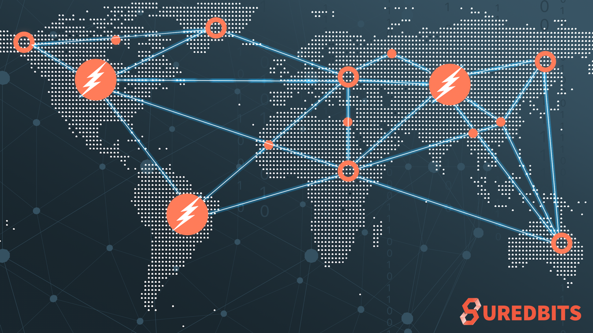

> *作者：Nadav Kohen*
> 
> *来源：<https://suredbits.com/generalized-bitcoin-channels/>*

在本文中，我们会讨论由论文《[兼容比特币的广义通道](https://eprint.iacr.org/2020/476.pdf)》提出的优化闪电网络新想法。

## 论文提要

我们先从总结《兼容比特币的广义通道》的大意开始。作者们提出了一种新的机制，使我们可以创建一种闪电通道，其惩罚是一次性应用在整个通道上的，而不是按输出逐个设置的。这意味着，如果你的通道对手尝试欺诈你（发布 旧的/已撤销的 状态），你不必通过花费每一个通道输出的撤销路径来拿走通道中的资金（在旧的状态上如果有待完成的支付，则会有 2 个或以上的输出需要通过发起交易来转移），你可以直接用一笔简单的交易拿走所有的资金。这种方案的另一个（可以说更好的）特性是，这种惩罚机制不需要双方都签名自己的承诺交易的不对称状态设置，双方可以使用相同的（单笔）承诺交易得到一个统一的状态！这种统一的特性让多交易协议（例如[谨慎日志合约](https://suredbits.com/discreet-log-contracts-on-lightning-network/)）在闪电通道内变得更容易管理，因为不再需要为同一个合约的每个部分保留两个不同的版本；相反，链下的多交易合约可以跟它们在链上的构造方式（或多或少）完全相同。

这种运作起来就像底层区块链的特性，正是作者将这种通道方案产品命名为 “通用通道（Generalized Channels）” 的原因。我个人不太喜欢这个名字，因为众所周知，Poon-Dryja 通道（现行的闪电通道构造）已经支持绝大部分由底层账本支持的输出（诚然，在 Poon-Dryja 通道中复制这些输出并为之添加惩罚逻辑会有额外的复杂性），我个人更倾向于管它们叫 “统一通道（Unified Channels）”。

拥有统一的承诺交易的好处是巨大的：通道的构造和维护都会变得更加简单，通信量会更少、更简单，而且，在发生争议、承诺交易最终被广播到区块链上的情形中，链上的踪迹也更少。最后，这种方案所需的唯一尚未被当前的闪电网络使用的工具是单签名者的适配器签名（single-signer Adaptor Signatures）！这意味着，我们今天就能部署这样的通道（而同样具有统一承诺交易的 [eltoo 通道](https://blockstream.com/eltoo.pdf)需要对底层的比特币区块链实施一次软分叉，以引入新的签名哈希类型）。

碰巧的是，单签名者的适配器签名也正是启用 “支付点（PTLCs）” 所需要的（关于 PTLC，我们已经[写过很多](https://suredbits.com/category/payment-points/)了，而且我们甚至还在[几个月前的一场黑客松上实现了这种签名并执行了一笔链上的 PTLC](https://youtu.be/w9o4v7Idjno)）。通用通道论文的作者声称其 ECDSA 适配器签名是新东西、并且适配器签名安全性的精确概念也是新的，这是错误的。实际上，两个东西都已经由 Lloyd Fournier 在这篇[邮件组帖子](https://lists.linuxfoundation.org/pipermail/lightning-dev/2019-November/002316.html)和[这篇论文](https://github.com/LLFourn/one-time-VES)中提出了。也就是说，通用通道论文的作者只是修改了签名方案的其中一步，使得他们能够为他们的签名方案给出一种安全性证明，这是新的！我们尚不清楚由 Lloyd 提出的方案，如果不加上这个修改的会，能不能是安全的（虽然在某些环境下省略生成 NIZK（诚实参与者零知识）证明的额外步骤是安全的，就像在 DLC 里那样）。注意，虽然这种 ECDSA 适配器签名方案的存在意味着我们可以立即开始开发这样的统一通道和 PTLC，但 Schnorr 适配器签名依然比 ECDSA 适配器签名更优越；当 Schnorr 签名可以在链上使用时，一切都可以大幅简化。

在深入细节之前，最后一个提醒是：虽然我认为，如果这样的通道实现不支持 PTLC，会是愚蠢的事，但这个方案也支持 HTLC；此外，这些通道（以及其中的 HTLC）也完全兼容现有的 HTLC 闪电通道，所以，相互取得同意的个人可以在现有的闪电网络中实验 “通用通道”，无需让别人知道自己的交易正通过一种新的通道转发！

## 账本通道如何工作？

任何账本通道方案的目标，都是让用户可以使用完全可以执行的链下交易来更新链下合约的状态。意思是说，链上发生过的一笔注资交易会将整个通道的所有资金锁在一个 2-of-2 的多签名输出中；而链下会有一些交易，我们称为 “承诺交易”，会花费这个注资交易的输出，并给双方分配余额（可能还有别的输出，如果通道中还有其它正在进行的合约的话）。此外，必须有一些方法，能够创建新的链下承诺交易并作废旧的承诺交易，也即更新状态（而无需触及区块链）。

在今天的闪电通道中，这种更新机制是使用 “承诺交易秘密值” 和成对的承诺交易来实现的。每一方都有专属于自己的承诺交易，这个交易给他们自己支付的输出（`to_local` 输出）是带有时间锁的，而且还有一个额外的不带时间锁的条件：如果对方知晓某个秘密值，旧可以直接花费它。因此，参与的双方可以通过揭晓对应的承诺秘密值来撤销旧的承诺交易。因此，如果 Alice 决定使用一个已经撤销的状态（承诺交易）来欺骗自己的通道对手 Bob，Bob 将有时间利用对应的承诺秘密值来花费将资金分配给 Alice 的输出（因为 Alice 的花费路径带有时间锁）。

抽象地说，

1. 对应的承诺秘密值是一个状态已经 撤销/老旧 的证据；
2. 成对的承诺交易（而不是只有一笔承诺交易）保证了只有发布了旧状态的一方才能被惩罚。

“通用通道” 也有承诺秘密值，但只有一笔统一的承诺交易，所以需要一种新的机制来保证只有尝试欺诈的一方可以被惩罚。

必须先指出的是，在一个 “通用通道” 中，承诺交易（花费链上注资交易的交易）只是一笔中间交易，它会被另一笔表示状态的交易（论文管它叫 “分割交易”）花费，状态交易才包含着通道的账本。因此，这里的承诺交易没有状态输出（表示本地余额、远端余额、正在进行的合约等等的输出），只有一个输出，这个输出可以在一个时间锁后被状态交易花费，或者，如果某一方能证明通道对手已经撤销了这笔承诺交易但又发布了它，就可以立即花费它。

那么，还剩下一个问题：证明通道对手（而不是你子集）发布了旧的承诺交易，因为双方都有相同的承诺交易。这就是用到适配器签名的地方。

一个适配器签名是一个无效的签名（在我们这个案例中是交易的签名），但它的无效很有特点（而且是可以验证的）：它使用某些公钥调整过了。如果某人能拿到这个适配器签名并知道这个公钥背后的私钥，那就可以 “反调整”，将这个无效的签名转变成一个完全有效的签名。但是，如果这个人使用了这个 “完整版”（有效）的签名，那么创建适配器签名的一方（也即只知道用于调整的公钥的那一位）将可以把完整版签名和适配器签名相减、从而知晓调整公钥背后的私钥。简而言之，适配器签名可以实现签名和私钥的原子化交换。

因此，如果双方都向对方提供了承诺交易的适配器签名，那么用于调整的公钥就可以用来定义花费这个承诺交易的惩罚路径。具体来说，如果 Alice 和 Bob 在一个通道中，而 Alice 决定发布一笔已经撤销的承诺交易，那么 Bob 就可以在时间锁到期前花费这个交易，办法是同时使用 Alice 在作废这个状态时提供的承诺秘密值以及适配器秘密值（论文称为 “公示私钥”），这个适配器秘密值可以从 Alice 放在承诺交易中的 Bob 完整签名减去 Bob 的适配器签名得到。而且，Alice 没法用属于自己的惩罚分支来花费这笔承诺交易，因为 Alice 不知道 Bob 的公示私钥（因为 Bob 没有使用 Alice 给他的适配器签名）。

一句话总结，通过使用适配器签名来签名承诺交易，参与通道的双方可以确保如果承诺交易被发布到区块链上，那么只有发布者一方的公示私钥会被对方知晓。这样的公示私钥跟普通的承诺秘密值（会在撤销旧状态时揭示），让我们再一次在统一的承诺交易中实现了闪电通道惩罚机制。

如果你还有问题，或者想直观地了解当前的闪电通道与 “通用通道” 的承诺交易有何功能上的不同，论文的第 4 页和第 5 页给出了漂亮的[图示](https://eprint.iacr.org/2020/476.pdf)。

总结一下：《兼容比特币的通用通道》提供了一种优化的 Poon-Dryja 闪电通道惩罚机制，其通信开销大幅缩减，惩罚交易的体积（以及经济成本）是常量的，而且不需要使用成对的承诺交易，让通道的复杂性大大缩减。这些统一的通道完全兼容现有的闪电通道，而且易于实验在通道内创建非传统的输出（非 HTLC 输出）。构造这样的通道唯一所需（除了 *大量的* 开发工作）就是适配器签名，而这已经在 libsecp256k1 的一个分支中实现了，恰好这也是[支付点技术](https://suredbits.com/category/payment-points/)的所需！

（完）