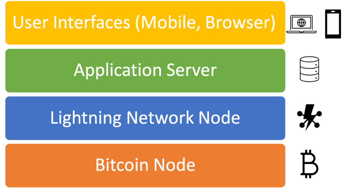
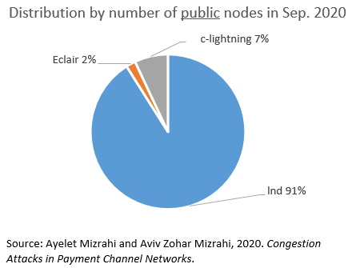
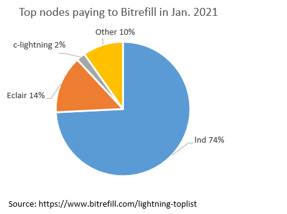
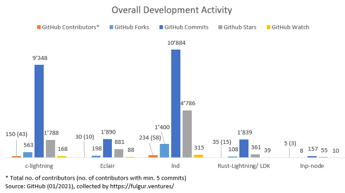
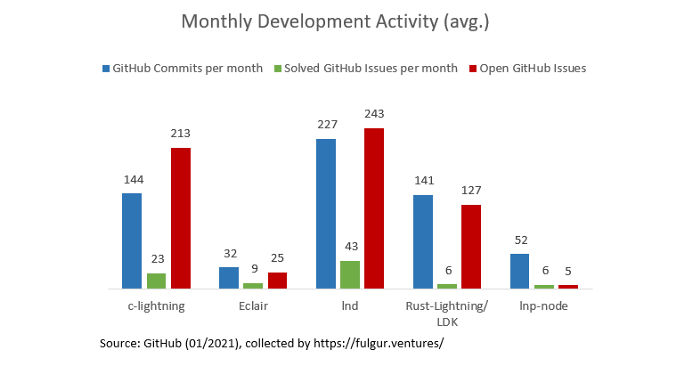
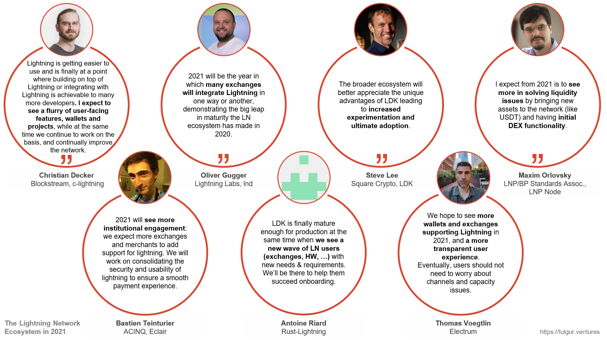

> *作者：Fulgur Ventures*
> 
> *来源：<https://medium.com/@fulgur.ventures/an-overview-of-lightning-network-implementations-d670255a6cfa>*
> 注：本文首发于 2021 年 3 月 15 日

**本文是我们关于闪电网络生态系统系列的第二弹。虽然在[上一篇文章](https://medium.com/@fulgur.ventures/building-an-overview-of-the-lightning-network-ecosystem-a93be2343f61)中，我们已经就如何理解 “生态环境” 打下了基础，本文旨在从关键特征、使用情况、开发活动统计和功能等方面，为读者更详尽地展示栖息在这个生态内的一部分 “物种” —— 各种不同的闪电网络实现。如果你是计划在比特币闪电网络上进行构建的开发者、产品经理或创业公司创始人（或者说你只是闪电网络爱好者），我们希望这篇文章能够帮助你从产品开发的角度了解并评估可获得的客户端和库。**

## **太长不看**

- 闪电网络实现的生态正在稳步发展中，不仅扩大了应用场景的覆盖面，而且更好地满足了不同技能客户的需求。

- 随着主要开发组织开始形成各自的优势和价值主张，产品化路径变得更加明显。

- 由于早期采用者的参与度较强，每个闪电网络实现周围都形成了用户社区。

- 预计到 2021 年，更多机构采用（例如，交易所）将推动生态环境的发展。

为了尽可能增强这篇概述的准确性并增添更多技术细节，我们已经向开发者收集了不同闪电网络实现的具体信息。然而，考虑到整个生态的飞速发展，文中提到部分信息可能很快就会过时。如果你发现我们有任何遗漏之处或任何信息过时失效，请告诉我们，我们会更新本文。

## 闪电网络简介

闪电网络是叠加在比特币网络之上的网络，旨在增强比特币网络的可扩展性。通过在链下处理交易和利用安全的底层网络作为仲裁层，闪电网络实现了免信任的即时私密支付，而且手续费极低。在使用这项技术时，我们需要理解两个不同的网络层：

1. **比特币网络**：作为闪电网络运行的基础层。闪电网络使用底层区块链执行 开启/关闭 通道的交易并监控通道状态的相关事件。
2. **闪电网络**：构建在比特币区块链上的点对点网络层，可以让闪电网络节点相互连接**并**共享支付通道来参与交易活动。

因此，基于闪电网络开发应用需要用到两个不同的软件组件：

1. **比特币节点**：一些节点实现可以用来与底层区块链创建接口。其中，最受欢迎且应用最广泛的是 [Bitcoin Core](https://bitcoin.org/en/bitcoin-core/)（[bitcoind](https://github.com/bitcoin/bitcoin)） 和 [btcd](https://github.com/btcsuite/btcd)。
2. **闪电网络节点**：闪电网络节点/后台进程（daemon）是与闪电网络连接和交互的主要应用组件。闪电网络后台进程是本地服务器，负责管理数据库、连接对等节点、开启/关闭通道、生成付款发票（payment invoices，用于请求支付）、发送付款等。闪电网络节点需要一直与比特币节点保持同步才能运行。在大多数应用开发场景中，应用只与闪电网络节点交互。

闪电网络应用的典型架构如下所示：



闪电网络节点有多种实现，所以开发者可以根据自己心仪的功能和编程语言来选择。

## 闪电网络实现的生态

本章节介绍了截至 2021 年 1 月以前的 6 个月内在 Github 上有重要开发活动的主要闪电网络实现。为了收集一些特定信息，我们采访了这些项目的开发者。下列项目均根据 GitHub 1 上首个版本标记的日期按时间顺序排序。

### c-lightning

[c-lightning](https://github.com/ElementsProject/lightning) 是 [Blockstream](https://blockstream.com/lightning/) 用 C 语言编写的闪电网络实现，受到 BSD-MIT 许可证的保护。该项目自 2018 年初以来就在比特币主网上运行。c-lightning 的软件架构赋予了其模块化和可延展（extensible）特性，以及较强的向后兼容性。该项目提供底层的个性化定制，让开发者可以灵活使用闪电网络后台进程。

### Eclair

[Eclair](https://github.com/ACINQ/eclair)（法语词，意为闪电）是 [ACINQ](https://acinq.co/) 用 Scala 语言编写的闪电网络实现，受 Apache License 2.0 的保护。自 2018 年初在[主网上线](https://twitter.com/acinq_co/status/979081006903947264)以来，Eclair 提供了一个节点实现库，用来打造健壮、安全且可扩展（能够处理大量交易）的节点。另外，Eclair 还提供了一个原生的[移动端闪电网络实现](https://github.com/ACINQ/eclair-mobile)。

### Ind

[lnd](https://github.com/lightningnetwork/lnd) 是 [Lightning Labs](https://lightning.engineering/) 使用 Go 语言开发的闪电网络节点实现，受 MIT 许可证保护。Ind 被设计成了一个用户友好型实现，用来促进基于闪电网络的应用开发。它是一个独立的后台进程，自 2018 年第一季度以来提供了大量[主网可用](https://blog.lightning.engineering/announcement/2018/03/15/lnd-beta.html)功能。

### Rust-Lightning 和 LDK

[Rust-Lightning](https://github.com/rust-bitcoin/rust-lightning)（RL）是 [Rust 比特币社区](https://github.com/rust-bitcoin)联合 [Square Crypto](https://squarecrypto.org/) 使用 Rust 开发的通用闪电网络库，受 [Apache 2.0](https://github.com/rust-bitcoin/rust-lightning/blob/main/LICENSE-APACHE) 或 [MIT](https://github.com/rust-bitcoin/rust-lightning/blob/main/LICENSE-MIT) 许可证的保护。RL 于 2019 年 12 月上线，旨在为闪电网络提供功能完备的灵活实现，并在最大程度上减少系统依赖项。它的设计理念是，所有功能都应该通过简单、可组合的 API 公开。Square Crypto 创建了闪电网络开发工具包（[Lightning Development Kit](https://lightningdevkit.org/)，LDK）项目后，Rust 比特币社区参与了进来。LDK 以 RL 为基础，包含了一个 API、语言绑定、demo app 等以及必要的文档；其设计目标是，让应用开发者可以轻松、安全、灵活地整合闪电网络。 

### Electrum

[Electrum](https://electrum.org/#home) 是 2011 年创建的比特币客户端，聚焦于隐私性和安全性。它支持冷存储、多重签名和各种硬件钱包。Electrum 采用由公开服务组成的去中心化的基础设施，例如，[ElectrumX](https://github.com/spesmilo/electrumx)。Electrum 服务器是能够索引比特币区块链的比特币全节点，可以让钱包高效查询任意比特币地址。Electrum 用户既能运行自己的私人服务器，也能连接到公开的 Electrum 服务器。[Electrum 开发者使用 Python 创建了一个闪电网络实现](https://www.electrum.org/talks/lightning/presentation.html#slide1)，并整合了 Electrum 钱包。Electrum 于 2020 年 7 月公开部署了支持闪电网络的实现，其代码受 MIT 许可证保护。

### LNP Node

2020 年 10 月，[LNP/BP 标准协会](https://www.lnp-bp.org/)发布了 [LNP Node](https://github.com/LNP-BP/lnp-node) v.0.1（alpha 版本），一个使用 Rust 编写的新型闪电网络实现，受 MIT 许可证保护。LNP Node 将包含一组能够运行 Lightning Network Protocol（闪电网络协议）、智能合约系统 [RGB](https://rgb-org.github.io/) 和广义闪电网络通道（GLC）的后台进程。GLC 是 LNP/BP 标准协会提出的概念，是一种以模块化和可延展的方式（extensible）定义支付通道的新方法，以便未来将协议构建在闪电网络之上（即，Layer 3）。

其它重要实现有 [Altangent Labs](https://www.altangent.com/) 开发的 [Node-Lightning](https://github.com/altangent/node-lightning)（前身为 LNTools）、由 [Nayuata](https://nayuta.co/) 开发、MIT Media Lab 的 [Digital Currency Initiative](https://dci.mit.edu/) 支持的 [Ptarmigan](https://github.com/nayutaco/ptarmigan)。

自首批闪电网络实现于 2018 年初在主网上线以来，闪电网络实现的生态一直在稳步壮大，并且保持发展态势：早期实现已经在主网投入生产，新的实现也在陆续登台亮相。

## 使用情况和开发活动统计

现在我们已经简要了解了每个闪电网络实现及其目的和设计目标，接着从数据的角度来分析它们的使用情况和开发活动情况。

### 使用情况统计

虽然闪电网络的交易量可能是判断其使用活动的最佳指标，但是由于网络的隐私性，我们很难获得可靠的信息。为了大致估计各个实现的相对分布情况，我们先来看看公开节点的数量及其活动情况。

 

- 2020 年 9 月公开节点数量的分布情况 -

由于无法公开访问节点上运行的客户端的信息，研究者专门设计了一种方法，可以根据通过 Gossip 协议传输的消息来推断客户端类型。每个实现使用的参数默认值都略有不同，其中一些是公开的，可以通过检查 gossip 消息获取。由于用户大多保留默认值，我们可以根据这些值来推断出主要闪电网络实现的分布情况 2,3。上图是 2020 年 9 月以来公共网络图的快照，不包括移动钱包和非公开的通道。然而，基于他在 2019 年的研究结果 4，克里斯汀•戴可（Christian Decker）估计网络中私有节点的比例至少在 40% 左右。因此，要注意的是，聚焦于移动钱包的实现在上述统计数据中可能没有得到充分体现。

为了增加另一个维度来反映不同闪电网络实现的使用情况，我们还参考了 [Bitrefill 的公开统计数据](https://www.bitrefill.com/lightning-toplist)。下图显示了通过闪电网络向 Bitrefill 发送交易最多的节点的分布情况。图中所示数据是根据过去 30 天来向 Bitrefill 支付的独立支付（unique payment）的数量与其收到的所有闪电网络支付的占比计算得来的。


- 2021 年 1 月向 Bitrefill 发送交易最多的节点 -

总的来说，上图所示的统计数据体现了相似的分布情况。然而，在这幅反映了连接到 Bitrefill 的最活跃节点的分布情况的图中，Eclair 的占比变大了一些。这意味着，运行 Eclair 的节点贡献了 Bitrefill 过去 30 天内收到的所有付款的 14%。请注意，上图不一定会表明付款来源，因为连接到 Bitrefill 的节点可能是中间路由节点，。

### 开发活动统计

为了估计最近的开发活动，我们纳入几个可以从 GitHub 获得的指标，例如，复制数量、贡献者人数和提交数量（现有文献中的常用方法 6）。不出所料的是，最常用的三个实现 c-lightning、Eclair 和 lnd 在开发活跃度方面也是最高的。其中，就下图列出的每项指标而言，Ind 都独占鳌头。相比之下，较晚上线的 LNP Node 和 Rust-Lightning/ LDK 在开发活跃度上要落后不少。7


- 总体开发活动情况 -


- 月均开发活动情况 -

考虑到每个实现并非同期上线，我们计算了各个实现在 GitHub 上首次进行开发活动以来的 “月均提交数量” 和 “月均已处理问题数量”。1

## 如何运行和使用闪电网络节点

为了帮助你迈出开发的第一步，下一部分将介绍如何**运行**这些闪电网络实现、如何在上面进行**构建**以及**做贡献**。为方便起见，文中包含了很多超链接，可以帮助你获取各类开发资源和社区的开发**支持**。

### c-lightning

**运行**：c-lightning 提供了一个[指南](https://lightning.readthedocs.io/INSTALL.html)，介绍了如何在 [Ubuntu](https://github.com/ElementsProject/lightning/blob/master/doc/INSTALL.md#to-build-on-ubuntu)、[BSD](https://github.com/ElementsProject/lightning/blob/master/doc/INSTALL.md#to-build-on-freebsd)、[MacOS](https://github.com/ElementsProject/lightning/blob/master/doc/INSTALL.md#to-build-on-macos)、[Android](https://github.com/ElementsProject/lightning/blob/master/doc/INSTALL.md#to-cross-compile-for-android) 和 [Raspberry Pi](https://github.com/ElementsProject/lightning/blob/master/doc/INSTALL.md#to-cross-compile-for-raspberry-pi) 等各类平台上安装并运行后台进程。用户可以选择不同的安装方式，例如，[docker 镜像](https://hub.docker.com/r/elementsproject/lightningd)、[GitHub](https://github.com/ElementsProject/lightning/releases) 上的可重复构建二进制文件以及便于 Ubuntu 用户运行的个人软件包存档（PPA）。迄今为止，c-lightning 尚无可供 Windows 使用的开箱即用软件。尽管如此，嵌入式硬件用户可能会喜欢 c-lightning 这样轻量级且高度可定制的闪电网络后台进程。

**构建**：c-lightning 公开了基于 Unix域套接字的 JSON-RPC 2.0 接口，并且可以通过 lightning-cli 工具或可用的 [Python](https://github.com/ElementsProject/lightning/blob/master/contrib/pylightning)、[Go](https://github.com/niftynei/glightning)、[JS](https://www.npmjs.com/package/clightning-client) 或 [Rust](https://crates.io/crates/clightningrpc)) 客户端库进行访问。由于缺少对 REST 或 gRPC 接口的原生支持，一些项目目前正在开发应用服务器，以便在 c-lightning 上提供一个 API 层：

- [c-Lightning-REST](https://github.com/Ride-The-Lightning/c-lightning-REST) —— 一个使用 JS 编写的应用服务器，提供了一个 REST API 套件
- [Lighter](https://gitlab.com/inbitcoin/lighter) —— 一个为 c-lightning、Eclair、lnd 和 Electrum 提供了 gRPC 客户端接口的应用服务器
- [c-lightning-graphql](https://github.com/nettijoe96/c-lightning-graphql) —— 一个面向 c-lightning 构建的 Graphql API 库

**贡献**：c-lightning 最出名的是它的插件系统，这是一种简单而又强大的扩展后台进程功能的方式。插件是由主后台进程触发并通过多种方式（例如，命令行、JSON-RPC 命令传递、事件流订阅和钩子）与之交互的子进程。插件可以使用任何语言编写。[点击此处](https://github.com/lightningd/plugins)，查看社区内部为 c-lightning 打造的插件的列表。想要做贡献的开发者可以先阅读[开发者指南](https://github.com/ElementsProject/lightning/blob/master/doc/HACKING.md)。

**支持**：Freenode 上的 IRC [#c-lightning 频道](http://webchat.freenode.net/?channels=%23c-lightning)

### Eclair

**运行**：Eclair 可以在安装了 [Linux、Windows](https://github.com/ACINQ/eclair/wiki/Install) 或 [MacOS](https://github.com/ACINQ/eclair/wiki/Install) 的 PC 端上运行。自 Eclair 主网上线以来，ACINQ 也为移动端提供了 Android 版本，目前正在开发[原生的 iOS 版本](https://medium.com/@ACINQ/when-ios-cdf798d5f8ef)。作为首个非托管型闪电网络钱包应用提供商，ACINQ 始终以移动开发为工作核心，致力于为企业提供稳定且可扩展的节点实现。[点击此处](https://github.com/ACINQ/eclair/wiki/Run)，可查看关于如何运行 Eclair 的文档。

Eclair 是基于函数式编程语言 Scala 开发的，因此拥有一个便于测试和审计的简洁代码库。受到 Erlang 的启发，Eclair 采用了 actor 编程模型。该模型尤其适用于上文提到的大型路由节点的应用场景：操作可以是多线程的，每个通道及其对等节点都处于沙盒环境中，即使遭受恶意流量攻击也能稳定运行。然而，这种稳定性和可扩展性是有代价的：Eclair 只为用户提供较少的功能和较低程度的可延展性（extensibility），以尽可能减少攻击向量。

**构建**：不过，Eclair 为开发者提供了一个 JSON API 和详实的[文档](https://acinq.github.io/eclair/#introduction)。该 API 使用 HTTP 表单数据并返回一个 JSON 编码的对象或简单的字符串。在运行 Eclair 客户端之前，用户可以自定义日志记录以及[基础](https://github.com/ACINQ/eclair/wiki/Customize-Features)和高级功能，例如，[多](https://github.com/ACINQ/eclair/wiki/Multipart-Payments)[方](https://github.com/ACINQ/eclair/wiki/Multipart-Payments)[付款](https://github.com/ACINQ/eclair/wiki/Multipart-Payments)和 [trampoline 付款](https://github.com/ACINQ/eclair/wiki/Trampoline-Payments)。除了 API 之外，Eclair 还提供了一个支持 Scala、Java 和其它兼容 JVM 语言的[插件系统](https://github.com/acinq/eclair#plugins)。

**贡献**：点击此处，查看关于实际贡献流程和指南的[文档](https://github.com/ACINQ/eclair/commit/fe96132815e63c5e74450d5d218e7651161f999c)。

**支持**：ACINQ 的官方 [Gitter 频道](https://gitter.im/ACINQ/developers)

### Ind

**运行**：用户可以选择使用[源代码](https://github.com/lightningnetwork/lnd/blob/master/docs/INSTALL.md)或 [Docker](https://github.com/lightningnetwork/lnd/blob/master/docs/DOCKER.md) 构建 Ind 并在 Linux、MacOS 或 Windows 上运行。Ind 支持轻客户端模式（例如，[Neutrino](https://github.com/lightninglabs/neutrino)）并为 iOS 和 Android 提供移动端 SDK。[安装指南](https://github.com/lightningnetwork/lnd/blob/master/docs/INSTALL.md)也适用于基于 ARM 的系统。

**构建**：Ind 提供了一个专门的[构建者指南](https://docs.lightning.engineering/)来帮助开发者入门。Ind 不允许直接运行二进制文件中的代码，但是提供了用于构建应用程序的接口。两个主要的 RPC 接口分别是：HTTP REST API 和 gRPC 服务（后者是与 Ind 交互的首选编程方式）。习惯使用标准 RESTful API 的用户可以使用 REST 代理；但是，REST 没有 “流式 RPC 全覆盖”。[API 文档](https://api.lightning.community/#lnd-grpc-api-reference)展示了如何使用 [Python](https://dev.lightning.community/guides/python-grpc)、[JavaScript](https://dev.lightning.community/guides/javascript-grpc) 和 CLI（命令行界面）与本地 Ind 实例通信。其它可用的客户端库如下所示：

- [lndclient](https://github.com/lightninglabs/lndclient)：一个基于 lnd 的 gRPC API 的 golang 原生包装程序
- [Lndgrpc](https://github.com/adrienemery/lnd-grpc-client)：基于默认（用来处理凭证设置的） grpc 接口的 python grpc 客户端/包装程序
- [falafel](https://github.com/lightninglabs/falafel)：生成用于 iOS 和 Android 的原生 Go 包装程序的移动端 SDK

**贡献**：在 Ind 中，集成是通过 API 而非插件实现的。[dev.lightning.community](https://dev.lightning.community/) 提供了一系列开发者资源。如果你想了解[开发实践](https://github.com/lightningnetwork/lnd/blob/master/docs/code_contribution_guidelines.md#DevelopmentPractices)和[审批流程](https://github.com/lightningnetwork/lnd/blob/master/docs/code_contribution_guidelines.md#DevelopmentPractices)，请分别查看专门的文档。

**支持**：Freenode 上的 IRC [#lnd 频道](https://webchat.freenode.net/#lnd)和 [lnd Slack 频道](https://lightning.engineering/slack.html)

### Rust-Lightning 和 LDK

**运行**：Rust-Lightning 旨在成为首个移动端闪电网络平台。2020 年 11 月，v0.0.12 在测试网上线。开发者在 Linux、Windows、Android、iOS 系统以及 Chrome 之类的 web 浏览器上运行他们的节点示例。实现针对资源较少的嵌入式硬件的跨平台支持是目前的工作重点。由于 RL/LDK（除了极少数 demo 实现之外）不是独立的节点，节点设置可能需要用户具备更多专业知识，但是这样有助于促进闪电网络与不同平台的整合。[GitHub 库](https://github.com/lightningdevkit)里就有一个使用了 LDK 的节点实现示例。

**构建**：不同于开箱即用的闪电网络后台进程，Rust-Lightning 更像是一个模块化的闪电网络库。用户要么自己实现基础的网络化逻辑、链交互和磁盘存储，要么使用已有的现成部件。目前，Rust-Lightning 提供默认 crate（即，代码包），例如，[C/C++ 绑定](https://github.com/rust-bitcoin/rust-lightning/tree/main/lightning-c-bindings)、[网络堆栈](https://github.com/rust-bitcoin/rust-lightning/tree/main/lightning-net-tokio)和[持久化模块](https://github.com/rust-bitcoin/rust-lightning/tree/main/lightning-persister)。LDK 层上的区块同步程序以及 Swift、Java 和 Python 绑定是开发路线图的一部分。

[Rust-Lightning](https://github.com/rust-bitcoin/rust-lightning/blob/main/ARCH.md)[ API](https://github.com/rust-bitcoin/rust-lightning/blob/main/ARCH.md) 提供了一组接口（例如，过滤、访问和费用估算接口），供内部组件用来与基础层进行通信，执行基础的闪电网络操作。另外还公开了第二组接口，用于执行闪电网络组件的基础操作，例如，开通/关闭通道、发送 HTLC（哈希时间锁合约）和建立连接。第三组接口则包含事件本身，例如，接收付款或消息转发。这三组接口均可直接访问，满足单个应用的定制化和适配需求。该[指南](https://lightningdevkit.org/docs/getting_started)很好地概述并介绍了 LDK 的架构。

**贡献**：RL/LDK 在开放式贡献者模型上运行。关于贡献工作流、同行审议和编码约定，请参见 RL [GitHub 库。](https://github.com/rust-bitcoin/rust-lightning/blob/main/CONTRIBUTING.md)关于目前正在进行的开发活动情况，可参见[之前的会议纪要](https://github.com/bitcoin/bitcoin/issues/21074)。

**支持**：Freenode 上的 IRC [#rust-bitcoin 频道](https://webchat.freenode.net/#rust-bitcoin)和 [LDK Slack 频道](http://lightningdevkit.org/)

### Electrum

**运行**：Electrum 的闪电网络实现直接与其钱包集成。Electrum 为 Linux、Windows 和 OS X 以及 Android 移动设备都提供了[二进制文件和可执行文件](https://electrum.org/#download)。该[文档](https://bitcointalk.org/index.php?topic=5259973.0)介绍了如何使用 Electrum 运行闪电网络。

**构建**：开发者可以使用一组基于 JSON RPC 接口或命令行的命令，同时选择将 Electrum 当作没有图形 UI 的后台进程来运行。

**贡献**：开发者可以直接通过 [GitHub 库](https://github.com/spesmilo/electrum)做贡献。至于那些需要非 Python 库、与远程服务器通信或引入新的依赖项的额外功能，Electrum 提供了一个专门的[插件系统](https://github.com/spesmilo/electrum/blob/15a77e2f47eec8665377fb6431da237a660b16e3/electrum/plugins/README)。

**支持**：目前有[几种方式](https://electrum.org/#community)可以与 Electrum 社区取得联系，例如，通过 [bitcointalk.org](https://bitcointalk.org/index.php?board=98.0) 上的子论坛或 Freenode 上的 IRC [#electrum 频道](https://webchat.freenode.net/#electrum)。

### LNP Node

**运行**：目前最新的闪电网络节点实现是 LNP/BP 标准协会的 LNP Node。开发者可以使用 Rust Cargo 管理器或带有 ARM、x64 或 x86 处理器的平台上的 Docker v0.1 编译文件在本地[安装](https://github.com/LNP-BP/lnp-node#build-and-usage) [v0.1 Beta 2](https://github.com/LNP-BP/lnp-node/releases/tag/v0.1.0-beta.2) 。LNP Node 将来还会整合 C 绑定和 WASM 绑定，从而支持移动端和 Web 端。

**构建**：该节点由一组微服务组成。如 LNP Node 的[架构](https://github.com/LNP-BP/lnp-node#design)所述，这组微服务可以在台式机或服务器上作为单个后台进程运行，可以在单个移动应用中作为线程运行，也可以作为独立的节点在单个移动应用中合并。要连接并嵌入 LNP Node，开发者可以选择通过基于 ZMQ 的 API、抽象掉 RPC API 的 SDK，或者其它 [API 工具](https://github.com/LNP-BP/lnp-api-tools)来进行交互。该 SDK 支持开发者使用 Rust、Python、C、Node.js、Java、Android 或 Swift 之类的编程语言调用函数。后续计划会增加对 Wasm 和 Go 的支持。

**贡献**：如果你想要了解贡献流程，请参阅这些[指南](https://github.com/LNP-BP/rust-lnpbp/blob/master/CONTRIBUTING.md)。

**支持**：Freenode 上的 IRC [#lnp-bp 频道](https://en.irc2go.com/webchat/?net=freenode&room=lnp-bp&java=1)、[每周社区电话会议](https://github.com/LNP-BP/devcalls)、[RGB Telegram 频道](https://t.me/rgbtelegram)。

## 闪电网络实现的功能矩阵

我们已经介绍了运行闪电网络后台进程并在上面进行构建的各种选择及可用功能，你可以通过[闪电网络实现的功能矩阵](https://github.com/FulgurVentures/Lightning-Implementation-Features/blob/main/README.md)获得更深入的了解。该矩阵包含了一个动态更新的文档，提供关于闪电网络实现特定功能的支持信息。为了确保该文档的完整性和时效性，欢迎大家踊跃贡献，不胜感激。关于如何参与贡献，请阅读[贡献指南](https://github.com/FulgurVentures/Lightning-Implementation-Features/blob/main/CONTRIBUTING.md)。

## 价值主张和开发路线图

如果上述内容让你对某个实现产生兴趣，抑或是你想要了解这些实现的未来开发情况，我们根据撰写本文时（2021 年 1 月）可获得的信息总结了各实现的开发路线图。于此同时，我们还为本文涉及的实现创建了[功能矩阵](https://github.com/FulgurVentures/Lightning-Implementation-Features/blob/main/README.md)。

### c-lightning

c-lightning 旨在成为适应用户需求的高度可定制解决方案，以及供开发者测试新功能的实验平台。功能原型的研究人员通常会在将新功能纳入正式规范之前使用这类平台。正如[功能矩阵](https://github.com/FulgurVentures/Lightning-Implementation-Features/blob/main/README.md)中所示，广泛的功能都是依赖大量插件实现的。由于在特定的架构内无需触及底层 C 代码，构建并运行这些插件是有可能的。但是，开发者有一个任其使用的接口，可以在不改变后台进程的情况下添加自定义（例如，JSON-RPC）方法。这大幅提高了插件的效率，因为它们可以直接访问低层细节。

除了主要的后台进程之外，c-lightning 还包含各种子后台进程，例如，一个数据库、一个钱包或一个 gossip 后台进程。开发者可以改变这些子系统，比如，换用一个保管秘密值得后台进程来管理密钥并支持硬件钱包。这种高度可定制化对运行 C 代码的嵌入式硬件设备非常有用。

c-lightning 的默认后端是 sqlite3，一个可移植的独立数据库。在挑战性较强的高可用环境（如企业业务）中，PostgreSQL 会提供高度可用的数据存储支持。使用[备份插件](https://github.com/lightningd/plugins/tree/master/backup)可以恢复被损坏的数据。与静态通道备份相反，c-lightning 不依赖于对等节点合作：已恢复的节点可以从中断处开始同步，同时（假设数据恢复是在通道超时或被对等节点关闭之前完成的）通道在数据发生损坏时也可保持开启状态。

**c-lightning 的 2021 年开发路线图**：

- 进一步完善规范，增加关于洋葱消息传递、双重资金充值和报价的提案

- 扩展功能集、优化现有功能。例如，多方支付实现包含的一些参数可用来优化付款的确认时间及成功概率。目前已经有计划要开展一系列实验来探索折中方案，找到最佳参数。

- 进一步扩展接口，向开发者开放更多内部部件以便其进行构建和提供支持。

### Eclair

开发 Eclair 的公司 ACINQ 运营着全网最大的公开节点，且该节点持有超过 118 BTC9。由此可见，Eclair 实现的重点是：创建一个适合企业使用的稳定且可扩展的路由节点。这种健壮性不仅来源于函数式编程语言 Scala 和 actor 编程模型，而且得益于专为增强健壮性而优化的[架构](https://github.com/ACINQ/eclair/blob/master/docs/Cluster.md)。Eclair 可以让用户利用多个服务器对单个闪电网络节点进行扩展。当前端服务器负责处理那些 CPU 和带宽密集型且与路由表相关10 的来自对等节点的 gossip 消息和同步要求时，后端服务器可以专注于核心通道管理。前端服务器是无状态的。只要有至少一个前端节点可用，这些服务器即可停止运行，且不影响对应闪电网络节点的运行和可访问性。通过这种集群化，Eclair 能够减轻闪电网络节点在连接和路由表管理方面的负担。

此外，作为闪电网络上首个非托管式移动应用提供商，ACINQ 是一家专注于移动钱包开发的知名公司，旗下产品有 Eclair Mobile。与此同时，ACINQ 还发布了另一款终端用户钱包 Phoenix。ACINQ 在移动端闪电网络开发方面取得了重大进展，推出了 Eclair 的 Kotlin Multiplatform (KMP) 实现（笔者撰写本文时，该实现仅适用于 Android）11，以及基于 Kotlin 的原生 [iOS App](https://medium.com/@ACINQ/when-ios-cdf798d5f8ef)。与企业节点相比，这个基于 Kotlin 的实现针对移动钱包用户体验进行了优化。由于用户并不一定时刻保持在线或在网络中转发付款，不必要的功能可以去掉。由于有的攻击针对的是付款中继功能12，没有该功能的钱包不易遭受这类攻击的影响。

**Eclair 的 2021 年开发路线图**：

- 新功能：anchor 输出和 trampoline 支付

- 通过 [Eclair K](https://github.com/acinq/eclair-kmp)MP 实现了对 iOS 和 Android 钱包的原生支持

- 可扩展的企业部署：集群化、DoS 保护、密钥保护

### Ind

Ind 背后的开发团队 Lightning Labs 可以说是全球最大的全职开发团队。因此，Lightning Labs 能够围绕 Ind 构建广泛的增值服务（例如，Aperture 和流动性服务 Lightning Loop、Lightning Pool）也就不足为奇了。

[Loop](https://github.com/lightninglabs/loop) 是 Lightning Labs 提供的非托管式服务，使用潜水艇互换（submarine swap）连接链上和链下比特币。在当前迭代版本中，该软件支持两类交易：

- Loop Out：例如，客户端通过链下通道将资金发送给链上地址，以获取入账流动性。交易费由 Lightning Labs 服务器在链上支付。
- Loop In：客户端利用来自外部的链上资金给资金枯竭的通道充值。交易费由 Lightning Labs 服务器在链下支付。

Loop 后台进程公开了一个 [gRPC API](https://lightning.engineering/loopapi/#lightning-loop-grpc-api-reference) 和一个 [REST API](https://lightning.engineering/loopapi/index.html#loop-rest-api-reference)。为了实现认证和 DoS 保护，Loop 采用了 [Aperture](https://github.com/lightninglabs/aperture)，一个使用 [LSAT 协议标准](https://lsat.tech/)支持代理请求的 HTTP 40213反向代理 14。LSAT 是 Lightning Service Authentication Token（闪电网络服务认证通行证）的缩写，由 HTTP 402 [macaroon](https://github.com/lightningnetwork/lnd/issues/20) 和闪电网络结合而成。作为认证和付款机制，LSAT 可以将认证和付款逻辑与应用逻辑解绑。业务可以使用[基于 YAML 的配置](https://github.com/lightninglabs/aperture/blob/master/sample-conf.yaml)将已有 web 服务升级成可感知 LSAT 的，并通过微付款出售产品或服务，无需用户注册、发邮件或输入密码。

[Lightning Pool](https://github.com/lightninglabs/pool/releases) 是非托管式点对点市场，可以让需要流动性的节点运营者付钱给拥有可用资金的节点运营者为其开通通道，同时保留对资金的控制权。Lightning Pool 的首个产品是 Lightning Channel Lease（闪电网络通道租赁）—— 有预定期限的流入通道。

除了 Lightning Loop 和 Lightning Pool 的服务器端之外，所有客户端都是开源的，并且可供其它实现使用。

**Ind 的 2021 年开发路线图**：

- 原子多路径付款：实现静态发票、定期会员费支付和多路径密钥发送
- 动态承诺：让对等节点无需关闭重启通道即可完成通道升级，有助于动态流量控制、缓解通道堵塞和升级到支持 Taproot 
- 错误消息：通过 TLV 扩展程序增强尚不被支持的状态转换的通信
- 内存内完成寻路：改进移动客户端和委托路径发现服务的路由性能
- 复制型数据库支持：帮助大型节点运营商提高容错能力和服务可用性

### Rust-Lightning 和 LDK

Rust-Lightning/LDK 是一个通用库，可以让开发者创建闪电网络节点。Rust-Lightning/LDK 不是一个可以直接运行的开箱即用闪电网络后台进程，而是一个为开发者提供高度可定制性的工具箱：例如，开发者可以自由删除组件，只使用那些必要的组件来构建自己的应用。对于那些使用非传统操作系统的嵌入式平台来说，这一功能尤其实用。总而言之，Rust-Lightning/LDK 看起来是个极具前景的重要实现，尤其是对于那些使用现有比特币基础架构、只需要添加闪电网络功能而无需叠加 链/钱包/密钥/存储 管理的团队。

旗舰功能是密钥签名模块和用来支持硬件钱包的抽象[密钥接口](https://github.com/rust-bitcoin/rust-lightning/blob/9c9c88147e6a8fa637dc048f764ab8ecfea200d4/lightning/src/chain/keysinterface.rs)。所有通道签名操作都发生在一个外部 LDK 签名器接口的背后，这个接口将充值交易签名与代码库的主要部分分隔开来，让开发者可以在外部设备上实现签名软件。

这里要提到的一个跨实现项目是 [Lightning Signer 项目](https://gitlab.com/lightning-signer/docs)。该项目旨在将闪电网络交易的私钥处理转移到外部签名模块。因此，闪电网络节点不再必须是 “热” 钱包，使得闪电网络应用的安全性得到了重大飞跃。

**Rust-Lightning 和 LDK 的 2021 年开发路线图**：

- 降低已知闪电网络安全性漏洞（通道堵塞（channel jamming）、交易钉死（tx-pinning）、时间膨胀（time-dilation）……）的风险
- 强化 Rust-Lightning/ LDK 开发者社区
- 训练更多闪电网络协议开发者来推动 协议/基础架构 开发
- LDK 将能够用于生产部署
- LDK 将提供示例模块和一个示例节点来帮助开发者理解如何将 LDK 和 LN 整合到他们的比特币钱包内
- 比特币开发工具包（BDK）将完全成熟，并提供使用 LDK 构建钱包所需的部分模块。BDK 和 LDK 将形成互补

### Electrum

Electrum 开发者并未打算实现一个带有支付转发功能的闪电网络全节点。他们的目标是让用户能够在 Electrum 中进行闪电网络付款，但是无需运行自己的闪电网络节点或信任任何人。最大的挑战是让用户能够安全即时地访问闪电网络，同时 Electrum 客户端不会永久保持联网状态。为解决这一难题，Electrum 实现了瞭望塔和 trampoline 支付。暸望塔可以让用户在离线状态下也无需担忧通道对手方会试图窃取他们的资金。trampoline 支付通过将路由过程外包给 trampoline 节点，减轻了整个网络图和计算的数据负担。另外，用户并非只能与某个特定对手方节点创建通道，而是可以与网络中的任意节点开通通道。

**Electrum 的 2021 年开发路线图**：

- 部署多部分付款和 trampoline 付款（计划在下一个版本 v4.1 实现）

- 将暸望塔与 Electrum 服务器整合（计划在 Electrum 客户端的 v4.2 版本实现）

- 利用助记词找回通道

### LNP Node

LNP Node 是 LNP/BP 标准协会领导下的开源项目，最值得一提的是它的设计目标 —— “广义闪电网络（[Generalized Lightning Network](https://github.com/LNP-BP/lnp-node#lnp-node-lightning-network-protocol-node)）”。该项目试图以一种更加模块化且可延展的方式来设计支付通道，让用户不仅能将新的交易输出添加到承诺交易上、从 HTLC 付款转变为 PTLC 付款、还能使用 [eltoo](https://blockstream.com/2018/04/30/en-eltoo-next-lightning/)、无需创造新的消息和标准即可进行实验。这个新的闪电网络实现计划引入很多功能和升级，例如，双向通道、[通道工厂/多对等节点通道](https://tik-old.ee.ethz.ch/file//a20a865ce40d40c8f942cf206a7cba96/Scalable_Funding_Of_Blockchain_Micropayment_Networks (1).pdf)、[Discreet Log Contract](https://hackmd.io/@lpQxZaCeTG6OJZI3awxQPQ/LN-DLC)（谨慎日志合约）、RGB 智能合约、椭圆曲线点锁定合约（PTLC，Pay-to-elliptic Curve Point Lock Contract）等等。LNP Node 处于早期开发阶段，目前仍在功能上追赶其它实现。

LNP/BP 的目的不是提供消费品，而是为开发者提供一个 API。LNP Node 的主要应用场景是为开发者提供节点，用来进行实验、构建移动钱包或在闪电网络上使用智能合约系统 [RGB](https://rgb-org.github.io/)。在 LNP Node 的第一个版本中，开发者应该可以在闪电网络通道上发行和转移 RGB 资产，并与其他 LNP 节点运营者进行交易。

**LNP Node 的 2021 年开发路线图**：

- 完全兼容闪电网络得比特币操作（路由、开关通道）
- 在首个版本中支持去中心化交易所
- 发布早期 DLC/通道工厂测试版本

## 2021 年闪电网络生态展望

看看专家们对闪电网络生态在 2021 年的发展有何期待：

- 2021 年闪电网络生态展望 -

## 结论

在[上一篇文章](https://medium.com/@fulgur.ventures/building-an-overview-of-the-lightning-network-ecosystem-a93be2343f61)中，我们通过不同类型的项目介绍了整个闪电网络的生态。在此基础上，我们继续介绍并深入剖析了构成整个生态的现有闪电网络实现。

为此，我们分析了各个实现的使用情况和开发活动统计数据，编写了[闪电网络实现功能矩阵](https://github.com/FulgurVentures/Lightning-Implementation-Features/blob/main/README.md)，简要介绍了如何使用这些实现并在其基础上进行构建。综上，我们可以得出以下结论：

**第一，生态在持续发展**。每个实现覆盖了越来越多的应用场景。开发者可以根据自己的需要做出更好的实现选择。不只是 Eclair、c-lightning 和 lnd 这些现有参与者在不断创新，Rust-Lightning/ LDK、Electrum 和 LNP Node 等新加入的参与者也走进了我们的视野，为开发者提供新的选择。

**第二，通往产品化的道路变得更加明晰。**自首个软件发布后，主要开发团队已经成功扩展和巩固了自己的优势和价值主张。他们的实现起初都聚焦于基础的 BOLT（闪电网络技术基础）规范，现在已经形成了不同的功能集和架构。2019 年末起，这一趋势进一步加深，涌现出了很多有着独特定位的产品，例如，2020 年 ACINQ 在 Eclair 上开发移动应用 Phoenix 以及 Lightning Labs 基于 Ind 开发的流动性服务 Loop。

**第三，特定的子生态出现**。在产品化、差异化和社区参与度加强等趋势的催化下，每个闪电网络实现周围都形成了新的子生态。通过最近发布的基于 Kotlin 的多平台实现，ACINQ 现在或许能够直接解决移动开发者的需求。在此基础上，ACINQ 还将在其钱包产品组合中补充 iOS App，从而扩大移动用户基础。在模块化架构的驱动下，c-lightning 周围已经形成了一个高度活跃且专业的开发者社区，并自该实现主网上线以来为其核心后台程序开发了大量插件。Lightning Labs 发布了 Lightning Terminal，一个专门搭配 Lightning Labs 产品使用的浏览器仪表盘。LNP Node 用户有望率先享受闪电网络上的 RGB 数字资产转账功能。

其中有很多服务和插件是为其对应实现开发的，因此通过核心守护程序访问会更容易。在 2021 年，我们有望看到更多增值功能发布，进一步加强核心组件的专业化并在此基础上形成产品化。这两个趋势为新加入社区的开发者提供了更加简单多样的选择，对于吸引新的开发人才和强化整个生态来说至关重要。

正如我们自己在撰写本文时所体会到的那样，每个实现背后的社区都非常欢迎新的开发者、产品经理和创业者加入。虽然学习曲线依然有点陡峭，但是参与机会越来越多，而且高挑战背后有着高回报。

### **致谢**

在撰写本文期间，我们采访了很多业内专家和资深人士。核心基础架构开发者是否愿意做贡献以及应用开发者是否愿意检验结果是衡量整个生态对新参与者的支持力和包容性的另一个指标。在此特别感谢 Christian Decker、Oliver Gugger、Bastien Teinturier、Antoine Riard、Matt Corallo、Steve Lee、Thomas Voegtlin、Maxim Orlovsky、Sergej Kotliar、Graham Krizek、Giacomo Zucco 等人的帮助。

如果你对本文的内容感兴趣，想要掌握前沿信息：Fulgur Ventures 的闪电网络资源网站汇总了 2019 年初以来关于闪电网络及其生态活动情况的统计数据。查看 https://fulgur.ventures/lightning.html。

如果你想要收到我们的后续报告，请点击此处[订阅](https://fulgur.ventures/subscription.html)。

**作者简介**：[Moritz Kaminski](https://www.linkedin.com/in/moritz-kaminski-63bb2826/) 是业务发展专家，在科技创投和初期融资方面有着多年经验。[Suheb Khan](https://www.linkedin.com/in/mohammad-suheb-k-69732319/) 是技术产品经理，也是 Bitcoin/LN 爱好者，定期为 [RTL 应用](https://github.com/Ride-The-Lightning/RTL)做贡献。[Oleg Mikhalsky](https://www.linkedin.com/in/olegmikh/) 是 Fulgur Ventures 合伙人，专注于闪电网络和比特币生态。

## 脚注

[1] 各实现首个版本的发布日期：c-lightning [v0.1](https://github.com/ElementsProject/lightning/releases/tag/v0.1-2015-08-08)（2015 年 8 月 8 日）；Eclair [v0.1-alpha.1](https://github.com/ACINQ/eclair/releases/tag/v0.1-alpha.1)（2016 年 2 月 17 日）；lnd [v0.1-alpha](https://github.com/lightningnetwork/lnd/releases/tag/v0.1-alpha)（2017 年 1 月 11 日）；Rust-Lightning/ LDK [v0.0.10](https://github.com/rust-bitcoin/rust-lightning/releases/tag/v0.0.10)（2019 年 12 月 12 日）；Electrum [v4.0.1](https://github.com/spesmilo/electrum/releases/tag/4.0.1)（2020 年 7 月 3 日）；lnp-node [v0.1 Alpha 1](https://github.com/LNP-BP/lnp-node/releases/tag/v0.1.0-alpha.1)（2020 年 10 月 26 日）。

[2] Mizrahi, A., Zohar, A. (2020). Congestion Attacks in Payment Channel Networks, arXiv:2002.06564.

[3] Zabka, P., Foerster, K.-T., Schmid, S. & Decker, C. (2020). Node Classification and Geographical Analysis of the [4] Lightning Cryptocurrency Network. https://www.univie.ac.at/ct/stefan/icdcn21ln.pdf

[4] Decker, C. (2019). Of Channels, Flows, and Icebergs. https://cutt.ly/5lwU3AH

[5] Bitrefill, (2021). Top Lightning Nodes sending to Bitrefill. https://www.bitrefill.com/lightning-toplist, [Online; accessed 19-January-2021]

[6] Tonder, van R., Trockman, A. & Le Goues, C. (2019). A Panel Data Set of Cryptocurrency Development Activity on GitHub, IEEE/ACM 16th International Conference on Mining Software Repositories (MSR), Montreal, QC, Canada, pp. 186–190. doi: 10.1109/MSR.2019.00037

[7] 请注意：Electrum 不在该图的考虑范围内，因为 Electrum 只有一个代码库，包含了整个 Electrum 比特币钱包的开发指标，其闪电网络实现没有单独的代码库。

[8] Coininsider (2020). Eclair, the first Lightning Network mobile wallet, touches down on Android. https://www.coininsider.com/eclair-lightning-network-android-app/ [Online; accessed 31-January-2021]

[9] 1ML, (2021). Lightning Network Search and Analysis Engine. https://1ml.com/ [Online; accessed 19-January-2021]

[10] 路由表是已知存在于网络中的某个通道子集。每个节点会以路由表的形式更新其对网络的了解。路由表是为了寻找通往收款方的路径而构建的。

[11] [Kotlin Multiplatform](https://kotlinlang.org/docs/reference/multiplatform.html) (KMP) 是一种使用 [Kotlin](https://kotlinlang.org/) 编写跨平台代码的方式。KMP 是 Kotlin 的功能之一，可以跨一个应用的多个平台分享代码，因此每个平台的原生编码 UI 会调用通用代码。

[12] Harris, J., Zohar, A. (2020). Flood & Loot: A Systemic Attack On The Lightning Network. https://arxiv.org/abs/2006.08513

[13] The HTTP 402 Payment Required（需要 HTTP 402 付款）是一个客户端错误状态响应码，指请求必须等到客户端付款后才能得到处理。

[14] 反向代理是一种代理服务器，代表一个客户端向一个或多个服务器请求检索资源。检索到的资源会返回给客户端，看起来就好像直接来自反向代理服务器。

（完）