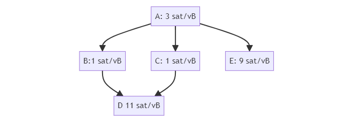
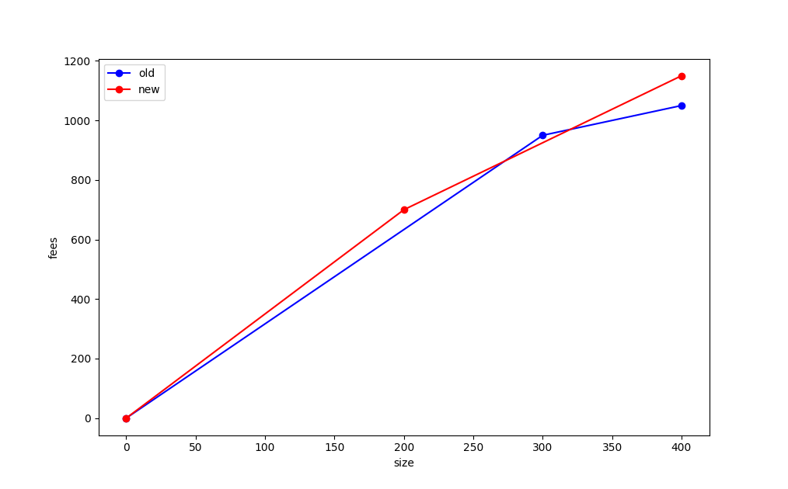

> *作者：sdaftuar*
> 
> *来源：<https://delvingbitcoin.org/t/an-overview-of-the-cluster-mempool-proposal/393>*

去年春天，@sipa 和我第一次向一群 Bitcoin Core 贡献者提出了一种新的交易池设计的概念，后来我写了一个 github isue（[Proposal for a new mempool design · Issue #27677 · bitcoin/bitcoin · GitHub](https://github.com/bitcoin/bitcoin/issues/27677)）。一整年过去，这个想法不断浓缩，我将在这篇帖子中为提议整体提供一个更新之后的抽象总结 —— 包括它的动机以及它会产生的影响 —— 让每个人都能跟上这个主题。

## 提议概述

这里是对草案实现中的交易池策略（mempool policy）变更的总结（[https://github.com/bitcoin/bitcoin/pull/28676](https://github.com/bitcoin/bitcoin/pull/28676)）—— 注意，所有这些术语和想法都进一步解释如下：

- 强制使用两个新的限制，以限制交易池中的一个 “*族群*（cluster）” 的规模，使得一个族群中的交易数量以及整体所占用的体积（以 vbyte 衡量）都得到限制。
- 抛弃现有的祖先交易和后代交易的数量限制。
- 更新 Replace-by-fee（手续费替换）规则，使得替代交易在且仅在它们将导致一个 “严格更优的手续费费率图”时被交易池采纳（下文将解释）。

注意，对交易图添加一种新的限制，会立即让现有的 “CPFP carve out” 规则失去意义，所以它也会被移除。见下文的讨论。

此外，通过限制族群的体积，我们可以实现更优的交易池内交易排序以便挖矿（下文将解释），也因此，两种额外的行为将被本提议修改：

- 更新挖矿代码，以利用可以由限制族群大小而实现的更优的交易排序；以及
- 更新交易池驱逐方法，以总是驱逐一组最不可能被挖矿算法选中的交易。

## 背景和动机

当前的交易池设计围绕着两种不同的排序，我们跟踪的每一笔交易都有自身在 “祖先费率排序” 和 “后代费率排序” 两种序列中的位置。

> **注**：一笔交易的 “祖先费率”，指的是这笔交易及其未确认的祖先交易的总手续费除以它们的总体积（以 vbyte 计），这些祖先交易是在区块中包含这笔交易时也应该包含的最小集合。而 “后代费率” 是类似的概念，是一笔交易及其在交易池内的后代（的总手续费除以它们的总体积），这些后代交易代表的是要从交易池中驱逐这笔交易时也应该一并驱逐的集合，从而避免在交易池中保存孤儿交易。

我们使用这两个序列来实现交易池驱逐和交易（挖矿）选择。无论什么时候，交易池的体积要超过指定限制时，我们就驱逐具有最低后代费率的交易，及其所有的后代交易。如此重复，直到交易池的体积回到指定限制之下。

当我们在构造区块模板时挑选交易时，我们就选择具有最高祖先费率的交易，并让其所有祖先交易进入区块。然后，更新交易池内剩余交易的祖先分数，以反映这些选择，再继续运行根据祖先费率挑选交易的算法，直至区块满载。

这些算法在几个方面存在缺陷。尤其是，驱逐算法**并不保证被驱逐的第一笔交易总是最差的挖矿选择**，而且存在一些情况，我们会将很可能进入下一个区块的交易驱逐出去。（下文有解释）。

此外，挖矿算法比我们维持的祖先费率序列要更加复杂，而且，仅仅查找我们的祖先费率索引是不足以确认两笔交易中的那一笔应该先从交易池中挖出的。缺乏对交易池内交易的全面排序，也让 RBF 计算难以跟矿工的激励一致，并且创造了扭曲 —— 有时候被我们用 RBF 替代掉的交易其实对矿工更加有利可图。

为了解决所有这些问题，我们可以转为维护一种对交易池交易的全面排序，以实现刚好相反的挖矿算法和驱逐算法，并提供更好的 RBF 规则，以决定什么时候允许替换。

### 案例：驱逐和挖矿并不完全相反

考虑这个交易图：

具有最低后代费率的是交易 A，5 聪/vB。但是，具有最高祖先费率的是交易 E，6 聪/vB。这意味着我们的挖矿算法会选择交易 E（以及交易 A）出现在下一个区块中，但如果我们的交易池恰好满了，我们的驱逐算法会选择交易 A，然后把整个完全驱逐出去。

> **注**：一个更复杂的例子夸大了这两种费率之间的差别，可以在[这里](https://github.com/bitcoin/bitcoin/issues/27677#eviction-mining-not-opposite)找到。

### 案例：我们当前的 RBF 规则并不总是激励兼容的

当 Bitcoin Core 收到一笔跟池内现有（至少一笔）交易冲突的交易时，它会使用（大致上）由 [BIP 125](https://github.com/bitcoin/bips/blob/deae64bfd31f6938253c05392aa355bf6d7e7605/bip-0125.mediawiki) 描述的交易池规则来确定是否应该接纳这笔新的交易（这将要求驱逐池内与之冲突的交易）。然而，这些规则中有许多形式的激励不兼容：

- “no-new-parents” 规则不考虑替代交易到矿工的好处 —— 它可能比所有被替代的交易都要好，即使它有新的、未确认的父交易。
- 规则要求这笔新交易的手续费率比其直接竞争者更高，但这不足以保证这笔新的交易就比如果采纳它就将要驱逐的交易更好。

为了展示一些具体的激励兼容问题，我们来看看这个例子：A 和 B 已经在交易池中了，而 A' 是跟 A 冲突的交易。

在这里，交易 B 的祖先费率是 50 聪/vB，而交易 A' 只支付 3 聪/vB。虽然在 BIP125 规则下，我们将把 A' 评估对 [A, b] 的一笔成果的替代，因为它比 A 支付了更高的手续费（3 聪/vB vs. 1 聪/vB），也比 A+B 整体支付了更高的手续费（30000 聪 vs. 10000 聪）。

没有采纳激励兼容的替代交易的情形也可能发生。考虑这个例子：A 和 B 已经在交易池中，而 B' 是 B 的潜在替代交易：

B' 无法替代 B，因为在 BIP125 规则之下，它所支付的手续费率比 B 更低，但是，B' 的祖先费率是 25 聪/vB，而 B 的祖先费率仅仅不到 2 聪/vB ！

还存在许多别的例子。

## 设计一种解决方案

## 维护一种交易池内的全面排序

为了解决跟驱逐和挖矿相关的问题，我们开始意识到，它们应该是对交易池的相反操作 —— 当我们需要驱逐交易时，我们应该总是驱逐对挖矿最没有吸引力的交易。在当前的交易池设计中实现这一点的困难在于，我们无法容易地计算最不可能被挖出的交易 —— 挖矿算法的时间复杂度为 $O(dn \log n)$，其中 $n$ 是交易池内存在的交易数量，而 $d$ 是对后代交易的数量限制，所以，在当前，要通过对整个交易池运行算法来决定先驱逐哪一笔交易，并不可行。

但是，这正是我们想要做的事情 —— 所以，一个问题油然而生：我们可以向交易池增加什么限制，来确保一套全面排序是可行的呢？找到答案的一种办法是思考：在一笔交易要加入交易池时，池内有多少交易的挖矿分数可能会改变？如果我们总是在交易池内维护一种完整序列，那么这就给了我们一个在添加一笔交易时，更新交易池需要多少工作量的概念。

这个问题的答案是：需要更新跟这笔新交易相关的每一笔交易的挖矿分数，不论是父交易还是子交易。考虑这个例子（感谢 @sipa）：

使用一些计算，我们可以看出，交易 B 有最高的祖先费率，是 73 聪/vB。一旦它和交易 A 被选入下一个区块，交易 D 就将有最高的祖先费率，是 72 聪/vB 。顺序是交易 D、交易 F、交易 F、交易 J 和交易 L。

如果一笔新的交易 M 到达：

那么，祖先费率就完全反过来了！祖先费率最高的交易变成了 M（80聪/vB），然后是 L（79聪/vB，一旦交易 K 被选入的话）、然后是 J、H、F、D 以及 B，跟交易 M 到达之前完全相反。

这解释了，为了在一笔新交易到达时约束更新挖矿分数所需的工作量，我们必须约束在交易图中相关连接的元素的规模。我们将这些相互连接的元素称为 “*族群*（cluster）”。

## 族群规模限制的影响

**我们可以保证交易池随时都有全面排序**

要对交易池全面排序，只需要（a）在每一个集群内使用某种 排序/交易选择 算法（例如现有的祖先费率）；以及（b）设计一种方式，能够合并排好序的族群。

关于（a），我们现在意识到，我们也许可以做得更好，不止于使用一种祖先费率算法来排序一个集群。对于非常小的族群，我们可以使用指数运行时算法，在所有可能的交易拓扑有效排序中选出最优的序列。对于更大的集群，我们依然可以回到使用我们的祖先费率算法，或者考虑更高级的策略，只要能将 CPU 使用量约束在合理范围内。

> **注**：我们使用 “*线性化*（linerization）” 一词来指代在一个族群内产生一个拓扑有效排序的过程。

关于（b），合并已经排好序的多个族群：这是非常直接的。假设我们有两个族群：$C_1 = [tx_{a_1}, ..., tx_{a_n}]$ 以及 $C_2 = [tx_{b_1}, ..., tx_{b_m}]$ 。为了确定将这两个族群合并成一个序列的最优方法，我们先找出 $C_1$ 族群中最高手续费率的一串交易，以及 $C_2$ 族群中最高手续费率的一串交易，两相比较；最佳的一串将是我们将包含在区块中的第一组交易。然后，我们从它所在的集群中移除这串交易，然后重复，直到所有交易都被选入区块。

> **注**：我们将一个族群内的连续、最高手续费率的交易串的计算称为族群的 “*分家*（chunk）”。可以可以在线性时间内计算一个已经线性化的族群的分家。

要了解这些话题的更多信息，以及其它相关的概念，见 @sipa 的[文章](https://delvingbitcoin.org/t/cluster-mempool-definitions-theory/202)。

### 有了全面排序的交易池，挖矿交易选择是非常快的。

我们只需按照分家手续费率的降序迭代族群，然后从每一个分家中选择交易，直到区块满载。

### 有了全面排序的交易池，驱逐就是挖矿的反面。

在交易池满之时，要运行驱逐算法，我们只需按分家手续费率的升序迭代分家，并选择要驱逐的分家，直到交易池回落到体积限制之下。

### RBF 变得可以跟矿工的激励兼容。

首先要问的是，“激励兼容” 应该意味着什么。要考虑这个问题，先看看这个例子，交易池的起始状态是这些交易（假定所有的交易都是 100 vB 的体积）：

然后，考虑一笔潜在的替换交易 C'，它跟交易 C 冲突，而且将产生这样的交易池：

我们如何知道要不要接纳交易 C' 呢？使用 BIP125 的规则，我们可能会说，应该拒绝 C'，因为它带来了一个新的未确认的父交易；或者，我们可能会说，这个未确认父交易规则很傻，因为我们只是使用另一笔 手续费/体积 都相同的父交易来替代一笔父交易，而交易 C' 比 C 支付了严格更高的手续费和手续费率，所以我们显然应该接纳它。

事实证明，无论哪一个解释，都无法完全让人满意。那么，考虑 “旧” 交易池（包含了交易 C）的全面排序，以及 “新” 交易池（包含了交易 C'）的全面排序。

“旧” 交易池的最优排序是：[A, B, C]、 [D]（方括号表示分家）。仅挖掘旧交易池的第一个分家的矿工将使用 300 vB 的体积、得到 950 聪的手续费；而挖掘整个旧交易池的矿工将使用 400 vB 的体积，获得 1050 聪的手续费。

同时，新的交易池的最优排序是：[D, C’]、[A, B] 。打包第一个分家的矿工将使用 200 vB 的体积获得 700 聪；而打包两个分家的矿工将使用 400 vB 的体积，得到 1150 聪的手续费。

我们可以将这些数据画成图，称为每一个交易池选择的 “手续费图”，其中 x 轴是矿工要包含的交易的体积，而 y 轴是矿工可以用一定的体积实现的最高手续费。我们填入 “旧” 交易池和 “新” 交易池的数据，就可以得到这样的手续费率图：

注意，来自旧交易池的点（300, 950）在新交易的线之上！这告诉我们的是，在某一个体积上，旧交易池会比新的交易池更好；类似地，某一些体积上，新交易池会比旧交易池更好。

我们要说的是，这些手续费图，是 “不可比较的”，意思是没有一者严格优于另一者，同时它们也不是等价的。如果红线总是高于蓝线、或重合于且至少在一个点上严格更好，那么我们就说新的交易池 “严格好于” 旧的交易池。这就意味着，无论要从交易池中选出多大体积的交易 —— 先不管区块接近满载时候的长尾效应 —— 矿工都总是会对 “新” 交易池更满意。

这张图展示了为什么许多判断是否应该接纳一笔替代交易的启发式方法不能令人满意。相反，为了确保一笔替代交易总是对矿工更好，我们提议，将 RBF 验证规则定义为交易池必须使用这种费率图得到 “严格更好” 的答案。

> **注**：为了防止免费转发（一种 DoS 顾虑），我们依然要求新交易的总手续费必须超过与其冲突的交易的总手续费，而且差值必须至少等于这笔新交易的体积 * 最小转发费率。不过这只有微小的作用，因为上述激励兼容规则已经要求总手续费不能下降 —— 这条额外的规则只是让数值增加一点。

**CPFP carve out 规则不再被支持。**

当前 Bitcoin Core 中的 CPFP carve out 规则允许一笔交易的后代交易的数量超出交易池限制，在这笔交易跟闪电协议有关的时候。

相关的背景是，默认情况下，我们的交易池策略会拒绝一笔进入的交易，当它将导致交易池内现有的一些交易拥有超过 25 个后代交易的时候。而在闪电网络的场景中（就我的理解），两方可能都在相同的父交易中有一些可以花费的输出。那么其中一方可能有激励用低手续费将交易 “钉” 在交易池中（使之无法被挖出），办法就是创建子交易来填满这个 25 笔后代交易的限制，但并不实质上追加大量手续费。这时候，另一方可能希望使用 CPFP 来为父交易追加手续费，但做不到，因为已经触及了后代交易的数量限制。

CPFP carve out 规则允许交易池超出这个后代交易数量限制，正好一笔，这笔进入的交易应该仅有 1 个交易池内的祖先（而且满足一些比较小的体积限制，以 vbyte 计量）。它的作用是，在两方协议中，当每一方在共享的交易中都有一个可以花费的输出时，任何一方都总是能够添加一笔子交易来为父交易追加手续费。要了解更多的背景和思考，请看这个邮件组[帖子](https://lists.linuxfoundation.org/pipermail/bitcoin-dev/2018-November/016518.html)。

但是，这个 CPFP carve out 规则仅在只有后代数量限制、没有其它拓扑限制的时候才是有意义的。有了提议添加的对族群体积的限制，这个 CPFP 规则就没有用了 —— 一个敌手可以利用族群的体积限制来阻止另一方向共享的父交易添加子交易。而且，因为族群限制不是具体一笔交易的特性（而后代交易的数量限制是），就没有直接的办法可以引入一种新的 carve out 规则，能够允许以受限制的方式绕过族群体积限制。

所以这里的结论是，carve out 规则必须被放弃，而闪电通道这样的当前依赖于它的项目需要使用别的机制来绕过这个问题。“[v3 交易提议](https://delvingbitcoin.org/t/v3-transaction-policy-for-anti-pinning/340/1)” 是提供这样的机制的尝试。

## 思考

### 限制族群的体积是否合理？

一个公平的问题是，网络上是否有某些使用模式跟限制族群体积的想法不相容？具体来说，网络中的其它参与者可以向一笔交易附加子交易、干预某人向该未确认的父交易附加自己的子交易的能力，是公平的吗？还是一种糟糕的设计呢？

对于这种具体的担忧，我不认为对族群体积的限制跟现在的后代交易体积限制的角色有实质上的不同。具体来说，任何时候，如果一个敌手可以向一笔交易附加子交易、触及族群体积限制（从而阻止额外的花费交易），那么也能以相同的方式触及后代交易的体积限制。

所以，我认为，基本上，族群体积限制不会比后代交易体积限制更糟（只要我们可以将族群体积限制设置得跟当前默认得后代交易总体积限制一样，我预期应该这样做）。

### 为什么族群的体积限制要以 vbyte 为单位？

这跟我们限制祖先交易和后代交易的体积的理由完全相同 —— 它为交易选择算法的工作表现设置了一个下界，在我们需要使用贪婪算法来解决背包问题的时候。具体来说，通过将祖先交易的总体积设置为区块体积的大约 10%，我们的贪婪交易选择算法将总能获得我们用别的背包解法可获得的最大手续费的至少 90%。

类似地，通过限制后代交易的体积，我们可以在驱逐交易时限制可以发生的免费转发的数量。

为了在族群交易池种实现相同的效果，我们需要限制分家的体积。最简单的办法就是限制一个族群的体积（因为一个族群可能仅由一个分家组成）。虽然理论上有可能将分家的体积限制到一个（比族群限制）更小的数值，但这会带来更多需要解决的理论问题，可能不值得花费这个力气和复杂性（因为一个族群内的各分家的手续费率并不是单调递减的）。

### 为什么要抛弃祖先交易和后代交易的限制？

族群交易池方法的一个好处在于，我们不再需要维护祖先费率和后代费率状态，这就意味着我们不再需要在 向交易池添加交易/从交易池移除交易/发现新区块 时迭代 祖先交易/后代交易。这意味着我们不再需要为了限制 CPU 用量而强制适用对祖先交易和后代交易的统计限制。

## 下一步

一份对应最近版本的 Bitcoin Core 主分支的草案实现已经[开启](https://github.com/bitcoin/bitcoin/pull/28676)。实现的细节依然在优化，而且族群体积限制和 RBF 的参数选择还需要在进一步的代码基准测试以及对历史交易数据运行本逻辑的效果分支之后决定。

向前看，这里引入的、用于分析交易池（以及 RBF）的框架，可能对于分析[交易包验证和交易包 RBF](https://delvingbitcoin.org/t/post-clustermempool-package-rbf-per-chunk-processing/190) 是有帮助的，虽然那些工作依然在进行中。
