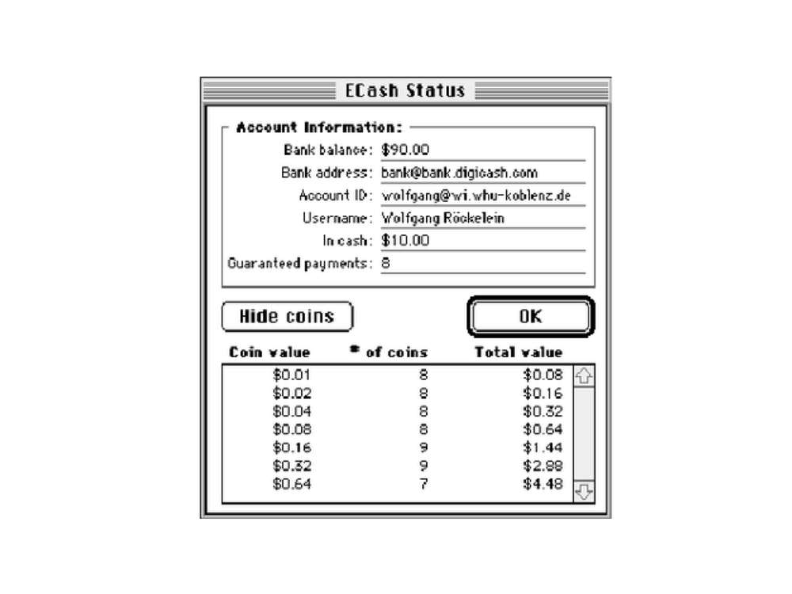
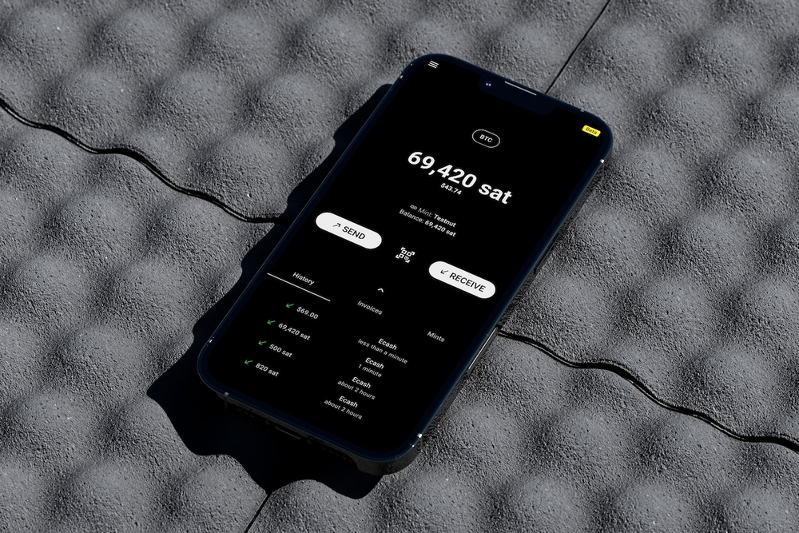
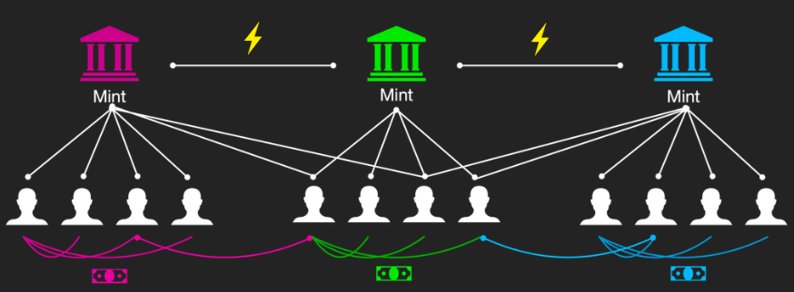

> *作者：Cashu Developer*
> 
> *来源：<https://blog.cashu.space/and-in-all-beginnings-indwells-a-magic/>*

- 宇宙中的一个 3D Cashu 坚果 -

在 90 年代，新旧世界交替，一开始是缓慢的，但突然就加速了；技术人员、社会活动家、政策制定者，甚至哲学家，都明白了，随着互联网的壮大 —— 以及我们每日花在网络世界中的时间增加 —— 政府和企业建造终极全景监狱（panopticon）的能力会变成对现代社会的最大威胁之一。他们当然是对的。

越来越多的电子设备和互联网渗透到我们生活中，从住宅到办公室、从传递电话到传递情书、再到新闻、商品订单和支付数据，我们对提供这些服务的电子中介的依赖也随之增长。我们的私人生活开始留下踪迹，无论我们走到哪里、也无论我们做了什么。

90 年代的隐私权捍卫者知道接下来会发生什么。著名的密码学家 David Chaum 也一样。Chaum 是一个闻名于世界的科学家，对密码学有开创性的贡献。他最为著名的贡献是对电子现金的构思，叫做 “Ecash”。David Chaum 知道，我们的生活日渐有更多部分发生在互联网上，所以，未来有一天，我们的商业会完全数字化。搭配上他在密码学中的天才，他发明了一种电子支付系统，让用户可以在网上购物，而无需牺牲自己的隐私。对一个大部分贸易依然依赖于实体现金的社会来说，个人交易对隐私性的需要既不激进，也不陌生。

要理解这个系统是如何设计的，你就想象一个银行账户和 ATM 机。借助这个 ATM 机，你可以从自己的银行账户中取出纸币；而所谓的银行账户，差不多就是银行里面一个记录了你的账户活动的 Excel 表格。当你使用 ATM 机的时候，它会吐出一些现金给你，然后你的银行账户余额就会减去你取出的数额。

- 旧版的 Ecash 钱包，由 David Chaum 的 DigiCash 公司开发。你可以看出，余额是由一个一个钱币加总出来的；每个钱币的面额都是 2 的幂数。 -

Chaumian Ecash 跟 ATM 机是一样的道理，只不过吐出的是电子现金。用户要登录进入自己的互联网银行账户，然后按下取款按钮；只不过，用户得到的不是纸币，而是一些跟纸币具有相同属性的电子数据：它是一种不记名的资产，代表着货币价值，可以私密且安全地从一个人手上转移到另一个人手上（也就是支付）。

Ecash 会被存储在一个钱包软件中，这个软件会运行在用户自己的电脑上；当用户想要在网上买东西的时候，他们可以直接发送 Ecash 给商家，就像逛商店的时候从自己的皮夹子里拿出纸币、交给店家。然后，商家会带着拿到的 Ecash 去银行、存入自己的银行账户。

整个设想就是这样的。每个人都喜欢这个想法。实际上，人们都非常非常喜欢它，以至于微软（Microsoft）、花旗银行（Citibash）、瑞士信贷（Credit Suisse）、德意志银行（Deutsche Bank）、万事达卡（Mastercard），以及其他大公司，都想加入其中。请记住，这还是 90 年代初。信用卡还没有普及开来，线上支付系统谈不上任何起色。

未来应该会运行在 Chaumian Ecash 上。但历史并没有这样发生。你到哪里去了，Ecash？

一份非常有趣的记录，来自Chaum 公司的一位前员工的文章《[How DigiCash Blew Everything](https://themonetaryfuture.blogspot.com/2009/04/how-digicash-blew-everything.html?ref=blog.cashu.space)》（[档案](https://web.archive.org/web/20240519233647/https://themonetaryfuture.blogspot.com/2009/04/how-digicash-blew-everything.html)）；然后是 Aaron Van Wirdum 撰写的 “[比特币创世文本](https://thegenesisbook.com/?ref=blog.cashu.space)” 系列中[关于 Ecash 的一篇](https://bitcoinmagazine.com/culture/genesis-files-how-david-chaums-ecash-spawned-cypherpunk-dream?ref=blog.cashu.space)（[中文译本](https://www.btcstudy.org/2021/10/02/genesis-files-how-david-chaums-ecash-spawned-cypherpunk-dream/)）。虽然 DidiCash 失败的原因并不清楚，但绝大部分的解释都指向 David Chaum 无法跟这些公司达成合理的交易。事后来看，这似乎是可以载入史册的错失良机，因为许多金融机构都表现出了对隐私保护技术的兴趣，微软甚至出价在 Windows 95 操作系统中预装 DigiCash 钱包。

David Chaum 本来可以开创一个电子货币和隐私性的新时代。但他失败了。相反，一度认为互联网中金融隐私会成为常态的金融业大公司们集体对这项技术失去了兴趣，走向了次优的选择：普通的、透明的账本簿记，也就是，不为用户提供任何密码学保护的 Excel 表格。

最后，我们得到的不是有魔法的互联网货币，而是信用卡、Paypal 以及互联网银行，他们用到的账本技术可能比文字还要古老。

## 比特币到来

虽然 David Chaum 的公司举步维艰、难以扎根，世界各地的密码学家都被电子现金的概念深深打动。Cahum 的 “盲签名（blind signatures）” 发明开启了超过 20 年的关于优化电子货币的研究。简单的[谷歌学术搜索](https://scholar.google.com/scholar?hl=en&q=ecash&ref=blog.cashu.space)显示，与 “ecash” 相关的学术研究论文超过 5700 篇。

行文至此，我们还没有提到 Chuam 的 Ecash 及其继任者所想象的电子现金系统的最大的问题。那就是，它们全都依赖于一个信任一个中心化实体会正当行事、防止通胀。

> 传统货币的问题可以归结为信任因素，这是让它们得以运作的必需。你必须信任中央银行不会贬值货币，但法币的历史满是这种信任遭到背叛的故事。
>
> —— 中本聪，2009（[来源](https://satoshi.nakamotoinstitute.org/posts/p2pfoundation/1/?ref=blog.cashu.space)）

中本聪发明了比特币，第一种完全去中心化（不依赖于某一个中心化实体）的、点对点的电子货币。通过 Bitcoin（大写的 “B”）网络，中本聪还发明了作为货币的 bitcoin（小写的 “b”）。因为这种新的虚拟货币无法与外部事物绑定，它需要自己的记账单位。

比特币与以往的 Ecash 设计还有一个重大区别：以往的 Ecash 有意与一种已经存在的货币（比如美元）和已有的金融网络（比如银行系统）相结合。比特币不需要这些。它也不想要这些。

## Ecash 的第二次复兴

比特币已经确立了自身是互联网原生的电子货币。比特币是真正去中心化的，它的用法也是完全自主的：用户可以保管自己的私钥，不需要为了使用网络而跟第三方交互。然而，过去十年已经证明，比特币要保持自己的核心原则 —— 去中心化 —— 是有代价的。这个代价是扩大吞吐量、手续费和去中心化之间的不断拉扯。不论何时，这几样事物总是需要取舍，比特币网络总是选择去中心化，这是理所应当的。

现实中，这种取舍意味着，今天，绝大部分覆盖日常购物需要的小额比特币支付（比如买一杯咖啡），都是由第三方中间商（也就是所谓的 “托管系统”）来处理的。托管钱包为用户保管资金，允许用户通过信任第三方来分摊运行基础设施和支付手续费的负担。

值得指出的是，对于那些想要储存财富的人来说，比特币的表现相当好，相对大额的财富也很少需要移动。然而，当你想要买一份报纸、订购一项服务、捐款给某个组织，甚至是买一杯咖啡的时候，（[数据](https://x.com/benthecarman/status/1638006709741289474?ref=blog.cashu.space)显示），绝大部分用户依然偏爱托管钱包，而不是通过链上交易来发送小额资金，更不想自己运行一个闪电节点。

这里面有两个问题。第一个问题是非常明显的：如果你信任一个第三方来保管你的资金，那么他们是有可能卷款潜逃的。托管系统都有这个风险。但第二个问题，可以说，在许多情况下比第一个问题还要严重，跟隐私性有关。今天，所有托管系统的工作方式跟老旧的 Excel 表是完全一样的、基于发明了几千年的技术：一个简单的、透明的账本，记录每一个用户的活动。

但是。这听起来不是很耳熟吗？这跟 David Chuam 的预测完全一样，差别只在于它不是法币的银行系统。然后，他为此提出了一个解决方案，不是吗？

现在，让我们来回答一个简单的问题：如果我们要为这种新的货币 —— 互联网货币 —— 开发一个 Ecash 系统，这个系统会长什么样？比特币上的 Ecash 系统长什么样？

- 比特币和法币的新 Ecash 钱包 -

如果商家、社交媒体协议、在线音乐和视频服务、商业银行以及所有其他金融服务，都可以基于比特币，提供可以替代旧式账户模型的、安全且隐私的支付方式，那会怎么样？

如果一个托管钱包、一项 VPN 服务，或一个工资支付系统的用户，可以取出电子化的不记名  token 到自己的手机上，然后直接发给自己的朋友，而不会被这些服务供应商跟踪，那会怎么样？

如果这些服务供应商无需存储烫手的用户个人数据、确保这些数据不受黑客以及其它威胁（这些威胁可能会毁坏用户数据，甚至更糟糕：将用户的一部分最敏感的信息泄露给全世界），那会怎么样？

那就会像一个网络：许多许多独立的局域服务通过互联网货币彼此相连。

- Ecash 铸币厂的网络；它们都通过比特币闪电网络彼此相连 -

帮助我们建造这样的世界吧，为我们最私密的网络行为恢复隐私性。帮助我们设计一个安全的系统，让它复杂保护用户的权利。帮助我们确保 Ecash 技术保持自由、开源，从而世界上的每个人都能平等获得这个系统、自己做主。

加入我们！

在 [cashu.space](https://cashu.space/?ref=blog.cashu.space) 了解更多。

