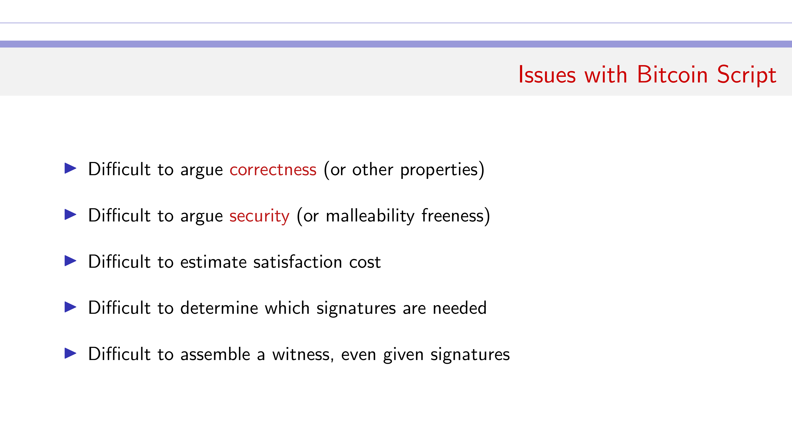
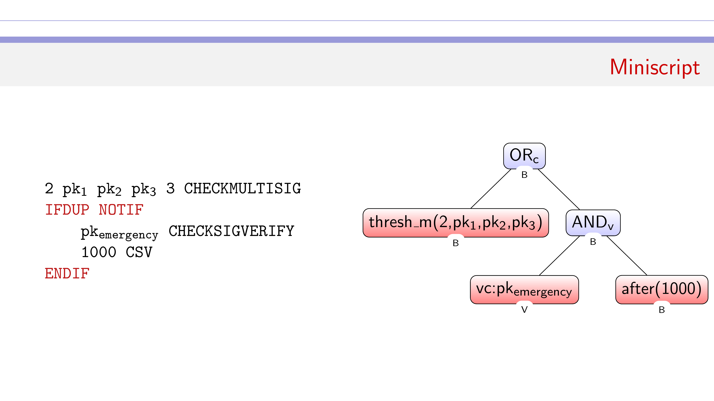
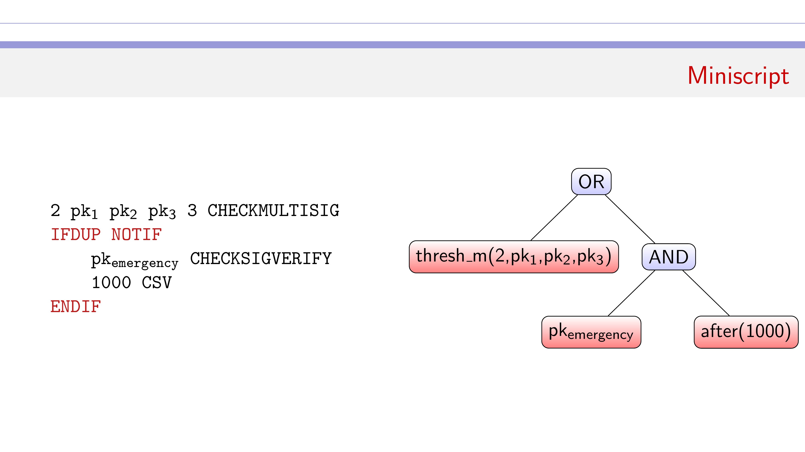

> *作者：Andrew Poelstra*
>
> *来源：<https://btctranscripts.com/tabconf/2021/2021-11-06-andrew-poelstra-miniscript/>*
>
> *本文为作者在 TABConf 2021 上的演讲的录音转译稿。*
>
> 视频：https://www.youtube.com/watch?v=mVihRFrbsbc&t=6470s
>
> 幻灯片：https://download.wpsoftware.net/bitcoin/wizardry/2021-11-tabconf/slides.pdf

## 引言

我准备讲讲 Miniscript。有些东西我[之前](https://btctranscripts.com/london-bitcoin-devs/2020-02-04-andrew-poelstra-miniscript/)就讲过，只不过讲述的方式更偏技术，侧重于讲解 Bitcoin Script 语言的困境、Miniscript 是什么、如何使用 Miniscript，等等。今天我准备从真正尝试使用比特币的人的角度谈谈 Miniscript，看看它是怎么解决这个行业中的一些我认为极为关键的问题的 —— 资金保管（custody）、密钥跟踪，等等。

在开始之前，我要先介绍一下本次演讲的结构。我准备花几页幻灯片稍微讲一讲比特币的脚本（bitcoin script）。比特币脚本是比特币内置的一个系统，用来定义资金的花费条件。一般来说，在普通的比特币钱包中，它使用的脚本的意思是 “为了移动这笔资金，交易需要提供某个公钥的签名”。这种脚本只是包在你的公钥上的薄薄的一层皮。但你还可以用脚本做出更有意思的东西。你可以指定，“这里有 3 个公钥，需要任意 2 个公钥的签名（才能花费这笔资金）”，比如说实现基于 2-of-3 多签名的保管方案。你还可以检查某个公钥在启用之前是否经过了特定的一段时间。你可以检查某个哈希值的原像是否被揭晓（这就是闪电网络的 HTLC 的工作原理）。所有这些巧妙的技术特性都可以在比特币脚本中实现。

但在现实中，有一些问题导致这些特性极难使用。结果就是当前的绝大部分比特币钱包完全不使用有趣的脚本。它们不单这么做，还做得彼此之间无法互通。

我想证明的正是，在 Bitcoin Script 以外，我们还有别的办法可以编写比特币的脚本；你可以使用这个被称为 “Miniscript” 的方法，获得一个易于分析的脚本编写框架。

资金保管是我持续关注的问题。你如何保管你的币？“可计算”，意味着有了 Miniscript，你可以分析你的脚本在做什么。你可以分辨出它的开销，因此可以作出准确的手续费估计。你可以确定你的脚本的语义特性。你还可以问这样的问题：“给定一些任意复杂的脚本，有人能不使用我的签名而使用这些脚本拿走我的资金吗？”对任何复杂的脚本我们都应该追问这个问题。在 Miniscript 之前，答案基本上就是：“我不知道。别用它。老实使用你知道的东西、老实沿用模板，老实使用大家分析过的东西。” 但有了 Miniscript ，你就可以编写任意复杂的脚本，同时依然能回答这个问题。第三个关键词是 “可组合”。这个很有趣，它本身是一个技术词汇，但它的前提非常直接。如果你有一个高级的花费方案（spending policy），但你想把其中的某一部分替换成一些复杂的东西，如果你只有 Bitcoin Script，你是无法轻易且可验证地做到的。但有了 Miniscript 你就可以做到。

一个例子是，你是一家公司的董事，这家公司持有大量比特币。你同意参与某种多签名方案，5 名董事中需要 4 位的签名才能移动资金。你是成员之一。现在其他人要求你提供一个公钥。但你不想给它们 一把 公钥，因为你可能会弄丢对应的私钥。你不把自己的比特币放在只有一个公钥控制的输出中也是同样的理由。你想要一些冗余，一些弹性。所以，理想情况下，你应该能表示 “在这个 4-of-5 方案中，我的部分将是一个 2-of-3 方案。我把这三个公钥放在了不同的地点，按不同的方式保护了起来。” 使用 Bitcoin Script 你是做不到的。如果某人向你请求一个公钥，而你回复以这样复杂的公钥组合和规则，收到信息的人以及参与同一个脚本的其他人都需要艰难地验证你这部分没有错。基本上，你做的事情就是提供一段脚本（一段计算机代码）、要求把这段代码插入到另一段计算机程序中，而这段程序的模式并不符合人们思考花费方案的方式。

## Bitcoin Script 的问题

我这里有几张幻灯片列举了 Script 的问题。有一些是非常技术性的，只有钱包开发者才会在意。有一些则是每个人等应该关注的，尤其是前两个。

在你创建一个比特币脚本的时候、你要定义花费方案的时候，你会在乎什么呢？你关心它是否正确，在资金应该移动的时候它就会移动；然后你关心安全性，在资金不应该移动的时候它就不会移动。这两件事情在比特币 Script  中是很难表达除了的，因为 Script 是一种底层的基于堆栈的编程语言。它是一系列对计算机（网络中的所有节点）的微型操作指令，意思差不多是 “移动这个数据到这里；调换这个数据和那个数据；把这个数据加入那个数据；把这段数据解读为一个签名，然后使用另一个应该解读成公钥的数据来验证这个签名的正确性”，等等。它表达的是执行的步骤，而不是在哪些条件下资金应该移动。但后者才是人们思考的方式。人们是先想出一组花费条件，然后希望验证自己写出的脚本是否不多不少地表达了这组条件。

放在底部的两个则是钱包开发者应该关心的问题。我把它们放在这里，是因为它们正是你无法随便下载一个比特币钱包然后享受脚本的灵活性的原因。你没法轻松粘贴一个多签名脚本进去、为之附加 5 个硬件钱包、设定第二个联合签名者，等等。你需要一个专门支持这些特性的钱包，如果没有的话，你就只能通过网络交易来转移资金，而不能通过数据导入将你的币（的控制权）从一个钱包直接交给另一个钱包。你没法导出一个方案然后导入别的设备。原因在于，作为一个钱包开发者，当你尝试使用 Script 实现这些特性的时候，你需要搞清楚如何构造使用这些脚本的交易。事实证明，你有一堆技术问题需要解决。而且你需要为你创建的每一种脚本专门解决这些问题。

如果你想做出一个有趣的钱包，你需要雇用一堆比特币专家来定义一种能让你的钱包变得有趣的脚本。他们需要完成所有的分析、解决许多问题：交易会变得多大？如何估计手续费？如果已经拿到了签名，应该按什么次序放进去？所有这些细节问题都要解决，不然你的软件就没法用，但这些本来不是你真正关心的事。它们也不是你的业务逻辑的一部分。如果这些问题在一定程度上都有确切的解决方案，那就更好了。

聚焦起来，你会看到我一直在暗示的两个问题。互通性（interoperability）和可组合性（composability）。

互通性的意思是，假设你正在使用某一种形式的一款有趣钱包，现在需要使用另一种形式的一款有趣钱包，那么你将不得不二选一。而且当你需要从一者迁移到另一者的时候，你需要在网络上发起交易。假设你想做一次 coinjoin，你正在使用 BitGo 钱包、Blockstream Green 钱包和 Bitcoin Core 钱包，你希望三者一起签名一笔交易，这是非常难做的。这三款钱包各有不同的脚本模板，而且都不能理解其它钱包的脚本。

可组合性的问题也与此相关。我们回到董事会的例子中。我是 5 名董事之一，我们希望任意 4 位董事一起就能移动资金。我说，“我不想给你们一个公钥。我使用 BitGo 来保管我的资金，所以我准备给你们 BitGo 的脚本，它是一个 2-of-3 多签名脚本，其中只有 1 个公钥是我的。我希望你们能把这段脚本加入到董事会的高级方案中去”。使用 Script，你基本上做不到的。

## Miniscript

Miniscript 背后的技术理念是，我们可以把能够实现的所有小东西、人们在实践中使用的所有单体脚本模块 —— 基本上就是签名检查、哈希原像检查、时间检查 —— 以及可以组合他们的基本方式，都归纳出来。

你可以使用 “AND”，表示所有的条件都要满足；你可以使用 “OR”，表示只要其中一个条件得到满足即可；还可以使用阈值机制，就是介于上述两者中间的情形。只要你说 “要移动这笔资金，这 5 件事情中需要有 3 件得到满足”，我们就可以构造出表示这些条件的简短脚本模板。

我们不直接使用 Bitcoin Script，而使用这种更高级的语言；在这种更高级的语言中，所有的元件都有更多的含义。这不是什么独到的想法，人们已经尝试了许多次，为 Script 制作高级语言。Miniscript 有两个很酷的特性。第一个是，Miniscript 并不是 Script 之外的一种独立语言，也就是说，它的工作模式并不是你编译它、编译器尝试解释你的代码然后输出具有相同含义的一段脚本。Miniscript 跟 Script 实际上是直接的一一对应关系。你是直接在 Script 上编写 Miniscript 代码的，也可以直接解码。你可以看到出现在链上的就是你的花费方案。你是在隐秘地使用Script。Miniscript 跟习惯上认为是高级语言的东西的另一个区别是，它不止是编写命令程序的一种更友好的方式。它不是一种告诉节点 “干这个、干那个，要是没问题就让币转走” 的更友好的方式。Miniscript 的工作原理是它可以直接表示你想表达的花费条件。

这里我做了一张图。左边的是一段比特币脚本，我添加了一些缩进和颜色，以隔出段落。但 Script 不是一种结构化的语言，所以我也作了一些随意的选择。右边是一个 Miniscript 程序，表达了相同的东西。两者是完全相同的。一般来说，在你使用 Miniscript 的时候，不会有这样的图示，只有文本，但你可以读出这个树结构。你可以看到这里面都有什么。我并行放进了 4 个公钥，顶层有一个 OR（或条件）。这个脚本有两半，要花费锁定在其中的币你需要满足其中一半。左边的是一个多签名脚本，我称为  ` thresh_m ` ，意思是 “需要这组公钥中的一定数量的公钥签名才能移动资金”；具体来说这是一个 2-of-3 的花费方案。右边是一个 AND（和条件），如果你想用这一半脚本，你需要同时满足两个条件：第一个条件是一个替代性紧急公钥的签名；第二个条件是  ` after(1000) ` 。 ` after(1000) ` 非常酷，表示这个分支只能在资金一直没有移动、持续 1000 个区块之后才能使用。

这个花费方案背后的想法是，我有一种常规的花费方案，通常情况下可以使用这个 2-of-3 的花费方案来移动资金；但如果什么地方出了问题，比如其中两个签名人弄丢了自己的私钥，这些钱一直没有移动（不必非得是 1000 个区块，可以是一年，也可以是未来具体某一天），只要这些资金长时间没有移动，那么就可以使用这个紧急公钥。而且这个紧急公钥也只有过了这么久才能使用。其中的理由是，这是一个紧急公钥，它可能有一些别的信任模式，是你在平时不想使用的。

你应该可以看出，左边的这些代码，是我非常难以表达的，我很难解释左边的代码如何匹配了我想要的实际花费方案。但使用右边的代码，只要我想聚焦、想解释它在干什么，我只需要删除许多无关的东西（在 Miniscript 中用 ` b `  和 ` v ` 来表示），就可以得到子脚本，如此类推。这些都是细节，对用户来说并不重要，只对钱包开发者有意义。只要我抛掉这些数据，你就可以看到这个高级的花费方案。

你看这里有一个 OR，然后是一个 AND，我是在直接表示我的花费条件。不管你是一个审计员，还是只是想参与这样的脚本的普通人，你都可以看懂这个，直观地看出这个脚本是否匹配你最开始的预期。假如你想问 “能不能不用我的公钥就花费这些资金呢”，也可以在其中得到解答。假设你的公钥是  ` pk1 ` ，那么可以看出有许多方法可以不使用你的公钥就移动资金。第一种，显然的， ` pk2 ` 和  ` pk3 ` 一致决定签名。这时候你的公钥无足轻重，很容易看出来。第二种是紧急花费条款，可以看到紧急条款只会在 1000 个区块后激活。如果一切都正常，就必须动用我的私钥吗？我还有更直接的提问方式。我可以把整个时间锁遮起来。更酷的是，这些分析可以自动化。我可以要求计算机或者一个设计用来分析这些 Miniscript 代码的程序：“如果这些币的年龄只有 10 个区块，答案会变吗？” 计算机可以把所有依赖于长于 10 个区块的时间锁的分支都抛开，然后分析。我可以问：“如果我的公钥确实在其中呢？脚本看起来会是什么样？还需要满足别的什么条件？”“要是我的公钥明确不在其中呢？我需要满足什么条件才能花费？” 可以看出，在这里我们都能得到非常准确的答案。

如果你的目标是说服你自己这个脚本是合理的，这已经够好了。事实上，对任何脚本你都可以做到。你不需要雇用一个比特币专家团队来建构右边这棵树。只要你对比特币的工作原理有非常浅层的理解就可以了，不过可能需要你对自己想要的威胁模型、你的资金安全策略有深入的理解。这正是你需要的，因为比特币技术专家不一定精通你的安全模型，反之安全专家也如此。理想情况下，你不需要找到双料专家。

这也为我提出的两个问题（互通性和可组合性）引出了解决方案。互通性是自然而然到来的。如我所说，你可以自动化地追问这些问题、遍历所有脚本并获得答案。这就意味着，我们可以编写通用的代码库，我们可以写出许多个 Pieter 和我，来回答这些问题。钱包开发者只需直接使用，就能开发出可以互通的钱包，甚至在他们要玩一些高级技巧时也不例外。就我所知，使用这个工具的一款主流钱包是 Specter Wallet。还有一种建立在 Miniscript 之上的钱包代码库，叫做 “BDK”。我记得今天好像有一个研讨会。

第二个问题就是可组合性。你应该可以直观地看到它是如何如何解决可组合性的。如果我需要成为一个公钥，那么其中一个红色方块就是一个代表 Andrew 的公钥。我说：“我不想提供一个公钥，我想提供一个 2-of-3 的脚本。我需要一些更复杂的东西。” 我可以把我的红色公钥方块替换成其它条件的任意子树。每个人都可以验证这一切，因为我只是把树上属于我的一小部分替换成了更奇特的条件。

在我继续之前，我想提供一个展示其有用性的终极例子。设想一家公司，像 BitGo 这样，其商业模式是自己作为一个联合签名人；或者像 Blockstream Green 这样，做的事情是一样的，只不过是给个人客户服务的。他们的模式是，径直签名客户要求他们签名的任何交易，除非你在另外的渠道联系他们并要求他们中止；或者是他们在网络中发现了奇怪的事情。他们有一些基本的规则需要遵循。从他们的角度看，他们关心的是，你的币要存储在一个需要他们签名的脚本中。这两个钱包当前采取的方法是，他们有一个固定的脚本模板，你必须使用这套模板。简单的 2-of-3 多签名或者 2-of-2 多签名脚本。但 BitGo 唯一在乎的事情、Blockstream 唯一在乎的事情，是必须使用他们的公钥。

所以，你可以设想一种 Miniscript 代码，在顶层是一个 AND，而 AND 的一个分支是他们的公钥。另一个分支可以是完全任意的，他们甚至不需要知道。在比特币脚本中，他们必须阅读整个脚本：“这里有 bug 吗？你能不能用别的条件来绕过？”在 Miniscript 中，你只要看到一个 AND，你就知道两个条件都需要被满足。如果你只关心其中一个，或者只要你控制着一个就不在乎其它，现在你可以确信自己的签名必须出现。这让 BitGo 和 Blockstream Green 都可以做得更加有趣、灵活，而且他们的用户也可以拥有更多的自由、使用自己的公钥来做更有趣的事 —— 分割他们的公钥，嵌入多签名，等等。

## 未来的工作

最后一点，虽然有点投机，但我希望从面向未来的技术角度谈谈。从技术上来看，我一直把 Miniscript 讲成是一组脚本模板。你可以看到这些红色和蓝色的方块，都是一些操作码什么的。但实际上，Miniscript 也是脚本的另一种范式。它是一种把你的花费条件直接表示为这些花费条件树的方法。我总结下来，Miniscript 描述了需要满足的条件，而不是执行的指令。使用比特币脚本有直接的好处，但另一件很酷的事情是，原则上我们不需要把 Miniscript 翻译成比特币脚本，我们可以让任何语言都可以表达这些花费条件。只要你可以从那些语言中抽取片段来表达这些 OR、AND 和门限条件等等，你就可以把那种语言或其子集翻译成 Miniscript 代码，Miniscript 代码也可以翻译回去。有趣的事情是，如果你有两个系统，各自拥有完全不同的脚本系统（比如比特币脚本 vs. 以太坊的 EVM），在原理上，你可以为 EVM 编写一个 Miniscript 后端，然后你就可以拿一个比特币脚本解码为一段 Miniscript 代码，然后重新编写成一个以太坊程序。这样你的花费条件就可以在比特币和以太坊上以相同的方式表达。而且你可以验证它们是一样的，不管从哪个方向看都是。这是一种很棒的技巧，其自身对那些需要在两条链上开发的人就足够有趣。

但另一个有趣的事情是，如果我们要在比特币脚本上开发插件，或者替换比特币脚本 —— 我花了许多时间来思考区块链的编程语言，然后我可以使用 Miniscript 作为尝试这样做的用户的指南。

我有两个延伸的方向。其一是，考虑在我需要获得跟 Miniscript 的兼容性时替换比特币脚本。这样做之后，现有的 Script 和 Miniscript 的用户可以直接将自己的代码翻译成我的新语言。我可以检查转化的效率如何、这样做对手续费率的影响如何、对他们回答关于脚本的不同问题时候的计算效率影响如何。这非常酷。这意味着我可以开始优化底层的比特币脚本系统了。我们不再需要把脚本理解为人们已经在使用的噩梦，现在我可以让他们学习这种全新的东西，我可以说 “Miniscript 提供了一种直接的缓解路径”。不仅仅是因为我是一名开发者，我还关心使用我的软件的人，我在乎真的有一条环节路径。对于在乎这一点的用户，他们可以尝试我的代码，然后再回去。他们不必发奋学习一大堆东西。Miniscript ，因为它不是一种编译后的语言，它只是对底层脚本的重新解释，所以你可以做到。你可以拿到一段比特币脚本，把它解释成 Miniscript 代码、重新解释成 EVM程序，或者重新解释成 Simplicity 代码、解释成未来会出现的无论什么东西，然后解释回去。你不仅有一种便利的办法可以翻译回去，你还可以 【录音中断】……