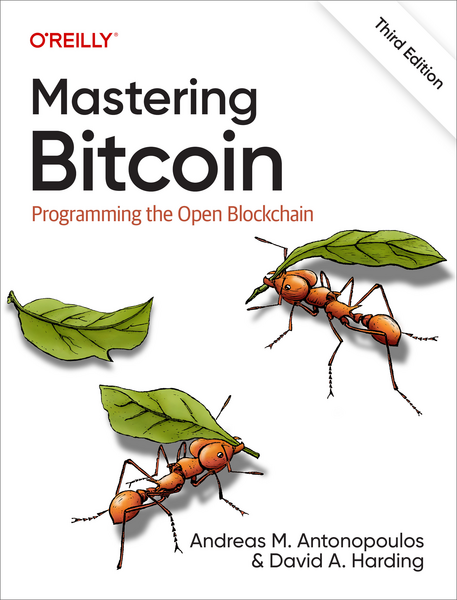

> *作者：David A. Harding*
> 
> *来源：<https://dtrt.org/posts/mb3e-announcement/>*

我很高兴能宣布，由 Adreeas Antonopoulos 和我联合编写的《精通比特币（第三版）》现已由 O'Reilly Media 出版。

## 如何获取本书？

- [O'Reilly 网站](https://learning.oreilly.com/library/view/mastering-bitcoin-3rd/9781098150082/)提供了一项订阅服务，通过这项服务你可以立即读到我们的书以及其它几万本技术书籍，而且还有许多额外的资源。订阅者可以在这版《精通比特币》定稿之前读到提前发行版本。我也在给这个网站编写大概 100 个小测验问题，帮助你在读完每一个章节之后测试自己的理解（详情见后文）。
- *电子书* 将在 11 月中旬开始发售。
- *纸质书* 将在 12 月初开始发售。你可以在 [Amazon](https://www.amazon.com/Mastering-Bitcoin-Programming-Open-Blockchain/dp/1098150090) 这样的网站上预订。
- 书中的 *源代码* 将由我在纸质书出版的一周年之后在 CC-BY-SA 许可下发布，这是我跟 O'Reilly 公司的合约允许我发布的最早时间。使用更严格的许可的版本可能会很快推出；我已经给出了我的许可，但还有其他权利人。

我将在可以发布更多信息时更新本节。

## 新内容

自上一版《精通比特币》出版以来已过去了六年。比特币最好的部分屹立不改，但也有许多优化，让比特币变得更安全、更可扩展也更隐私。第三版就介绍了一部分这样的提升：

- **Schnorr 签名**是一种新的授权比特币交易的强大方法。我们为它的工作原理提供了一份易懂的解释，启发来自 Gregory Maxwell 和 Andrew Poelstra 的[超乎寻常的简洁描述](https://nt4tn.net/papers/borromean_draft_0.01_34241bb.pdf)，从 Claus Schnorr 最初的交互式身份验证协议说起。我们点点滴滴地加入细节，最终得出今天在比特币上实现的 BIP340 标准。
- **无脚本式多签名**使得几乎无数个人可以一同创建一个公钥，并仅在每个人都提供一个签名时才能花费这个公钥名下的资金；这极大地提升了比特币的可扩展性和隐私性。Schnorr 签名让无脚本式多签名变得如此简单，我们只需几个段落，就可以描述其数学基础。然后，我们简要介绍了 MuSig 多签名协议家族，它们提供了对抗恶意联合签名人的额外安全性。
- **默克尔抽象语法树**（MAST）同样大大提高了比特币的扩展性和隐私性；它允许在比特币脚本中使用几乎无限数量的条件，而且只有被满足的条件才需要出现在链上。
- **支付到合约（P2C）**是一种修改比特币公钥的方法，[最早出现](https://arxiv.org/abs/1212.3257)在 2012 年，但没有得到许多讨论。它使得我们可以用一个隐私的承诺来接收资金，这个承诺既可以永远保持神秘，也可以公开证明。它既强大又简单，所以我们可以快速地讲解它。
- **Taproot** 结合了由无脚本式多签名、MAST 和 P2C 提供的能力，并融合为一个协议。因为我们前面已经介绍了这三种基础性技术，所以很容易就能解释 taproot 的工作原理，以及它在可扩展性、隐私性和同质性上给比特币用户带来的巨大提升。
- **Bech32 和 Bech32m**是分别由 “隔离见证” 和 “taproot” 升级引入的新的地址格式，让地址更易于使用。我们重写了这本书关于地址的整个章节，现在，它会从比特币最早的基于 IP 地址的支付协议 —— 可能也是 “地址” 这个名字的来源 —— 讲起，从 base85check 地址一路讲到由 bech32(m) 带来的提升。
- **手续费管理**在本书的旧版也有简要解释，但因为近期比特币手续费市场的开发，我们加入了多得多的细节。我们介绍了 RBF 和 CPFP 两种手续费追加方法。我们也介绍了它们可能会失效的情形（“交易钉死”）以及近期为合约式协议提出的部分解决方案（比如 “交易包转发”）。
- **无脚本式门限签名**可以作为带有一种额外特性（可验证的私钥分割，verifiable secret sharing）的无脚本式多签名变种，容易得到解释；这也正是多年以，我和另一位开发者在开发者讨论中遇到了困难时，Gregory Maxwell 私下给我们的解释。我们又一次吸取了来自他的启发，给出了一份非常易懂的解释。
- **致密区块过滤器**是一种让轻客户端了解影响它们的钱包的交易的新方法。这种方法对客户端来说更加隐私，也更少对节点造成困扰。我们使用简单的算术和一对色子，介绍了致密区块过滤器的原理，在进入实现细节之前为读者打下了一个坚实的基础。
- **致密区块**既加速了区块的传播，又极大地降低了运行一个全节点的网络带宽要求。我们介绍了它的工作原理。我们也介绍建立在致密区块基础上、在可以相互信任不会发动拒绝服务攻击的节点之间提供更快的区块转发的 FIBRE 区块转发系统。
-  **BIP8 和 speedy trial** 是激活软分叉的新方法。我们不会介绍很多细节 —— 我完全不知道下一次软分叉我们会使用什么方法 —— 但提及了在 2021 年 taproot 激活期间这种激活方法被广泛讨论的特性。
- **一份新的附录**在中本聪介绍比特币的原创论文副本之后添加。添加这个附录是由 Matthew Zipkin 建议的，它是我在 2016 年撰写的《[比特币论文勘误](https://gist.github.com/harding/dabea3d83c695e6b937bf090eddf2bb3)》的一个少量更新的版本，介绍了中本聪在论文中描述的比特币与他及后来的开发者真正实现的比特币的差异。

## 新的联合作者是谁？

本书的主要作者是 [Andreas M. Antonopoulos](https://aantonop.com/)，几乎每一个比特币人都知道他。他作过不计其数的演讲，出席过几百档播客，制作了许多视频，还写了好多本关于比特币的书。过去十年里，他的大部分工作都致力于引导初次接触比特币的人、向他们解释比特币的工作原理，并帮助他们避开后果严重的错误。要说有多少人因为他而改变对比特币的开发、多少比特币因为他及时的建议而免于被盗、丢失，只能说是不可胜数。

而新加入的联合作者 [David A. Harding](https://dtrt.org/)（就是我啦！）也已经有接近十年的撰写关于比特币的技术文献的经历，但我瞄准的是更小的群体 —— 开发和直接使用比特币协议的人，比如 Bitcoin Core、闪电网络和多个钱包库的开发者。我最著名的身份是 [Bitcoin Optech](https://bitcoinops.org/) 周报的联合作者。我的目标一直是让这些开发者从长期来说更有成果一些，这样比特币协议就能更快去到它想去的任何地方。

至于这本书，我们从 Andreas 的第二版的文本以及他为第三版建立的一个大纲开始。我修改了大纲，也加入了我在此过程中想到的一些东西（以及由早期审稿人建议的东西）。第三版中出现的所有文本的最终决定权都在我，所以任何问题也都由我负责。

## 更新

除了几十页的新材料，我们还对本书原有的部分做了一些实质性的改进：

- **授权和身份验证的泛化**：本书的旧版本介绍了比特币的 Script 语言，但比特币的新特性存在于 Script 范围之外。举个例子，P2WPKH 地址和 taproot 脚本路径的默克尔证据。我们从 Peter Todd [在 2014 给我的一个评论](https://github.com/bitcoin-dot-org/Bitcoin.org/pull/563#issuecomment-56127696)中得到启发：我们展示了比特币的授权和身份验证方法的演化，从白皮书所介绍的版本（公钥与签名）到 Bitcoin 0.1 软件所实现的版本（脚本公钥与脚本签名），再到隔离见证（见证程序与见证结构）。这不仅为现在的比特币输入验证中的大量不同特性提供了背景，也显示了为什么比特币的 “脚本” 和 “程序” 不是为任意计算而设计的 —— 它们可以被认为只是非常灵活的公钥和签名。
- **术语**：中本聪给了我们比特币，但是，唉，他并没有给我们一套前后一致的术语。Bitcoin Core 开发者常常使用从他们的代码的函数命名中派生的术语。其他开发者又使用不同的术语。幸好，在本书的编写期间，Mark "Murch" Erhardt [提出了一个 BIP](https://github.com/murchandamus/bips/pull/1)，推荐了跟交易相关的术语。他的 BIP 还未定稿，所以可能会变化，但我们更新了全书的每一个章节，以使用建议的术语。我们知道其他开发者和技术作者正在对自己的软件和文档作类似的更改，我们都认为这会帮助开发比特币的每一个人。
- **“染色币” 现在换成了 RGB 和 Taproot Assets**：自本书初版以来留存至今的一个介绍染色币（colored coins）的章节，更新成了介绍两种为在比特币区块链上锚定非比特币转移的新协议。两种协议都基于 “支付到合约”，所以，有了前面跟 taproot 有关的介绍，我们只需介绍他们俩的共同砖石：“客户端验证” 概念。
- **更多的备份及复原系统**：六年以前，本书推荐一种简单的备份套装，由 BIP 32/39/44 组成。今天，钱包备份多了很多选择，每一种的取舍都各有道理。在确定性的密钥生成方面，BIP32 依旧保持至高的地位，但我们也介绍了不同的种子词生成算法（例如，BIP39 vs. SLIP39 vs. Electrum vs. Aezeed，还简单提及了 Codex32）、对比隐式路径（例如 BIP44）和显式路径（例如 “描述符”），还介绍备份钱包标签（致敬 BIP329）和其他数据（比如通道状态）的重要性。
- **交易的每一个字段**：旧版本介绍了一笔交易所包含的绝大部分字段，但这次我们用几乎全新的一个章节来按顺序介绍一笔序列化交易的每一个字段，并解释它们的用途。与我看过的其它介绍不同，我们采取了 “以隔离见证为原生” 的方法，将隔离见证所添加的字段视为一笔交易的一等重要部分，仅在章节末尾才提到传统交易的序列化应移除哪些字段。
- **许多小的纠正与更新**：我无法统计自上一版出版以来，多少小的细节需要更新。但是，毫无疑问，新版本中也会有错误、缺漏、令人困惑的过时信息，所以我鼓励每一位读者也检查检查出版社为第三版提供的 “[勘误页面](https://www.oreilly.com/catalog/errata.csp?isbn=9781098150099)”。
- **BIPs**：前一个版本的列举了所有 BIP 的附录，换成了 Bitcoin Core [文档](https://github.com/bitcoin/bitcoin/blob/master/doc/bips.md)的一个略微编辑之后的版本，列举了 Bitcoin Core 所实现的 BIP。一些人认为，所有的 BIP 都是建议开发者社区普遍采用的标准，但许多 BIP 都是垃圾。我们不希望本书的读者花时间去学习这些垃圾。Bitcoin Core 开发者只采用他们认为对软件的用户有用的 BIP。这并不是有用的 BIP 的全面清单，只是一个非常棒的列表，读者不必担心我们有所偏爱

## 缺少的部分

本书的技术审稿人包括 Mark "Murch" Erhardt、René Pickhardt、Olaoluwa Osuntokun 以及 Jorge Lesmes，每一位都提供了让人惊讶的反馈。我尽己所能地解决他们的担忧，但有两项实质性的改变我已没有时间来完成了：

- **更好地讲解闪电网络**：本书新版的文本提到 “闪电网络” 几十次，也解释了何以基础层的设计会影响二层的运行，但一位审稿人正确地指出，我们应该重写开头的概述性章节，以更好地反映有多少人正在使用集成了闪电网络的钱包。
- **部分签名的比特币交易（PSBT）**：虽然我们在本书中提到了 “PSBT”，我们没有讲述任何细节；另一位审稿人认为这是一个刺眼的遗漏，因为 PSBT 在今天的比特币的许多方面都很重要，从硬件签名设备到多方协议。

我完全同意这些审稿人的意见。我希望 O'Reilly 有兴趣在几年后出版本书的第四版，并且继续邀请我作为一位联合作者，让我可以纠正这两项明显的遗漏。

## 关于 Brink

我很高兴地宣布，我将把《精通比特币（第三版）》带给我的版税尽数捐给一个 501(c)(3) 非营利组织 [Brink](https://brink.dev/)。Brink 当前为多位全职开发 Bitcoin Core 的[开发者](https://brink.dev/programs)提供资助。

我曾担任 Brink 的董事会成员，现在是其奖金委员会的成员，两个身份都是无薪酬的独立成员，而且我也很高兴能为其杰出的开发者团队提供财务上的支持。我并不期待自己能收到很多版税 —— 技术专著一般不会成为畅销书 —— 但我会保持关注，并在[这份表格](https://docs.google.com/spreadsheets/d/1sclXwm86JE2rpTfymZz9yqysRHZ0JEpemEL3F5XZvH0/edit?usp=sharing)中公开自己的收款和捐赠。

## 哪些书做得更好

《精通比特币》的第一版是第一本真正付梓的比特币技术书籍。自那以来，许多别的书，以各自的方式处理这个主题，也得到了出版。我阅读了其中一些，认为它们都很棒，所以我认为值得将它们与《精通比特币（第三版）》（*MB3E*）比较一下。显然，这种比较基于我**个人的极端偏见**。

- [Grokking Bitcoin](https://www.manning.com/books/grokking-bitcoin)，由 Kalle Rosenbaum 撰写，是我个人最爱，并不仅仅因为 Kalle 曾邀我作序。*MB3E* 的其中一位审稿人评论，*MB3E* 的第 1 ~ 2 章是对比特币的温和概述，但倒了 3 ~5 章突然就变成了一本技术成分很高的书。（我认为从第 6 章开始，它又变得温和了。）相比之下，*Grokking Bitcoin* 是对比特币之下的概念的极为流畅的介绍。它从每个人都能理解的对货币的基本描述开始，然后逐步引入来自计算机科学的观念，直至你理解比特币是一种货币。它不像 *MB3E* 在专业性上走得那么远，而且也不像 *MB3E* 这样持续更新，但我非常推荐专门阅读它，或者作为 *MB3E* 的补充。
- [The Bitcoin Standard](https://academy.saifedean.com/product/tbs-hardcover/)，由 Saifedean Ammous 撰写；就我所知，是最畅销的比特币书籍。这本书写的是比特币在历史和经济学中的位置，并不是关于比特币的工作原理的，但我很荣幸在其草稿阶段审核了它介绍比特币运行的技术部分（例如，挖矿及支付的批量处理）。我认为这本书的卓越之处在其证明了市场总是在寻找可用的最佳形式的货币。在市场上，最好的货币通常是最受广泛使用的那种，因此，那些控制这种最受欢迎的货币的人常常可以为这种货币引入一些负面特性，以牺牲用户的利益、转化成他们自己的利益和权力。但是，如果一种新的货币有更少的负面特性，并且还有一些新的好特性，那么很大概率市场最终会迁移到这种新货币上，让它变成最受广泛使用的货币。比特币有望成为这种新货币。因为 *MB3E* 是一本技术书籍，除了一些基本的关于 2100 万 BTC 数量限制的讨论之外，我们无法介绍别的东西。所以，如果你希望得到一个更广阔的经济学视角，关于为什么比特币可能 *真的* 有意义，我建议你读读 Saif 的书（但我也希望你会考虑回到 *MB3E* 来了解比特币的技术，因为两者都很酷。）
- [Bitcoin: A Work In Progress](https://www.btcwip.com/)，由 Sjors Provoost 撰写。很棒的书，尤其书名，真让我后悔自己没能抢先一步。Sjors 是一个 Bictoin Core 开发者，尤其因为能在人们给这个网络最重要的软件提出重要改变时提供高质量的审核意见而知名。这本书的每一个章节都提供了关于过去几年中发生在比特币上的东西的深度讨论，这使它既是解释，也是历史文献。我爱它。不需要很多背景就能阅读 Sjors 的书，所以你可以单独阅读，但如果你读完了 *MB3E*、又想找一本书 —— 有趣但不离技术的书 —— 来读，我会推荐这一本。
- [Programming Bitcoin](https://learning.oreilly.com/library/view/programming-bitcoin/9781492031482/)，由 Jimmy Song 撰写，提供了开发钱包、使用它来发送和接收交易的不计其数的练习。我同样有幸在这本书的草稿阶段提供技术上的反馈，但正是 Jimmy 的推荐，使我被选为 *MB3E* 的联合作者。不同人有不同的学习习惯，对于大部分程序员，最好的学习方式就是编写他们想要学习的东西的代码。这就是 Jmmy 的书的优越之处。如果你想学习，比方说，地址的格式，Jimmy 会让你编写几乎真的可用的 base58check 代码。如果你想要一个不需要编程、更繁琐、更理论化的方法，那么 *MB3E* 可能更适合你。如果你要双管齐下，请考虑两本书对照阅读：直接阅读 MB3R，了解这些技术是如何组合在一起的；再阅读 *Programming Bitcoin*，通过实践来巩固你的所学。
- [Mastering the Lightning Network](https://learning.oreilly.com/library/view/mastering-the-lightning/9781492054856/) 也是由 Andreas Antonopoulos 与 Olaoluwa Osuntokun、René Pickhardt 联合编写的书，他们两位也都友善地为 *MB3E* 提供了细致的早期审核。*Mastering LN* 有点像是上一版 *Mastering Bitcoin* 的续篇。如果你一点闪电网络也不懂的话，就不可能真正理解现在的比特币开发。在 *MB3E* 中，我们很早就介绍了闪电网络，并在全书中不断重复，但任何严肃对待比特币的人都应该考虑至少浏览一下 *Mastering LN*。在我曾经为草稿提供过技术反馈的比特币书籍中，这本是我最不需要批评的 —— 它在几乎每一个细节上都是准确的。
- [Bitcoin Development Philosophy](https://bitcoindevphilosophy.com/)，由  Kalle Rosenbaum 和 Linnéa Rosenbaum 撰写，概述了比特币协议的开发者如何理解他们培育的技术。如果你读完了 *MB3E* 或其它任何书、任何文献，觉得自己知道怎么提升比特币，我会建议你在公开声明之前嘟嘟 Rosenbaum 的概述。大部分变更都涉及取舍，但有一些取舍是绝大部分开发者和用户都不会感兴趣的。举个例子，比特币的几乎所有方面都可以通过增加对第三方的信任而得到改善，但大部分人都不想要这样（尤其在核心协议中），都担心对第三方的依赖最终会让他们的比特币被盗以及被审查的风险日益增加。我认为，这本书最适合那些读完 *MB3E* 后计划参与比特币开源软件开发的人。
- [Onboarding to Bitcoin Core](https://bitcoincore.wtf/)，由 Will Clark 编写，是一份令人惊叹的文献，介绍了 Bitcoin Core 的所有重要部分。如果你计划为 Bitcoin Core 作贡献，这是一本必读书；但任何人如果想建立对比特币工作原理的深入理解，这也是一份补充读物。我明确建议，在读这本入门指南之前先阅读 *MB3E* 或其它关于比特币的介绍性文献，但如果你想在一种内学会可能需要你独自探索几年才明白的 Bitcoin Core，我最推荐 Clark 的指南。（纠正：本文曾误将这份指南的作者指为 Matthew Zipkin；现在已更正为 Clark。我为我的错误向两位致以真诚的歉意。）

## 测验问题

在我完成这本书的时候，O'Reilly 开始测试他们的[订阅网站](https://learning.oreilly.com/library/view/mastering-bitcoin-3rd/9781098150082/)的一个新特性：在部分书籍的每一章末尾加入一个可选的小测试。我为每一个章节写了 5 个问题，另外在书的末尾写了 20 个问题。这些测验问题只能通过 O'Reilly 的网站获取：印刷本不会提供这些问题。

虽然这些问题全都可以通过书中的材料得到解答，但也有一些答案会深入本书未能提供的细节。尤其是，许多答案提供了比特币开发者作出选择的时候的历史背，我认为，这是对正确回答了问题的人的奖励。

这些问题也不仅仅是选择题，还有多种形式，包括完型填空和图像处理，所以会比你之前遇过的一些章末测验更酷。

在本博文出版之时，我还在跟编辑团队处理这些问题和答案，所以现在你还用不了。我会在它们就绪时更新本节。

## 致谢

许多来自出版商和比特币开发社区的人大大帮助了这本书。没有他们的帮助，我就不可能更新这本书。我在书中感谢了其中几位，但其中有一位，我并未在书中表达谢意，她也没有得到出版商的报酬，她也不参与开发比特币 —— 但对我能够编写这本书有着至关重要的作用：

Amanda，感谢你同意我参与这个项目。我大大低估了它要花费的时间，以及它给我带来的压力。被牺牲的时间常常是我们计划要共度的时光，而那些压力你常常不得不与我分担。我感觉自己索取了如此之多，但回报了如此之少，尽管你说并不如此。感谢你在过去 10 个月中的所有支持，最重要的是，感谢你的爱。

（还有，Amanda，我答应你我会让屋子更干净、整洁 :-)

（完）

