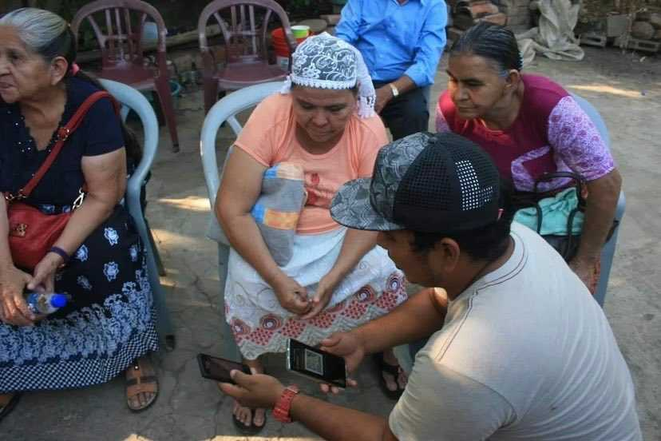
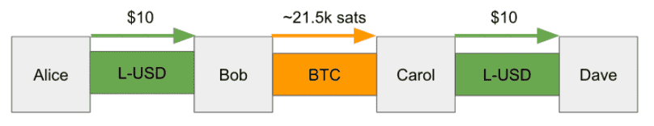
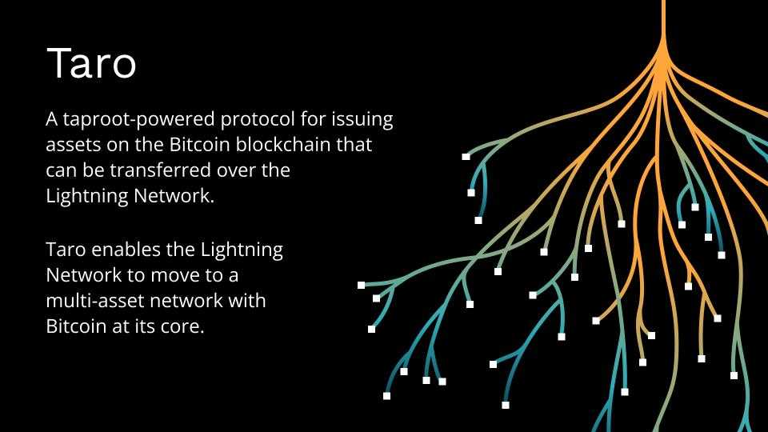

> *作者：Ryan Gentry*
> 
> *来源：<https://lightning.engineering/posts/2022-4-5-taro-launch/>*

今天我们很高兴地宣布推出 Taro，一种新的由 Taproot 赋能的资产发行协议。它可在比特币区块链上发行资产，并且所发行的资产可以在闪电网络上转移，享受即时、高容量、低手续费的交易。这次公告标志着朝向多资产闪电网络的重大转型，全世界的通货有可能可以通过闪电网络中的比特币流动性来路由。在核心原理中，Taro 利用了比特币网络的安全性和稳定性，以及闪电网络的速度、可扩展性和低手续费。除了这个协议，我们也[宣布将开展 B 轮融资](https://medium.com/@lightning_labs/number-of-people-go-up-or-bitcoin-as-the-worlds-protocol-of-value-d1df7cefca37)，以进一步开发闪电网络的基础设施并帮助用户增长。

Taro 使比特币能够作为一种价值协议、让应用开发者能在应用里整合多种资产和 BTC，无论应用是链上的还是闪电网络中的。这从整体上拓展了闪电网络的边界，将更多的用户带入闪电网络中，而他们也会推动比特币的交易量和流动性上升，并使得人们可以在应用中更容易地交换法币和比特币。更多的网络交易量对节点运营者来说意味着更多的路由费，他们不需要支持额外的资产就能享受到一个多资产的闪电网络带来的好处。

我们认为，Taro 是把美元比特币化（bitcoinizing the dollar）的重要一步，它能同时获得两个世界的好处：1）它可以在最去中心化和安全的区块链（比特币）上发行资产，比如稳定币；2）让用户可以在手续费最低、速度最快的全球支付网络（闪电网络）中转移价值。

Taro 依赖于比特币最近的一次升级 “Taproot”。Taproot 的树形结构允许开发者在一个现有的输出中嵌入任意的资产元数据。Taproot 还支持 Schnorr 签名，可以提升简洁性和可扩展性，还能跟闪电网络的多跳交易配合。为此，我们还发布了一系列的 Taro 比特币升级提议（BIP），以期获得开发者社区的反馈和评论，因为这是一个开发的协议，由社区自由决定采不采用。你可以在完整的 [Taro 详述](https://github.com/roasbeef/bips/tree/bip-taro)中了解更多。

## 为什么闪电网络需要更多资产？

去年，闪电网络的使用量迎来爆发式增长。新用户来自五湖四海，但拉丁美洲（比如：萨尔瓦多、危地马拉、阿根廷、巴西）和西非（例如：尼日利亚、加纳）尤其多，他们第一次体验到了没有金融中介、即时结算、低手续费的点对点交易。我们持续听到来自用户、开发者以及新兴市场中的初创企业（比如 [Galoy](https://galoy.io/)、[Strike](https://strike.me/)、[Ibex Mercado](https://ibexmercado.com/)、[Paxful](https://paxful.com/)、和 [Bitnob](https://bitnob.com/)）的呼声，认为给闪电网络加入稳定币资产将为他们的社区拓宽金融渠道。

- 萨尔瓦多的 “比特币海滩” 居民在使用闪电网络 -

Taro 让钱包开发者可以在同一个钱包中为用户提供一个 USD 计价的余额以及一个 BTC 计价的余额（以及任意数量的其它资产），轻松地通过闪电网络转移价值。重要的是，随着使用法币而加入闪电网络钱包的用户增加，他们也会更容易获得和使用比特币。这会让比特币的价值大大提高。

## Taro 资产如何通过闪电网络转移？

设想 Alice 和 Bob 拥有一个 Lightning-USD（L-USD）通道，通道容量为 100 美元，两人都有 50 美元的入账容量；而 Carol 和 Dave 也一样。

- Taro 多跳转账案例 -

即使 Bob 跟 Carol 只拥有一条 BTC 通道，Alice 也可以向 Bob 发送价值 10 美元的 L-USD 并以 BTC 支付一小部分的路由费，让 Bob 给 Carol 支付价值 10 美元的 BTC，Carol 再向 Bob 以 L-USD 收取一小部分路由费，然后将价值 10 美元的 L-USD 发送给支付的最终目标，Dave。Taro 可以跟现有的仅使用 BTC 的闪电网络互操作，而且方法没有什么区别，只需要第一跳和最后一跳拥有 L-USD 流动性。

这个结构利用了闪电网络现有的网络效应和流动性，可以路由任意数量的资产而无需为每一种新资产启动一个全新的网络，并且保证了是比特币支撑着网络中的所有交易。它也激励了闪电网络内的 BTC 流动性的增长，因为它们可以服务于一个更广大的多资产闪电网络。

## Taro 从哪里来？

Taro 使用了新的 Tarpoot 脚本的行为（从去年 11 月的软分叉开始在比特币网络上可用），让开发者可以在一个已有输出中嵌入任意的资产元数据。这意味着，它对全节点没有额外的负担，也不会因为使用了 OP_Return 导致这些 UTXO 被锁死，而且所有的 Taro 资产都继承了与普通的比特币转账同样的双花保护，以及额外的功能（比如在现有的闪电网络上转账）。

因为闪电网络是一个支付通道网络，比起其它区块链，它有更快的结算速度和更低的手续费，并且网络的拓展也不会损害这些属性。通过闪电网络给比特币引入稳定币，对于希望获得金融服务的用户、希望获得新工具的应用开发者、希望收集更多手续费的节点运用者、希望为自己的用户提供更好体验的资产发行者，都有好处。

想获得 Taro 协议的更深入的技术细节，你可以看看这份[协议 BIP](https://github.com/roasbeef/bips/tree/bip-taro)。简而言之，这种前沿的 Taproot 原生的设计的主要优点是：

- 可扩展性：一个 Tarpoot 输出就可以包含几乎无数的 Taro 资产
- 可编程性：Taro 资产拥有一个解锁脚本，就像普通的比特币 UTXO 一样，使得开发者能够为相应的资产编程转账条件
- 可审计性：Taro 所用的特殊树形结构允许高效的供应量审计，既可以审计一个钱包中的资产，也可以审计一种已发行的资产的全局状态
- 易用性：资产特异的地址可以让钱包足够智能，阻止用户因失误发送资产到错误地址上

## 如何起步？

让 Taro 走向世界的第一步就是以系列 BIP 的形式推出协议草稿及其底层的组件，并获得广大社区的反馈。第二步是开发出工具链，让开发者可以在链上发行和转移任意资产。最后一步是为闪电网络开发功能模块，使得开发者能使用 Taro 资产开启通道，并能在现有的闪电网络中转移。我们在三管齐下，希望社区也能加入进来。

我们极为期待在闪电网络上开发的工程可以集成这个新协议、将它集成到应用或者工具中；也非常期待这种可以在闪电网络中发行资产的能力，它可以让全世界的用户在使用其他资产（比如 USD）时享受到比特币网络的安全性和去中心化。虽然这个协议的大部分动机来自于为闪电网络开启法币稳定币价值转移，Taro 是作为一个通用的资产发行和转移协议而提出的，所以它可以支持同质化资产，也可以支持非同质的资产。

我们希望读者能[评论 Taro 提议](https://github.com/roasbeef/bips/tree/bip-taro)、阅读我们的文档、为代码贡献，以及，最重要的是，使用比特币开发世界的货币网络！

（完）