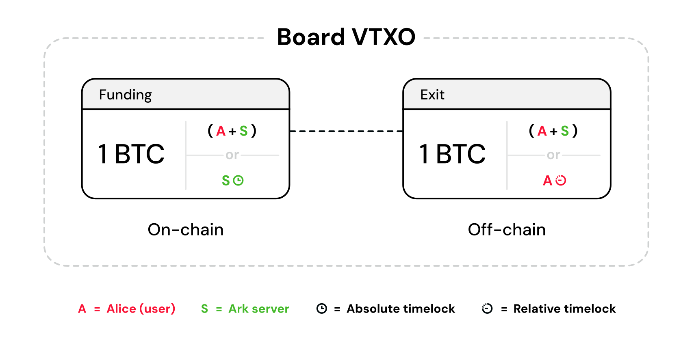
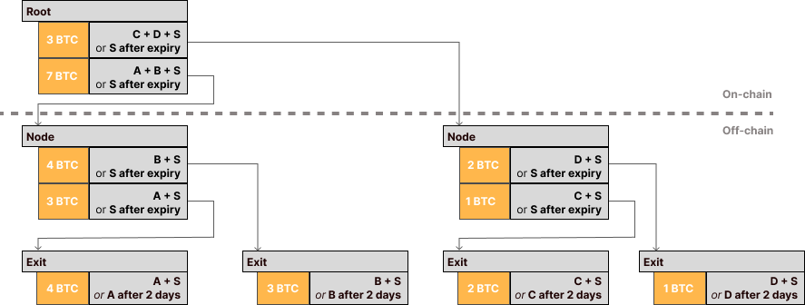

> *作者：Neha Narula*
> 
> *来源：<https://nehanarula.org/2025/05/20/ark.html>*

Ark 的设计目标是扩大比特币的支付处理量。关于它的工作原理，已经有了多种解释，但我无法理解它们中的绝大部分，所以我自己写了一种。我也总结了不同的操作码软分叉如何能够优化 Ark 的属性，并比较了 Ark 与其它解决扩容问题的方案（比如闪电网络和 rollup）。

## 动机

设想你想让许多用户共享一个链上的 UTXO，并让支付的链上踪迹尽可能少。你还希望这一切是在非托管的前提下实现的，也就是每一个用户都能够随时 *单方面退出* 这个共享的 UTXO、回到 TA 自己的链上 UTXO 中。

为什么你会想要这个效果呢？说来话长。闪电通道让你可以在非托管前提下发起离链支付，但它有一些围绕流动性的使用障碍，并且每个用户都依然需要 1 个 UTXO 。如果比特币网络成功的话，比特币节点的 UTXO 集规模在未来将会成为一个约束：所有全验证节点都需要存储完整的 UTXO  集以验证网络新确认的交易。当前，比特币节点中存储着[大约 1.7 亿个 UTXO，而 UTXO 集的序列化形式的体积大约是 11 GB](https://statoshi.info/d/000000009/unspent-transaction-output-set?orgId=1&refresh=10m) 。粗略计算以下，如果世界上每一个人都持有仅仅 1 个 UTXO，UTXO 集的序列化形式的体积也会是大约 0.5 TB ，对于验证工作是生死关键的系统来说，不是什么好消息 <a href='#note1' id='jump-1-0'>1</a>。

一直有人提出让多个用户共享一个 UTXO 的想法，比如 “coinpool”（直译为 “资金池”），但它们需要所有用户都在线签名，才能改变用户在 coinpool 内的余额。Ark 则做到了：如果一个用户想要进入或退出池子、或者像改变池内余额的话，不需要所有用户都同时在线。它是通过使用多个共享的 UTXO（每一回合建立一个新的，并形成交易树）、安排一个优先运营者 S 来做到的。这种设计让许多用户能跟同一个 S 合作、按需要扩大支付数量。如果 S 配合，那么许多用户可以在池中给彼此支付；每一回合，最终效果会被处理成一笔体积较小的链上交易。即使 S 不配合，用户也可以退回到自己的链上 UTXO，无需 S 的许可（只要用户能付得起相应的手续费）。

然而，这里有一些条件：

1. 跟闪电通道一样，Ark 协议有一项额外的活性（在线）要求：用户每隔一段时间就要回到网络上，不然他们的钱就会被没收。这个周期的长度可以调整，比如说，可以设为一个月。我们管这个概念叫做 “刷新周期”。
2. 退出到链上的操作可能会比简单的链上支付交易更加昂贵，因为用户要确认的不是一笔交易，而是多笔交易。我们预期这种情形（单方面退出）不会经常发生，相反，大部分支付会在池内合作式完成。
3. 在单方面退出时，用户需要有足够的链上资金来支付手续费，从而让退出交易得到确认。
4. S 需要保持在线，并且要在新的一个刷新周期开启时提供额外的流动性（数额是支付量）。所以这里有一个权衡：更短的刷新周期对服务商来说更好，因为流动性成本更低（并且因此，可以假设，转嫁给用户的手续费也会更低），但这意味着用户要更加经常上线。

S *不需要* 将交易排序成一个 rollup —— 协议的执行中并没有支付的状态机（译者注：rollup 是一种二层网络，其网络内确认的交易要在主链的区块中留下可复原的备份）。相反，S 在每一回合创建一棵由退出交易组成的交易树，并将树根（也就是一个共享 UTXO）发布到区块链上。它与 rollup 的不同之处在于，以往的树可能依然带有有效的用户退出路径。

Ark 有许多变种，各有各的取舍。我在这里介绍其中一种，然后介绍如果加入 CTV（减少了交互数量的话）可以制作怎样的变种；再介绍如果有 CTV 和 CSFS（进一步优化交互）的话，会是什么样 <a href='#note2' id='jump-2-0'>2</a>。

## Ark 协议

有一个 Ark 运营者 S 和用户 A、B、C …… 这个池子，或者说 Ark 实例，允许以下操作：加入、转账、刷新、退出。用户通过一笔给 S 支付的特殊交易来加入 Ark 实例，并通过跟 S 互动来执行用户间支付。S 将不同（回合的）交易树的承诺发布到链上，用户则持有有效但未公开的交易，以备单方面退出。退出可以是合作式的，也可以是非合作的（取决于 S 是否配合）。这里介绍的每一种操作都具有以下属性：1）用户不需要在资金保管上信任 S ；他们总是可以在刷新周期内拿着自己的钱退出；2）S 最终可以取出属于自己的钱，并不依赖于用户。

上述描述并没有覆盖有时候被称为 “Arkoor” 或者说 “回合外支付” 的机制，这种支付机制具有更短的时延，但需要支付的接收者假设 S 和支付者不会勾结。我们这里不作这样的假设（这也是最初使我困惑的地方，我曾以为 Ark 协议的所有支付都需要这个假设，那么整个威胁模型就更像 statechain 了；事实是并不需要）。这意味着，Ark 支付跟闪电支付不一样，时延会长得多。

我使用**加粗**来表示说得是比特币交易，可能会被广播和确认，但也可能会由用户持有而不广播。有四种类型的交易：入场交易、退出交易、弃权交易以及回合交易。

### 加入 Ark 实例

Alice 这样将自己的钱币支付给 S，就能加入 S 运营的 Ark 实例：她请求 S 跟她一起签名一笔退出交易，然后在链上发布一笔入场交易。入场交易是这样的：用户使用自己的 UTXO 作为输入（这里假设其面额是 7 BTC），而其中一个输出带有一个花费条件，要求 A 和 S 同时签名（在后文中，这种多签名条件我们缩写为 `A + S`）。退出交易则取入场交易的这个输出为输入，并花费到带有这样花费条件的输出中：`(A + S) or (A & δ)`（译者注：这里 `or` 表示 “或者”，`&` 表示前后两个条件都要满足， `δ` 表示时间锁）。Alice 请求 S 签名退出交易、自己持有它而不广播，然后在链上发布入场交易。[Second Lab 文档中的图片](https://docs.second.tech/ark-protocol/intro/#vtxo-based-scaling)展示了这种交易的形式（他们将入场交易称为 “Onboard”）：

- 加入 Ark -

（译者注：原文所使用的超链接和图片俱已失效，此处根据语境替换为 Second Lab 文档中的图片。）

我们在这里用到的第一种时间门限条件是相对时间锁 `δ`，使用 OP_CSV 。这是用户在 S 不配合的情况下，想从 Ark 实例中取出自己的钱所必须等待的时间。

还有一个时间概念，是 S 需要到网络上来清扫弃权交易的时间，这个我们后面会说。

一旦入场交易得到确认，Alice 就加入了 S 的 Ark 实例，并且可以发起便宜的支付了：

- S 知道入场交易只能被上述退出交易花费（因为入场交易的输出中的多签名花费条件）。
- Alice 知道她总是可以广播 S 签过名的退出交易从而离开这个 Ark 实例，并在长为 `δ` 的时间段过去之后，就可以再广播另一笔交易来拿回自己的钱。

### Ark 回合

我们再增加两个时间概念：

*过期* 时间 `Δ`。这就是要求用户刷新的周期，也是 S 必须为支付锁定流动性的时间长度。在经过这段时间之后，S 就可以清扫过期的回合交易（或者说交易树，见下文）。这是一个绝对时间，通常会设置为未来的一个月。在 Ark 中存放了资金的用户必须在这段时间内回到网络上，要么转账、刷新，要么退出，不然过期的资金会被 S 拿走。

*回合* 时间长度。这是 S 在链上广播前后两笔回合交易的时间间隔；回合交易确保了用户的支付和刷新会在链上留下承诺。这是用户感知到的交易时延的一部分。回合长度会远远短于过期时间（刷新周期），可能是一个小时或是一天。它不会表现为比特币交易输出脚本中的相对时间锁或绝对时间锁，所以我不会用记号来表示。

每经过一个回合时间，S 就发起一笔新的链上交易（即回合交易）来批量处理所有的转账、刷新和退出操作。回合交易会承诺一棵由退出交易组成的新的交易树。

如果出了 Alice 加入这个 Ark 就没有别的事情发生，那么 S 就不需要发起新的一笔回合交易。

Alice 已经在 S 的 Ark 里了。现在假设 Bob 也携带 1 BTC 加入了 S 的 Ark ，然后 Alice 希望给 Bob 支付。

### Ark 支付

Alice 和 Bob 已经在同一个 Ark 里了，Alice 持有 7 BTC ，而 Bob 持有 1 BTC，Alice 希望给 Bob 支付 0.5 BTC 。

1. Alice 和 Bob 对支付的一些条款达成一致，然后 Bob 将自己的公钥分享给 Alice
2. Alice 告诉 S 自己有支付需要，然后将她和 Bob 的公钥分享给 S
3. 时间流逝。S 等到适合制作下一笔回合交易的时候，就将所有这样的请求收集起来、一次性处理
4. 一旦完成， S 就创建一笔新的回合交易，其结构会在后文详述。S 需要为这笔交易加入自己的输入，以提供资金。
5. S 将这笔交易的所有相关分支展示给 Alice 和 Bob（以及参与这一回合交易的每一个用户），然后请求 Alice 和 Bob（以及每一个用户）签名他们所在的交易树分支的交易，以及各自的弃权交易（见下文）。这些弃权交易花费的是 Alice 和 Bob（等人）的退出交易，也即是花费他们在 Ark 中的余额（分别是 7 BTC 和 1 BTC），来自以前的入场交易（或者回合交易）。
6. 一旦 S 获得所有必要的签名，S 就广播回合交易、让它得到比特币区块的确认；而基于回合交易的交易树的其余部分不会广播。
7. 回合交易得到确认的时间也就是 Alice 给 Bob 的支付得到确认的时间 —— 从此，Alice 在该 Ark 实例中不再拥有 7 BTC，她只有 6.5 BTC，而 Bob 也不再拥有 1 BTC，而是 1.5 BTC 。

**回合交易（树）与弃权交易**

回合交易是这样一笔交易：其输入由 S 提供；有两个输出，各自都是一个共享 UTXO，一个承诺了一棵交易树的左半部分，另一个承诺了同一棵交易树的右半部分（你也可以想象它有 k 个输出，从而是一个 k 叉树）。每一个共享 UTXO 的花费条件都使用相同的形式（`(u + v + w ... + S) or (S & Δ)`），其中 `u + v + w ...` 就是处于这个共享 UTXO 中的用户；每多一笔交易（交易树每多一个层级），就将原本的的用户群分为两半（或者说分为 k 组）。层层分割之后，最后，每个（参与了这一回合，也即改变了余额或者发起了刷新操作的）用户在交易树上都会有一个叶子输出。每个叶子输出的花费条件都是这样的：`(u + S) or (S & Δ)`，并且，每个用户都持有花费这个输出的一笔退出交易；回想一下，对用户（比如 Alice）来说，退出交易的输出的花费条件是：`(A + S) or (A & δ) `。

看这个来自 Second Lab 文档的图片，可以看出用户 A、B、C、D 组成的交易树，池子的总金额是 10 BTC <a href='#note3' id='jump-3-0'>3</a>。

弃权交易本质上就是取消一个参与回合交易的用户的原有退出路径。它花费的是原有退出交易的多签名分支，将资金转给  S，而且没有时延。

还有一种刷新操作，让用户可以重设退出时间。这就像用户自己给自己支付。他们放弃自己在以往的（即将过期的）回合交易中的退出路径、获得在新的一个回合交易中的叶子输出（将更晚到期）。

**原子性**

上述操作实际上是不安全的。

一旦 S 获得了 Alice 签过名的弃权交易，TA 可以不发布新的回合交易，等到 Alice 尝试退出的时候，就发布弃权交易、拿走 Alice 的钱。也就是说，签了弃权交易之后，Alice 就没法单方面退出了！那么，我们希望的是，弃权交易仅在新的回合交易得到确认之后才是有效交易。这是使用连接器输出来做到的：每一笔弃权交易，都会使用新的回合交易所创建的一个微小面额的输出，作为额外的输入。所以，回合交易会有许多连接器输出（回合中发生一笔弃权交易，就需要一个连接器输出）。

只有一个回合交易在链上得到确认，该回合交易所处理的转账、刷新和退出操作所对应的弃权交易，才具有有效的输入，才成为一笔有效的交易，能够为 S 所用。

此外：

其一，显然，令人烦恼，Alice 和 Bob 在发起支付请求之后，必须等待相当长时间，才到实际构造交易树的时候；此时（在回合交易广播之前）他们必须回到网络上，以签名交易树和弃权交易、将签名交给 S 。他们不仅在发起支付的时候需要交互，还必须在线很长一段时间（可能是整个回合时间）。而且，为了尽可能获得批量处理的好处，S 可能会设置较长的回合时间，以尽可能收集服务请求。所以用户要在线很长时间。

其二，你可能也注意到了，即使只有一个用户没有出现，S 也必须为回合交易从头重新构造交易树：将原有的交易树丢在一边、从其他用户那里重新获得签名。这是非常糟糕的，只需一个用户离线就可以让 S 无法推进。CTV 可以优化这一点，做到只需要花费者在线，而 CTV + CSFS 可以完全移除这种需要。

### 退出 Ark

如果 S 配合，用户可以发起合作式退出：签名一笔弃权交易，使之依赖于在下一笔回合交易中给 TA 支付的输出（而非连接器输出）。

如果是非合作退出，用户要广播自己所在交易树上从树根（回合交易）到（自己所在的）叶子（退出交易）路径上尚未确认的交易。他们可能还需要为这些交易添加手续费。路径上的一些交易可能已经发布的链上，因为其他用户可能先行退出了。在退出交易得到确认之后，用户还必须等待一段时间（由相对时间锁 `δ` 规定），才能将退出交易输出中的资金转移到其它地方。

那么，有什么能够阻止用户广播一笔旧的、过时的退出交易吗？有，就是 `δ` 和弃权交易！如果一名用户广播已经过时的退出交易，TA 必须等待 `δ` 这么长的时间，才能实际取款；而在等待期间，S 可以广播对应的弃权交易、将输出中的钱取走，无需等待。

在绝大部分介绍 Ark 的文章中，作者都将退出交易（以及从回合交易通向退出交易的路径）称作一个 VTXO（虚拟 UTXO），并说用户 “持有” VTXO 。说实在的，我认为这有点让人迷惑，因为在乐观情形中，用户并不会像花费 UTXO 那样花费自己的 VTXO 。他们是放弃一个 VTXO 然后得到一个新的 VTXO 。

**S 清扫资金**

在过期时间 `Δ` 之后，S 可以立即回收自己为一笔回合交易锁定的所有资金（直接转移给自己），只要这笔回合交易没有发生非合作退出。即使只有一位用户非合作式退出了这笔回合交易（广播了自己的退出路径到链上），S 都只能通过发布已上链交易的兄弟交易来取出剩余的资金。

## 添加假设以获得更好的属性

### CTV

如果我们有 CTV ，我们就可以将子交易中的多签名条件替换成 CTV 条件。这在下列场合中改变了交互性：

- 进入 Ark：Alice 不需要让 S 一起签名退出交易；入场交易输出的 `A + S` 可以是一个承诺了退出交易的 CTV 条件

- 用户不需要签名交易树的相关路径，但这在交互性上也没有太多帮助，因为用户们依然需要从 S 那里知道退出路径（在 S 构造好整棵交易树之后），然后才能签名自己弃权交易 <a href='#note4' id='jump-4-0'>4</a>

- 可以制作一种 Ark 变种，让 Bob（支付的接收方）无需在线，因为他不需要是多签名条件的一部分。Bob 不需要等到确认自己能够从 Ark 退出时才确定支付完成了：他只需要知道回合交易的构造、以及他在其中有一个合适的退出交易，但不需要知道什么东西安全地承诺了这笔支付。我们可以将支付的步骤改变如下：

  Alice 和 Bob 都已处在同一个 Ark 中，Alice 的余额为 7 BTC、Bob 的余额为 1 BTC，而 Alice 想给 Bbo 支付 0.5 BTC 。

  1. Alice 和 Bob 同意支付的条款，然后 Bob 将自己的公钥分享给 Alice 。这件事可以随时发生，然后 Bob 就可以离开网络了。
  2. Alice 将支付请求告诉 S，并分享她和 Bob 的公钥。
  3. 时间流逝。S 等到适合制作下一笔回合交易的时间，就收集所有服务请求到这笔回合交易中。
  4. 一旦准备好，S 就创建一个新的回合交易。S 需要为该交易包含属于 TA 自己的输入（为这笔交易提供资金）。
  5. S 向 Alice（以及这一批次的每一位花费者）展示交易树的相关分支，然后请求 Alice（以及每一位花费者）签名一笔弃权交易（得益于 CTV，他们不必签名交易树上的任何交易）。Alice 的弃权交易花费的是她在 Ark 中拥有的 7 BTC 的退出交易。**有区别的地方来了**：Bob *不需要* 放弃他的 1 BTC 的余额。他可以保留这笔钱，然后获得一个新的、价值 0.5 BTC 的退出交易。因为他不需要放弃任何东西，这时候也就不需要在线。
  6. 一旦 S 收到所有合适的签名，S 就将交易树的树根（回合交易）广播到网络中并获得区块确认，而将交易树剩余的部分扣住。回合交易的确认时间也就是 Alice 给 Bob 的支付的确认时间：从此，Alice 不再拥有 7 BTC，而只拥有 6.5 BTC 。
  7. Bob 应该等到 Alice *既能* 指出在链上确认的回合交易，*又能* 给他分享 Ark 中属于他的分支（退出路径）（价值 0.5 BTC）之后才发货。

  注意，这比原来要好，因为 Bob 不需要在线来收取支付，而且我们将支付的接收者从参与交易树签名的用户群中移除了（减少了可能阻碍回合交易签名的可能性）。

### CTV + CSFS

拥有 CTV 和 CSFS 就能实现可以重新绑定的签名，这种技术可以用来实现一种叫做 “[Erk](https://delvingbitcoin.org/t/evolving-the-ark-protocol-using-ctv-and-csfs/1602)” 的变种。基本的想法是，在看到交易树之前，用户就可以安全地签名弃权交易的一种变种（在那篇文章里被称为 “退款交易”），因为他们知道自己无论如何总会得到支付。这就大大改变了交互要求 —— 用户不需要杵在那里，等待回合交易的构造。

### 假设 S 和花费者不会勾结

这就带来了 “Ark 回合外” 交易，简称为 “Arkoor” 交易，它是 “即时的”。我对这个假设并不感兴趣，所以没有深入细节，你可以读读[这份材料](https://docs.second.tech/protocol/intro/#creating-arkoor-transactions)。

注意，[Second Lab 当前仅为支付实现了 Arkoor 交易](https://delvingbitcoin.org/t/the-ark-case-for-ctv/1528)。如果作为接收者，你不接受这种假设，你应该回到线上，利用下一笔回合交易刷新你收到的支付，然后再当作你收到了支付。我原本以为这是一件了不得的事情，但实际上它只是一个实现上的细节。

## 比较 Ark 与其他

### 闪电网络

**Ark 的好处**：

- Ark 的一个非常棒的属性是，Bob 在收取支付的时候，不需要考虑任何流动性（收款额度）！相比之下，在闪电网络中，如果 Bob 还没有一条资金重组的通道，就必须由某个人先提供资金、与 Bob 开设通道，然后 Bob 才能收取支付。
- 另一个好处是，Bob 在接收支付时不需要在线（在 CTV 变种中）。他只需要在过期之前回到线上。
- Ark 的另一个好处在于，我们完全不需要担心通道余额和路由。所有的复杂性都清除掉了。这意味着，可以预期，Ark 支付的成功率会比闪电网络更高。

**闪电网络的好处**：

- 在闪电网络中，如果你一直都是花钱而没有收取支付，那么不能及时回到线上也没什么大不了（因为在任何一个旧状态中，你的钱都比最新状态中的更多）。但在 Ark 中，如果你不能及时回到线上，你就会丢失所有的钱。
- Ark 无法在相同的安全假设下做到像闪电网络一样的低时延支付。
- 与闪电网络不同，Bob 和 Alice 无法点对点交易。他们需要 S 的配合来发起链下支付。有点像是一个 Ark 中的所有用户都连接到了同一个闪电节点，但彼此之间没有连接。

**不可比较**：

- 一个 Ark 中的用户越多，支付越有可能在链下得到满足，而且扩容效果也就越好。而且这些支付没有额外的链上踪迹！但更多用户参加一个 Ark，也能也意味着有用户遭遇故障、S 必须重新计算回合交易的概率升高。

还有一些值得一提的事情是，一些兼容闪电网络的多方通道（另一种让多个用户共享一个 UTXO）设计与 Ark 上的增量设计变更 “殊途同归”。理解它们的一种方式是，设想 Ark 中的回合交易树的叶子中包含了闪电通道。这很有趣，我希望能更好地理解它，但迄今为止，我发现[闪电网络的多方通道设计](https://delvingbitcoin.org/t/superscalar-laddered-timeout-tree-structured-decker-wattenhofer-factories/1143)令人费解（[中文译本](https://www.btcstudy.org/2024/11/28/superscalar-laddered-timeout-tree-structrued-decker-wattenhofer-factories/)）。

### 比特币上的 rollup

这对我来说很模糊，因为我还没有读到详细的 rollup 设计。这是我未来文章的主体。以下是一些猜测：

**Ark 的好处**：

- Ark 需要发布在链上的数据更少 —— rollup 需要在链上发布的数据跟链下支付（更具体一点说是状态变化）的数量成正比。Ark 和闪电通道都不需要发布这么多链上数据。
- Ark 不需要软分叉来实现完全自主保管特性。当前的 rollup 设计要求 n 个运营者中至少有 1 个是诚实的 <a href='#note5' id='jump-5-0'>5</a>。

**rollup 的好处**：

- 更少交互。Rollup 系统的运营者不需要跟发起支付的所有用户多次交互。没有软分叉，在制作一笔回合交易时，Ark 需要运营者跟所有转账、刷新和退出的用户多轮交互（不过至少不是 Ark 中的所有用户）
- Rollup 可以使用完全不同的交易模式和虚拟机，所以它可以提供新的功能，比如保护隐私的支付（zkCoin）或智能合约。（译者注：富状态的智能合约。）
- Ark 需要用户自己持有退出路径（如果弄丢了这些数据，就无法从 Ark 中单方面退出了）。但 rollup 支付更高的链上存储成本，所以用户不需要自己持有。

**不确定**：

- 非交互式退出的成本，以及这种成本在用户减如何分摊。在 Ark 中，如果 S 连续多次构造交易树都失败了，那么用户就需要退出。不确定如果一个非托管的（也即假设 CTV 可用）rollup 中运营者出了故障，那会怎么样（当前的 rollup 带有 1-of-n 信任假设，不能允许所有运营者都出故障） —— 因为所有数据都在链上，也许其他人可以直接接管？此外，rollup 可以设计为如果一个挑战者发起一次 “诚实的” 非合作退出，运营者必须支付链上断言成本。但是，这也需要链上空间，而且我不清楚它跟 Ark 树的体积相比如何。
- 我希望能更好地理解 Ark 中的 S 和 rollup 运营者的流动性请求。尚不完全清楚。对我来说，同样不清楚的是流动性要求如何在多个运营者之间分割。

## 致谢

感谢 Antoine Poinsot 为我提供了非常有用的 Ark 白板解读，Greg Sanders 在一次比特币扩容研讨会上解释 Ark，以及 Antoine Poinsot、Jose Storopoli、Ethan Heilman 和 Armin Sabouri 对这篇文章的反馈（并不表示对文章内容的背书）。所有的错误都由我自己负责。

我认为有帮助的参考文献：

- https://gist.github.com/RubenSomsen/a394beb1dea9e47e981216768e007454（[中文译本](https://www.btcstudy.org/2023/07/21/simplest-ark-explanation-by-ruben-somsen/)）
- https://docs.second.tech/protocol/intro/（[中文译本](https://www.btcstudy.org/2025/08/07/ark-protocol-intro-illustration-by-second-docs/)）
- https://delvingbitcoin.org/t/the-ark-case-for-ctv/1528
- https://delvingbitcoin.org/t/evolving-the-ark-protocol-using-ctv-and-csfs/1602

## 脚注

1.你不能像修建区块链数据一样修减这部分数据，但也许，Utreexo 这样的想法在未来可以帮助改变存储和查找的成本（也有其它取舍）。真要讲就是另一篇文章了。 <a href='#jump-1-0'>↩</a>

2.我在这里介绍了 CTV 和 CSFS（所带来的效果），（在我看来）它们是最直接的。ANYPREVOUT（APO）可以模拟 CTV 和 CTV + CSFS 。 <a href='#jump-2-0'>↩</a>

3.我认为 A、B、C、D 的退出交易中的 BTC 价值是错误的，应该调换过来。 <a href='#jump-3-0'>↩</a>

4.边注：我在想，仅用 CTV，能否增量式地构造出整棵树，从而不需要让用户等待一整个回合时间？ <a href='#jump-4-0'>↩</a>

5.或者使用一些像是[函数式加密限制条款](https://delvingbitcoin.org/t/bitcoin-pipes-covenants-on-bitcoin-without-soft-fork/1195)、[ColliderScript](https://eprint.iacr.org/2024/1802) 这样的疯狂玩意儿。 <a href='#jump-5-0'>↩</a>