> *作者：Saravanan Mani*
> 
> *来源：<https://medium.com/@saravananmani_/ark-101-0d64cfe9378f>*

## 什么是 “Ark”？

“Ark” 是一种比特币 Layer 2 协议，支持即时且便宜的比特币支付。

它的操作大部分发生在链外（off-chain），也就是说，基于 Ark 协议的支付是在比特币区块链之外发生的。Ark 是一种支持自主保管的协议，用户可以在需要时自主在链内（on-chain）取出资金，虽然跟基于排他性输出的自主保管方案有区别（我后面会讲到）。

与闪电网络不同，Ark 协议不依赖于发票、支付通道、HTLC（哈希时间锁合约）、路由等概念。相反，它使用一种 服务商-客户 模式，所有用户都跟自己的服务商交互，而不是通过点对点网络（跟其他用户）交互。

Ark 遵循了一种乐观设计，也即用户假设服务商会正确地协调交易。如果这个服务商变得无动于衷、开始审查交易、行为不轨，用户就可以回敬以单方面退出。常规条件下，退出操作会在服务商和用户协同之下在链外处理，即单方面退出只用于非常规情形。

Ark 支付跟链内支付模式相似：它们是在链外处理的预签名比特币交易，接收者不需要在线来接收支付，用户也不需要提前锁定流动性。

Ark 是比特币专属的（Bitcoin-only）。它不包含山寨币、token、侧链和新区块链。它在当前的比特币共识规则上就能工作。不过，“限制条款（covenant）”（一类比特币共识规则升级）可以显著加强这个协议。

与所有的 Layer 2 协议一样，Ark 也有自身的取舍，这使得它更适合于某一些场景，而不适合另一些场景。

## 入场和支付

有两种方法加入一个 Ark：

- 使用一笔常规的比特币交易，在区块链内移动你的比特币到一个 Ark 中

- 收取 Ark-to-Ark 支付，也能让你进入一个 Ark，并且是即时的 。这是在链外发生的，并不需要付出区块链确认手续费，也不需要前置操作。

  （译者注：此处讲的这种支付形式是一般称为 “Arkoor（Ark out-of-round）” 的支付。）

所有的 Ark-to-Ark 支付都是即时、低手续费的，而且完全发生在链外。

### 如何通过链内存款进入一个 Ark？

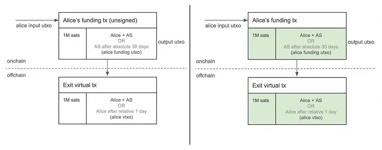

在这个案例中，Alice 使用自己的链内 UTXO（在图中表示为 “Alice input utxo”）创建一笔注资交易。该交易随时可以被 Alice 和目标 Ark 的服务商（AS）一起花费，也可以在 30 天后被 AS 独自花费。在签名和广播这笔注资交易之前，Alice 和 AS 要一起签名一笔暂不广播的 “退出虚拟交易（exit virtual transaction）”。这笔退出交易花费注资交易的输出（“output UTXO”）；而它的输出又可以被双方随时一起花费，或者被 Alice 在该退出交易得到区块确认的一天之后独自花费。这套装置给了 Alice 在加入这个 Ark 后的 30 天内单方面退出的选择。

这些没有广播的交易都包含一个额外的锚点输出，用于允许通过 CPFP（子为父偿）方法为交易追加手续费。为了简洁，上图中省略了这样的锚点输出。（译者注：“CPFP” 即是用一笔新交易来花费一笔尚未得到区块确认的交易的某个输出，并在这笔新交易中携带足够多的手续费，从而吸引矿工同时确认这两笔交易。）

但是，为什么 AS 可以在 30 天的绝对时延之后独自取走注资交易中的资金，而 Alibe 必须等待 1 天的相对时延之后才能单方面取走退出交易中的资金？为什么 CPFP 是这些交易的唯一一种手续费支付机制？我们后面再解释。

在 Ark 协议中，未广播的交易和 UTXO 相应被称作 “虚拟交易” 和 “VTXO（虚拟 UTXO）”。

（译者注：可以看出，不同作者对 “VTXO” 的定义会有些许不同，但核心意思是一致的。）

Ark 协议使用基于 Schnorr 签名的 Taproot 脚本来强制执行这些花费条件。Alice+AS 的多签名装置遵循 N-of-N 的 MuSig2 多方计算协议，最终产生单个聚合公钥和单个聚合签名。

### 如何通过 Ark 支付进入一个 Ark？

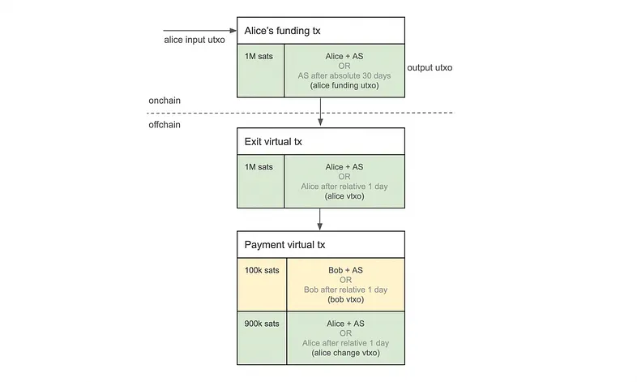

在这种情况下，Alice  给 Bob 支付 100k 聪（见黄色的 “bob vtxo”），具体做法是花费自己的 VTXO（即 “alice vtxo”）。她跟 AS 一起签名，解锁 “Alice+AS” 花费条件。她会收到 900k 聪作为找零（“alice change vtxo”）。Bob 的 VTXO 中的花费条件跟 Alice 的 VTXO 是完全一样的（唯一区别是使用 Bob 的公钥而非 Alice 的公钥）。Alice 的找零 VTXO（“alice change vtxo”）维持跟她原来的 VTXO 一样的花费条件。

现在，Bob 就可以使用自己的 VTXO 来发起 Ark 支付了，就像 Alice 做的一样。不过，Bob 的 VTXO 带有被重复花费的风险：因为支付是在链外发生的，这些交易没有得到区块链确认，也就没有区块链提供的重复花费保护；AS 和 Alice 可以串通起来，在别的地方再次花费 Alice 原本的 VTXO，从而在 Bob 一无所知的情况下作废掉 Bob 的 VTXO 。但 Alice 的找零 VTXO 就没有这样的风险，因为她没有欺诈自己的动机。

如果 Alice 和 AS 都作风正派（没有签名和广播与此次支付相冲突的交易），Bob 就可以通过广播他的 “支付虚拟交易（payment virtual transaction）” 以及退出虚拟交易，单方面退出这个 Ark 。他自己必须使用 CPFP 为这两笔交易支付区块确认手续费。

带有重复花费风险的 VTXO 被涂成黄色，而没有这样的风险的 VTXO 则被涂成绿色。

### 深入观察 Ark 支付

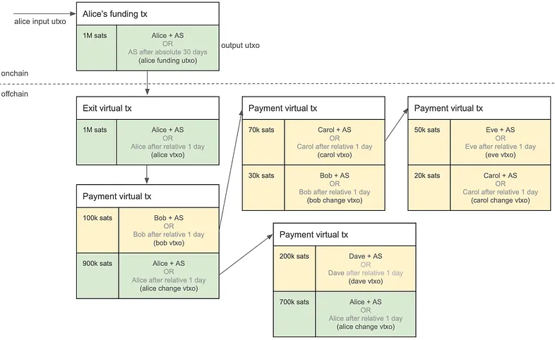

如你所见，就像 Alice 可以给 Bob 支付一样，Ark 的用户可以彼此支付。然而，任何从带有重复花费风险的 VTXO 创建的新 VTXO 都会带有同样的风险。实际上，这种风险会越来越大，因为这个 VTXO 链条上的任何一个前任都可能跟 AS 勾结从而伤害最新 VTXO 的持有人。找零 VTXO（或者说自我支付的 VTXO）最初是从一个 exit VTXO（比如 Alice 的 exit VTXO）中派生的，可以认为是没有这种风险的，因为同一个用户既控制着输入又控制着输出，所有没有激励去创建与之冲突的交易（参与勾结）。

此外，从长链条的支付虚拟交易中创建的 VTXO 在单方面退出时会面临更高的区块链确认费用。这是因为用户必须为（从最初一笔退出虚拟交易开始的）链条上的每一笔虚拟交易支付手续费。

我们会在后续章节中演讲如何缓解重复花费风险以及长链条 VTXO 的高昂单方面退出成本。

因为 Ark 支付是只由发送者和 AS 签名、完全离链的交易，所以它们是即时的，而且不会有区块确认手续费。

### Ark 协议如何为入场和支付扩容？

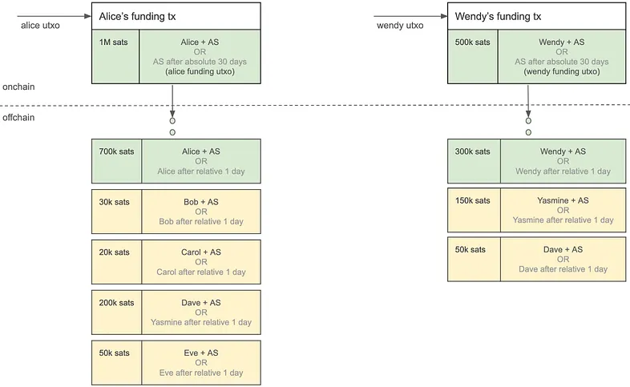

任何用户都可以使用自己的链内资金加入某个 Ark，就像 Alice 一样。在上图中，Wendy 也用类似的方式加入了一个 Ark 。为了简化，只展示出了可以被花费的 VTXO 。

链内入场的吞吐量受到比特币的区块空间限制。相反，Ark 支付是完全在链外发生的，并不受区块空间的约束。它的吞吐量完全取决于 Ark 服务商处理和协调这些交易的能力。

## 合作式退出

### 什么是 “合作式退出”？

在 “合作式退出” 中，一位用户向自己的 AS 表明，自己希望用一个 VTXO 交换一个链内的 UTXO 。这位用户将自己的 VTXO 余额转移到一个由 AS 控制的地址中，而 AS 则同时转移相等数额的链内资金到该用户所控制的地址。这种互换具有原子性，从而保证了公平。

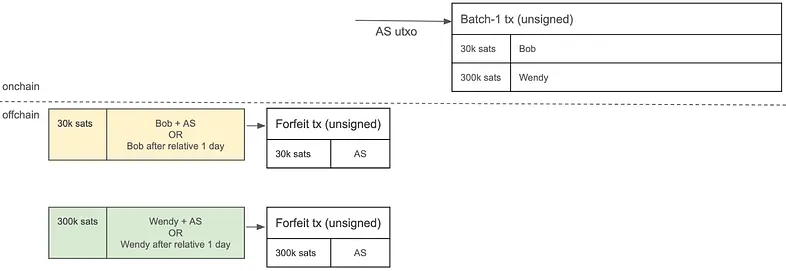

如上图所示，Bob 和 Wendy 都希望合作式退出这个 Ark 。那么，AS 就构造一笔交易，称作 “批量处理交易”，将 AS 的链内资金转移给这两位用户。同时，这两位用户各自准备一笔 “弃权交易（forfeit transaction）”，将自己的 VTXO 余额转移给由 AS 控制的一个地址。

在这个阶段，这三笔交易都还没签名。这是因为，不管 AS 还是用户，都不想先把自己的余额交给对方，因为这样会带来对手方风险：对方可能拒绝签名对应的交易。为了保证退出是公平的，我们需要一种机制来原子化地签名这些交易、保证 VTXO 和 UTXO 公平交换。

这里的想法是：如果仅在批量处理交易变得可以花费之后，弃权交易才能被花费，那么交换就是原子化的。

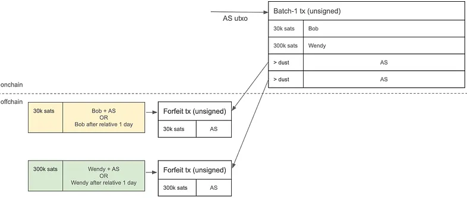

如上图所示，当我们把来自批量处理交易的一个输出（称为 “连接器”）作为一笔弃权交易的一个输入之后，就只有在批量处理交易被签名和区块确认之后，弃权交易才能被花费。连接器输出的价值并不重要。只要它超过了粉尘数额，就可以保证，只有在批量处理交易得到区块确认之后，弃权交易才可能被区块确认。

现在，签名顺序的重要性就体现出来了。用户必须先签名自己的弃权交易 —— 这个步骤对他们来说是绝对安全的，因为除非 AS 签名批量处理交易，弃权交易是不会生效的。

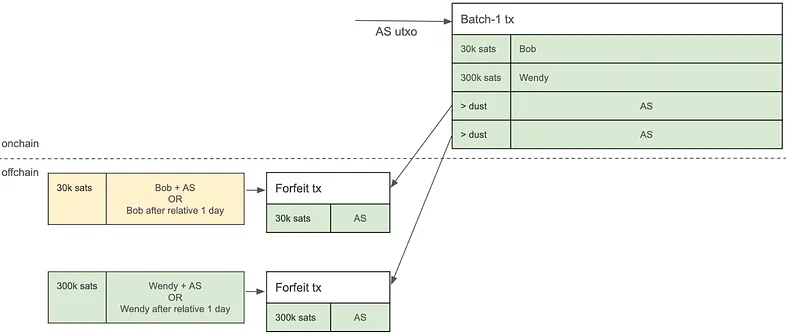

在收到用户发来的弃权交易之后，这个 AS 再完成签名和广播批量这笔处理交易、让它得到区块确认的流程。

### 为什么要在 VTXO 中添加 “用户 1 天之后才能取走资金” 的条款？

如果 Wendy 尝试欺骗这个 Ark 服务商，也就是说，在已经签名了弃权交易、从批量处理交易中收到了一笔资金之后，又发起单方面退出、尝试领取自己（已经弃权的）VTXO 中的价值，这个 AS 就可以广播这笔弃权交易、阻止 Wendy 。

这就是在 VTXO 中添加为期 1 天的相对时间锁的目的。这个时延给了 AS 充足的时间来广播和确认弃权交易；该交易已经得到了 Wendy 的签名，可解锁 Wendy+AS 条件，因此不受时间锁限制。时间锁让A S 可以抢在 Wendy 之前，取走 VTXO 中的资金。

这个相对时间锁的长度可以由服务商来配置。

### 连接器输出可能会变得很多，有办法优化它吗？

在上图的做法中，批量处理交易中的连接器输出的数量，是跟使用它来合作式退出的 VTXO 的数量一样多的。因为批量处理交易是要得到区块确认的，随着连接器输出的数量增加，它的体积也就增大，区块确认手续费也会上升。

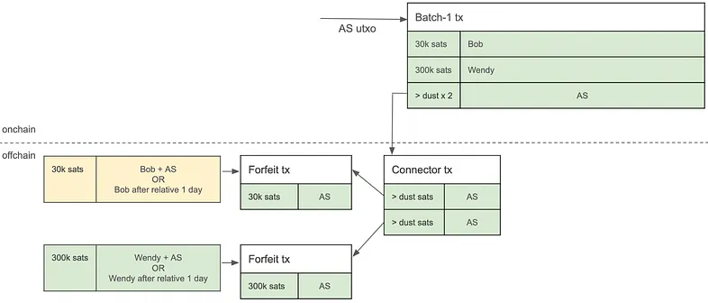

而在这里，我们加入一笔缓冲交易，叫做 “连接器交易（connector tx）”，它使批量处理交易只需要准备 1 个连接器输出，就能（产生出足够数量的连接器）为所有的弃权交易服务。这就消除了（在批量处理交易中）为每一笔弃权交易准备一个连接器输出的需要，将连接器输出数量的线性增加替换为单个输出，极大地减少了批量处理交易的体积和确认成本。

理想情况下，VTXO 的虚拟交易，以及弃权交易和连接#器交易，都是不会广播到区块链上的。它们只是一种后备手段，只会在用户尝试欺诈时使用（这时候用户会广播全部的虚拟交易以及被弃权的 VTXO，而 AS 会广播连接器交易和弃权交易）。

但如何阻止用户通过广播一个已经弃权的 VTXO、向 AS 发动 DoS（拒绝服务式攻击）？答案是，因为所有的虚拟交易都依赖 CPFP 来支付手续费（自身并不携带任何手续费），尝试欺诈的用户必须为整个交易链条支付手续费。即使这个用户能接受这一点，AS 也依然能够通过预签名的弃权交易来抢先取走被弃权的 VTXO 中的资金。这使得这样的攻击昂贵而且没有意义，也就在实质上阻止了用户尝试欺诈。

### 那又为什么要在输出 UTXO 中加入 “AS 可在 30 天绝对时延后取款” 的条件呢？

在现实生活中，一个 Ark 服务商（AS）的任何一部分用户都可能随时请求合作式退出。

从一笔注资交易的输出中创建的 VTXO，是直接或间接派生自这个输出的，形成了一个多层的、前后相接的交易结构。这意味着，多个用户实际上共同分享来自注资交易的同一个链内 UTXO 。

然而，AS 无法在某一用户请求合作式退出时，就强迫共享同一个祖先交易的所有其他用户也跟着一起退出。这样做会形成糟糕的用户体验，而且也是不切实际的，因为一些用户会离开互联网，或者说在合作式退出流程期间无法响应。

为了处理一些用户的退出请求而不打扰另一些用户，AS 临时使用自己的链内资金来协助希望合作式退出的用户批量退出。

但是，AS 自己为批量处理交易注入资金（为用户服务）之后，该如何从用户弃权的 VTXO 中回收资金呢？一种选择是广播弃权交易。但是，这将强迫许多共享相同祖先交易的无关 VTXO 也退出。而且，这种办法还会引入不必要的交易确认成本和时延，在实质上背离了 Ark 的链外设计的初衷。

与此同时，AS 也不能让自己提供的流动性永久锁定、直到共享一笔注资交易的每一位用户都合作式退出，这代价也太昂贵了。这样做会给 AS 施加一种无法承受的负担、让这样的系统无法扩容。

一种更加务实的做法是，给共享一笔注资交易的所有用户施加一个最终期限，在这个最终期限到来之前，用户们必须发起合作式退出。但是该怎么实现呢？

这就是 “AS 可在 30 天绝对时延后取款” 的作用了。在 30 天的绝对时延之后，AS 就可以独自花费这个 UTXO 。在这个窗口期内，用户可以随时请求合作式退出。不过，如果一个用户没有在此期间退出，TA 的 VTXO 就会被 AS 拿走 —— 无论 TA 是否明确签名过弃权交易。

这一机制让 AS 可以在一个可预期的时间框架内回收流动性，并持续高效地运行。这个过期时间的长度也是可以由服务商来配置的。

缺点是，没能在最终期限到来之前行动的用户会丢失自己的 VTXO 余额（由 AS 取走）。

## 三个尴尬的问题

我们已经指出了三种可能让 Ark 协议不实用或者缺乏吸引力的尴尬问题：

- 从 Ark 支付中创建的 VTXO 所伴随的重复花费风险
- 因为没有在 30 天的最终期限之前退出而丢失 VTXO 余额的风险
- 单方面退出的难度和高成本，尤其是对其 VTXO 处于长长的虚拟交易链条末端的用户

### Ark 协议可以如何解决这些问题？

幸运的是，这三种问题都可以用一种方案来解决：AS 回收受影响的 VTXO，为相关的用户发放刷新了的退出虚拟交易的 VTXO。

我们可以使用批量处理交易来解决这些问题，就像合作式退出流程一样。只是，AS 不需要为每个用户协调一个链内 UTXO，而只需要为他们每人发放一个来自新的退出虚拟交易的新 VTXO 。这个新 VTXO 是更加安全的，因为它没有重复花费风险，也不处在长长的虚拟交易链条的末端，而且过期时间点重设成了从此刻开始的 30 天之后。

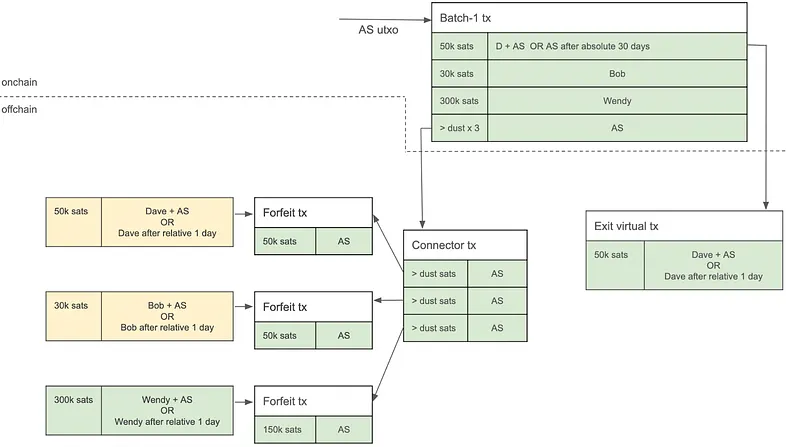

在上面这个案例中，Dave 原子化地将自己的旧 VTXO（带有重复花费风险）换成了一个新的、没有风险的 VTXO 。他没有用批量处理交易来执行合作式退出（获取一个链内 UTXO），而是安全地获得了一个新的、来自一笔退出虚拟交易的 VTXO 。

如果你再看仔细些，你会发现，上图的批量处理交易的第一个输出，其花费条件跟前述注资交易的输出是一样的。Dave 的退出虚拟交易也是数次。关键区别是资金的来源：前面提到的注资交易的资金来自用户自己的 UTXO，而这里的批量处理交易的资金则来自 AS 自己的 UTXO 。为什么呢？原因跟 AS 要给合作式退出注资是一样的 —— TA 临时注入自己的资金，帮助用户将旧的 VTXO 换成新的。一旦旧 VTXO 的过期时间点到来，AS 就可以一次性回收资金，跟合作式退出的情形是一样的。

当这个新 VTXO 的过期时间点临近，这个用户必须依照相同的流程、执行另一次互换。这防止了 AS 侵夺过期的 VTXO 。如果 AS 清扫了过期（而没有明确弃权）的 VTXO，用户实际上就是将自己的资金交给了 AS 。Ark 协议并不保证这样被清扫的 VTXO 的价值会归还给用户。不过，在现实中，AS 可能会在用户回到互联网上的时候，为 TA 发放一个相同价值的新的 VTXO ，作为一种礼貌。

自然，这些周期性的互换会需要用户付出一定的手续费，因为批量处理交易需要获得区块确认。但这一费用一般来说是低的，因为每个用户只需分摊一部分区块确认手续费。

### Ark 协议如何扩大 VTXO 互换的吞吐量？

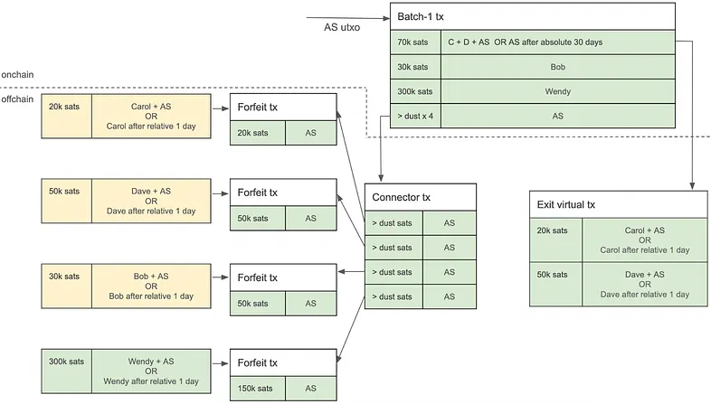

这一设计的关键优势是可扩展性。在上面这个例子中，Carol 和 Dave 都将自己的带有重复花费风险的 VTXO 换成新的来自退出虚拟交易的 VTXO 。一笔批量处理交易可以支持几千个用户，只需要在输出的多签名花费条件中加入用户的公钥、产生更多的退出虚拟交易和 VTXO 即可。主要的瓶颈在于 AS 和所有参与的用户之间的交互式签名流程。

## 批量处理交易和退出虚拟交易的细节

### AS 创建批量处理交易的频率

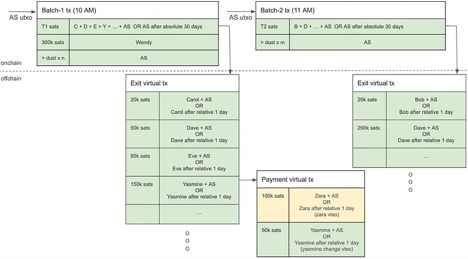

一般来，AS 会按日常的时间间隔，比如一个小时，创建一笔新的批量处理交易。希望合作式退出，或者将既有 VTXO 换成新的无风险 VTXO 的用户可以向 AS 登记自己的意图，然后 AS 会跟他们的钱包软件协调交易。这个间隔是由 AS 自己决定的。在高需求期间，AS 可以按需启动额外的批次。

### 退出虚拟交易有一些问题

在一种基础的退出虚拟交易构造中，一旦一位用户单方面退出，同一批次的所有其他用户也会被迫退出。这就打破了链外处理设施的连续性、导致意料之外的手续费、时延，并且要求每个人都重新入场。

而且，单方面退出的区块确认手续费会随着同一批次 VTXO 数量的增加而线性增加。比如说，如果一个批次有 1000 个 VTXO，那么退出的用户就必须为全部 1000 个输出支付区块确认手续费，那么单方面退出的成本当然是极为昂贵的。

### 如何解决这个问题？

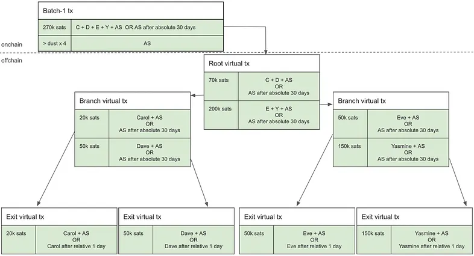

我们可以使用一种类似于二叉树的退出虚拟交易构造，而不是让一笔退出虚拟交易携带所有的 VTXO 。在这种构造中，如上图所示，如果 Carol （在同一批次的其他参与者之前）希望单方面退出，那么她需要按顺序广播一系列的虚拟交易：首先，是锚定了整个批次的 “根虚拟交易（root virtual transaction）”；然后，是左边的 “分支虚拟交易（branch virtual transaction）”，该交易通向她的 VTXO 所在的为止；最后，是她自己个人的 “退出虚拟交易（exit virtual transaction）”。

结果是，如果 Dave 也希望单方面退出，由于他跟 Carol 恰好在树的同一分支上，那么他只需要广播他自己的退出虚拟交易，因为该交易在树上的祖先交易 —— 根虚拟交易和分支虚拟交易，都已经在 Carol 的单方面退出期间得到区块确认了。

树结构的退出虚拟交易设计，相比于基础设计，提供了几种好处。在基础设计中，一个用户的单方面退出会强迫同一批次的所有其他用户也跟着退出。而在树结构设计中，没有发起单方面退出的用户不会受到其他人的退出操作的影响，既避免了被迫的退出，又保持了链外支付的使用体验。

单方面退出的区块确认手续费负担，也因此大大减少。在树结构设计中，区块确认手续费不再随着 VTXO 数量的增加而线性增加，只会随着 VTXO 数量的增加而呈对数增加（与树的深度呈线性增加），从而单方面退出也变得更加经济。后发起操作得用户还能进一步受益，因为他们只需要广播自己的子分支和叶子交易，尽可能降低自己个人的区块确认手续费。

树结构也提升了可扩展性，允许单个批次容纳更多的 VTXO 。不过，它也带来了更多的复杂性：交互式签名的次数会随着树的深度而增加，并且需要参与者之间的更多协调。

当一位用户选择单方面退出时，他们必须广播从树根到自己所在的叶子、整条路径上的每一个连接（每一笔交易），所以这个过程是非常费时费力的。当然，树根和分支交易（的输出）使用相同的脚本规则和过期条件，跟批量处理交易一样。关键的区别是这些交易在签好名后不会立即广播到区块链网络中，只会在需要时广播。

最后，如果一个用户单方面退出了，那么在 AS 日后需要清扫剩余的 VTXO 中的价值时，也必须广播和确认相应的分支交易（而不是只花费批量处理交易就能完成清扫）。

- - -

要了解更多，可看这些资料：

- [Ark 协议 —— Second 文档](https://docs.second.tech/ark-protocol/intro)（[中文译本](https://www.btcstudy.org/2025/08/07/ark-protocol-intro-illustration-by-second-docs/)）
- [Ark: A UTXO-based Transaction Batching Protocol — Litepaper by Ark Labs](https://docs.arklabs.xyz/ark.pdf)

特别感谢 [*tiero*](https://x.com/tierotiero) 审核这篇文章。

（完）