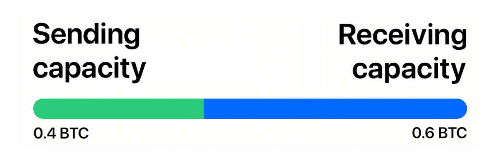
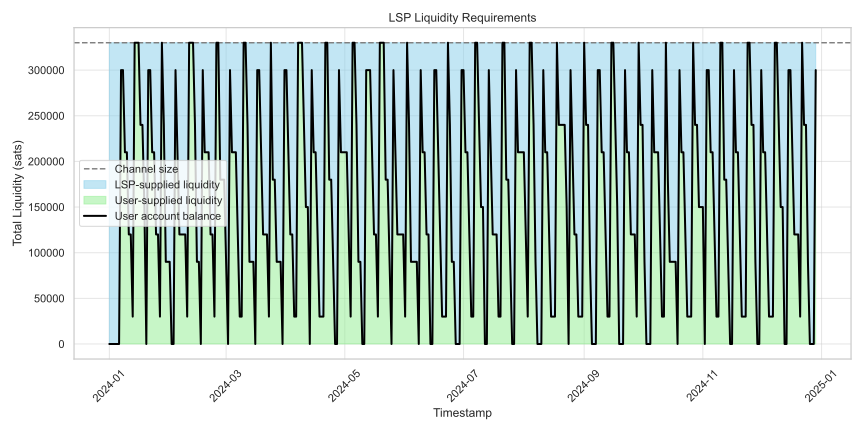
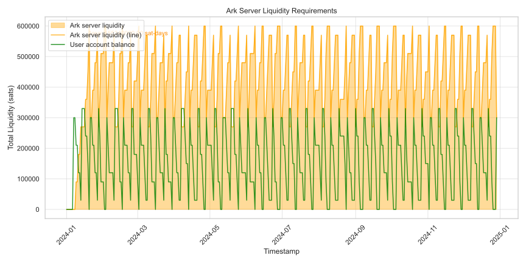
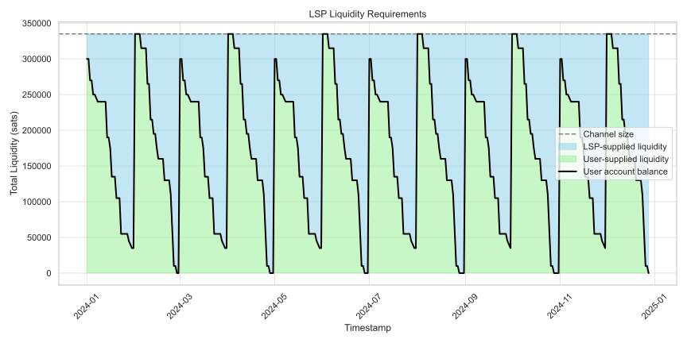
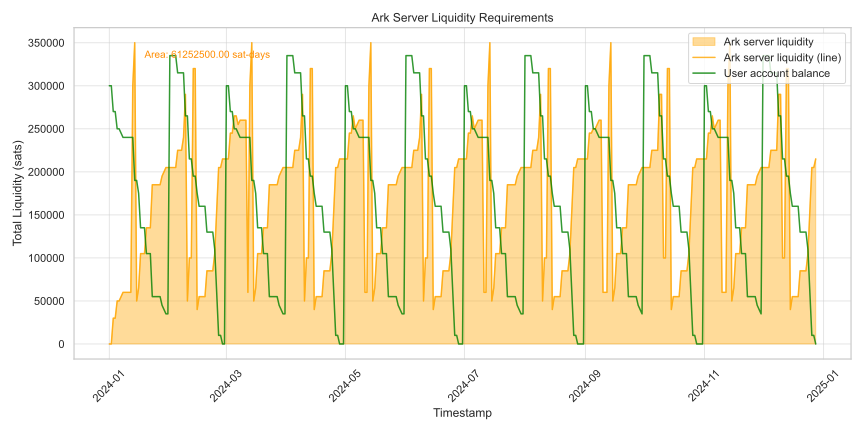
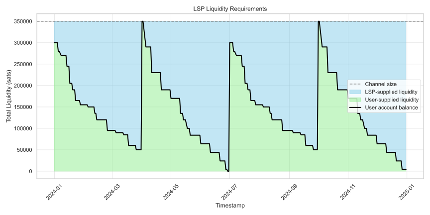
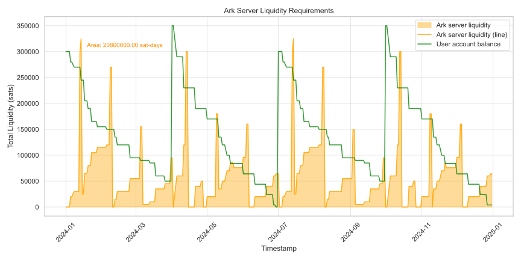
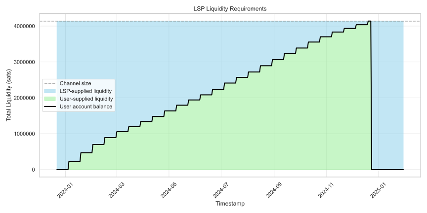
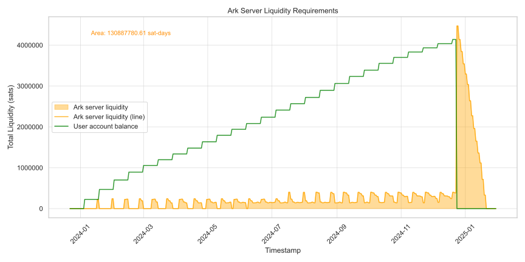

> *作者：Matthew Vuk*
> 
> *来源：<https://blog.second.tech/ark-liquidity-research-01/>*

我们准备分享一些对 Ark 流动性要求的研究。

为了探讨这个话题，我们模拟了要发送闪电支付的比特币用户的使用场景。虽然 Ark 用户可以通过 Ark 协议直接发送支付，但我们预计，在一开始，用户主要会将 Ark 用作一种闪电网络网关，至少在 Ark还没有普及的时候会是这样。所以我们就从这里开始。

为了恰当地理解问题，我们还会将这些要求与闪电网络服务商（LSP）的流动性要求相比较。

## 产生流动性要求的因素

在我们 “用数字说话” 之前，还是先简单了解一下，为什么 LSP 和 Ark 服务商都有流动性门槛。

### LSP 流动性

如今，一个普通的用户会通过一个 LSP 来使用闪电网络，而且这个用户只会与 LSP 开设一条闪电通道。

用户与 LSP 之间的支付通道就如下图所示。这条通道的容量是 1BTC，当前用户在通道中的余额是 0.4 BTC ，而接收方的当前余额是 0.6 BTC 。

通道中的 0.6 BTC ，就是由该 LSP 持有、并由 TA 注入这条通道的。这个 LSP 利用这笔钱来服务这个用户，并希望能够获得回报（代价是锁定这笔资金）。**注意：LSP 需要提供的比特币数量并不取决于交易量，只由通道内的余额决定**。

（译者注：这里的意思是，LSP 要为一条通道注入多少流动性，并不严格取决于用户的某一笔交易的数额，只取决于 LSP 希望通道具有的初始余额分布。创建好通道之后，通道内的余额状况会随着用户 收取/发送 闪电支付而不断改变。）

LSP 可以通过为每一个用户定期调整通道的容量来优化流动性使用效率。但是，每一次要调整通道的容量（也就是执行所谓的 “通道拼接”），LSP 都要为链上交易支付手续费。另一个选择是关闭与不活跃用户 —— 无法产生足够回报的用户 —— 的通道。

### Ark 服务商流动性

 标准的比特币钱包管理着 UTXO（“未花费的交易输出”）。而 Ark 钱包管理着 VTXO（“虚拟的交易输出”），它们是没有被广播的普通比特币交易的输出。

一个 Ark 服务商必须使用自己的比特币来支持用户的以下操作：

- **VTXO 刷新**：在回合中应用户要求刷新 VTXO 时，Ark 服务商必须垫付资金，因为他们只有在旧 VTXO（也即被用户弃用的 VTXO）过期之后才能取出其中的资金。（过期时间由 `vtxo_expiry_delta` 决定，通常是创建该 VTXO 之后的 28 天。）
- **闪电支付**：当用户发起闪电支付（同时放弃自己的 VTXO）时，服务商要先行支付，到该 VTXO 过期时才能回收资金。
- **离场（链上支付）**：在用户要离开 Ark 协议时，服务商必须立即提供链上的比特币，但必须在用户弃权的 VTXO 到期之后才能回收其中的资金。

但下列活动不会对服务商提出流动性要求：

- **Ark 内部支付**：同一服务商的用户之间的 Ark 支付是在回合外发生的，不需要服务商提供流动性。
- **入场**：用户使用自己的资金进入 Ark 协议。
- **单方面退出**：用户在服务商未参与的条件下广播自己的 VTXO 。

Ark 服务商优化流动资金效率的主要工具就是服务商手续费。在用户需要刷新、离场或者闪电支付时，服务商所收取的手续费会跟 VTXO 的剩余过期时间挂钩：即将过期的 VTXO 只需承担更低的手续费，而剩余较长过期时间的 VTXO 则需承担较高的手续费。这可以激励用户总是使用自己最早生成的 VTXO 。

## Ark 服务商和 LSP：谁需要更多流动性？

如果你想要一个干脆的答案，那可能要失望了。因为真像是 —— 要分情况。Ark 服务商和 LSP 的流动性机制有很大不同。

为比较两者，我们模拟了两种常见的比特币用户行为模式：

- **低频充值，慢慢花费**：用户并不经常从自己的冷存储中取出资金到热钱包，而且会慢慢地使用闪电网络来花费自己的余额。
- **定期投资囤币者**：用户每个月都会使用固定数量的美元来购买比特币，到年底才将资金转移到冷存储。

### 对参数和用户行为的模型假设

对于所有的模拟，我们都假设：

- **所有的出账支付都通过闪电网络**。对 Ark 来说，这意味着流动性负担的最差情形（会过高估计所需的资金量），因为闪电支付总是需要服务商立即提供流动性，而 Ark 内部支付是不需要的。在现实中，用户可能会通过 Ark 发起部分甚至全部支付。此外，一旦 Ark 支持 “虚拟闪电通道”，这一模式就会完全改变。

对于 LSP 模拟，我们假设：

- **没有通道容量调整**：LSP 在整一年度中都不调整用户的通道的容量。

对于 Ark 服务商模拟，我们假设：

- **VTXO 的过期时间是 28 天**：这是一个服务商可配置的参数，可以平衡成本和便利性。
- **每一个收到的 VTXO 都会在接收之后 14 天过期**：这代表了平均的 VTXO 寿命，因为用户会同时积累较老的和较新的 VTXO ，因此 VTXO 们的平均寿命会是 28 天（过期时间）的一半。
- **用户总是在过期时间的两天前刷新 VTXO**：这是用户可以调整的参数，可以由他们所用的钱包 app 自动执行。两天时间允许他们在一次刷新尝试失败之后再次尝试。

上述假设可以总结为：

| 参数              | 数值  |
| :---------------- | :---- |
| vtxo_expiry_delta | 28 天 |
| refresh_window    | 2 天  |
| new_vtxo_age      | 14 天 |

### 用户情形：低频充值，慢慢花费

在这种情形下，用户会定期为钱包充值、通过闪电网络慢慢花费，持续一年。

我们在以下三种条件下对比 LSP 和 Ark 服务商的流动性要求：

- 每周充值一次
- 每个月充值一次
- 每个季度充值一次

在下图中，LSP 的流动性负担以蓝色区域表示，Ark 服务商的则以黄色区域表示。我们用来衡量流动性要求的单位是 “*聪-日*”，不论是将 1 聪锁定 10 天，还是将 10 聪锁定 1 天，都等于 10 聪-日，对服务商来说代价是一样的。

如果我们以 聪-日 值除以支付量，我们就可以得出以天为单位的 “流动性锁定时间”。这是一个 LSP 或 Ark 服务商需要为用户花费的聪锁定同等数量聪的平均时间。

**每周充值一次**

LSP

| 指标           | 数值             |
| :------------- | :--------------- |
| 流动性负担     | 62,730,000 聪-日 |
| 支付量         | 15,330,000 聪    |
| 流动性锁定时间 | 4.09 日          |

Ark 服务商

| 指标           | 数值             |
| :------------- | :--------------- |
| 流动性负担     | 155,340,000 聪-日 |
| 支付量         | 30,930,000 聪    |
| 流动性锁定时间 | 10.13 日          |

结果

LSP 的流动性效率是 Ark 服务商的 2.485 倍。

**每个月充值一次**

这种情况近似于常见的每个月收一次薪水、每天支出一些资金的情况。

LSP

| 指标           | 数值             |
| :------------- | :--------------- |
| 流动性负担     | 58,460,000 聪-日 |
| 支付量         | 3,600,000 聪    |
| 流动性锁定时间 | 16.24 日          |

Ark 服务商

| 指标           | 数值             |
| :------------- | :--------------- |
| 流动性负担     | 61,252,500 聪-日 |
| 支付量         | 3,600,000 聪 |
| 流动性锁定时间 | 17.014 日    |

结论

两者效率几乎相同（LSP 稍微高效一些）。

**每个季度充值一次**

LSP

| 指标           | 数值             |
| :------------- | :--------------- |
| 流动性负担     | 76,902,000 聪-日 |
| 支付量         | 1,200,000 聪 |
| 流动性锁定时间 | 64.085 日    |

Ark 服务商

| 指标           | 数值             |
| :------------- | :--------------- |
| 流动性负担     | 20,600,000 聪-日 |
| 支付量         | 1,200,000 聪 |
| 流动性锁定时间 | 17.17 日    |

结果

Ark 的效率是 LSP 的 3.73 倍。

### 用户情形：定期投资

这样的用户尝试积累比特币、长期持有。他们会每两周购买价值 100 美元的比特币。而在一年结束的时候，用户会清扫自己的钱包、全部转移到冷存储中。

LSP

| 指标           | 数值             |
| :------------- | :--------------- |
| 流动性负担     | 870,449,331.06 聪-日 |
| 支付量         | 4,139,500 聪 |
| 流动性锁定时间 | 210.27 日    |

Ark 服务商

| 指标           | 数值             |
| :------------- | :--------------- |
| 流动性负担     | 130,887,780.61 聪-日 |
| 支付量         | 4,139,500 聪 |
| 流动性锁定时间 | 31.6  日    |

Ark 服务商的效率是 LSP 的 6.65 倍。

### 总结

| 长期             | LSP 资金锁定时间 | Ark 资金锁定时间 | Winner |
| :--------------- | :--------------- | :--------------- | :----- |
| 每周充值一次   | 4.09 天        | 10.13 天       | LSP    |
| 每个月充值一次   | 16.24 天       | 17.01 天       | 平手   |
| 每个季度充值一次 | 64.09 天       | 17.17 天       | Ark    |
| 定期投资者      | 210.27 天      | 31.60 天       | Ark    |

## 洞见

### 余额 vs. 支付量

LSP 的流动性要求主要是由用户的余额会发生的变动决定的，而 Ark 服务商的流动性要求主要是由支付量决定的。

### LSP 的流动性锁定时间的变数比 Ark 服务商的更大

LSP 的 *流动性锁定时间* 短可以短到只有 4 天，但长可以长达 64 天；而 Ark 服务商的锁定时间是 10 到 17 天。不同的用户给 LSP 带来的压力可能显著不同。

### 在预测用户行为上，LSP 必须比 Ark 服务商变现更好

LSP 必须为每一位用户分配合适的入账通道容量（收款额度），但是，用户的收款（净）额是无法提前知道的。LSP 只能调整通道容量，但每一次调整都要支付一笔昂贵的链上交易手续费。

在某些情况下，LSP 可能更加高效，但 LSP 同样可能给用户分配完全用不上的流动性。糟糕的预测会带来低效率。任何与效率低下相关的成本，最终都会由该 LSP 的用户来承担。

Ark 服务商则不需要玩这样的猜测游戏。TA 只需在用户发起闪电支付时为之调配特定数量的流动性。

### 充值的频率是 Ark 流动性效率的关键因素

我们发现，流动性效率与用户为钱包充值的频率密切相关。当用户充值的间隔长于 `vtxo_expiry_delta` 时，Ark 服务商是最高效的。

比如说，在每月充值一次的模拟情形中，每月 12 号至 14 号的峰值是因为月初收到的 VTXO 临近过期、需要刷新了。

然而，即使用户频繁为钱包充值，Ark 服务商的流动性负担依然保持在合理水平。

## 结论

**Ark 可以为不频繁发起闪电支付的用户提高流动性要求**。

基于我们的模拟，如果你是那种每天都发起闪电支付、每周（或更长时间）都收到闪电支付的用户，那么你使用 LSP 可能比使用 Ark 更加节约。

但是，如果你的支付频率较低，每个月只接收支付一次（比如说每个月的工资和定期投资比特币），那么使用带有闪电网络网关的 Ark 服务商也许能节约很多钱。

如果你是个定期投资者，那你毫无疑问应该使用 Ark，你付出的流动性费用将只会是你使用 LSP 时候的几分之一。

此外，对 Ark 的模拟假设了用户只会通过闪电网络发起支付。这是一个保守的假设，“最差的情形”，因为从 Ark 协议发起闪电支付需要服务商立即投入流动性，但 Ark 协议内的支付并不需要。

最后，我们希望这个模拟说明了，Ark 服务商的流动性要求不会过度。这是我们经常听到的一个误解！

（完）