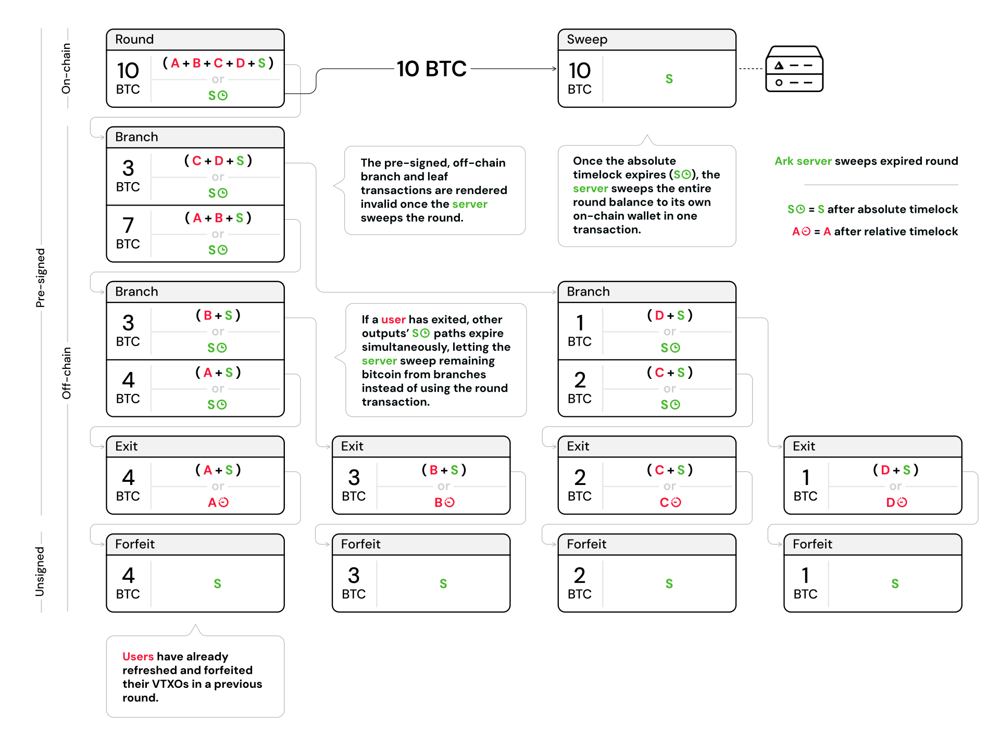

> *作者：Second Docs*
> 
> *来源：<https://docs.second.tech/ark-protocol/expiries/>*

所有 VTXO 都有过期时间，也就是服务商可以取走其中剩余所有比特币的时间起点。理解过期机制，对于管理你（用户）在 Ark 协议中的比特币控制权至关重要。

## VTXO 过期是怎么回事？

当时间来到一个 VTXO 的过期区块高度时，服务商就获得了通过时间锁花费分支、将所有剩余的比特币清扫到自己的钱包的能力。但用户仍保留着花费这个 VTXO 和单方面退出的能力（只要他们还未放弃这个 VTXO）。

这一机制让服务商可以置换出在 VTXO 的生命周期中部署的流动性，并防止用户通过无限期持有过期的承诺来折磨服务商。

- 一旦某一回合中的 VTXO （全部同时）过期，Ark 服务商就可以清扫回合交易中的价值，到自己的钱包 -

## 避免过期

用户有几种办法避免 VTXO 中的价值因为过期而损失：

- **花掉 VTXO**：创建支出型 VTXO，用作支付（新的 VTXO 会继承原 VTXO 的过期时间）
- **在一个回合中刷新**：转化成一个新的刷新型 VTXO（带有新的过期时间）
- **合作式退出**：跟服务商合作，创建一笔退出交易
- **单方面退出**：广播 VTXO 中的所有交易，从而在链上领取比特币（紧急情形的保留选项！）

在实际使用中，只要定期打开钱包 app，用户就不需要担心过期问题。良好设计的钱包 app 会实现防止过期的自动化策略，比如优先花费比较老旧的 VTXO、自动刷新临近过期的 VTXO 。

## 激励服务商诚实作为

虽然钱包 app 会积极处理过期事宜，Ark 的服务商也有强烈的动机保持正直作风（甚至在某个 VTXO 真的过期的罕见事件中）。服务商领取未弃权 VTXO 价值的任何尝试，都会被用户和其他观察者迅速辨识。这样的行为会导致用户立即退出或单方面退出，导致该服务商的经营规模显著下降。因此，经济激励偏向正直的作为，而非尝试没收少量过期 VTXO 的行为。