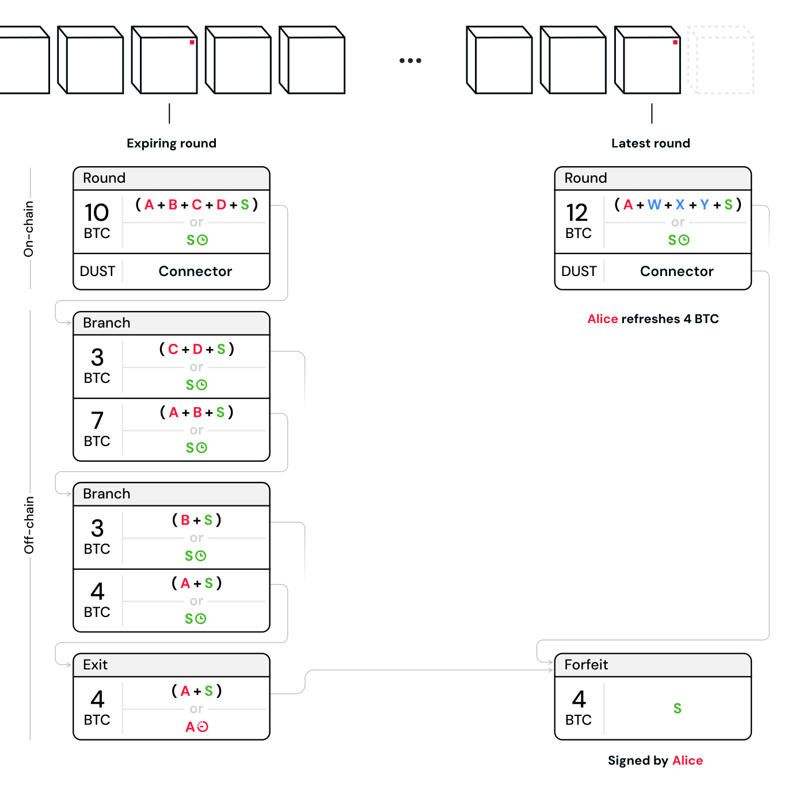
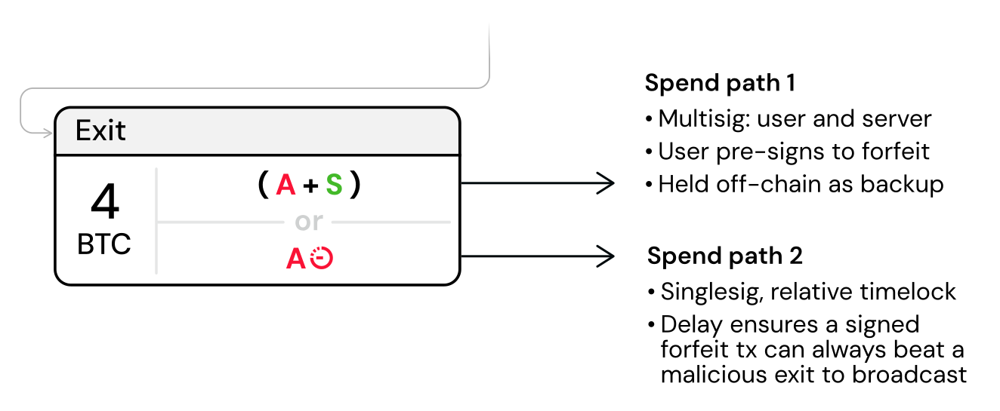
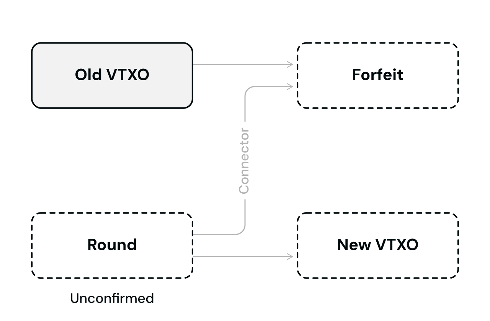
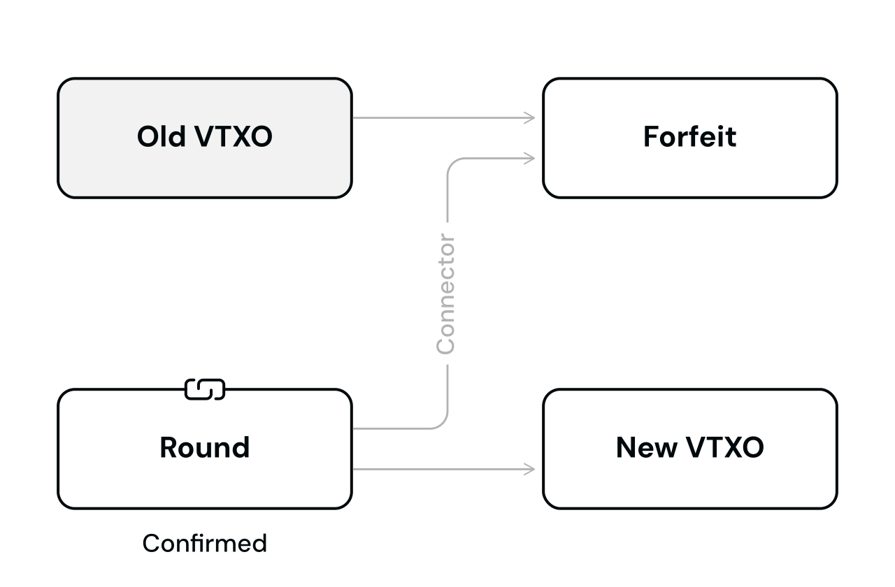
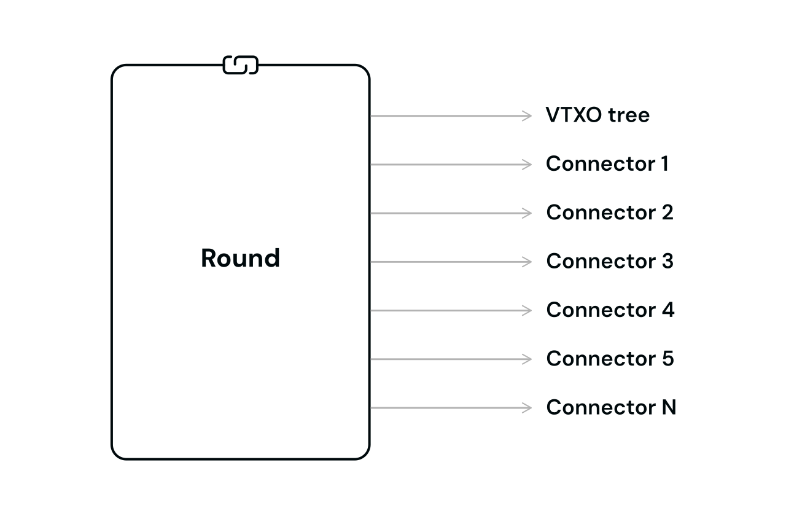
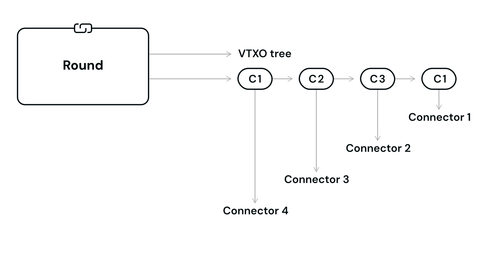
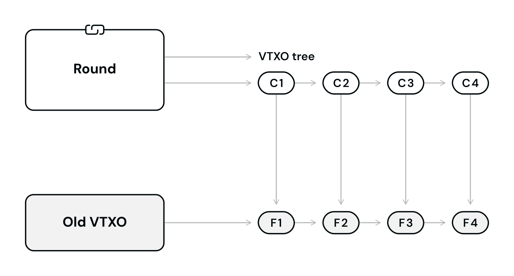

> *作者：Second Docs*
> 
> *来源：<https://docs.second.tech/ark-protocol/forfeits-connectors/>*

用户的弃权交易也是预先签名的交易，用于[刷新 VTXO](https://docs.second.tech/ark-protocol/vtxo/#refresh-vtxos) 和离场，作用是让 Ark 服务商能控制用户的 [VTXO](https://docs.second.tech/ark-protocol/vtxo/) 。服务商持有这些弃权交易但并不立即广播到网络中，为的是应对恶意的退出操作。虽然一笔弃权交易将一个 VTXO 的控制权交给了服务商，但该服务商无法立即获得其中的比特币 —— 必须等待该 VTXO 过期。

“连接器” 是一种特殊的输出，给出了一种密码学保证：弃权交易仅会在用户意图的交易完成时才会变成有效交易；这样的意图交易可能是：

- 一个新的 VTXO，被包含在一笔新的[回合交易](https://docs.second.tech/ark-protocol/rounds/)中，并且该交易得到了区块链确认
- 一个离场输出，作为回合交易的输出，并且该交易得到了区块链确认

结果是，用户可以安全地签名弃权交易，不需要信任任何第三方 —— 也即保证了整个过程是原子化的（要么完全成功，要么完全没变化）、自主保管的，而且没有对手方风险。

- 连接器保证了 Alice 弃权交易仅在（例如）新 VTXO 的回合交易得到区块链确认之后才成为有效交易 -

> **Ark 内部支付并不使用弃权交易**
>
> Ark 内部支付并不涉及用户通过放弃一个 VTXO 来发起支付的原子化操作。相反，用户跟 Ark 服务商一起[预签名一笔新的链下交易](https://docs.second.tech/ark-protocol/payments/)，在 TA 现有的其中一个 VTXO 上再衍生一个叶子出来。若是用户希望发起闪电支付，Ark 协议会对叶子使用定制的、基于 HTLC 的花费条件，来保证原子化执行。

## 弃权交易

如果你熟悉闪电通道的惩罚交易的化，你应该已经能够想到 Ark 协议中的弃权交易是怎么回事了。

为了支出弃权，每一个 VTXO 的 “[退出交易](https://docs.second.tech/ark-protocol/vtxo/)”（叶子）都有两个花费路径：

- **花费路径 1**：这条路径是一个 2-of-2 的多签名，由用户（VTXO 所有者）和 Ark 服务商组成。用户用这个路径来签名弃权交易，从而将这个 VTXO 中的比特币交给 Ark 服务商。注意，这条花费路径并无时间锁。即使用户将退出交易发布到网络中，Ark 服务商也可以在用户能够取走比特币之前发布弃权交易。
- **花费路径 2**：这条路径完全是由用户控制的，允许他们单方面退出（假设用户从未签名过弃权交易的话）。这条路径有一个相对时间锁，长达 `60` 个区块（大约是 10 消失）。这个时间锁是在比特币脚本中通过 OP_CHECKSEQUENCEVERIFY（CSV）操作码实现的。

- 退出交易的输出（叶子）中的花费条件如何支持弃权操作 -

### 弃权交易通常不会发布到网络中

在常规条件下，基于这两条花费路径的交易都不会被广播到网络中，即便用户要放弃其 VTXO 。相反，Ark 服务商会在一笔回合交易的绝对时间锁过期后，用一笔链上交易清扫该回合交易中的所有资金（也即一次性清扫基于该回合交易的所有 VTXO 中的资金）。

用户所签名的弃权交易，对 Ark 服务商来说仅仅是一种 “保险”，应对用户已经弃权之后又尝试单方面退出的非常规情形。

### 弃权交易如何防止恶意退出

如果用户尝试恶意退出，他们会先广播自己的 VTXO 的所有分支交易，然而，一旦他们发布了叶子交易（退出交易），他们就必须等待相对时间锁过期，然后才能将叶子交易输出中的所有资金发送到仅有他们能控制得链上地址。

在 Second 的 Ark 实现中，我们预计会将这个退出时间锁设为大约 10 小时。这将给 Ark 服务商充足的时间来发现恶意退出的尝试，并广播用户签过名的弃权交易；因为用户必须等待，弃权交易会更快将退出交易输出中的资金转走。

虽然弃权交易给 Ark 服务商提供了一些安全性，但也并不理想：一旦出现了恶意退出，服务商就不再能以一笔交易取走相关回合交易输出中的所有资金，而必须发起额外的链上交易。然而，广播多笔交易（从分支交易到叶子交易）所需支付的链上手续费，应该已经足以劝阻用户常常这么做！

## 连接器

理解了弃权交易之后，我们再来看看 “连接器” 如何保证弃权过程是原子化的。我们以刷新过程为例，但离场过程是完全一样的。

弃权操作的原子性是通过跟意图确认的回合交易相绑定来实现的。只要相关的回合交易还没确认（比如还停留在各节点的交易池中），那弃权交易就是无效的，即便广播出去，也会被网络中的节点拒绝（不会被转发）。当然，在回合交易还没确认时候的，新的 VTXO 也不是有效的价值载体！

- 如果回合交易还没得到区块链确认，弃权交易就还不是有效的交易，同时新的 VTXO 也还没生成。 -

（译者注：这是因为弃权交易使用了回合交易的一个小额输出，也即所谓的连接器，作为自己的输入。如果回合交易没有得到确认，弃权交易就是在花费一个不存在的输入，也就是无效的。）

但只要回合交易得到了区块链确认，弃权交易就转为有效交易，同时新 VTXO 生成。

- 一旦回合交易得到区块确认，弃权操作和新 VTXO 的生成就同时完成了 -

### 优化 踪迹/区块空间使用

为了节约空间，我们希望所有的连接器可以打包到一个输出中。但我们需要高效实现这一点。一个 Ark 回合可能有几百个、几千个用户参与，草率构造的连接器可能会产生一个体积很大（也非常昂贵的）回合交易。

下图是是一种糟糕设计的图示，尽管将多个连接器打包到了一个输出中，交易的体积依然会很快膨胀：

因此，Ark 协议使用 “连接器链条” —— 一连串的交易，其中每一笔交易都有一个连接器输出。下图是这种良好的打包设计的图示 —— 最终会产生一个体积更小的回合交易，但依然能嵌入关联所有弃权交易所需的数据。

为此需要牺牲的东西是，它需要更多交互：弃权一个 VTXO 的用户必须根据链条上的每个连接器输出签名一笔弃权交易。

在下图中，你可以看出，在有用户尝试恶意退出时，Ark 服务商要如何响应。比如，它必须广播 C1 和 F1 到区块链网络中。

> **弃权交易与连接器都只偶尔出现**
>
> 在常规轻轻下，只有回合交易会广播到比特币网络中。来自连接器链条的交易**只会**在有用户尝试恶意花费一个已经弃权的 VTXO 时出现在链上。