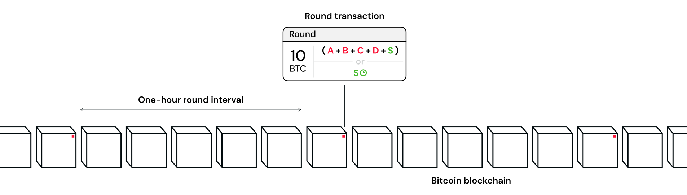

> *作者：Second Docs*
> 
> *来源：<https://docs.second.tech/ark-protocol/intro/>*

Ark 协议是比特币网络上的一个二层协议。它提供了简单的入门程序、便宜且可预测的手续费、即时支付功能、闪电网络互操作性，同时保留了你对自己的比特币的完全控制。

Ark 在当前的比特币协议上就能实现，无需新的操作码、无需变更共识规则。

## 客户-服务商

Ark 协议围绕着一个称作 “ *Ark 服务商* ”的角色运行。用户连接到一个服务商，基于 Ark 协议与其他人交互。用户也可以通过这个服务商的 *闪电网络网关*，跟刚广阔的闪电网络交互。

## 基于 VTXO 的扩容

Ark 引入了一种新的，基于 “虚拟 UTXO（[VTXO](https://docs.second.tech/ark-protocol/vtxo/)）” 的扩容模式。一个 VTXO 是一连串链下的、预签名的交易；持有该 VTXO 的用户可以随时将这串交易广播出去、在链上索取自己的比特币，这可以应对紧急情形。在常规情况下，这些链下的交易不会被广播到比特币网络中，用户会在自己的 Ark 服务商的合作下 *退出* Ark 协议。

虽然 VTXO 的实际结构不是我们这里说起来的那么简单，但它确实基于 UTXO 模型，而且在大部分情况下，其执行功能的方式与 UTXO 一模一样 —— 能在 UTXO 上做的事情，在 VTXO 上都能做。

- 一个 “入门型 VTXO” 的图示。这是最简单的一种 VTXO -

## 回合制

Ark 服务商会周期性[启动和协调](https://docs.second.tech/ark-protocol/rounds/)一轮跟用户的交互。我们估计理想的回合间隔大概是一小时，但每个 Ark 服务商都可以自己设置。

在每一回合中，用户都可以 *刷新* 自己的 VTXO —— 放弃一个旧的 VTXO、换取一个新的 VTXO 。并不是链接到同一个 Ark 服务商的所有用户在每一个回合都必须参与。只有请求刷新的用户的 VTXO 才会被包含到相应的 “回合交易” 中。

- 回合的长度设置为 1 小时，将使一个回合结束的时候，上一回合的回合交易刚好得到了 6 次区块确认 -

## 交易树

在一个回合中，Ark 服务商和用户一起[构造一棵交易树](https://docs.second.tech/ark-protocol/vtxo/#transaction-trees)。交易树的每一个 *叶子*（也就是一笔 *退出交易*）由一个用户控制，并且对应于一个 VTXO 。 

交易树的 *树根* 会被广播到网络中、得到区块链的确认；该交易称作 “ *回合交易* ”。一旦一笔回合交易得到确认，对应交易树上的每个用户都获得了可验证的保证：他们可以单方面取回自己的比特币。

- 一个交易树案例，其树根会在区块链上得到确认；特别注明了一个刷新的 VTXO -

## 过期时间

VTXO 必须持续刷新，因为 [VTXO 有过期时间](https://docs.second.tech/ark-protocol/expiries/)。这是 Ark 协议的要求，为了让 Ark 服务商可以用一笔链上交易（“ *清扫交易* ”）取走一个过期的回合中所有已被放弃的比特币，而不是要用许多笔交易来取。

每个 VTXO 都有一个内置的过期时间，是在创建的时刻设置的。用户（或者说，他们的钱包软件）必须在过期之前花掉或者刷新自己的 VTXO，否则，从技术来说，不管是用户 *还是*  Ark 服务商，都能独自花费这个 VTXO  。这个过期时间我们估计大约是 30 天，虽然最后还是取决于各 Ark 服务商自己的配置。

- 过期机制让 Ark 服务商可以用一笔链上交易置换出以前部署的流动性 -

## 流动性

与闪电网络不同，Ark 协议的用户[不需要管理流动性](https://docs.second.tech/ark-protocol/liquidity/) —— Ark 会处理好。

Ark 服务商必须为多种操作准备好流动性，用户刷新 VTXO 是最常见的一个。在刷新 VTXO 的时候，用户会放弃一个 VTXO、换取一个新的。但是，这个被放弃的 VTXO，不能立即为 Ark 服务商所用，要等到其过期才行。而新的 VTXO 又要求立即为回合交易树投入链上的比特币。这就对  Ark 服务商产生了一种临时的资本量要求，而 Ark 服务商所得到的回报是用户的手续费。

[Ark 的手续费结构](https://docs.second.tech/ark-protocol/fees/)（尚未得到定义）需要反映出：越新的 VTXO，其刷新成本就越高；越临近过期的 VTXO，刷新成本就越低。

其它依赖于流动性的操作包括用户退出和用户发起闪电支付。Ark 用户之间的转账不需要流动性 —— 这样的资金转移是 *外在于回合运行的*。

- Ark 服务商面临为最新回合投入资金、同时要等待以往回合的时间锁过期的资金成本 -

## 用户进入

为了让比特币进入一个 Ark 实例，用户需要跟一个 Ark 服务商共同签名一笔注资交易，并广播出去。这位用户不需要等待一个回合，但确实需要一个以上的区块确认，才能完成进入流程。

重要的是，新用户不是一定要经历这样的程序。他们设置好钱包之后，马上就可以接收 VTXO（没错，从其它已经拥有 VTXO 那里）。

## 用户退出

Ark 是一套乐观主义的协议。在常规情况下，用户要从 Ark 实例中取回比特币时，[使用退出流程，而非单方面取款流程](https://docs.second.tech/ark-protocol/exit/)；单方取款流程是为意外情形准备的。

要退出的时候，用户会参加一个回合，但不会刷新自己的 VTXO，而是[放弃自己的 VTXO](https://docs.second.tech/ark-protocol/forfeits-connectors/)、换取一个交给 TA 所选定的地址的链上输出。跟 Ark 协议中的许多流程一样，退出操作是原子化的，Ark 服务商和用户都不会暴露在对手方风险中。

## 单方退出

单方退出的可用性是 Ark 协议的关键特性，它让用户可以完全控制自己在链下的比特币。不过，单方退出被期望作为应对紧急情形的保留手段 —— 比如，Ark 服务商变得无响应的情形。

要采取单方退出的时候，用户会广播构成其 VTXO 的一连串的预签名交易（从树根到叶子）。每一笔这样的交易，都将回合交易（树根）分解成连续的、更小的分支，直到用户在 VTXO 中的资金被释放到链上的一个 UTXO 中。  

因为用户们的 VTXO 共享了交易树上的一些分支，每一个用户的单方退出操作，都会减少共享同一分支的其他用户后续执行自己的单方退出操作时所需广播的交易的数量。

## 支付

Ark 用户之间的支付可以随时发生，使用一种称作 “[arkoor](https://docs.second.tech/ark-protocol/payments/)（Ark out-of-round）” 的方法。这是在 Ark 内实现用户对用户支付的唯一方法。在一笔 arkoor 支付中，接收者获得一个直接来自发送者在交易树的叶子的[新的支出型 VTXO](https://docs.second.tech/ark-protocol/vtxo/#spend-vtxos) 。

- 来自一个入门型 VTXO 的支出型（arkoor） VTXO -

支付由 Ark 服务商和发送者使用类似于 statechain 的方法共同签名。Arkoor 方法提供了两项关键好处：

1. 零流动性要求
2. 近乎即时的结算（只要求 Ark 服务商的联合签名）

然而，从信任关系角度看，它也是一种临时的妥协：只要发送者和 Ark 服务商不勾结，收到的 VTXO 就可以用来执行单方退出，换句话说，他们两方中至少要有一方是诚实的。一旦接收者在后续的回合中刷新自己的 VTXO，他就重新获得了执行免信任单方面退出的能力。

## 基本原理之上

现在你已经了解了 Ark 的基本原理了，该更加深入了！无论你是一个尝试集成 Ark 到自己的应用中的开发者，还是只是想了解 Ark 协议的设计，我们希望后续的章节可以足够的技术深度，让你完全理解 Ark 方法对扩容比特币的效果。