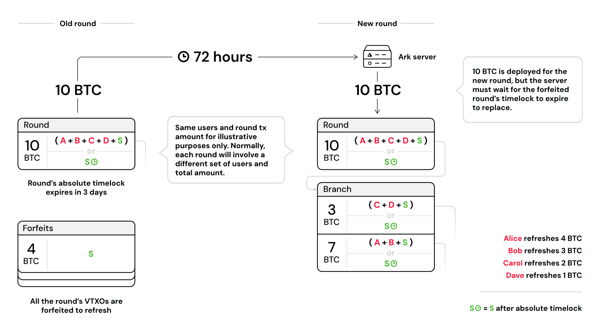

> *作者：Second Docs*
> 
> *来源：<https://docs.second.tech/ark-protocol/liquidity/>*


当用户执行需要链上比特币来支持的操作 —— 比如刷新、离场和闪电支付 —— 时，Ark 服务商就必须先垫付比特币、等到被花费的 VTXO [过期](https://docs.second.tech/ark-protocol/expiries/)之后才能清扫其中的资金（跟垫付的资金数量相等）。垫付的资金叫做 “ *流动性* ”，也跟 Ark 服务商带来了持续的资本要求，并在根本上塑造了 Ark 协议的经济学和手续费结构。

在闪电网络中，最终来说，用户为自己的（通道的）流动性负责；Ark 则将流动性管理的负担完全转移给了 Ark服务商，将用户从这种复杂性中解放出来（虽然他们依然需要负担流动性成本）。



<p style="text-align:center">- 简化的 Ark 操作流动性案例：用户刷新即将过期的 VTXO，这个服务商立即部署了 10 BTC、为新的 VTXO 注资，但必须等待旧的回合交易（也即被刷新的 VTXO 所在的回合交易）的时间锁过期，才能从被弃权的 VTXO 中回收 10 BTC —— 这就带来了一种临时的资金要求 -</p>


## 需要流动性的操作 vs. 不需要流动性的操作

**需要流动性的操作**

这些操作需要 Ark 服务商垫付比特币（等待被花费的 VTXO 过期，然后回收等额的资金）：

- **刷新**：最常见的需要流动性的操作。用户放弃旧的 VTXO，交换带有新的过期时间的新 VTXO 。
- **离场**：通过合作取款流程，将 VTXO 转变为链上资金。
- **闪电支付**：服务商要通过 *闪电网络网关*，在闪电网络中交付比特币支付。

**不需要流动性的操作**

- **Ark 支付**：在 Ark 用户之间发生的[回合外支付](https://docs.second.tech/ark-protocol/payments/)，不需要流动性 —— 他们只是延伸了已有的[交易树](https://docs.second.tech/ark-protocol/vtxo/#transaction-trees)。
- **单方面退出**：用户广播自己的 VTXO 中的预签名交易，不需要服务商参与并提供流动性。

## 流动性的成本与经济学

为了给用户提供流动性，服务商必须维护一个比特币财库 —— 一笔准备金，以应对用户操作的需要。这带来一项经济上的取舍，是理解流动性成本的基础。

**机会成本原理**

一个 Ark 服务商财库中的比特币，如果部署到别的地方，也能也能带来回报 —— 比如放在闪电通道中赚取路由手续费和流动性手续费，或者通过比特币借贷平台借出。当一个 Ark 服务商锁定比特币来给自己的 Ark 提供流动性时，他放弃了这些潜在的收益机会。这种被放弃的潜在收益就被称为 *机会成本*。

Ark 服务商主要通过支付和流动性手续费来赚取收益。服务商自然会尝试自己的总手续费能够追平乃至超过可以在别的地方获得的收益，否则，在跟别的比特币投资机会竞争时，他们就没有吸引力了。

> **Ark 的流动性成本是比特币计价的**
>
> Ark 服务商必须参考以比特币计价的回报率市场 —— 会跟美元市场的回报率截然不同。

**如何计算流动性成本**

流动性成本取决于三个因素：

1. **数额**：被刷新或离场的比特币的数额
2. **剩余过期时间**：被花费的 VTXO 还有多久就要过期（其中的资金就可以被回收）
3. **机会成本**：服务商的以比特币计价的资金成本（比特币储蓄的预计年化回报率）

公式是：`数额 * （剩余过期时间 / 365 天） * 机会成本 = 流动性成本` 。

**案例**

> **餐巾纸数学**
>
> 以下是粗糙的计算，是为了给你一些感觉 —— Second 的 Ark 服务商上线后的实际的手续费率可能不同，而且会随市场条件而波动。

一个用户要刷新 10 万聪的 VTXO，这个 VTXO 在 5 天后就要过期，并假设机会成本是 5% 的年化利率：

``` 
10 0000 聪 * （5 天 / 365 天） * 5 % = 68 聪（流动性成本）
```

> **刷新也需要支付链上手续费**
>
> 刷新操作也需要支付区块确认手续费。如果一回合有 100 位用户刷新，而比特币网络为一笔交易的区块确认收取 2 万聪的手续费，那么每一个用户要承担的区块确认手续费成本就是大约 200 聪。所以，在上面这个例子中，总的刷新成本将是大约 268 聪（用 (68+200) 聪刷新 10 万聪，费率是 0.27%）。

**VTXO 的年龄影响刷新成本**

- **年轻的 VTXO**：最佳才创建的 VTXO， 拥有更高的刷新成本，因为服务商的流动性会被锁定更长时间
- **年老的 VTXO**：临近[过期](https://docs.second.tech/ark-protocol/expiries/)的 [VTXO](https://docs.second.tech/ark-protocol/vtxo/) ，刷新成本大大低于年轻的 VTXO，因为服务商的流动性只会被锁定很短一段时间。

[Ark 手续费](https://docs.second.tech/ark-protocol/fees/)必须反映服务商的这些代价、自然地激励用户在更接近过期的时间刷新自己的 VTXO， 同时，让希望立即获得安全性的用户能更早发起刷新。

## Ark 的资金效率

Ark 通过两个关键因素实现了更高的资金效率：

- **精确的流动性用法**：用户所消耗的流动性数量恰好等于他们的具体操作所需要的数量，并且就发生在他们需要流动性的时候，不需要预先注资。这跟闪电网络不同，通道必须预先注入资金，不论资金来自用户还是闪电网络服务商。
- **不需要预测用户行为**：服务商在用户需要时部署流动性，不需要预测用户行为和预先分配资金。闪电网络要求服务商预测用户的支付流以调整通道的容量，而 Ark 服务商可以动态地响应具体的使用模式。

## 管理流动性不足

我们预计服务商不太可能用尽流动性 —— 如果他们能够产生稳定的比特币收入，资本配置者就会有兴趣投资他们。如果他们没有兴趣，那表明这个服务商所收取的流动性手续费太低了。

不过，因为流动性不足依然有可能发生，服务商们依然要为这种情形作准备，在实际发生之前预测到流动性短缺。因为所有的 VTXO 过期信息都是提前可知的，服务商可以看到流动性需求到来，并相应作出机会。

当临近流动性不足时，服务商应该计算出处理紧急的请求（刷新或离场即将过期的 VTXO）需要多少比特币，并储备足够的流动性来应对这些关键的操作。他们可以拒绝不那么紧急的请求，比如会让流动性跌落到安全存量以下的年轻 VTXO 刷新。

经常面临流动性短缺的服务商会看到自己的信誉破产、收益减少，因为用户会寻找替代选择。因为，用户一向保留着单方面退出的选择，不管服务商的流动性状态如何。

（完）