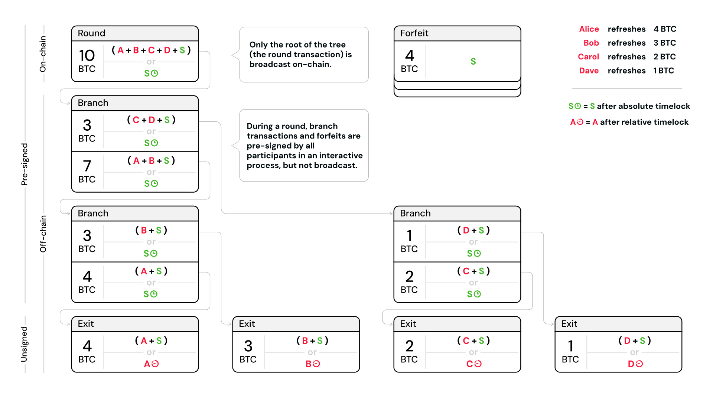
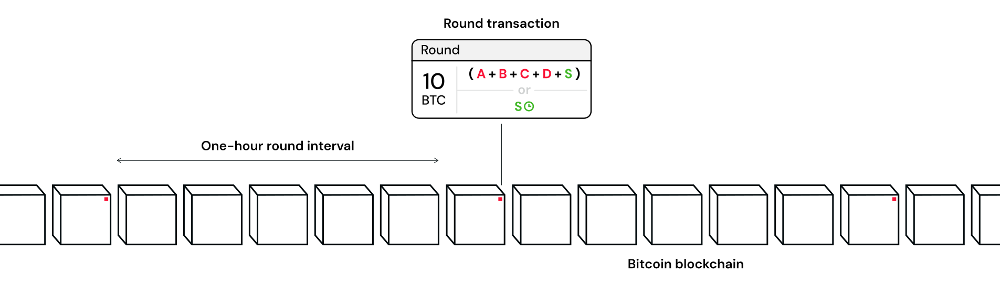

> *作者：Second Docs*
> 
> *来源：<https://docs.second.tech/ark-protocol/rounds/>*

“回合” 是一个 Ark 服务商的心跳 —— 定期发生，让用户能够刷新自己的 VTXO、重设过期时间并获得免信任的安全性。

在一个回合中，多名用户可以跟 Ark 服务商可以弃权旧的 VTXO ，从而换取新的 “[刷新型 VTXO](https://docs.second.tech/ark-protocol/vtxo/#refresh-vtxos)”。这是通过一种合作签名流程来实现的：用户们会跟服务商一起创建一棵交易树（由预签名交易组成的一种层级式结构），并广播交易树的树根 —— 也就是所谓的 “回合交易” 到链上。

## “回合” 做成了什么事？

用户会出于三个主要原因而参与回合：

**过期管理**：刷新任何类型的、临近过期的 VTXO ，以重置倒计时、保持对比特币的控制权。

**安全升级**：将 “[支出型 VTXO](https://docs.second.tech/ark-protocol/vtxo/#spend-vtxos)”（带有额外的信任要求）转化为完全免信任的刷新型 VTXO 。

**离场**：通过在回合交易中创建一个额外的输出，将比特币转移回用户排他性控制的地址中。

回合提供了协调机制，让这些用户可以同步彼此的活动。通过安排周期性的回合，钱包 app 也可以协调时间，从而多个刷新和离场的用户可以同时在线、参加完成交易树和相关弃权交易的交互式签名程序。

> **支付发生在回合外**
>
> 早期的 Ark 协议在回合内实现支付，但现在已经不是这样了。Second 的 Ark 实现将所有的支付都通过 “[arkoor 交易](https://docs.second.tech/ark-protocol/vtxo/#spend-vtxos)” 即时处理。现在，回合仅仅用于刷新。

## 回合过程

每个回合都遵循一套结构化的流程：要求 Ark 服务商和用户的钱包 app 参与同步的协调。Ark 中的支付没有这个要求，它只要求发送者和服务商在线；回合则要求所有想要刷新或离场的用户实时参与：

1. **回合启动**：一个 Ark 服务商宣布，根据自己预先确定的计划，启动新的一个回合。服务商必须维持可靠的回合计时，以保证钱包 app 可以协调自动化的参与，尤其是那些持有即将过期的 VTXO 的用户的钱包 app 。
2. **用户响应**：需要刷新 VTXO 的用户的钱包 app 联通网络，与服务商沟通自己要刷新或离场哪个 VTXO 。这一阶段需要所有参与者在回合的时间窗口内保持在线、能够响应，无响应的用户会被排除在外。
3. **交易树构造**：Ark 服务商为所有参与者构造完整的交易树和弃权交易。这一复杂的协调过程需要管理手续费估计、流动性提供，以及保证所有交易之间的数学关系都准确无误。
4. **合作签名**：所有用户的钱包 app 参与一套交互式签名流程，以授权交易数以及所有相关的弃权交易。这需要多轮通信，因为用户需要签名 “待签名的比特币交易（PSBT）” 并与服务器和其它用户交换签名。用户在中途变得无响应，可能会导致回合拖延，或者强制重试（构造一棵新的交易树）。
5. **回合注资与确认**：Ark 服务商为回合交易注资，并广播回合交易到区块链上，该交易也会为离场用户创建额外的交易输出。**在回合交易得到一次区块确认以前，回合会一直持续**。服务商会监控区块链并实施必要的加速确认。

- 一个在某回合中产生的交易树的例子 -

### 用户交互需求

当前的 Ark 实现要求用户在回合中主动参与，因为：

- **VTXO 挑选**：用户选择放弃哪个 VTXO，以及如何构造他们的刷新或离场输出
- **签名协作**：用户必须为复杂的交易树和相关的弃权交易提供签名

这意味着，用户的钱包 app 在参与回合时，必须全程保持网络联通，并及时响应 —— 并不是每一回合都要参与，但在 VTXO 即将到期时必须参与。

### 通过连接器实现原子化弃权

“[连接器](https://docs.second.tech/ark-protocol/forfeits-connectors/)” 的使用，保证了这个复杂的协调过程是原子化并且安全的。弃权交易仅在回合交易得到确认之后才会生效，保证了用户不会在没有收到新 VTXO 之前平白无故地失去自己的 VTXO ！在回合交易得到确认之前，用户会一直保留自己现有 VTXO 的单方退出权利。

反过来，回合交易的构造也依赖于已签名的弃权交易的存在，使服务商能够保证，仅在自己能在一个 VTXO 过期后申领其中的比特币的前提下，才会为之部署流动性。

### 用户体验考量

设计良好的 Ark 钱包 app 应该自动化参与回合，以保证用户的 VTXO 绝对不会过期。钱包需要监控回合的更替（在必要时唤醒设备）、在用户所持有的 VTXO 即将超时之前将优先处理参与事宜，并在错过回合或者回合失败之后重新尝试。

## 回合时间窗口与间隔

回合的频率是服务商可配置的参数。Second 的 Ark 服务商预计会每 1 ~ 2 小时运行一个回合，虽然可能会因为需求和服务商的服务条款而改变。

- 一小时的时间间隔，将导致大约每六个区块就会有一笔新的回合交易得到确认 -

### 间隔长度取舍

在其它条件相同的假设之下，更频繁的回合必定会吸引更少参与者加入各回合，因为用户有更多机会刷新自己的 VTXO 。反过来，更低的频率，会导致每回合的参与者数量更多。这种基本关系带来了多种重要的取舍：

|                    | 更短的回合间隔                                               | 更长的回合间隔                                               |
| ------------------ | ------------------------------------------------------------ | ------------------------------------------------------------ |
| **等待刷新的时间** | 等待时间更短，更快获得安全升级以及过期的紧急处理             | 等待时间更长，对持有即将过期 VTXO 的用户可能造成不便         |
| **链上手续费分摊** | 更高的单用户成本，因为更少参与者来分摊回合交易的确认手续费   | 更低的单用户成本，因为更多参与者分摊回合交易的确认手续费     |
| **单方退出**       | 更少交易就可以退出（[树高更矮](https://docs.second.tech/ark-protocol/vtxo/#transaction-tree-scalability)） | 需要更多交易来退出（[树高更高](https://docs.second.tech/ark-protocol/vtxo/#transaction-tree-scalability)） |

> **灵活的回合安排**
>
> 虽然 Second 的 Ark 服务商将使用固定的间隔，但技术上来说，服务商也可以实现更灵活的安排：
>
> - **基于需求的回合**：请求刷新的用户达到一定数量便触发新的一个会饿
> - **紧急回合**：为即将过期的 VTXO 的用户专门开设回合
> - **计划维护**：为计划中的停机临时提高回合频率

## 回合经济学

执行回合会给一个 Ark 服务商带来两大成本：

1. **链上交易手续费**：让回合交易在链上得到确认需要支付手续费，这会在所有参与同一回合的用户中分摊 —— 用户越多，每个用户所需支付的费用就越低。虽然底层的交易树需要一个 n-of-n 多签名，可能涉及几百个用户，但 Ark 协议使用 Taproot 和 MuSig ，使得这种复杂的脚本在链上只会表现为一个单签名交易，也尽可能减少了链上的足迹。
2. **流动性部署代价**：当用户刷新或者携带自己的 VTXO 离场时，Ark 服务商必须从自己的钱包中垫付比特币（[流动性](https://docs.second.tech/ark-protocol/liquidity/)），以为新输出注资。而旧 VTXO 中被用户放弃的比特币，只有在它过期之后，才能被服务商清扫，所以会涉及一个资金成本。这个成本跟参与回合的用户数量无关，反而取决于被放弃的 VTXO 的价值以及它们的 “年龄”。

> **注**：
>
> Second 的 Ark 服务商的手续费方案还未敲定，但可能不会直接反映出服务商为用户的单个操作付出的代价。你可以在这个[手续费页面](https://docs.second.tech/ark-protocol/fees/)了解更多考虑。

### 同时过期

在一个回合中创建的所有 VTXO 都会在同一时间过期 —— 回合交易和所有分支交易中的绝对时间锁都会同时过期。

在常规情况下，用户会在过期之前放弃自己的 VTXO（通过支出、刷新或离场），以维持对自己的比特币的控制权。这意味着，当过期发生的时候，服务商可以清扫一个回合的所有比特币余额，到自己的钱包 —— 只需一笔链上交易，不需要单独申领各个 VTXO 。

