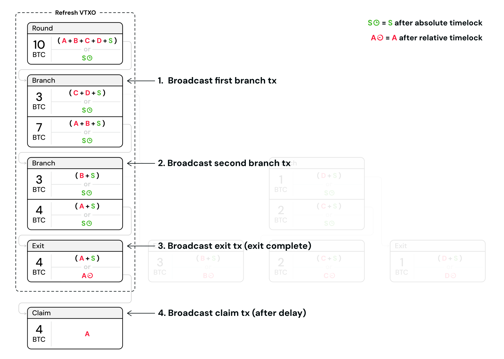

> *作者：Second Docs*
> 
> *来源：<https://docs.second.tech/ark-protocol/exit/>*

## 什么时候需要用到 “单方面退出”？

单方面退出是一种紧急机制，用来保证用户总能保持对自己的比特币的控制，不论服务商操守如何。这种后备手段，是让 Ark 能够实现自主保管属性的根本原因。

在常规情形下，用户只应该使用将比特币从 Ark 实例中移回链上的标准离场流程。标准的离场流程要更加高效，费用也更低。

只有在服务商无响应、拒绝合理的离场请求时，才应该考虑单方面退出。这种情形可以分成三种：

### 1. 恶意行为

这个 Ark 服务商可能在作恶，尝试通过拒绝处理合理的离场请求来扣住（实质上也就是盗窃）用户的比特币。

### 2. 技术困难

这个服务商可能正在经历是他们无法正常运营的技术难题。虽然这些问题可以预期只是暂时的，用户可能依然会感觉危急 —— 他们手上的 VTXO 可能界临过期。

### 3. 法律约束

法律和监管行动可能阻止一个 Ark 服务商处理特定的要求。在这种情况下，这个服务商可能会被法律禁止处理来自特定用户或地区的离场请求。

## 单方面退出的流程

当一名用户或者 TA 的钱包 app 触发一次单方面退出的时候，他们必须广播按顺序一连串的交易（也即构成其 VTXO 的交易）。在队列中排在前面的交易必须先得到确认，然后下一笔交易才能广播，从而，这个多步骤的流程也需要细致的协调。

退出流程可以分成以下三个步骤：

1. **第一笔分支交易**：钱包 app 广播自己的 VTXO 所在交易树上的第一笔分支交易。
2. **等待确认**：一旦确认，钱包广播队列中的下一笔分支交易。
3. **沿分支向下**：上述过程不断重复 —— 总是广播下一笔分支交易、等待确认，然后再广播下一笔分支交易，直到最终到达交易树的叶子。
4. **广播退出交易（叶子）**：广播树上的最后一笔交易，也即 *退出交易*。

一旦退出交易得到广播以及确认，用户的比特币就回到了 “链上”，不会再过期了。不过，要花费这笔比特币依然需要 Ark 钱包中的数据 —— 失去这些数据意味着永远丢失这些已经退出的比特币。

为了让这些比特币可以用标准的备份方法（比如种子词）来花费，用户必须在这笔退出交易的相对时间锁过期之后，再广播一笔 *申领交易*。这个时间锁的倒计时从这笔退出交易得到确认的区块开始，为 Ark 服务商和其他用户留出了应对恶意退出的时间（即恶意用户在[已经签名弃权交易](https://docs.second.tech/ark-protocol/forfeits-connectors/#how-forfeits-work)、或已经花掉自己的 VTXO 之后，依然尝试单方面退出）。

- 案例：完整的退出和领取流程 -

### 自动化的钱包管理

用户不需要手动管理单方面退出流程。设计良好的钱包软件会在触发单方面退出后自动广播整个交易序列。钱包软件会：

- 监视区块链，等待交易确认。
- 在上一笔交易确认之后，自动广播队列中的下一笔交易。
- 追踪区块高度，以确认相对时间锁解锁的时间
- 执行最终的退出交易、完成整个流程。

> **申领交易可能不是自动化的**
>
> 申领流程会不会作为默认单方面退出流程的一部分，取决于各钱包软件的退出条款和设定。

## 单方面退出的代价

执行单方面退出的用户必须为序列中每一笔交易支付区块确认手续费。总的手续费成本取决于用户的刷新型 VTXO 交易树的深度（高度）（而这又是由同一回合中刷新的 VTXO 的数量决定的），加上额度的花费型 VTXO 的链条的长度。

> **单方面退出的经济可行性**
>
> 如果一个 VTXO 中的余额已抵不过广播退出交易所需的链上手续费总额，那么找回这些比特币可能在经济上是不可行的。不过，如下文的 “更早退出 vs. 更晚退出” 章节所解释的，同一回合的其他用户执行退出，可以降低你的退出成本 —— 其他用户广播和确认的交易每多一笔，你需要使之得到确认的交易就少一笔。

## 未完成的退出

退出流程要等到最后一笔退出交易（交易树的叶子）得到广播和区块链确认才算完成。在此之前，这些比特币可以认为依然在 Ark 中 —— 也即 VTXO 依然会根据最初的过期时间而过期、被 Ark 服务商扫走。

这给了单方面退出一定程度的 “可取消性”。比如说，如果一位用户因为自己的 Ark 服务商下线了一段时间而发起退出，但在该用户广播了一些分支交易之后，这个 Ark 服务商又上线了，那他们可以选择放弃发布最后一笔退出交易，从而将这些比特币保留在 Ark 中。

部分完成的退出会增加 Ark 服务商在弃权和过期之后清扫资金的成本 —— 因为回合交易被切分成了几笔价值更小的交易，Ark 服务商必须（为更多笔交易）支付更多的区块确认手续费来回收资金（在没有人发起单方退出的情形下，只需要一笔）。

## 更早发起的退出如何减少更晚退出的成本？

但用户们发起单方面退出的时候，他们的行动会给参与同一回合的其他用户带来好处。这是因为，不同用户的 VTXO 会共享交易树上的分支。当一名用户为了自己退出而广播一笔分支交易的时候，就减少了处于同一分支的其他用户需要广播的交易的数量。在许多用户都需要单方面退出的情形中，那些更早退出的用户，会实质上减少那些更晚退出的人的退出成本。

## 在高费率时期管理退出

当比特币网络的区块确认手续费率显著升高的时候，一个 VTXO 的价值还抵不过退出成本的情形就可能出现。这给 Ark 协议带来重要的考虑。

**服务商**

Ark 服务商不太可能基于退出的经济可行性来监控或约束交易：

- 退出的经济可行性取决于 VTXO 价值意外的多种因素
- 用户有不同的风险容忍和手续费偏好
- 协议应该在经济条件面前保持中立

**用户**

钱包应用应该转而为用户实现合适的安全保护。选项包括：

- 在一个 VTXO 可能要消耗掉自身的一大部分价值才能退出时提醒用户。
- 退出手续费估算工具，帮助用户作出明智的决策。
- 推迟退出、让其他用户先退出（从而降低退出成本）的选项。

（完）