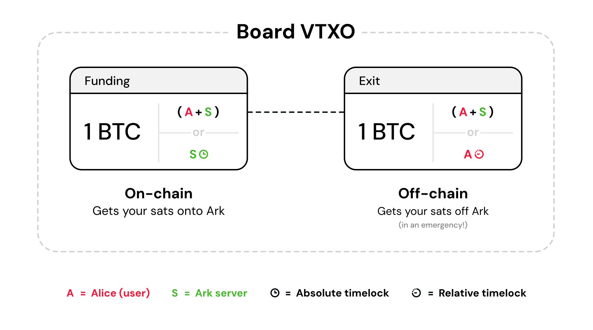

> *作者：Second Docs*
> 
> *来源：<https://docs.second.tech/ark-protocol/vtxo/>*

“VTXO（虚拟交易输出）” 是 Ark 协议的基础模块。VTXO 对 Ark 协议的意义，就像 UTXO 对比特币协议的意义 —— 它是你持有资金的方式，也决定了协议中发起支付的方式。

当你在 Ark 协议中持有比特币时，这些比特币就表示为你的钱包中的一个乃至更多的 VTXO 。当你想给使用同一个 Ark 服务商的另一个人发送比特币时，你花费自己的 VTXO、为接收者创建新的 VTXO —— 也就类似于在比特币协议中，你花费自己的 UTXO，为支付的接收方创建新的 UTXO 。

一个 VTXO 的背后是一连串的尚未得到区块链确认（链下）的预签名交易，由用户持有，本质上是为了给用户提供在必要时创建一个链上 UTXO 的能力。将 VTXO 转化为 UTXO 的操作可以无需任何第三方参与，这就叫 “单方面退出”。这种单方面退出特性是极为重要的，它保证了 Ark 协议的用户总能完全控制自己的比特币。

> **合作式退出 vs. 单方面退出**
>
> 在常规情况下，用户想把自己在某个 Ark 实例中的资金转移出来，可以跟对应的服务商一起执行合作式退出，或发起闪电支付；只需放弃自己的 VTXO（而不像单方面退出那样，需要将一连串交易发送到链上）。这会更加高效，也会更加便宜。

## VTXO 类型概述

Ark 协议中有三种 VTXO：

- **入门型 VTXO**：最简单的类型，是用户将比特币存入一个 Ark 实例时创建的。完全免信任。
- **刷新型 VTXO**：在服务商周期性启动的回合中创建。与入门型 VTXO 一样，是免信任的，但带有更复杂的交易树，以便跟其他用户一起分摊成本。
- **支出型 VTXO**：用户向同一 Ark 实例中的另一用户支付时即时创建的。衍生自入门型 VTXO 或刷新型 VTXO 。此种 VTXO 的单方面退出能力要求信任支付的发送者不会跟服务商勾结（将来源的 VTXO 重复花费）。

每一种 VTXO 类型都使用不同的交易构造，这就产生了不同的信任模式和成本属性。

- 对比入门型 VTXO、刷新型 VTXO 和支出型 VTXO 的构造 -

## VTXO 类型比较

| 侧面             | 入门型 VTXO                     | 刷新型 VTXO                                | 支出型 VTXO                    |
| ---------------- | ------------------------------- | ------------------------------------------ | ------------------------------ |
| **构造**         | 树根 → 叶子（2 笔交易）         | 树根 → 分支 → 叶子（3 笔交易以上）         | 衍生自现有 VTXO（叶子）        |
| **创建时机**     | 随时，需要区块确认              | 仅能在周期性启动的回合种创建               | 随时，即时                     |
| **信任假设**     | 免信任                          | 免信任                                     | 假设支付发送者和服务商不会勾结 |
| **代价**         | 全部交易确认手续费              | 部分交易确认手续费 + 流动性成本            | 微乎其微                       |
| **退出路径深度** | 2 笔交易（树根交易 + 叶子交易） | 3 笔交易以上（树根交易 + 分支交易 + 叶子） | 来源的 VTXO 的退出深度 + 1     |
| **过期时间**     | 大约 30 天                      | 大约 30 天                                 | 沿袭来源 VTXO 的过期时间       |
| **标准使用场景** | 将比特币转入一个 Ark 实例       | 刷新 VTXO                                  | 在 Ark 实例内发送支付          |

## 交易树

所有的 VTXO 都建立在 “交易树” 之上 —— 交易树结构让许多用户能共同容身于一个链上的 UTXO 中，同时保留个人的单方面退出权利。一棵交易树由许多尚未得到区块链确认的预签名交易组成，用户各自保管与自己有关的部分；这些交易用特殊的花费条件连接起来，形成一种 “准-限制条款”。

- 一棵容纳了四个用户的交易树，每一个都拥有自己的余额；但它们都容身于一个链上 UTXO 中 -

树上的交易有三种类型：

- **树根交易**：唯一一笔默认会得到区块确认的交易；一旦该交易得到确认，用户们的 VTXO 就被成功创建出来
- **分支交易**：用户在链下持有的交易，会在用户群间分割树根交易的价值
- **叶子交易**：单笔的退出交易，将比特币发送到用户控制的地址中

## 交易花费路径

交易树上的每一笔交易都强制执行两种互斥的花费路径：

**花费路径 1**：用户（们）与服务商的合作式多签名。树根交易和分支交易使用 n-of-n 的多签名（基于 MuSig2），由共享该分支的用户以及服务商组成，为的是支持用户紧急退出。叶子交易使用  2-of-3 多签名，由一个用户和服务商组成，用于放弃 VTXO 和支付。

**花费路径 2**：基于时间锁的复原机制。树根交易和分支交易使用 CLTV 绝对时间锁（`<过期区块高度> OP_CHECKLOCKTIMEVERIFY`），而叶子交易使用 CSV 相对时间锁（`<144> OP_CHECKSEQUENCEVERIFY`），以供用户单方面退出。

- 树根交易和分支交易输出中的花费条件 -

合作路径支持了常规情形下的 Ark 协议的操作，例如支付、刷新和合作式退出。时间锁路径则用于不同的目的：树根交易和分支交易的时间锁让服务商可以在过期后以最小的链上手续费代价取回比特币，而叶子交易的时间锁则让用户可以单方面兑现自己的 VTXO 。

> **四叉交易树**
>
> **上图锁展示的二叉树只是为了演示**。在实际使用中，虽然概念是一样的，但我们使用四叉树（每一笔分支交易都会分裂出四个输出），因为减少用户必须广播的交易的数量，可以降低用户的单方退出成本。

## 入门型 VTXO

入门型 VTXO 是用户将比特币转移到某个 Ark 实例时创建的，它代表的是最简单的 VTXO 构造。

- 入门型 VTXO 的构造 -

**构造**：最简单的交易树，只有两笔交易。用户的叶子交易直接花费树根交易，完全没有分支交易。

**信任模式**：在创建之后，入门型 VTXO 是完全免信任的。用户可以随时单方面退出，只需广播自己的叶子交易，服务商无法交易阻止，除非用户此前已经签名了弃权交易或者支付交易。

**退出成本**：用户支付让树根交易和叶子交易得到确认的全部链上手续费。

**过期**：默认情况下，入门型 VTXO 使用跟刷新型 VTXO 相同的[过期时间](https://docs.second.tech/ark-protocol/expiries/)（大约 30 天）。不过，理论上，用户可以在创建过程中自定义过期时间，这取决于服务商的服务条款。定制过期时间允许用户为预期的使用模式作出调整 —— 更短的过期时间，可以降低希望立即刷新的收款方的成本。

## 刷新型 VTXO

刷新型 VTXO 是在 Ark 服务商的回合中创建的，在用户不得不刷新过期 VTXO 的时候，或在他们收到支出型 VTXO 后希望获得免信任安全性的时候。回合被预期会每小时发生一次，虽然[这是一个服务商可以自设的参数](https://docs.second.tech/ark-protocol/rounds/)。

- 交易树标记了 Alice 的刷新 VTXO -

**构造**：完整的交易树有多层分支。用户的 VTXO 会跟同一树上的其他用户有重叠（共享分支交易，但不会共享叶子交易），每个用户都必须持有从树根交易到其叶子交易的预签名交易链条，以备自己可以单方面退出。

**信任模式**：与入门型 VTXO 相似，在回合完成后，刷新型 VTXO 就是免信任的。用户可以通过广播交易树与自己有关的部分来单方面退出，服务商无从阻止，除非此前用户已经签名了弃权交易或者支付交易。

**退出成本**：用户需要为每一笔分支交易和叶子交易支付链上手续费。在紧急情况下，如果许多用户同时想退出，那么第一个广播分支交易的用户，将会帮助同一分支上所有其他用户节约要确认的交易的数量。因此，先退出的用户会补贴晚退出的用户。

**过期**：刷新型 VTXO 带有服务商设定的[过期时间](https://docs.second.tech/ark-protocol/expiries/)，预期是大约 30 天。用户无法自己决定这个过期时间，它是由服务商的回合服务条款决定的。

> **用户不需要每一个回合都参与**
>
> 一种常见的误解是，一个 Ark 服务商的所有用户，在该服务商启动的 *每一个* 回合中都要参与。并非如此。用户只会持有自己参与了的回合的刷新型 VTXO 。

## 支出型 VTXO

支出型 VTXO 是在一个用户给同一 Ark 服务商的另一用户支付时即时创建的；这会用到一种叫做 “arkoor（Ark out-of-round）” 的技术。这一机制让资金可以即时转移，无需等待下一个服务商回合。预计，大部分用户收到的第一笔 Ark 资金都会是支出型 VTXO（来自朋友、客户或者交易所）。

- 交易树，标记了 Wendy 的支出型 VTXO -

**构造**：支出型 VTXO 衍生自现有的交易树，做法是添加一个新的叶子交易。支出型 VTXO 的持有者若要单方面退出，必须广播构成原 VTXO 的所有交易，再加上使自己获得资金的支付交易。

**信任模式**：支出型 VTXO 的信任模式[与 statechain 相同](https://bitcoinops.org/en/topics/statechains/)。用户依然可以单方面退出，但必须信任支付发送者和服务商不会串通来重复花费。只要服务商或发送者任何一方是诚实的，支付就是安全的。[此处](https://docs.second.tech/ark-protocol/payments/)有更详细的描述。

**退出成本**：用户必须为完整的退出路径支付链上手续费：来自原 VTXO 树的所有交易（所有的分支交易和原本的叶子交易）加上（构成支付链条的）所有额外的 arkoor 交易。每一笔支付都会延长交易链条，因此会增加总的退出成本。比如说，如果你收到的支出型 VTXO 已经被花过两次了，那么你需要为最初的交易树支付手续费，还要为现有的三笔 arkoor 交易支付手续费。

**过期**：支出型 UTXO 会继承其来源 VTXO 的[过期时间](https://docs.second.tech/ark-protocol/expiries/)。支付不会刷新过期时间，所以，收到 “老旧” VTXO 的接收者必须尽快刷新它，但是，刷新要支付的费用会比较少，因为服务商很快就能回收垫付的[流动性](https://docs.second.tech/ark-protocol/liquidity/)。“簇新” VTXO 的接收者可以等待更长时间，但如果要立即刷新，将需要支付更高的费用。

除了信任模式的差异，支出型 VTXO 与其它类型的 VTXO 一样，都可以作为后续的支付交易和刷新交易的输入，也就是说，可以转化为免信任的刷新型 VTXO、可以发起合作式退出，也可以发起闪电支付。一旦以某种方式花出去了，那么相关的安全性顾虑也就消散了，因为你已经把它交给了 Ark 服务商，换来了可验证的链上比特币，或者闪电支付。

### 支出型 VTXO 的链条

支出型 VTXO 可以串联起来，每一笔连续的花费都会增加退出路径深度。收到一个支出型 VTXO 的用户必须相信：没有任何一个前任发送者会跟服务商勾结。但是，单单发送者是无法单方面重复话费的 —— 需要与服务商勾结。

- 支出型 VTXO（arkoor 交易）的链条 -

> **支出型 VTXO 链条长度顾虑**
>
> 长链条会增加退出成本、积累信任因素。钱包应用的开发者也许可以给用户提供限制支出型 VTXO 链条长度的工具。

### 支出型 VTXO 找零

跟链上的 UTXO 的花费一样，用户可能只需要花费一个 VTXO 的一部分，这就产生了两种新的支付型 UTXO：

1. **支付**：发送给接收方
2. **找零**：返回给发送者

- 在 Ark 协议中花费一个 VTXO 时，找零是怎么出现的 -

支出型 VTXO 找零会继承其来源的信任属性：

- **来自免信任 VTXO 的找零**：来自入门型 VTXO 和刷新型 VTXO 的找零会保持免信任属性，因为用户总不能自己欺诈自己。
- **来自自我控制链条的找零**：如果链条上的每一笔交易都只跟用户自己有关（找零或者左手换右手），那找零也是免信任的，因为链条的源头是用户自己的入门型 VTXO 或者刷新型 VTXO 。
- **第三方链条**：一旦有第三方出现在花费链条中，找零就会继承跟常规的支出型 VTXO 相同的信任要求 —— 必须信任链条上的前任发送者不会跟服务商勾结。

### 涉及多个 VTXO 的大额支付

用户可以同时发送多个 VTXO，以形成一笔更大数额的支付；还可以同时给接收者创建多个输出。这种办法比起在链上创建多个小额 UTXO，有巨大的好处。

首先，两者的缺点不同。在链上创建多个输出，链上手续费会随着输出的数量增加而线性上涨。而在 Ark 协议中，发送的成本是微不足道的；而且对于接收者来说，刷新 VTXO 的成本跟支付的数额和占用的流动性大小有关 —— 跟被刷新的 VTXO 的数量无关。

不过，也不是完全没有缺点：同时发送多个 VTXO 来形成一笔支付，会增加接收者的单方退出成本。如果接收者真的要执行单方退出，就必须为持有的每一个支出型 VTXO 广播额外的交易到链上，所以链上手续费会因此倍增。

## 交易树可扩展性

交易树的规模可以随着用户数量的增加而高效扩大。在一个刷新型 VTXO 的单方退出中，一个用户必须广播的交易数量是一笔叶子交易，加上与自己相关的分支交易（这个数量由交易树的层级，或者说树高，决定）。层级的数量会随着用户数量增加而呈对数上升（`log base 4`）。比如说：

- 4 名用户 = 1 个层级（总共需要 2 笔交易来退出）
- 16 名用户 = 2 个层级（总共需要 3 笔交易来退出）
- 64 名用户 = 3 个层级（总共需要 4 笔交易来退出）
- 256 名用户 = 4 个层级（总共需要 5 笔交易来退出）

这种对数增长意味着，即使用户数量非常庞大，退出交易的数量也依然是可以承受的。

## 用户如何与不同的 VTXO 交互

用户不能直接选择自己要用的 VTXO 类型 —— VTXO 类型是由他们的行为和环境决定的：

- **支出型 VTXO** 是某人在同一 Ark 实例中给你发送支付时，你收到的。大部分初次尝试 Ark 的用户，都是收到来自朋友、客户或者交易所的支出型 VTXO 。
- **刷新型 VTXO** 是用户在参加服务商回合时创建的，无论是通过刷新即将过期的 VTXO，还是将支出型 VTXO 转化为免信任形式。
- **入门型 VTXO** 是用户希望将链上比特币转移进入某 Ark 实例时创建的。大部分普通用户都不需要创建入门型 VTXO 。

随着时间推移，用户会基于自己的使用模式，在支出型 VTXO 和刷新型 VTXO 之间不断切换。而在[过期时间](https://docs.second.tech/ark-protocol/expiries/)（大约 30 天）之后，所有用户都必须持有刷新型 VTXO，因为过期的 VTXO 不能再花费。

## 用户要支付的 VTXO 费用

虽然每一种 VTXO 都有不同的费用构成，但向用户收取的手续费也许不会直接反映这些成本。服务商可能会选择抽象掉某些手续费，或者给用户补贴，作为商业模式的一部分。Second 的 Ark 服务商的手续费方案还在开发中，不过你可以通过我们的 “[手续费](https://docs.second.tech/ark-protocol/fees/)” 页面了解更多。

