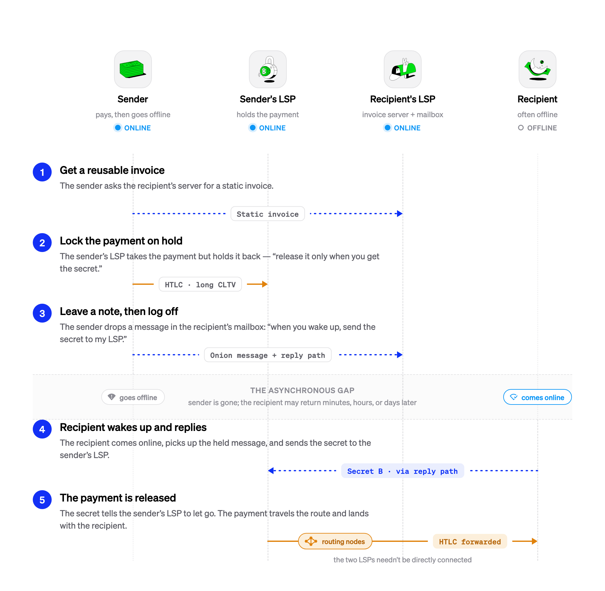

> *作者：Valentine Wallace, Conor Okus*
> 
> *来源：<https://lightningdevkit.org/blog/async-payments-receiving-while-offline>*

LDK（闪电网络开发工具）项目提供了打造闪电网络节点的工具。而在闪电网络上，现实是，完成支付需要一定程度的协作：要结算一笔支付，支付方和收款方需要大致同一时间在线。BOLT11 发票通过要求收款方给支付方交付新的互动数据，部分解决了这个问题，因为这就假设了收款方是在线的，并且其设备在收取支付的时刻是解锁的。

这种假设使得人们想用闪电网络来实现的一种极为常见的事情无法实现：在手机上收取打赏或者支付，并且不需要打开闪电 app 并让它常驻前台。新式的移动操作系统让问题更加复杂。不论是 Android 系统还是 iOS 系统，应用一般是无法确保有足够的 CPU 时间来响应一条推送通知的，除非它归属于一类特权应用（比如网络电话（VoIP））。因此，现实中，一个移动端闪电节点通常无法唤醒来处理一个入账 HTLC 。

本文介绍了异步支付协议；LDK 实现了它，以让一个常常离线的节点可以收取支付，并且无需信任第三方来托管资金，而且，不会使用长期得不到解决的 HTLC 来占用网络的流动性。

> **声明**
>
> 异步支付依然在积极开发中，还不推荐用于生产场景。支付者这一端的部分流程还没有被合并，并且整个流程当前在只能在 LDK 节点之间完成。这份[实现指南](https://lightningdevkit.org/async-payments)公布了最新的状态。

## 现有的方法及其局限性

在异步支付协议发明之前，多种技术都在离线收款上取得了一部分进展。每一种在自身的语境下都是有用的，但没有哪一种完全解决了问题：

- **托管服务**。收款方将资金的保管委托给永远在线的第三方。这也是能用的，但重新进入了闪电网络所希望消除的信任因素和对手方风险。
- **远端签名（例如 Blockstream Greenlight）**。密钥可以放在收款方的设备上，而更重的节点基础设施则运行在别的地方。这种方法降低了设备的资源用量，但没有改变在线要求：设备依然需要可以触达，同时在线的要求跟全节点没有区别。
- **志愿支付（keysend/AMP）**。这种办法非常适合打赏，但只覆盖了支付者一端。如果收款方是离线的，那么当支付抵达最近一跳时，承载支付的 HTLC 就会超时，立即回传失败。使用非常长的 CLTV（绝对时间锁）可以保持 HTLC 的活性，但这样就绑定了整条转发路径的流动性，这对于网络上的其他参与者具有严重的负面影响，而且，当转发策略收紧的时候，可能会失败。
- **LNURL**。这是一种方便的办法，可以（让支付方）从收款方的一个受信任服务商处获取发票，但讲到收取支付，依然要求收款方在线，除非有一个收款方完全信任的服务商，可以立即收取支付，稍后再转发给收款方。再 2026 年，运营此类转发服务的合规要求显著增加，因此它在越来越多司法辖区无法运行。
- **利用通知打开 app**。一个不需要信任的服务商可以发送一条推送通知，提示收款方打开 app 并领取支付。这是今天最常见的权宜之计，也确实有用。它的缺点，上文已经说到，是操作系统的动作：app 通常无法运行代码来响应通知，所以整个模式就降级成了 “要求用户马上打开应用”，这是糟糕的用户体验，也不可靠。

异步支付希望既能移除信任因素，又不需要锁定网络中的流动性。

## 异步支付工作原理

异步支付协议加入了 “LSP（闪电网络服务商）” 的概念，这种服务商同时也会作为一个静态发票服务商，代表常常离线的收款方。这种服务商会交付可以复用的发票，故意省略了支付哈希值。省略支付哈希值是一种安全措施：防止服务商重复交付相同的发票，然后在知晓原像之后就冒领第二笔支付。

支付按如下流程处理：

1. **支付方获取静态发票**。支付方从收款方的发票服务端请求一个静态的发票。发票中缺少支付哈希值，表明收款方w位于 LSP 之后，并且常常离线，从而支付方知道应该使用异步支付流程。
2. **支付方在自己的 LSP 处锁定 HTLC**。支付方发送一个带有很长 CLTC 超时时间的 HTLC 给自己的 LSP，而且带有这样的指令：“当你收到一条包含这个秘密值的洋葱消息，就释放这个 HTLC；在此之前，请先扣住它。” 支付方的 LSP 会接受这个 HTLC ，但不会转发它。在这里，很长的 CLTV 超时时间也是可以接受的，因为这是支付方自己的资金；只是支付方决定先拨付自己的余额，没有其他人受到影响。总是在线的支付方可以跳过这一步。
3. **支付方通知收款方**。支付方传送一条洋葱消息给收款方：“当你下次上线的时候，使用这里说明的回复路径，发送这个秘密值给我的 LSP”。收款方的 LSP 会保留这条消息，直到收款方重新上线。完成这一步，支付方就可以安全地下线了。
4. **收款方回到线上并回复**。当收款方重新上线，其 LSP 会交付保留的洋葱消息。收款方根据回复路径，发送秘密值给支付方的 LSP 。
5. **HTLC 释放**。收到秘密值之后，支付方的 LSP 转发最初的 HTLC ，它会经过转发，由收款方收取。

-异步支付如何从发送者通过 LSP 发送给常常离线的接收者-

这套设计有几个好的地方。首先，网络中不会有资金被锁定一段时间，除了最初的发送者的，但这是 TA 主动的。其次，流程中没有任何一方可以拿着钱跑路，并且道理上无法说成是一个托管商。并且，支付方无需向收款方揭晓自己的身份，甚至不需要告诉收款方自己用的是哪个 LSP 。

如果（当收款方回到线上的时候）支付方最初选定的转发路径已经过时了，支付方的 LSP 可以代替支付方找出一条新的路径（使用蹦床路由），所以支付方可以放心在第 2 步锁定 HTLC 。

### 设计注释

- **支付证据**。省略了支付哈希值，意味着那个静态的发票没有提供有用的支付证据保证。预计接下来要实现 PTLC（点时间锁合约）：支付方添加一个随机的 nonce * G 到用来支付的 PTLC 中，然后将对应的随机 nonce 值发送给收款方。这样一来，只有支付方和发票服务端勾结才能盗窃资金；如果支付方有意愿把钱交给发票服务端，大可直接这样做，不必费这功夫。
- **过时路径**。如果支付方在锁定 HTLC 时用到的路径在收款方回到线上时已经走不通，支付方的 LSP 可以找一条新的路径。这是让步骤 2 可以立即执行、不必等待收款方的关键。
- **如果收款方一直没有回到线上**。协议的动作将跟今天的普通闪电支付一样。只要转发路径上的任何节点离线足够长时间，长到这笔支付抵达过期时间，那么这个 HTLC 就会失败，回传给发送者。

## 集成到你的应用

只要你的节点配置了适当的角色，LDK 就会为你透明底处理异步 offer 机制，不论它是永续在线的成员，还是常常离线的发送者或接收者，又或是永续在线的 LSP 和帮助离线收款方的静态发票服务商。想获得逐步配置指南，请看 [Async Payments guide](https://lightningdevkit.org/async-payments) 。

（完）

