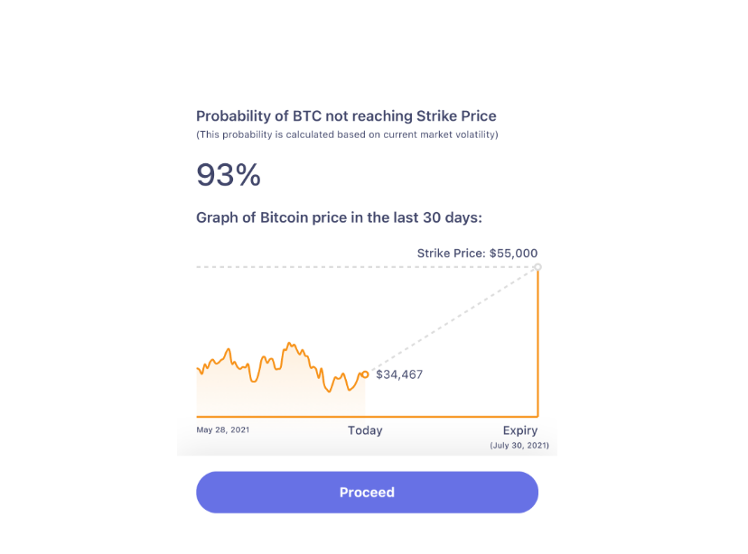

> *作者：Craig Warmke*
> 
> *来源：<https://atomic.finance/blog/atomic-yield/>*

## I. 无需托管的比特币利息

迄今为止，比特币的持币者主要有两种方法可以用比特币来获得收益：

- 将比特币出借给中心化的 “比特币银行”（例如，：lockfi、Celsius）
- “封装” 比特币以获得其它区块链上的收益机会（例如：通过 WBTC 在以太坊区块链上出借并获得利息）

尽管它们不乏热度，但对比特币持币者来说都没有很强的吸引力。而且这并不是没有理由的。比特币银行掌管着私钥，所以用户要承担它们破产的风险，以及放弃自我主权。封装比特币的服务，比如以太坊上的 WBTC，在幕后也一样扮演着比特币银行的角色。封装的比特币由中心化的托管商持有，用户获得的是以太坊上的 WBTC token。使用 WBTC 还需承担智能合约风险。

Atomic.Finance 提供了另一种方法，帮助用户用比特币赚取**比特币收益**，并且无需把你的比特币交给某个第三方。感谢 Thaddeus Dryja 在 2017 年提出的 “谨慎日志合约（Discreet Log Contracts）” 最近的突破，非托管的利息已不再是空中楼阁。谨慎日志合约（DLC）将比特币的安全性与更灵活的智能合约搭配在一起，使得金融衍生品（比如看涨和看跌期权）成为可能。有担保看涨期权（covered call）是一种传统的看涨期权策略，可以用你拥有的一项资产来获得收入。通过将有担保看涨期权编码为一个 DLC，你可以用自己的比特币赚取收入，并且无需信任第三方来托管你的比特币。

- 编码成 DLC 的有担保看涨期权提供了透明性和自我主权 -

我们会先概要地解释主要的想法，将复杂的部分留给这个系列剩余的文章。Part 2 会更深入地解释有担保看涨期权，而 Part-3 会专门讲解 DLC（[中文译本](https://www.btcstudy.org/2022/03/09/a-laypersons-guide-to-discreet-log-contracts/)）。

我们会努力让我们的产品和背后的商业模式做到完全透明。所以，本文中我们准备解释两件事。第一，你如何利用有担保期权和 DLC 的力量，使用比特币赚取收益的同时不必托管给第三方。第二，从帮助你赚取比特币利息这件事情中，Atomic.Finance 可以得到什么。

## II. 比特币有担保看涨期权

我们可以将许多金融合约编码成 DLC，包括有担保看涨期权。

有担保看涨期权是一种简单高效的期权策略，可评级一项资产来赚取收益。在持有一项资产的同时，卖出一个对该项资产的有担保看涨期权，那个期权费就成了你的收益。

不过，健全金融（Sound Finance）里面没有免费的午餐。

从有担保期权策略中获得的收益也是有代价的 —— 你可能无缘从比特币的涨幅中受益。如果比特币的市场价格超过了一个预定的价格（也即你为自己的期权合约选定的 *目标价格*），你将不得不卖出自己的比特币。

- 有担保看涨期权的案例 -

正因为这个原因，你应该谨慎配置有担保看涨期权。年化收益率（APY）越高，你被强制卖出一些比特币的几率就越高。这需要权衡。另外，我们也在努力优化产品，让用户可以更低风险地参与有担保看涨期权、更容易做出决策 —— 哪怕是在牛市中（敬请留意我们的消息！）。

我们来看一个案例。

### 案例合约

假设当前比特币与美元的汇率是 50000。你卖出了一份有担保的看涨期权，标的数量是 1 BTC，期权到期日是两周后，目标汇率是 75000 美元。

只要两周后比特币的汇率低于 75000 美元，你就不必卖出比特币，外加赚到了期权费。但是，如果市场价格超过了 75000 美元，你就只能留下等价于 75000 美元的比特币，加上你的期权费。所以，有担保期权的卖方是卖出了比特币上涨的潜在收益，换来了期权费。这张表演示了相应的结果。

- 以 75000 为目标价格的有担保看涨期权的可能结果 -

上面列了 6 种结果，但并非每种结果出现的概率都一样大。为了帮助你根据自己愿意承担的风险水平选出一个目标价格，我们在 app 中的每一个目标价格后面都列出了相关的概率。这个概率是市场价格低于该目标价格的可能性。

- 到期的市场价格低于目标价格的概率 -

### 比特币有担保看涨期权的优点和缺点

好的一面是，不管怎么说，在你真的想在某个价格卖出比特币的时候，有担保的看涨期权是一种特别好的做法。这时候你可以一直用比特币赚取收益，直到比特币的市场价格到达你的理想价位。如果你认为比特币在一段时间内不太可能出现一个特别高的涨幅，那么有担保看涨期权也是非常好的选择。但你要记住，就像其它任何形式的资本收益一样，你的收益可能需要纳税。

而不好的一面是，卖出有担保看涨期权将无法获得高于目标价格的涨幅所能带来的收益。而且，到期的市场价格越是高于你的目标价格，你在合约结算后留下来的比特币就越少。这就是 *价格风险*。在本系列的 Part 2 中，我们会更详细地说明这种风险。

此外，还有一种好处。来自比特币银行的收益伴随着对手方风险，通常来说是不透明的，无法分析的。但把有担保的比特币看涨期权编码成 DLC，你就能获得完全的透明性，而且无需将比特币托管给别人。相反，你承担价格风险，而这是透明的、可验证的。

下一步，我们要讲讲我们是如何把比特币有担保看涨期权编码成 DLC 的。

## III. 有担保看涨期权 DCL 带来的比特币去中心化金融

DLC 是 MIT Digital Currency Initiative 的 Thaddeus (Tadge) Dryja（他同时也是闪电网络初版白皮书的联合作者）在 2017 年[提出](https://adiabat.github.io/dlc.pdf)的概念。自那以后，Surebits 和 Crypto Garage 的团队就开始贡献精力到优化 DLC 中。DLC 给比特币带来了智能合约功能，打开了一个新的应用世界的大门。

Atomic.Finance 结合了 DLC 和有担保看涨期权，让用户无需托管即可获得比特币利息。谢谢你，Tadge。

- DLC 论文：Atomic.Finance 谱系的一个关键神迹 -

我们让用户可以在一个公开的消息频道中发布要价，而做市商则使用 DLC 协议来回复。Atomic 在其中对做市商上支付的每笔期权费收取 10~15% 的手续费。这就是我们的商业模式。

实操上，你只需打开 Atomic app 然后看 —— 注意这只是一个例子 —— 一份目标价格为 75000 美元、两周后到期的比特币有担保看涨期权的年化收益率为 4%。所以你的比特币能在两周后获得大约 0.154% 的收益率。

为了达成这份看涨期权的交易，你首先要把比特币发送到你的 Atomic app 可控制的非托管钱包中。然后，你选择相应的看涨期权，它会向做市商公开你的要价。如果他们接受了，你的有担保看涨期权就在幕后创建好了。

从创建到执行，DLC 可分为三个步骤：

1. 期权费（你的收益）和担保品（你的比特币）锁入一个多签名合约中。
2. 在账本以外，我们为这份有担保看涨期权的所有可能结果构造交易。
3. 一个断言机会在到期时发布比特币价格，解密并验证可以结算这份合同的那笔交易。

我们会在 Part 3 中解释它的工作原理。

在这个过程中，你的私钥和个人信息都不会泄露。我们也指出，这不像以太坊和其它将整个智能合约都放在账本中的网络，DLC 让用户可以将绝大部分智能合约都放在账本外面。整体上来说，这就极大地限制了链上的足迹。

除了有担保的期权合约的价格风险，编码合约的 DLC 还依赖于断言机的可靠性。我们会在本系列的 Part-3 中审核断言机风险、缓解方案（包括使用多个但演技）以及激励机制。

## IV. 结语

Atomic.Finance 团队正通过在健全货币上开发健全金融，为比特币的 DeFi 开启一条新路线 —— 健全金融意味着它是 *透明的、可验证的，并且用户在使用比特币投入金融的同时依然保持着自我主权以及完全的控制*。你可以在《[健全金融宣言](https://atomic.finance/blog/a-sound-finance-manifesto/)》中了解我们的使命感。

让比特币的持有者可以使用自己的比特币产生收益，并且无需放弃托管 —— 通过将有担保的看涨期权编码成 DLC —— 这只是我们实现我们的愿景 —— 开发一个健全金融工具的生态系统 —— 的第一步。

在 [Part 2](https://atomic.finance/blog/bitcoin-covered-calls) 中，我们会深入比特币有担保看涨期权。我们会解释它是怎么工作的、一些可能的策略，以及它们的取舍。

**更多关于 DLC 的内容**：

- Thaddeus Dryja (2017) [白皮书](https://adiabat.github.io/dlc.pdf)
- Thaddeus Dryja (2020) [Labitconf 演讲](https://www.youtube.com/watch?v=pvNaxJiXT5E)
- Suredbits [系列博客](https://suredbits.com/dlc-private-key-management-part-1/)
- Nadav Kohen, [Stephan Livera 访谈](https://stephanlivera.com/episode/219/)

**更多关于有担保看涨期权的内容**：

- Lyn Alden 论[有担保看涨期权](https://www.lynalden.com/covered-calls/)
- Dan Held 讲解[比特币被动收入策略](https://www.danheld.com/blog/2020/9/17/howtoearnayieldonbitcoin)
- Investopedia 词条：[有担保看涨期权](https://www.investopedia.com/articles/optioninvestor/08/covered-call.asp)