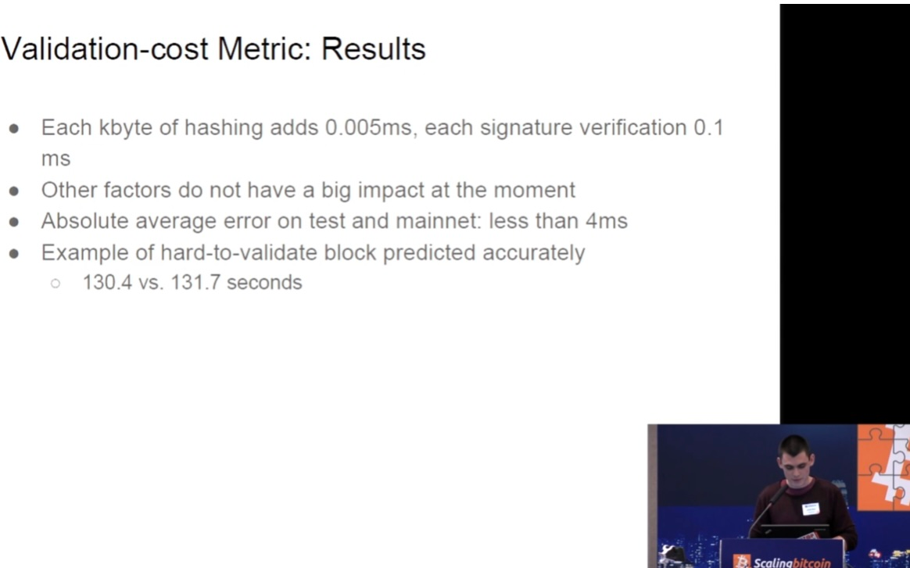
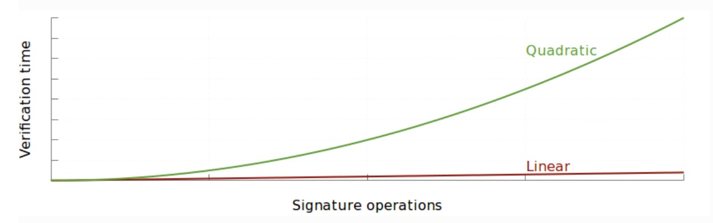
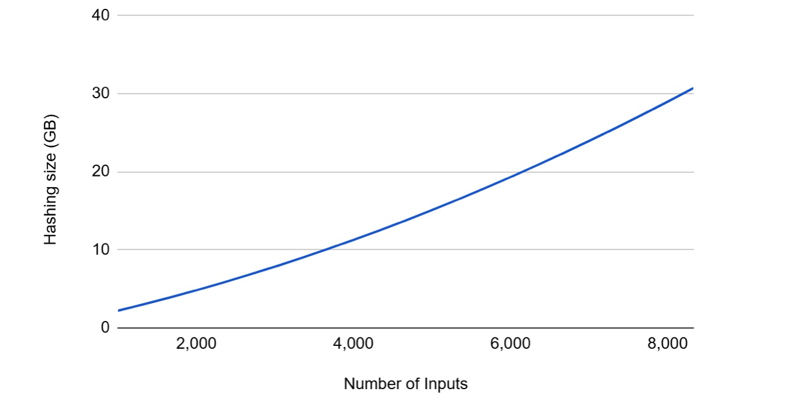
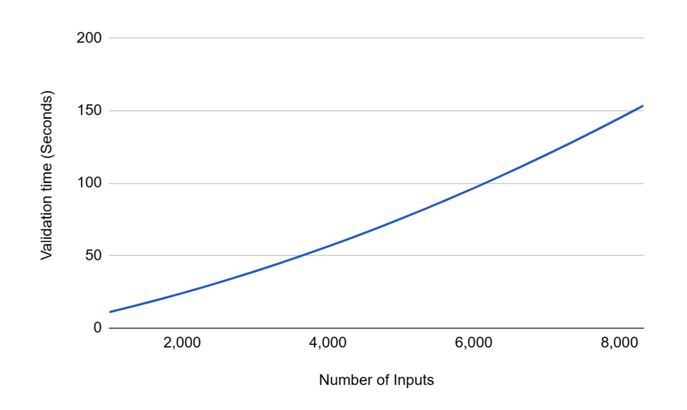

> *作者：BitMEX Research*
> 
> *来源：<https://www.bitmex.com/blog/attack-blocks>*


**摘要：**在这篇文章中，我们要讨论 “繁难区块” —— 专门构造得难以验证的区块。如果有人对比特币怀有敌意、制作出 “繁难交易”（专门设计成让节点需要很长时间来验证的交易），就会形成这样的区块。这个概念最早得到讨论是在 2013 年 1 月，当时出现了一笔繁难交易，其体积接近 1MB ，一台普通的计算机需要大约 3 分钟来验证。这种攻击还有一些变体，可能会让情况恶化几个量级，但本文不会详细讨论。BIP-54 软分叉提议包含了一项修复措施：限制一笔交易的非隔离见证输入可以使用的 CHECKSIG 和 CHECKMULTISIG 操作码的总数量。

## 概述

本文是关于 BIP-54 可修复或可缓解的比特币潜在漏洞的系列文章的第四篇:

1. [Bitcoin's Duplicate Transactions - March 2025](https://www.bitmex.com/blog/bitcoins-duplicate-transactions)（[中文译本](https://www.btcstudy.org/2025/06/18/bitcoins-duplicate-transactions/)）
2. [The Timewarp Attack - March 2025](https://www.bitmex.com/blog/the-timewarp-attack)（[中文译本](https://www.btcstudy.org/2025/06/11/the-timewarp-attack-by-bitmex-research/)）
3. [64 Byte Transactions - December 2025](https://www.bitmex.com/blog/64-Byte-Transactions)（[中文译本](https://www.btcstudy.org/2025/12/31/sixty-four-byte-bitcoin-transactions-by-bitmex-research/)）

在这最后一篇文章中，我们要了解最严重的潜在漏洞之一：出现恶意区块的可能性；它可能会让一个节点花费极长的时间来验证。这个问题也常常被称为 “最坏情况下的区块验证问题”。

## 问题渊源

在 2013 年 1 月，比特币安全研究员 Sergio Lerner 在 Bitcointalk 论坛上发了一个[帖子](https://bitcointalk.org/index.php?topic=140078)，解释称可以构造出一笔有效的比特币交易，让一个节点要花费至少 3 分钟来验证。办法就是创建一个使用许多输入的交易（考虑到历史时间，当然是隔离见证以前的脚本类型）。这些输入带有所谓的 “SIGHASH 操作平方膨胀” 问题。

Sergio 解释说，一笔自身体积贴近 1MB 的比特币交易，可以产生出超过 19GB 的需要哈希的数据，对于一台普通的计算机，至少需要 3 分钟来验证。限制了这个问题的严重性的，是 1MB 的区块体积上限，如果没有这个限制，攻击可以更加严重。在 Sergio 提供的例子中，这笔交易是无效的，但这种攻击依然算是致命的，因为它让一个节点需要花很长时间才能断定一笔交易是有效的还是无效的。除此之外，花 3 分钟才能验证仅仅一笔交易，显然是一个严重的问题。我们在下表中列出了这可能带来的一些问题。
 
**繁难交易可能造成的负面后果**

| **场景** | **描述** |
| --- | --- |
| DoS 攻击 | 对比特币怀有敌意的人可以制作出这样的繁难交易。这算是一个致命的 DoS 漏洞，可以同时影响矿工和节点运营者。在繁难区块验证期间，商家和交易所可能必须手动关闭验证。节点运营者可能对问题一无所知，只能不断重启节点又不断被卡住。可能这时候节点运营者就放弃了，直接下线。 |
| 打击矿工 | 3 分钟已经是目标出块时间的 30% 。一个恶意的矿工可以制作出这样很难验证的区块，当其他矿工正忙着验证它的时候，自己就立即开挖下一个区块。一个敌意矿工甚至可以制作出一长串的繁难区块、阻碍其他矿工，然后垄断区块生产。 |
| 增加初始化区块同步（IBD）时间 | 一旦被区块确认，难以验证的交易会永远留在区块链上，增加节点完成初始化区块同步的时间。多次出现这种繁难交易可以显著拖慢 IBD 速度、增加节点运营成本。 |

## 区块体积战争

繁难区块问题也出现在了 “区块体积大战（Blocksize War）” 中（从 2015 年持续到 2017 年），作为不要提高区块体积限制的理由；至少，不能不添加新的限制来约束这个问题的影响。

2015 年 12 月, 比特币安全研究员 Jonas Nick 在香港的 “Scaling II” 大会上作了一次演讲，正是关于这个主题。他解释了为什么不应该提高区块体积限制，除非对比特币区块添加一种新的资源使用量限制来缓解这种攻击的影响。



<p style="text-align:center">- 图片来源：<a href="https://youtu.be/vfIs_trEhao?si=oRu2x6CfWhFbxG2R&t=3692">https://youtu.be/vfIs\_trEhao?si=oRu2x6CfWhFbxG2R&t=3692</a> -</p>


2016 年 1 月，Bitcoin Core 项目网站上出现了一篇博客，解释了 “隔离见证（SegWit）” 的优点。隔离见证的一个关键优点是，修复了 SIGHASH 操作非线性膨胀的 bug 。这就是何以隔离见证看起来是比特币扩容问题的一个强有力解决方案：它为旧形式的（可能有问题的）交易保持了 1MB 的体积限制，同时，为没有这个致命漏洞的交易形式提高了区块体积。



> 本质上，倍增一笔交易的体积，可以既让签名操作的数量倍增，又让为了验证每一个签名而需要哈希的数据的数量倍增。这已经可以在非实验环境中观察到：普通的单个区块只需 25 秒就能验证，而恶意制作的交易需要超过 3 分钟来验证。
>
> —— 《[Segregated Witness Benefits](https://bitcoincore.org/en/2016/01/26/segwit-benefits/)》（[中文译本](https://www.btcstudy.org/2022/10/07/segregated-witness-benefits/)）

2021 年 3 月，我们出版了一本关于区块体积战争的书，其中也讨论了最坏情况区块验证问题。我们提到，这样的区块可能要花 “几个小时” 来验证 —— 这跟 2013 年到 2016 年期间流行的说法 “3 分钟” 差异很大。这是因为，一些比特币安全研究者向我们提出，他们已经找出了最大限度利用这种攻击的办法，因此可以让情况又恶化许多，因此需要几个小时来验证。不过另一方面，也许我们的 “几个小时” 的说法也有一点不现实，除非你在使用相当低配置的设备（比如树莓派）。

> SIGHASH 操作的非线性膨胀意味着，随着一笔交易所用的输入个数增加，验证这笔交易所需的哈希操作数量会呈平方级增加，而非线性增加。这个膨胀问题是提高区块体积限制的障碍，因为（解除体积限制之后）攻击者可以制作出需要花很长时间来验证的交易、长到让整个网络陷入停滞。甚至攻击者可以构造出一个包含许多这样的大型交易的区块，让普通计算机需要花好几个小时来验证。因此，对于许多小区块主义者而言，修复这个问题是上调区块体积限制的前提条件。他们嘲讽大区块主义者因为没注意到这个弱点而扬扬自得，而且缺乏对抗性思维。
> 
> —— 《区块体积大战》

## 恶意区块的算术

在这一节中，我们准备更细致地解释这种攻击。在攻击者准备繁难区块时，他们需要考虑三种比特币共识限制：

| **规则** | **限制** | **规则激活时间** |
| --- | --- | --- |
| 区块体积限制（非见证数据） | 1MB | 2010 年 9 月 |
| 脚本体积限制 | 10KB | 2010 年 8 月 |
| 单脚本的操作码数量限制 | 201 | 2010 年 8 月 |

出于演算的目的，我们解释的是这种攻击的最基础形式，甚至比 Sergio 在 2013 年列举的还要简单，当然也是过度简化的。思路是，攻击者首先要构造出一些启动交易，可以假设是放在另一个区块中，以避免占用真正触发攻击的区块的 1MB 空间。在这些启动交易中，攻击者创建许多输出，每个输出都包含 200 个 `OP_CHECKSIG` 操作码。有了这些输出之后，攻击者就准备好制作真正的攻击交易了。这笔攻击交易将所有这些输出用作输入，（在我们的场景中）还可以留一个输出给自己。每个输入都包含一个有意义的 CHECKSIG 和 200 个无意义的 CHECKSIG（填满 10KB 的单脚本可用空间）。这就用尽了所有可用的空间，因此最大程度上释放了这种攻击的威力。

给定这样的攻击交易，我们使用下面的非常基础的近似公式，来计算验证攻击交易时我们需要哈希的数据总量。请注意，在下面的公式中我们包含了一个输入数量的平方项，以反映 SIGHASH 操作平方膨胀 bug ：输入越多，需要哈希的数据就越多，并且是平方关系。

```
总共需要哈希的数据（KB） = 201 * N * (10KB + N)
其中 N 为交易输入的数量
```

使用上述公式，我们画出了下图，它反映了需要哈希的数据的数量如何取决于攻击交易中的输入的数量。可以从这条曲线的形状看出一个平方函数。上述公式是不精确的，并不能精确地统计需要哈希的数量，它的用意只是演示：非常粗糙地表明这个膨胀问题以及其中的数学关系。

**需要哈希的数据数量 vs. 交易输入的数量**



这个表的横轴停在了略多于 8000 个输入的地方，这是因为，此时交易的体积已经接近 1MB 了，这是隔离见证以前的交易可以使用的最大空间。为了验证这笔交易，节点需要哈希超过 30GB 的数据。这就是一笔攻击交易，在我们这个非常基础的案例（可能也是不准确的案例）中，可以造成的最坏情况。我们的理解是，需要哈希的数据的数量（而非 ECDSA 签名的验证次数）才是衡量这种繁难交易的危险性的关键指标，因此我们只关注这个指标。

哈希每 1 KB 需要 0.005 ms（毫秒）时间 —— 这是 Jonas Nick 在 2015 年的演讲中提到的数据，他的笔记本电脑是 2014 年生产的（使用双核 3GHz 的 i7 CPU）。下图展示了这些攻击交易可能需要多长时间来验证。在最坏情况下，需要超过 150 秒来验证一笔交易，也就是超过两分半钟。这显然是一个致命的漏洞。在我们[最近出版的一份报告](https://www.bitmex.com/blog/ordinals-impact-on-node-runners)中（[中文译本](https://www.btcstudy.org/2025/11/25/rdinals-impact-on-node-runners-by-bitmex-research/)），关于节点的性能，我们的节点通常 1 秒能验证 15 个区块。因此，（相比常规区块）这种繁难区块会大大拖慢验证速度，大约 2300 倍。

**验证攻击交易所花的时间 vs. 攻击交易的输入的数量**



不过，现在的设备比 2015 年的快得多了，而且输入可以并行验证。因此，上面这个验证时间图，对于今天的设备来说可能有一些保守了。

（译者注：比特币网络上的节点并不全都使用最新的设备，也许一部分节点的计算能力就相当于 2015 年的 i7 双核 CPU。）

## BIP-54 修复措施

BIP-54 所提出的修复措施是比较简单的：对单笔交易增加新的共识限制来约束下列因素的数量：

1. 所有非隔离见证输入中的 CHECKSIG 和 CHECKMULTISIG 操作码
2. 前序输出的脚本公钥

如果一笔交易的上述两项之和超过 2500，就会被当成无效交易。

有了这些修复措施之后，在我们上文描述的场景中，一笔攻击交易将只能包含 12 个输入，一个区块只能造成 24MB 需要哈希的数据，只需要 0.1 秒就能验证。问题看起来是很好地解决了，至少在我们这个非常基础的案例中是这样。

## 结论

再次强调，我们的计算和案例都是非常基础的，绝对简化过头了。还有一些聪明的技巧，可以让攻击更加严峻（准确来说是大上几一个量级）。比如说，可以添加使用长脚本的输出，使进一步增加需要哈希的数据数量。在这些极端情形中，繁难区块可能演变成比特币网络的危机，因为光这一个区块就要超过 1 个小时来验证，很大一部分节点可能暂时离线甚至不再回来。

不过，幸运的是，这种攻击实施起来是非常复杂的。首先，攻击需要发送一些非标准的交易，很可能只有矿工才能发起攻击。即使使用直接向矿工提交交易的服务（例如 Matathon 的 Slipstream），矿工可能也会有一些内置的安全逻辑、不会干坐在那里花费几个小时来验证这笔提交过来的交易。其次，这些最坏情形涉及多笔复杂的启动交易，在繁难区块生产出来之前，就要占据许多区块的空间。如果攻击者不是那么谨慎的话，很可能观察比特币网络的人就能监测到这些启动交易，然后提醒用户需要紧急软分叉，也许这可以防止攻击（当然，也许不能）。因此，这个漏洞，从这个角度看，与 “时间扭曲攻击” 有相似之处。

不过，虽然攻击有其复杂性，在我们看来，这是比特币的一个非常严重的问题，需要修复。它可能是 BIP-54 意图修复的四个问题中最严重的一个。根据严重性从高到低，我们将这四个问题排名如下：

1. 繁难区块
2. 时间扭曲攻击
3. 64 交易交易
4. 重合交易

（完）