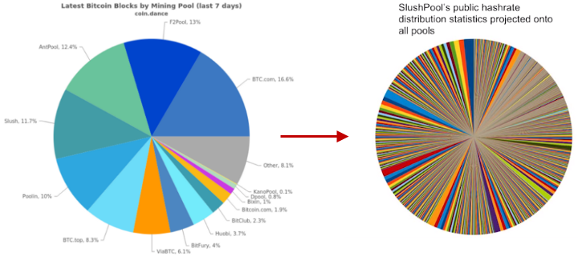
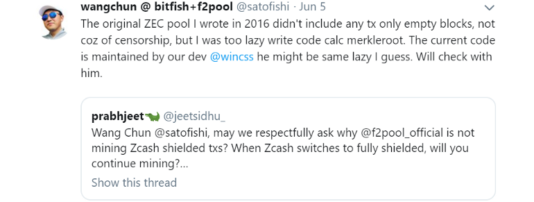
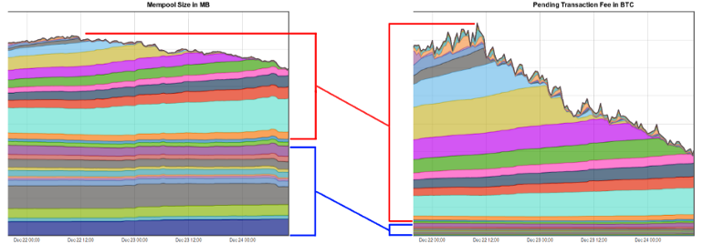
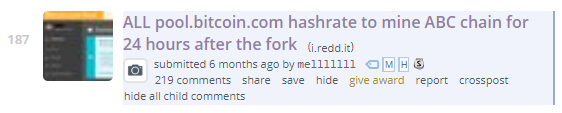
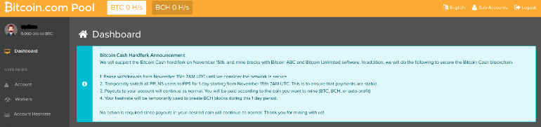
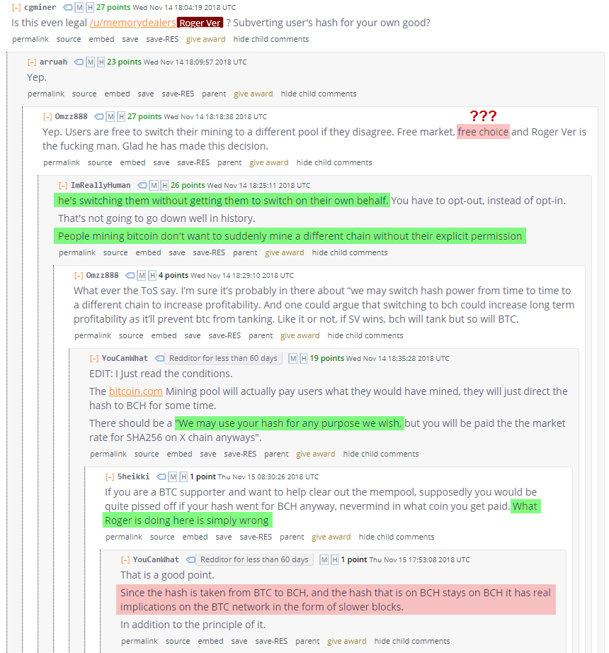
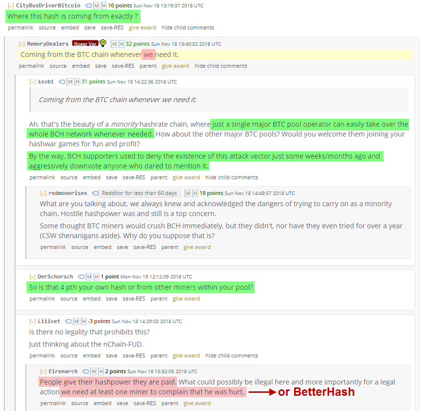
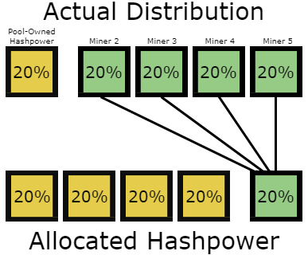
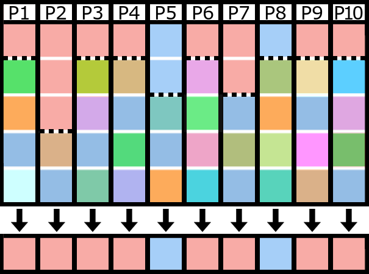
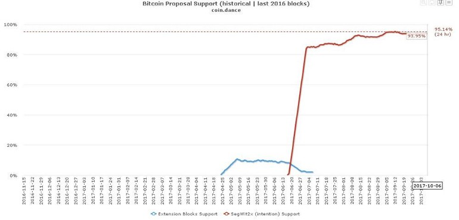

> *作者：StopAndDecrypt*
>
> *来源：<https://medium.com/hackernoon/betterhash-decentralizing-bitcoin-mining-with-new-hashing-protocols-291de178e3e0>*
>
> *原文出版于 2019 年。*

## 引言

BetterHash 是正在开发的一个另类挖矿协议的暂用名。在它完成之后，需要有足够多的矿工乐意切换到使用这套协议的新矿池，或者现有的矿池愿意同时服务使用新协议和老协议的用户、并且矿工会逐渐迁移。无论是哪一种情况，最初的切换都需要得到足够多的矿工的支持，切换才会有利可图，不然收益的波动率会太高。最终，矿工要理解为什么需要切换，也需要有远见的矿池运营者来 *放弃* 矿池当前具有的控制力。这就需要大家充分了解当前的系统具有的问题和风险。

*声明：这不是一种分叉，不需要变更共识规则。*

## 当前的比特币挖矿模式有什么问题？

当前的比特币挖矿存在 “委托-代理” 问题。比特币挖矿的 *矿池* 并不是比特币的 *矿工*，而矿池总是越界指导着矿工的挖矿。矿池运行节点、构造区块、选择区块要打包什么交易，还可以选择矿工的算力要跟随哪条分叉。这种模式产生了许多激励问题，也产生了一些非常糟糕的政治杠杆。BetterHash 希望将责任交还给个体矿工从而解决这个问题；这样做也会剥夺矿池的影响力，得到更好的网络。BetterHash 矿工将控制自己的算力，而矿池将只是协调矿工并分发收益。

- <strong>矿池</strong>的算力分布，与 SlushPool 所统计的、每个矿池的<strong>矿工</strong>分布 -

本文致力于点出在 *当前* 的挖矿环境下，矿池可以构造的牺牲矿工最佳利益的活动 —— *而在 BetterHash 这样的协议中，这些活动是不可能的*。矿池也可能被黑客攻破，然后被用来执行攻击者自己意图的行为。在我们开始之前，我们先简要了解下现有的挖矿协议和 BetterHash 的结构性差异，以及 BetterHash 协议将如何改变它们。

当前，许多矿工自己都不运行节点，只是把自己的 ASIC 矿机（使用像 Stratum 这样的协议）连接到一个矿池。矿池运行节点、打包交易，创建自己想要挖掘的区块，然后把这个区块发给自己所有的矿工用户，然后矿工就开始运算。当某个矿工成功挖出一个区块时，该块就被发回给矿池，由矿池发送到比特币网络中。

有了 BetterHash，矿工就可以运行自己的节点、选出交易、创建区块，然后开始挖矿。这个区块将被配置成把收益交给矿池，而且，跟 Stratum 协议一样，那些不成功的区块（*叫做 “份额（shares）”*）将被矿工用来证明自己一直在给这个矿池挖矿。

**仅仅通过将创建（用于挖矿的）区块模板的人换成了个体矿工**，然后围绕这个概念开发出一套全新的协议，BetterHash 就解决了我们上面说到的所有问题。

想要了解正在开发的 BetterHash 协议的技术细节概述，Matt Corallo 的演讲应该足够了，但那并不是理解本文讨论内容的前提，因为，从概念上来讲，BetterHash 在客观上就更好，而且，并不需要看到一个完整的代码实现才明白它的重用性。

请注意，如视频中提到的，“BetterHash” 并不是确定的最终用名。

视频：<https://youtu.be/0lGO5I74qJM>

## 现状

要理解为什么切换到 BetterHash 如此重要，我们要揭开所有跟现有的模式相关、如果他们使用了 BetterHash 就不会存在的问题。

简单来说，用自己的节点来挖矿，会出现收益的波动过高的问题，这也是为什么矿池从 2010 年就开始出现了。批评者会拿矿池的算力分布来主张比特币挖矿已经中心化了；虽然反驳的人也断言矿工可以切换自己使用的矿池，但那也没有说起来那么简单。假设你是一个矿工，你的选择可能只有一掌之数，每一个矿池的用户条款里都有可能存在你不同意的。矿池本身很大，无法为用户提供多样的选择。

最后，你别无选择，只能选择最适合自己的；而且，如果绝大多数，甚至所有矿池，都决定将某种你不喜欢或者无法同意的活动变成常态，你就没有可行的替代选择，只能接受，因为独自挖矿可能无法产生一个足够稳定的收入流。现在的矿池都相对比较大，通过让许多矿工成为自身的一部分，矿池拥有了超过矿工算力的权力，可以搞出许多事情。我们一一道来。

**矿池可以**：

- 决定一笔交易能不能进入一个区块
- 在特定条件下，可以被贿赂诱使重组区块
- 故意积压交易池，导致手续费率升高
- 不经许可直接发动算力战争，以及挖掘相互竞争的分叉
- 假如有这样隐秘的理由，他们可以不诚实挖矿
- 代表矿工表示对升级提议的支持

所有这些问题都是由矿池（而非矿工）构造比特币区块的直接后果。与矿池对矿工的利用相伴而来的是第三方对矿池的利用。矿池可能遭到入侵，黑-客可以炮制上述攻击；或者矿池可能在网络层面上遭受攻击，于是矿工只能忙着弄清楚情况或者切换到其它矿池。有了 BetterHash，矿池被黑也无法控制一个矿工的算力，网络层面针对一个矿池的攻击也不会对使用这个矿池的矿工产生直接的影响。

比起网络层面的攻击，矿池利用矿工的算力也同样令人担心。攻击者可以随意切断一大批算力或重定向他们。至少，BGP（边界网关协议）劫持攻击很容易实现，而从中恢复所需的时间和资源却很多。**要了解攻击者盗窃矿池的算力并实施上述某种攻击处理起来由有多麻烦**，请看下面这个 3 分钟的视频：

网络攻击的讨论从视频的 5:52 开始，结束于 9:00 ：<https://youtu.be/k_z-FBAil6k>

毫无疑问，采用能够抵御这些问题的协议是有好处的，但这些解决方案因为解决的是少有人知道的问题，并不总是能很好地传达出自身的必要性。我准备介绍一些假想的场景和一些已经发生的场景。来仔细瞧瞧吧。（*请注意，某些假想的场景是不太可能在现实中发生的，有一些则需要非常特殊的条件，不过某一些已经在现实中以某种形式出现过了。*）

## 一. 矿池决定区块打包什么交易

在讨论 51% 攻击时，人们常常提出一个问题：如果足够多的矿池被说服把某一种交易类型或某一个地址打入黑名单，即便只是暂时这么做，那么不论你 —— *一名矿工* —— 在不在乎、想不想把它打包到区块内，都无济于事。这样做的动机可能是遭到了威胁，或者仅仅是为谋财，不论是矿池自己有利益相关，还是因为其他人会为此付钱。

### 场景 1：审查某个服务的热钱包

设想某个交易所的热钱包被 40% 的矿池屏蔽掉了（原因是被竞争对手买通），那会怎么样？它不会让这些钱包永远无法交易，只会让它的交易处理速度显著变慢。作为一名矿工，你可能认为这样做对整个生态不好，但可能你也没法换用别的矿池，因为你所用的矿池在干什么，你一无所知，也说不上话。

### 场景 2：审查保密交易

- “也许开发者跟我一样懒”，导致代码会忽略隐蔽交易 -

上面这条[推特](https://twitter.com/satofishi/status/1136473662750486528)最终证明 —— *如果你相信他说的话* —— 这件事是[无心的](https://twitter.com/nic__carter/status/1136592928388898816)，但这不代表这样的事不可能是有意为之的。比特币当前还没有保密交易 —— *也许永远不会有* —— 但确实有不同的交易类型。如果某个矿池找出了什么理由，那么理论上他们是可以忽略某种类型的交易的，这样这种类型的交易就会在交易池中积压，导致手续费上升，还有可能导致所有使用这种交易类型的服务的处理速度下降。

见：[《ZCash 隐蔽交易审查》](https://medium.com/@levdubinets/zcash-shielded-transaction-censorship-12098f21090b)

## 二. 矿池可以被贿赂去重组区块链

跟上一个例子类似，矿池可以决定他们不想要在账本中包含某一笔交易的某个 *版本*，所以他们尝试重组区块链。这样的情形几乎不可能自发协调，但如果某些矿池有强烈的倾向，那么只需要一部分矿池开发软件准备贿赂，他们马上就能得手，矿工怎么想根本就不重要。

如果贿赂会分给矿工，矿工甚至会认为这是符合他们的利益的，但矿池给矿工的报价越高，他们就越没有动机这样做。此外，在攻击者攻击的场景中，攻击者可以持续贿赂矿池，让事情变得更模糊。

这是在币安交易所（Binance）被黑之后浮现出来的一个问题 —— 虽然矿池没有为此作准备 —— 而许多人拿这一点来论证比特币挖矿的中心化，虽然在现实中，只不过是矿池对矿工有太大的权力，但这样的权力确实是可能被滥用的。想要了解这个主题的更多内容，你可以收听下面这一期的播客；请注意，要是 BetterHash 得到了采用，这里面讲的任何问题都将不再重要，因为只要是由矿工而非矿池来构造区块，这些问题都不会出现。

播客：<https://youtu.be/QDkdk2mFLck>

## 三. 矿池可以寄存交易，来影响手续费率

矿池不仅可以屏蔽某一笔交易，还能选择无视所有低于某个费率的交易，从而导致所有尝试发交易的人成本增加。有人认为这是小问题，因为更小的矿池会抓住这个机会、打包这些交易，因为他们的收益会变高，长期来看这就变成了对弱者的奖励。我不认为这是个微不足道的问题，因为我们已经看过了这种行为会如何影响政治舞台上对短期手续费上升的争议。

手续费市场或迟或早总会存在，但运营矿池的人不应能够将网络限制在共识限制之下来为自己牟利。虽然矿池层面存在的竞争会缓解这个问题，我们依然看到了[某些矿池在挖空块](https://www.theblockcrypto.com/tiny/close-to-19-of-mined-bitcoin-blocks-were-empty/)，因为这跟他们的经济利益是一致的；此前还有一段时间，[某些矿池只打包手续费率高于 5 聪/字节 的交易](https://www.reddit.com/r/Bitcoin/comments/6y5z6g/antpool_and_some_f2pool_miners_actively_refusing/)，即使还有区块空间也不利用。可能这需要在一些矿池之间形成协作才会产生效果，但只要激励一致，这样的协作就不难达成，甚至会成为一种必需；而且，现在只有一小群矿池运营者拥有这样有价值的工具，别人都没有。

矿池也可以秘密做到这一点。他们不必创造 “不满载” 的区块，他们可以用貌似正常但 *从未公开* 的交易（会将资金从他们的左口袋发到右口袋）的交易来填满区块，欺骗人们、企业和手续费预估器，让他们相信现在链上的手续费率是真实的。一旦市场开始支付更高的交易，矿池只需调整自己的恶意交易即可。如下图所示，**从体积上来看**，积压的底部 50% 的交易，为矿工带来的**收益**只占总手续费收益的 7% 。交易的增长与积压交易的手续费率中位数的增长是非线性关系，所以任何想要尝试这样做的足够大的矿池，都有利可图。

-https://www.reddit.com/r/Bitcoin/comments/7lwajx/spamming_the_network_unfortunately_doesnt_result/-

## 四. 矿池可以不经矿工同意，切换挖矿的方向

矿池有许多方式来选择要挖哪条链。矿池把某个块发给矿工时，本质上就是在说：“你给我挖这个块”，然后矿工就会一直挖这个块，直到有人挖出了这个块、矿池给矿工发放一个新的块。矿工自己无法跟踪不同的区块链分支，所以总的来说是假设矿池是正直的，会挖自己希望矿池挖的 分叉/币。许多矿工没有运行节点，所以他们无法验证共识规则。这在过去矿池决定不验证区块、而是在自己收到的最新块上无脑开挖（“SPV 挖矿”）时，[导致了一些问题](https://bitcoin.org/en/alert/2015-07-04-spv-mining)。作为一名矿工，你应该也不希望自己的时间和金钱被所用的矿池浪费掉。

### 场景 1

你是一名矿工，正在使用矿池 A 。因为你给 A 矿池提供了一定数量的算力，你可以得到稳定的收入流。你跑你的机器，矿池给你钱，好像永远也不会变。

现在，A 矿池的运营者决定，要拿你的算力给另一条出于危急关头的链提供 “生命支持”。那条链你或者不关心，或者可能不喜欢，甚至认为它是比特币的竞争者。这个矿池继续给你的 SHA256 矿机支付 “市场价格”，但你的算力 *实际上* 并没有用在你以为自己在挖的链上。

因为现在整个 A 池都跑去挖另一条链了，本网络的出块速度就变慢了 —— *挖矿收益也变少了* —— 市场可能会误以为另一条链现在有了更多的支持 —— *也降低了你所在的链的潜在价值*。作为一个矿工，你可能也不希望看到这样的情形，**但这种事情已经发生过了**：

- https://www.reddit.com/r/btc/comments/9y5qpj/roger_ver_calvin_if_you_happen_to_watch_this/e9yj4fy/?context=10000；https://www.reddit.com/r/btc/comments/9x2ekv/all_poolbitcoincom_hashrate_to_mine_abc_chain_for/e9ozqes/ -

## 五. 矿池可以使用矿工的算力不诚实挖矿

先把上面的场景都想象成事情往最好的方向发展的例子：矿池 *诚实* 地告知了矿工他们的意图，而且他们至少 *尝试* 弥补他们给矿工带来的负担。他们跟矿工摊牌了，告诉他们如果你不喜欢你可以走 —— *虽然这并不简单*。但要是他们 *不诚实* 呢？

- 联合挖矿算力（allocated hashpower）是矿池公开的挖矿策略，但并不必然是矿工想要挖的 -

如果某个矿池 *公开* 自己在挖两条链，黄色链和绿色链各占 80% 和 20%，而你在通过他们挖绿色链，**你怎么知道他们会诚实地用 20% 算力来支持绿色链呢？**他们可以跟矿工一对一沟通表示**你就是**那 20%，只有你是支持绿色链的，但实情却不是这样。矿工将不得不在其它地方沟通、加总他们的算力，来辨别自己是否被骗。主要问题在于，许多矿工都是隐藏起来的，而且许多人也希望保持隐私、将继续保持隐私，也应该保持隐私。用这样的协同来避免被骗和被操控是不切实际的。

这样的谎言不仅能够用来利用所有矿工的算力，这种信息的不透明还会影响两条链的市场价值。任何看重比特币网络长期健康的人都会想要避免这种情形。

## 六. 矿池可以利用你的算力来表示支持某项提议

这种操控甚至无需发生实际的链分裂。因为矿池可以在实际分叉前代表自己的矿工发出信号，下面这种情形会导致表面上看 80% 的算力都表示支持或者反对某个提议（或者分叉）。给定信号并不是具有经济约束力的承诺，参与其中也没什么风险。如果你想要让市场朝着你想要的方向发展，你只需说服少数几个运营矿池的人暂时表态支持。假设这失败了 —— *就像我们在 NO2X 运动中看到的情形* —— 那矿池也没什么损失。不论结果如何，算力还在矿池手上。

- 每一列都表示一个矿池；每一列的顶部都表示该池自己拥有的算力，而底部则用来表示使用该矿池的矿工的多样性 -

没有人确切知道各个矿池的自有算力占比，也不知道矿池有多少算力属于别的矿工，但额外的透明性无意是对 —— *实际上* —— 算力的沉默大多数的补偿。没人希望再发生一次 NO2X 这样的事情，也不应该出现几个矿池就能 “决定” 大多数人支持什么（他们也许并不支持）。如果 BetterHash 在几年前就出现了，NO2X 运动也许就不会发生了。

## 结论：角度决定视野

我预计我会从读者那里收到两种不同的回应，这两种我都从审核这篇文章的人们这里收到了。我认为有必要为读者 —— *也就是你* —— 点出来并解决掉。

1. “我完全不知道矿池有这么大的权力。”
2. “这可能会让人高估矿池拥有的权力。”

关于这些意见，乍看起来，有些人会认为：

> *“第一类人可能并不知道关于挖矿或比特币的概况，而第二类人是有经历的人，能理解其中的细微差别，并能更加准确地衡量这些情形。”*

另一个人的角度可能是：

> *“第一类人提供了在学习这个系统的权力平衡时的新奇和真实的视角，而第二类人可能已经进入了舒适圈，对现状和可能的威胁变得过于妥协和麻木”*

其实两种反应都是真实的。这两种意见都是有效的。要是矿池不可能利用现有的模式来破环这个系统，人们就没有动力开发更好的协议，你也就不会读到这篇文章了。而反过来说，如果矿池真的对比特币有这么大的威胁，他们早就滥用权力、造成无法挽回的后果了（*见 [BCash](https://bitinfocharts.com/comparison/hashrate-btc-bch-bsv.html)*）。

**除了这两种两极分化的观点，我想让你明白的是：**

BetterHash 需要实现，因为 BetterHash 客观上优于我们已知的模式。矿池滥用权力和网络攻击都应该被禁止，而且我们**只需要让矿工可以运行自己的节点、构造自己的区块**，使用围绕这个简单而基础的改变构造的更好的矿池协议，就足以减轻这些担忧。如果我们不解决已经知道的问题，就总有机会造成无法挽回的错误。所以我们加油吧。

### 额外的资源

**Bob McElrath :** [Decentralized Mining Pools for Bitcoin](https://www.youtube.com/watch?v=91WKy7RYHD4)

**Off Chain with Jimmy Song :** [How Mining Pools Work with Matt Corallo](https://www.youtube.com/watch?v=dpCEa6NB7to)

**What Bitcoin Did :** [Matt Corallo on How Bitcoin Works](https://www.youtube.com/watch?v=Ew5m_NWEa7I)

### 更新

（1）Slushpool 矿池背后的公司 Braiins 推出了 “Stratum V2” 协议：https://bitcoinmagazine.com/articles/with-stratum-v2-braiins-plans-big-overhaul-in-pooled-bitcoin-mining

（2）Blockstream 宣布他们将进军挖矿领域，他们也在自己的矿池中实现了 BetterHash：https://blockstream.com/2019/08/08/en-mining-launch/

**感谢 Jameson Lopp 和 Steve Lee**。