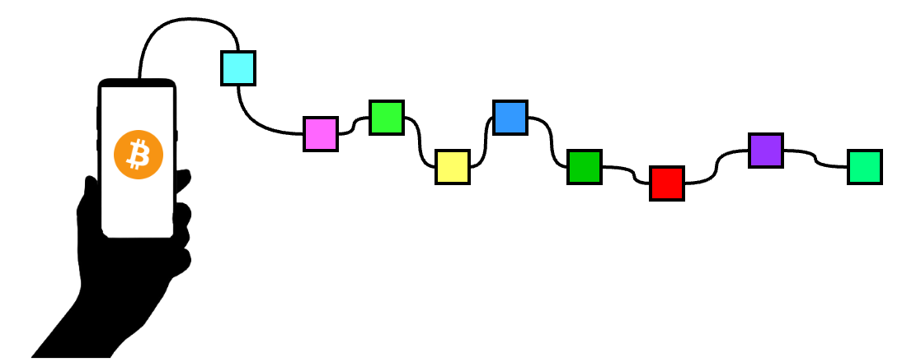
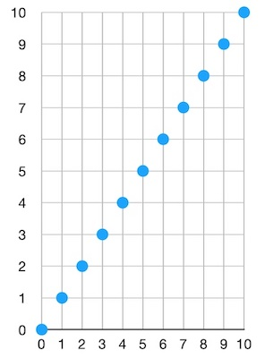
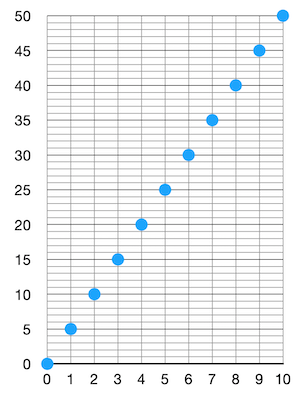
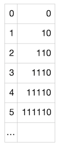
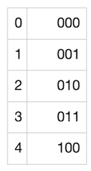
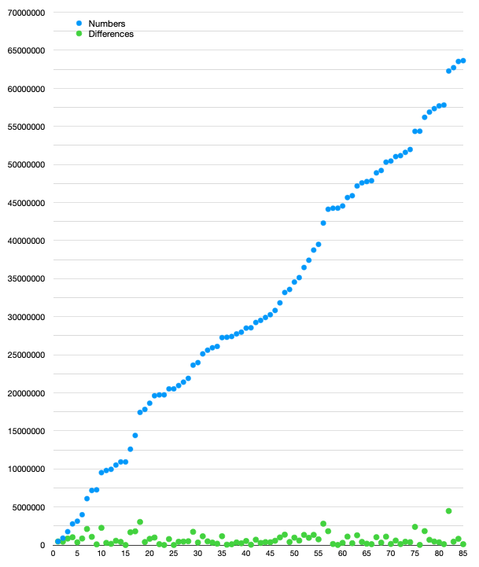

> *作者：Elle Mouton*
> 
> *来源：<https://ellemouton.com/posts/bip158/>*




在本文中，我会简要介绍比特币轻客户端的需要，以及为什么 “致密区块过滤器（compact block filters）” 比 “布隆过滤器（Bloom filters）”  更好地满足了这种需要。然会，我会深入解释致密区块过滤器是怎么工作的，并会附上在测试网上构造这样的过滤器的逐步讲解。

## 区块过滤器的意义

比特币轻客户端（bitcoin light software）是一种软件，其目标是不存储比特币区块链但支持比特币钱包。这意味着，它需要能够向网络广播交易，但最重要的是，它必须能够从链上找出跟本钱包相关的新交易。这样的相关交易有两种：给本钱包发送资金（为本钱包的一个地址创建了一个新的输出）、花费本钱包所控制的其中一个 UTXO。

## 布隆过滤器有什么问题？

在 [BIP 158](https://github.com/bitcoin/bips/blob/master/bip-0158.mediawiki) 出现以前，轻客户端最常用的方法是由 [BIP 37](https://github.com/bitcoin/bips/blob/master/bip-0037.mediawiki) 描述的布隆过滤器 <sup><a href="#note1" id="jump-1">1</a></sup>。布隆过滤器的模式是，你找出自己感兴趣的所有数据对象（比如，被花费的以及被创建的 UTXO 的脚本公钥）、将它们逐个多次哈希，然后将每个结果添加到一个叫做 “布隆过滤器” 的位图（bit map）中。这个过滤器代表了你感兴趣的东西。然后，你将这个过滤器发送给一个你信任的比特币节点，并要求他们给你发送所有跟这个过滤器相匹配的东西。

问题在于，这个过程并不是非常私密，因为，你还是向这个接收过滤器的比特币节点泄露了一些信息。他们可以知晓你感兴趣的交易以及你完全没兴趣的交易；他们还可以不给你发送跟过滤器相匹配的东西。所以，这对轻客户端来说并不是理想的。但同时，它对向轻客户端提供服务的比特币节点来说也不理想。每次你发送一个过滤器，他们就必须从硬盘加载相关的区块，然后确定是否有交易跟你的过滤器相匹配。只需要不停发送假的过滤器，你就可以轰炸他们 —— 这本质上是一种 DOS 攻击。只需要非常少的能量就可以创建一个过滤器，但需要耗费很多能量，才能响应这样的请求。

## 致密区块过滤器

OK，那么我们需要的属性有：

- 更强的隐私性
- 客户端-服务端 的负载更少不对称性。即，服务端需要做的更所应该更少。
- 更少信任。轻客户端不需要担心服务端不返回相关的交易。

使用致密区块过滤器，服务端（全节点）将为每个区块构造一个确定性的过滤器，包含这个区块中的所有数据对象。这个过滤器只需计算一次，就可以永久保存下来。如果轻客户端请求某一个区块的过滤器，这里是没有不对称性的 —— 因为服务端不需要做比发起请求的客户端更多的工作。轻客户端也可以选择多个信息源来下载完整的区块，以确保它们是一致的；而且，轻客户端总是可以下载完整的区块，从而自己检查服务端所提供的过滤器是不是正确的（与相关的区块内容相匹配）。另一个好处是，这种方式更加隐私。轻客户端不再需要给服务端发送自己想要的数据的指纹。这样分析一个轻客户端的活动也会变得更加困难。轻客户端从服务端获取这样的过滤器之后，自己检查过滤器中是否有自己想要的数据，如果有，轻客户端就请求完整的区块。还要指出的一点是，为了以这种方式服务轻客户端，全节点需要持久保存这些过滤器，而轻客户端可能也想要持久保存少数几个过滤器，所以，保证过滤器尽可能轻量，是非常重要的（这也是为什么它叫做 “致密区块过滤器”）。

很好！现在我们要进入难得东西了。这样的过滤器是怎么创建的？它看起来是什么样子的？

我们的需求是？

- 我们想把特定对象的指纹放在过滤器中，这样一来，当客户端想要检查一个区块是否可能包含了跟自己相关的内容时，他们可以列举所有的对象，并检查一个过滤器是否与这些对象匹配。
- 我们希望这个过滤器尽可能小。
- 实质上，我们想要的是某种东西，它可以用一个远远小于区块的体积，来总结一个区块的某一些信息。

包含在过滤器中的基本信息有：每一笔交易的输入的脚本公钥（也就是每一个被花费的 UTXO 的脚本公钥），以及每一笔交易的每一个输出的脚本公钥。基本上就是这样：

```
objects = {spk1, spk2, spk3, spk4, ..., spkN} // 一个由 N 个脚本公钥构成的列表
```

从技术上来说，我们到这里就可以止步了 —— 就这样的脚本公钥列表，也可以充当我们的过滤器。这是一个区块的浓缩版本，包含了轻客户端所需的信息。有了这样的列表，轻客户端可以 100% 确认一个区块中是否有自己感兴趣的交易。但这样的列表体积非常大。所以，我们接下来的步骤，都是为了让这个列表尽可能紧凑。这就是让事情有趣起来的地方。

首先，我们可以将每一个对象都转化成某个范围内的一个数字、并使得每个对象数字在这个范围内是均匀分布的。假设我们有 10 个对象（N = 10），然后我们有某一种函数，可以将每个对象都转化成一个数字。假设我们选择的范围是 [0, 10]（因为我们有 10 个对象）。现在，我们的 “哈希加转换成数字” 函数将取每一个对象为输入，并分别产生一个大小在 [0, 10] 之间的数字。这些数字在这个范围内是均匀分布的。这就意味着，在排序之后，我们将得到一个这样的图（在非常非常理想的情况下）：



首先，这非常棒，因为我们已经大大缩减了每一个对象的指纹的大小。现在每个对象都只是一个数字了。那么，我们的新过滤器看起来就像这样：

```
numbers := {1,2,3,4,5,6,7,8,9,10}
```

轻客户端下载这样的过滤器，希望知道自己正在寻找的某个对象是否跟这个过滤器相匹配。他们只需取出自己感兴趣的对象，然后运行相同的 “哈希加转换成数字” 函数，看看结果是否在这个过滤器中，就可以了。问题在哪里呢？问题是过滤器中的数字已经占据了这个空间内的一切可能性！这意味着，不管轻客户端关心什么样的对象，产生的数字结果都一定会跟这个过滤器相匹配。换句话来说，这个过滤器的 “假阳性率（false-positive rate）” 为 1 （译者注：这里的 “假阳性” 指区块中可能不包含客户端所关心的交易，但通过过滤器得到的结果却是有）。这就不太好了。这也说明，在我们压缩数据以生成过滤器的过程中，我们弄丢了太多信息。我们需要更高的假阳性率。那么，假设我们希望假阳性率为 5.那么，我们可以让区块内的对象均匀匹配到 [0, 50] 范围内的数字：



这样看起来就好一些了。如果我是一个客户端，下载到了这样的过滤器，要通过过滤器检查一个我关心的对象是否在对应的区块中，过滤器说有但区块中并没有（假阳性）的概率就下降到 1/5 。很好，现在我们是将 10 个对象映射成了 0 到 50 之间的数字。这个新的数字列表就是我们的过滤器。再说一遍，我们随时可以停下来，但是，我们也可以进一步压缩它们！

现在，我们有了一个有序的数字列表，这些数字均匀地分布在 [0, 50] 区间内。我们知道这个列表中有 10 个数字。这意味着，我们可以推断出，在这个有序数字列表内，相邻两个数字的 *差值* 最有可能是 5 。总的来说，如果我们有 N 个对象，并希望假阳性率为 M，那么空间的大小应该是 N * M 。也即这些数字的大小应该在 0 到 N * M 之间，但（排序之后）相邻两个数字检查的插值大概率是 M 。而 M 存储起来肯定比 N * M 空间内的数字要小。所以，我们不必存储每一个数字，我们可以存储相邻两个数字的差值。在上面这个例子中，这意味着，我们不是存储 `[0, 5, 10, 15, 20, 25, 30, 35, 40, 45, 50]` 作为过滤器，而是存储 `[0, 5, 5, 5, 5, 5, 5, 5, 5, 5]`，凭此重构初始列表是很简单的。如你缩减，存储数字 50，显然比存储数字 5 要占用更多空间。但是，为何要止步呢？我们再压缩多一点！

接下来就要用到 “Golomb-Rice 编码” 了。这种编码方式可以很好地编码一个表内各数字都非常接近与某一个数字的列表。而我们的列表恰好就是这样的！我们的列表中的数字，每一个都很可能接近 5（或者说，接近于我们的假阳性率，即 M），所以，取每一个数字与 M 的商（将每一个数字除以 5 并忽略掉余数），将很有可能是 0 （如果数字稍小于 5）或者 1（数字稍大于 5）。商也有可能是 2、3，等等，但概率会小很多。很棒！所以我们可以利用这一点：我们将用尽可能少的比特来编码更小的商，同时使用更多的比特币来编码更大、但更不可能出现的商。然后，我们还需要编码余数（因为我们希望能够准确地重建整个列表），而这些余数总是在 [0, M - 1] 范围内（在这个案例中就是 [0, 4]）。为编码商，我们使用下列映射：



上述映射很容易理解：数字 `1` 的数量表示了我们要编码的商，而 `0` 表示商编码的结尾。所以，对我们列表中的每一个数字，我们都可以使用上述表格来编码商，然后使用可以表示最大值为 M-1 的比特川，将余数转化为 2 进制。在这里余数为 4，只需要 3 个比特就可以了。这里是一个展示我们的例子中可能的余数及其编码的表格：



所以，在理想的情况下，我们的列表 `[0, 5, 5, 5, 5, 5, 5, 5, 5, 5, 5]` 可以编码成：

```
0000 10000 10000 10000 10000 10000 10000 10000 10000 10000
```

在我们转移到一个更现实的案例之前，我们来看看是否可以靠这个过滤器恢复我们的最初的列表。

现在我们拥有的是 “0000100001000010000100001000010000100001000010000”。我们知道 Golomb-Rice 编码，也知道 M 为 5（因为这将是公开知识，每一个使用这种过滤器构造的人都会知晓）。因为我们知道 M 为 5，所以我们知道会有 3 个比特来编码余数。所以，我们可以将这个过滤器转化成下列的 “商-余数” 数组列表：

```
[(0, 0), (1, 0), (1, 0), (1, 0), (1, 0), (1, 0), (1, 0), (1, 0), (1, 0), (1, 0)]
```

知道商是通过除以 M（5）得到的，所以我们可以恢复出：

```
[0, 5, 5, 5, 5, 5, 5, 5, 5, 5]
```

而且，我们知道这个列表所表示的是相邻两数之间的差值，所以我们可以恢复最初的列表：

```
[0, 5, 10, 15, 20, 25, 30, 35, 40, 45, 50]
```

## 更加现实的例子

我们现在要尝试为一个真实的比特币 testnet 区块构造一个过滤器。我将使用区块 [2101914](https://blockstream.info/testnet/block/000000000000002c06f9afaf2b2b066d4f814ff60cfbc4df55840975a00e035c) 。我们看看它的过滤器长什么样：

```
$ bitcoin-cli getblockhash 2101914
000000000000002c06f9afaf2b2b066d4f814ff60cfbc4df55840975a00e035c

$ bitcoin-cli getblockfilter 000000000000002c06f9afaf2b2b066d4f814ff60cfbc4df55840975a00e035c
{
  "filter": "5571d126b85aa79c9de56d55995aa292de0484b830680a735793a8c2260113148421279906f800c3b8c94ff37681fb1fd230482518c52df57437864023833f2f801639692646ddcd7976ae4f2e2a1ef58c79b3aed6a705415255e362581692831374a5e5e70d5501cdc0a52095206a15cd2eb98ac980c22466e6945a65a5b0b0c5b32aa1e0cda2545da2c4345e049b614fcad80b9dc9c903788163822f4361bbb8755b79c276b1cf7952148de1e5ee0a92f6d70c4f522aa6877558f62b34b56ade12fa2e61023abf3e570937bf379722bc1b0dc06ffa1c5835bb651b9346a270",
  "header": "8d0cd8353342930209ac7027be150e679bbc7c65cc62bb8392968e43a6ea3bfe"
}
```

好了亲爱的，看看我们如何从区块构造出这样的过滤器吧。

这里所用的完整代码可以在[这个 github 库](https://github.com/ellemouton/bip158Example)中找到。我在这里只会展示一些伪代码片段。这段代码的核心是一个名为 `constructFilter` 的函数，比特币客户端可以用它来调用 `bitcoind` 以及对应的区块。这个函数看起来是这样的：

```
func constructFilter(bc *`bitcoind`.Bitcoind, block `bitcoind`.Block) ([]byte, error) {
	// 1. 从区块中收集我们想要添加到一个过滤器中的所有对象

	// 2. 将这些对象转化为数字，并排序 

	// 3. 取得排序后的数字列表中相邻两数的差值

	// 4. 使用 Golomb-Rice 编码来编码这些差值
}
```

所以，第一步是从区块中收集我们想要添加到过滤器中的所有对象。从 BIP 出发，我们知道，这些对象包括所有被花费的脚本公钥，以及每一个输出的脚本公钥。BIP 还设定了一些额外的规则：我们会跳过 coinbase 交易的输入（因为它没有输入，这是没有意义的），而且我们会通过所有 OP_RETURN 输出。我们也会删除重复数据。如果有两个相同的脚本公钥，我们只会向过滤器添加一次。

```
// 我们希望向过滤器添加的对象的列表
// 包括所有被花费的脚本公钥，以及每一个输出的脚本公钥
// 我们使用了 “图（map）”，这样就去除了重复的脚本公钥
objects := make(map[string] struct{})

// 便利区块中的每一笔交易
for i, tx := range block.Tx {

        // 添加每一个输出的脚本公钥
        // 到我们的对象列表中
        for _, txOut := range tx.Vout {
                scriptPubKey := txOut.ScriptPubKey

                if len(scriptPubKey) == 0 {
                        continue
                }

                // 如遇 OP_RETURN (0x6a) 输出，则跳过
                if spk[0] == 0x6a {
                        continue
                }

                objects[skpStr] = struct{}{}
        }

        // 不添加 coinbase 交易的输入
        if i == 0 {
                continue
        }

        // 对每一个输入，获取其脚本公钥
        for _, txIn := range tx.Vin {
                prevTx, err := bc.GetRawTransaction(txIn.Txid)
                if err != nil {
                        return nil, err
                }

                scriptPubKey := prevTx.Vout[txIn.Vout].ScriptPubKey

                if len(scriptPubKey) == 0 {
                        continue
                }

                objects[spkStr] = struct{}{}
        }
}

```

OK，现在已经收集好了所有的对象。现在，我们定义变量 N 为 `对象` 图的长度。在这里，N 为 85 .

下一步则是将我们的对象转换成在一个区间内均匀分布的数字。再说一次，这个范围取决于你想要多高的假阳性率。BIP158 定义常量 M 为 784931 。这意味着，出现假阳性的概率为 1/784931 。就像我们前面做的一样，我们取假阳性率 M 乘以 N，得到所有数字的分布范围。这个范围我们定义为 F，即 F = M * N 。在这里，F = 66719135 。我不准备细说将对象映射为数字的函数（你可以在上面链接的 github 库中找到相关的细节）。你需要知道的仅仅是，它会取对象、常量 F（定义了需要将对象映射到的范围）以及一个键（区块哈希值）作为输入。一旦我们得出所有的数字，我们会用升序排列这个列表，然后创建一个叫做 `differences（差值）` 的新列表，保存排好序的 `数字` 列表内相邻两个数字之间的差值。

```
numbers := make([]uint64, 0, N)

// 遍历所有对象，将它们转化为在 [0, F] 范围内均匀分布的数字
// 并将这些数字存储为 `numbers` 列表
for o := range objects {
        // Using the given key, max number (F) and object bytes (o),
        // convert the object to a number between 0 and F.
        v := convertToNumber(b, F, key)

        numbers = append(numbers, v)
}

// 给 numbers 列表排序
sort.Slice(numbers, func(i, j int) bool { return numbers[i] < numbers[j] })

// 将数字列表转化为差值列表
differences := make([]uint64, N)
for i, num := range numbers {
        if i == 0 {
                differences[i] = num
                continue
        }

        differences[i] = num - numbers[i-1]
}
```

很棒！这里有张图，展示了 `numbers` 和 `differences` 列表。



如你缩减，85 个数字均匀地分布在整个空间中！所以 `differences` 列表中的数值也非常小。

最后一步是用 Golomb-Rice 编码来编码这个 `differences` 列表。回忆一下前面的解释，我们需要用最有可能的数值来除每个差值，然后编码商和余数。在我们前面的例子中，我说最有可能的数值就是 M，而余数会在 [0, M] 之间。但是，BIP158 并不是这么做的，因为我们发现 <sup><a href="#note2" id="jump-2">2</a></sup>，这并不是事实上能让最终的过滤器体积最小化的参数。所以我们不使用 M，而是定义一个新的常量 P，并使用 2 ^ P 作为 Golomb-Rice 参数。P 定义成 19 。这意味着我们要将每一个差值除以  2 ^ 19，以获得商和余数，并且余数会用 19 比特编码成二进制。

```
filter := bstream.NewBStreamWriter(0)

// 对于 `differences` 列表中的每个数值，通过除以 2 ^ P 来获得商和余数。
for _, d := range differences {
        q := math.Floor(float64(d)/math.Exp2(float64(P)))
        r := d - uint64(math.Exp2(float64(P))*q)

        // 编码商
        for i := 0; i < int(q); i++ {
               filter.WriteBit(true)
        }
        filter.WriteBit(false)

        filter.WriteBits(r, P)
}
```

很棒！现在我们可以输出过滤器了，得到：

```
71d126b85aa79c9de56d55995aa292de0484b830680a735793a8c2260113148421279906f800c3b8c94ff37681fb1fd230482518c52df57437864023833f2f801639692646ddcd7976ae4f2e2a1ef58c79b3aed6a705415255e362581692831374a5e5e70d5501cdc0a52095206a15cd2eb98ac980c22466e6945a65a5b0b0c5b32aa1e0cda2545da2c4345e049b614fcad80b9dc9c903788163822f4361bbb8755b79c276b1cf7952148de1e5ee0a92f6d70c4f522aa6877558f62b34b56ade12fa2e61023abf3e570937bf379722bc1b0dc06ffa1c5835bb651b9346a270
```

除了开头的两个字节，其余都跟我们在 `bitcoind` 中得到的过滤器完全一样！为什么前面的 2 字节会有区别呢？因为 BIP 说 N 的值需要在 CompactSize 格式中编码，并出现在过滤器的前面，这样才能被接收者解码。这是用下列办法完成的：

```
fd := filter.Bytes()

var buffer bytes.Buffer
buffer.Grow(wire.VarIntSerializeSize(uint64(N)) + len(fd))

err = wire.WriteVarInt(&buffer, 0, uint64(N))
if err != nil {
        return nil, err
}

_, err = buffer.Write(fd)
if err != nil {
        return nil, err
}
```

如果我们现在再打印出过滤器，就会发现它跟 `bitcoind` 的结果完全一样：

```
5571d126b85aa79c9de56d55995aa292de0484b830680a735793a8c2260113148421279906f800c3b8c94ff37681fb1fd230482518c52df57437864023833f2f801639692646ddcd7976ae4f2e2a1ef58c79b3aed6a705415255e362581692831374a5e5e70d5501cdc0a52095206a15cd2eb98ac980c22466e6945a65a5b0b0c5b32aa1e0cda2545da2c4345e049b614fcad80b9dc9c903788163822f4361bbb8755b79c276b1cf7952148de1e5ee0a92f6d70c4f522aa6877558f62b34b56ade12fa2e61023abf3e570937bf379722bc1b0dc06ffa1c5835bb651b9346a270
```

成功！

不过，我个人的理解是，不需要把 N 加入过滤器中。如果你知道 P 的值，那你就能找出 N 的值。来看看我们是否能用第一个过滤器输出恢复初始的数字列表：

```go
b := bstream.NewBStreamReader(filter)
var (
	numbers []uint64
	prevNum uint64
)

for {

        // 从字节串中读取商。遇到的第一个 0 表示商的结尾
        // 再遇到 0 之前，1 的数量就代表了商
        var q uint64
        c, err := b.ReadBit()
        if err != nil {
                return err
        }

        for c {
                q++
                c, err = b.ReadBit()
                if errors.Is(err, io.EOF) {
                        break
                } else if err != nil {
                        return err
                }
        }

        // 随后的 P 个比特编码了余数
        r, err := b.ReadBits(P)
        if errors.Is(err, io.EOF) {
                break
        } else if err != nil {
                return err
        }

        n := q*uint64(math.Exp2(float64(P))) + r

        num :=  n + prevNum
        numbers = append(numbers, num)
        prevNum = num
}

fmt.Println(numbers)
```

上述操作会产生相同的数字列表，所以我们可以重构它而无需知晓 N 。所以我不确认将 N 加入过滤器的理由是什么。如果你知道为什么一定要加入 N ，请告诉我！

感谢阅读！

### 脚注

1.<a id="note1"> </a>https://en.wikipedia.org/wiki/Bloom_filter <a href="#jump-1">↩</a>

2.<a id="note2"> </a>https://gist.github.com/sipa/576d5f09c3b86c3b1b75598d799fc845 <a href="#jump-2">↩</a>