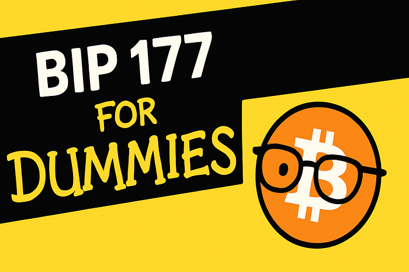

> *作者：John Carvalho*
> 
> *来源：<https://bitcoinerrorlog.medium.com/bip-177-for-dummies-3993db575490>*

*改变价格标签上的数字并不会改变比特币的灵魂 …… 并且会让在我们之后来到这世界的朋友更加轻松。*

## 有什么要紧的？

镜头切到一个咖啡馆，墙上的价格表显示，一杯咖啡的价格是：

> **0.0000123 BTC** 或者 **₿1230**

**[BIP-177](https://github.com/bitcoin/bips/blob/9a8326225e2d9fd5257a9f03abe407aea9c65af9/bip-0177.mediawiki) 建议默认显示上述第二种标签**，因为这样更简单，可以显示货币类型，而且，这跟比特币的真实工作原理是一致的（*比特币协议只使用整数，不会使用分数。所以，当前带有小数点的形式反而是武断的！*）

## 为什么要把比特币花出去呢？

Michael Saylor 的 “死活不卖” 咒语可以保护你的长期储蓄，但一种货币不能只是一种收藏品。每一笔买卖都会实现三种功能：

1. **表明真实的需求**。当咖啡馆接受比特币，而人们也真的拿比特币来支付的时候，市场就能发现真实的价格。
2. **构筑一个循环的经济**。你花得越多，你用到法币、阴暗交易所和卑鄙 KYC 的地方就越多。
3. **加强安全性**。人们的日常花费会让区块保持满载、手续费浮动，并且矿工也会被激励在区块补贴枯竭之后继续投入。

囤币是一种很好的储蓄策略，但如果你真的完全不花比特币，不就意味着你还没有 100% 拥有它吗？

## BIP-177 的提议内容

- **移除小数点**：

  这本来就是虚幻的，比特币实际上就是不可分割的（译者注：见下一条）。

- **重命名基本单位**：

  将你在区块链系统真正追踪的整数称为 “**比特币**”，简洁明了！
  
- **把 “BTC” 这个标签留给传统金融**：

  1 “BTC” 等于 100 000 000 新形式的 “比特币”。

- 在钱包和交易所界面中**加入一键切换功能**：

  *整数形式*（₿） 与 *传统小数点形式*（BTC） 一键切换

## 最大的顾虑与事实检查

**“你会毁了 ‘聪’的文化！”**

文化上大家依然可以说 “囤聪（stack sats）”。技术上来说它们**就是** *比特币*，但语言是自由的。BIP-177 只是提议将 UI 标签标准化。

**“你在贬低中本聪！”**

中本聪自己就提出过，只要价格提升，0目前大家使用的这种假惺惺的小数点可以随时改变。在比特币的早期，没有人用 “聪” 来称呼这个量级，中本聪自己也从没这么要求过。

**“人们会遇上诈骗！”** 

这可能是一种风险，但如果你真的看清楚了 **1 “BTC”** 和 **₿ 100 000 000** 在量级上的区别，你就会知道，这是没办法搞诈骗的，如果混淆单位，中间的价格差会高达几百万美元。*比特币系统中还有一个 “粉尘限额”，是 546 单位，也就是所有的交易额都必须大于 **₿ 546**！*

**“人们会觉得困惑！”**

如果你能理解，为什么觉得他们就不能呢？总会有一些混蛋在关于比特币的事情上说谎，我们不能因此止步不前！

**“钱包软件都会崩溃！”**

只要一个钱包可以跟踪聪，那它就可以跟踪整数。将数额显示为 “**₿1230**” 而不是 “**0.00001230 BTC**” 只是交互界面上的改变。返回旧的显示形式只需要一个选项框。

**“会给价格带来很大影响！”**

交易所已经能够在 USD、EUR 和聪之间切换（作为数额的单位）。将 BTC 与 ₿ 相互映射只是一种数据库乘法，不是分叉。

## 这不是多此一举吗？

微小的用户体验调整可以带来显著的效果：

- 表情包搜索并不改变键盘的布局，但现在每天有几十亿人都使用这个功能。
- 把书本上的罗马数字改成阿拉伯数字，提高了人们的数字读写能力。
- 许多人都有单位偏见，觉得比特币 “太贵了”（他们还不理解 BTC 与比特币的换算关系）
- 许多人都觉得比特币用到了分数，但实际上并没有！

当普通人一眼就能看出比特币的时候，比特币就赢了。BIP-177 只是一种**低风险的调整**，可以永远消灭这个长达 8 位的小数带来的阻碍。

## 给好奇朋友的 FAQ

> **我会失去自己的 聪/比特币 吗？**
>
> 不会。比特币区块链这个账本依然会显示相同的整数。我们只是改变屏幕上的标签。
>
> **BTC 的数量上限会改变吗？**
>
> 当然不会。共识规则和 “BTC” 这个标签都保持原样。
>
> **矿工或者节点需要升级吗？**
>
> 不需要。这跟共识规则无关。只是钱包的用户界面可能需要添加一个按钮。
>
> **我可以忽略这个新单位吗？**
>
> 可以！BTC、聪，想用什么就用什么！

## 结语

比特币的核心是不可变更的代码。[BIP-177](https://github.com/bitcoin/bips/blob/9a8326225e2d9fd5257a9f03abe407aea9c65af9/bip-0177.mediawiki) 只是隐藏了小数点，让未来的比特币人更易于理解。我们 现在就试试看吧！

（完）