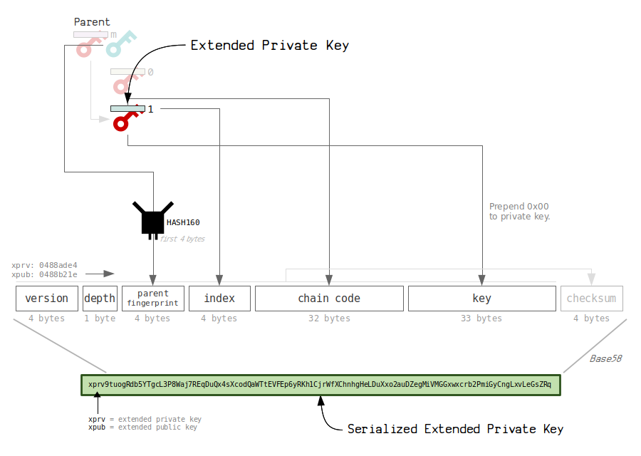

> *作者：Greg Walker*
> 
> *来源：<https://learnmeabitcoin.com/technical/extended-keys>*


所谓的 “**拓展密钥**”，就是一个[私钥](https://learnmeabitcoin.com/technical/private-key)（在图中以红色标记）或者[公钥](https://learnmeabitcoin.com/technical/public-key)（在图中以蓝色标记），你可以用它来 *派生新的密钥*，从而形成一个 “[层级式确定性钱包](https://learnmeabitcoin.com/technical/hd-wallets)”。

因此，你可以先取得一个拓展私钥，然后将它用作你的钱包中所有的子私钥和子公钥的源头。此外，该私钥所对应的拓展公钥，也将生成完全相同的子公钥。

## 1. 主密钥

你的第一个拓展密钥（也叫 “主密钥”）是将一个[种子](https://learnmeabitcoin.com/technical/mnemonic)（64 字节的熵）投入 HMAC-SHA512 哈希函数中生成的。

> 你可以将 “基于哈希函数的消息身份验证码（HMAC）” 理解成一个**哈希函数**，你可以将一段数据 *以及* 一个私钥 传入，从而生成新的一组随机的字节。


<p style="text-align:center">- 在创建我们的主密钥时，并不需要使用一个 key，所以，只需使用自定义的字符串 “Bitcoin seed” <sup><a href="#note1" id="jump-1">1</a></sup> -</p>


HMAC 函数将返回 `64 字节` 的数据（而且是完全不可预测的）。我们将它分成两半，以创建我们的主私钥：

- **前一半**是私钥，就像别的私钥一样；
- **后一半**是 “链码（chain code）”，单纯只是 32 字节的随机数据。

> 生成子密钥就需要用到 “链码” 。如果你只有一把私钥，但**没有**链码，你就无法生成其 *后代* 密钥（因此它们受到了保护）。

### 拓展私钥

所以，从根本上来说，一个拓展私钥，就是跟一个链码成对的普通私钥。


<p style="text-align:center">- 一个私钥，加上额外的 32 字节 -</p>


### 拓展公钥

我们也可以创建出对应的拓展公钥。只需取得私钥，然后计算出其对应的公钥，然后搭配上相同的链码即可。


就这样，我们就从一个种子得到了初步的主私钥和主公钥。

> **提醒**：如你缩减，拓展密钥本身并没有什么特殊的；它们只是一对分享相同链码（额外的 32 字节的熵）普通公私钥。拓展密钥的真正模范在于它生成子密钥的方式。

## 2. 拓展密钥树

所有的拓展密钥都可以派生 *子拓展密钥*。

- 拓展私钥可以派生出新的子密钥，包括子私钥和子公钥。
- 拓展公钥只能派生出新的子公钥。

每个子密钥都有一个 *索引号*（最高为 `2^32`）。


<p style="text-align:center">- 拓展公钥最酷的地方在于，它可以派生出一些公钥，跟使用拓展私钥所派生的没有区别。 -</p>


出于安全考虑，使用拓展私钥你可以派生出两类子密钥：

1. **普通子密钥**。拓展私钥和拓展公钥可以生成相同的公钥，索引号从 `0` 到 `2147483647`（是所有可能的子密钥的前一半）。
2. **强化子密钥（Hardened）**。只有拓展私钥可以生成出来的公钥。索引号从 `2147483648` 到 `4294967295`（是所有可能的子密钥的后一半）。

换句话说，强化的子密钥给了你创建一个 “秘密” 公钥（或者说 “内部” 公钥）的选择，因为单凭拓展公钥是无法推导出它们的。

## 3. 子拓展密钥派生

拓展私钥和拓展公钥都可以派生子密钥，每一个子密钥都有自己的独一无二的索引号。

有三种办法可以派生子拓展密钥：

1. *普通* 的子拓展私钥
2. *强化* 的子拓展私钥
3. *普通* 的子拓展公钥

> **提示**：派生出来的子密钥（和父密钥）是相互独立的。换句话说，你不可能知道两个公钥有什么关联，即使它们同在一棵拓展密钥树上。

### **普通的子拓展私钥**


<p style="text-align:center">- “标量加法” 指的就是传统算术的加法 -</p>


1. **使用父私钥计算出父公钥**。（这是为了将对应的父公钥作为数据，投入 HMAC 函数中，以生成子密钥。）
2. **使用一个介于 `0` 和 `2147483647` 之间数字作为索引号**。这个范围内的索引号是为 *普通* 子密钥安排的。
3. **将数据和 key 投入 HMAC**。
   - 数据 = 父公钥 + 索引号（这个 “+” 指的是字符串前后拼接）
   - key = 父密钥的链码

**新的链码**是 HMAC 的结果的后面 32 个字节。它只是一些随机的字节，我们可以用作子密钥的链码。

**新的私钥**是 HMAC 的结果的前面 32 个字节，加上原本的私钥。这本质上就是给原本的私钥 *加上* 一个随机的 32 字节的数字。我们将这个结果对椭圆曲线的阶数（n = 115792089237316195423570985008687907852837564279074904382605163141518161494337）求模（作为子私钥），以确保子私钥落在椭圆曲线的有效数字范围内。

所以，总结一下，我们将父拓展密钥（公钥 + 索引号、链码）中的数据传入 HMAC，以产生新的随机字节。再使用这些新的随机字节来构造子私钥。

### **强化的子拓展私钥**


1. **使用 `2147483647` 和 `4294967295` 之间的一个数字作为索引号**。这个范围内的数字是为强化的子密钥而准备的。
2. **将数据和 key 传入 HMAC**。
   - 数据 = 父私钥 + 索引号（“+” 号意味着前后拼接）
   - key =  父密钥的链码

**新的链码**是 HMAC 的结果的后面 32 个字节。

**新的私钥**是 HMAC 的结果的前面 32 个字节，加上原本的私钥。这本质上就是给原本的私钥加上一个随机的 32 字节的数字。

所以，这种强化的子密钥，是通过将父**私钥**投入 HMAC 函数中获得的，这意味着，这样派生出来的子拓展私钥，其公钥是无法通过父拓展公钥派生出来的。

> “强化派生应该用作默认的派生方式，除非你非常需要能够再不能访问私钥时派生出公钥。” —— Pieter Wuille  <sup><a href="#note2" id="jump-2">2</a></sup>

### 普通的子拓展公钥


1. **使用一个介于 `0` 和 `2147483647` 之间数字作为索引号**。这个范围内的数字是为普通的拓展密钥而准备的。
2. **向 HMAC 投入下列数据和 key**。
   - 数据 = 父公钥 + 索引号（前后拼接）
   - key = 父密钥链码

**新的链码**是 HMAC 运算结果的后面 32 字节。这跟前面所说的 *普通* 子拓展私钥的链码是一样的，因为投入 HMAC 中的数据和 key 都是一样的。

**新的公钥**是父公钥（本身是椭圆曲线上的一个点）加上 HMAC 结果的前 32 字节所生成的椭圆曲线点（只需乘以椭圆曲线上的生成器点即可）（译者注：这里用到的是椭圆曲线上的点加法，与前面私钥派生所用的标量加法不同）。

总的来说，我们放入 HMAC 函数中的数据，就跟为了派生子拓展私钥而放入函数中的相同。然后，可以通过[椭圆曲线点加法](https://learnmeabitcoin.com/technical/ecdsa#add)，将 HMAC 结果的前面 32 字节与父公钥相加，得出子公钥（它跟前面推导出的子私钥恰好成对）。

### 强化的子拓展公钥

*不可能得出*。

## 4. 这行得通吗？

换句话说，怎么保证，从一个拓展公钥派生出的子公钥，恰好跟从对应的拓展私钥中派生出的子私钥成对吗？

这是因为，在派生普通的子拓展密钥时，我们投入 HMAC 函数中 *输入是相同的*，所以得出的结果也是相同的。使用这个结果的前面 32 字节（就是一个数字嘛），我们可以：

- *加上*父私钥，从而产生**子私钥**。
- （通过椭圆曲线点加法）*加上*父公钥，从而产生**子公钥**。

而因为椭圆曲线数学的工作方法，子私钥将对应于将正好对应于子公钥。


> **说得再清楚一点？**
>
> 首先，复习一下，一个**公钥**只是一个椭圆曲线上的点，是用一个**私钥**乘以椭圆曲线上的**生成器点**得出的。
>
> 
>
> 现在，如果你给这个私钥加上一个**数字**（即，HMAC 结果的前面 32 字节），我们将获得一个新的私钥。当你用这个新的私钥乘以生成器点，就可以得到新的公钥。
>
> 
>
> 类似地，如果你在原本的公钥上加上相同的数字（的椭圆曲线点），你将得到相同的公钥。
>
> 

> **安全提醒**
>
> 因为**普通**子私钥的推导方式，如果你拥有一个拓展公钥，**以及**其任意一个子私钥，你就可以计算出这个拓展公钥所对应的私钥。
>
> 
>
> 换句话说，如果你的扩展公钥被人知道了，你要 *非常小心*，不要暴露它的子私钥。一旦暴露，任何人都能计算出这个拓展公钥所对应的扩展私钥，然后计算出密钥树上跟这个子私钥同一级的所有私钥，然后将它们能够控制的比特币都偷走。

## 5. 序列化

拓展密钥可以序列化，使之更容易传递。序列化之后的数据包含了私钥（或者公钥）以及链码，以及一些额外的元数据。



序列化之后的密钥包含了下列字段：

| 4 字节  | **版本号**     | 将 “xprv” `0488ade4` 或者 “xpub” `0488b21e` 放在开头，以表示其内容。前者表示私钥，后者表示公钥。 |
| ------- | -------------- | ------------------------------------------------------------ |
| 1 字节  | **深度**       | 从主密钥到本密钥经过多少次派生。                             |
| 4 字节  | **父公钥指纹** | 父 *公钥* 的 hash160 哈希值的前 4 字节。这可以在日后帮助定位父密钥。 |
| 4 字节  | **编号**       | 从父密钥派生出本密钥所用的索引号。                           |
| 32 字节 | **链码**       | 额外的 32 字节的秘密值。没有这个值就无法派生子密钥。         |
| 33 字节 | **密钥**       | 私钥（加上 `0x00` 作为前缀），或者公钥。                     |

> 提醒：
>
> **版本号**：
>
> `0488ade4` = xprv
> `0488b21e` = xpub
> `049d7878` = yprv （使用 [BIP 49](https://learnmeabitcoin.com/technical/derivation-paths#bip-49-m490000) 派生路径的拓展密钥）
> `049d7cb2` = ypub
> `04b2430c` = zprv （使用 [BIP 84](https://learnmeabitcoin.com/technical/derivation-paths#bip-84-m840000) 派生路径的拓展密钥）
> `04b24746` = zpub
>
> **主密钥的字段**：
>
> 深度 = `00`
> 指纹 = `00000000`
> 编号 = `00000000`
>
> 在 “密钥” 字段，私钥（本身是 32 字节）将加上 `0x00` 作为前缀，以保持跟公钥（33 字节）的长度相同。

序列化数据末尾还有一个[校验和](https://learnmeabitcoin.com/technical/checksum)（用于检测编码错误），最后，再转化成 [Base58](https://learnmeabitcoin.com/technical/base58) 编码（从而变成可以阅读的拓展密钥格式）。

拓展私钥看起来就像这样：

```
xprv9tuogRdb5YTgcL3P8Waj7REqDuQx4sXcodQaWTtEVFEp6yRKh1CjrWfXChnhgHeLDuXxo2auDZegMiVMGGxwxcrb2PmiGyCngLxvLeGsZRq
```

拓展公钥看起来测试这样的：

```
xpub67uA5wAUuv1ypp7rEY7jUZBZmwFSULFUArLBJrHr3amnymkUEYWzQJz13zLacZv33sSuxKVmerpZeFExapBNt8HpAqtTtWqDQRAgyqSKUHu
```

如你所见，它们都非常长，但这是因为它们都携带了关于托管密钥的额外有用信息。

> **提醒**：*指纹*、*深度* 和 *编号* 这些数据，都不是派生子密钥所必需的 —— 只是用来帮助你确定当前这个密钥的父公钥以及它在密钥树上的位置的。

> **注**：*编号* 字段只有 4 字节长，这就是为什么在派生子密钥的时候，拓展密钥只能用介于 0 和 4,294,967,295 （`0xffffffff`）之间的数字作为索引号。

## 背景知识

- [ECDSA](https://learnmeabitcoin.com/technical/ecdsa) —— 如何使用私钥和公钥来签名和（验证）数据

## 链接

- [BIP 32](https://github.com/bitcoin/bips/blob/master/bip-0032.mediawiki)（[Pieter Wuille](https://github.com/sipa) 提出了初始的规范。这个页面是最初那份 BIP 的重写版）。
- [Ian Coleman BIP39 Tool](https://iancoleman.io/bip39/)（可以从一个种子派生出拓展密钥的神奇工具）
- [Bitcoin Ruby: ext_key.rb](https://github.com/lian/bitcoin-ruby/blob/master/lib/bitcoin/ext_key.rb)（使用 Ruby 语言撰写的良好实现）

## StackExchange 问答

- [拓展公钥/拓展私钥 是如何构成的？](https://bitcoin.stackexchange.com/questions/78295/what-makes-an-extended-public-or-private-key)
- [为什么强化的 xpub 无法生成子公钥？](https://bitcoin.stackexchange.com/questions/92562/why-hardended-xpub-key-cannot-generate-child-public-key)
- [MAC 和 HMAC 有什么区别？](https://crypto.stackexchange.com/questions/6523/what-is-the-difference-between-mac-and-hmac)


## 脚注

1.<a id="note1"> </a>https://bitcoin.stackexchange.com/questions/36917/hmac-bitcoin-seed-for-bip32/36937#36937 <a href="#jump-1">↩</a>

2.<a id="note2"> </a>https://bitcoin.stackexchange.com/questions/62533/key-derivation-in-hd-wallets-using-the-extended-private-key-vs-hardened-derivati/84007#84007 <a href="#jump-2">↩</a>