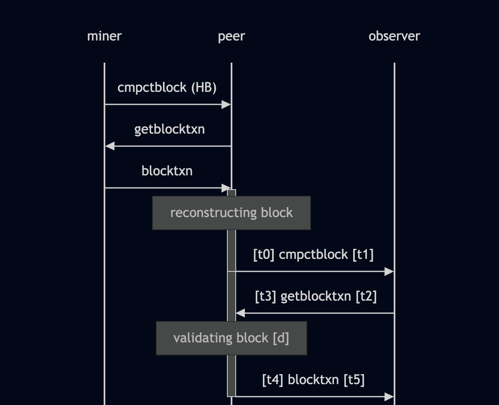
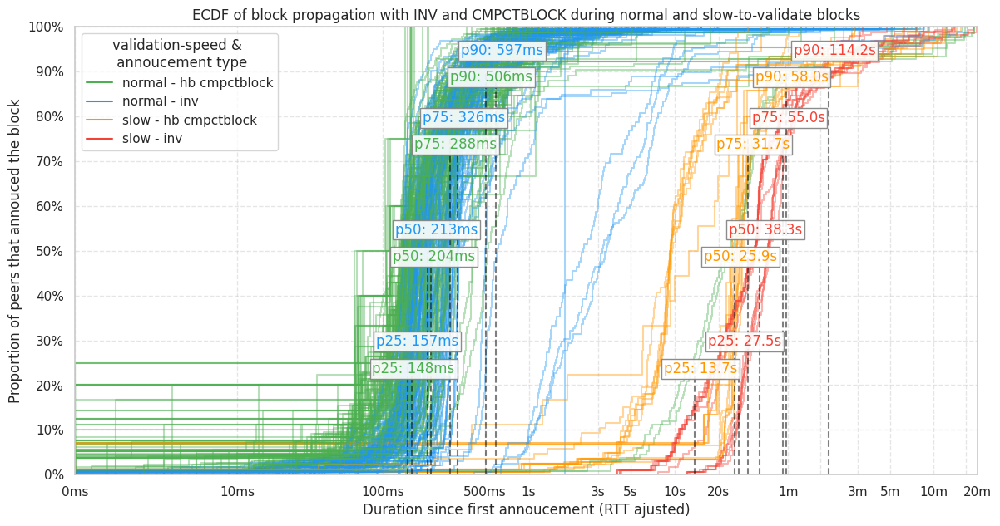
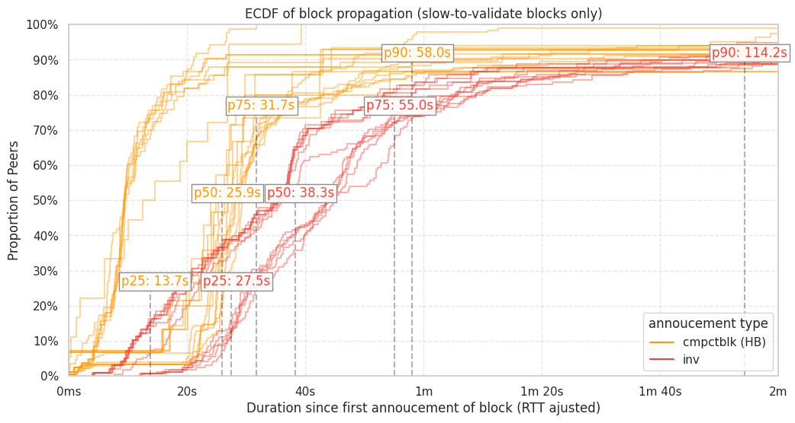
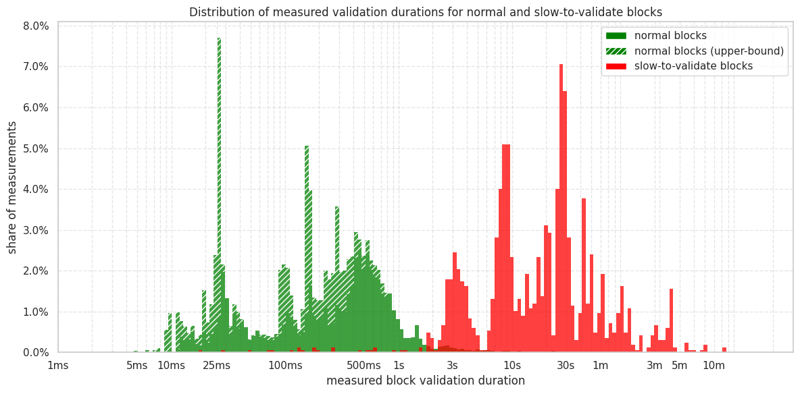
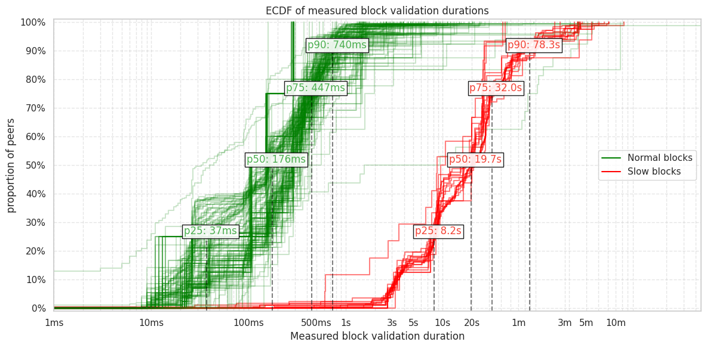
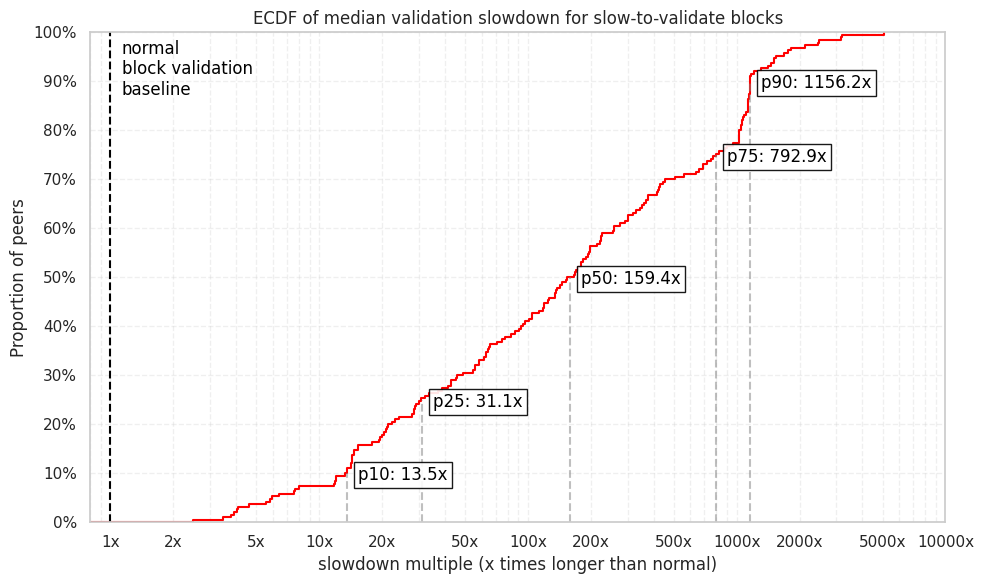

> *作者：b10c*
>
> *来源：<https://b10c.me/observations/16-slow-block-propagation-validation-signet/>*
>
> *原文出版于 2026 年 4 月。*

在上周的 “[Signet 繁难区块演示](https://delvingbitcoin.org/t/consensus-cleanup-demo-of-slow-blocks-on-signet/2367)” 活动期间，我运行了一个定制的 P2P 客户端，连接到了运行在 IPv4 和 Tor 上的全部（大约 190 个）Signet 节点。我的目的是度量区块**在网络中传播的速度**，以及**各节点验证区块的速度**。

*本文最初出版于 [bnoc.xyz](https://bnoc.xyz/t/block-propagation-and-validation-duration-during-slow-to-validate-blocks-on-signet/117)* 。

度量结果表明，区块传播速度受到了很大的影响，因为节点需要等待先收到区块的对等节点先验证完区块，才能收到 `blocktxn` 响应消息以及本地缺失的交易，进而开始重新构造区块、验证和转发。面对这些远远不算最坏情况的繁难区块时，在可以观察到的中值对等节点上，验证速度降低了大约 160 倍。这个中值节点花费了 20 秒（s）来验证一个繁难区块，而验证 Signet 上的普通区块只需花费 176 毫秒（ms）。

（译者注：“Signet” 为一个使用专属出块者签名出块的比特币测试网络。“繁难区块” 为验证起来格外缓慢的区块。）

## 方法论

为了度量区块传播速度和验证速度，来自对等节点的两种宣告事件格外重要：

其一，[BIP-152](https://github.com/bitcoin/bips/blob/master/bip-0152.mediawiki) 高带宽致密区块宣告。在我们使用 `sendcmpct(1)` 消息向对等节点请求高带宽致密区块之后，对等节点们将在他们构造好区块之后、验证区块**之前**，尽快给我们发送一条 `cmpctblock` 信息。当我们的客户端收到来自一个对等节点的 `cmpctblock` 消息之后，它会通过发送 `getblocktxn` 信息来请求交易。一旦这个对等节点验证完了区块，他会给我们响应一条 `blocktxn` 信息。通过记录 `cmpctblock` 消息和 `blocktxn` 消息到达本地的时间戳，我们就能推断验证时长。`cmpctblock`的时间戳也向我们表明了区块传播的速度（不掺杂验证时间）。

其次， 低带宽致密区块 INV（或者类似的 [BIP-130](https://github.com/bitcoin/bips/blob/master/bip-0130.mediawiki) 区块头）宣告，也包含了信息。它们发生在节点已经验证了区块**之后**。

我们定制的 P2P 客户端也会记录各节点的比特币协议的 `ping` `pong` 往返通信延迟（RTT），从而能够为网络和应用层时延调整宣告消息的时间戳。

区块传播的时长，是宣告信息时间戳和我们收到的该区块的第一条宣告的时间戳的差值。两个时间戳都会用 RTT 来调整，调整项是 $\frac{1}{2}$ RTT ：$\textit{ts_adjusted} = \textit{ts_raw} - \frac{1}{2} \textit{RTT}$ 。我们假设 RTT 是对称的 <sup><a href='#note1' id='jump-1-0'>1</a></sup> 。

区块验证的时长，则是一个对等节点给我们发送高带宽致密区块宣告、与其发送对应 `blocktxn` 响应信息的时间差  <sup><a href='#note2' id='jump-2-0'>2</a></sup>。我们不知道对等节点给我们发送一条信息的时间戳，但可以从收到信息的时间戳以及 RTT 中计算出来。整个过程的时间顺序是这样的：



<p style="text-align:center">- 这个事件序列图展示了我们测量的时间段 -</p>


- $t_0$ ：对等节点完成区块重构，并向我们发送一条高带宽致密区块宣告
- $t_1$ ：我们收到一条高带宽致密区块宣告（$t_0$ 之后经过 $\frac{1}{2} RTT$ ）
- $t_2$ ：我们发送 `getblocktxn`请求（假设是瞬时的）
- $t_3$ ：对等节点收到 `getblocktxn`请求（$t_2$ 之后经过 $\frac{1}{2} RTT$ ）
- $t_4$ ：对等节点完成区块验证，发送 `blocktxn`（时间不确定）
- $t_5$ ：我们收到 `blocktxn`（$t_4$ 之后经过 $\frac{1}{2} RTT$ ）

我们要度量的是 $t_0$ 与 $t_4$ 两个时间点之间的时长（$= d$）。面对一个对等节点，我们有 $t_1$（和 $t_2$）、$t_5$ 和 RTT 。不过，因为在$t_0$ 与 $t_4$ 之间，我们必须完成一次完整的消息往返，当区块验证时间比 RTT 还要短时，我们将只能得到验证时长的上界。在这种情况下，$d ≈ RTT$ 。

$$
\begin{align}
t_0 &= t_1 - \frac{1}{2} \textit{RTT} \\\\
t_2 &= t_1 \\\\
t_3 &= t_1 + \frac{1}{2} \textit{RTT} \\\\
t_4 &= t_5 - \frac{1}{2} \textit{RTT} \\\\
d &= t_4 - t_0 \\\\
\textit{longer-than-rtt} &= d > \textit{RTT}
\end{align}
$$


至于 RTT 本身，我们使用在连接活跃期间记录下的 RTT 的中值。

## 结果

### 区块传播

关于区块传播，我们分别观察了对等节点以高带宽致密区块宣布一个区块的时间，和通过 INV 消息宣布这个区块的时间。我们也区分了普通区块和专门构造的繁难区块。




<p style="text-align:center">- 普通区块和专门构造的繁难区块的 INV 传播速度和致密区块传播速度（ECDF） -</p>


在两种区块 —— 普通区块和专门构造的繁难区块 —— 上，高带宽致密区块宣告的传播速度都比 INV 宣告的传播速度要快。这在意料之中，因为高带宽致密区块宣告是在验证区块之前发送的，而 INV 宣告仅在区块得到验证之后才会发送。

普通区块在 Signet 上的致密区块传播时间（绿线）和 INV 传播时间（蓝线）是接近的。Signet 上的普通区块通道不会包含很多交易，并且可以快速验证。处在（前）25 分位的节点会在 150ms 之后向我们宣布区块；中值节点稍慢，稍微超过 200ms；75 分位节点在 300ms 以后；经过 600ms，90% 的对等节点都已经验证完了区块，并向我们发送了宣告。

-（仅限繁难区块）区块传播 ECDF-

繁难区块的传播则有很大不同。虽然高带宽致密区块宣告消息（黄线）都会在 INV 宣告消息之前到达，25 分位的节点在接近 14 秒之后才会向我们发送一条高带宽致密区块宣告；而这些节点的 INV 消息会在 27.5 秒之后到达。中值节点在大约 26 秒之后向我们发送致密区块宣告，31.7 秒后发送 INV 信息。至于 75 分位的节点，是 31.7 秒后发送致密区块，55 秒后发送 INV 。90 分位对等节点会在 58 秒后以致密区块宣布繁难区块，114 秒后通过 INV 消息宣布。

这表明，区块传播的速度依赖于验证性能。验证起来较快的区块，传播起来也较快；难以验证的区块，传播起来也较慢。这似乎出是可以理解的，因为节点要验证完一个区块之后才传播它。但是，请主要，这种降速仅在节点需要用 `getblocktxn` 请求交易时才会发生。如果节点不需要请求交易，比如，因为恰好其交易池中包含了区块内的所有交易，那么它可以在收到 `cmpctblock` 消息之后就立即重构区块并开始验证它。慢速区块中的繁难交易是非标准的，需要用 `getblocktxn` 来请求。如果实现了 “致密区块预填充” 技术，就像[这个帖子](https://delvingbitcoin.org/t/stats-on-compact-block-reconstructions/1052/24)说的那样，那么繁难区块可能也会更快传播。在这次演示中，这些繁难区块都包含了仅仅一笔体积我 999kvB 的繁难交易。预填充这笔交易可以不会有什么帮助，因为它是在是太大了。

### 区块验证

为了度量区块验证时长，我们只观察高带宽致密区块宣告和 `blocktxn` 响应。具体来说，我们的时长 `d` 定义为 `d = t4 - t0`（如前所述）。当实际验证时长低于 RTT 时，我们度量出来的数值将是真实验证时长的上限。这意味着，实际验证时长可能比我们度量出来的数值要短。



<p style="text-align:center">- 普通区块和繁难区块的验证时长分布 -</p>


上图展示了常规区块和专门构造的繁难区块的验证时长。在一些普通区块上，我们只度量除了上界，实际验证可能会更宽。

度量出来的 Signet 上的普通区块的验证时间从 10ms 到 2s 不等。而犯难区块的验证时间则从 2.5s 到 5 分钟不等。



<p style="text-align:center">- 区块验证时长的 ECDF -</p>


关于普通区块（包括只度量出验证时间上界的哪些），区块验证时长的 25 分位值为 37ms；50 分位值为 176ms；75 分位值为 447ms；90 分位值是 740ms 。Signet 网络上的绝大部分监听节点都能在 1 秒内验证完普通区块。

至于繁难区块，25 分位值为 8.2s；50 分位值为 19.7s；75 分位值为 32s，90 分位值为 78.3s 。

为了对这个验证速度获得一个直观印象，我们可以拿各个对等节点的普通区块的验证时间中值作为基准。然后，拿它与该节点的繁难区块的验证时间中值相比较、计算出一个乘数。



<p style="text-align:center">- 繁难区块的验证时间降速 ECDF -</p>


在我的对等节点中，10 分位节点变慢了 13.5 倍；25 分位值为 31 倍；50 分位值为 159.4 倍；75 分位值为 793 倍；90 分位节点变慢了 1156 倍。Signet 网络上的监听节点在验证这些繁难区块时，性能似乎有很大差别。

在解读这些数据时，我们必须紧记，这些只是 Antoine 选择披露的繁难区块，远远不是可能构造出来的最难验证区块。

## 本度量方法的准确性

为了验证我们的度量方法是准确的，我们可以查看 `-debug=bench -debug=validation -debug=net -logtimemicros=1` 启动标签下的`Bitcoin Core` 的 debug.log（调试日志），然后比较真实的验证时间和度量出来的验证时间。

下面的 debug.log 截图展示了我的观察节点经历的第一轮演示中的第一个繁难区块（详见 [delvingbitcoin.org](https://delvingbitcoin.org/t/consensus-cleanup-demo-of-slow-blocks-on-signet/2367)）。我还添加了四个标记（`[m1]` `[m2]` `[m3]` `[m4]`）。

```
2026-04-08T14:05:12.292703Z [msghand] [cmpctblock] Successfully reconstructed block 0000000eb552c9f26e712d546c71297fd0623890299b40e7ada81d2dc32f5d0b with 1 txn prefilled, 0 txn from mempool (incl at least 0 from extra pool) and 1 txn (999557 bytes) requested
2026-04-08T14:05:12.292795Z [msghand] [cmpctblock] Reconstructed block 0000000eb552c9f26e712d546c71297fd0623890299b40e7ada81d2dc32f5d0b required tx 1b44e7f59d39e4d53b4c4a77a650561de1871fe962fe6a17d1a302b877b2cb48
[m1] 2026-04-08T14:05:12.422939Z [msghand] [validation] NewPoWValidBlock: block hash=0000000eb552c9f26e712d546c71297fd0623890299b40e7ada81d2dc32f5d0b
2026-04-08T14:05:12.423680Z [msghand] [net] PeerManager::NewPoWValidBlock sending header-and-ids 0000000eb552c9f26e712d546c71297fd0623890299b40e7ada81d2dc32f5d0b to peer=5
2026-04-08T14:05:12.423794Z [msghand] [net] sending cmpctblock (358 bytes) peer=5
2026-04-08T14:05:12.543864Z [msghand] [bench]   - Using cached block
2026-04-08T14:05:12.543926Z [msghand] [bench]   - Load block from disk: 0.07ms
2026-04-08T14:05:12.543962Z [msghand] [bench]     - Sanity checks: 0.01ms [0.00s (0.01ms/blk)]
2026-04-08T14:05:14.166485Z [msghand] [bench]     - Fork checks: 1622.48ms [1.96s (93.29ms/blk)]
2026-04-08T14:05:14.643331Z [msghand] [bench]       - Connect 2 transactions: 476.84ms (238.419ms/tx, 1.189ms/txin) [0.69s (32.64ms/blk)]
2026-04-08T14:06:33.383188Z [msghand] [bench]     - Verify 401 txins: 79216.70ms (197.548ms/txin) [79.43s (3782.32ms/blk)]
2026-04-08T14:06:33.385563Z [msghand] [bench]     - Write undo data: 2.39ms [0.07s (3.19ms/blk)]
2026-04-08T14:06:33.385643Z [msghand] [bench]     - Index writing: 0.11ms [0.00s (0.08ms/blk)]
2026-04-08T14:06:33.385754Z [msghand] [validation] BlockChecked: block hash=0000000eb552c9f26e712d546c71297fd0623890299b40e7ada81d2dc32f5d0b state=Valid
2026-04-08T14:06:33.385862Z [msghand] [bench]   - Connect total: 80841.94ms [81.46s (3879.22ms/blk)]
2026-04-08T14:06:33.832999Z [msghand] [bench]   - Flush: 447.07ms [0.51s (24.52ms/blk)]
2026-04-08T14:06:33.833198Z [msghand] [bench]   - Writing chainstate: 0.27ms [0.00s (0.19ms/blk)]
2026-04-08T14:06:33.833668Z [msghand] [validation] Enqueuing MempoolTransactionsRemovedForBlock: block height=299177 txs removed=0
2026-04-08T14:06:33.833839Z [msghand] UpdateTip: new best=0000000eb552c9f26e712d546c71297fd0623890299b40e7ada81d2dc32f5d0b height=299177 version=0x20000000 log2_work=43.630312 tx=29147716 date='2026-04-08T14:03:39Z' progress=1.000000 cache=15.3MiB(114240txo)
2026-04-08T14:06:33.833856Z [msghand] [bench]   - Connect postprocess: 0.66ms [1.57s (74.55ms/blk)]
[m2] 2026-04-08T14:06:33.833868Z [msghand] [bench] - Connect block: 81290.01ms [83.55s (3978.55ms/blk)]
2026-04-08T14:06:33.833926Z [msghand] [validation] Enqueuing BlockConnected: block hash=0000000eb552c9f26e712d546c71297fd0623890299b40e7ada81d2dc32f5d0b block height=299177
2026-04-08T14:06:33.833962Z [msghand] [validation] Enqueuing UpdatedBlockTip: new block hash=0000000eb552c9f26e712d546c71297fd0623890299b40e7ada81d2dc32f5d0b fork block hash=0000000bc5d91380fa9188acfabd6a59244e8e6e744b0a0ef07064968027e256 (in IBD=false)
2026-04-08T14:06:33.834043Z [msghand] [validation] ActiveTipChange: new block hash=0000000eb552c9f26e712d546c71297fd0623890299b40e7ada81d2dc32f5d0b block height=299177
[m3] 2026-04-08T14:06:33.834887Z [msghand] [net] received: headers (82 bytes) peer=10
2026-04-08T14:06:33.835052Z [msghand] [net] sending ping (8 bytes) peer=10
2026-04-08T14:06:34.062891Z [scheduler] [validation] MempoolTransactionsRemovedForBlock: block height=299177 txs removed=0
2026-04-08T14:06:34.063548Z [scheduler] [validation] BlockConnected: block hash=0000000eb552c9f26e712d546c71297fd0623890299b40e7ada81d2dc32f5d0b block height=299177
2026-04-08T14:06:34.063728Z [scheduler] [validation] UpdatedBlockTip: new block hash=0000000eb552c9f26e712d546c71297fd0623890299b40e7ada81d2dc32f5d0b fork block hash=0000000bc5d91380fa9188acfabd6a59244e8e6e744b0a0ef07064968027e256 (in IBD=false)
[m4] 2026-04-08T14:06:34.461329Z [msghand] [net] received: headers (82 bytes) peer=4
2026-04-08T14:06:34.461786Z [msghand] [net] sending ping (8 bytes) peer=11
... -> p2p communication continues
```

- `[m1]`：在 `2026-04-08T14:05:12.422939`，`NewPoWValidBlock` 标志着开始验证这个区块
- `[m2]`：在 `2026-04-08T14:06:33.833868`，分支日志显示 `Connect block: 81290.01ms`
- `[m3]`：在 `2026-04-08T14:06:33.834887`，P2P 通信基本恢复
- `[m4]`：在 `2026-04-08T14:06:34.461329`，我们以 `UpdatedBlockTip`（更新区块链顶端）结束，P2P 通信完全恢复

`[m1]` 与 `[m4]` 之间的差值为 82038ms ，而我们度量出来的数值为 82049ms（只差 11ms）。回顾第一轮的情形，两者的差值也并不总是这么小。

| 度量得到的值 | 实际值（来自日志） | 相差   | 偏差率 | 区块                                 |
| ------------ | ------------------ | ------ | ------ | ------------------------------------ |
| 82049ms      | 82038ms            | 11ms   | 0.013% | `0000000eb552c9f26e712d546c71297f..` |
| 82478ms      | 81814ms            | 664ms  | 0.81%  | `000000002b3a132836666c18f5e1a9d9..` |
| 76937ms      | 76368ms            | 569ms  | 0.74%  | `00000006d34037534a517f9e5809a347..` |
| 79382ms      | 78667ms            | 715ms  | 0.90%  | `00000014a4cae4501f98539b45c76059..` |
| 79894ms      | 78571ms            | 1323ms | 1.68%  | `00000003220437cb8b5a2edef6be828c..` |
| 93556ms      | 93541ms            | 15ms   | 0.016% | `000000143c97bf0134c5cf0881dfd4ef..` |

较高的度量误差出现在中间的区块，可能是因为对等节点挤压了大量 P2P 消息需要先处理，然后才会响应我们的 `getblocktxn` 消息，或是宣布下一个致密区块。在这里，1% 的偏差率是可以接受的。还请注意，这并不表明我们对所有对等节点的度量都是准确的。

## 结论

我们成功在 Signet 网络上度量了监听节点之间的高带宽致密区块传播速度和 INV 宣告的传播速度。在繁难区块出现时，因为它们在同一时间广播，区块传播速度大大降低。

我们也度量了区块验证时长。在 Signet 的普通网络条件下，区块验证起来有时会比节点之间的通信往返还要快。在这种时候，我们只能度量出验证时间的上限。对于繁难区块，我们度量得出，50 分位节点的验证时间降速是 160 倍（使用本次演示中曝光的繁难区块）。繁难区块需要超过 20 秒来验证。

未来的工作可以在主网上探索区块传播和验证时间。

<p style="text-align:center">- - -</p>

我已经在[这里](https://gist.github.com/0xB10C/75bb5cce79e83057cae31ef06b531dea)发布了我用来创建这些图表的 Jupyter notebook 。欢迎修改和延申本研究。

<p style="text-align:center">- - -</p>


1.<a id='note1'> </a>在 Tor 上这一点可能不成立。 <a href='#jump-1-0'>↩</a>

2.<a id='note2'> </a>有时候，尤其在多个繁难区块的致命区块到达对等节点、排队等待验证的时候，我们只有等到所有排队的区块都验证完成之后才能收到返回的 `getblocktxn` 信息。这时候，我就使用下一次致密区块宣告的时间。它们会在下一次区块验证开始之前发送。 <a href='#jump-2-0'>↩</a>

（完）