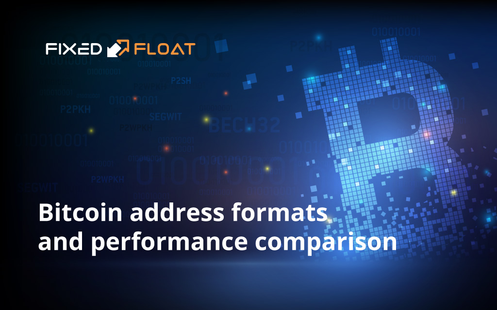

> *作者：FixedFloat*
>
> *来源：<https://fixedfloat.com/blog/guides/bitcoin-address-formats>*
>
> *原文出版于 2020 年 1 月。在 2021 年 11 月，比特币激活了 taproot 升级，因此又多了一种地址类型：P2TR（也称 bech32m 地址，以 “bc1p” 开头）。原文没有也不可能比较 P2TR 的经济性，因此我们在文末提供了另一篇文章作为参考。*
>
> *此外，这里比较的都是单签名用法下的性能，没有比较多签名用法下的性能。但总的来说，使用更新格式的地址几乎总是有经济性优势。*

目前比特币有三种地址类型：

1. **P2PKH 地址**，也叫 “传统地址（Legacy address）”，是比特币的第一种地址，以数字 “1” 开头，长度为 26 个到 36 个字符。使用 P2PKH 发送资金，平均手续费会比从隔离见证（Segwit）地址更高，因为这种过时的地址更长。
   - 例子： ` 1A1zP1eP5QGefi2DMPTfTL5SLmv7DivfNa ` 
2. **P2SH 地址**，是一种结构与 P2PKH 类似的新地址，但以数字 “3” 开头（不是以 “1” 开头）。P2SH 比上一种地址提供了更复杂的功能。在花费一个 P2SH 地址中的资金时，花费者必须提供一个与 P2SH 地址对应的脚本，并提供能让脚本运行结果为真的数据。但是，普通用户需要知道的只有一件事：相较于 P2PKH，其平均手续费会更少。
   - 例子： ` 3GRdnTq18LyNveWa1gQJcgp8qEnzijv5vR ` 
3. **P2WPKH 地址**，也叫 “Bech32 地址”，是一种高级的地址，以 “bc1q” 开头，而且比 P2PKH 和 P2SH 都要长。Bech32 是原生的隔离见证地址（虽然 P2SH 地址也可以是隔离见证的地址），所以 “使用隔离见证地址” 的意思就是 “使用 Bech32 地址”。好处是交易手续费更低。缺点是并非所有钱包都支持。
   - 例子： ` bc1qnkyhslv83yyp0q0suxw0uj3lg9drgqq9c0auzc ` 
   - （译者注：当前几乎所有比特币钱包都已经支持了原生的隔离见证地址。但事实的确是，不是所有的钱包和基础设施都会立即支持最新的地址格式，比如现在就不是所有钱包都支持 P2TR 地址。）

> 译者增补：
>
> 4. **P2TR 地址**，也叫 “Bech32m 地址”，以 “bc1p” 开头，长 62 个字符。作为收款地址时，其体积相较其它地址类型更大；但在发送资金时，其数据体积比其它地址都要小。因此在大部分情况下，P2TR 都已成为最经济（手续费最低）的地址。尤其是在多签名场景中，P2TR 地址使用了一种支持多签名聚合的数字签名方案（Schnorr 签名）；在基础设施支持的前提下，其经济性会显著优于其它地址。
>    - 例子：`bc1pxwww0ct9ue7e8tdnlmug5m2tamfn7q06sahstg39ys4c9f3340qqxrdu9k`

## 比特币地址经济性比较图标

为了简化，我们使用下列三种缩写法：

| I    | P2PKH 地址，以 “1” 开头    |
| ---- | -------------------------- |
| II   | P2SH 地址，以 “3” 开头     |
| III  | Bech32 地址，以 “bc1” 开头 |

| 发送者地址 | 接收者地址 | 平均交易重量 |
| -------- | -------- | ------------ |
| I    | I    | 764  |
| I    | II   | 756  |
| I    | III  | 752  |
| II   | I    | 541  |
| II   | II   | 533  |
| II   | III  | 529  |
| III  | I    | 449  |
| III  | II   | 441  |
| III  | III  | 437  |

结论：

1. 从 P2PKH 地址发起的交易是**最低效的**，因为在所有的例子中，接收者地址对交易重量的影响都不明显；
2. P2SH 作为发送者地址的交易，平均要比 P2PKH 地址作为发送者的交易**便宜 29%** 。
3. Bech32 作为发送者的交易，平均要比 P2PKH 作为发送者的交易**便宜 40%**；要比 P2SH 作为发送者的交易**便宜 15%** 。

> 译者注：
>
> 下图为《[Taproot 及比特币未来的可能](https://www.btcstudy.org/2021/12/30/bitcoin-after-taproot/)》所引用的图片，其中比较的仅仅是不同类型的地址作为输入（发送者）和输出（接收者）时候的大小：
>
> 