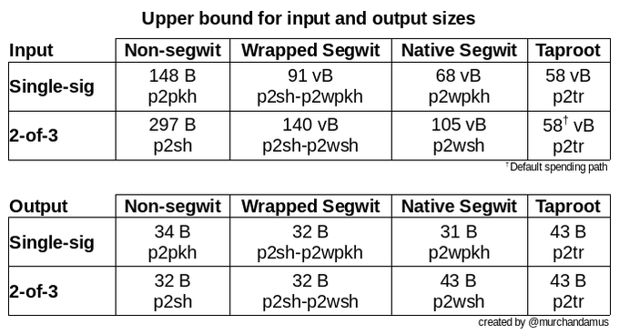

> *作者：Anony*


用户在接触比特币的时候，往往第一时间就会遇到 “地址” 这个概念。在你尝试收取比特币支付时，就需要提供自己的地址。在区块浏览器中查询支付是否已经到账时，往往也以具体的地址为搜索条件。

你可能会以为：“地址就相当于比特币世界里的银行账号，可以用来接收比特币”。但这种理解，在面对钱包使用过程中的一些情形时，可能还是会让你犯迷糊。比如说：在初次使用一款比特币软件钱包时，它可能会请你选择一种地址 “类型”，如：“Bech32（SegWit）”、“P2PKH”、“Nested-SegWit（P2SH）” 等等。甚至，在你要换用另一款软件钱包时，它也会给你惊吓：新的软件钱包可能会给你一组跟原软件钱包完全不同的比特币地址；这时候，该怎么办呢？

本文就是要对比特币的地址概念和地址类型作稍微深入一些的解释，以帮助读者解决在自主保管比特币的过程中可能遇到的一些问题，包括但不限于地址类型的选择以及软件钱包迁移过程中会发生的困扰。

最末一个章节会集中描述读者可能接触到的不同地址的特征和经济性；如果你对技术细节完全不感兴趣，或只是想快速查证资料，可以跳到最后一个章节；但如果你希望规划自主保管的方法，则推荐你从头读起。

要而言之，比特币地址实际上是用于**标准化的比特币脚本**的**关键数据**在经过特殊**编码（转译）**之后结果；特殊的编码方法使之更适合于传递，并且提供了提醒错误的能力；而其**经济性**的区别就来自于其底层的比特币脚本在经济性上的区别。

## 标准化的比特币脚本

众所周知，比特币是一种运行在点对对网络中的电子货币。在开发比特币时，中本聪为这种货币设计了一种后来被称为 “UTXO” 的存在形式。这种形式使得比特币资金不太像放在一个又一个账户里的钱，倒像是一笔又一笔相互独立的支票。这些 “支票” 记录了两种关键信息：该笔资金的面额（以“聪（sat）” 为单位）；脚本公钥（scriptPubkey），用来定义这笔钱在什么情况下可以被花费。脚本公钥就像一种锁，要求特定的钥匙来开启。

中本聪意识到，如果我们可以定制巧妙的锁，比特币就可以更灵活地用在不同场景中。于是，他还设计了一种叫做 “Bitcoin Script” 的编程语言，以及基于 UTXO 的交易验证模式；从而，我们可以编写用作脚本公钥的程序，并且，当相关的资金被花费时，可以依据这样的程序得到验证。

这种创新带来了一个实际的困难：交易在点对点网络中传播时，接收到交易的节点会先运行一些验证工作。如果这种编程语言和编程有内在的漏洞，可以让节点在验证交易的过程中就崩溃，那么，能够利用这种漏洞的交易就可以被用来摧毁整个网络。在交易的自由传播和网络的安全性之间，如何取得平衡呢？

除了有意限制 Bitcoin Script 的灵活性，中本聪还想出了一种办法：将一些已知足够简洁、不会触发故障的脚本定义为 “标准化的比特币脚本” <sup><a href="#note1" id="jump-1">[1]</a></sup>；在花费使用这样的脚本的资金时，交易被当作 “标准的比特币交易”，可以在网络中无碍传播。反之，如果不使用这样的标准化脚本，即使交易是有效的，也只能直接提交给矿工，由矿工打包进区块并挖出之后，再传播到整个网络。这就限制了可能引发安全问题的交易在网络中传播、导致节点崩溃。

最早被实现的标准化比特币脚本有两种：“P2PKH” 和 “P2PK”；顾名思义，它们是在脚本公钥中放置一个公钥（或者一个公钥的哈希值），要求花费资金的交易提供该公钥（背后的私钥）的签名。

一个 P2PKH 脚本公钥是这样的：

```
OP_DUP OP_HASH160 55ae51684c43435da751ac8d2173b2652eb64105 OP_EQUALVERIFY OP_CHECKSIG
```

（来自著名的比特币科普网站：[learn me a bitcoin](https://learnmeabitcoin.com/technical/script/p2pkh/)）

## 地址的概念

标准化的脚本让比特币系统具备了基本的功能（个人可以通过持有私钥来保管比特币、向他人发起电子货币支付）。但是，它依然是一种为计算机而设计的数据 —— 要理解这些字符串的主体是计算机。计算机对字符串的长度并不敏感，也不会在复制数据的过程中出错。而人在许多方面都相反。

问题在于，人作为这个系统的使用者，确实要跟这些数据打交道：当一个人接收比特币支付的时候，TA 所要求的是对方将一笔比特币资金发送到由 TA 控制（或者说 TA 可以成功解锁）的一段比特币脚本中；此外，当 TA 要长期保管自己的资金的时候，TA 可能要备份自己的比特币脚本。

这时候该怎么办呢？像上面那样长长的字符串，显然既不适于传递（太长了），也不适于备份（容易抄错）。

前面我们已经提到，对大部分人都实用的脚本都是**标准化**的，这种标准化意味着，两个脚本仅在其中一处关键数据上有所区别：对两个 P2PKH 脚本来说，它们唯一的区别就是所记录的公钥哈希值不同。因此，在收款时，我们只需提供这个哈希值、以及脚本的类型（它是个 P2PKH 脚本），就足够了。支付方（的软件）会根据这些信息复原出完整的比特币脚本，从而在交易中将比特币发送到正确的地方。

而且，（谙熟工程学的中本聪意识到），我们可以不传递这个哈希值的十六进制形式（`55ae51684c43435da751ac8d2173b2652eb64105`，40 位字符）。借助专门设计的编码方法，我们可以将它转换为更短、更容易正确辨认的形式。

这就是 “地址”：经过编码、携带了关键信息、使我们可以正确复原出比特币脚本的数据。

## 编码方法

### Base58

“Base58”  <sup><a href="#note2" id="jump-2">[2]</a></sup> 是由中本聪发明的编码方法，是从一种著名的编码方法 “Base64” 改造而来。Base64 的字符集包括：所有的数字和大小写字母，还有两种符号（“+” 和 “/”）；总计 64 种字符。而中本聪从中删去了数字 0、大写字母 I 和 O、小写字母 l 以及符号，就成了 Base58。

这种删减是有考虑的。中本聪的自述是：

> 为什么要使用 base58 而不是 base64 呢？
>
> - 不使用 0OIl 是因为这些字符看起来很像，可以用来创建出看起来几乎一模一样的账号。
> - 人们不容易接受账号中会有字母和数字以外的字符。
> - 不使用标点符号的话，在 E-mail 中通常就不会被换行打断。
> - 双击就可以选定整个字符串，因为只有字母和数字。
>
> -- 中本聪，[Bitcoin v0.1 (base58.h)](https://github.com/Maguines/Bitcoin-v0.1/tree/master/bitcoin0.1/src/base58.h#L6C1-L13C3)

地址是要被复原成比特币脚本的，因此，只要一个字符错误，资金就有可能被发送到完全不一样的比特币脚本（可能是完全无法解锁的脚本！）中、导致资金损失；甚至，如果允许使用这样容易造成混淆的字符，恶意软件可以将你的地址悄悄替换成看起来相似、但实际上由攻击者控制的地址，让你在接收支付时丢失资金。

因此，中本聪的考虑是完全有道理的。

在执行 Base58 编码之前，我们还要给关键数据（比如上述 P2PKH 脚本中的哈希值）加上类型码作为**前缀**、并以带前缀的关键数据的连续两次 SHA256 运算结果的前 4 个字节作为**后缀**。

- 前缀可以迅速说明数据的类型和用途；也正因为添加了前缀，同一类型的数据在经过 Base58 编码的结果中，总是会出现相同的开头。这就是为什么我们只需看一个比特币地址的开头，就知道它是什么类型的地址。
- 后缀则可以起到校验和的作用：如果你向软件输入了一个有抄写错误的地址，软件会提醒你可能出错了（尽管无法指明是哪里抄错了）。

即，在开始编码前，我们要构造出这样的字符串：

```
类型码 + 关键数据 + SHA256(SHA256(类型码 + 关键数据))[0:4]
（这里的 “+” 是字符串拼接的意思）
```

以上面的 P2PKH 脚本为例，我们先要给关键数据（`55ae51684c43435da751ac8d2173b2652eb64105`）加上前缀 `00`；然后对此数据运行**连续两次** SHA256 计算，取前 4 个字节（十六进制的 8 个字符，`96ab3cb1`），作为后缀，得到 `0055ae51684c43435da751ac8d2173b2652eb6410596ab3cb1`。最后，运行 Base58 编码，得到：`18p3G8gQ3oKy4U9EqnWs7UZswdqAMhE3r8`。

这段字符串，既包含了用在比特币脚本中的关键信息（公钥哈希值）、又能说明它该如何使用（前缀 `1` 表示应该将它复原成一个 P2PKH 脚本）、还具备检测抄写错误的功能，依然只有 34 个字符，比原先的哈希值还要短。

## Bech32

“Bech32” 是由 BIP 0173 <sup><a href="#note3" id="jump-3">[3]</a></sup> 定义的编码方法，该 BIP 的两位作者是 Pieter Wuille 和 Greg Maxwell 。不过，这种编码也有自身的源流：“Bech” 指的是 “BCH” <sup><a href="#note4" id="jump-4">[4]</a></sup>，是一种由三位数学家分别在 1959 和 1960 年发明的循环纠错编码算法（BCH 这个名字就来自于这三位数学家的姓氏）。而 “32” 则表示，该编码法的字符集只有 32 种字符：小写的英文字母和数字，除去数字 “1”、字母“b”、“i”和“o”。

该 BIP 的考虑是，借着 “隔离见证（SegWit）” 升级的机会，为两种全新的标准化脚本 “P2WPKH” 和 “P2WSH” 的地址使用新的编码方法。

在 BIP 0173 的开头，作者们指出了 Base58 的不理想之处：

- Base58 同时使用大小和小写的英文字母，这使得其数据在绘制成二维码时，无法使用体积更小的 “数字字母表” 模式，只能使用体积更大的 “字节数据” 模式。
- 同时使用大小写也使得它不便于抄写、在手机键盘上输入以及念出来。
- 校验和需要连续两次 SHA256 运算，运算缓慢，而且没有定位错误的功能。
- 大部分可定位错误的编码方法都只适用于字符集大小是质数幂的情形，而 58 并非质数幂。
- Base58 的解码较为复杂，运算也较慢。

于是，Bech32 这种新方法只使用小写字母和数字；在有需要的时候（比如绘制二维码的时候），这些字母可以全部换成大写，从而获得更紧凑的表现形式。同时，Bech32 还具备定位错误的能力：它不仅能发现你抄写错误了，还能指出你的哪几位抄错了（这种发现错误的能力远远优于 Base58）。

实际上，BCH 算法还具有 “纠错” 功能：它不仅能指出你的哪几位抄错了，还能指出它应该是什么字符。然而，BIP 0173 的作者们发现了它内在的危险性：一方面，强化纠错功能会削弱定位错误的功能；另一方面，如果用户过于信任软件的纠错能力，那么软件就有可能将用户输入的错误数据纠正成一个 “有效但无用” 的数据 —— 虽然作为一段 BCH 编码数据，它是有效的了；但是，凭借它复原出来的比特币脚本却有可能不是收款方能够控制的、甚至不是任何人能够控制的。这是极其危险的。因此，BIP 0173 慎重提醒：“除了提醒用户哪几位可能抄错了之外，软件**不应该**实现纠错能力（给出纠正建议）。”

除此之外，Bech32 沿用了 Base58 编码中的模式：

- Bech32 数据的开头会有一段 “带有含义的数据（hrp）”，就类似于 Base58 中的前缀，可以说明这是一段什么样的数据。
  - hrp 可以使用的字符远远多于 32 个；于是，Bech32 还将数字 “1” 作为分隔符，用来分割 hrp 和真正要被解码的数据。
  - 除了比特币，还有许多别的项目也采用了 Bech32 ；不同项目的数据就使用 hrp 来相互区别。这里有一份已注册的 hrp 的列表，非常有趣（但也仅仅是有趣） <sup><a href="#note5" id="jump-5">[5]</a></sup>。
- Bech32 也设计了校验和，占据编码后的数据的最后 6 个字符。

假设我们跟上文的案例一样，使用完全相同的公钥哈希值，它的 P2WPKH 脚本会是这样的：`0 55ae51684c43435da751ac8d2173b2652eb64105`（没错，比原来的 P2PKH 要更简单、更抽象）；而其 Bech32 编码的地址是：`bc1q2kh9z6zvgdp4mf634jxjzuajv5htvsg9ulykp8`，长度是 42 个字符。

### Bech32m

“Bech32m” 是由 BIP 0350 <sup><a href="#note6" id="jump-6">[6]</a></sup> 定义的编码方法。它的提出是因为开发者们在 Bech32 编码中发现了一个漏洞：

当最后一个字符是 “p” 的时候，在该字符前面插入或删除任意数量个 “q”，都不会导致校验和报错，那么校验和机制就完全失去作用了。

如果不再增设标准化的比特币脚本，这问题很容易解决：P2WPKH 地址和 P2WSH 地址都有确定的长度，增加长度校验就好。然而，考虑到未来我们还会增加新的标准化脚本，其地址长度可能发生改变，就有必要修复这个问题。

Bech32m 通过改变 Bech32 校验和生成程序中的一个参数，修复了这个问题。

当前，Bech32m 仅用于编码随 “Taproot” 升级而增加的 “P2TR” 脚本的地址。未来可能用在其它标准化脚本的地址编码中。

## 经济性

在我们理解了地址是一个标准化的比特币脚本的特殊表现形式、地址的类型实际上来自于标准化比特币脚本的类型之后，不同类型的地址何以具有不同的经济性 —— 在花费时可能具有不同的手续费代价 —— 的问题也就迎刃而解。这是因为不同的比特币脚本具有不同的经济性。

为了维持网络的去中心化和安全性，比特币的区块大小是有限制的，能让交易体积更小的脚本就有了经济性上的优势。

在这一方面，带来最大变化的当属 2017 年激活的 “隔离见证（SegWit）” 软分叉。隔离见证在带来两种新的标准化脚本 “P2WPKH” 和 “P2WSH” 的同时，也为这两种脚本设计了全新的交易验证模式：

在传统（Legacy）的比特币脚本中，用于通过脚本公钥所定义的验证程序的数据（比如数字签名）会被放在交易（`scriptSignature` 字段）中；这就带来了所谓的 “交易熔融性” 问题 <sup><a href="#note7" id="jump-7">[7]</a></sup>，阻碍了我们用比特币脚本编程多方参与的应用，甚至会让钱包完全无法跟踪交易。

而隔离见证的交易验证模式，会将这部分数据放在交易之外（`witness` 字段）；而且，隔离见证引入了一种新的度量体积的单位（“virtual byte（vByte）”），放在 witness 字段中的数据，在度量体积时会得到折扣（这是有意的设计，为了让隔离见证的交易具备比传统交易更好的经济性）。

最终的结果是，隔离见证类型的脚本 P2WPKH 和 P2WSH 相比传统脚本 P2PKH 和 P2SH，具有显著更好的经济性：一方面，隔离见证脚本的脚本公钥更简洁；另一方面，传统脚本的签名放在交易中，隔离见证脚本的签名放在交易外，即使数据体积相同，后者的 vByte 也更小。

这里有一张表格，可以说明不同类型的脚本在作为交易的输入和输出时，会占据多大的体积。



<p style="text-align:center">- 图片来自：<a href="https://bitcoinops.org/zh/blog/waiting-for-confirmation/#%E7%AB%9E%E4%BB%B7%E5%8C%BA%E5%9D%97%E7%A9%BA%E9%97%B4">Optech 限定周刊·等待确认</a> -</p>


然后，这里还有一个[交易体积计算器](https://bitcoinops.org/en/tools/calc-size/)，可以告诉你不同数量的某一类型脚本会造成多大体积的交易。

注意：在考虑经济性时，不能只比较脚本在作为输入时候的体积，因为，一般来说比特币交易都会有 “找零输出”（你为交易提供的资金数量往往大于支付额，因此会把一些钱转回给自己）。找零输出通常会使用跟本钱包收款地址相同的类型的脚本。

## 地址类型

本章节将介绍用户可能会接触到的不同类型的地址的特征和经济性。

### P2PKH

- 使用 Base58 编码法。以数字 “1” 开头，长度一般是 34 个字符。
- 用于单签名钱包。
- 经济性较差。
- 例子（同上文）：`18p3G8gQ3oKy4U9EqnWs7UZswdqAMhE3r8`

## P2SH

- 使用 Base58 编码法。以数字 “3” 开头，长度一般是 34 个字符。
- 用户最常接触到的 P2SH 地址实际上是一种被称作 “Nested SegWit（P2SH）” 的脚本的地址，这个名字的意思是 “封装了隔离见证脚本的 P2SH 脚本”。
  - 能够实现这种封装是 P2SH 本身的能耐，但定义这种封装的根本目的是应对钱包软件的兼容性问题。由于隔离见证的地址使用了全新的编码方法，不实现新方法的钱包软件会将隔离见证地址识别为错误输入、无法从中复原出有效的比特币脚本。Nested SegWit P2SH 脚本则提供了一种恰当的折中：支付者的钱包（不论升不升级）都会将这样的地址理解为普通的 P2SH 地址，然后复原出一个 P2SH 脚本、正确构造交易；接收者的后续花费资金时，又可以（凭借支持隔离见证的钱包软件）获得一部分由隔离见证带来的好处。
- 在同为单签名钱包时，经济性比 P2PKH 更好。
- 可用于多签名钱包（不论是否使用隔离见证特性）。
- 例子：`38Y2PBD1mihxtoVncaSz3oC2vRrjNF8sA2`（这个 P2SH 脚本封装了跟上文一样的 P2PKH 脚本，尽管这没有什么好处）

### P2WPKH

- 原生的隔离见证脚本。使用 Bech32 编码法，以数字和字母 “bc1q” 开头，长度是 42 个字符。
- 用于单签名钱包。
- 经济性显著好于 P2PKH，也好于 Nested SegWit P2SH。
- 例子（同上文）：`bc1q2kh9z6zvgdp4mf634jxjzuajv5htvsg9ulykp8`

### P2WSH

- 原生的隔离见证脚本。使用 Bech32 编码法，以数字和字母 “bc1q” 开头，长度是 62 个字符。
- 通常用于多签名钱包。
- 作为多签名钱包时，经济性显著好于 P2SH。
- 例子：`bc1q56cuwyqlmq64aq0y3c8swd8a9gefe4wf7faxe2uyatyahfrly5aq0e6mfc`（这个 P2WSH 脚本封装了跟上文一样的 P2PKH 脚本，尽管这没有什么好处）

## P2TR

- 原生的隔离见证脚本（Taproot 是 “隔离见证 v1”）。使用 Bech32m 编码法，以 “bc1p” 开头，长度是 62 个字符。
- 既可用于单签名钱包，又可用于多签名钱包。
- 作为单签名钱包时，经济性略好于 P2WPKH，但已经几乎没有区别（此处是假设是将一个输入和一个找零输出作为交易的固有开销；使用的输入越多，P2TR 优势越大）。
- 作为多签名钱包时，借助一些 Schnorr 签名聚合算法的帮助，经济性可以比 P2WSH 还要好。但在本文撰写的时间（2024 年 11 月），钱包软件还很少实现这样的聚合算法，这是因为这些算法在交互上的复杂性。
- P2TR 与以前的比特币标准脚本的重大区别在于：原来的脚本都会区分单签名钱包用户和高级脚本功能（“智能合约”）的用户，前者会使用公钥哈希值脚本，而后者（包括多签名装置和闪电通道这样的高级装置）会使用赎回脚本哈希值脚本；P2TR 第一次统一了两者，让我们无法从 脚本/地址 的外在形态上直接推测其用途。因此，从长远来看，P2TR 会有更好的隐私性。
- 目前为止，还不是所有钱包都支持 P2TR 地址（但几乎所有钱包都支持 P2WPKH 和 P2WSH）。用户的选择范围和迁移能力都比较受限。此外，对基于 P2TR 的多签名装置的支持更是少之又少。
- 例子（随机选出）：`bc1pxy5r3slcqc2nhc0r5698gmsqwruenj9c8pzmsy5cedp3649wyktstc6z3c`

## 结语

一个地址就代表着一个具体的比特币脚本；这样的比特币脚本是标准化的，凭借地址中的信息就可以完整复原出来。使用专门的编码方法，让地址变得更加紧凑，并具备检查抄写错误的功能。而不同地址类型的经济性，就来自于其背后的标准化比特币脚本的经济性。

## 附录 A. 描述符

在 “地址的概念” 一节，我们已经提到，在两个场景中，用户可能需要一种紧凑而可靠的脚本记录：支付（传递）场景和长期保管场景。

而在 “编码方法” 一节，我们可以看出，这些编码方法的设计主要基于传递过程，而非长期保管场景。那么，在保管场景中，应如何保存地址？

幸运的是，我们如今有了一种恰当的方法，来表示一组（而非一个）地址，它就是 “输出（地址）描述符（output descriptor）”。

自比特币诞生、地址的概念出现以来，自主保管的技术和安全习惯都已改进了很多。一个重大的进步是所谓的 “层级确定式（HD）钱包”，其理念是用一段秘密材料按确定式随机算法推导出许多私钥，进而得出许多地址，从而一方面能够满足 “不重复使用地址” 的安全习惯，又能尽可能减少备份私钥的负担。

描述符也基于这一概念，它的做法是，将地址的类型以及生成这组地址的步骤用明文表示出来，再加上校验和。例如：

```
wpkh([8b47f816/84h/0h/0h]xpub6C8vwWQ[...]NgW2SnfL/<0;1>/*)#c38kz2nr
```

从上面这段文字中，我们可以看出，它表示的是一组 P2WPKH 地址，而用在这组地址中的公钥，则是从一个指纹为 `8b47f816` 的主公钥中根据 `84h/0h/0h` BIP32 派生路径中派生出来的；并且，使用 `0` 和 `1` 的派生路径来区分收款地址和找零地址。最后， `c38kz2nr` 是校验和，可以校验有无抄写错误。

这样的字符串非常适合长期保管，也非常适合用于钱包迁移，因为它已将生成这组地址的过程完整地描述了。

## 脚注

1.<a id="note1"> </a>https://en.bitcoin.it/wiki/Script#Script_examples <a href="#jump-1">↩</a>

2.<a id="note2"> </a>https://learnmeabitcoin.com/technical/keys/base58/ <a href="#jump-2">↩</a>

3.<a id="note3"> </a>https://github.com/bitcoin/bips/blob/master/bip-0173.mediawiki <a href="#jump-3">↩</a>

4.<a id="note4"> </a>https://en.wikipedia.org/wiki/BCH_code <a href="#jump-4">↩</a>

5.<a id="note5"> </a>https://github.com/satoshilabs/slips/blob/master/slip-0173.md <a href="#jump-5">↩</a>

6.<a id="note6"> </a>https://github.com/bitcoin/bips/blob/master/bip-0350.mediawiki <a href="#jump-6">↩</a>

7.<a id="note7"> </a>https://www.btcstudy.org/2022/10/07/segregated-witness-benefits/#%E4%BF%AE%E5%A4%8D%E7%86%94%E8%9E%8D%E6%80%A7%E9%97%AE%E9%A2%98 <a href="#jump-7">↩</a>